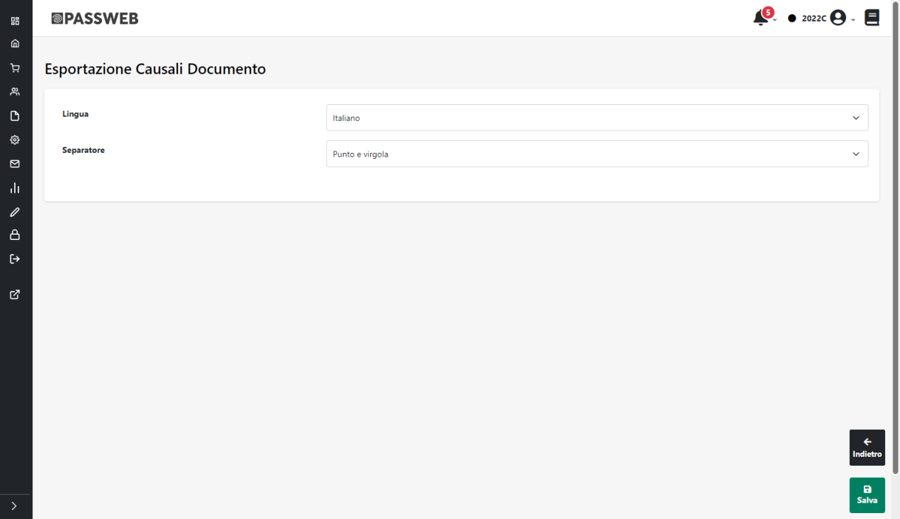
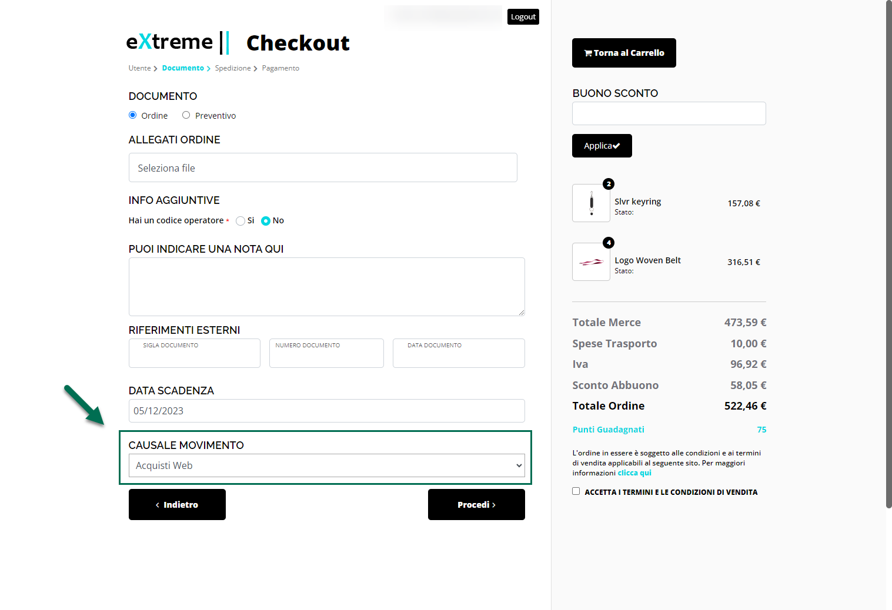
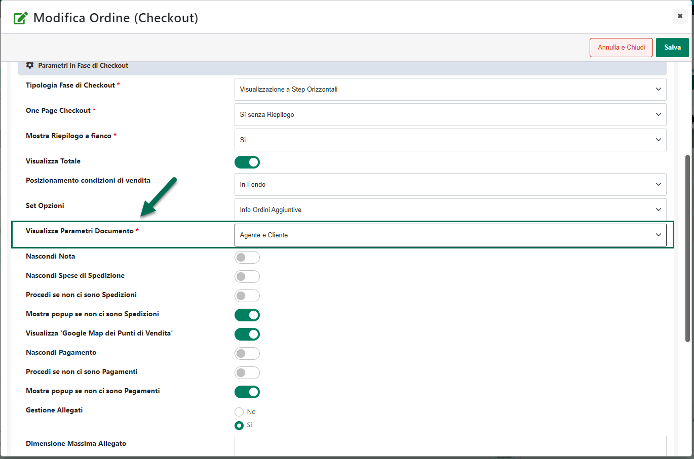
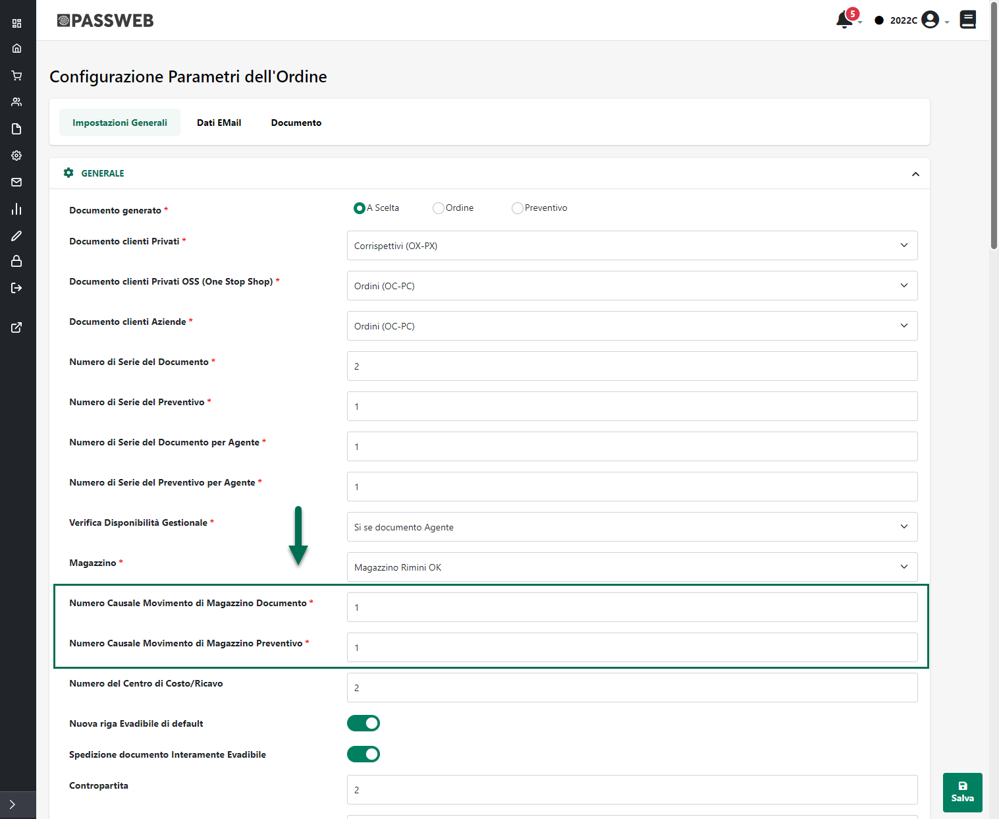
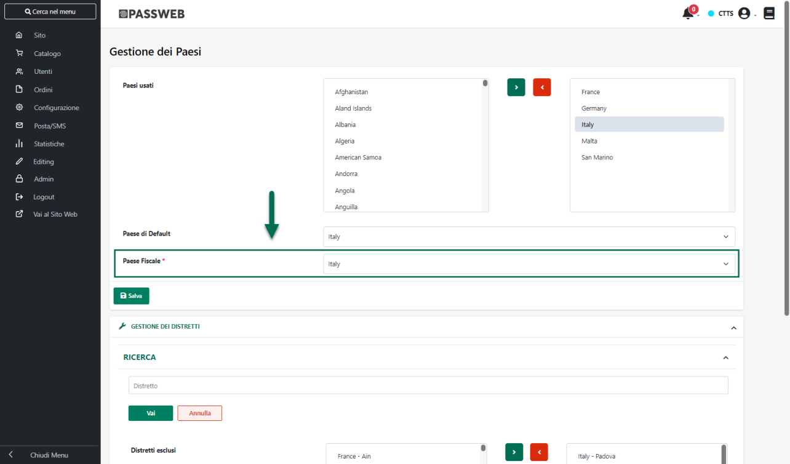
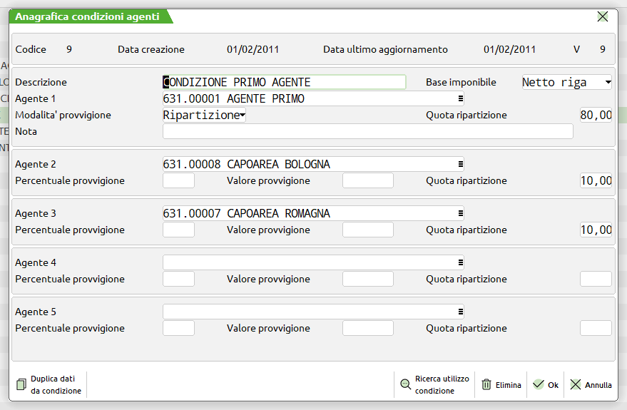

# ATTIVAZIONE API MAGENTO

Come evidenziato nei precedenti capitoli di questo manuale a livello di
dati articolo lo scambio di informazioni tra Passweb e Magento può
avvenire via API oppure mediante la creazione e lo scambio di appositi
file CSV. A livello di importazione ordini invece l'integrazione Passweb
-- Magento può avvenire unicamente via API.

In ogni caso, indipendentemente dalla particolare metodologia di
pubblicazione articoli adottata e/o dal fatto di voler gestire o meno
anche l'importazione ordini, occorre considerare sempre che Passweb
necessita comunque di connettersi via API alla relativa installazione
Magento quanto meno per poter leggere informazioni fondamentali per una
corretta configurazione dell'Account e per poter poi creare e gestire
correttamente le varie Inserzioni

**In conseguenza di ciò diventa dunque obbligatorio e di fondamentale
importanza attivare e configurare correttamente le API Magento**.

Nel seguito di questo capitolo vedremo dunque la procedura da seguire
per poter attivare correttamente queste API e come poter prelevare tutte
le informazioni necessarie per poter configurare l'integrazione tra le
due piattaforme.

- La prima cosa da fare sarà quella di accedere alla propria
  installazione Magento con le credenziali di amministratore e portarsi
  poi all'interno della sezione "**System -- Extension -- Integration**"

- Una volta effettuato l'accesso a questa sezione cliccare sul pulsante
  "**Add New Integration**" presente nella parte alta della pagina

- Assegnare un nome all'integrazione che si sta configurando in maniera
  tale da poterla poi distinguere da eventuali altre integrazioni
  presenti sulla propria installazione Magento (campo "**Name**"
  all'interno della sezione "**Integration Info**")

- Portarsi poi all'interno della sezione "**API**" e impostare il
  parametro "**Resource Access**" sul valore "**All**"

> Cliccare quindi sul pulsante "**Save**" presente nella parte alta
> della pagina in maniera tale da poter salvare le impostazione appena
> settate

- Arrivati a questo punto sarà ora necessario attivare l'integrazione
  appena impostata in maniera tale da poter poi prelevare il token di
  configurazione da impostare in Passweb.

> All'interno della sezione "**Integrations**" individuare quindi
> l'integrazione appena creata, cliccare sul pulsante "**Activate**"

> e successivamente nella schermata di riepilogo delle API che verranno
> effettivamente attivate cliccare sul pulsante "**Allow**"

- Una volta attivate le API verranno visualizzate tutte le chiavi
  necessarie per sfruttare questo tipo di integrazione tra cui anche l'
  **Access Token** necessario per attivare l'integrazione con Passweb

> **ATTENZIONE!** le informazioni presenti all'interno della maschera
> sopra evidenziata saranno accessibili, una volta terminata
> l'attivazione, in un qualsiasi momento andando in modifica dell'
> integrazione in esame

