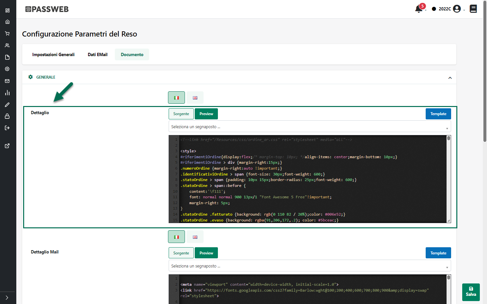
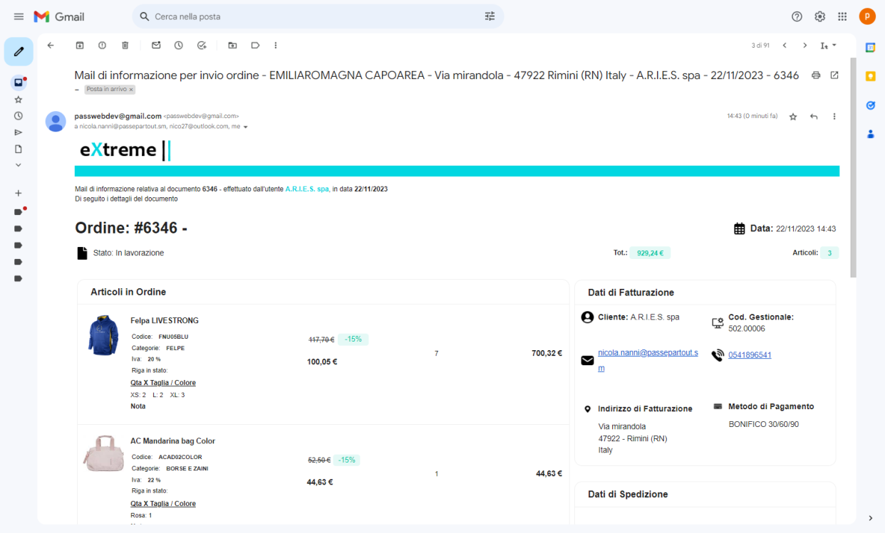

# CONFIGURAZIONE ACCOUNT

Una volta completati tutti i passaggi descritti nel precedente capitolo
di questo manuale per connettere Passweb a Magento occorrerà ora creare
e configurare correttamente un apposito Account di integrazione.

Nello specifico sarà necessario:

- Portarsi, nel Wizard di Passweb, all'interno della sezione "**Catalogo
  -- Altri Marketplace -- Gestione Account**" e cliccare sul pulsante
  "Aggiungi Account" presente nella parte alta della pagina

- All'interno della maschera "Dati Account" assegnare un nome
  all'Account che si sta configurando (campo **Descrizione**) e
  selezionare, all'interno del campo "**Marketplace**" l'opzione
  "**Magento 2**"

- Compilare i campi presenti all'interno della sezione "**Credenziali**"
  con i dati di seguito indicati:

  - **Host**: url del sito magento con cui realizzare l'integrazione

  - **Protocollo Host:** selezionare il protocollo (http o https)
    attualmente in uso sul proprio sito Magento

  - **Token:** token di accesso alle API Magento.

> Per ottenere questa informazione è sufficiente accedere al Back end
> del proprio sito Magento, portarsi all'interno della sezione "System
> -- Extension -- Integration", individuare tra quelle presenti in
> elenco l'integrazione relativa a Passweb (per maggiori informazioni in
> merito si faccia riferimento al precedente capitolo di questo manuale)
> e cliccare sul pulsante di modifica (edit)

> Individuare quindi all'interno della sezione "**Integration Details**"
> il parametro **Access Token** e copiarne il valore all'interno del
> campo Passweb in esame

- **Store View Code -- visualizzato solo dopo aver effettuato un primo
  salvataggio dell'Account in esame**

> Consente di indicare, selezionandola dall'apposito menu a tendina, la
> Store View Magento con cui si vuole realizzare l'integrazione.
>
> In questo senso occorre sottolineare che nella configurazione più
> semplice (unico Website) Magento viene utilizzato, generalmente, per
> gestire un unico negozio, con un unico sito e un\'unica lingua. Oltre
> a questo è però possibile trovarsi di fronte anche ad installazioni
> con un unico Website all'interno del quale vengono gestiti più Store
> in più lingue (Store view) e/o ad installazioni complesse con più
> Website (siti multipli gestiti dallo stesso pannello di back end) con
> all'interno più Store in più lingue.
>
> Per poter visualizzare le Store View attualmente attive in Magento è
> sufficiente accedere alla sezione "**Store -- Settings -- All
> Stores**"

> Per maggiori informazioni in merito alla gestione delle Store View e/o
> alle varie possibili configurazioni Magento si rimanda alla specifica
> documentazione di prodotto
>
> Fatta questa considerazione la cosa importante da tenere sempre ben
> presente è che **l'integrazione Passweb -- Magento lavora a livello di
> singola Store View**.
>
> Indipendentemente dalla configurazione Magento con cui avremo a che
> fare, all'interno di questo campo andrà sempre impostata, quindi, la
> Store View con cui si desidera effettivamente realizzare
> l'integrazione.
>
> Sulla base di quanto appena detto risulta poi evidente che **nel
> momento in cui il sito Magento con cui si vuole realizzare
> l'integrazione dovesse essere gestito in più lingue, sarà necessario
> creare diversi Account e diverse Inserzioni per ciascuna delle Store
> View, e quindi delle lingue effettivamente gestite, su questa
> piattaforma.**

Una volta impostati i principali parametri di configurazione, cliccando
sul pulsante "**Salva**" compariranno nuove sezione (Metodi di
pubblicazione, Articoli, Ordini, Clienti, Schedulazione, Download CSV)
all'interno delle quali poter configurare in maniera più dettagliata
altri aspetti dell'integrazione.

Per maggiori informazioni in merito a ciascuna di queste sezioni si
vedano i successivi capitoli di questo manuale.

##### METODI DI PUBBLICAZIONE ARTICOLI

All'interno di questa sezione è possibile decidere quale dovrà essere il
metodo adottato per la pubblicazione dei dati articolo sulla piattaforma
terza.

In questo senso dunque è bene ricordare che, come già indicato nei
precedenti capitoli di questo manuale, Passweb offre due diverse
modalità di esportazione dei dati articolo:

- **via API**: i dati articolo verranno trasferiti ed inseriti sulla
  piattaforma terza in maniera automatica sfruttando, appunto, le API
  messe a disposizione dalla piattaforma stessa

> In questo caso il processo di pubblicazione dipende ovviamente, oltre
> che dalle elaborazioni interne a Passweb, anche dai tempi di risposta
> delle relative API.
>
> Ipotizzando un tempo di pubblicazione del singolo articolo attorno ai
> 5 secondi la pubblicazione di 1000 articoli impiegherebbe un tempo
> pari all\'incirca a 1.5 ore. Nel momento in cui i tempi di
> pubblicazione del singolo articolo dovessero raddoppiare passando a 10
> secondi la pubblicazione di 1000 articoli impiegherebbe all\'incirca
> un tempo pari a 3 ore.
>
> **ATTENZIONE! In considerazione di ciò la pubblicazione di articoli
> via API è consigliata solo per un numero di articoli inferiore a
> 10000**
>
> Allo stesso modo, prima di adottare questo specifico metodo di
> pubblicazione, si consiglia sempre di valutare attentamente quelli che
> sono i tempi effettivi richiesti per il trasferimento delle
> informazioni in relazione al numero complessivo di articoli
> effettivamente gestiti e a quelli che sono i tempi di risposta delle
> API presenti sulla propria installazione Magento.

- **via CSV**: i dati articolo verranno pubblicati all'interno di
  appositi file csv. Tali file potranno poi essere:

  - scaricati direttamente dal Wizard di Passweb e uplodati manualmente
    sulla piattaforma terza

  - accessibili ad uno specifico url (sotto il dominio assegnato al
    proprio connettore Passweb)

  - copiati automaticamente all'interno di un'area condivisa (Ftp,
    Google Drive ...) stabilita in fase di configurazione del proprio
    Account di integrazione

> Adottando questo metodo di pubblicazione sarà possibile, ovviamente,
> avere un maggior controllo relativamente a quelle che sono le
> informazioni da inserire sulla piattaforma terza.
>
> Sarà possibile, ad esempio, sviluppare processi personalizzati di
> elaborazione dei dati presenti all'interno dei file csv prodotti da
> Passweb oppure si potrebbe pensare di utilizzare anche uno dei tanti
> moduli di importazione massiva disponibili per la piattaforma terza.
> Infine, non dovendo passare da singole chiamate API ma potendo
> inserire massivamente il contenuto dei file prodotti da Passweb
> direttamente nel database del proprio sito Magento anche i tempi di
> upload delle informazioni potrebbero ridursi sensibilmente rispetto ad
> una pubblicazione via API.
>
> Questo tipo di pubblicazione è quindi assolutamente da preferirsi nel
> momento in cui il numero di articoli gestiti dovesse essere
> particolarmente elevato (dell'ordine delle decine di migliaia)
>
> **ATTENZIONE**! **In ogni caso, in questa configurazione un' eventuale
> elaborazione dei file csv prodotti da Passweb così come l'effettivo
> upload dei relativi dati nella piattaforma terza restano operazioni in
> carico a chi gestisce effettivamente lo specifico sito Magento**

I parametri presenti all'interno del tab "**Metodi di pubblicazione**"
consentono quindi di settare, in relazione al metodo di pubblicazione
scelto, i diversi parametri di configurazione.

Nello specifico il campo:

**Modalità di pubblicazione articoli:** consente di impostare quello che
dovrà essere il metodo utilizzato per la pubblicazione dei dati articolo
sulla piattaforma terza. E' possibile selezionare uno dei seguenti
valori:

- **API:** selezionando questa opzione la pubblicazione dei dati
  articolo sulla piattaforma terza avverrà sfruttando completamente le
  API messe a disposizione dalla piattaforma stessa. Non sono quindi
  richiesti, per ovvie ragioni, altri specifici parametri di
  configurazione

- **CSV**: in questo caso la pubblicazione dei dati articolo avverrà
  mediante la creazione di appositi file csv il cui contenuto dovrà poi
  essere importato sulla piattaforma terza. In queste condizioni sarà
  quindi necessario impostare anche tutta una serie di altri parametri
  necessari per configurare in maniera corretta la creazione dei file
  csv e il repository in cui andarli poi ad inserire.

> Per maggiori informazioni relativamente alla pubblicazione articoli
> via csv si rimanda a quanto indicato nel successivo capitolo di questo
> manuale.

##### PUBBLICAZIONE ARTICOLI VIA CSV

Come precedentemente indicato nel momento in cui si dovesse decidere di
optare per una pubblicazione articoli via csv, sarà necessario impostare
poi anche tutta una serie di parametri che consentiranno di
personalizzare, secondo le specifiche esigenze del caso, il processo di
creazione e gestione di questi stessi file.

In particolare dunque il campo

**Separatore File CSV:** consente di impostare, selezionandolo da un
apposito menu a tendina, il carattere da utilizzare, in fase di
creazione del file csv, come separatore dei campi

**Modalità scrittura file:** consente di decidere quale dovrà essere il
metodo utilizzato per gestire i contenuti del file csv a seguito di
pubblicazioni successive. E' possibile selezionare uno dei seguenti
valori:

- **In aggiunta (append)**: selezionando questa opzione i dati generati
  a seguito di una nuova pubblicazione verranno aggiunti (in append) a
  quelli già presenti all'interno dello stesso tipo di file.

> In queste condizioni, dunque, nel momento in cui un determinato
> articolo dovesse essere oggetto di due pubblicazioni successive (ad
> esempio perché risulta variato il suo prezzo o la sua giacenza) dopo
> l'ultima pubblicazione all'interno del file csv troveremo, per
> l'articolo in esame, due distinte entry una per ogni pubblicazione
> effettuata. All'interno del file csv è comunque presente una colonna
> con l'indicazione della data della pubblicazione che ha prodotto
> quella specifica entry.
>
> Nel momento in cui si dovesse quindi decidere di lavorare in queste
> condizioni occorre sempre tenere in considerazione alcune cose di
> fondamentale importanza. Nello specifico:

- **Passweb produrrà file csv distinti per ogni singola lista di
  vendita** per cui pubblicazioni successive di articoli appartenenti ad
  una stessa lista andranno in append sui relativi file senza modificare
  quelli prodotti a seguito di operazioni di pubblicazione di articoli
  appartenenti a liste diverse.

- **In fase di importazione dati su Magento, è di fondamentale
  importanza considerare che all'interno del file possono essere
  presenti più entry per lo stesso prodotto evitando quindi di andare
  poi a creare, a seguito dell'importazione, articoli distinti con lo
  stesso Riferimento**

- **Tra una pubblicazione e l'altra è necessario verificare attentamente
  di non aver variato eventuali specifiche custom presenti
  nell'Inserzione utilizzata per la pubblicazione** (per maggiori
  informazioni relativamente alla gestione delle Specifiche Custom si
  veda quanto indicato nel precedente capitolo "*Altri Marketplace --
  Gestione Specifiche*" di questo manuale).

> Aggiungendo o eliminando delle specifiche custom tra una pubblicazione
> e l'altra, si andrebbe infatti a variare il formato del tracciato
> record utilizzato nei file csv prodotti da Passweb e questo potrebbe,
> ovviamente, causare delle incoerenze nei dati presenti all'interno del
> file con conseguenti problemi in fase poi di importazione dati sulla
> piattaforma terza.
>
> **ATTENZIONE! Nel momento in cui si dovesse decidere di utilizzare "In
> append" come modalità di scrittura file è di fondamentale importanza
> ricordarsi sempre di svuotare il repository utilizzato per la
> pubblicazione dei file ogni qual volta dovessero essere apportate
> modifiche alle specifiche presenti nelle Inserzioni utilizzate per la
> pubblicazione e, conseguentemente, al tracciato record dei file
> prodotti**

- **Sovrascrivi**: selezionando questa opzione i file generati a seguito
  di una determinata pubblicazione andranno sempre e comunque a
  sovrascrivere quelli attualmente presenti nel repository utilizzato (e
  relativi ovviamente alla stessa lista di vendita). Ovviamente nel
  momento in cui nel repository non dovesse essere presente quella
  particolare tipologia di file questo verrà ricreato da zero.

> **In ogni caso, in queste condizioni, i file csv all'interno del
> repository conterranno sempre e soltanto i dati relativi all'ultima
> pubblicazione effettuata**

- **Crea sempre nuovo file**: selezionando questa opzione verranno
  prodotti, a seguito di ogni nuova pubblicazione, sempre e comunque
  file distinti senza eliminare o modificare in alcun modo quelli
  attualmente presenti nel repository utilizzato per la pubblicazione

**Nome file CSV:** consente di personalizzare parte del nome dei file
csv prodotti da Passweb aggiungendogli una specifica stringa.

**ATTENZIONE!** Il campo "Nome file CSV" consente di personalizzare solo
parte del nome dei file prodotti da Passweb

In generale occorre infatti considerare che, nel caso di integrazione
con Magento, Passweb creerà un unico file contenente le diverse
tipologie di articoli gestiti (semplici e configurabili) con nome

**Articoli_idListaVendita_timestamp_NomeFileCSV.csv"**

dove

- **Articoli\_** è una parte non modificabile del nome file

- **idListaVendita\_** è una parte non modificabile del nome file che
  indica l'**id** della lista di vendita cui appartengono gli articoli
  presenti nel file csv

- **timestamp\_** è una parte del nome file gestita direttamente da
  Passweb che riporta il timestamp (data e ora) della pubblicazione che
  ha prodotto quel determinato file

- **NomeFileCSV** è la parte variante del nome file determinata sulla
  base della stringa impostata per il campo "Nome File CSV"

**ATTENZIONE! Una volta definito quello che dovrà essere il nome dei
file prodotti da Passweb in fase di pubblicazione articoli è di
fondamentale importanza non andare poi a modificarlo**

In questo senso infatti è bene sottolineare che in fase di salvataggio
sul repository esterno dei file prodotti a seguito della pubblicazione
di una determinata lista articoli, Passweb controllerà, per prima cosa,
se nella cartella indicata sono già presenti file dello stesso tipo
inseriti a seguito di pubblicazioni precedenti (**il controllo verrà
effettuato analizzando le parti invarianti del nome file escluso
ovviamente il timestamp**) e:

- in caso positivo eliminerà questi file sostituendoli con quelli
  prodotti dalla pubblicazione in corso. Il nome dei nuovi file resterà
  dunque invariato nei suoi elementi non modificabili ad eccezione del
  timestamp che riporterà sempre data e ora della pubblicazione in
  esame. L'effettivo contenuto di questi file (quindi il fatto che
  all'interno del file stesso siano presenti solo i dati dell'ultima
  pubblicazione o che questi vadano in append ai dati già presenti)
  dipenderà invece da come è stato settato il parametro "**Modalità
  scrittura file**" precedentemente analizzato

- in caso negativo Passweb provvederà semplicemente a ricreare da zero i
  relativi file senza preoccuparsi di cancellare eventuali altri file
  presenti nella stessa cartella di appoggio

In queste condizioni dunque, nel momento in cui si dovesse modificare,
tra una pubblicazione e l'altra, per una qualsiasi ragione, la parte
invariante del nome file, a seguito di una nuova pubblicazione verranno
creati sempre e comunque dei nuovi file seguendo le specifiche indicate
all'interno di questo capitolo.

Se invece il parametro "**Modalità di scrittura file**" dovesse essere
impostato sull'opzione "**Crea sempre nuovo file**" in fase di
pubblicazione Passweb non effettuerà alcun tipo di controllo sugli
elementi eventualmente presenti nella cartella di appoggio ma si
limiterà a creare sempre e comunque file distinti con all'interno i dati
relativi alla sola pubblicazione in esame.

Una volta compreso come impostare Passweb per creare questi file CSV,
resta ora da capire come gestirne il contenuto e come renderli
effettivamente disponibili alla piattaforma terza.

In questo senso, per quel che riguarda la gestione dei contenuti il
tutto dipende, essenzialmente, da come verrà poi impostata l'Inserzione
utilizzata per la pubblicazione e da quelli che saranno i campi per essa
gestiti.

**E' con l'Inserzione infatti che andremo a definire esattamente quali
informazioni dovranno essere passate alla piattaforma terza (e inserite
quindi nei relativi file csv) per ogni singolo prodotto coinvolto.**

Dal punto di vista strutturale i file csv prodotti da Passweb avranno in
testata:

- Tutti i campi richiesti dalla relativa funzione di import articoli
  presente a default in Magento e indicati anche nel file di esempio
  scaricabile direttamente dal back end di Magento stesso alla pagina
  "**Sistema -- Import**"

- Alcuni campi aggiunti e gestiti automaticamente da Passweb tra cui ad
  esempio:

  - **category_ids**: campo all'interno del quale verranno inseriti
    (separati da ,) gli id delle categorie merceologiche associate al
    relativo prodotto. Questo campo verrà valorizzato nel csv sulla base
    delle impostazioni settate nella relativa Inserzione per la
    specifica "**Categories**"

  - **related_skus**: campo contenente gli identificativi Magento dei
    prodotti correlati all'articolo in esame

  - ...

- Eventuali campi corrispondenti a Specifiche Custom codificate
  all'interno della relativa sezione del Wizard e correttamente gestite
  nell'Inserzione utilizzata per la pubblicazione

> **ATTENZIONE!** eventuali campi corrispondenti a Specifiche Custom
> verranno aggiunti sempre in coda ai campi presenti a default
> all'interno del file csv e saranno facilmente riconoscibili in virtù
> del fatto che il loro nome inizia sempre con "custom\_".

**ATTENZIONE!** **Non tutti i campi presenti a default nei file csv
prodotti da Passweb sono al momento gestibili con delle corrispondenti
Specifiche "Standard"**. Nel momento in cui l'esigenza dovesse essere
quindi quella di valorizzare uno dei campi dei file csv mediante una
determinata Specifica non ancora presente nelle Inserzioni Passweb, sarà
necessario farne apposita richiesta a Passepartout che valuterà poi la
possibilità di inserirla tra le Specifiche "Standard". In alternativa è
sempre possibile creare e gestire apposite Specifiche Custom operando
dalla relativa sezione del Wizard.

Detto delle intestazioni, per quel che riguarda invece le singole entry
dei file csv, i valori presenti per ogni riga (e quindi per ogni
articolo) in corrispondenza della relativa colonna dipenderanno dal
fatto di aver inserito o meno la corrispondente specifica
nell'Inserzione utilizzata per la pubblicazione e, ovviamente, da come
questa stessa specifica è stata mappata e valorizzata.

In virtù di ciò, nel momento in cui nell'Inserzione utilizzata per la
pubblicazione dovessero essere gestite, ad esempio, le specifiche
"**Description**" e "**Short Description**" allora le righe del file csv
relative agli articoli pubblicati mediante l'Inserzione in esame avranno
le colonne "**description**" e "**short_description**" valorizzate con
la "Descrizione" e la "Descrizione breve" dei corrispondenti prodotti,
descrizioni queste che verranno prelevate esattamente dai campi
impostati in fase di mapping della relativa specifica.

Se invece le due specifiche "**Description**" e "**Short Description**"
non dovessero essere gestite nell'Inserzione, il file csv manterrà
comunque come intestazioni le relative colonne ma, in questo caso, per
ogni articolo coinvolto nell'Inserzione, e quindi per ogni singola riga
del file csv, i campi corrispondenti a queste colonne saranno,
ovviamente, non valorizzati.

Infine, occorre anche considerare che:

- determinati campi del file csv, per ovvie ragioni, saranno sempre
  valorizzati indipendentemente da quelle che sono le specifiche
  effettivamente gestite nella corrispondente Inserzione. E' il caso ad
  esempio:

  - del **codice articolo** che verrà sempre inserito in corrispondenza
    della colonna "**sku**"

  - della **quantità di prodotto disponibile** che verrà sempre inserito
    in corrispondenza della colonna "**qty**"

  - del **prezzo articolo** che verrà sempre inserito in corrispondenza
    della colonna "**price**"

  - ...

- Per i campi che accettano valori multipli e che sono gestiti in
  automatico da Passweb (es. categorie merceologiche) come carattere di
  separazione dei singoli valori verrà utilizzata sempre la ","

> Ovviamente nel momento in cui il campo che accetta valori multipli
> dovesse essere gestito con una specifica mappata, ad esempio, con un
> Attributo Passweb, la valorizzazione del relativo attributo dovrà
> essere gestita manualmente utilizzando anche come separatore dei
> singoli valori un carattere adeguato.
>
> In questo senso il separatore potrebbe anche essere un carattere
> diverso dalla "," ed andrebbe poi dichiarato e gestito in fase di
> importazione direttamente su Magento. **Considerando comunque che
> Passweb, come detto, utilizza come carattere di separazione dei valori
> multipli proprio la "," è consigliabile, al fine di evitare problemi o
> confusioni in fase di importazione, utilizzare sempre questo stesso
> carattere come separatore di eventuali valori multipli**.

- Per quel che riguarda infine i campi corrispondenti ad attributi o
  elementi di variazione legati ad articoli strutturati (es. taglie e/o
  colori) Passweb provvederà a valorizzarli automaticamente con la
  notazione effettivamente richiesta da Magento. In questo senso si
  consiglia sempre di valutare attentamente quelli che sono i requisiti
  richiesti da Magento (e/o dallo specifico modulo di importazione
  adottato) per l'import di prodotti configurabili (es. attributi e
  valori già creati su Magento e associati ad un determinato set,
  categorie merceologiche di destinazione già presenti su Magento ...)

**ATTENZIONE!** Il link "**Scarica File CSV di esempio**" presente
all'interno del tab "Metodi di pubblicazione" consente di scaricare uno
zip contenente degli esempi di file csv che possono essere prodotti da
Passweb a seguito di una pubblicazione articoli

Ovviamente in questi file di esempio sono presenti solo i campi Standard
e non quelli legati ad eventuali Specifiche Custom.

**Proprio per questo è sempre consigliabile effettuare una prima
pubblicazione di prova per verificare esattamente la struttura dei file
prodotti da Passweb e quelli che sono i dati in essi contenuti.**

Solo dopo aver verificato struttura e contenuto dei file csv sarà
infatti possibile impostare, secondo le specifiche esigenze del caso, la
procedura più corretta di upload dei dati sulla piattaforma terza,
**procedura questa che, come più volte evidenziato, dovrà comunque
essere eseguita esternamente a Passweb e sarà quindi in carico a chi
gestisce lo specifico sito Magento**

**ATTENZIONE!** Così come è indispensabile non modificare manualmente il
nome dei file prodotti da Passweb **allo stesso modo e per ovvie ragioni
è di fondamentale importanza non alterare in nessun modo neppure la
struttura di questi stessi file**

E' ovviamente possibile prelevare i file dal Repository in cui Passweb
andrà a salvarli per poi modificarli ed elaborarli secondo le specifiche
esigenze del caso ma fintantoché verranno lasciati all'interno di questo
repository, la loro struttura non dovrà essere modificata in alcun modo.
Andando infatti a eliminare, rinominare o aggiungere manualmente campi
alla struttura di base si correrà il rischio di compromettere le
successive pubblicazioni creando dei tracciati non più gestibili in
maniera corretta.

Per quel che riguarda infine la modalità attraverso cui rendere
disponibili i file prodotti da Passweb questa può essere impostata
sempre dal tab "Metodi di pubblicazione" operando all'interno della
sezione "**Repository**"

Nello specifico dunque il campo:

**Repository CSV:** consente di impostare, selezionandola da un apposito
menu a tendina, la particolare tipologia di Repository in cui Passweb
dovrà andare a salvare i file csv prodotti a seguito di ogni
pubblicazione articoli. E' possibile selezionare uno dei seguenti
valori:

- **Non gestito**: selezionando questa opzione non verrà utilizzato
  nessun Repository per cui i file csv prodotti da Passweb a seguito di
  ogni pubblicazione dovranno essere poi scaricati manualmente operando
  all'interno del tab "**Download CSV**" presente nella maschera di
  configurazione dell'Account

- **FTP:** in questo caso, al termine di ogni pubblicazione, i file
  prodotti da Passweb verranno copiati in un' apposita cartella
  all'interno di un' area FTP

- **Google Drive:** in questo caso, al termine di ogni pubblicazione, i
  file prodotti da Passweb verranno copiati in una specifica cartella
  Google Drive

- **URL Passweb:** selezionando questa opzione i file prodotti da
  Passweb al termine di ogni pubblicazione non verranno copiati in
  nessun repository ma saranno accessibili direttamente via web a
  specifici indirizzi sotto il dominio assegnato al proprio connettore
  Passweb

Ovviamente a seconda della particolare tipologia selezionata andranno
poi settati altri parametri di configurazione necessari a Passweb per
potersi effettivamente connettere con quello specifico repository.

Per maggiori informazioni relativamente a come poter configurare il
collegamento con ciascuno dei repository sopra riportati si veda quanto
indicato nei successivi capitoli di questo manuale

###### DOWNLOAD MANUALE

Nel momento in cui l'esigenza dovesse essere quella di gestire i file
csv prodotti da Passweb in maniera completamente manuale, e senza quindi
ricorrere a nessun Repository, sarà sufficiente impostare il parametro
"**Repository CSV**" sull'opzione "**Non Gestito**"

In queste condizioni dunque a seguito di ogni operazione di
pubblicazione articoli (indipendentemente dal fatto che sia una
pubblicazione lanciata manualmente o eseguita in automatico a seguito di
una sincronizzazione e/o dell'applicazione di una determinata regola) i
file CSV prodotti da Passweb non verranno copiati in nessun Repository e
dovranno quindi essere scaricati in maniera manuale operando all'interno
del tab "**Download CSV**" presente anch'esso nella maschera di
configurazione del proprio Account Magento

All'interno di questa sezione, visibile solo nel momento in cui per
l'Account in esame si stia utilizzando un metodo di pubblicazione
articoli via CSV, è infatti presente l'elenco dei vari file prodotti da
Passweb a seguito delle ultime pubblicazioni effettuate.

**ATTENZIONE! Passweb conserva uno storico dei file relativo alle ultime
10 pubblicazioni**

Per ciascuno degli elementi presenti in elenco è indicata (colonna
"**Data Ora Creazione**") data e ora in cui è stata effettuata la
pubblicazione articoli che ha prodotto poi i relativi file.

I pulsanti presenti in corrispondenza delle colonne "**Elimina**" e
"**Scarica**" consentono invece di:

**Elimina (**
 ): consente di eliminare definitivamente
i file csv prodotti dalla corrispondente pubblicazione.

**Scarica (**
 ): consente di effettuare il download
dei relativi file csv.

**ATTENZIONE!** In queste condizioni Passweb si preoccuperà solamente di
creare, a seguito di ogni pubblicazione, i relativi file CSV. Tali file
non saranno copiati e non saranno quindi disponibili attraverso nessuna
area comune per cui l'unica possibilità sarà poi quella di scaricarli
dal Wizard e copiarli manualmente in un area in cui siano effettivamente
accessibili al modulo o alla procedura Magento deputata alla loro
elaborazione.

###### PUBBLICAZIONE VIA FTPS

La pubblicazione via FTPS consente di inserire, in maniera completamente
automatica, i file prodotti da Passweb a seguito di ogni operazione di
pubblicazione articoli (indipendentemente dal fatto che sia una
pubblicazione lanciata manualmente o eseguita in automatico a seguito di
una sincronizzazione e/o dell'applicazione di una determinata regola)
all'interno di un'apposita area FTP rendendoli così disponibili al
modulo o alla procedura Prestashop deputata alla loro elaborazione.

**ATTENZIONE!** **sono accettate solo ed esclusivamente connessioni
sicure FTPS (FTP over SSL) in modalità Implicita o Esplicita**. Non sarà
quindi possibile utilizzare semplici connessioni FTP non protette da SSL

Per maggiori informazioni in merito alla propria area FTP e alle
relative modalità di connessione si consiglia di fare riferimento
direttamente al fornitore del servizio

Per attivare questo tipo di repository è necessario, per prima cosa,
impostare il parametro "**Repository CSV**" sull'opzione "**FTPS**"

Fatto questo sarà poi necessario impostare anche tutta una serie di
altri parametri necessari per consentire a Passweb di accedere all'area
FTP in esame.

Nello specifico dunque il campo:

- **Username:** consente di impostare lo username di accesso all'area
  FTP in cui dovranno essere copiati i file prodotti da Passweb

- **Password:** consente di impostare la password di accesso all'area
  FTP in cui dovranno essere copiati i file prodotti da Passweb

- **Host:** consente di indicare il percorso della cartella all'interno
  dell'area FTP in cui dovranno poi essere copiati i file prodotti da
  Passweb.

> **ATTENZIONE! E' necessario indicare il percorso completo della
> cartella (comprensivo quindi del nome della cartella stessa). La
> cartella deve inoltre essere già presente all'interno dell'area ftp**

- **Porta:** consente di indicare la porta di accesso su cui è attivo il
  servizio ftp

- **Modalità:** consente di impostare la specifica modalità di
  connessione FTPS (**Implicita** o **Esplicita**) da utilizzare per la
  connessione alla relativa area di appoggio

Nel momento in cui i parametri di accesso impostati non dovessero essere
corretti e/o la cartella di destinazione non dovesse essere già presente
nell'area ftp, in fase di pubblicazione verrà ritornato un apposito
messaggio di errore

Infine, per quel che riguarda la copia dei file prodotti da Passweb
all'interno di quest'area FTP occorre ricordare che:

- **Passweb produrrà file csv distinti per ogni singola lista di
  vendita**

- **Passweb non effettuerà operazioni di cancellazione di file
  eventualmente presenti all'interno della cartella**. Un'eventuale
  eliminazione dei file prodotti da Passweb dopo che il loro contenuto è
  stato correttamente processato ed importato all'interno di Magento
  rimane dunque un operazione in carico alla procedura di elaborazione
  di questi stessi file (procedura che come più volte indicato deve
  essere eseguita e gestita esternamente a Passweb)

- Il metodo di scrittura dei file all'interno della cartella FTP è
  regolato dal parametro "**Modalità scrittura file**" precedentemente
  esaminato

- Per garantire un funzionamento corretto della procedura è necessario,
  ovviamente, non alterare in alcun modo né il nome dei file prodotti da
  Passweb né tanto meno la loro struttura. Nel momento in cui tale
  vincolo non dovesse essere rispettato si potrebbero riscontrare
  problemi relativi al fatto che ad ogni pubblicazione Passweb andrà a
  riscrivere un nuovo file indipendentemente da quanto impostato per il
  parametro "Modalità scrittura file" o, cosa peggiore, i dati
  all'interno del file potrebbero risultare corrotti causando poi
  problemi in fase di upload all'interno della piattaforma terza.

###### PUBBLICAZIONE VIA GOOGLE DRIVE

La pubblicazione via Google Drive consente di inserire, in maniera
completamente automatica, i file prodotti da Passweb a seguito di ogni
operazione di pubblicazione articoli (indipendentemente dal fatto che
sia una pubblicazione lanciata manualmente o eseguita in automatico a
seguito di una sincronizzazione e/o dell'applicazione di una determinata
regola) all'interno di un'apposita cartella in uno spazio Google Drive
rendendoli così disponibili al modulo o alla procedura Magento deputata
alla loro elaborazione.

Per attivare questo tipo di repository è necessario, per prima cosa,
impostare il parametro "**Repository CSV**" sull'opzione "**Google
Drive**"

Fatto questo sarà poi necessario impostare anche tutta una serie di
altri parametri necessari per consentire a Passweb di connettersi
correttamente al relativo spazio di Google Drive.

Per maggiori informazioni relativamente a come poter creare in maniera
corretta una cartella Google Drive e a come reperire tutti i parametri
di configurazione necessari per consentire a Passweb di connettersi con
tale cartella si rimanda a quanto indicato nell'analogo capitolo di
questo manuale relativo all'integrazione con Google Merchant
(*Marketplace -- Altri Marketplace -- Google Merchant -- Configurazione
Account -- Metodi di Pubblicazione - Pubblicazione articoli via CSV --
Pubblicazione via Google Drive*)

###### PUBBLICAZIONE VIA URL PASSWEB

La pubblicazione via Url Passweb consente di rendere disponibili i file
prodotti da Passweb a seguito di ogni operazione di pubblicazione
articoli (indipendentemente dal fatto che sia una pubblicazione lanciata
manualmente o eseguita in automatico a seguito di una sincronizzazione
e/o dell'applicazione di una determinata regola) via web a specifici
indirizzi sotto il dominio assegnato al proprio Connettore Passweb.

Per attivare questo tipo di repository è necessario impostare il
parametro "**Repository CSV**" sull'opzione "**URL Passweb**"

In queste condizioni non sarà necessario impostare nessun'altro
parametro di configurazione essendo i file in esame disponibili
direttamente via web a specifici indirizzi.

In questo senso per ottenere l' url dei singoli file prodotti da Passweb
sarà necessario concatenare l'indirizzo indicato all'interno del campo
"**URL**" con il nome dello specifico file che si vuole ottenere. Per
maggiori informazioni relativamente al nome assegnato da Passweb ai file
prodotti a seguito di ogni operazione di pubblicazione si veda anche
quanto indicato nel precedente capitolo "*Metodi di Pubblicazione*" di
questo manuale

**ATTENZIONE! In queste condizioni, per ovvie ragioni, NON verrà mai
inserito nel nome file il timestamp dell'operazione.** In caso contrario
infatti il nome dei file sarebbe diverso ad ogni pubblicazione e
diventerebbe quindi complesso poterci accedere non conoscendo
esattamente data e ora della pubblicazione in esame.

Supponendo dunque di fare riferimento alla figura sopra riportata (e
all'indirizzo indicato all'interno del campo URL) e di voler accedere al
file prodotto a seguito della pubblicazione di articoli appartenenti
alla lista di vendita con id 16, l' url da considerare sarà esattamente
il seguente

**https://www.clobis.net/MarketplaceFeed/3/Articoli_16_NomeFileCSV.csv**

Infine, anche in questo caso, i dati dell'ultima pubblicazione saranno
gli unici presenti all'interno del file, o andranno in append a quelli
eventualmente prodotti da pubblicazioni precedenti dipendentemente dalle
impostazioni settate per il parametro "**Modalità scrittura file**"

##### ARTICOLI

All'interno del tab "**Articoli**" è possibile impostare i parametri di
configurazione del proprio Account in relazione alla pubblicazione dei
prodotti sul Marketplace.

Il parametro "**Magazzino degli articoli**" (sezione "Generale")
consente di indicare quelli che dovranno essere i Magazzini da collegare
all'Account in esame

**ATTENZIONE!** Per poter salvare correttamente l'Account è necessario
indicare almeno un Magazzino. **Inoltre i magazzini indicati all'interno
di questa sezione saranno poi quelli che verranno presi in
considerazione per valutare la disponibilità degli articoli in fase di
applicazione di una regola per la pubblicazione automatica di questi
stessi prodotti sulla piattaforma terza**

Il check "**Invia email articoli**", presente anch'esso all'interno
della sezione "Generale" consente invece di abilitare / disabilitare
l'invio delle email relative alle operazioni di pubblicazione articoli
sul relativo marketplace.

**ATTENZIONE!** Nel momento in cui tale check dovesse essere
disabilitato, al termine di una qualsiasi operazione di pubblicazione
articoli (comprese quelle relative a regole di "Messa / Modifica /
Rimessa in Vendita" e a regole di Blocco) non verrà più inviata alcuna
mail. In queste condizioni dunque per controllare l'esito di queste
operazioni sarà necessario utilizzare gli strumenti disponibili
all'interno del Wizard (Log Articolo e Log Liste di Vendita)

La sezione "**Parametri Articolo**" consente invece di decidere come si
dovrà comportare l'applicativo in relazione all'aggiornamento di
eventuali prezzi creati per specifici gruppi di utenti, ad alcune
specifiche che, di base, dovranno essere gestite obbligatoriamente nelle
varie Inserzioni oltre cha al fatto di trasmettere o meno alla
piattaforma terza eventuali immagini articolo caricate direttamente
all'interno del gestionale Passepartout

Nello specifico dunque il parametro:

- **Aggiornare i listini sul Marketplace**: permette di definire quello
  che dovrà essere il funzionamento dell'integrazione Passweb -- Magento
  in relazione alla possibilità di aggiornare o meno, in fase di
  pubblicazione articoli, eventuali prezzi speciali definiti per
  l'articolo stesso ed associati a specifici gruppi di utenti.

> **Nel momento in cui il parametro in questione dovesse essere
> selezionato**, in fase di pubblicazione degli articoli verranno
> aggiornati su Magento, se necessario, anche eventuali prezzi associati
> a specifici Gruppi Utente secondo quanto definito nella maschera di
> configurazione della relativa Inserzione (tab "Prezzo, quantità e
> formato", sezione "Listini")
>
> Al contrario, **se l'esigenza dovesse essere quella di non
> modificare** in fase di pubblicazione, eventuali prezzi definiti
> direttamente su Magento ed associati a specifici Gruppi Utente, sarà
> necessario verificare di non aver selezionato il parametro in
> questione.
>
> Per maggiori informazioni relativamente alla possibilità di associare
> ai gruppi utente definiti in Magento specifici listini gestionali
> (creando così i relativi prezzi speciali) si veda anche quanto
> indicato all'interno del capitolo "*Altri Marketplace -- Gestione
> Inserzioni -- Creazione di una nuova Inserzione -- Prezzo Quantità
> Formato -- Prezzo*" di questo manuale.

- **Sovrascrivere il titolo sul Marketplace**: permette di definire
  quello che dovrà essere il funzionamento dell'integrazione Passweb --
  Magento in relazione alla specifica "**Product** **Name**".

> Tale specifica è obbligatoria e dovrà quindi essere necessariamente
> gestita in ogni singola Inserzione utilizzata per pubblicare i
> prodotti. In conseguenza di ciò, di base, **il Nome dell'articolo su
> Magento sarà controllato da Passweb**
>
> **ATTENZIONE!** Nel caso di articoli a **taglie e/o colori**, o
> comunque gestiti mediante Inserzioni che contengono elementi di
> variazione, per variare il titolo di quello che su Magento è un
> articolo padre sarà necessario effettuare la pubblicazione di almeno
> un articolo figlio.
>
> Per maggiori informazioni relativamente a come vengono costruiti su
> Magento i Titoli di articoli padre si veda anche quanto indicato
> all'interno del capitolo "*Marketplace -- Altri Marketplace -- Magento
> -- Pubblicazione di articoli a Taglie e Colori*" di questo manuale.
>
> Nel momento in cui l'esigenza dovesse essere invece quella di **non
> modificare il nome del prodotto su Magento** (ad esempio perché
> l'articolo era già presente sulla piattaforma terza o perché dopo
> essere stato pubblicato sono state fatte delle modifiche in tal senso
> direttamente su Magento), sarà necessario verificare **di NON aver
> selezionato il parametro in esame**

- **Sovrascrivere il parametro AttributeSet sul Marketplace**: permette
  di definire quello che dovrà essere il funzionamento dell'integrazione
  Passweb -- Magento in relazione alla specifica "**Attribute Set**".

> Tale specifica è obbligatoria e dovrà quindi essere necessariamente
> gestita in ogni singola Inserzione utilizzata per pubblicare i
> prodotti. In conseguenza di ciò, di base, **l'associazione del
> prodotto al Set di Attributi su Magento sarà controllata da Passweb**
>
> Nel momento in cui l'esigenza dovesse essere invece quella di **non
> modificare su Magento l'associazione "articolo -- set di attributi"**
> (ad esempio perché l'articolo era già presente sulla piattaforma terza
> o perché dopo essere stato pubblicato sono state fatte delle modifiche
> in tal senso direttamente su Magento), sarà necessario verificare **di
> NON aver selezionato il parametro in esame**
>
> **ATTENZIONE!** i parametri "**Aggiornare i listini sul
> Marketplace**", "**Sovrascrivere il titolo sul Marketplace**" e
> "**Sovrascrivere il parametro AttributeSet sul Marketplace**" sono
> configurati tutti a livello di Account e si comporteranno quindi allo
> stesso modo per tutte le inserzioni e le liste di vendita che fanno a
> capo ad esso. **Tutti e tre i parametri, inoltre, risulteranno essere
> selezionati a default**

- **Escludi Feed Immagini**: consente, se selezionato, di inibire la
  trasmissione alla piattaforma terza di eventuali immagini articolo
  caricate direttamente all'interno del gestionale Passepartout.

> Ovviamente, nel momento in cui si dovesse decidere di selezionare
> questo parametro, sarà poi inutile gestire nelle Inserzioni collegate
> all'Account in esame, eventuali specifiche legate alle immagini
> articolo.
>
> **ATTENZIONE!** Il parametro "**Escludi Feed Immagini**" a default
> risulta essere NON selezionato.
>
> Nel momento in cui l'esigenza dovesse essere dunque quella di non
> inviare mai le immagini articolo alla piattaforma terza,
> indipendentemente dal fatto di averle o meno inserite sul gestionale
> Passepartout, sarà necessario accertarsi di aver correttamente
> selezionato il parametro in esame

##### ORDINI

All'interno di questa sezione è possibile decidere se l'Account in esame
dovrà interagire o meno con la piattaforma terza anche a livello di
ordini ed eventualmente in che modo.

Per maggiori informazioni in merito si rimanda a quanto indicato
all'interno del successivo capitolo "*Configurazione Ordini*"

##### CLIENTI

All'interno di questa sezione è possibile decidere se aggiornare o meno,
a seguito di apposite operazioni di sincronizzazione, le anagrafiche dei
clienti presenti su Passweb con i dati prelevati direttamente dalla
piattaforma esterna.

Per maggiori informazioni in merito alla gestione dei clienti si veda
anche quanto indicato all'interno del successivo capitolo "*Codifica
Automatica di nuove anagrafiche utente*"

##### SCHEDULAZIONE

All'interno di questa sezione è possibile schedulare le operazioni di
sincronizzazione automatica tra Passweb e la piattaforma esterna.

Per maggiori informazioni in merito alla gestione dei clienti si veda
anche quanto indicato all'interno del successivo capitolo
"*Sincronizzazione*"

##### DOWNLOAD CSV

All'interno di questa sezione, visibile solo nel momento in cui si
dovesse decidere di adottare come metodo di pubblicazione dei prodotti
la pubblicazione via CSV (indipendentemente dal tipo di repository
utilizzato), sarà possibile visualizzare e gestire in maniera manuale i
vari file prodotti da Passweb a seguito di una qualsiasi operazione
(automatica o manuale) di pubblicazione / arresto articoli

**ATTENZIONE! Passweb conserva uno storico dei file relativo alle ultime
10 pubblicazioni effettuate**

Si ricorda inoltre che anche eventuali operazioni di "Arresto Articoli"
indipendentemente dal fatto di essere effettuate manualmente o
automaticamente a seguito dell'applicazione di una determinata regola,
verranno ovviamente considerate come delle "pubblicazioni" e produrranno
quindi, all'interno della sezione in esame, i relativi file CSV.

**In ogni caso, un' eventuale elaborazione dei file csv prodotti da
Passweb così come l'effettivo upload dei relativi dati nella piattaforma
terza restano operazioni in carico a chi gestisce effettivamente lo
specifico sito Magento**

