# INSERZIONI

Una volta terminata correttamente la configurazione dell'Account, il
passo successivo sarà quello di creare le Inserzioni mediante cui poter
definire esattamente quali dovranno essere i dati articolo (Titolo,
Categoria Merceologia, Immagini, Condizioni, Attributi ...) da
trasferire sulla piattaforma terza e quelle che dovranno essere le
regole di pubblicazione da applicare in fase di esportazione dati.

**ATTENZIONE! Il metodo scelto per la pubblicazione degli articoli (Api
o Pubblicazione via csv) non influenza in alcun modo la creazione e la
gestione delle Inserzioni.**

In altri termini dunque con l'Inserzione andremo a definire esattamente
quali informazioni dovranno essere passate alla piattaforma terza per
ogni singolo prodotto e quali dovranno essere le regole di pubblicazione
/ arresto automatico.

Il metodo di pubblicazione scelto definisce invece il modo in cui i dati
articolo, stabiliti all'interno delle Inserzioni, verranno
effettivamente passati alla piattaforma terza.

In particolare dunque nel momento in cui si dovesse decidere di
pubblicare gli articoli:

- **via Api**: i dati impostati nelle Inserzioni verranno trasferiti ed
  inseriti sulla piattaforma terza in maniera automatica sfruttando,
  appunto, le API messe a disposizione dalla piattaforma stessa

- **via CSV**: i dati impostati nelle Inserzioni verranno pubblicati
  all'interno di appositi file csv. Tali file potranno poi essere
  scaricati direttamente dal Wizard di Passweb e uplodati manualmente
  sulla piattaforma terza oppure, al termine della pubblicazione,
  potranno essere copiati automaticamente all'interno di un'area
  condivisa (Ftp, Google Drive ...) stabilita in fase di configurazione
  dell'Account.

> In ogni caso, in questa configurazione un' eventuale elaborazione dei
> file csv prodotti da Passweb così come l'effettivo upload dei relativi
> dati nella piattaforma terza restano operazioni in carico a chi
> gestisce effettivamente lo specifico sito Magento

La colonna "**Destinazione**" presente nella maschera di configurazione
delle singole Inserzioni (tab "**Specifiche**") consente di
visualizzare, per ogni specifica gestita, quella che è la sua
destinazione e quindi se questa stessa specifica verrà poi presa in
considerazione nella pubblicazione via API, nella pubblicazione via CSV
o in entrambi i casi

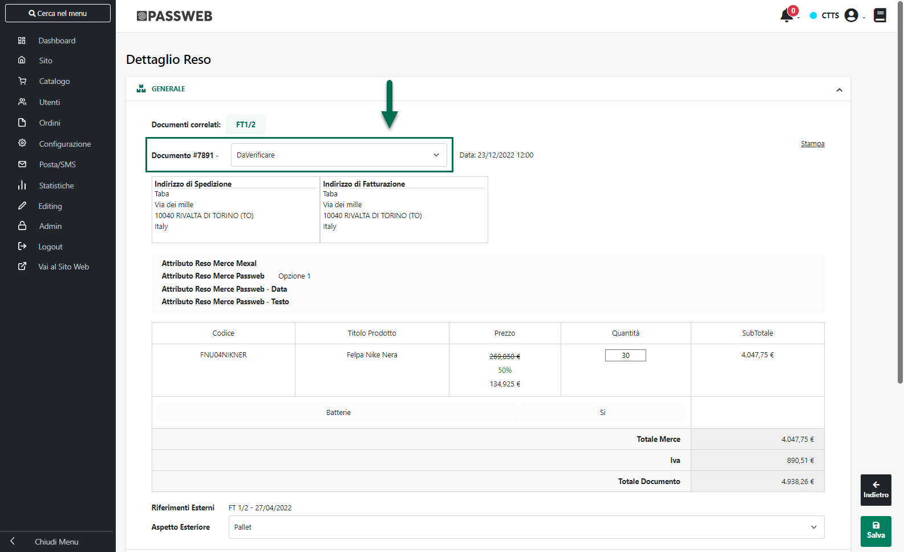

**ATTENZIONE!** **Eventuali specifiche custom verranno prese in
considerazione, per ovvie ragioni, solo ed esclusivamente nel momento in
cui il metodo di pubblicazione scelto sia via csv**

Per maggiori informazioni in merito a come poter creare o gestire
un'Inserzione si veda invece quanto indicato all'interno del capitolo
"*Altri Marketplace -- Gestione Inserzioni*".

Per maggiori informazioni relativamente ai due diversi possibili metodi
di pubblicazione articoli si veda invece quanto indicato nel capitolo di
"*Magento -- Configurazione Account -- Metodi di pubblicazione
articoli*" di questo manuale

**ATTENZIONE!** in ogni caso nel momento in cui gli articoli da gestire
dovessero essere dell'ordine delle decine di migliaia, è sempre
preferibile utilizzare una pubblicazione via csv inquanto i tempi
pubblicazione via API, in queste condizioni, potrebbero essere
particolarmente elevati.

Di seguito vengono elencate le Specifiche Standard, obbligatorie e
opzionali, di cui tener conto in fase di creazione di una nuova
Inserzione.

##### SPECIFICHE OBBLIGATORIE

Come già evidenziato all'interno dei precedenti capitoli di questo
manuale, le specifiche obbligatorie altro non sono se non campi
dell'anagrafica articolo presente sulla piattaforma terza che devono
essere necessariamente valorizzati per poter codificare correttamente il
relativo prodotto.

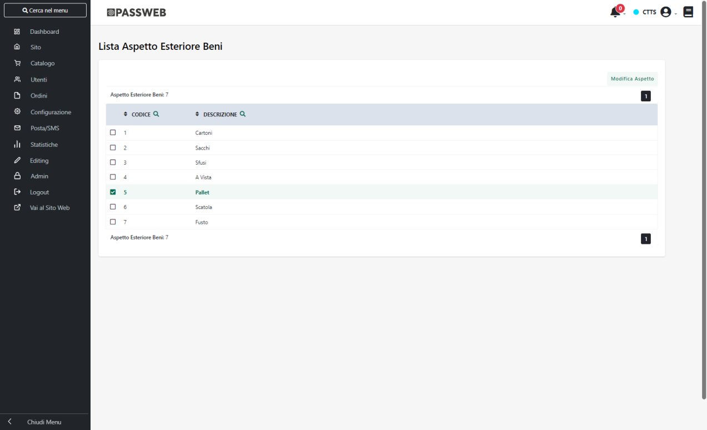

**ATTENZIONE!** Indipendentemente dal fatto che la specifica considerata
sia una di quelle obbligatorie o una di quelle addizionali la cosa
importante da tenere sempre in considerazione è che **nel momento in cui
tali specifiche vengano mappate con "Attributi Passweb" il valore che
esse andranno ad assumere articolo per articolo, all'interno di Passweb,
dovrà essere necessariamente uno dei valori effettivamente accettati e/o
presenti anche sulla piattaforma terza**.

In conseguenza di ciò se, per determinati articoli, il valore assunto
per una specifica mappata con un Attributo Passweb dovesse non
combaciare con uno dei valori ammessi per la specifica stessa lato
Magento, la pubblicazione degli articoli coinvolti in un inserzione che
fa uso di quella stessa specifica potrebbe dare degli errori o andare a
buon fine lasciando comunque su Magento il corrispondente attributo non
valorizzato.

**Si ricorda inoltre che l'integrazione Passweb -- Magento lavora a
livello di singola Store View, per cui ogni singola Inserzione farà
sempre riferimento alla Store View Magento associata all'Account
definito per l'Inserzione stessa**

###### PRODUCT NAME

Consente di mappare il **Nome** dell'articolo pubblicato sulla
piattaforma terza

**Modalità ammesse:** Attributo Articolo / Attributo Passweb

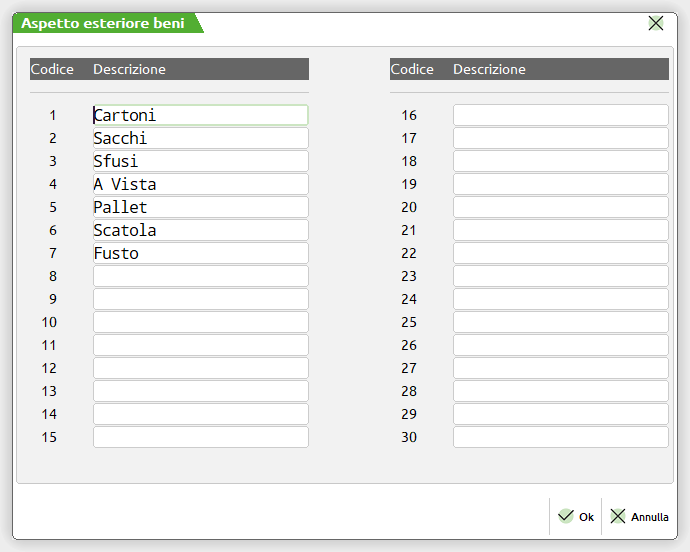

Mappando la specifica in esame sulla modalità "**Attributo Articolo**"
il campo valore potrà poi essere impostato unicamente sulla seguente
opzione:

- **Titolo**: in questo caso il nome dell'articolo da passare alla
  piattaforma terza sarà esattamente lo stesso di quello visualizzato in
  Passweb all'interno del componente "Titolo". In questo senso
  l'effettivo valore (descrizione presente nell'anagrafica gestionale,
  valore di un attributo o valore personalizzato) dipendono direttamente
  da come si è deciso di gestire il "Titolo" dell'articolo

Considerando che la specifica "Product Name" è una delle specifiche
obbligatorie e che come tale andrà necessariamente gestita
nell'Inserzione utilizzata per pubblicare i prodotti, **il Nome
dell'articolo su Magento, di base, sarà controllato da Passweb**.

Nel momento in cui l'esigenza dovesse essere quindi quella di **non
modificare il nome del prodotto su Magento** (ad esempio perché
l'articolo era già presente sulla piattaforma terza o perché dopo essere
stato pubblicato sono state fatte delle modifiche in tal senso
direttamente su Magento), sarà necessario accedere alla maschera di
configurazione del proprio Account, portarsi all'interno della sezione
"**Articoli**" e verificare **di NON aver selezionato il parametro
"Sovrascrivere il titolo sul Marketplace"**

Per maggiori informazioni in merito si veda anche quanto indicato nel
precedente capitolo "*Magento -- Configurazione Account -- Articoli*" di
questo manuale

**ATTENZIONE!** Per maggiori informazioni relativamente a come vengono
costruiti su Magento i Titoli di articoli padre si veda anche quanto
indicato all'interno del capitolo "*Marketplace -- Altri Marketplace --
Magento -- Pubblicazione di Articoli a Taglie / Colori*" di questo
manuale.

###### ATTRIBUTE SET

Consente di mappare **il Set di Attributi articolo Magento** cui
dovranno essere associati gli articoli pubblicati sulla piattaforma
terza

**Modalità ammesse:** Attributo Marketplace / Attributo Passweb

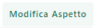

Come in Passweb, anche in Magento, ogni articolo dovrà necessariamente
essere associato ad un ben preciso set di attributi che ne definisce le
caratteristiche.

**ATTENZIONE!** Per non ottenere errori in fase di pubblicazione degli
articoli, tale specifica deve assumere per forza di cose uno dei valori
proposti direttamente dalla piattaforma terza. **Nel caso in cui per un
articolo dovesse essere impostato un set di attributi non presente su
Magento l'articolo in esame potrebbe non essere pubblicato**

Nel momento in cui tale specifica dovesse essere mappata sulla modalità
"**Attributo Marketplace**" portandosi poi nel campo valore verranno
immediatamente proposti tutti i set di attributi attualmente presenti su
Magento. In particolare l'elenco proposto è allineato all'ultima
operazione di aggiornamento dell'Account Magento.

In queste condizioni selezionando uno dei valori proposti, poi tutti gli
articoli pubblicati sulla piattaforma terza mediante l'inserzione in
esame, assumeranno come valore per la specifica "Attribute Set" quello
impostato all'interno di questo campo e verranno quindi associati al
corrispondente Set di Attributi Magento.

Nel caso in cui l'esigenza dovesse essere quella di gestire
un'Inserzione più dinamica facendo in modo di pubblicare mediante essa
articoli che, in Magento, dovranno poi essere associati a diversi set di
attributi, sarà necessario mapparla sulla modalità "**Attributo
Passweb**" selezionando poi dal relativo menu a tendina l'attributo
deputato a gestire questo tipo di informazione.

L'attributo indicato dovrà quindi essere valorizzato articolo per
articolo prestando comunque particolare attenzione al fatto di inserire
sempre uno dei valori effettivamente accettati dalla piattaforma terza
(fare riferimento in questo senso all'elenco di opzioni visualizzate nel
momento in cui la specifica fosse mappata sulla modalità "Attributo
Marketplace") e **quindi uno dei Set di Attributi effettivamente
presenti su Magento.**

**ATTENZIONE! Una volta definito il Set di Attributi Magento da
utilizzare in fase di pubblicazione degli articoli, occorre poi
verificare che tutte le eventuali specifiche addizionali valorizzate e
gestite per l'Inserzione in esame facciano riferimento a Attributi
Articolo Magento che siano effettivamente presenti all'interno del Set
indicato**

Nel momento in cui, infatti, dovesse essere utilizzata una specifica
corrispondente ad un Attributo Magento non presente nel Set di Attributi
cui dovrà essere associato l'articolo, Passweb non potrà sapere dove
salvare il corrispondente valore e al termine della pubblicazione
potrebbero essere riscontrati degli errori e/o delle mancanze

Infine, considerando che la specifica "Attribute Set" è una delle
specifiche obbligatorie e che come tale andrà necessariamente gestita
nell'Inserzione utilizzata per pubblicare i prodotti, **l'associazione
dell'articolo al set di attributi su Magento, di base, sarà controllato
da Passweb**.

Nel momento in cui l'esigenza dovesse essere quindi quella di **non
modificare l'associazione dell'articolo al set di attributi su Magento**
(ad esempio perché l'articolo era già presente sulla piattaforma terza o
perché dopo essere stato pubblicato sono state fatte delle modifiche in
tal senso direttamente su Magento), sarà necessario accedere alla
maschera di configurazione del proprio Account, portarsi all'interno
della sezione "**Articoli**" e verificare **di NON aver selezionato il
parametro "Sovrascrivere il parametro AttributeSet sul Marketplace"**

Per maggiori informazioni in merito si veda anche quanto indicato nel
precedente capitolo "*Magento -- Configurazione Account -- Articoli*" di
questo manuale

**ULTERIORI INFORMAZIONI**

Oltre alle specifiche obbligatorie appena analizzate (Product Name,
Attribute Set), in fase di pubblicazione dei prodotti verranno sempre
passate alla piattaforma terza, anche se non esplicitamente inserite
nell'Inserzione, le seguenti informazioni:

- **codice gestionale** dell'articolo mappato con il campo **SKU** di
  Magento

- **immagine principale della scheda prodotto**

- **prezzo dell'articolo**

Per maggiori informazioni sulla gestione dei prezzi si rimanda a quanto
indicato nel successivo capitolo "*Magento -- Gestione Prezzi*" di
questo manuale.

Per quel che riguarda invece la gestione delle immagini articolo è bene
sottolineare che:

- Se l'esigenza dovesse essere quella di inviare alla piattaforma terza,
  prelevandole sempre dal gestionale, altre immagini, oltre a quella
  principale, sarà necessario utilizzare la specifica addizionale
  "**Number Additional Images (number_additional_images)**"

- L'associazione e l'aggiornamento delle immagini articolo da Passweb a
  Magento funziona in maniera posizionale. In altri termini dunque
  l'immagine prodotto prelevata dal gestionale sarà la prima immagine
  associata in Magento al relativo articolo; la prima immagine
  secondaria eventualmente prelevata da gestionale sarà la seconda
  immagine associata su Magento e via di seguito.

> In considerazione di ciò **si consiglia di non adottare mai una
> gestione mista** (alcune immagini sul gestionale e altre caricate
> direttamente da Magento).
>
> Allo stesso modo una volta importate le immagini dal gestionale queste
> non dovrebbero poi essere cambiate di posizione operando direttamente
> all'interno di Magento
>
> **ATTENZIONE! Nel momento in cui non dovesse essere rispettato quanto
> sopra indicato in fase di pubblicazione delle immagini articolo si
> potrebbero verificare sovrascritture e / o eliminazioni indesiderate
> delle risorse attualmente presenti su Magento**
>
> Se la logica adottata da Passweb non dovesse essere adatta a
> soddisfare le esigenze del caso, e si dovesse quindi decidere di
> gestire le immagini articolo dalla piattaforma terza sarà allora
> necessario verificare di non avere inserito le immagini lato
> gestionale o, in alternativa, di aver correttamente selezionato, in
> fase di configurazione dell'Account di integrazione, il parametro
> "**Escludi Feed Immagini**" (sezione "**Articoli**") in maniera tale
> da inibire completamente la trasmissione di questo tipo di risorse dal
> gestionale Passepartout verso la piattaforma terza
>
> **ATTENZIONE!** La gestione delle immagini articolo direttamente sul
> gestionale potrebbe, per ovvie ragioni, rallentare il processo di
> pubblicazione degli articoli. **Laddove possibile è auspicabile quindi
> gestire queste immagini direttamente sulla piattaforma terza**

Un' ultima considerazione di fondamentale importanza da fare, infine, è
quella che riguarda il campo "**Visibility**". In tale senso è bene
sottolineare che:

- In fase di pubblicazione di un nuovo articolo **il campo Visibility**
  presente nell'anagrafica articolo di Magento verrà automaticamente
  impostato sul valore 4 (**articolo visibile in Ricerca e in
  Catalogo**)

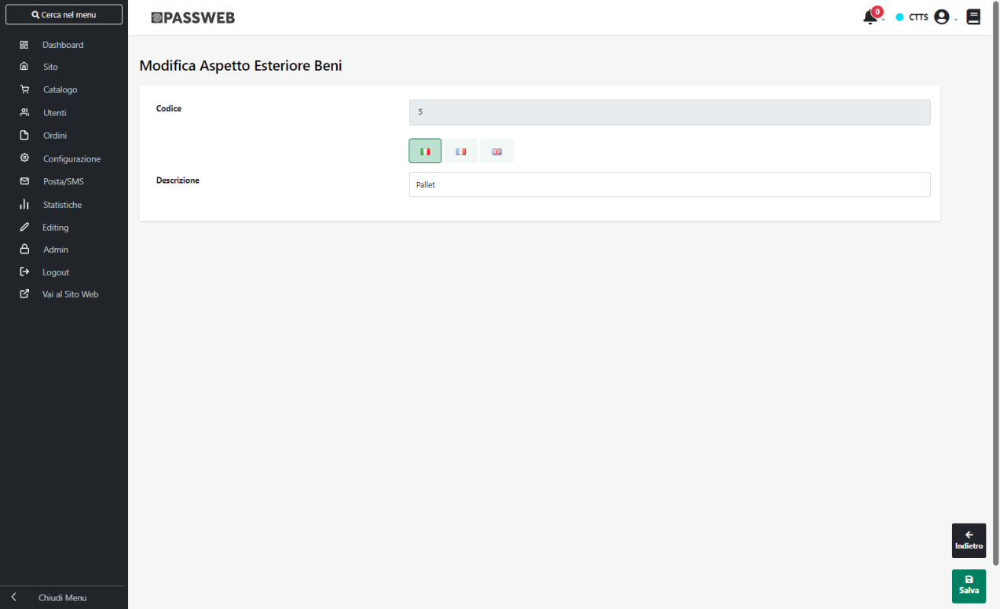

- In fase di aggiornamento di un articolo già presente sulla piattaforma
  terza, il **campo Visibility** non verrà mai modificato. Eventuali
  variazioni in questo senso dovranno quindi essere fatte operando
  direttamente sulla piattaforma terza.

##### SPECIFCHE ADDIZIONALI

Di seguito vengono riportate le principali Specifiche addizionali da
gestire nell'integrazione tra Passweb e Magento

###### NUMBER ADDITIONAL IMMAGES

**ATTENZIONE!** La specifica in oggetto verrà effettivamente presa in
considerazione solo nel momento in cui non sia stato selezionato, in
fase di configurazione dell'Account, il parametro "**Escludi Feed
Immagini**" (per maggiori informazioni in merito si veda anche quanto
indicato all'interno del capitolo "*Marketplace -- Altri Marketplace --
Magento -- Configurazione Account -- Articoli*" di questo manuale)

Consente di indicare il numero di immagini aggiuntive da inviare alla
piattaforma terza oltre all'immagine principale della scheda prodotto.

**Modalità ammesse:** Attributo Passweb / Personalizzato

**ATTENZIONE!** La specifica **number_additional_images** è gestita come
campo numerico

Nel caso in cui l'esigenza dovesse essere quella di inviare alla
piattaforma terza, per tutti per tutti gli articoli coinvolti
nell'Inserzione, lo stesso numero di immagini aggiuntive, sarà
necessario:

- mappare la specifica in oggetto sulla modalità "Personalizzato"

- inserire all'interno del campo Valore il numero di immagini aggiuntive
  da utilizzare

Nel caso in cui l'esigenza dovesse invece essere quella di passare per
diversi articoli coinvolti nell'inserzione un diverso numero di immagini
addizionali, sarà necessario:

- mappare la specifica in oggetto sulla modalità "Attributo Passweb"

- impostare il campo "Valore" sull'Attributo Passweb deputato a gestire
  per ogni singolo articolo questo tipo di informazione, prestando
  particolare attenzione al fatto che tale attributo sia di tipo
  numerico.

**ATTENZIONE!** Le immagini degli articoli verranno inviate a Magento
mediante un processo separato che partirà, in maniera automatica, al
termine del processo di pubblicazione / aggiornamento degli articoli
sulla piattaforma esterna.

In conseguenza di ciò terminato il processo di pubblicazione degli
articoli (e ricevuta l'apposita mail), per poter visualizzare le
immagini prodotto sulla piattaforma esterna occorrerà attendere anche la
fine del relativo processo di pubblicazione

**ATTENZIONE!** l'invio di questo tipo di mail è subordinato
all'attivazione del parametro "**Invia email articoli**" presente
all'interno della sezione "Generale" nella maschera di configurazione
del proprio account

**Per quel che riguarda invece gli articoli gestiti a colori e taglie
mediante la relativa tabella Mexal**, considerando che a quello che in
Magento viene considerato come un articolo padre possono fare capo
diversi articoli figlio di Passweb / Mexal (e che quindi l'articolo
padre di Magento potrebbe non corrispondere ad un prodotto fisicamente
presente su Passweb) non sarà possibile associare in fase di
pubblicazione su Magento specifiche immagini a determinati colori /
taglie.

Infine è bene ricordare ancora una volta che:

- Nel momento in cui si dovesse decidere di gestire le immagini dei
  prodotti dal relativo gestionale Passepartout queste potrebbero andare
  a sostituire eventuali immagini già presenti su Magento.

- **In tal senso si consiglia di non adottare mai una gestione mista**
  (alcune immagini sul gestione e altre caricate direttamente da
  Prestashop) e di demandare, laddove possibile, la gestione delle
  immagini articolo interamente alla piattaforma terza anche in
  considerazione del fatto che la presenza di queste immagini sul
  gestionale potrebbe, per ovvie ragioni, rallentare il processo di
  pubblicazione degli articoli

###### ID

Consente di mappare il **Codice identificativo** assegnato all'articolo
direttamente dalla piattaforma terza su cui l'articolo stesso è stato
pubblicato

**Modalità ammesse:** Attributo Passweb / Personalizzato

Questa specifica è di fondamentale importanza, in quanto verrà
utilizzata come campo chiave nel momento in cui si vogliano agganciare,
in fase di pubblicazione articoli, dei prodotti già presenti sulla
piattaforma terza e che, generalmente, non sono stati inseriti mediante
l'integrazione con Passweb

###### CATEGORIES

Consente di mappare la **Categoria merceologica** cui associare
l'articolo all'interno di Magento

**Modalità ammesse:** Attributo Marketplace / Attributo Articolo /
Attributo Passweb

**ATTENZIONE! Lo schema delle categorie merceologiche cui fare
riferimento** è quello definito direttamente all'interno di Magento in
relazione alla Store View associata all'Account definito sull'Inserzione

Mappando la specifica in esame sulla modalità "**Attributo
Marketplace**" il campo "**Valore**" verrà gestito come un campo ad
autocompletamento per cui iniziando a digitare alcuni caratteri
(relativamente a quella che dovrà essere la categoria merceologica degli
articoli coinvolti nell'Inserzione) verrà visualizzato automaticamente
lo schema delle categorie merceologiche create e gestite sulla
piattaforma terza (e coerenti ovviamente con quanto digitato
dall'utente)

Sarà quindi sufficiente selezionare, tra quelle proposte, l'opzione
desiderata in maniera tale da inserire all'interno del campo
"**Valore**" il percorso completo della categoria merceologica cui
dovranno appartenere tutti gli articoli pubblicati mediante l'Inserzione
in esame.

**ATTENZIONE!** **Nel caso di integrazione con Magento uno stesso
articolo potrà appartenere, contemporaneamente, a più categorie
merceologiche.**

Una volta individuata e selezionata la prima categoria merceologica
comparirà quindi un nuovo campo ad autocompletamento mediante il quale
poter selezionare l'ulteriore categoria cui associare gli articoli
coinvolti nell'Inserzione.

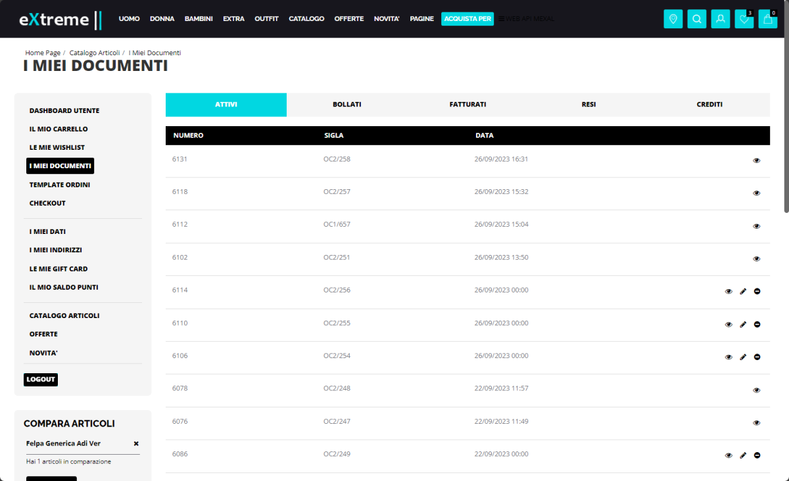

Come al solito, lavorando in questo modo tutti gli articoli pubblicati
mediante l'Inserzione in esame verranno associati, ovviamente, alle
stesse categorie merceologiche (quelle indicate, appunto, all'interno
del campo Valore)

Nel caso in cui si voglia ottenere qualcosa di più dinamico, in maniera
tale da poter sfruttare una stessa Inserzione per pubblicare sulla
piattaforma terza articoli appartenenti a diverse categorie
merceologiche sarà necessario configurare la Specifica "**Categoria**"
impostandola, questa volta, sulla modalità "**Attributo Articolo**"

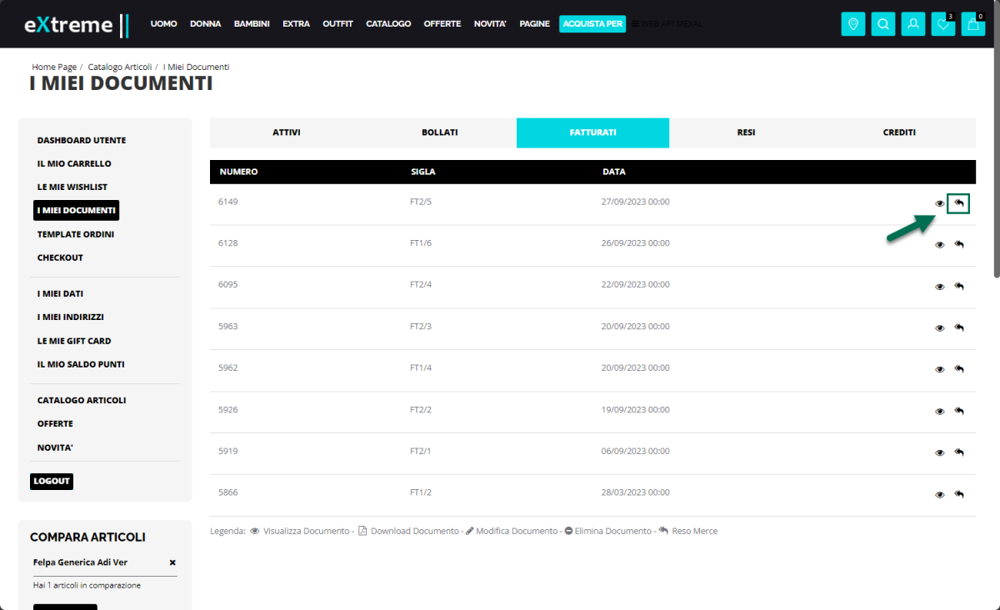

In queste condizioni il campo "**Valore**" verrà gestito come una combo
box e l'unica opzione di scelta disponibile sarà "**Magento Categoria
Prodotto**"

Ciò significa che per ogni articolo pubblicato mediante l'Inserzione in
esame il valore relativo alla categoria merceologica di appartenenza
coinciderà esattamente con quanto impostato in corrispondenza del campo
"**Magento Product Category**" presente all'interno della sezione
"**Marketplace**" nell' Anagrafica Passweb della categoria merceologica
di appartenenza dell'articolo.

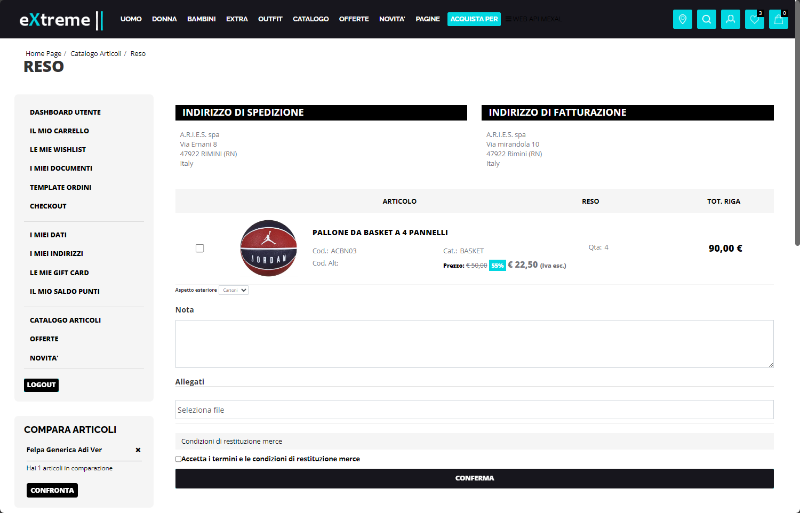

Il campo **"Magento Product Category"** è infatti un campo ad
autocompletamento e, come nel caso precedente per il campo Valore, anche
questa volta iniziando a digitare alcuni caratteri verrà visualizzato
automaticamente lo schema delle categorie merceologiche create e gestite
sulla piattaforma terza.

Lavorando in questo modo potrebbe quindi essere possibile assegnare due
articoli appartenenti, su Passweb, a due categorie merceologiche
completamente diverse (es. Smartphone e Televisori) a due altrettanto
diversi insiemi di categorie gestite su Magento.

Lo stesso risultato, infine, potrebbe essere ottenuto anche nel momento
in cui la specifica in oggetto dovesse essere configurata sulla modalità
"**Attributo Passweb**".

In questo caso però sarà necessario inserire manualmente, all'interno
dell'attributo deputato a gestire questo tipo di informazione, le
categorie cui l'articolo in esame dovrà essere associato all'interno
della piattaforma terza, facendo attenzione al fatto di inserire
esattamente uno dei valori ammessi (è richiesto l'intero path della
categoria).

**ATTENZIONE!** Se l'esigenza dovesse essere quella di gestire le
categorie merceologiche direttamente da Magento la specifica
"Categories" NON dovrà essere gestita nell'Inserzione

###### DESCRIPTION

Consente di mappare la **Descrizione estesa** dell'articolo pubblicato
sulla piattaforma terza

**Modalità ammesse:** Attributo Articolo / Attributo Passweb /
Personalizzato

Mappando la specifica in esame sulla modalità "**Attributo Articolo**"
il campo valore potrà poi essere impostato su una delle seguenti
opzioni:

- **Descrizione:** in questo caso il valore della descrizione estesa da
  passare alla piattaforma terza sarà esattamente lo stesso di quello
  visualizzato in Passweb all'interno del componente "Descrizione" (e
  quindi la descrizione inserita per l'articolo in Docuvision o
  direttamente nell'apposito campo dell'Anagrafica Passweb)

- **Titolo**: in questo caso il valore della descrizione estesa da
  passare alla piattaforma terza sarà esattamente lo stesso di quello
  visualizzato in Passweb all'interno del componente "Titolo". In questo
  senso l'effettivo valore (descrizione presente nell'anagrafica
  gestionale, valore di un attributo o valore personalizzato) dipendono
  direttamente da come si è deciso di gestire il "Titolo" dell'articolo

###### SHORT DESCRIPTION

Consente di mappare la **Descrizione breve** dell'articolo pubblicato
sulla piattaforma terza

**Modalità ammesse:** Attributo Articolo / Attributo Passweb /
Personalizzato

Mappando la specifica in esame sulla modalità "**Attributo Articolo**"
il campo valore potrà poi essere impostato su una delle seguenti
opzioni:

- **Descrizione:** in questo caso il valore della descrizione estesa da
  passare alla piattaforma terza sarà esattamente lo stesso di quello
  visualizzato in Passweb all'interno del componente "Descrizione" (e
  quindi la descrizione inserita per l'articolo in Docuvision o
  direttamente nell'apposito campo dell'Anagrafica Passweb)

- **Titolo**: in questo caso il valore della descrizione estesa da
  passare alla piattaforma terza sarà esattamente lo stesso di quello
  visualizzato in Passweb all'interno del componente "Titolo". In questo
  senso l'effettivo valore (descrizione presente nell'anagrafica
  gestionale, valore di un attributo o valore personalizzato) dipendono
  direttamente da come si è deciso di gestire il "Titolo" dell'articolo

###### ENABLE PRODUCT

Consente di mappare il parametro che determina l'effettiva pubblicazione
dell'articolo sulla piattaforma terza.

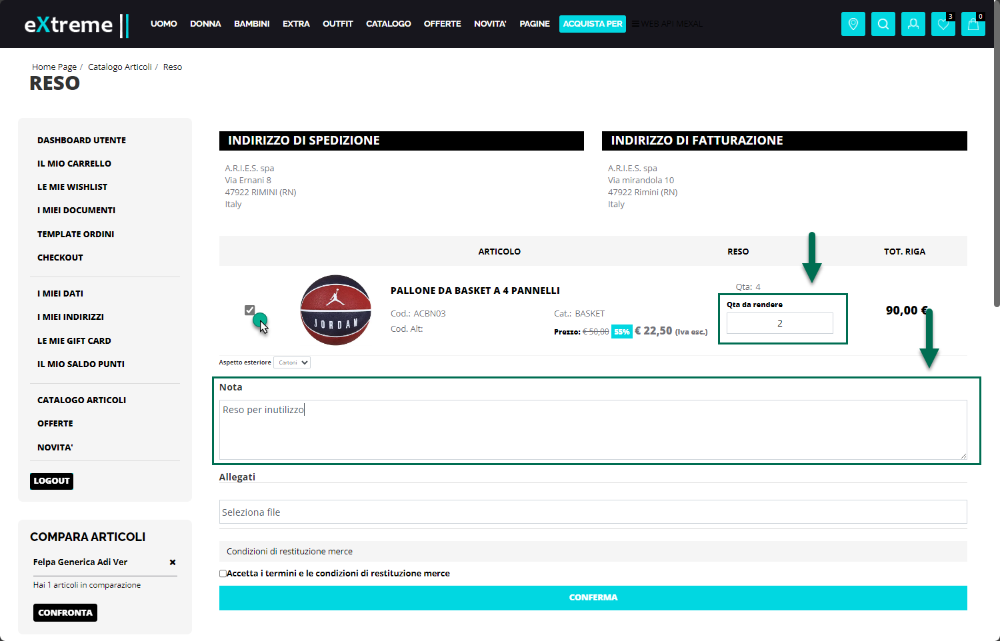

Grazie a questa specifica sarà quindi possibile decidere **se l'articolo
in esame, pur essendo presente nel Back end di Magento, dovrà essere o
meno pubblicato anche sul Front end**.

**Modalità ammesse:** Attributo Articolo / Attributo Passweb /
Personalizzato

Mappando la specifica in esame sulla modalità "**Attributo
Marketplace**" il campo "**Valore**" verrà gestito come un campo ad
autocompletamento e gli unici due valori ammessi saranno quelli
prelevati direttamente dalla piattaforma terza ossia:

- **Enabled**

- **Disabled**

**ATTENZIONE!** Lavorando in questo modo tutti gli articoli pubblicati
mediante l'Inserzione in esame avranno per questo attributo uno dei due
valori sopra indicati

Nel caso in cui si voglia ottenere qualcosa di più dinamico decidendo,
all'interno della stessa inserzione, quale valore dovrà assumere,
articolo per articolo, la specifica in oggetto, sarà necessario
configurarla impostandola sulla modalità "**Attributo Articolo**".

In queste condizioni l'unica opzione selezionabile all'interno del campo
Valore sarà "**Pubblicato**" e la specifica in esame verrà
automaticamente mappata sulla funzionalità Mexal **"Pubblica"** (per
maggiori informazioni in merito si veda anche il capitolo
"*Configurazione Gestionale -- Mexal -- Attivazione Passweb --
Funzionalità Mexal Articoli -- Pubblicare / Nascondere articoli
all'interno del negozio web*").

**ATTENZIONE! In queste condizioni dunque lo stato (Enabled o Disabled)
degli articoli pubblicati sulla piattaforma terza potrà essere
controllato direttamente da Mexal.**

Impostando infatti, per un dato articolo, il campo "Pubblica" sul valore
S, la specifica "Enable Product" assumerà sulla piattaforma terza, per
lo stesso articolo, il valore di Enabled

Impostando invece il campo "Pubblica" sul valore N, la specifica "Enable
Product" assumerà sulla piattaforma terza, per lo stesso articolo, il
valore di Disabled

**ATTENZIONE!** Nel caso in cui la specifica in esame non dovesse essere
inserita nell'Inserzione e/o non dovesse essere valorizzata in maniera
puntuale, per essa verrà assunto **il valore di default Enabled** e, in
conseguenza di ciò, l'articolo sarà pubblicato anche sul front end del
sito

###### NEW / SALE

Parametro utile a **marcare gli articoli come articoli novità (NEW) o
come articoli in Offerta (SALE)**

**Modalità ammesse:** Attributo Articolo / Attributo Passweb /
Personalizzato

**ATTENZIONE!** **Nel caso in cui tali attributi non siano già presenti
nella propria installazione Magento, sarà necessario crearli come
attributi di tipo "Yes/No" facendo attenzione ad impostare per essi
esattamente le label "Sale" e "New"**

Mappando la specifica in esame sulla modalità "**Attributo
Marketplace**" il campo "**Valore**" verrà gestito come un campo ad
autocompletamento e gli unici due valori ammessi saranno quelli
prelevati direttamente dalla piattaforma terza ossia:

- **Yes**

- **No**

**ATTENZIONE!** Lavorando in questo modo tutti gli articoli pubblicati
mediante l'Inserzione in esame avranno, sulla piattaforma terza per
questi attributi, uno dei due valori sopra indicati

Nel caso in cui si voglia ottenere qualcosa di più dinamico decidendo,
all'interno della stessa inserzione, quale valore dovrà assumere,
articolo per articolo, la specifica in oggetto, sarà necessario
configurarla impostandola sulla modalità "**Attributo Articolo**".

L'unica opzione selezionabile all'interno del campo Valore sarà quindi
"**Novità / Offerta**" e la specifica in esame verrà automaticamente
mappata sulla medesima funzionalità Mexal **"Novità / Offerta"** (per
maggiori informazioni in merito si veda anche il capitolo
"*Configurazione Gestionale -- Mexal -- Attivazione Passweb --
Funzionalità Mexal Articoli -- Gestione Articoli in Offerta / Fine Serie
/ Novità*").

**ATTENZIONE! In queste condizioni dunque il fatto di inserire un
articolo tra le offerte o tra le novità potrà essere controllato
direttamente da Mexal.**

Impostando infatti, per un dato articolo, il campo "Offerta (Novità)"
sul valore S, la specifica "Sale (New)" assumerà sulla piattaforma
terza, per lo stesso articolo, il valore di Yes

Impostando invece il campo "Offerta (Novità)" sul valore N, la specifica
"Sale (New)" assumerà sulla piattaforma terza, per lo stesso articolo,
il valore di No

**ATTENZIONE!** Nel caso in cui la specifica in esame non dovesse essere
inserita nell'Inserzione e/o non dovesse essere valorizzata in maniera
puntuale, il corrispondente attributo Magento non verrà valorizzato

###### RELATED PRODUCTS

Parametro di gestione degli articoli abbinati. Consente di decidere **se
gestire o meno gli abbinati su Magento (Related Products) mediante le
associazioni definite direttamente in Mexal.**

**Modalità ammesse:** Attributo Marketplace / Attributo Passweb

Mappando la specifica in esame sulla modalità "**Attributo
Marketplace**" il campo "**Valore**" verrà gestito come un campo ad
autocompletamento e gli unici due valori ammessi saranno:

- **Si:** selezionando questa opzione sarà possibile gestire i Prodotti
  Abbinati (Related Product) su Magento mediante le relative
  associazioni definite direttamente in Mexal.

> In queste condizioni infatti, in fase di pubblicazione articoli verrà
> passato alla piattaforma terza, per ciascuno dei prodotti coinvolti
> nell'Inserzione, anche l'elenco di tutti i codici abbinati definiti
> direttamente in Mexal e, nel momento in cui tali codici dovessero
> corrispondere ad articoli già pubblicati su Magento, verranno
> automaticamente inseriti nella sezione "Related Product" presente
> nell'Anagrafica Magento del singolo articolo

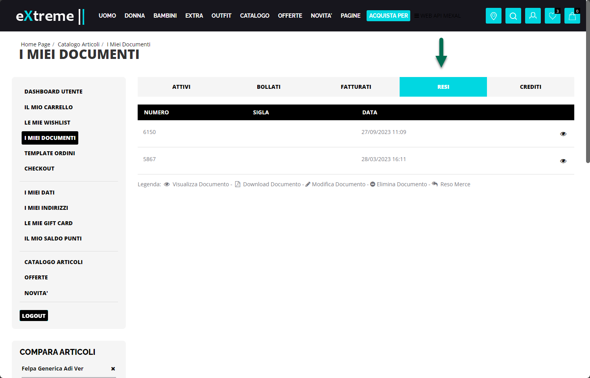

> **ATTENZIONE! In queste condizioni, eventuali associazioni create
> direttamente in Magento verranno sovrascritte dalle informazioni
> passate in fase di pubblicazione**
>
> Nel caso in cui l'esigenza dovesse quindi essere quella di gestire gli
> abbinati direttamente da Magento si consiglia di non gestire la
> specifica in esame o, al limite, di impostarla sul valore "No"

- **No:** selezionando questa opzione in fase di pubblicazione articoli
  non verrà passata a Magento nessun tipo di informazione relativamente
  agli abbinamenti definiti in Mexal per gli articoli coinvolti
  nell'Inserzione

> In queste condizioni gli abbinati potranno quindi essere gestiti e
> definiti liberamente all'interno della piattaforma terza.

Come per tutte le altre specifiche, anche in questo caso, nel momento in
cui l'esigenza dovesse essere quella di ottenere qualcosa di più
dinamico decidendo, all'interno della stessa inserzione, articolo per
articolo se passare o meno l'elenco dei codici abbinati, sarà necessario
mappare la specifica in esame sulla modalità **"Attributo Passweb"**

In queste condizioni, all'interno del campo "**Valore**" andrà poi
indicato l'Attributo Passweb preposto alla gestione di questa specifica
informazione, attributo questo che dovrà essere valorizzato articolo per
articolo con il valore "Si" o "No" a seconda del fatto di voler gestire,
per quello specifico prodotto, gli abbinati direttamente da Mexal oppure
su Magento

**ATTENZIONE!** Non sono ammesse modalità ibride in cui gli abbinati
definiti su Mexal si vadano ad aggiungere a quelli impostati manualmente
su Magento

###### SPECIFCHE PER ARTICOLI VARIANTI

Nel caso in cui l'esigenza dovesse essere quella di pubblicare su
Magento articoli Varianti, ossia articoli a Taglie/Colori e/o articoli
strutturati, sarà necessario, anche in questo caso, gestire
sull'Inserzione determinate specifiche indispensabili per abilitare
l'Inserzione stessa a trattare questo tipo di prodotti.

In particolare, nel caso di integrazione con Magento, le specifiche
necessarie per poter abilitare un' inserzione a trattare articoli
varianti saranno tutte quelle corrispondenti ad Attributi Prodotto
Magento che possono ammettere la selezione di un solo valore tra N
disponibili, e quindi attributi di tipo:

- **Dropdown**

- **Visual Swatch**

- **Text Swatch**

Tali specifiche dovranno poi essere impostate, come per tutte le altre
integrazioni, sulla modalità **"Elemento di Variazione".**

**ATTENZIONE!** Nel caso in cui si desideri agganciare attributi Magento
di tipo Dropdown, Visual Swatch o Text Swatch per i quali sono già stati
definiti (lato Magento) i diversi possibili valori che tali attributi
potranno assumere, è necessario accertarsi che anche in Passweb gli
attributi coinvolti abbiano esattamente uno dei valori impostati su
Magento.

Supponendo dunque di aver inserito, lato Magento, il valore "Black" tra
le possibili opzioni di un Attributo articolo utilizzato per gestire il
colore, occorrerà poi fare attenzione ad utilizzare esattamente la
stessa descrizione "Black" anche lato Passweb / gestionale.

In caso contrario pubblicando un articolo per cui, in Passweb,
l'attributo utilizzato per il colore riporti ad esempio il valore "Nero"
verrà creata per il corrispondente attributo Magento, una nuova opzione
di scelta corrispondente, appunto, al valore fornito da Passweb.

Inoltre, in relazione agli Attributi Magento di tipo "**Visual Swatch**"
è necessario sottolineare che Passweb potrà inserire, a seguito di una
pubblicazione articoli, **solo ed esclusivamente i valori testuali delle
opzioni di selezione presenti in questo tipo di attributi (quello
riportato all'interno della colonna Admin). L'eventuale codice
esadecimale del relativo colore, così come le eventuali descrizioni in
lingua, andranno quindi definite direttamente all'interno di Magento**

Lo stesso discorso vale, ovviamente, anche per gli attributi di tipo
"**Text Swatch**". Supponendo infatti di far riferimento ad un Attributo
Magento "Size", utilizzato quindi per gestire le taglie di un articolo,
nel momento in cui la descrizione di una Taglia presente in Passweb non
dovesse coincidere esattamente con una delle descrizioni impostate, lato
Magento, per le opzioni di selezione di questo particolare attributo, in
fase di pubblicazione articoli verrà creata una nuova opzione con il
valore inserito da Passweb (valore questo che, come per gli Attributi di
tipo Visual Swatch, verrà inserito all'interno della corrispondente
colonna Admin)

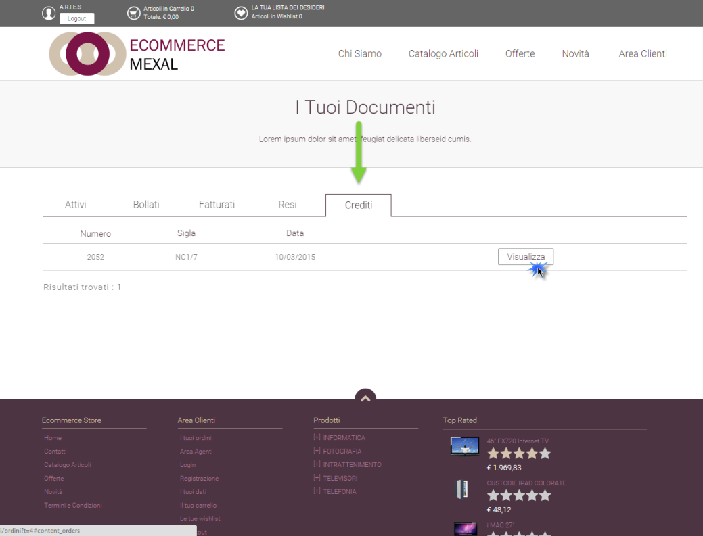

Per maggiori informazioni relativamente a come gestire inserzioni con
articoli che presentano un massimo di due elementi varianti (es. Taglie
e Colori) si veda il relativo capitolo (*Marketplace -- Altri*
*Marketplace -- Articoli a Taglie / Colori*) di questo manuale.

##### SPECIFCHE CUSTOM

Come già evidenziato nei precedenti capitoli di questo manuale nelle
integrazioni Passweb -- Magento che utilizzano la pubblicazione articoli
via csv, oltre alle Specifiche Standard (obbligatorie e addizionali) è
possibile gestire anche delle Specifiche Custom

Tali specifiche dovranno prima essere codificate all'interno della
corrispondente sezione del Wizard (*Catalogo -- Altri Marketplace --
Specifiche*)

Una volta codificate sarà poi possibile gestirle, per ogni singola
Inserzione, esattamente allo stesso modo in cui si gestiscono le
specifiche standard precedentemente analizzate.

Tali specifiche potranno essere facilmente individuate tra tutte quelle
effettivamente gestibili per una data Inserzione, in base al fatto che
ciascuna di esse avrà un nome del tipo "**custom_tagSpecifica**" dove
**tagSpecifica** è esattamente il valore inserito in fase di codifica
della specifica stessa in corrispondenza del campo **Tag**

Per maggiori informazioni in merito a come poter codificare delle nuove
specifiche custom si veda anche quanto indicato all'interno del capitolo
"*Marketplace -- Altri Marketplace -- Gestione Specifiche -- Specifiche
Custom Prestashop / Magento"* di questo manuale.

Relativamente alle opzioni di mapping disponibili per questo tipo di
specifiche è semplice comprendere come le uniche possibilità previste
siano ovviamente "**Attributo Passweb**" e "**Personalizzato**".

**ATTENZIONE!** Come più volte ricordato le specifiche custom potranno
essere utilizzate e verranno prese effettivamente in considerazione solo
nelle integrazioni Passweb -- Magento che utilizzano come metodo di
pubblicazione articoli la pubblicazione via csv.

