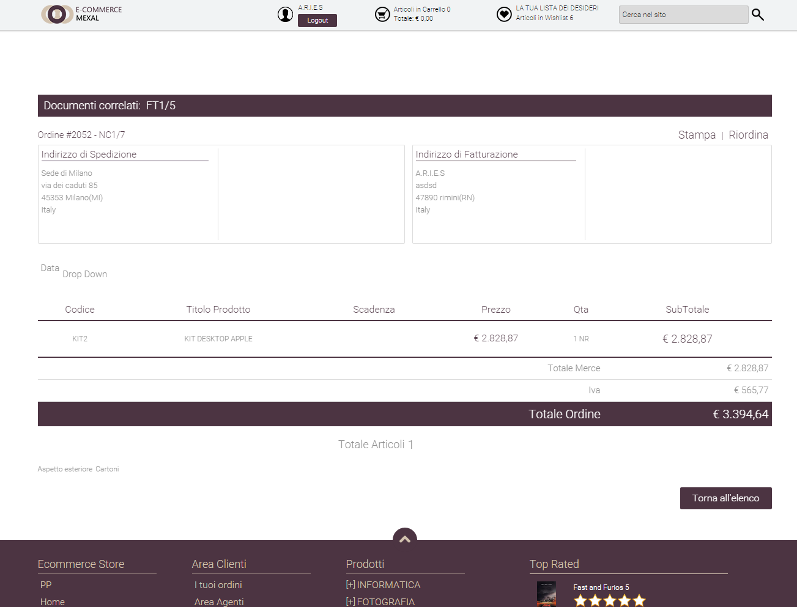

# GESTIONE PREZZI

A differenza delle integrazioni con Google e Facebook, nel caso di
integrazione con Magento il campo "**Modifica del Prezzo**", presente
nella sezione "Prezzo quantità e formato" dell'Inserzione, può essere
usato, senza particolari problemi, anche per aumentare o diminuire il
prezzo di listino definito all'interno del gestionale.

Per questo tipo di integrazione inoltre, è anche possibile associare ai
Gruppi Utente presenti sulla piattaforma terza specifici listini
gestionali agendo per questo all'interno della sezione "Listini"
presente nella maschera di configurazione di ogni singola Inserzione
(sezione "Prezzo, quantità e formato")

{width="5.792361111111111in"
height="3.422222222222222in"}

Di seguito vengono indicati gli aspetti fondamentali di cui tener conto
nella determinazione del prezzo applicato agli articoli pubblicati sulla
piattaforma terza:

- Il **prezzo base** dell'articolo sarà sempre quello determinato dal
  Listino indicato all'interno del campo "Prezzo" presente nella
  maschera di configurazione delle singola Inserzione (tab "Prezzo,
  quantità e formato")

- il **prezzo base** dei prodotti pubblicati sulla piattaforma sarà
  inserito all'interno del campo "**Price**" della corrispondente
  anagrafica articolo

{width="5.376388888888889in"
height="3.363888888888889in"}

- nel caso di prodotti gestiti a confezione i prezzi dei due articoli
  creati su Magento (articolo semplice e articolo bundle) verranno
  determinati secondo quanto indicato nel successivo capitolo
  "*Pubblicazione articoli con quantità multiple*" di questo manuale

- nel caso in cui dovesse essere applicata anche una particolare
  categoria sconto (campo "Sconto Cliente" dell'Inserzione -- solo
  Ecommerce Mexal) il prezzo finale di vendita sulla piattaforma terza,
  risultato dello sconto applicato al prezzo di listino, verrà invece
  inserito all'interno del campo "**Special Price**" della
  corrispondente anagrafica articolo

{width="5.376388888888889in"
height="3.363888888888889in"}

> Lo sconto creato non avrà particolari limitazioni e sarà quindi
> valido:

- per la singola unità di prodotto

- per tutti i Clienti, i Siti, le nazioni e le valute attualmente
  gestite sulla piattaforma terza

- per un periodo temporale privo di limitazioni

<!-- -->

- Oltre al campo "Sconto Cliente", verranno sempre prese in
  considerazione anche:

  - Eventuali particolarità sconto / prezzo definite per l'articolo e
    **valide per tutti i clienti** -- **Ecommerce Mexal**

  - Eventuali promozioni relative al prezzo / sconto dell'articolo e
    **valide per tutti i clienti** -- **Ecommerce Ho.Re.Ca.**

> Nel momento in cui la particolarità / promozione prezzo / sconto
> dovesse essere impostata sulla quantità dell'articolo e dovesse quindi
> essere definita su diversi scaglioni, verrà presa in considerazione
> sempre e solamente la condizione associata al primo scaglione
> disponibile.
>
> **ATTENZIONE!** Nel caso in cui per un determinato articolo dovessero
> essere valide delle particolarità sconto e /o degli sconti quantità
> (oltre alla Categoria Sconto Cliente) lo sconto effettivamente creato
> all'interno di Prestashop sarà determinato sulla base delle priorità
> definite per le diverse tipologie di sconto dal gestionale in uso
>
> **ATTENZIONE!** L'utilizzo di sconti in cascata e/o di maggiorazioni
> presenti all'interno del gestionale (Mexal) potrebbero causare
> problemi in fase di pubblicazione degli articoli sulla piattaforma
> terza.
>
> **Si consiglia quindi di utilizzare sempre una scontistica che possa
> essere correttamente gestita anche sulla piattaforma terza**

- nel caso in cui si dovesse decidere di utilizzare il campo "**Modifica
  del Prezzo**" per aumentare il prezzo di vendita degli articoli
  coinvolti nell'Inserzione, e fosse applicata anche una certa Categoria
  Sconto, sarà poi necessario valutare se il risultato della
  maggiorazione sia o meno superiore al prezzo di listino dell'articolo
  (quello inserito nel campo "Price").

> In particolare se il risultato della maggiorazione dovesse essere
> inferiore al prezzo di listino, questo verrà inserito ancora
> all'interno del campo "Special Price" per cui sul front end del sito
> si avrà ancora il prezzo originario barrato (valore del campo "Price")
> più l'effettivo prezzo di vendita (valore del campo "Special Price").
>
> Se invece il risultato della maggiorazione dovesse essere superiore al
> prezzo di listino, il campo "Special Price" verrà azzerato e il prezzo
> finale verrà inserito direttamente all'interno del campo "Price". In
> queste condizioni sul front end del sito verrà quindi visualizzato un
> unico prezzo.

- nel momento in cui in fase di configurazione della singola Inserzione
  dovessero essere stati associati ai Gruppi Utente presenti sulla
  piattaforma terza specifici Listini Gestionali, tali associazioni
  **determineranno la creazione su Magento di prezzi specifici che
  verranno poi associati e applicati solo ai relativi gruppi utente**

> Supponendo dunque di aver associato al Gruppo Utenti "Rivenditori" il
> Listino gestionale "Aziende", per ciascuno degli articoli pubblicati
> sulla piattaforma terza mediante l'Inserzione in esame verrà creata
> una specifica entry all'interno della sezione "**Advanced Pricing**"

{width="4.915277777777778in"
height="3.532638888888889in"}

> **valida solo per il gruppo "Rivenditori", dove il prezzo
> dell'articolo sarà esattamente quello definito in Mexal per il listino
> "Aziende".**
>
> Come evidenziato nella figura sopra riportata inoltre, il prezzo
> specifico così creato, risulterà essere valido:

- per la singola unità di prodotto

- per tutti i Siti attualmente gestiti sulla piattaforma terza

- per un periodo temporale privo di limitazioni

> Per maggiori informazioni relativamente a come poter associare
> specifici listini gestionali ai gruppi utente definiti sulla
> piattaforma terza si veda anche quanto indicato all'interno del
> capitolo "*Altri Marketplace -- Gestione Inserzioni -- Creazione di
> una nuova Inserzione -- Prezzo Quantità Formato -- Prezzo*" di questo
> manuale

- nel caso di articoli gestiti a taglie e/o colori o comunque con un
  massimo di due elementi di variazione:

  - All'articolo padre in Magento verrà assegnato un prezzo pari a 0

  - Ad ogni singola variazione verrà assegnato il prezzo presente sul
    gestionale per l'articolo padre da cui la variazione in esame
    deriva.

> Per maggiori informazioni in merito alla gestione dei prezzi nel caso
> di articoli a taglie / colori si veda anche quanto indicato
> all'interno del capitolo "*Marketplace -- Altri Marketplace -- Magento
> -- Pubblicazione di articoli a taglie e colori -- Prezzi delle singole
> combinazioni*" di questo manuale.

