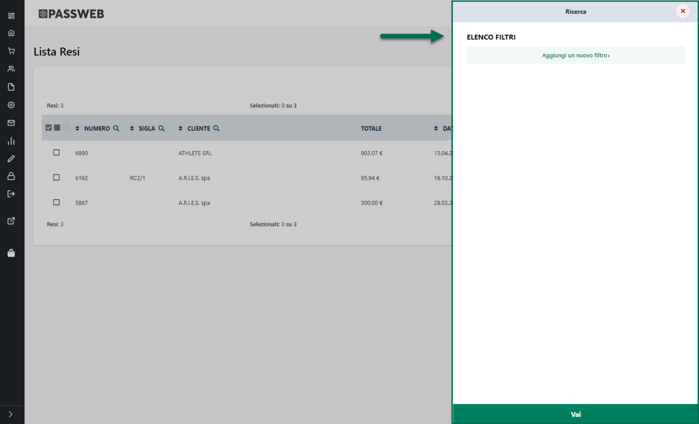
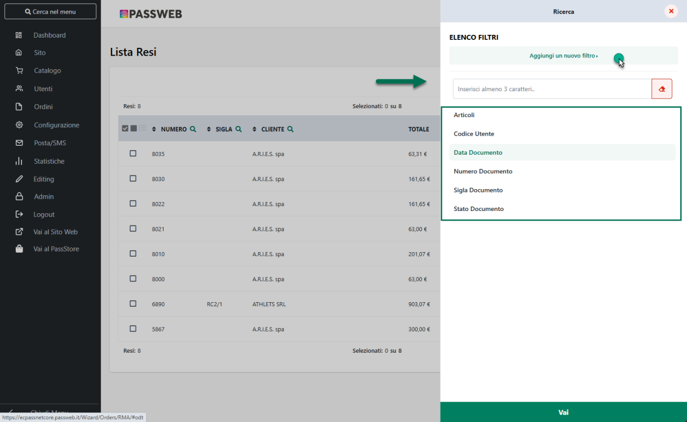
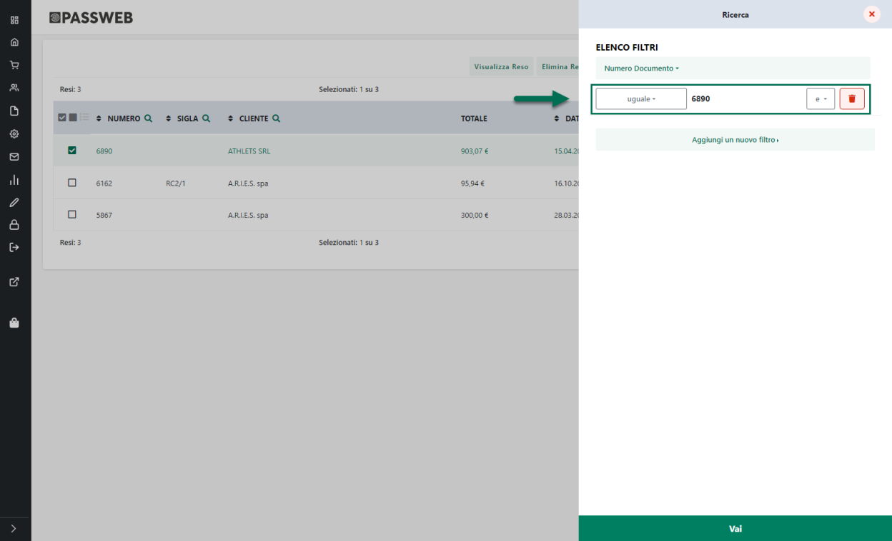

# PUBBLICAZIONE ARTICOLI CON QUANTITA' MULTIPLE

Per i siti ecommerce collegati a Mexal è possibile, volendo, pubblicare
sulla piattaforma terza anche articoli che, lato gestionale, sono
trattati a confezione e che sono quindi venduti a quantità multiple.

In Mexal questo tipo di gestione si attiva, come noto, utilizzando il
campo "**Confezione**" presente nella maschera "**Altri Dati
anagrafici**" di ogni singolo articolo

Nel momento in cui si dovesse decidere di pubblicare sulla piattaforma
terza anche questa particolare tipologia di articoli andrà sempre
considerato che **su Magento verranno poi creati automaticamente due
diversi prodotti**:

- **un prodotto singolo** con codice (Riferimento) / nome prelevati dai
  relativi dati presenti all'interno del gestionale

> **ATTENZIONE!** A default il prodotto singolo sarà impostato in
> maniera tale da non essere visibile individualmente
>
> Nel caso in cui l'esigenza dovesse essere quella di rendere
> acquistabile sul sito anche il singolo prodotto, oltre alla
> confezione, sarà necessario agire attraverso i relativi parametri di
> configurazione direttamente dal Back end di Magento

- **un prodotto bundle** (Pacco di Prodotti) con codice del tipo
  "**codiceGestionale-pck**", nome del tipo "**titoloGestionale --
  Pack**"

> Ovviamente le immagini utilizzate per questo prodotto saranno
> esattamente le stesse impostate, eventualmente, sul gestionale per il
> corrispondente articolo singolo

**ATTENZIONE!** Nel momento in cui il titolo del prodotto bundle creato
automaticamente da Passweb non dovesse soddisfare le specifiche esigenze
del caso sarà possibile modificare questo valore direttamente sulla
piattaforma terza, ricordandosi poi però di disabilitare per Passweb (a
livello di Account) la possibilità di sovrascriver il titolo in uso
sulla piattaforma terza con il corrispondente dato in uso all'interno
del gestionale (per maggiori informazioni in merito si veda anche quanto
indicato nel precedente capitolo "*Magento -- Configurazione Account --
Articoli*" di questo manuale)

Nel momento in cui tale opzione non dovesse essere disabilitata infatti,
ad ogni pubblicazione il titolo del prodotto impostato su Magento verrà
sovrascritto con quello generato in automatico da Passweb.

Per quel che riguarda le **quantità** con cui i due prodotti verranno
pubblicati sulla piattaforma terza occorre invece sottolineare che:

- Il numero di pezzi presente all'interno dell'articolo bundle sarà
  determinato, ovviamente, dal numero di pezzi impostati per la
  confezione all'interno del gestionale

- La quantità con cui l'articolo Bundle sarà effettivamente disponibile
  su Magento, dovrà essere sempre rapportata alla quantità dell'articolo
  singolo prelevata da Passweb e al numero di pezzi presenti nella
  singola confezione.

Supponendo dunque di gestire, lato mexal, un dato articolo a confezione
multipla di 4 unità e di avere per esso (sui magazzini impostati per
l'esportazione su Magento) una disponibilità di 238 unità:

- L'articolo singolo verrà pubblicato in quantità pari a 236

- L'articolo bundle non avrà una sua quantità specifica ma il numero di
  pezzi con cui sarà effettivamente disponibile per l'acquisto sarà
  esattamente di 236/4 = 59 unità

Infine per quel che riguarda i **prezzi** di questi due articoli
occorrerà considerare che:

- Per l'articolo singolo, tanto il prezzo base quanto eventuali prezzi
  speciali per gruppi utente, coincideranno esattamente con il prezzo
  definito lato gestionale per la singola unità di prodotto

- Per l'articolo bundle non verranno impostati specifici prezzi né per
  quel che riguarda il prezzo base né tanto meno per quel che riguarda
  eventuali prezzi speciali per gruppi utente. Tali prezzi saranno
  quindi ottenuti sempre considerando i corrispondenti valori impostati
  per l'articolo singolo e moltiplicati poi per il numero di pezzi
  presenti all'interno della confezione

Supponendo anche in questo caso dunque di trattare, lato mexal, un
articolo a confezione multipla di 4 con un prezzo unitario di 40€, il
prezzo dell'articolo singolo creato su Magento sarà anch'esso di 40€
mentre quello dell'articolo bundle sarà, sul front end del sito di 40 x
4 = 160€

