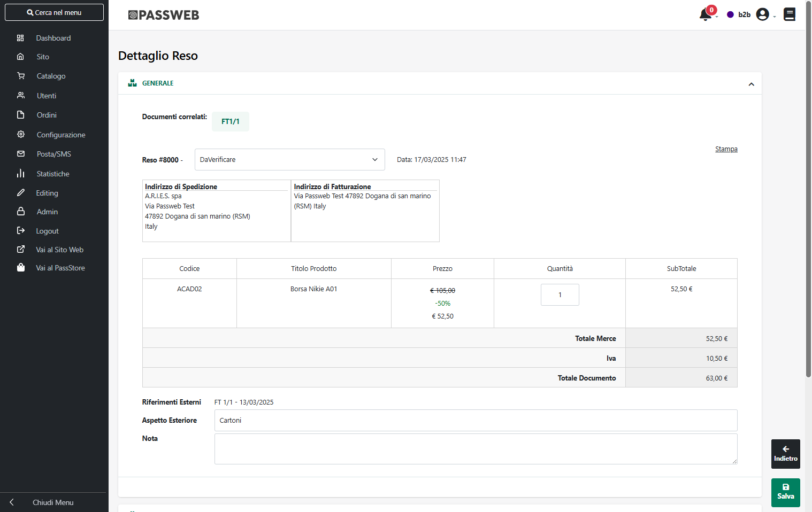
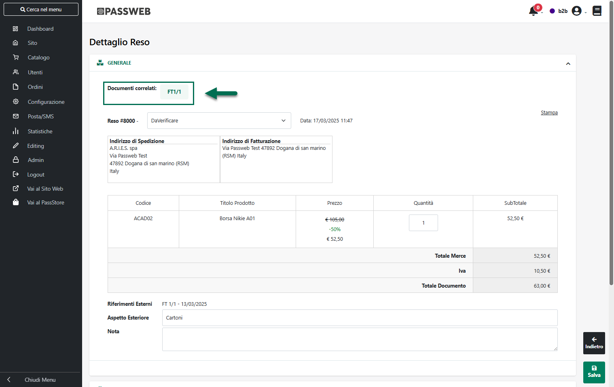
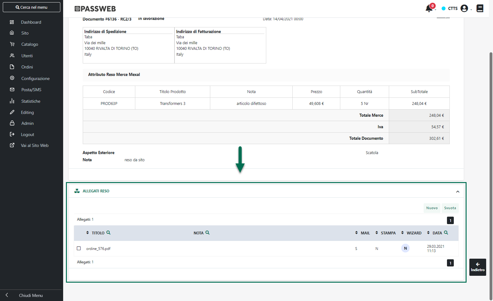
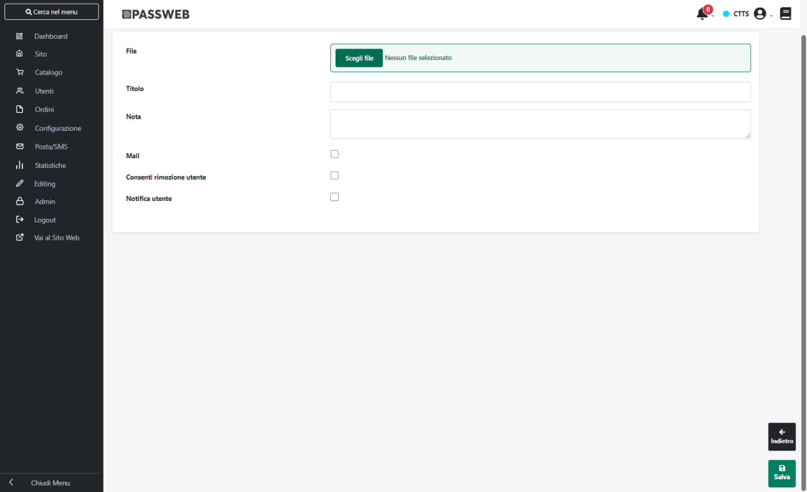
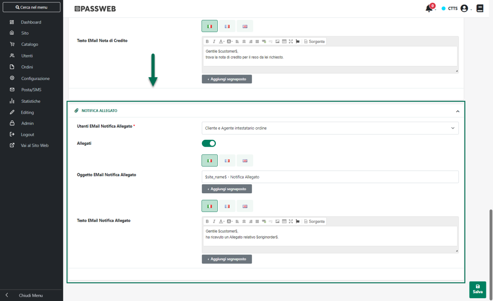
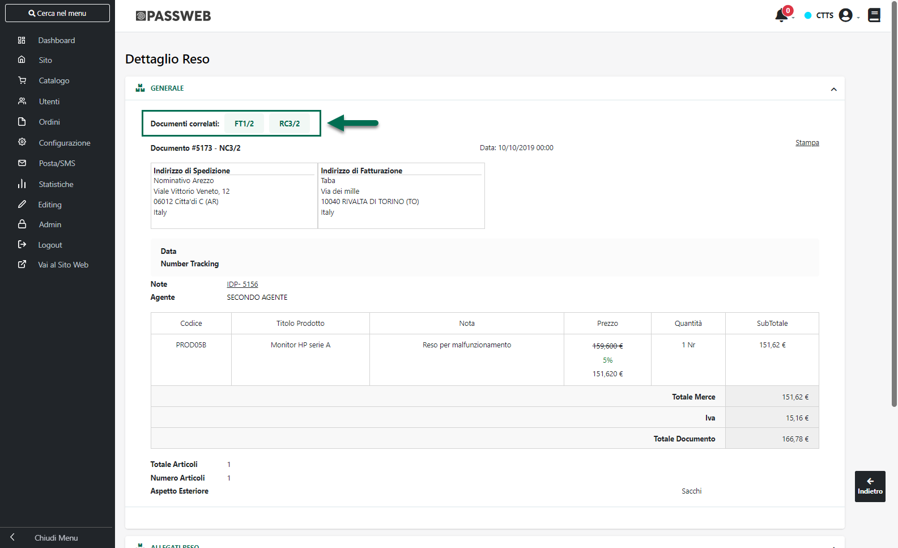
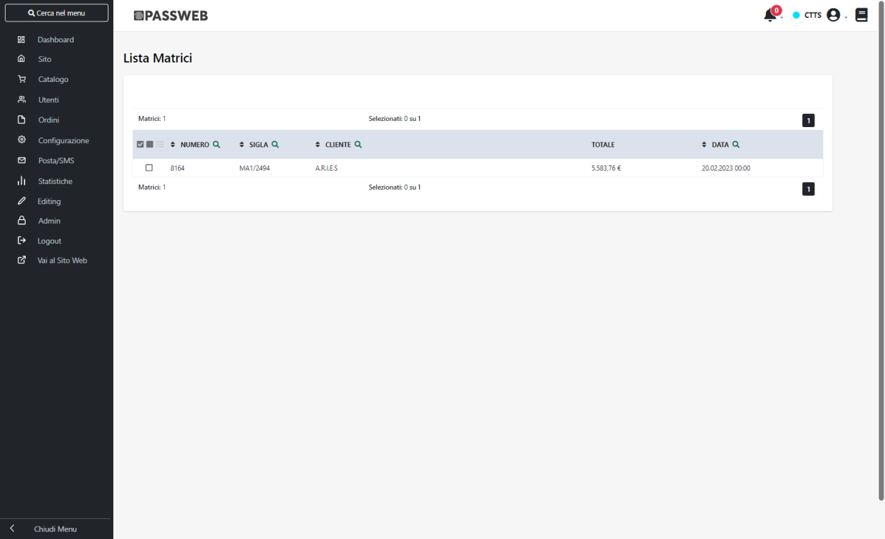
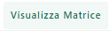

# PUBBLICAZIONE DI ARTICOLI A TAGLIE E COLORI

Come evidenziato nei precedenti capitoli di questo manuale, per
pubblicare su Magento articoli a Taglie / Colori, o comunque con
elementi varianti, è necessario innanzitutto predisporre apposite
Inserzioni in cui dovranno essere gestiti i relativi elementi di
variazione

A tali Inserzioni andranno poi collegate liste di vendita in cui
potranno essere inseriti solamente Articoli a Taglie / Colori, Articoli
padri di struttura o articoli figli di apposite strutture correttamente
esportati e gestiti anche all'interno del sito Passweb (per maggiori
informazioni in merito a queste due operazioni si veda anche quanto
indicato all'interno del capitolo "*Marketplace -- Altri Marketplace --
Articoli a Taglie / Colori*" di questo manuale).

Una volta creata anche la lista di vendita l'ultimo passo sarà
ovviamente quello di pubblicare sulla piattaforma terza gli articoli
presenti all'interno della lista stessa

In questo senso il processo di pubblicazione di articoli a taglie /
colori o comunque con un massimo di due elementi varianti, è
sostanzialmente analogo a quello utilizzato per la creazione di una
normale lista di vendita utilizzata per la pubblicazione di semplici
articoli di magazzino.

Ci sono però alcune considerazione di fondamentale importanza da fare
che riguardano essenzialmente:

- il modo in cui i vari articoli verranno poi raggruppati sulla
  piattaforma terza sotto uno stesso articolo padre

- come verrà determinato il "Nome" sulla piattaforma terza dell'
  articolo padre

- la definizione dei prezzi delle singole combinazioni

- la gestione delle immagini articolo

**Dipendentemente da come è stata configurata l'Inserzione utilizzata
per la pubblicazione, l'elemento che consentirà di raggruppare, nella
piattaforma terza, gli articoli figlio sotto uno stesso padre sarà il
penultimo o il terzultimo livello della struttura.**

Nello specifico:

- Se i due elementi di variazione nell' Inserzione sono stati impostati
  su "Ultimo Campo Struttura" e "Tabella Taglie" l'elemento che
  consentirà di raggruppare gli articoli figlio sotto uno stesso padre
  sarà il penultimo campo della struttura

> **ATTENZIONE!** Si ricorda che in questo caso nella lista di vendita
> andranno inserti i relativi padri Mexal. Passweb prenderà poi in
> considerazione solo ed esclusivamente **articoli figli effettivamente
> esportati e gestiti all'interno del sito** e, in relazione ad ognuno
> di essi, inserirà in lista un elemento per ogni taglia indicata nella
> corrispondente tabella Mexal

- Se i due elementi di variazione nell' Inserzione sono stati impostati
  su "Penultimo Campo Struttura" e "Ultimo Campo Struttura" l'elemento
  che consentirà di raggruppare gli articoli figlio sotto uno stesso
  padre sarà il terzultimo campo della struttura

> **ATTENZIONE!** Si ricorda che in questo caso nella lista di vendita
> andranno inseriti direttamente tutti i figli già codificati e
> correttamente esportati e gestiti all'interno del sito Passweb

Per quel che riguarda invece il nome assegnato all'articolo padre sulla
piattaforma terza, questo sarà determinato dal Titolo utilizzato per
quello che in Passweb è l'articolo padre di tutta la struttura cui verrà
aggiunta la descrizione associata, a seconda dei casi, all'elemento del
penultimo o del terzultimo campo della struttura

**[ESEMPIO 1]{.underline}**

Per comprendere meglio questo aspetto supponiamo di fare riferimento, in
questo primo esempio, ad una situazione in cui sia necessario trattare
articoli a taglie e colori configurati su Mexal con una struttura in cui
gli ultimi due livelli sono rappresentati rispettivamente dalla "Marca"
e dal "Colore".

Le taglie sono invece gestite mediante la relativa tabella Mexal.

Supponiamo inoltre di aver codificato ed esportato all'interno del sito
Passweb, in relazione al padre di struttura FNU04 i seguenti articoli
figlio

- FNU04NIKNER

- FNU04NIKROS

- FNU04ADIGRI

Supponiamo infine di aver personalizzato, in Passweb, i possibili valori
assunti dal penultimo livello della struttura (NIK e ADI)
rispettivamente con le stringhe "Nike" e "Adidas"

In queste condizioni, posto di aver configurato correttamente (secondo
quanto indicato nei precedenti capitoli) l'Inserzione da utilizzare per
la pubblicazione dei prodotti, tentando di aggiungere articoli alla
Lista di Vendita troveremo ora tra le possibili scelte l'articolo padre
FNU04

Selezionando questo articolo e inserendolo nella Lista di Vendita
Passweb prenderà in considerazione i soli articoli figlio ad esso
relativi effettivamente esportati e gestiti all'interno del sito (quindi
i tre precedentemente indicati) e, in relazione ad ognuno di essi, andrà
ad inserire in lista un elemento per ogni taglia indicata nella
corrispondente tabella Mexal.

Ora, tenendo conto di quanto precedentemente indicato, in fase di
pubblicazione l'elemento che consentirà di raggruppare gli articoli
figlio sotto uno stesso padre sarà il penultimo campo della struttura
(quindi la "Marca") per cui tutti i prodotti che, in Passweb,
risulteranno avere lo stesso valore in corrispondenza di questo campo,
verranno raggruppati, nella piattaforma terza, sotto uno stesso articolo
padre il cui nome sarà costruito prendendo il Titolo di quello che in
Passweb è l'articolo padre (FNU04) cui verrà aggiunta la descrizione
associata, per i relativi figli, al penultimo campo della struttura

In definitiva dunque, nelle condizioni indicate, sulla piattaforma terza
verrà creato:

- Un articolo di tipo "**Simple Product**" per ogni elemento presente
  nella Lista Passweb

> Questi prodotti, corrispondenti alle singole taglie / colori, verranno
> automaticamente impostati come "Non visibili individualmente"

> Il loro Nome dipenderà invece da come è stata mappata le relativa
> specifica "Name" nell'Inserzione utilizzata per la pubblicazione

- Un articolo di tipo "**Configurable Product**" con Name "**Felpa Elite
  Performance -- NIKE**" utilizzato come "articolo padre" per
  raggruppare le possibili configurazioni degli articoli di marca NIKE
  (FNU04NIKNER e FNU04NIKROS).

> A questo prodotto verranno quindi automaticamente aggiunti come
> possibili Varianti, tutti i prodotti di cui al punto precedente e
> relativi alle possibili configurazioni (taglia e colore) degli
> articoli Passweb FNU04NIKNER e FNU04NIKROS

- Un articolo di tipo "**Configurable Product**" con Name "**Felpa Elite
  Performance -- ADIDAS**" utilizzato come "articolo padre" per
  raggruppare le possibili configurazioni dell' articolo di marca ADIDAS
  (FNU04ADIGRI).

> A questo prodotto verranno quindi automaticamente aggiunti come
> possibili Varianti, tutti i prodotti di cui al punto precedente e
> relativi alle possibili configurazione (taglia e colore) dell'
> articolo Passweb FNU04ADIGRI

Coerentemente con le impostazioni dell'Inserzione dunque, sulla
piattaforma terza l'utente avrà la possibilità di scegliere al massimo
tra due elementi di variazione (colore e taglia) mentre per ogni valore
dell'elemento "Marca" verrà creato e pubblicato sullo store un articolo
distinto.

**ATTENZIONE!**

Nel momento in cui l'esigenza dovesse essere quella di modificare
direttamente da Mexal / Passweb il Nome di uno degli articoli padre
creati su Magento sarà necessario:

- Verificare di aver selezionato il parametro "**Sovrascrivere il titolo
  sul Marketplace**" presente nella maschera di configurazione
  dell'Account (sezione "Articoli")

- Effettuare la pubblicazione di almeno un articolo figlio

Se invece l'esigenza dovesse essere quella di NON modificare
direttamente da Mexal / Passweb il Nome degli articoli (perché si è
scelto di gestire questa informazione direttamente da Magento) sarà
necessario:

- Verificare di NON aver selezionato il parametro "**Sovrascrivere il
  titolo sul Marketplace**" presente nella maschera di configurazione
  dell'Account (sezione "Articoli")

**[ESEMPIO 2]{.underline}**

Per comprendere meglio questo aspetto supponiamo di fare riferimento, in
questo primo esempio, ad una situazione in cui sia necessario In questo
secondo esempio supponiamo sempre di fare riferimento ad una situazione
in cui sia necessario trattare articoli a taglie e colori configurati
questa volta però interamente all'interno di una struttura in cui taglia
e colore sono rispettivamente l'ultimo e il penultimo campo

La marca sarà invece indicata sempre in struttura come terzultimo campo.

In queste condizioni, come evidenziato nei precedenti capitoli di questo
manuale, dovremo andare ad inserire in Lista di vendita direttamente
tutti gli articoli figli già codificati ed esportati anche su Passweb

Supponiamo quindi di aver codificato, in relazione alla struttura
evidenziata in figura, il padre HNU01 e anche i seguenti articoli figlio

- HNU01NIKNERXS

- HNU01NIKNERS

- HNU01NIKNERM

- HNU01NIKNERL

- HNU01NIKNERXL

- HNU01NIKROSXS

- HNU01NIKROSS

- HNU01NIKROSM

- HNU01NIKROSL

- HNU01NIKROSXL

- HNU01ADIGRIXS

- HNU01ADIGRIS

- HNU01ADIGRIM

- HNU01ADIGRIL

- HNU01ADIGRIXL

Tutti questi articoli dovranno essere anche esportati all'interno del
sito Passweb

Supponiamo infine di aver personalizzato, in Passweb, i possibili valori
assunti dal terzultimo livello della struttura (NIK e ADI)
rispettivamente con le stringhe "Nike" e "Adidas"

In queste condizioni, non essendo gestita la tabella taglie, Passweb non
potrà esplodere nulla, avremo già un articolo figlio distinto per ogni
singola taglia, e saranno direttamente questi articoli (**NON il
padre**) a dover essere inseriti in lista di vendita

Ora, tenendo conto di quanto precedentemente indicato, in fase di
pubblicazione l'elemento che consentirà di raggruppare gli articoli
figlio sotto uno stesso padre sarà il terzultimo campo della struttura
(quindi la "Marca") per cui tutti i prodotti che, in Passweb,
risulteranno avere lo stesso valore in corrispondenza di questo campo,
verranno raggruppati, nella piattaforma terza, sotto uno stesso articolo
padre il cui nome sarà costruito prendendo il Titolo di quello che in
Passweb è l'articolo padre (HNU04) cui verrà aggiunta la descrizione
associata, per i relativi figli, al terzultimo campo della struttura

In definitiva dunque, nelle condizioni indicate, sulla piattaforma terza
verranno pubblicati i seguenti articoli:

- Un articolo di tipo "**Simple Product**" per ogni elemento presente
  nella Lista Passweb

> Questi prodotti, corrispondenti alle singole taglie / colori (e nel
> caso considerato ad articoli fisicamente presenti su Passweb / Mexal),
> verranno automaticamente impostati come "Non visibili individualmente"
>
> Il loro Nome dipenderà invece da come è stata mappata le relativa
> specifica "Name" nell'Inserzione utilizzata per la pubblicazione

- Un articolo di tipo "**Configurable Product**" con Name "**Felpa
  Taglie Struttura - Nike**" utilizzato come "articolo padre" per
  raggruppare le possibili configurazioni degli articoli di marca NIKE
  (HNU01NIKNER e HNU01NIKROS).

> A questo prodotto verranno quindi automaticamente aggiunti come
> possibili Varianti, tutti i prodotti di cui al punto precedente e
> relativi alle possibili configurazioni (taglia e colore) degli
> articoli Passweb HNU01NIKNER e HNU01NIKROS

- Un articolo di tipo "**Configurable Product**" con Name "**Felpa
  Taglie Struttura -- ADIDAS**" utilizzato come "articolo padre" per
  raggruppare le possibili configurazioni dell' articolo di marca ADIDAS
  (HNU01ADIGRI).

> A questo prodotto verranno quindi automaticamente aggiunti come
> possibili Varianti, tutti i prodotti di cui al punto precedente e
> relativi alle possibili configurazione (taglia e colore) dell'
> articolo Passweb HNU01ADIGRI

Anche in questo caso quindi, coerentemente con le impostazioni
dell'Inserzione dunque, sulla piattaforma terza l'utente avrà la
possibilità di scegliere al massimo tra due elementi di variazione
(colore e taglia) mentre per ogni valore dell'elemento "Marca" verrà
creato un articolo distinto

**ATTENZIONE!**

Nel momento in cui l'esigenza dovesse essere quella di modificare
direttamente da Mexal / Passweb il Nome di uno degli articoli padre
creati su Magento sarà necessario:

- Verificare di aver selezionato il parametro "**Sovrascrivere il titolo
  sul Marketplace**" presente nella maschera di configurazione
  dell'Account (sezione "Articoli")

- Effettuare la pubblicazione di almeno un articolo figlio

Se invece l'esigenza dovesse essere quella di NON modificare
direttamente da Mexal / Passweb il Nome degli articoli (perché si è
scelto di gestire questa informazione direttamente da Magento) sarà
necessario:

- Verificare di NON aver selezionato il parametro "**Sovrascrivere il
  titolo sul Marketplace**" presente nella maschera di configurazione
  dell'Account (sezione "Articoli")

##### PREZZI DELLE SINGOLE COMBINAZIONI

Relativamente alla definizione dei prezzi, nel caso di prodotti gestiti
a taglie e colori, o comunque con due elementi di variazione, una prima
cosa di fondamentale importanza da tenere sempre in considerazione è
che, come evidenziato anche nell'esempio indicato nel precedente
capitolo di questo manuale, **ad un stesso articolo padre in Magento
possono fare capo più articoli figli di Passweb / Mexal**

In considerazione di ciò l'applicazione si comporterà come di seguito
indicato:

- All'articolo padre in Magento verrà assegnato un prezzo pari a 0

- Ad ogni singolo elemento di variazione verrà assegnato il prezzo
  presente sul gestionale per il relativo articolo figlio

> **ATTENZIONE!** Nel caso di utilizzo della tabelle taglie di Mexal il
> prezzo sarà ovviamente lo stesso per ogni singola taglia

Facendo riferimento all' "Esempio 1" riportato nel precedente capitolo
di questo manuale e supponendo che i due articoli FNU04NIKNER e
FNU04NIKROS presenti in Mexal abbiano rispettivamente i seguenti prezzi:

- FNU04NIKNER -- Prezzo 286€

- FNU04NIKROS -- Prezzo 132€

a seguito della pubblicazione sulla piattaforma terza, in Magento si
otterrà:

- un articolo padre FNU04NIK con prezzo 0

- Le Variazioni (nel caso specifico quindi i prodotti singoli
  corrispondenti alle singole taglie) relative all'articolo FNU04NIKNER
  avranno tutte prezzo pari a 286€

- Le Variazioni (nel caso specifico quindi i prodotti singoli
  corrispondenti alle singole taglie) relative all'articolo FNU04NIKROS
  avranno tutte prezzo pari a 132€

**ATTENZIONE! In queste condizioni si presuppone, ovviamente, che il
prezzo degli articoli e dei relativi elementi varianti sia definito e
gestito completamente dal gestionale Passepartout.**

Nel momento in cui dovessero essere apportate modifiche manuali,
operando direttamente sulla piattaforma terza, al prezzo dell'articolo
padre e/o ai prezzi dei singoli elementi varianti, i prezzi in uso
all'interno di Magento potrebbero poi non riflettere più quelli
effettivamente presenti sul gestionale.

Tali variazioni inoltre verranno sovrascritte a seguito di una nuova
ripubblicazione degli stessi articoli.

**ATTENZIONE!** Nell' esempio considerato è stata utilizzata la tabella
taglie di Mexal e, in conseguenza di ciò, tutte le taglie di uno stesso
articolo avranno ovviamente lo stesso prezzo.

Nel momento in cui dovessimo invece partire da un' Inserzione
configurata con due elementi di variazione impostati sull'ultimo e sul
penultimo campo di una struttura, dovremmo allora (come indicato nell'
"Esempio 2" del precedente capitolo) inserire in Lista di Vendita tutti
gli articoli figli già codificati ed esportati anche su Passweb.

Tali articoli verranno poi raggruppati all'interno della piattaforma
terza sotto i relativi articoli padre ma a differenza del caso
precedente ,ora, ad ogni singola combinazione in Magento, corrisponderà
un ben determinato articolo in Passweb / Mexal e quindi, volendo ogni
singola combinazione potrebbe anche avere un prezzo diverso da tutte le
altre.

##### IMMAGINI ARTICOLO

Relativamente alla pubblicazione delle immagini articolo nel caso di
prodotti gestiti a taglie e colori, o comunque con due elementi di
variazione, **una prima cosa di fondamentale importanza da tenere sempre
in considerazione è che ad un stesso articolo padre in Magento possono
fare capo più articoli figlio di Passweb / Mexal**. L'articolo padre di
Magento potrebbe quindi non corrispondere ad un articolo fisicamente
presente in Passweb.

Detto questo occorre distinguere due diverse situazioni legate a come è
stata configurata l'Inserzione utilizzata per pubblicare gli articoli.

**[CASO1: Inserzione con due elementi di variazione configurati uno
sulla Tabella taglie di Mexal e l'altro sull'ultimo campo di una
struttura]{.underline}**

In questo caso l'applicazione si comporterà come di seguito indicato:

- All'articolo padre in Magento (a cui possono far capo due o più
  articoli figli di Passweb / Mexal) verranno associate tutte le
  immagini presenti sul primo articolo figlio pubblicato da Passweb /
  Mexal

- Ai prodotti singoli corrispondenti alle Variazioni del primo figlio
  pubblicato da Passweb / Mexal non verranno associate immagini

- Ai prodotti singoli corrispondenti alle Variazioni dei successivi
  articoli figlio pubblicati da Passweb / Mexal (e che fanno sempre capo
  ovviamente allo stesso padre Magento) verranno associate tutte le
  immagini presenti sul relativo articolo Passweb / Mexal

Facendo riferimento, ad esempio, a quanto riportato nei precedenti
capitoli di questo manuale (Pubblicazione di articoli a Taglie e Colori
-- Esempio 1), all'articolo padre presente in Magento "Felpa Elite
Performance -- Nike" (cod. FNU04NIK) corrispondono i due articoli padre
Passweb / Mexal FNU04NIKNER e FNU04NIKROS e il primo ad essere
pubblicato è l'articolo FNU04NIKNER.

In conseguenza di ciò tutte le immagini presenti in Mexal sull'articolo
FNU04NIKNER (che è il primo padre pubblicato da Passweb) verranno
associate al padre magento FNU04NIK

mentre alle relative Variazioni (ossia alle diverse taglie dell'articolo
FNU04NIKNER) non verrà associata nessun immagine.

A tutte le Variazioni (ossia a tutte le diverse taglie) dell'articolo
FNU04NIKROS verranno invece associate tutte le immagini presenti in
Mexal per l'articolo FNU04NIKROS

In questa configurazione, avendo utilizzato la Tabella Taglie di Mexal,
tutte le combinazioni (ossia tutte le taglie) di un certo colore avranno
le stesse immagini (a parte quelle del primo figlio pubblicato che sono
riportate tutte sul padre Magento)

**Nel momento in cui le immagini dovessero invece essere diverse per
ogni singola combinazione (quindi diverse per ogni singola taglia)**
**si dovrebbe optare per una gestione di queste risorse direttamente
sulla piattaforma terza,** oppure, laddove possibile, su di una
configurazione come quella indicata nel "Caso 2" facendo però molta
attenzione al fatto che questo potrebbe portare ad aumento piuttosto
consistente degli articoli effettivamente gestiti e conseguentemente dei
tempi di sincronizzazione.

**[CASO2: Inserzione con due elementi di variazione configurati
rispettivamente sul penultimo e sull'ultimo campo di una
struttura]{.underline}**

A differenza del caso precedente, non essendo gestita in queste
condizioni la Tabella Taglie, ad ogni singola combinazione di un
articolo padre in Magento corrisponderà un ben preciso articolo figlio
fisicamente presente anche in Passweb / Mexal

La logica di gestione delle immagini sarà comunque la stessa di quanto
indicato nel "Caso 1" per cui

- All'articolo padre in Magento (a cui possono far capo due o più
  articoli figli di Passweb / Mexal) verranno associate tutte le
  immagini presenti sul primo articolo figlio pubblicato da Passweb /
  Mexal

- Ai prodotti singoli corrispondenti alle Variazioni del primo figlio
  pubblicato da Passweb / Mexal non verranno associate immagini

- Ai prodotti singoli corrispondenti alle Variazioni dei successivi
  articoli figlio pubblicati da Passweb / Mexal (e che fanno sempre capo
  ovviamente allo stesso padre Magento) verranno associate tutte le
  immagini presenti sul relativo articolo Passweb / Mexal

Facendo riferimento, ancora una volta, a quanto riportato nei precedenti
capitoli di questo manuale (Pubblicazione di articoli a Taglie e Colori
-- Esempio 2), le immagini associate in Mexal all'articolo HNU01NIKNERXS
(il primo figlio ad essere stato pubblicato) verranno riportate sul
corrispondente padre Magento (HNU01NIK), quelle associate sempre in
Mexal agli articoli HNU01NIKNERS, HNU01NIKNERM, HNU01NIKNERL,
HNU01NIKNERXL, HNU01NIKROSXS, HNU01NIKROSS, HNU01NIKROSM, HNU01NIKROSL,
HNU01NIKROSXL, verranno riportate invece sulla corrispondente
combinazione Magento.

In questa configurazione, avendo a disposizione un articolo fisicamente
presente in Passweb / Mexal per ogni singola taglia, volendo potrebbe
essere possibile associare ad ogni singola combinazione magento una
immagine differente.

Di contro se l'esigenza dovesse essere quella di gestire le stesse
immagini per ogni taglia, in questa configurazione sarebbe necessario
inserire le stesse immagini su ogni singolo articolo figlio presente in
Mexal e questo porterebbe, ovviamente, ad una duplicazione delle stesse
risorse su ogni singola combinazione e quindi ad un utilizzo non
ottimale dello spazio a disposizione.

**In queste condizioni quindi si dovrebbe optare per una gestione delle
risorse direttamente dalla piattaforma terza** oppure, laddove possibile
su di una configurazione come quella indicata nel "Caso 1"
precedentemente analizzato

In ogni caso, indipendentemente dal fatto di considerare configurazioni
come quelle del "Caso 1" o come quelle del "Caso 2", una cosa di
fondamentale importanza da tenere sempre in considerazione è che:

**ATTENZIONE!!! Condizione fondamentale per gestire le immagini
articolo, di prodotti con due elementi di variazione, direttamente da
Mexal è quella di lasciare invariato tutto quanto indicato all'interno
di questo capitolo.**

In altri termini dunque:

- Non deve essere mai attivata una gestione mista delle immagini (parte
  da gestionale e parte da Magento)

- Non deve essere mai modificata la posizione delle immagini pubblicate
  da Passweb

**ATTENZIONE!!! Se le condizioni sopra indicate non dovessero essere
soddisfatte, in fase di pubblicazione si potrebbe incorrere in
duplicazioni indesiderate della stessa immagine, in associazioni non
corrette e / o in eliminazioni indesiderate di risorse presenti sulla
piattaforma terza.**

**In considerazione di ciò nel momento in cui le esigenze dovessero
essere diverse da quanto indicato all'interno di questo capitolo, per
questa tipologia di prodotti, sarà necessario gestire le immagini
direttamente dalla piattaforma terza.**

Detto ciò, nel momento in cui si dovesse comunque decidere di pubblicare
le immagini dal gestionale, rispettando sempre i vincoli sopra indicati,
andrebbe considerato anche che:

- Se tra una pubblicazione e l'altra dovesse essere diminuito il numero
  complessivo di immagini gestite (passando ad esempio da 2 immagini
  secondarie ad una sola o alla sola immagine principale), quelle in
  eccesso su Magento **non verranno eliminate**

- Se tra una pubblicazione e l'altra dovesse essere aumentato il numero
  complessivo di immagini gestite (passando ad esempio dalla sola
  immagine principale anche ad una o due immagini secondarie), le nuove
  immagini verranno aggiunte su Magento e saranno automaticamente
  associate alle relative combinazioni (ovviamente questo presuppone che
  non siano state aggiunte prima della nuova pubblicazione ulteriori
  risorse direttamente da Magento)

**ATTENZIONE!** Nel caso in cui si dovesse comunque decidere di gestire
queste risorse direttamente da Passweb / Mexal occorre prestare
particolare attenzione a come vengono settate le varie impostazioni e al
fatto di verificare nella pratica l'effettivo comportamento
dell'applicazione al fine di non incorrere, come detto, in situazioni
che potrebbero portare ad una sovrascrittura o ad un eliminazione
indesiderata di alcune risorse.

