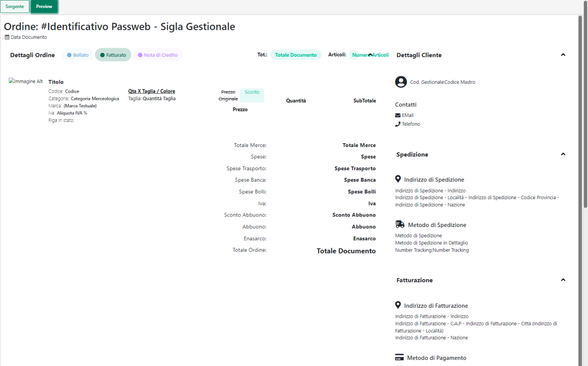
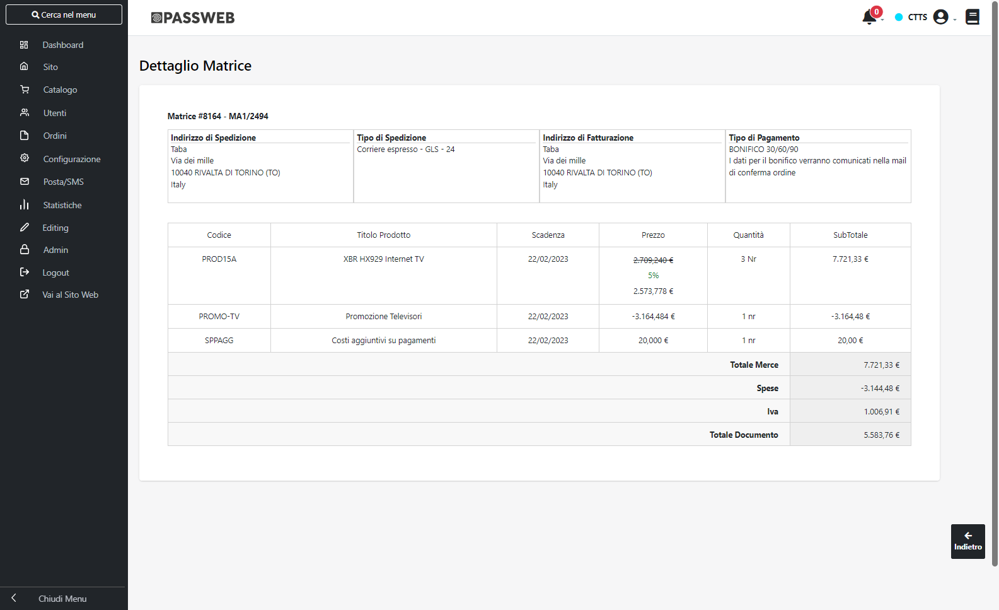
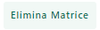
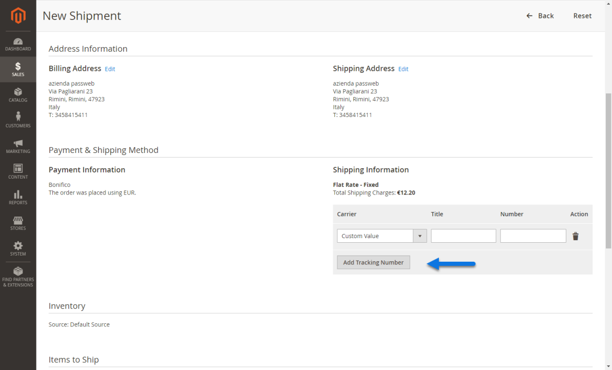
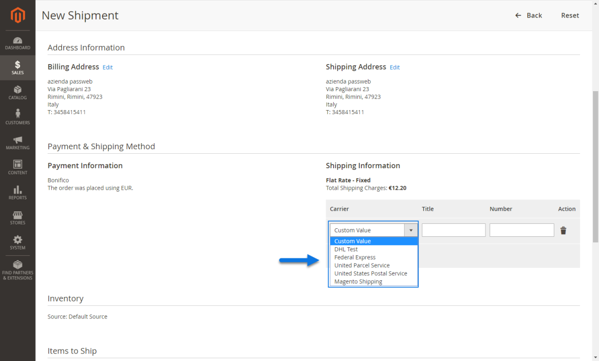
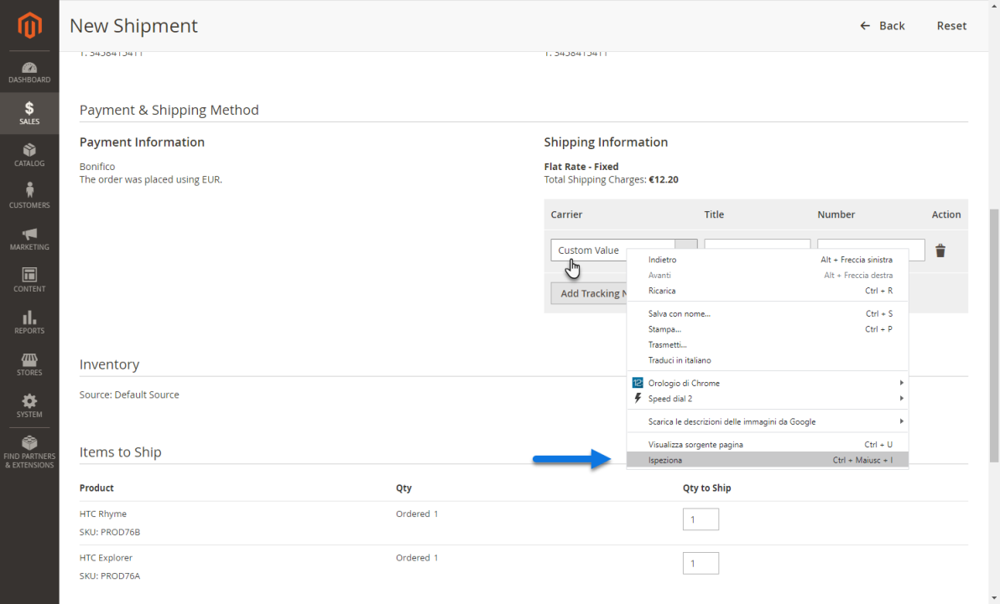
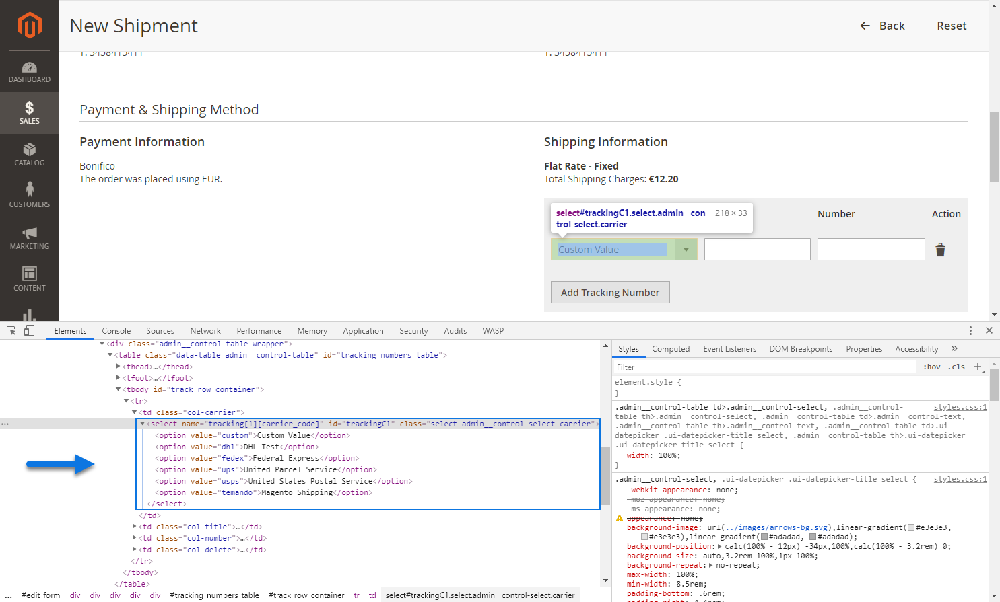
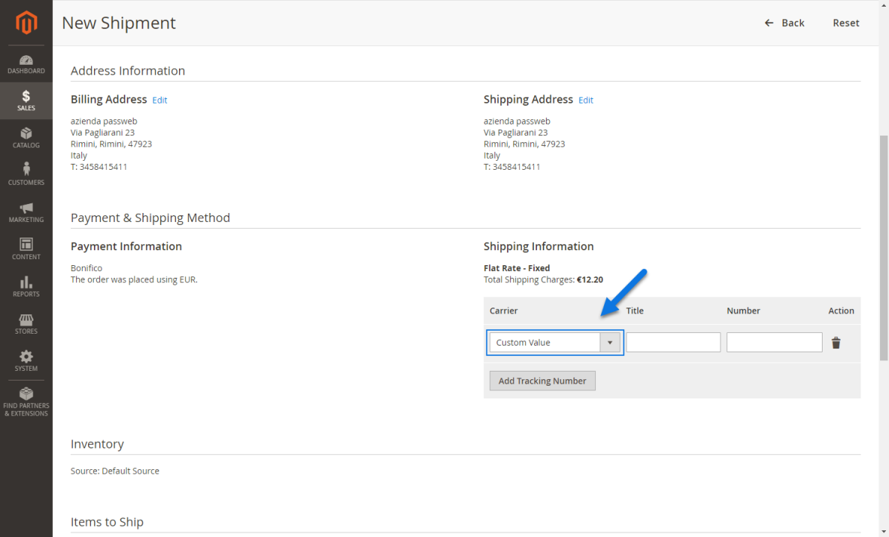
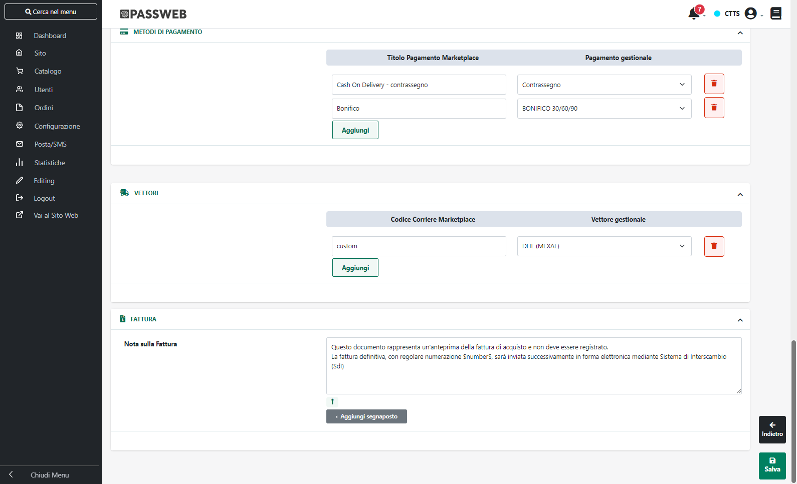

# CONFIGURAZIONE ORDINI

Come evidenziato nei precedenti capitoli di questo manuale
l'integrazione tra Passweb e Magento consente di importare in Passweb (e
conseguentemente nel gestionale Passepartout) ordini effettuati
direttamente sul sito Magento.

**ATTENZIONE!** A differenza della pubblicazione articoli,
l'importazione ordini da Magento può avvenire unicamente via API

**ATTENZIONE!** L'inserimento di un ordine Magento nel gestionale
Passepartout comporterà, eventualmente, la creazione automatica della
relativa anagrafica cliente e di eventuali anagrafiche articolo relative
a prodotti non ancora presenti nella base dati del gestionale

Affinchè questo tipo di integrazione possa funzionare in maniera
corretta è però necessario configurare adeguatamente la sezione
"**Ordini**" presente all'interno della maschera "**Dati Account**" del
relativo account Magento

Nello specifico dunque i campi presenti all'interno die questa maschera
consentono rispettivamente di:

**Creare ordini in Passweb:** consente di decidere se l'Account in esame
dovrà o meno interagire con la piattaforma terza a livello di ordini. E'
possibile selezionare uno dei seguenti valori:

- **No:** selezionando questa opzione l'Account in esame potrà
  interagire con la piattaforma terza **solo ed esclusivamente a livello
  di esportazione articoli**.

- **Si:** selezionando questa opzione sarà invece possibile integrarsi
  con la piattaforma terza non solo a livello di esportazione articoli
  **ma anche importando all'interno del proprio sito Passweb, e da qui
  all'interno del gestionale, eventuali nuovi ordini (e relativi
  clienti) acquisiti direttamente sulla piattaforma esterna**

**Data Ultima Sincronizzazione Ordini:** consente di impostare la data
da prendere in considerazione in fase di sincronizzazione ordini con il
marketplace esterno. In fase di sincronizzazione verranno quindi
valutati tutti gli ordini con data successiva a quella impostata
all'interno di questo campo

**Creare nuovi articoli nel gestionale**: consente di decidere come
dovranno essere tratti eventuali ordini provenienti dalla piattaforma
terza nel caso in cui all'interno di questi stessi documenti dovessero
essere presenti articoli non ancora inseriti tra le anagrafiche del
gestionale. E' possibile selezionare uno dei seguenti valori:

- **No (l'ordine non viene importato nel gestionale):** selezionando
  questa opzione eventuali ordini provenienti dalla piattaforma terza e
  con all'interno articoli non ancora codificati nella base dati del
  gestionale non verranno importati

> In queste condizioni sarà quindi necessario, per prima cosa,
> codificare gli articoli in questione all'interno del gestionale e,
> eventualmente, gestirli anche all'interno di un' apposita Inserzione
> facendo in modo di agganciarli ai relativi articoli sulla piattaforma
> terza mediante il corrispondente identificativo di prodotto.

- **SI (l'ordine viene sempre importato nel gestionale):** selezionando
  questa opzione eventuali ordini provenienti dalla piattaforma terza e
  con all'interno articoli non ancora codificati nella base dati del
  gestionale verranno comunque importati ed inseriti anche all'interno
  del gestionale Passepartout.

> In queste condizioni, infatti, contestualmente all'inserimento
> dell'ordine verranno anche create, in maniera totalmente automatica le
> nuove anagrafiche articolo. Per maggiori informazioni in merito si
> veda anche quanto indicato all'interno del successivo capitolo
> "*Codifica Automatica di nuove anagrafiche articolo*" di questo
> manuale

**Magazzino Ordini degli Articoli Gestiti:** consente di indicare lo
specifico magazzino che dovrà essere utilizzato e quindi movimentato a
seguito di ordini acquisiti direttamente sulla piattaforma esterna

**Sezionale degli Ordini:** consente di indicare uno specifico
sezionale, tra quelli codificati all'interno del gestionale, in cui
verranno memorizzati gli ordini acquisiti direttamente sulla piattaforma
esterna

Ovviamente è consigliabile definire uno specifico sezionale per gli
ordini provenienti da Magento in maniera tale da poterli poi distinguere
facilmente da quelli caricati direttamente sul gestionale piuttosto che
da quelli provenienti da altri Marketplace come ad esempio eBay o
Amazon.

**Numero Causale Movimento di Magazzino Documento**: consente di
indicare il numero della Causale che dovrà essere utilizzata,
all'interno del gestionale, per indicare che l'ordine corrispondente è
stato originato sul sito Magento

**ATTENZIONE!** Nel momento in cui per il campo in esame non dovesse
essere indicato uno specifico valore, come Numero della Causale del
Movimento di Magazzino verrà utilizzato quello impostato in
corrispondenza dello stesso parametro presente alla pagina "**Ordini --
Configurazione Ordini**" del Wizard

**Numero del centro di Costo/Ricavo**: consente di indicare il numero da
attribuire al campo "**Costi/ricavi",** presente nella testata del
relativo documento gestionale, nel caso in cui l'ordine provenga da un
sito Magento

**ATTENZIONE!** Nel momento in cui per il campo in esame non dovesse
essere indicato uno specifico valore, come Numero del Centro di
Costo/Ricavo verrà utilizzato quello impostato in corrispondenza dello
stesso parametro presente alla pagina "**Ordini -- Configurazione
Ordini**" del Wizard

**Sconto -- Articolo utilizzo:** consente di indicare, selezionandolo
dall'apposito menu a tendina, l'articolo spesa che dovrà essere
utilizzato per gestire eventuali sconti (a valore o in percentuale)
presenti sulle righe del documento prelevato da Magento.

**ATTENZIONE!** eventuali sconti, **siano essi fissi o percentuali**,
presenti sul documento acquisito da Magento verranno gestiti nel
corrispondente documento gestionale mediante l'inserimento dell'articolo
spesa indicato in corrispondenza del parametro "Sconto -- Articolo
Utilizzo".

Tale articolo sarà inserito nel documento con quantità unitaria negativa
e importo pari allo sconto in essere.

**Vettore del Documento:** consente di impostare il Vettore che dovrà
essere inserito a default nel piede del documento gestionale generato a
seguito di ordini acquisiti direttamente da Magento.

E' possibile selezionare solo ed esclusivamente Vettori codificati
all'interno del gestionale ed esportati all'interno del proprio sito
Passweb.

**ATTENZIONE!** Il vettore indicato in questo campo verrà utilizzato
solo ed esclusivamente nel caso in cui l'ordine proveniente da Magento
dovesse essere privo di vettori o dovesse avere un vettore non ancora
correttamente mappato tra quelli presenti all'interno della successiva
sezione "Vettori". In quest'ultimo caso verrà anche inserita un'apposita
nota d'ordine con l'indicazione del vettore effettivamente presente
nell'ordine in arrivo da Magento

**Esenzione IVAUE:** consente di indicare, selezionandola tra quelle
codificate all'interno del gestionale la specifica esenzione che dovrà
essere utilizzata nel momento in cui, lato Magento, si dovesse decidere,
per qualche ragione, di utilizzare delle spese di trasporto IVA esente e
l'indirizzo di spedizione, presente sull'ordine, dovesse essere relativo
ad un paese UE.

**ATTENZIONE!** l'esenzione impostata all'interno di questo campo verrà
utilizzata anche sulle righe di eventuali articoli presenti nell'ordine
prelevato dal marketplace e gestiti, anch'essi, in esenzione iva

**Esenzione IVA Extra UE:** consente di indicare, selezionandola tra
quelle codificate all'interno del gestionale la specifica esenzione che
dovrà essere utilizzata nel momento in cui, lato Magento, si dovesse
decidere, per qualche ragione, di utilizzare delle spese di trasporto
IVA esente e l'indirizzo di spedizione, presente sull'ordine, dovesse
essere relativo ad un paese Extra UE.

**ATTENZIONE!** l'esenzione impostata all'interno di questo campo verrà
utilizzata anche sulle righe di eventuali articoli presenti nell'ordine
prelevato dal marketplace e gestiti, anch'essi, in esenzione iva

Per quel che riguarda le spese di trasporto è bene sottolineare anche
che queste verranno gestite mediante appositi articoli di tipo Spesa
inseriti nel corpo del documento e codificati automaticamente da Passweb
in fase di inserimento del relativo ordine.

In sostanza dunque nel momento in cui dovesse essere importato un ordine
Magento in cui è stato utilizzato un metodo di spedizione per cui non è
ancora presente in Mexal / Ho.Re.Ca. il corrispondente articolo di tipo
Spesa, Passweb provvederà a crearlo in maniera del tutto automatica
secondo le seguenti regole:

- **Il codice e la descrizione** dell'articolo Spesa coincideranno
  esattamente con il codice e la descrizione del metodo di spedizione
  presente sul documento Magento (informazioni queste che vengono
  passate direttamente dalla piattaforma terza)

- **L'unità di misura** dell'articolo Spesa verrà impostata
  automaticamente su "pz"

- **L'aliquota iva** dell'articolo Spesa sarà esattamente quella
  definita per gestire le spese di trasporto in Magento mediante il
  parametro "**Tax Class for Shipping**" (*Store -- Configuration --
  Sales -- Tax*)

> Se poi per qualche ragione in Magento si dovesse decidere di gestire
> delle spese di trasporto IVA esenti, impostando quindi il parametro in
> figura sul valore "None", al corrispondente articolo Mexal / Ho.Re.Ca,
> verrà assegnata, in base anche all'indirizzo di spedizione merce,
> l'esenzione IVA indicata in corrispondenza del parametro **Esenzione
> UE / Extra UE**

Per maggiori informazioni relativamente ai parametri presenti
all'interno delle sezioni "Stati Ordine", "Parametri Clienti", "Metodi
di Pagamento", "Vettori" e "Fattura" si vedano i successivi capitoli di
questo manuale.

**STATI ORDINE**

La sezione "**Stati Ordine**", presente all'interno della maschera
"**Dati Account / Ordini**", consente di definire gli stati degli ordini
Magento che dovranno essere utilizzati come filtro di importazione sul
Gestionale.

Nel box di sinistra, presente in corrispondenza del parametro "**Stati
Ordine Gestiti**", sono elencati i diversi possibili stati in cui può
trovarsi, all'interno di Magento, un determinato ordine.

Per fare in modo che gli ordini che si trovano, in Magento, in un
determinato stato possano essere importati in Passweb (e quindi nel
gestionale Passepartout) sarà sufficiente selezionare lo stato in
questione tra quelli presenti in elenco e inserirlo nel box di destra
cliccando sul pulsante raffigurante una piccola freccia rivolta verso
destra.

**ATTENZIONE! In fase di sincronizzazione verranno prelevati da Magento
ed inseriti, tramite Passweb, nel gestionale Passepartout, solo ed
esclusivamente quegli ordini che si trovano in uno degli stati indicati
all'interno del box di destra**

Indipendentemente dagli stati gestiti, nel momento in cui un determinato
documento dovesse essere importato in Passweb e conseguentemente nel
gestionale Passepartout, questo verrà ovviamente considerato come un
normale ordine.

In altri termini dunque se si dovesse decidere, ad esempio, di importare
anche ordini in stato "Canceled" questi verranno poi inseriti nel
gestionale Passepartout allo stesso modo degli ordini in stato "Pending"
**non verranno cioè posti automaticamente nello stato di Annullato.**

Nel corpo del documento verrà comunque inserita una nota con
l'indicazione dello stato in cui si trovava l'ordine Magento nel momento
in cui quello stesso ordine è stato effettivamente importato

**ATTENZIONE!** **In ogni caso occorre sempre prestare particolare
attenzione alle operazioni e ad eventuali cambi di stato che verranno
poi effettuati lato gestionale sugli ordini importati. Al fine di
evitare problemi tali operazioni dovranno infatti essere sempre coerenti
con quello che è lo stato in cui si trovano gli stessi documenti
all'interno della piattaforma terza**

Tornando all'esempio precedente, se si dovesse decidere di importare
anche gli ordini cancellati questi, una volta inseriti nel gestionale,
non andrebbero, ovviamente, bollati e/o evasi.

##### STORE ORDINE

La sezione "**Store Ordine**", presente all'interno della maschera
"**Dati Account / Ordini**", consente di definire quelli che dovranno
essere gli Store Magento da cui importare gli ordini

Nel box di sinistra, presente in corrispondenza del parametro "**Stores
Gestiti**", sono elencati i diversi store attualmente attivi sulla
piattaforma terza.

Per fare in modo che gli ordini che si trovano, in Magento, in un
determinato store, possano essere importati in Passweb (e quindi nel
gestionale Passepartout) sarà sufficiente selezionare lo store in
questione tra quelli presenti in elenco e inserirlo nel box di destra
cliccando sul pulsante raffigurante una piccola freccia verde rivolta
verso destra.

**ATTENZIONE! In fase di sincronizzazione verranno prelevati da Magento
ed inseriti, tramite Passweb, nel gestionale Passepartout, solo ed
esclusivamente quegli ordini collegati agli Store Magento indicati nel
del box di destra**

##### PARAMETRI CLIENTI

La sezione "**Parametri Clienti**", presente all'interno della maschera
"**Dati Account / Ordini**", consente di impostare i principali
parametri di configurazione relativi ad eventuali nuovi clienti
acquisiti a seguito di ordini effettuati sulla piattaforma terza.

**ATTENZIONE!** I nuovi clienti verranno inseriti su Passweb, e
conseguente sul gestionale Passepartout, contestualmente all'inserimento
del loro primo ordine

Nello specifico poi il campo

- **Codici Mastro dei Clienti (solo Ecommerce Mexal)**: consente di
  indicare lo specifico codice Mastro del gestionale in cui verranno
  create le nuove anagrafiche relative ai clienti acquisiti a seguito di
  ordini effettuati sulla piattaforma terza

- **Campo Clienti 'Codice Fiscale'**: consente di indicare,
  selezionandolo dall'apposito menu a tendina, il campo Magento dal
  quale prelevare il codice fiscale che dovrà poi essere inserito nel
  corrispondente campo dell'anagrafica utente all'interno del gestionale

- **Campo Clienti 'PEC':** consente di indicare, selezionandolo
  dall'apposito menu a tendina, il campo Magento dal quale prelevare
  l'indirizzo PEC che dovrà poi essere inserito nel corrispondente campo
  dell'anagrafica utente all'interno del gestionale.

- **Campo Clienti 'SDI'**: consente di indicare, selezionandolo
  dall'apposito menu a tendina, il campo Magento dal quale prelevare il
  "Codice destinatario SDI" che dovrà poi essere inserito nel
  corrispondente campo dell'anagrafica utente all'interno del
  gestionale.

I due parametri "Campo Clienti PEC" e "Campo Clienti SDI" sono di
fondamentale importanza per poter attivare tutte le funzioni e gli
automatismi messi a disposizione dai gestionali Passepartout in merito
alla fatturazione elettronica. Nel caso in cui i due campi in oggetto
non dovessero essere configurati infatti, le anagrafiche utente create
all'interno del gestionale saranno prive tanto del "Codice Destinatario
SDI" quanto dell'indirizzo di posta certificata per cui diventerà
particolarmente difficile poter poi emettere, verso questi clienti, la
fattura elettronica

Il problema di fondo, in questo senso, è rappresentato dal fatto che **i
due campi SDI e PEC (come anche il campo relativo al codice fiscale) non
sono campi standard di Magento per cui per poter gestire queste
informazioni è necessario ricorrere a dei moduli aggiuntivi**

In questo senso, nella scelta del modulo da acquistare per gestire
questo tipo di informazioni, è di fondamentale importanza ricordarsi che
l'integrazione Passweb -- Magento si basa sulle API standard messe a
disposizione da Magento stesso per cui **è assolutamente indispensabile
che i campi SDI e PEC aggiunti dal modulo esterno siano poi accessibili
in lettura / scrittura mediante queste stesse API** attraverso i metodi
di seguito indicati:

- attributeMetadata/customer

- attributeMetadata/customer/custom

- attributeMetadata/customerAddress

- attributeMetadata/customerAddress/custom

Tali dati dovranno quindi essere correttamente salvati o nell'anagrafica
dell'utente o nell'anagrafica del suo indirizzo di fatturazione

**ATTENZIONE! Nel caso in cui i campi Magento utilizzati per gestire SDI
e PEC non siano accessibili tramite API Standard, Passweb non avrà modo
di accedere a queste informazioni.**

Nel caso in cui il modulo o la personalizzazione Magento che si è scelto
di adottare dovesse utilizzare uno stesso campo (es. Codice SDI / PEC)
per gestire queste informazioni, i due parametri "Campo Clienti PEC" e
"Campo Clienti SDI" dovranno essere entrambi impostati, come in figura,
sullo stesso valore "**Codice SDI / PEC**"

Sarà poi Passweb sulla base dell'effettivo valore inserito all'interno
di questo campo a smistare il dato sul campo gestionale corretto. Nello
specifico:

- se il valore inserito, lato Magento, dovesse essere un indirizzo mail
  questo verrà inserito, nell'anagrafica utente del gestionale,
  all'interno del campo PEC

- se il valore inserito, lato Magento, non dovesse avere il formato di
  un indirizzo mail, il dato verrà inserito, nell'anagrafica utente del
  gestionale, all'interno del campo "Codice destinatario SDI"

##### METODI DI PAGAMENTO

La sezione "**Metodi di Pagamento**", presente all'interno della
maschera "Dati Account / Ordini", consente di mappare i pagamenti
indicati sugli ordini acquisiti dalla piattaforma terza associandoli ad
uno dei pagamenti appositamente codificati all'interno del gestionale
Passepartout

Per mappare un nuovo pagamento è necessario, per prima cosa cliccare sul
pulsante "**Aggiungi**" evidenziato in figura in maniera tale da far
comparire i due nuovi campi "**Titolo Pagamento Marketplace**" e
"**Pagamento gestionale**"

A questo punto all'interno del campo

**Titolo Pagamento Magento**: sarà necessario inserire esattamente il
titolo utilizzato in Magento per identificare il pagamento che si
intende mappare. Per ottenere questo dato è sufficiente accedere alla
maschera di configurazione del pagamento Magento (*Store --
Configuration -- Sales -- Payment Methods*) e copiare quanto indicato
all'interno del campo "**Title"**

**ATTENZIONE!** Nel caso in cui il valore inserito all'interno del campo
"**Titolo Pagamento Marketplace**" non coincida esattamente con il
"Title" di uno dei pagamenti gestiti in Magento, il corrispondente
documento verrà inserito nel gestionale con il campo relativo al
pagamento non valorizzato.

**Pagamento gestionale**: consente di indicare, selezionandolo
dall'apposito menu a tendina il pagamento Mexal / Ho.Re.Ca con cui
mappare il corrispondente pagamento Magento

Ovviamente affinché l'operazione di mapping possa funzionare in maniera
corretta sarà necessario per prima cosa codificare, per ciascuno dei
pagamenti gestiti su Magento, il corrispondente pagamento Mexal /
Ho.Re.Ca in maniera tale da poterselo poi ritrovare tra quelli
effettivamente selezionabili all'interno del campo "**Pagamento
Gestionale**"

##### VETTORI

La sezione **"Vettori"** presente all'interno della maschera "Dati
Account / Ordini", consente di mappare i corrieri utilizzati in Magento
per gestire i diversi metodi di spedizione associandoli ad uno dei
vettori utilizzati all'interno del gestionale Passepartout.

**ATTENZIONE!**: mappare i corrieri utilizzati in Magento con i vettori
utilizzati all'interno del gestionale Passepartout, è un' operazione di
fondamentale importanza. Una volta effettuata questa mappatura sarà
infatti possibile creare spedizioni (shipments) su Magento partendo
direttamente dall'ordine acquisto all'interno del gestionale senza per
questo perdere eventuali logiche e/o automatismi definiti su Magento per
lo specifico corriere.

Per mappare un nuovo corriere è necessario, per prima cosa, cliccare sul
pulsante "**Aggiungi**" evidenziato in figura, in maniera tale da far
comparire i due nuovi campi "**Codice Corriere Marketplace**" e
"**Vettore Gestionale**"

A questo punto all'interno del campo

**Codice Corriere Marketplace:** sarà necessario **inserire esattamente
il codice del corriere Magento che si intende mappare**

**ATTENZIONE!** Il codice corriere pur essendo un dato richiesto come
obbligatorio dalla API di Magento per poter creare delle spedizioni
(shipments) non è purtroppo visibile ne sul front-end ne tanto meno sul
back-end dell'applicazione.

Per ottenere questa informazione è quindi necessario rivolgersi al
proprio sviluppatore Magento o in, alternativa, provare a seguire la
procedura di seguito indicata:

- Accedere, nel back end di Magento alla sezione "*Sales -- Orders*" e
  selezionare, tra quelli presenti in elenco, un ordine per cui non sono
  ancora state create delle spedizioni

- Cliccare sul pulsante "**Ship**" in maniera tale da avviare la
  procedura per la creazione di una nuova spedizione (che poi non dovrà
  essere necessariamente confermata)

- Portarsi all'interno della sezione "*Payment & Shipping Method*" e
  cliccare sul pulsante "**Add Tracking Number**" presente in
  corrispondenza della sotto sezione "*Shipping Information*"

- A questo punto il campo "**Carrier**" presente nel piccolo form di
  aggiunta del tracking number, conterrà l'elenco dei corrieri
  utilizzabili per creare la spedizione

- Per ottenere i codici corriere necessari per effettuare l'operazione
  di mappatura con i vettori gestionali, sarà necessario ispezionare il
  codice sorgente della pagina e, nello specifico, visualizzare il
  codice della select evidenziata in figura. Per far questo è
  sufficiente portarsi con il mouse all'interno del campo Carrier,
  cliccare con il pulsante destro e selezionare dal menu contestuale la
  voce "**Ispeziona**"

- Espandendo quindi la select evidenziata nel codice sorgente della
  pagina avremo a disposizione tutte le informazioni che ci servono

> Nello specifico a ciascuno dei corrieri presenti all'interno del menu
> a tendina corrisponde una \< option \> all'interno della select
> evidenziata in figura. **Il codice del vettore che ci serve per
> poterlo mappare con uno dei vettori gestionali è esattamente quello
> presente nella rispettiva option all'interno dell'attributo "value**"

- Di seguito vengono riportati, per semplicità, i codici di alcuni dei
  corrieri predefiniti disponibili su Magento:

  - DHL 🡪 Codice: dhl

  - Federal Express 🡪 Codice: fedex

  - UPS 🡪 Codice: ups

  - USPS 🡪 Codice usps

Ovviamente nel caso in cui fossero gestiti dei corrieri personalizzati
creati da un modulo di terze parti (uno molto interessante in questo
senso potrebbe essere quello presente al seguente indirizzo
<https://www.xtento.com/magento-extensions/magento-custom-generic-carrier-trackers-extension.html>
), per poterli poi mappare con vettori gestionali, sarà necessario poter
ottenere anche il loro codice.

**Vettore Gestionale:** consente di indicare, selezionandolo
dall'apposito menu a tendina, il vettore gestionale da associare al
corriere Magento il cui codice è quello indicato all'interno del
precedente parametro

**ATTENZIONE!** All'interno del campo "Vettore Gestionale" verranno
visualizzati solo ed esclusivamente i vettori a cui è stato associato
uno specifico "Codice Gestionale" (Ecommerce Mexal) o uno specifico
"Nome Vettore" (Ecommerce Horeca)

Questo significa dunque che prima di poter mappare i corrieri Magento
con i vettori utilizzati all'interno del gestionale sarà necessario:

- **Nel caso di collegamento con Mexal**: attivare, nel back end di
  Passweb, dei vettori di tipo "Gestionale" o di tipo "Passweb" con
  associato uno specifico codice conto

- **Nel caso di collegamento con uno dei gestionali Ho.Re.Ca**:
  attivare, nel back end di Passweb, dei vettori di tipo "Passweb" con
  associato uno specifico "Nome Vettore"

Per maggiori informazioni in merito si veda anche la sezione "*Ordini --
Metodi di Trasporto -- Integrazione Passweb -- Magento / Prestashop*" di
questo manuale

Un'ultima osservazione molto importante riguarda quello che avverrebbe
nel momento in cui il campo "**Codice Corriere Magento"** dovesse essere
lasciato vuoto o dovesse essere valorizzato con un valore che non
corrisponde ad uno dei codici corriere utilizzati in Magento e, allo
stesso tempo, all'interno del campo "**Vettore Gestionale**" dovesse
essere indicato uno dei vettori presenti in elenco.

In queste condizioni se, in fase di creazione della spedizione dovesse
essere indicato nel piede del documento gestionale il Vettore mappato in
maniera non corretta, verrà comunque creata la spedizione su Magento ma,
ovviamente, senza poter agganciare nessuno dei corrieri gestiti su
questa piattaforma. Nello specifico la spedizione verrà quindi creata
con il campo "Carrier" impostato su "**Custom Value**"

##### FATTURA

La sezione **"Fattura"** presente all'interno della maschera "Dati
Account / Ordini", consente di indicare una specifica nota che verrà poi
inserita all'intero di eventuali fatture generate direttamente da
Magento.

In questo senso è bene ricordare infatti che **l'integrazione Passweb --
Magento prevede, ovviamente, che la fatturazione sia gestita
direttamente dai gestionali Passepartout.** Per evitare dunque di
comunicare al cliente eventuali numeri di fatture non valide ai fini
fiscali, oltra ad allineare i relativi numeratori e a riservare un'
apposito sezionale per gli ordini acquisti direttamente da Magento, si
consiglia anche di disabilitare, laddove possibile, eventuali opzioni di
fatturazione presenti sulla piattaforma esterna (e relativo invio di
mail al cliente).

Nel momento in cui ciò non fosse possibile si consiglia di inserire
nelle mail, e nel dettaglio di eventuali fatture generate dalla
piattaforma esterna, un apposito testo per indicare al cliente che il
documento ricevuto non è quello fiscalmente valido, documento questo che
gli verrà invece inviato tramite mail (da Mexal o da Passweb) e che
potrà essere scaricato in forma elettronica mediante Sistema di
Interscambio (SdI)

Nel caso specifico di Magento tale informazioni può essere inserita
all'interno del campo "**Nota sulla Fattura**"

Il pulsante "**Aggiungi Segnaposto**" consente di personalizzare il
messaggio inserendo al suo interno l'elemento {number}, elemento questo
che verrà poi sostituito dinamicamente da Passweb con il numero della
corrispondente fattura gestionale.

In fase di creazione dell'Invoice su Magento Passweb andrà ad inserire
il testo indicato all'interno di questo campo come commento al relativo
documento preoccupandosi anche di selezionare l'opzione "**Visible on
Storefront**" in maniera tale d rendere il commento visibile anche sul
front end del sito

