# CODIFICA AUTOMATICA DI NUOVE ANAGRFICHE UTENTE

Come indicato nei precedenti capitoli di questo manuale contestualmente
all' inserimento di un nuovo ordine Magento verranno create anche, in
maniera completamente automatica, le anagrafiche di eventuali nuovi
clienti non ancora codificati nella base dati gestionale.

In questo senso, la prima cosa da considerare è che **il campo mail
verrà utilizzato come campo chiave.** In conseguenza di ciò

- nel caso in cui **l'utente che ha effettuato l'ordine su Magento abbia
  utilizzato un indirizzo mail già presente nel database di Passweb**
  (perché magari aveva già effettuato, in precedenza, un primo acquisto)
  in fase di importazione ordine possono verificarsi due diverse
  situazioni:

  - l'utente presente nell'ordine in arrivo da Magento **è un utente
    registrato** sulla piattaforma terza. In questo caso verrà
    agganciata l'Anagrafica dell'utente che utilizza questa stessa mail
    e, eventualmente, ne verranno anche aggiornati i dati con quelli
    presenti nell'ordine che si sta acquisendo

  - l'utente presente nell'ordine in arrivo da Magento **è un utente
    Guest (Ospite)** che non si è quindi registrato sulla piattaforma
    terza. In questo caso verranno valutati Nome e Cognome presenti nei
    dati dell'ordine che si sta acquisendo; se questi coincidono con
    quelli dell'anagrafica già presente in Passweb verrà agganciata
    questa stessa anagrafica. Se invece Nome e Cognome presenti
    sull'ordine non dovessero coincidere con quelli dell'anagrafica già
    presente in Passweb, verrà creata una nuova Anagrafica. In queste
    condizioni potremmo quindi ritrovarci tanto in Passweb, quanto
    ovviamente nel gestionale Passepartout, più anagrafiche utente con
    la stessa mail ma con Nome e Cognome diversi

- nel caso in cui invece **l'utente che ha effettuato l'ordine su
  Magento abbia utilizzato un indirizzo mail non ancora presente nel
  database di Passweb**, in fase di importazione ordine verrà creata,
  sul gestionale, una nuova Anagrafica Utente **[prelevando i dati
  necessari dall'indirizzo di fatturazione / spedizione presenti
  sull'ordine acquisito]{.underline}**. Nello specifico:

  - l'**Email** coinciderà con quella inserita dall'utente su Magento

  - **Nome / Cognome / Ragione Sociale / Codice VAT (Partita IVA)**
    saranno esattamente quelli presenti sull'ordine acquisito da Magento
    in corrispondenza dei relativi campi dell' **indirizzo di
    fatturazione** (Billing Address)

  - **La distinzione tra Utente Privato e Utente Azienda avverrà sulla
    base del campo Magento presente nell' indirizzo di fatturazione**
    (Billing Address) **e utilizzato per gestire la partita IVA (campo
    VAT)** .

> Nel caso in cui tale campo dovesse essere valorizzato l'utente creato
> in Passweb (e conseguentemente nel gestionale Passepartout) sarà un
> utente di tipo Azienda. Inoltre:

- se dovesse essere valorizzato anche il campo "**Azienda**" presente
  sull'indirizzo di fatturazione di Magento, allora l'anagrafica creata
  sul gestionale sarà quella di una "normale" azienda (campo **"Soggetto
  Privato" e "Persona Fisica" non selezionati**) con **Ragione Sociale**
  impostata sul valore inserito dall'utente nel campo Azienda di Magento

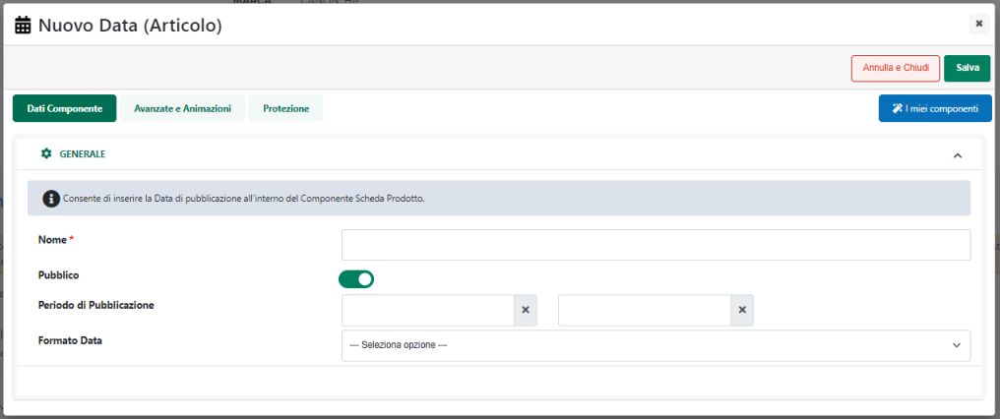{width="4.0in"
height="2.2729166666666667in"}

- se il campo "Azienda" presente sull'indirizzo di fatturazione di
  Magento non dovesse essere valorizzato, allora l'anagrafica creata sul
  gestionale sarà quella di un' **azienda individuale** (**campo
  "Soggetto privato" non selezionato e campo "Persona Fisica"
  selezionato**) con i campi Nome e Cognome impostati sui valori
  inseriti dall'utente nei relativi campi dell'indirizzo di fatturazione
  di Magento.

{width="4.0in"
height="2.2729166666666667in"}

> Al contrario, nel momento in cui il campo relativo alla partita IVA
> non fosse valorizzato l'utente creato in Passweb (e conseguentemente
> nel gestionale Passepartout) sarà invece un utente Privato (campi
> "**Soggetto Privato**" e "**Persona Fisica**" entrambi selezionati)

{width="4.0in"
height="2.2729166666666667in"}

- **I campi SDI e PEC necessari per la fatturazione elettronica**
  verranno valorizzati con i dati inseriti dall'utente nei relativi
  campi Magento e secondo la mappatura impostata su Passweb, in fase di
  configurazione dell'Account, per i parametri **"Campo Clienti PEC"** e
  **"Campo Clienti SDI"** (per maggiori informazioni in merito a questa
  mappatura si veda anche quanto indicato nel precedente capitolo di
  questo manuale)

- **Il campo relativo al Codice Fiscale** verrà valorizzato con i dati
  inseriti dall'utente nel relativo campo Magento e secondo la mappatura
  impostata su Passweb, in fase di configurazione dell'Account, per il
  parametro **"Campo Clienti Codice Fiscale"**

- **I campi Indirizzo / Nazione / CAP / Località / Provincia /
  Telefono** presenti nell'anagrafica utente gestionale verranno
  valorizzati con i dati inseriti, su Magento, in corrispondenza dei
  relativi campi dell' **indirizzo di fatturazione (Billing Address)**

- Nel caso in cui **l'utente dovesse indicare in fase di ordine su
  Magento un indirizzo di spedizione diverso da quello di fatturazione**
  tale indirizzo verrà automaticamente aggiunto, laddove possibile
  (quindi su Mexal), agli indirizzi di spedizione dell'utente (posto
  ovviamente che l'indirizzo indicato non fosse già stato associato in
  precedenza allo stesso utente)

> **ATTENZIONE!** Eventuali valori inseriti per i campi SDI / PEC /
> Partita Iva sull'indirizzo di spedizione non verranno presi in
> considerazione. Per questo tipo di informazioni si farà sempre
> riferimento a quanto indicato sull'indirizzo di fatturazione e,
> conseguentemente, a quanto presente nella relativa anagrafica utente
>
> In relazione agli indirizzi di spedizione / fatturazione occorre poi
> ricordare che, secondo quelle che sono le normali logiche di Passweb
> in merito alla gestione degli ordini, nel caso in cui l'utente dovesse
> utilizzare su Magento lo stesso indirizzo per fatturazione e
> spedizione merce nel piede del documento gestionale, all'interno della
> sezione "**Riferimenti di Trasporto**" non verrà inserito nessun
> indirizzo.

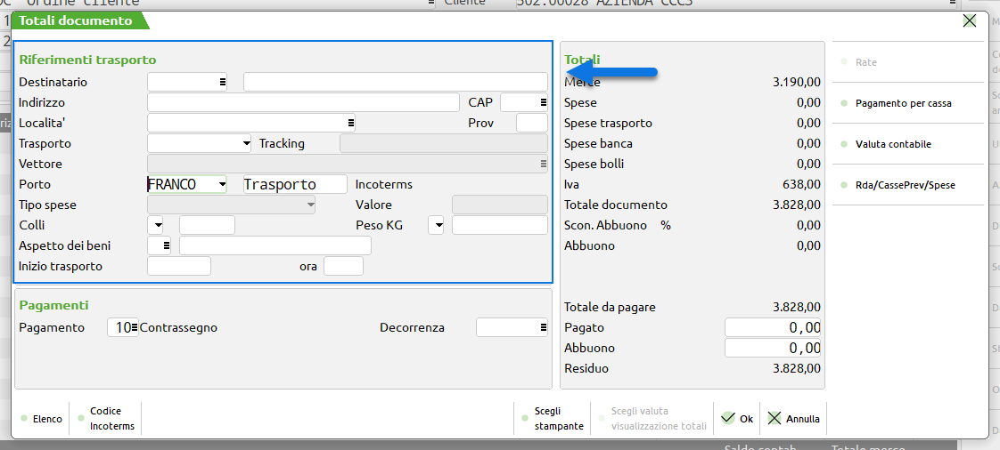{width="4.104166666666667in"
height="1.8506944444444444in"}

> In queste condizioni tanto per la spedizione quanto per la
> fatturazione occorrerà quindi fare riferimento all'indirizzo presente
> sull'anagrafica dell'utente.
>
> Nel caso in cui l'utente dovesse invece indicare un' indirizzo di
> spedizione diverso da quello di fatturazione, allora oltre a
> codificare in maniera automatica il nuovo indirizzo di spedizione,
> tale indirizzo verrà anche inserito nel piede del documento
> all'interno sempre della sezione "Riferimenti di Trasporto"

##### FATTURARE A

Magento, di base, consente di indicare direttamente in fase di ordine
indirizzi di fatturazione e di spedizione diversi da quello che può
essere l'indirizzo inserito dall'utente in fase di registrazione al
sito.

In questo caso la prima cosa da prendere in considerazione è che **per
determinare se un certo indirizzo presente nell'ordine acquisto da
Magento è relativo o meno al cliente che ha registrato l'account sulla
piattaforma terza, Passweb farà riferimento a quanto presente nei campi
Nome, Cognome e Azienda assegnati a questo stesso indirizzo**.

Nello specifico dunque:

- Se Nome, Cognome e Azienda, presenti nell'indirizzo di fatturazione /
  spedizione coincidono con gli analoghi dati dell'utente proprietario
  dell'account allora l'indirizzo in esame verrà considerato come
  appartenente a quello stesso utente

- Se nell'indirizzo di fatturazione / spedizione per i campi Nome,
  Cognome e Azienda non viene indicato nessun valore allora l'indirizzo
  in esame verrà considerato come appartenente a quello stesso utente

- Se Nome, Cognome e Azienda presenti nell'indirizzo di fatturazione /
  spedizione **NON** coincidono con gli analoghi dati dell'utente
  proprietario dell'account allora l'indirizzo in esame verrà
  considerato come appartenente ad un utente diverso

Detto ciò, considerando che le anagrafiche cliente verranno poi create,
all'interno del gestionale, sulla base dei dati presenti nell'ordine
Magento, si possono configurare diverse situazioni:

**[CASO 1]{.underline}**

**Il Cliente X effettua un ordine in cui imposta come indirizzo di
spedizione uno dei suoi indirizzi e come indirizzo di fatturazione
quello di un Cliente Y.**

Supponendo quindi che l'utente registrato al sito sia l'utente
"**Francesco -- ClienteXA**" come indicato in figura

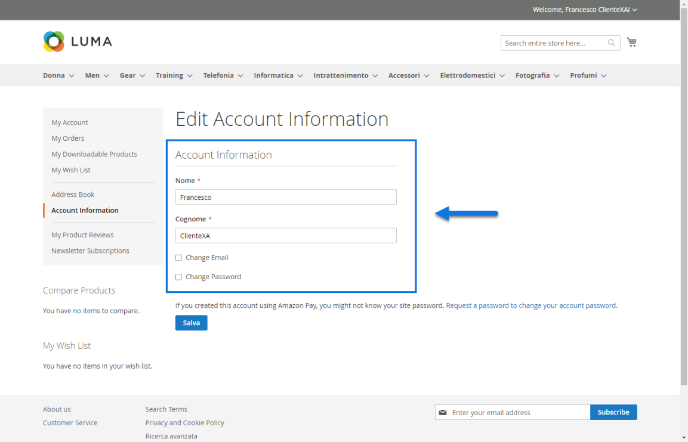{width="5.246527777777778in"
height="3.363888888888889in"}

in fase di ordine avremo, per il caso in esame, una situazione del tipo
di quella qui di seguito evidenziata

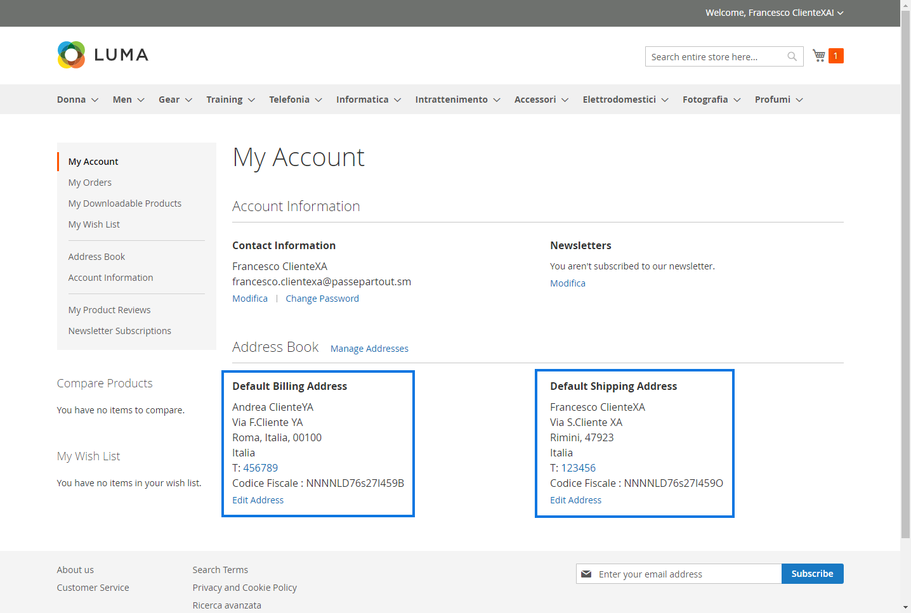{width="5.246527777777778in"
height="3.532638888888889in"}

- Indirizzo di **spedizione** relativo al cliente "Francesco --
  ClienteXA" (proprietario dell'account)

- Indirizzo di **fatturazione** relativo al cliente "Andrea --
  ClienteYA"

In queste condizioni:

- Sul gestionale verranno create le anagrafiche di entrambi gli utenti

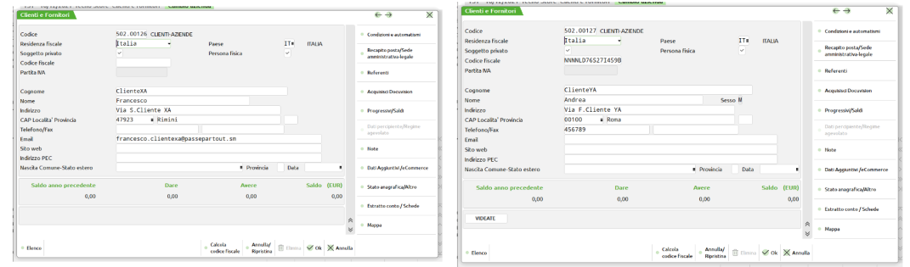{width="4.870138888888889in"
height="1.4347222222222222in"}

- L'ordine acquisito da Magento sarà intestato all'anagrafica cliente
  relativa a quanto indicato sull'indirizzo di fatturazione (Andrea --
  ClienteYA)

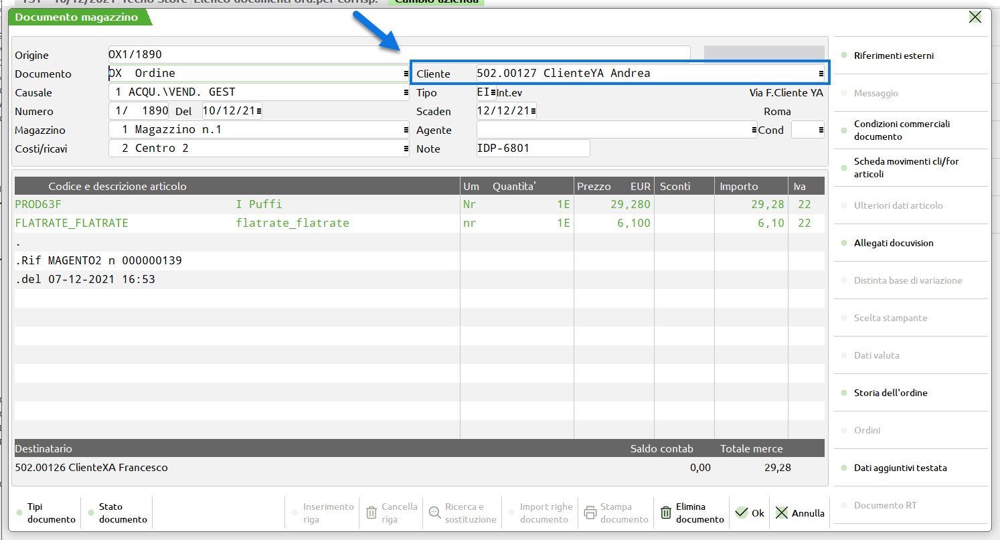{width="5.447916666666667in"
height="2.941666666666667in"}

- L'indirizzo di spedizione presente nel piede del documento gestionale
  sarà quello relativo all'anagrafica indicata nell'indirizzo di
  spedizione acquisito da Magento (Francesco -- ClienteXA)

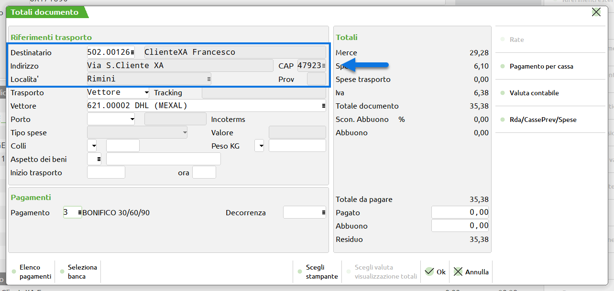{width="4.6819444444444445in"
height="2.2270833333333333in"}

- Ovviamente, lato Magento, il documento, anche dopo eventuali
  spedizioni / evasioni rimarrà sempre legato all'anagrafica del cliente
  che ha effettuato l'ordine (Francesco -- ClienteXA)

**[CASO 2]{.underline}**

**Il Cliente X effettua un ordine in cui imposta come indirizzo sia di
spedizione che di fatturazione quello di un Cliente Y.**

Supponendo quindi che l'utente registrato al sito sia l'utente
"**Francesco -- ClienteXA**" come indicato in figura

{width="5.246527777777778in"
height="3.363888888888889in"}

in fase di ordine avremo, per il caso in esame, una situazione del tipo
di quella qui di seguito evidenziata

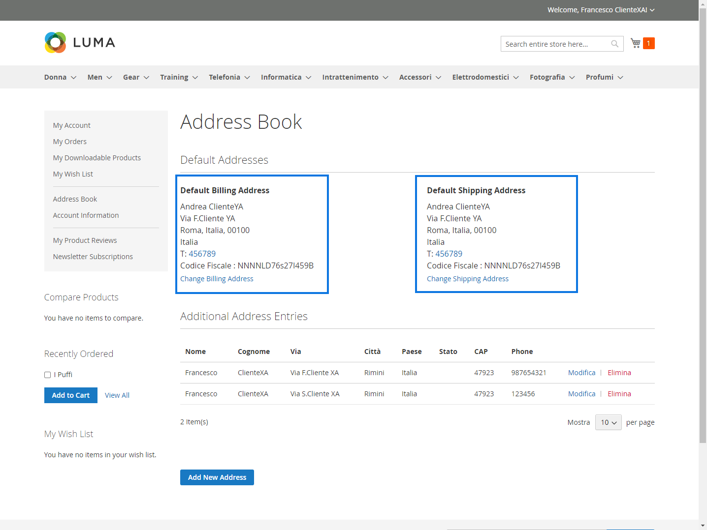{width="5.246527777777778in"
height="3.941666666666667in"}

- Indirizzo di **spedizione** relativo al cliente "Andrea -- ClienteYA"

- Indirizzo di **fatturazione** relativo al cliente "Andrea --
  ClienteYA"

In queste condizioni:

- Sul gestionale verrà creata solamente l'anagrafica del cliente
  indicato negli indirizzi di fatturazione e spedizione (Andrea --
  ClienteYA)

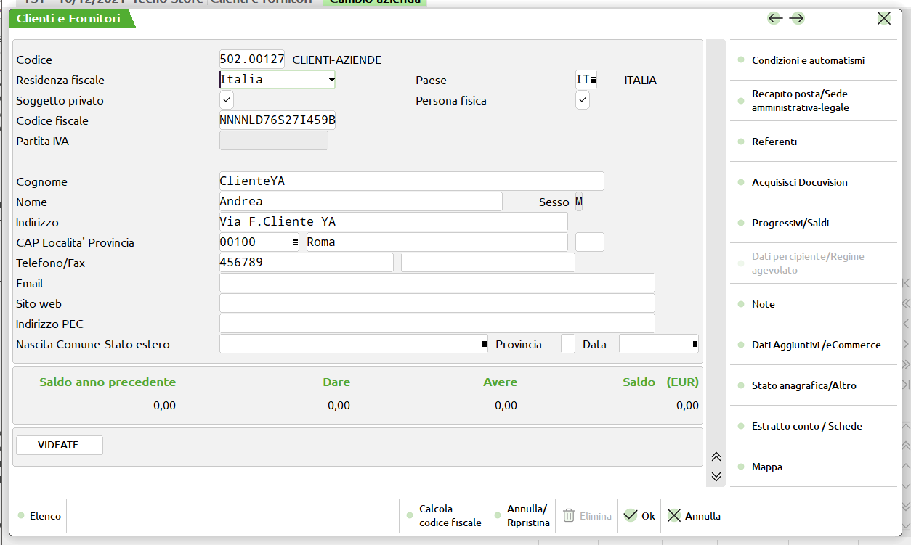{width="4.571527777777778in"
height="2.7402777777777776in"}

> Passweb effettuerà anche un controllo per verificare se l'anagrafica
> del cliente indicato nell'ordine acquisto da Magento sia eventualmente
> già presente nel suo database. In caso positivo non verrà creata
> nessuna nuova anagrafica ma verrà semplicemente agganciata quella già
> esistente. In caso negativo verrà invece creata la nuova anagrafica
>
> **ATTENZIONE! Il controllo in esame è basato sul fatto che
> l'anagrafica in esame sia stata generata a partire dall'utenza
> registrata su Magento che ha effettivamente generato l'ordine.**
>
> In conseguenza di ciò se successivamente un altro utente Magento
> diverso da "Francesco -- Cliente XA" dovesse generare un ordine
> indicando come indirizzo di fatturazione lo stesso dell'esempio
> indicato (quindi un indirizzo intestato a "Andrea -- Cliente YA")
> allora, in queste condizioni, verrebbe effettivamente generata una
> nuova anagrafica.
>
> La stessa cosa avverrebbe ovviamente nel caso in cui l'indirizzo su
> Magento venisse prima eliminato e successivamente ricreato (in questo
> caso cambierebbe infatti l'identificativo dell'indirizzo stesso)

- L'ordine acquisito da Magento sarà intestato all'anagrafica cliente
  relativa a quanto indicato sull'indirizzo di fatturazione (Andrea --
  ClienteYA)

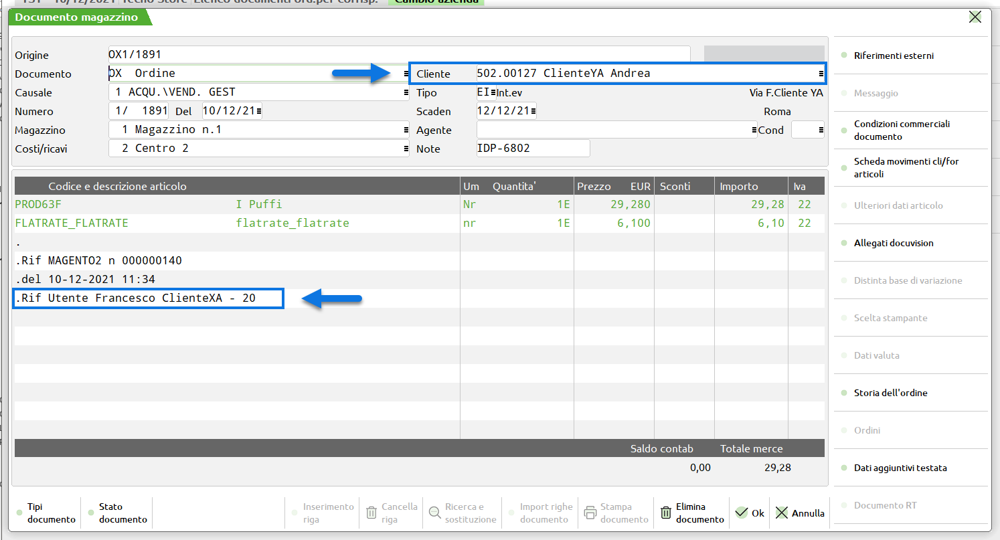{width="5.447916666666667in"
height="2.941666666666667in"}

> **ATTENZIONE! In queste condizioni non sarà possibile creare sul
> gestionale l'anagrafica dell'utente "Francesco -- Cliente XA"**
>
> In conseguenza di ciò, come evidenziato anche nella figura sopra
> riportata, **verrà aggiunta all'ordine un'ulteriore nota con il
> riferimento all'utente che ha effettivamente generato l'ordine su
> Magento. In particolare nella nota in questione verrà inserito Nome,
> Cognome e ID dell'utente che su Magento ha generato l'ordine**
> (Francesco Cliente XA -- 20)

- Considerando che, in queste condizioni, viene utilizzato lo stesso
  indirizzo per fatturazione e spedizione, secondo quelle che sono le
  normali logiche di Passweb in merito alla gestione degli ordini, nel
  piede del documento gestionale, all'interno della sezione
  "**Riferimenti di Trasporto**" non verrà inserito nessun indirizzo

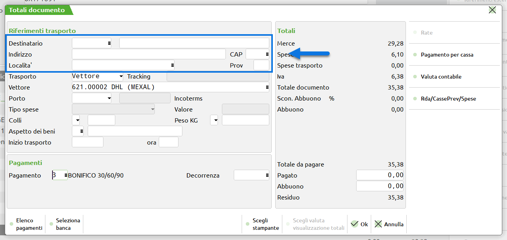{width="4.6819444444444445in"
height="2.2270833333333333in"}

- Ovviamente, lato Magento, il documento, anche dopo eventuali
  spedizioni / evasioni rimarrà sempre legato all'anagrafica del cliente
  che ha effettuato l'ordine (Francesco -- ClienteXA). Come detto i
  riferimenti di questo utente Magento saranno presenti nella nota
  dell'ordine trasmesso al gestionale

**[CASO 3]{.underline}**

**Il Cliente X effettua un ordine in cui imposta come indirizzo di
fatturazione quello di un Cliente Y e come indirizzo di spedizione
quello di un Cliente Z**

Supponendo quindi che l'utente registrato al sito sia l'utente
"**Francesco -- ClienteXA**" come indicato in figura

{width="5.246527777777778in"
height="3.363888888888889in"}

in fase di ordine avremo, per il caso in esame, una situazione del tipo
di quella qui di seguito evidenziata

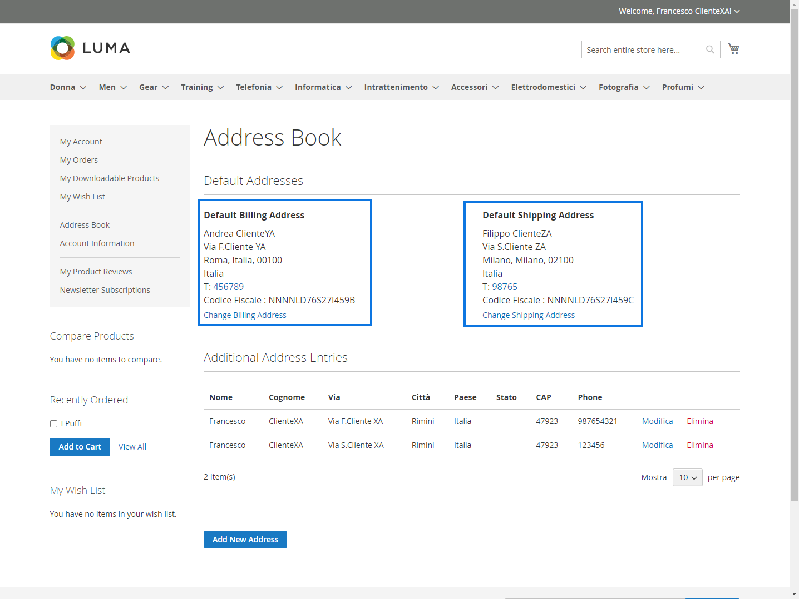{width="5.246527777777778in"
height="3.941666666666667in"}

- Indirizzo di **spedizione** relativo al cliente "Filippo -- ClienteZA"

- Indirizzo di **fatturazione** relativo al cliente "Andrea --
  ClienteYA"

In queste condizioni:

- Sul gestionale verrà creata l'anagrafica del cliente indicato nell'
  indirizzo di fatturazione (Giovanni -- ClienteYA)

{width="5.915277777777778in"
height="3.0194444444444444in"}

> Come nel caso precedente Passweb effettuerà anche un controllo per
> verificare se l'anagrafica del cliente corrispondente all'indirizzo di
> fatturazione sia eventualmente già presente nel suo database. In caso
> positivo non verrà creata nessuna nuova anagrafica ma verrà
> semplicemente agganciata quella già esistente. In caso negativo verrà
> invece creata la nuova anagrafica
>
> **ATTENZIONE! Il controllo è basato sul fatto che l'anagrafica in
> esame sia stata generata a partire dall'utenza registrata su Magento
> che ha effettivamente generato l'ordine.**
>
> In conseguenza di ciò se successivamente un altro utente Magento
> diverso da "Francesco -- Cliente XA" dovesse generare un ordine
> indicando come indirizzo di fatturazione lo stesso dell'esempio
> indicato (quindi un indirizzo intestato a "Andrea -- Cliente YA")
> allora, in queste condizioni, verrebbe effettivamente generata una
> nuova anagrafica.

Da qui in avanti poi l'applicazione potrà comportarsi in due modi
diversi a seconda del fatto che l'utente che ha generato l'ordine su
Magento (Francesco -- ClienteXA) sia o meno già presente tra le
anagrafiche di Passweb **(in questo caso la chiave utilizzata sarà
l'identificativo del cliente su Magento e se questo non dovesse essere
presente l'indirizzo mail)**

In particolare:

**Nel caso in cui l'utente che ha generato l'ordine su Magento
(Francesco -- ClienteXA) NON dovesse essere già presente tra le di
Passweb**

- verrà creata sul gestionale anche l' anagrafica del cliente indicato
  nell' indirizzo di spedizione (Filippo -- ClienteZA)

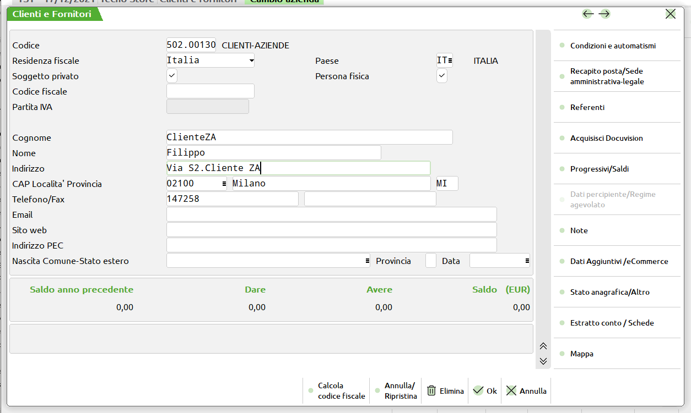{width="4.571527777777778in"
height="2.7402777777777776in"}

- L'ordine acquisito da Magento sarà intestato all'anagrafica cliente
  relativa a quanto indicato sull'indirizzo di fatturazione (Andrea --
  ClienteYA)

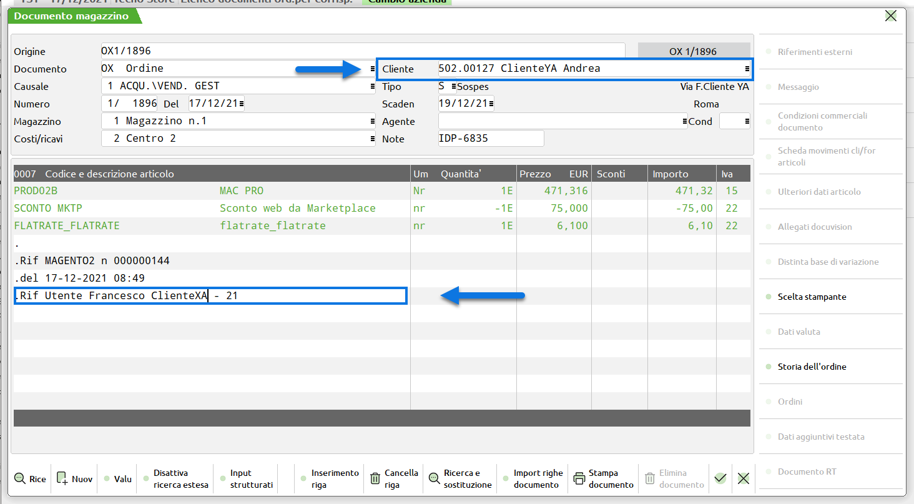{width="5.3375in"
height="2.941666666666667in"}

> **ATTENZIONE!** In queste condizioni non sarà possibile creare sul
> gestionale l'anagrafica dell'utente "Francesco -- Cliente XA"
>
> In conseguenza di ciò, come evidenziato anche nella figura sopra
> riportata, verrà aggiunta all'ordine un'ulteriore nota con il
> riferimento all'utente che ha effettivamente generato l'ordine su
> Magento. In particolare nella nota in questione verrà inserito Nome,
> Cognome e ID dell'utente che su Magento ha generato l'ordine
> (Francesco Cliente XA -- 21)

- L'indirizzo di spedizione presente nel piede del documento gestionale
  sarà quello relativo all'anagrafica indicata nell'indirizzo di
  spedizione acquisito da Magento (Filippo -- ClienteZA)

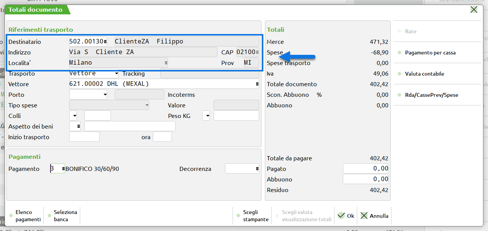{width="4.6819444444444445in"
height="2.2270833333333333in"}

**Nel caso in cui l'utente che ha generato l'ordine su Magento
(Francesco -- ClienteXA) dovesse già essere presente tra le anagrafiche
di Passweb**

- L'indirizzo di spedizione presente nel documento acquisito da Magento
  (Filippo -- ClienteZA) verrà aggiunto come indirizzo secondario
  (utilizzando l'apposita tabella degli indirizzi di spedizione)
  collegato all'anagrafica dell'utente che ha generato l'ordine su
  Magento (Francesco -- ClienteXA)

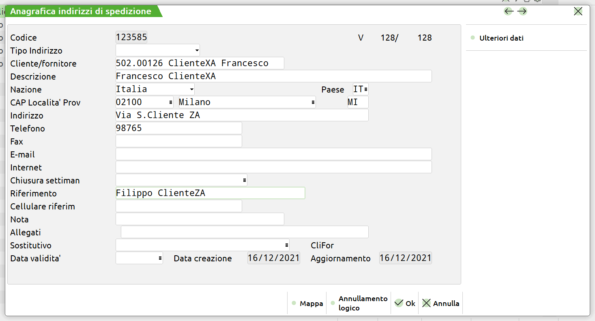{width="5.350694444444445in"
height="2.8833333333333333in"}

- L'ordine acquisito da Magento sarà intestato all'anagrafica cliente
  relativa a quanto indicato sull'indirizzo di fatturazione (Andrea --
  ClienteYA)

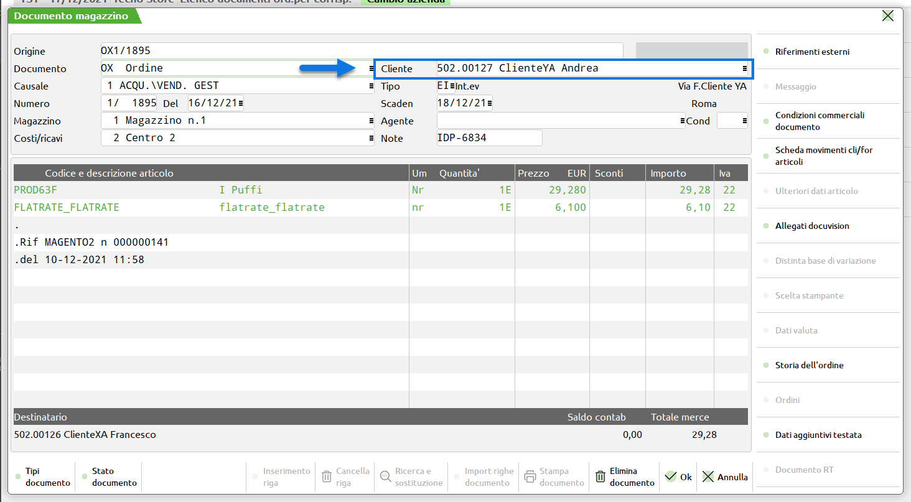{width="5.3375in"
height="2.941666666666667in"}

- L'indirizzo di spedizione presente nel piede del documento gestionale
  sarà quello relativo all'anagrafica indicata nell'indirizzo di
  spedizione acquisito da Magento (Filippo -- ClienteZA) e verrà
  riportato anche il nominativo del cliente Mexal (Francesco -- Cliente
  XA) cui tale indirizzo è stato associato come indirizzo secondario

{width="4.6819444444444445in"
height="2.2270833333333333in"}

Anche in queste condizioni ovviamente, lato Magento, il documento, anche
dopo eventuali spedizioni / evasioni rimarrà sempre legato
all'anagrafica del cliente che ha effettuato l'ordine (Francesco --
ClienteXA).

