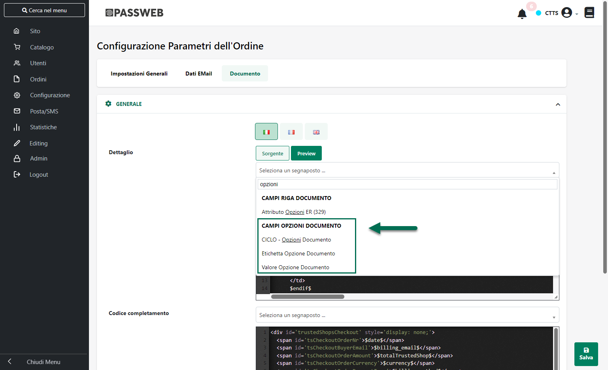

# SINCRONIZZAZIONE

Nell'ambito dell'integrazione tra Passweb e Magento occorre considerare
due diversi tipi di sincronizzazione:

- **Sincronizzazione tra Passweb e Magento:** può essere effettuata in
  maniera manuale e riguardare solamente il trasferimento di ordini,
  articoli o clienti da Magento verso Passweb e da qui verso il
  gestionale Passepartout, oppure può essere schedulata a ben precisi
  intervalli di tempo.

> **ATTENZIONE!** I dati scambiati durante la sincronizzazione tra
> Passweb e Magento possono essere diversi dipendentemente dal fatto di
> considerare sincronizzazioni manuali o schedulate
>
> In ogni caso durante le operazioni di sincronizzazione tra Passweb e
> Magento **NON verranno mai aggiornate le Liste di Vendita** definite
> su Passweb.
>
> Questo tipo di sincronizzazioni non sono sottoposte a vincoli
> contrattuali

- **Sincronizzazione tra Passweb e il Gestionale Passepartout:** sono le
  "normali" sincronizzazioni (Totali o per Variati) che avvengono tra il
  sito Passweb ed il gestionale Passepartout ad esso collegato (per
  maggiori informazioni in merito si veda anche quanto indicato nel
  capitolo "*Configurazione Gestionale -- Sincronizzazione*" di questo
  manuale)

> Come le sincronizzazioni tra Passweb e Magento anche le
> sincronizzazioni tra Passweb ed il gestionale Passepartout possono
> essere eseguite manualmente o schedulate a determinati intervalli di
> tempo, in questo caso però le informazioni trasferite sono sempre le
> stesse indipendentemente dal fatto di considerare sincronizzazioni
> manuali o schedulate
>
> A differenza invece delle sincronizzazioni tra Passweb e Magento
> quelle tra Passweb ed il gestionale Passepartout sono soggette a
> limiti contrattuali

Per maggiori informazioni sulle due diverse tipologie di
sincronizzazione si vedano i successivi capitoli di questo manuale

##### SINCRONIZZAZIONE PASSWEB -- MAGENTO

Come evidenziato nel precedente capitolo di questo manuale le
sincronizzazioni tra Passweb e Magento possono avvenire in maniera
manuale oppure possono essere schedulate a ben precisi intervalli di
tempo e, a seconda del fatto di considerare sincronizzazioni manuali o
schedulate le informazioni trasferite possono essere diverse.

Vediamo dunque nel dettaglio come poter effettuare questo tipo di
operazioni e quali sono effettivamente i dati trasferiti.

**Sincronizzazioni Manuali:** possono riguardare due diversi aspetti:
l'importazione su Passweb (ed il conseguente inserimento sul gestionale
Passepartout) di nuovi ordini, oppure l'aggiornamento delle anagrafiche
clienti presenti su Passweb.

Possono essere eseguite cliccando sui relativi pulsanti **Sincro
Ordini** (
{width="0.4479166666666667in"
height="0.15555555555555556in"} ) / **Sincro Clienti** (
{width="0.5194444444444445in"
height="0.175in"} ) presenti nella barra degli strumenti della maschera
"**Gestione Account**" dopo aver selezionato l'Account Magento in esame.

**ATTENZIONE!** In queste condizioni le operazioni di sincronizzazione
riguarderanno solamente la piattaforma collegata all'Account selezionato
in elenco

I dati trasferiti sono essenzialmente:

- ordini Magento che tramite Passweb vengono inseriti nel gestionale
  Passepartout

- anagrafiche di nuovi clienti (collegate ovviamente a specifici ordini
  Magento) ed eventuali indirizzi di spedizione, inseriti anch'essi,
  tramite Passweb, nel gestionale Passepartout

- anagrafiche di nuovi articoli presenti sugli ordini Magento ma non
  nelle anagrafiche del gestionale Passepartout e per questo codificati
  in maniera automatica contestualmente all'inserimento dell'ordine.

Nello specifico poi per quel che riguarda la "**Sincro Ordini**" occorre
sottolineare che:

- Una volta terminata l'importazione in Passweb di eventuali nuovi
  ordini verrà lanciata automaticamente anche una Sincronizzazione
  Parziale con il gestionale Passepartout che, in quanto tale, non verrà
  scalata dal monte sincronizzazioni previste da contratto e permetterà
  di inserire immediatamente i nuovi ordini Magento anche all'interno
  del gestionale

- Se, a seguito della Sincronizzazione Parziale tra Passweb ed il
  gestionale Passepartout dovessero essere inseriti nel gestionale
  stesso dei nuovi ordini, partirà automaticamente anche la valutazione
  di eventuali regole di sincronizzazione impostate per le Inserzioni
  che utilizzando l'Account Magento in esame.

> Nel momento in cui tali regole dovessero essere soddisfatte verrà
> quindi avviato anche il relativo processo di pubblicazione /
> aggiornamento / arresto degli articoli presenti nelle Liste di Vendita
> collegate alle stesse Inserzioni.

Per quel che riguarda invece la "**Sincro Clienti**" occorre
sottolineare che:

- Una volta terminato l'aggiornamento su Passweb di eventuali
  anagrafiche cliente verrà lanciata automaticamente anche una
  Sincronizzazione Parziale con il gestionale Passepartout che, in
  quanto tale, non verrà scalata dal monte sincronizzazioni previste da
  contratto e permetterà di inserire i nuovi dati anagrafici anche
  all'interno del gestionale

- L'operazione di sincronizzazione dei clienti NON importa su Passweb, e
  conseguentemente sul gestionale, nuovi clienti dalla piattaforma
  esterna ma andrà solamente ad aggiornare le anagrafiche di tutti quei
  clienti che sono già presenti in Passweb. Eventuali nuovi clienti
  potranno quindi essere inseriti solo contestualmente all'acquisizione
  del loro primo ordine

- La procedura lanciata cliccando sul pulsante "Sincro Clienti" prenderà
  sempre in considerazione tutti i clienti inseriti su Passweb a seguito
  di ordini acquisiti dalla piattaforma terza per cui potrebbe anche
  impiegare diverso tempo. Si consiglia quindi di effettuare questa
  operazione solo nel momento in cui sia effettivamente necessario
  riallineare tutte le anagrafiche cliente.

**ATTENZIONE!** Il processo di sincronizzazione tra Passweb e Magento
potrebbe richiedere diversi minuti. Si consiglia quindi di non eseguire
una nuova sincronizzazione prima di aver ricevuto la mail di avvenuta
sincronizzazione relativa a quella eventualmente in corso

**Sincronizzazioni automatiche:** possono essere impostate operando
all'interno della sezione "**Schedulazione**" nella maschera di
configurazione dell'Account Magento

{width="5.792361111111111in"
height="3.422222222222222in"}

All'interno di questa sezione è infatti possibile impostare la Frequenza
con cui eseguire la sincronizzazione Passweb -- Magento (giornaliera,
settimanale, mensile ...) e quante volte nell'arco di un giorno
(Frequenza giornaliera) dover effettivamente eseguire questo tipo di
operazione.

Il pulsante "**Test**" consente di effettuare un test di calcolo delle
ricorrenze impostate secondo i parametri presenti all'interno di questa
maschera e di visualizzare quindi date e orari delle prossime dieci
sincronizzazioni

{width="5.792361111111111in"
height="3.422222222222222in"}

Il pulsante "**Reset**" consente invece di azzerare tale calcolo

I dati trasferiti durante queste operazioni schedulate possono essere:

- ordini Magento che tramite Passweb vengono inseriti nel gestionale
  Passepartout

- anagrafiche di nuovi clienti (collegate ovviamente a specifici ordini
  Magento) ed eventuali indirizzi di spedizione, inseriti anch'essi,
  tramite Passweb, nel gestionale Passepartout

- anagrafiche di nuovi articoli presenti sugli ordini Magento ma non
  nelle anagrafiche del gestionale Passepartout e per questo codificati
  in maniera automatica contestualmente all'inserimento dell'ordine.

- informazioni relative al cambio di stato avvenuto per determinati
  ordini all'interno del gestionale Passepartout e conseguente creazione
  su Magento di spedizioni o invoice

Nello specifico in relazione alla **Sincronizzazione "Passweb --
Magento" schedulata** occorre infatti sottolineare che:

- Questo tipo di operazione **effettuerà sempre sia una Sincronizzazione
  Ordini che una Sincronizzazione Clienti** in maniera tale da importare
  in Passweb eventuali nuovi ordini e di aggiornare eventuali
  anagrafiche cliente.

> In merito alla sincronizzazione clienti è bene sottolineare però che
> durante il processo di sincronizzazione schedulata verranno prese in
> considerazione le sole anagrafiche dei clienti che dovessero
> effettivamente risultare variate

- Una volta terminata la Sincro Ordini e la Sincro Clienti verrà
  lanciata automaticamente anche una Sincronizzazione Parziale con il
  gestionale Passepartout che, in quanto tale, non verrà scalata dal
  monte sincronizzazioni previste da contratto e permetterà di inserire
  immediatamente i nuovi ordini Magento e i nuovi dati anagrafici anche
  all'interno del gestionale

- Se, a seguito delle suddette operazioni dovessero essere inseriti nel
  gestionale dei nuovi ordini, partirà automaticamente anche la
  valutazione di eventuali regole di sincronizzazione impostate per le
  Inserzioni che utilizzando l'Account Magento in esame.

> Nel momento in cui tali regole dovessero essere soddisfatte verrà
> quindi avviato anche il relativo processo di pubblicazione /
> aggiornamento / arresto degli articoli presenti nelle Liste di Vendita
> collegate alle stesse Inserzioni

- Al termine della Sincro Ordini e della Sincro Clienti verranno
  analizzati anche eventuali documenti gestionali che hanno subito un
  cambio di stato (es. sono stati annullati, bollati o fatturati) e
  verranno quindi avviate automaticamente tutte le procedure necessarie
  per comunicare a Magento questi stessi cambi di stato.

> In conseguenza di ciò se un determinato ordine dovesse, ad esempio,
> essere stato fatturato, a seguito di questo tipo di sincronizzazione
> verrà creata automaticamente anche la relativa "Invoice" su Magento

##### SINCRONIZZAZIONE PASSWEB -- GESTIONALE PASSEPARTOUT

Questo tipo di sincronizzazioni, come evidenziato nei precedenti
capitoli di questo manuale, altro non sono se non le normali operazioni
di Sincronizzazione, manuale o schedulata, per Variati o Totale, che
avvengono tra Passweb ed il gestionale Passepartout ad esso collegato
(per maggiori informazioni relativamente a questo tipo di operazione si
rimanda a quanto indicato all'interno del capitolo "*Configurazione
Gestionale - Sincronizzazione*" di questo manuale)

Le informazioni trasferite durante questo tipo di operazione riguardano
essenzialmente:

- Aggiornamento delle Liste di vendita

- Articoli da pubblicare / spubblicare / aggiornare / sul catalogo di
  Magento

- Acquisizione di nuovi ordini da Magento

- Cambio di stato degli ordini e conseguente creazione su Magento di
  spedizioni o invoice

Nello specifico per quel che riguarda le Sincronizzazioni "Sito --
Gestionale", indipendentemente dal fatto che siano state lanciate in
maniera manuale o schedulata, verranno eseguite le seguenti operazioni:

- **Sincro Ordini tra Passweb e Magento:** durante il processo di
  sincronizzazione tra Passweb ed il gestionale Passepartout verrà
  effettuata sempre anche la procedura di "Sincro Ordini" tra Passweb e
  Magento descritta nel capitolo precedente.

> In particolare poi il processo di importazione ordini da Magento su
> Passweb verrà eseguito, cronologicamente, prima della sincronizzazione
> Sito -- Gestionale in maniera tale da poter poi importare sul
> gestionale stesso anche i nuovi ordini effettuati sulla piattaforma
> terza.

- **Cambio di stato degli ordini Magento:** nel caso in cui Passweb, a
  seguito di una Sincronizzazione con il gestionale, dovesse rilevare
  che alcuni ordini, originariamente acquisiti da Magento, hanno subito
  un cambio di stato (es. sono stati annullati, bollati o fatturati)
  verranno avviate automaticamente tutte le procedure necessarie per
  comunicare anche a Magento questi stessi cambi di stato.

> Se, ad esempio, un determinato ordine dovesse essere stato fatturato,
> a seguito della sincronizzazione tra Passweb ed il gestionale
> Passepartout potrà essere creata automaticamente anche la relativa
> "Invoice" su Magento
>
> Per maggiori informazioni relativamente alle diverse operazioni
> effettuabili su ordini acquisiti da Magento si veda anche quanto
> indicato nel successivo capitolo "*Operazioni sull'ordine*" di questo
> manuale

- **Aggiornamento Liste di vendita:** a seguito di ogni sincronizzazione
  tra Passweb ed il gestionale Passepartout verranno aggiornate tutte le
  Liste di Vendita gestite secondo quanto impostato, in fase di
  configurazione della Lista stessa, per i parametri "**Aggiunta di un
  articolo alla Categoria Merceologica**", "**Rimozione di un
  articolo**", e "**Aggiornamento di un articolo**"

{width="5.792361111111111in"
height="3.422222222222222in"}

> Per maggiori informazioni in merito ai parametri evidenziati si veda
> anche quanto indicato all'interno del capitolo "*Altri Marketplace --
> Gestione Liste di Vendita -- Liste di Vendita*" di questo manuale

- **Applicazione delle regole di sincronizzazione:** al termine di ogni
  sincronizzazione tra Passweb ed il gestionale Passepartout partirà
  automaticamente anche la valutazione di eventuali regole di
  sincronizzazione impostate per tutte le Inserzioni gestite.

> Nel momento in cui tali regole dovessero essere soddisfatte verrà
> quindi avviato anche il relativo processo di pubblicazione /
> aggiornamento / arresto degli articoli presenti nelle Liste di Vendita
> collegate a queste stesse Inserzioni

**ATTENZIONE!** Le operazioni descritte all'interno di questo capitolo
verranno effettuate **per tutti gli Account gestiti**

