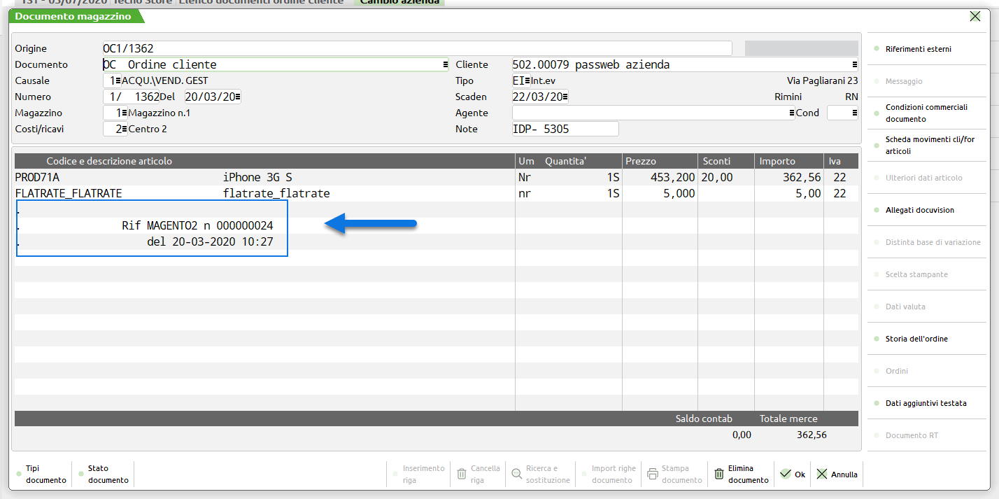
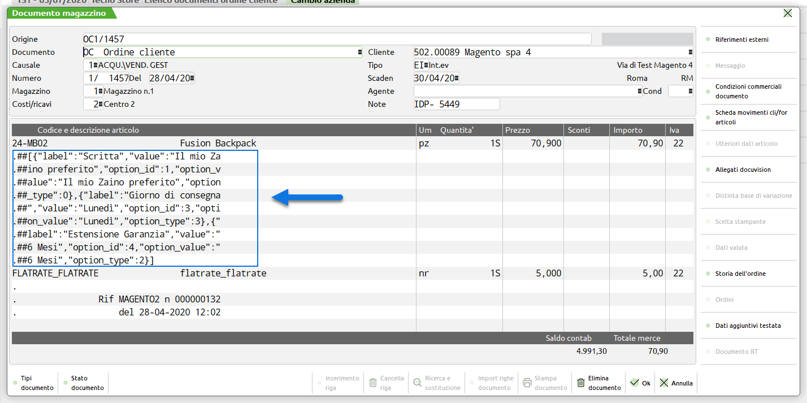

# ORDINI MAGENTO

Di seguito vengono indicate le principali caratteristiche dei documenti
inseriti all'interno del gestionali Passepartout a seguito di ordini
acquisiti direttamente da Magento.

- Il numero di decimali e le tipologie di arrotondamento in uso sulla
  piattaforma esterna potrebbero non coincidere con i decimali e gli
  arrotondamenti utilizzati dai gestionali Passepartout (il calcolo
  dell'IVA, ad esempio, è gestito direttamente da Mexal e non è
  possibile modificare o personalizzare questo tipo di algoritmo). In
  conseguenza di ciò potrebbero verificarsi situazioni in cui i totali
  del documento Magento differiscano di un centesimo rispetto a quelli
  del documento gestionale

<!-- -->

- Nel momento in cui si volesse utilizzare la stessa numerazione per gli
  Ordini Passepartout e Magento sarà necessario utilizzare, in relazione
  agli ordini acquisiti sulla piattaforma esterna, uno specifico
  sezionale oltre al fatto, ovviamente, di allineare in fase iniziale i
  relativi numeratori

- In tutti gli ordini importati da Magento verrà inserita
  automaticamente **una nota di corpo contenente la data e
  l'identificativo assegnati all'ordine stesso su Magento**

- Nel momento in cui nell'ordine Magento dovessero essere presenti
  articoli con Custom Option i valori impostati dall'utente
  relativamente a queste opzioni di personalizzazione dell'articolo
  verranno inseriti nel corpo del documento esattamente come se
  arrivassero da un ordine Passweb

> Per maggiori informazioni relativamente a come Passweb tratta le
> Custom Option si veda anche quanto indicato all'interno del capitolo
> "*Varianti Sito Responsive -- Lista Componenti Ecommerce -- Componenti
> interni ai Componenti Ecommerce -- Set Opzioni -- Ordini con opzioni
> di personalizzazione articolo*"

- Le spese di trasporto relative ad ordini provenienti da Magento sono
  gestite mediante appositi articoli di tipo Spesa inserti nel corpo del
  documento e codificati automaticamente da Passweb secondo quanto
  descritto nei relativi capitoli di questo manuale.

- Nel piede del documento verrà inserito uno dei Vettori mappati
  all'interno della relativa sezione presente nella maschera di
  configurazione degli Ordini o, in alternativa, il Vettore impostato in
  corrispondenza del parametro "**Vettore del Documento**" presente
  anch'esso all'interno della sezione "Ordini" nella maschera di
  configurazione dell'Account Magento

- Nel caso in cui siano attive in Magento delle promozioni, questo
  comporterà l'inserimento nel documento gestionale di un' apposito
  articolo spesa (quello indicato in corrispondenza del parametro
  "Sconto -- Articolo Utilizzo") a quantità unitaria negativa ed importo
  pari allo sconto in essere.

- Condizione indispensabile per mantenere i due documenti (quello
  gestionale e quello Magento) perfettamente allineati dovrà essere
  quella di non apportare modifiche, sul gestionale, al documento
  acquisito dalla piattaforma esterna aggiungendo o togliendo, nello
  specifico, delle righe articolo. Eventuali modifiche apportate in
  questo senso non potranno essere replicate sul documento di Magento

> E' comunque possibile effettuare evasioni parziali dello stesso ordine
> generando automaticamente anche le relative spedizioni o invoice su
> Magento (per maggiori informazioni in merito si veda anche quanto
> indicato all'interno del capitolo "Operazioni sull'ordine -- Creare
> più spedizioni da uno stesso ordine)

- **L'integrazione Passweb -- Magento prevede, ovviamente, che la
  fatturazione sia gestita direttamente dai gestionali Passepartout.**
  Per evitare dunque di comunicare al cliente eventuali numeri di
  fatture non valide ai fini fiscali, oltra ad allineare i relativi
  numeratori e a riservare un' apposito sezionale per gli ordini
  acquisti direttamente da Magento, si consiglia anche di disabilitare,
  laddove possibile, eventuali opzioni di fatturazione presenti sulla
  piattaforma esterna (e relativo invio di mail al cliente).

> Nel momento in cui ciò non fosse possibile si consiglia di inserire
> nelle mail, e nel dettaglio di eventuali fatture generate dalla
> piattaforma esterna, un apposito testo per indicare al cliente che il
> documento ricevuto non è quello fiscalmente valido, documento questo
> che gli verrà invece inviato tramite mail (da Mexal o da Passweb) e
> che potrà essere scaricato in forma elettronica mediante Sistema di
> Interscambio (SdI)
>
> Nel caso specifico di Magento tale informazioni può essere inserita,
> ad esempio, all'interno del campo "**Nota sulla Fattura**" presente
> nella sezione "Ordini" dell' Account Magento utilizzato

