# OPERAZIONI SULL'ORDINE

Una volta acquisito l'ordine dalla piattaforma esterna sarà poi
possibile operare direttamente all'interno del gestionale Passepartout
per effettuare su esso diverse operazioni.

**In ogni caso la condizione indispensabile per mantenere sempre i due
documenti (quello gestionale e quello Magento) allineati è quella di non
apportare modifiche, sul gestionale, al documento acquisito dalla
piattaforma esterna in termini di aggiunta o eliminazione / variazione
di righe articolo. Eventuali modifiche apportate in questo senso non
potranno essere replicate sul documento di Magento**

Nello specifico sarà quindi possibile:

- Annullare l'ordine ponendo il corrispondente documento Magento nello
  stato di "**Canceled**"

- Trasformare l'ordine in Bolla effettuando lo "Ship" del corrispondente
  documento Magento e generando, eventualmente, anche le relative
  spedizioni

- Trasformare l'ordine / bolla in fattura generando l' Invoice del
  corrispondente documento Magento

Nei successivi capitoli di questo manuale verranno descritte le
procedure da seguire per effettuare ciascuna delle operazioni sopra
indicate

##### ANNULLARE UN ORDINE

Per annullare un' ordine Magento operando direttamente all'interno del
gestionale Passepartout sarà necessario:

- Aprire l'ordine all'interno del gestionale

- Annullare tutte le righe del documento

- Effettuare una sincronizzazione tra Passweb ed il gestionale

Al termine di questa sincronizzazione Passweb verificherà che l'ordine
in esame è stato posto nello stato di "Annullato" e provvederà quindi a
porre il corrispondente ordine Magento nello stato di "**Canceled**"

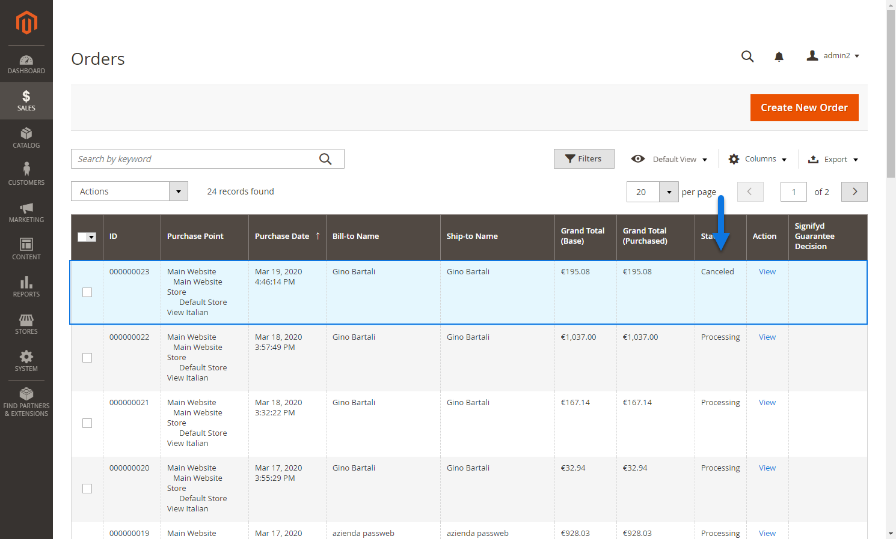

##### CREARE UNA SPEDIZIONE

Per poter generare una spedizione su Magento partendo dal documento
acquisito all'interno del gestionale Passepartout, la prima cosa da fare
sarà quella di verificare di aver mappato correttamente tutti i corrieri
in uso su Magento con altrettanti vettori gestionali (per maggiori
informazioni in merito a come poter effettuare questo mapping si vedano
i precedenti capitoli di questo manuale).

Fatto questo sarà poi necessario aprire l'ordine all'interno del
gestionale e trasformarlo in bolla facendo attenzione ad inserire le
seguenti informazioni:

- Uno dei vettori utilizzati per mappare i corrieri in uso su Magento

- Una data e un orario di spedizione

- Un Tracking Number

Nello specifico poi nel momento in cui il gestionale in uso dovesse
essere **Mexal**, **Vettore, Data di Inizio Trasporto** e **Number
Tracking** dovranno essere inseriti nei relativi campi del piede del
documento

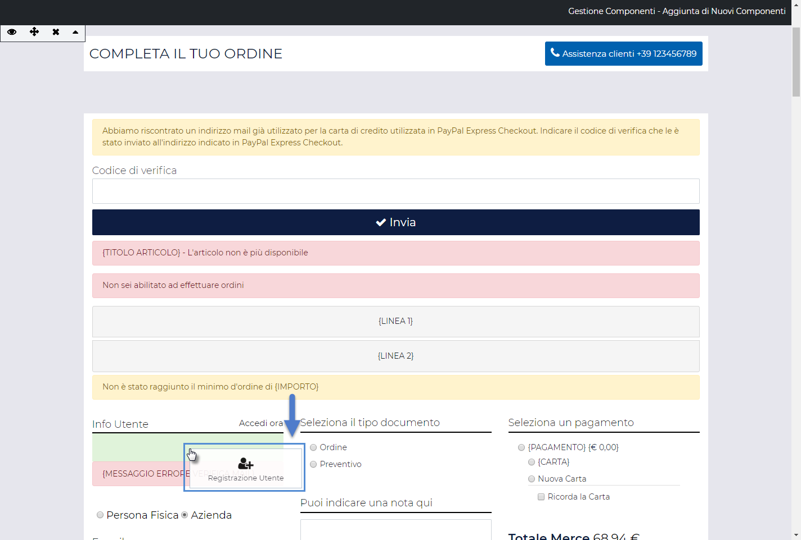

**ATTENZIONE!** Affinchè data e ora di inizio trasporto possano essere
correttamente visibili nel piede di tutti i documenti Mexal, è
necessario che il parametro di magazzino "**Memorizza data e ora inizio
trasporto**" sia stato correttamente selezionato

Nel caso in cui il parametro in oggetto non fosse stato selezionato,
Data e ora di inizio trasporto potranno essere visibili all'interno di
bolle e/o fatture ma non all'interno di ordini.

**ATTENZIONE!** Nel caso in cui si sia scelto di gestire il **Number
Tracking** mediante un apposito attributo Passweb, il codice di
spedizione dovrà ovviamente essere inserito nell'apposito campo della
**videata riportabile utente** utilizzato per gestire questo tipo di
informazione (per maggiori dettagli relativamente alla gestione del
Number Tracking in Mexal si veda anche quanto indicato all'interno della
sezione "*Ordini -- Configurazione Ordini -- Impostazioni generali*" di
questo manuale).

Nel caso in cui il gestionale in uso dovesse invece essere **uno dei
gestionali Ho.Re.Ca.**, **Vettore Data di Inizio Trasporto** e **Number
Tracking** dovranno essere inseriti nei relativi campi del piede del
documento

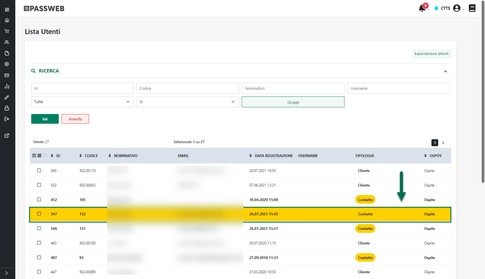

**ATTENZIONE!** Nel caso in cui si sia scelto di gestire il **Number
Tracking** mediante un apposito attributo Passweb, il codice di
spedizione dovrà essere inserito direttamente su Passweb all'interno di
un apposito Attributo Ordine.

Una volta impostate le informazioni sopra indicate a seguito della
prossima sincronizzazione verrà esportata su Passweb la Bolla appena
creata e, contestualmente, verrà anche generata una spedizione sul
relativo ordine Magento

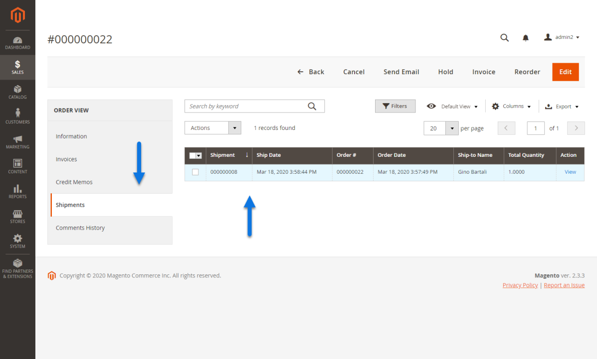

Il fatto poi di avere o meno, all'interno della spedizione collegata
all'ordine Magento, anche l'indicazione del corriere da utilizzare
dipenderà direttamente dal fatto di aver inserito o meno all'interno del
gestionale Passepartout l'indicazione del Tracking Number.

Più esattamente se su Mexal in fase di trasformazione dell'ordine in
bolla dovesse essere stato inserito anche il tracking number allora
all'interno della spedizione creata sull'ordine Magento troveremo, nella
sezione "Shipping e Tracking Information", anche l'indicazione del
Vettore e il relativo Tracking Number

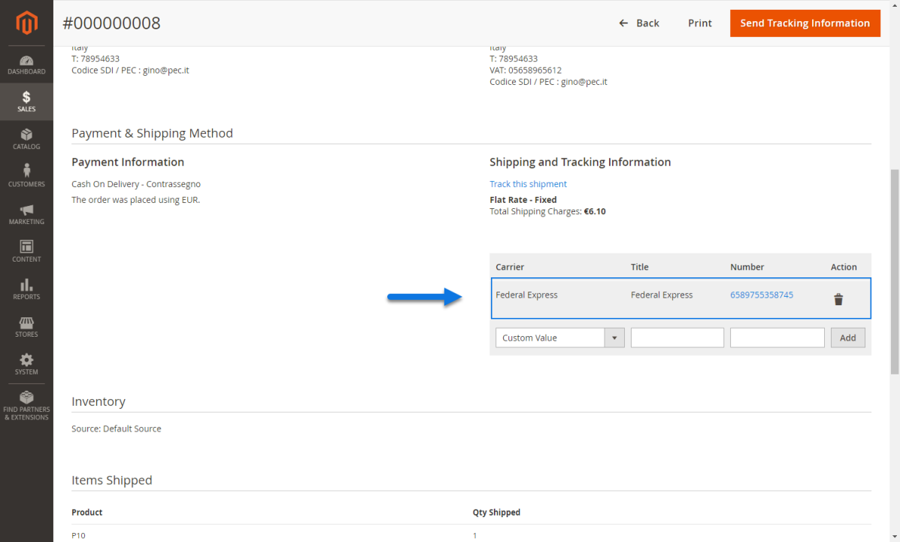

Se invece stiamo operando su uno dei gestionali della famiglia Ho.Re.Ca.
dove non abbiamo la possibilità di inserire direttamente l'informazione
relativa al tracking number o, allo stesso modo, se stiamo operando su
Mexal e decidiamo, per qualche ragione, di non gestire questa
informazione allora nella sezione "Shipping e Tracking Information"
della spedizione creata sull'ordine Magento non troveremo l'indicazione
di alcun corriere

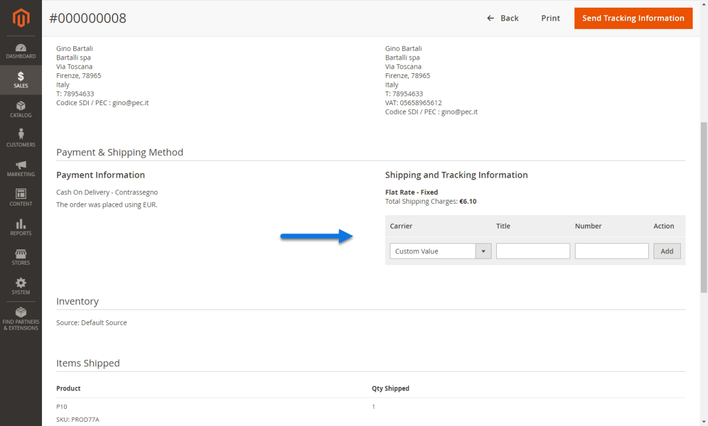

**ATTENZIONE!** In generale, tanto per Mexal quanto per uno dei
gestionali della famiglia Ho.Re.Ca., se la trasformazioni in bolla
dovesse avvenire senza l'indicazione di uno specifico Tracking Number,
questo significherebbe che si è deciso di gestire le spedizioni
direttamente da Magento

##### CREARE PIU' SPEDIZIONI DA UNO STESSO ORDINE

Nel precedente capitolo di questo manuale abbiamo visto come dover
procedere per fare in modo che trasformando un ordine in bolla
all'interno del gestionale Passepartout, questo generi poi anche la
relativa spedizione sul documento di Magento.

Fino a questo momento inoltre abbiamo sempre fatto riferimento
all'evasione completa di un intero ordine con una stessa bolla.

Oltre a questo, volendo, è **anche possibile fare in modo di evadere uno
stesso ordine con N bolle distinte creando, contemporaneamente, anche N
distinte spedizioni sul documento di Magento**.

In questo senso il modo di operare è del tutto analogo a quello
esaminato nel precedente capitolo tenendo sempre in considerazione però
anche il fatto che la condizione indispensabile per mantenere i due
documenti (quello gestionale e quello Magento) perfettamente allineati è
quella, da una parte di non aggiungere o togliere, sul gestionale righe
articolo rispetto a quelle presenti nel documento originale e dall'altra
parte il fatto di non aumentare le quantità di riga (che, eventualmente,
potranno invece essere ridotte).

Consideriamo quindi i seguenti esempi:

**[ESEMPIO1]{.underline}**

Supponiamo di aver acquisito da Magento un ordine con all'interno i 3
articoli indicati in figura (PROD34B, PROD76D e PROD76C) tutti in
quantità 2

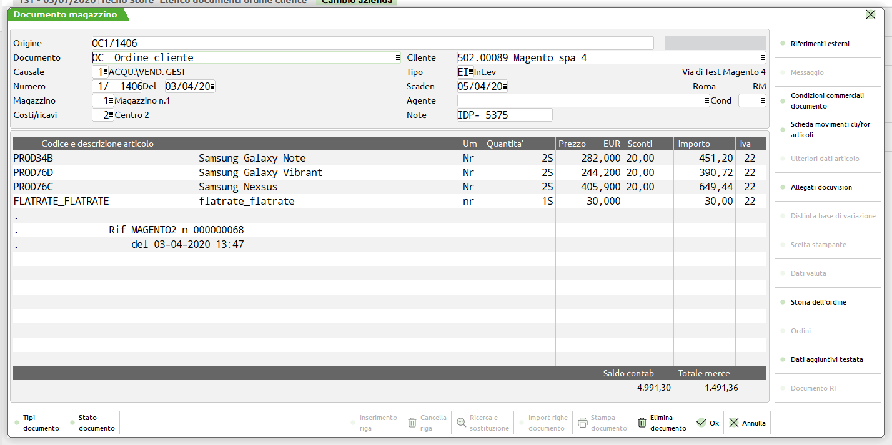

Supponiamo inoltre di dover evadere, per ragioni di magazzino, questo
stesso ordine in due momenti diversi gestendo quindi due diverse
spedizioni. In un primo momento spediremo solo l'articolo PROD34B nelle
due quantità richieste mentre in un secondo momento (magari quando
torneranno disponibili a magazzino) andremo invece a spedire i restanti
articoli (PROD76D e PROD76C)

Per soddisfare questa esigenza dovremo quindi:

- Aprire l'ordine all'interno del gestionale

- Porre la riga relativa al prodotto PROD34B nello stato di evadibile

- trasformare il documento in bolla facendo attenzione ad inserire le
  seguenti informazioni:

  - Uno dei vettori utilizzati per mappare i corrieri in uso su Magento

  - Una data e un orario di spedizione

  - Un Tracking Number

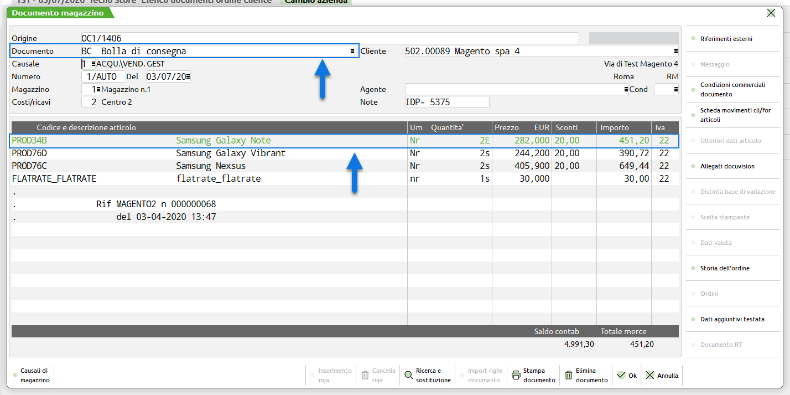

Al termine di questa operazione avremo quindi creato una prima bolla e,
a seguito della prossima sincronizzazione tra Passweb ed il gestionale,
avremo creato anche una prima spedizione sull'ordine Magento.

Quando poi anche i restanti articoli saranno pronti per la spedizione
dovremo:

- Riaprire l'ordine all'interno del gestionale, ordine che a questo
  punto conterrà solamente i due articoli PROD76D e PROD76C

- Porre entrambe le righe relative a questi articoli nello stato di
  evadibile

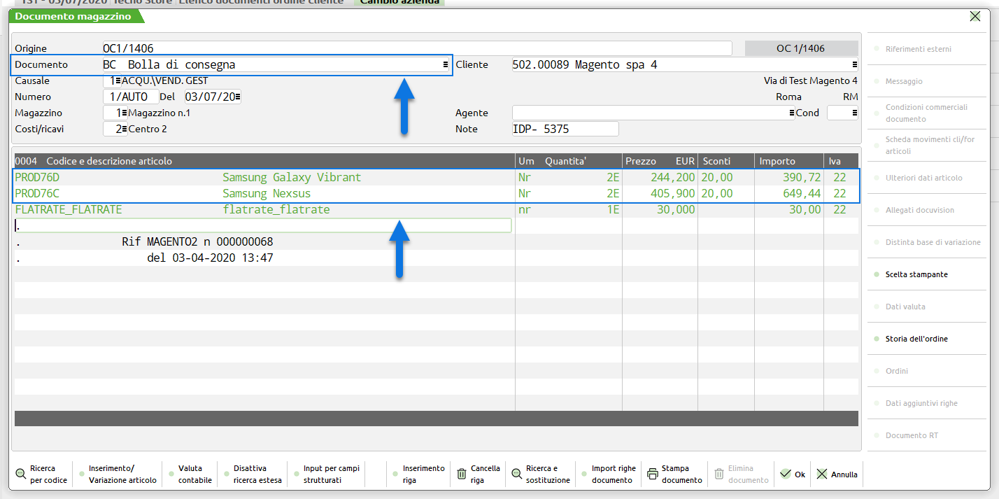

- trasformare il documento in bolla facendo attenzione ad inserire le
  solite informazioni:

  - Uno dei vettori utilizzati per mappare i corrieri in uso su Magento

  - Una data e un orario di spedizione

  - Un Tracking Number

A questo punto se, a seguito della prossima sincronizzazione tra Passweb
ed il gestionale Passepartout, andremo a controllare su Magento il
documento originale troveremo per esso due distinte spedizioni
corrispondenti alle due bolle generate sul gestionale

**[ESEMPIO2]{.underline}**

Supponiamo di essere nelle stesse condizioni dell'esempio 1 ma di dover,
questa volta, evadere l'ordine con 3 bolle distinte le prime due delle
quali dovranno contenere entrambe l'articolo PROD34B ma in quantità 1

In questo caso sarà necessario:

- Aprire l'ordine all'interno del gestionale

- Splittare la riga relativa all'articolo PROD34B in due righe distinte
  ma con quantità 1 (dovremo quindi variare la quantità della riga
  esistente portandola da 2 a 1 ed aggiungere un'ulteriore riga dello
  stesso articolo con le stesse condizioni di sconto e con qta 1)

- Porre una delle due righe relative all'articolo PROD34B nello stato di
  evadibile

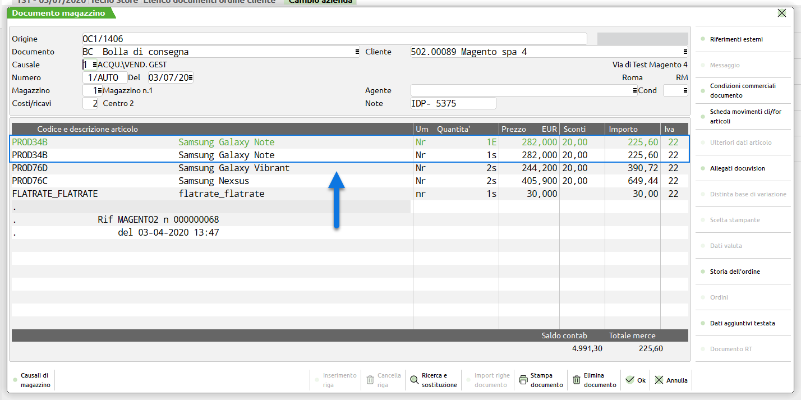

- trasformare il documento in bolla facendo attenzione ad inserire le
  solite informazioni:

  - Uno dei vettori utilizzati per mappare i corrieri in uso su Magento

  - Una data e un orario di spedizione

  - Un Tracking Number

A questo punto l'ordine originale conterrà sempre l'articolo PROD34B, ma
in quantità 1 e gli altri due articoli PROD76D e PROD76C in quantità
due.

Potremo quindi operare come precedentemente descritto per generare una
seconda bolla con il solo articolo PROD34B e una terza bolla con i due
articoli PROD76D e PROD76C.

Al termine di tutto il processo controllando su Magento il documento
originale troveremo per esso tre distinte spedizioni corrispondenti alle
tre bolle generate sul gestionale

##### CREARE UN INVOICE

Per generare l'Invoice (fattura) di un' ordine Magento operando
direttamente all'interno del gestionale Passepartout sarà necessario:

- Aprire l'ordine / bolla all'interno del gestionale

- Trasformare il documento in Fattura

- Effettuare una sincronizzazione tra Passweb ed il gestionale

Al termine della sincronizzazione Passweb verificherà che per l'ordine /
bolla in esame è stata emessa fattura e provvederà quindi a generare
l'Invoice del relativo documento Magento

In questo senso è bene sottolineare poi che se la trasformazione
effettuata nel gestionale dovesse essere **direttamente da ordine a
fattura** e nel piede del documento fossero inserite anche le seguenti
informazioni:

- Uno dei vettori utilizzati per mappare i corrieri in uso su Magento

- Una data e un orario di spedizione

- Un Tracking Number

allora oltre a creare un Invoice Passweb provvederà anche ad effettuare
lo "Ship" del relativo documento Magento e ad inserire nella sezione
"Shipping e Tracking Information", l'indicazione del Vettore e il
relativo Tracking Number.

Infine è sempre bene ricordare che **l'integrazione Passweb -- Magento
prevede, ovviamente, che la fatturazione sia gestita direttamente dai
gestionali Passepartout.** Per evitare dunque di comunicare al cliente
eventuali numeri di fatture non valide ai fini fiscali, oltra ad
allineare i relativi numeratori e a riservare un' apposito sezionale per
gli ordini acquisti direttamente da Magento, si consiglia anche di
disabilitare, laddove possibile, eventuali opzioni di fatturazione
presenti sulla piattaforma esterna (e relativo invio di mail al
cliente).

Nel momento in cui ciò non fosse possibile si consiglia di inserire
nelle mail, e nel dettaglio di eventuali fatture generate dalla
piattaforma esterna, un apposito testo per indicare al cliente che il
documento ricevuto non è quello fiscalmente valido, documento questo che
gli verrà invece inviato tramite mail (da Mexal o da Passweb) e che
potrà essere scaricato in forma elettronica mediante Sistema di
Interscambio (SdI)

Nel caso specifico di Magento tale informazioni può essere inserita, ad
esempio, all'interno del campo "**Nota sulla Fattura**" presente nella
sezione "Ordini" dell' Account Magento utilizzato

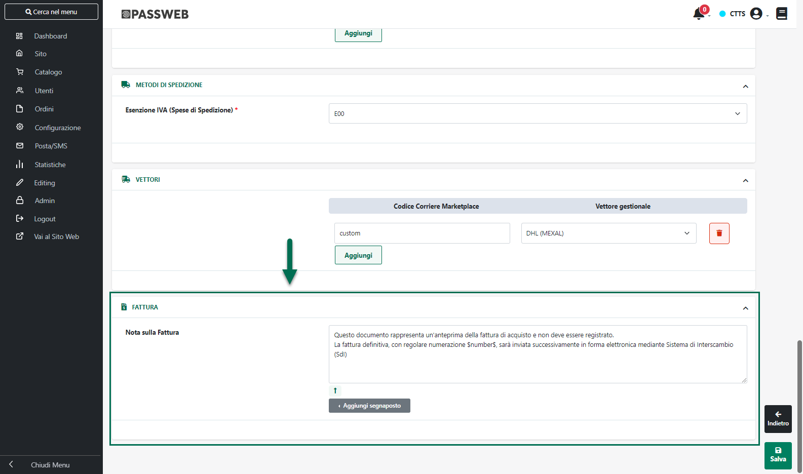

