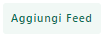
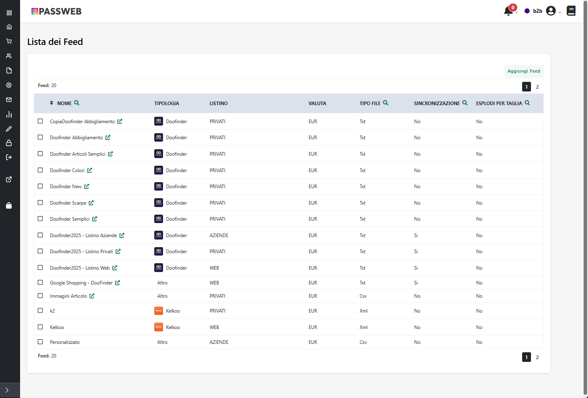
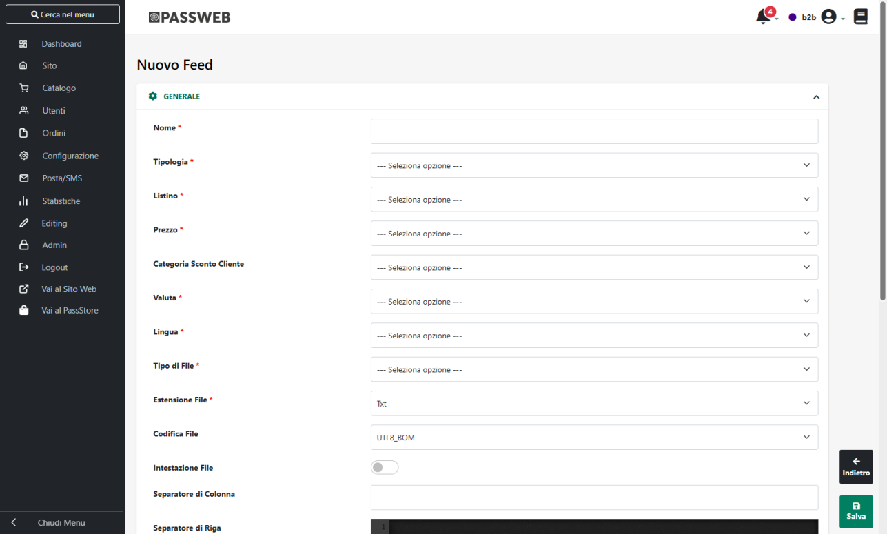
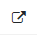
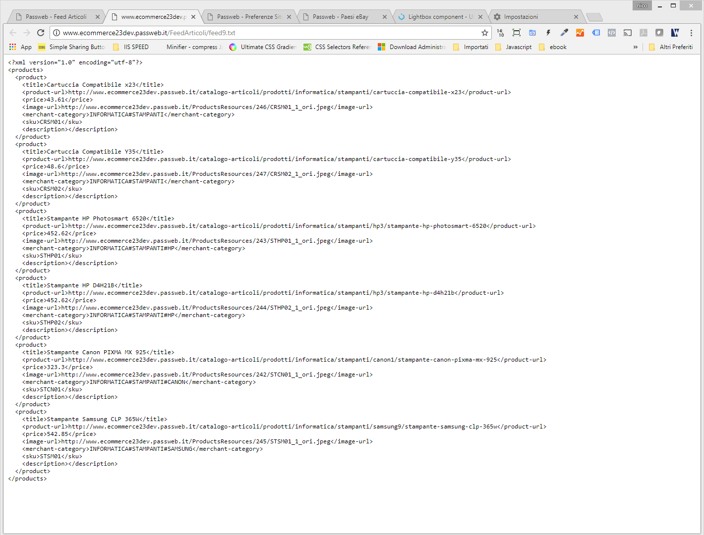
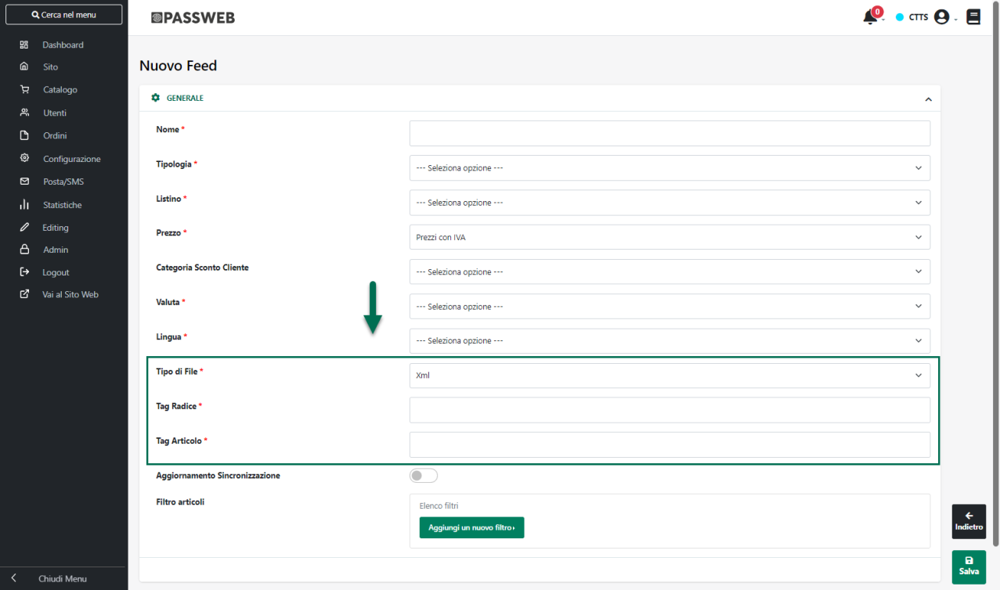
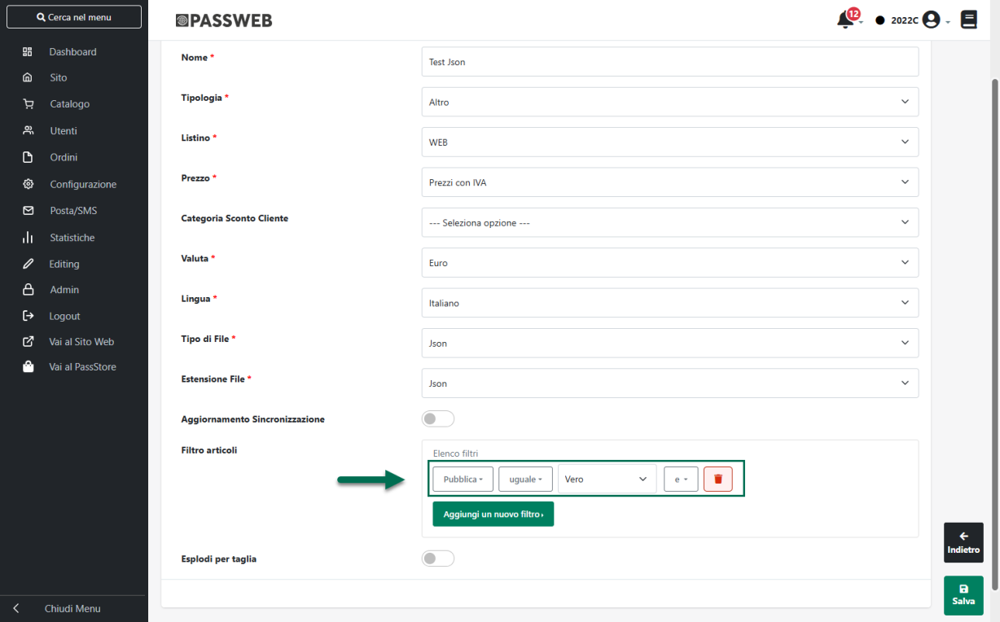
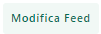
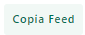

# CREAZIONE DI UN FEED ARTICOLI

Per creare un nuovo Feed Articoli è sufficiente utilizzare il pulsante
"**Aggiungi Feed**" (
 ) presente nella barra degli strumenti
della maschera "Lista Feed".

Cliccando su questo pulsante verrà infatti visualizzata la maschera
"**Nuovo Feed**"

grazie alla quale poter definire le caratteristiche e la struttura del
Feed Articoli che si intende codificare.

In particolare per ogni feed sarà necessario impostare un valore per i
seguenti campi:

- **Nome:** consente di specificare il nome attraverso cui identificare
  il Feed che si sta realizzando.

> Una volta completata la configurazione del Feed e generato il
> corrispondente file di export, cliccando sul pulsante presente a
> fianco del nome stesso (
>  ) verrà visualizzato, in una nuova
> scheda del browser, il contenuto di questo stesso file.

> Sarà quindi possibile realizzare l'integrazione con il motore a
> comparazione di prezzo fornendo al motore stesso direttamente
> l'indirizzo della pagina web corrispondente al feed appena generato,
> evitando così di dover scaricare fisicamente il corrispondente file
> dal sito Passweb per poi ricaricarlo all'interno del motore a
> comparazione di prezzo (opzione questa comunque disponibile).

- **Tipologia:** consente di specificare la tipologia del feed che si
  intende realizzare. In questo senso è possibile selezionare uno dei
  seguenti valori:

  - **Doofinder / Google Shopping:** selezionando questa opzione verrà
    automaticamente predisposto un feed articoli strutturato secondo
    quelle che sono le specifiche richieste da Google Shopping e da
    Doofinder e che potrà quindi essere utilizzato per realizzare
    l'integrazione con la relativa piattaforma.

> Per maggiori informazioni relativamente a Doofinder e a come poter
> realizzare l'integrazione con questo strumento che consente di
> effettuare ricerche avanzate all'interno del proprio sito, si rimanda
> alla relativa documentazione della specifica piattaforma (
> <https://www.doofinder.com/it/> )
>
> **ATTENZIONE**! Alcuni parametri di definizione del Feed (Tipo File,
> Tag Radice, Tag Articolo ...) verranno impostati in maniera automatica
> e non saranno modificabili

- **Kelkoo/Trovaprezzi/ShopAlike:** selezionando uno di questi valori
  verrà automaticamente predisposto un feed articoli strutturato secondo
  quelle che sono le specifiche richieste dal relativo motore a
  comparazione di prezzo.

> Anche in questo caso, alcuni parametri di definizione del Feed (Tipo
> File, Estensione File, Tag Radice, Tag Articolo ...) verranno
> impostati in maniera automatica e non saranno modificabili.

> Allo stesso modo verranno automaticamente inseriti all'interno del
> Feed tutti i campi corrispondenti alle informazioni articolo
> obbligatorie per realizzare in maniera corretta l'integrazione con
> questo specifico motore a comparazione di prezzo.
>
> L'utente avrà comunque la possibilità di integrare queste informazioni
> inserendo nuovi campi all'interno del feed. **La modifica o
> l'eliminazione dal feed dei campi obbligatori ed inseriti in
> automatico dall'applicazione potrebbe compromettere la corretta
> integrazione con il relativo motore a comparazione di prezzo**.

- **Altro:** selezionando questo valore l'utente avrà la possibilità di
  definire un Feed Articoli completamente personalizzato. In questo
  caso, dunque, non verrà settato nulla in maniera automatica e l'utente
  dovrà necessariamente specificare la tipologia di file che intende
  generare (con tutto ciò che ne consegue, ed in perfetto accordo con
  quanto richiesto dallo specifico motore a comparazione di prezzo).
  Allo stesso modo, in queste condizioni, l'utente dovrà anche inserire
  nel feed articoli (ancora una volta in perfetto accordo con quanto
  richiesto dallo specifico motore a comparazione di prezzo) tutti i
  campi obbligatori per soddisfare le specifiche richieste dal motore
  con cui desidera effettuare l'integrazione.

<!-- -->

- **Listino:** consente di indicare lo specifico listino sulla base del
  quale determinare i prezzi degli articoli inseriti all'interno del
  feed e pubblicati quindi sul relativo motore a comparazione di prezzo.

> **E' possibile selezionare uno qualsiasi dei Listini Mexal gestiti
> all'interno del proprio sito.**

- **Prezzo**: consente di decidere se il prezzo degli articoli inseriti
  nel Feed dovrà essere o meno comprensivo di IVA

- **Categoria Sconto Cliente:** consente di indicare la specifica
  "Categoria Sconto Cliente" (selezionandola tra quelle definite
  all'interno del gestionale) che dovrà essere presa in considerazione
  nella determinazione del prezzo degli articoli presenti all'interno
  del Feed

- **Valuta:** consente di indicare, selezionandola tra quelle gestite
  all'interno del sito, la specifica valuta da utilizzare per il calcolo
  dei prezzi degli articoli inseriti all'interno del feed e pubblicati
  quindi sul relativo motore a comparazione di prezzo.

- **Lingua:** consente di indicare, selezionandola tra quelle gestite
  all'interno del sito, la lingua di riferimento per la lettura dei
  valori dei campi articolo inseriti all'interno del feed. A seconda
  dunque della lingua indicata all'interno di questo campo verranno
  esportate, relativamente agli articoli selezionati, informazioni in
  italiano o in lingua.

- **Tipo di File:** consente di specificare il formato del file
  corrispondente al feed articoli che si intende generare. **In questo
  senso è possibile generare feed in formato:**

  - **Xml**

  - **Txt**

  - **Csv**

  - **Json**

> A seconda del tipo di file selezionato sarà poi necessario impostare
> certi parametri piuttosto che altri.

- **Estensione File:** consente di impostare l'estensione che dovrà
  essere utilizzata per il file prodotto dal relativo feed articoli. A
  default ogni feed articolo viene creato con estensione .txt.

> Le estensioni impostabili e selezionabili dal relativo menu a tendina
> dipendono da come è stato impostato il precedente parametro "Tipo di
> File". In particolare:

- Se "Tipo di File" è impostato su "Csv", è possibile selezionare come
  estensione del file "Txt" o "Csv".

- Se "Tipo di File" è impostato su "Xml", è possibile selezionare come
  estensione del file "Txt" o "Xml"

- Se "Tipo di File" è impostato su "Json", è possibile selezionare come
  estensione del file "Txt" o "Json"

- Se "Tipo di File" è impostato su "Txt" l\'unica estensione possibile è
  "Txt"

<!-- -->

- **Codifica File (solo per file di tipo csv o txt):** consente di
  indicare la codifica da utilizzare per il file. E' possibile
  selezionare una delle seguenti opzioni:

  - **UTF8_BOM**: codifica UTF-8 con firma (valore di default).

> In queste condizioni verrà utilizzato come carattere di ritorno a capo
> per il fine riga il relativo carattere Windows (CR LF)

- **UTF8**: codifica UTF-8 senza firma.

> In queste condizioni verrà utilizzato come carattere di ritorno a capo
> per il fine riga il relativo carattere Windows (CR LF)

- **UTF8_UNIX**: codifica UTF-8 senza firma.

> In queste condizioni verrà utilizzato come carattere di ritorno a capo
> per il fine riga il relativo carattere Unix (LF)

- **Tag Radice (solo per file di tipo xml):** consente di specificare il
  tag da utilizzare nella root del file.

**NOTA BENE:** non è necessario racchiudere il tag indicato all'interno
dei caratteri "\<" e "\>". Tali caratteri, se espressamente indicati,
verranno quindi rimossi in fase di salvataggio del feed.

- **Tag Articolo (solo per file di tipo xml):** consente di specificare
  il tag da utilizzare per racchiudere, all'interno del file xml, le
  informazioni relative al singolo articolo.

**NOTA BENE:** non è necessario racchiudere il tag indicato all'interno
dei caratteri "\<" e "\>". Tali caratteri, se espressamente indicati,
verranno quindi rimossi in fase di salvataggio del feed.

> Di seguito viene riportato un esempio di file xml creato a seguito
> della generazione di un feed articoli di questo tipo evidenziando,
> rispettivamente il suo Tag Radice ed i suoi Tag Articolo

- **Intestazione File (solo per file di tipo txt o csv):** se
  selezionato, la prima riga del file creato a seguito della generazione
  del relativo feed, verrà utilizzata come intestazione per i contenuti
  del file stesso. In queste condizioni, dunque, nella prima riga del
  file verrà riportato l'elenco dei nomi dei campi articolo gestiti
  all'interno del feed.

- **Separatore di colonna (solo per file di tipo txt o csv):** consente
  di indicare il carattere da utilizzare come separatore di colonna per
  i campi del feed.

> Nel caso in cui il valore di uno dei campi gestiti all'interno del
> feed contenga uno o più caratteri uguali al carattere utilizzato come
> "Separatore di Colonna", al fine di garantire una corretta
> formattazione del file, tali caratteri verranno automaticamente
> rimossi.
>
> **ATTENZIONE!** nel momento in cui l'esigenza dovesse essere quella di
> utilizzare **il TAB come separatore di colonna** sarà necessario
> inserire all'interno del campo in esame il carattere **\\t**

- **Separatore di riga (solo per file di tipo txt o csv):** consente di
  indicare il tag da utilizzare come separatore di riga. Quanto indicato
  all'interno di questo campo, verrà quindi appeso al termine di ogni
  riga del relativo file.

> **ATTENZIONE!** Oltre al carattere eventualmente indicato in
> corrispondenza di questo campo, per ogni riga verrà sempre inserito
> anche il carattere di ritorno a capo secondo quanto impostato
> all'interno per precedente parametro **Codifica File**
>
> Ovviamente nel momento in cui il campo in esame dovesse essere
> lasciato vuoto, al termine di ogni riga verrà inserito solamente il
> carattere di ritorno a capo

**NOTA BENE:** nel caso in cui il valore di uno dei campi gestiti
all'interno del feed contenga la stringa utilizzata come "Fine Riga", al
fine di garantire una corretta formattazione del file, i corrispondenti
caratteri verranno automaticamente rimossi.

- **Aggiornamento Sincronizzazione:** se selezionato, il file
  corrispondente al feed articoli in questione verrà aggiornato
  automaticamente, con eventuali nuove informazioni, ad ogni
  sincronizzazione. Nel caso in cui tale parametro non venga
  selezionato, per poter aggiornare il relativo file sarà necessario
  eseguire manualmente la generazione del corrispondente feed articoli.

- **Filtro Articoli:** consente di impostare un filtro di selezione
  degli articoli da includere all'interno del feed che si intende
  realizzare.

> **ATTENZIONE!** a default verranno inseriti nel Feed solamente gli
> articoli effettivamente pubblicati anche a front end (campo "Pubblica"
> = "Vero")
>
> Nel momento in cui l'esigenza dovesse essere quella di inserire nel
> Feed, anche (o solo) articoli presenti su Passweb ma non pubblicati a
> front end, sarà necessario creare un Filtro che vada a lavorare in
> maniera esplicita sul campo "Pubblica"

- **Includi Articoli Padre -- solo per feed articoli di tipologia
  Doofinder:** consente, se attivato, di inserire all'interno del feed
  anche eventuali articoli padri di struttura che dovessero soddisfare
  il filtro impostato all'interno del campo precedente

> **ATTENZIONE!** l'attivazione di questo parametro comporterà anche
> l'inserimento nella struttura del feed di due nuovi campi:
> **group_id** e **group_leader** la cui valorizzazione sarà gestita in
> automatico dall'applicativo secondo il seguente schema:

- **group_id**: valorizzato solo per gli articoli strutturati (padri o
  figli) eventualmente presenti all'interno del feed.

> Per ogni articolo padre e per i relativi figli il campo in esame verrà
> valorizzato sempre con il codice gestionale dell'articolo padre
> (questo campo consente quindi di raggruppare un padre e i relativi
> figli)

- **group_leader**: valorizzato solo per gli articoli strutturati (padri
  o figli) eventualmente presenti all'interno del feed.

> Nello specifico per gli articoli padre il campo in esame verrà posto a
> true mentre per gli articoli figli verrà posto a false. In questo modo
> sarà possibile individuare all'interno di ogni gruppo "padre + figli"
> l'articolo leader che sarà poi quello che verrà effettivamente
> mostrato tra i risultati delle ricerche di doofinder
>
> **ATTENZIONE!** per tutte le tipologie di feed diverse da Doofinder
> eventuali articoli padri di struttura non verranno mai presi in
> considerazione

- **Esplodi per Taglia**: se selezionato eventuali articoli presenti nel
  Feed e gestiti a Taglie o a Colori (mediante la relativa Tabella
  Mexal) verranno esplosi creando un record per ogni singola Taglia /
  Colore

> In questo senso è bene ricordare che nel caso in cui all'interno del
> Feed dovesse essere gestito anche il campo "Codice", per evitare di
> creare più record con lo stesso Codice Articolo, in fase di esplosione
> delle Taglie / Colori **il valore inserito in corrispondenza del campo
> Codice sarà creato concatenando al Codice Articolo di Mexal la stringa
> "@Taglia/Colore"**
>
> **ESEMPIO:**
>
> Consideriamo l'articolo Mexal con codice PROD01, gestito a Taglie con
> valori Small, Medium, Large, ExtraLarge
>
> Supponiamo anche di voler inserire all'interno del Feed i campi
> "Codice", "Taglie_Colori" e di utilizzare come separatore di colonna
> il carattere \| e come separatore del campo a valori multipli
> (Taglie_Colori) il carattere ;
>
> In queste condizioni se il parametro "**Esplodi per Taglia**" dovesse
> essere:

- **deselezionato**: nel feed articoli verrà inserita una sola riga del
  tipo di quella qui di seguito indicata

> PROD01\|Small;Medium; Large;ExtraLarge

- **selezionato**: nel feed articoli verranno inserite 4 righe diverse
  del tipo di quelle qui di seguito indicate

> PROD01@Small\|Small
>
> PROD01@Medium\|Medium
>
> PROD01@Large\|Large
>
> PROD01@ExtraLarge\|ExtraLarge

Si ricorda inoltre che nel momento in cui dovessero essere gestiti con
la Tabella Taglie di Mexal sia articoli a taglie che articoli a colori e
l'esigenza dovesse essere quella di utilizzare nel feed due campi
diversi uno per le taglie e uno per i colori, sarà necessario marcare le
singole serie come "Serie Taglie" e "Serie Colori" e inserire nel Feed i
campi "Taglie / Taglie Disponibili" e "Colori / Colori Disponibili". Per
maggiori informazioni in merito a come marcare una Serie come "Serie
Taglie" o come "Serie Colori" si veda anche quanto indicato nel capitolo
"*Catalogo -- Gestione Articoli -- Taglie o Colori Ecommerce Mexal --
Configurazione di una Serie di Taglie Colori*" di questo manuale.

Una volta salvato il feed articoli (pulsante "**Salva**" nella parte
bassa della maschera) questo comparirà nell'elenco presente all'interno
della maschera "Lista Feed".

I pulsanti "**Modifica Feed**", "**Copia Feed**" ed "**Elimina Feed**"
presenti nella barra degli strumenti di questa stessa maschera
consentono rispettivamente di:

- **Modifica Feed** (
   ): consente di modificare le proprietà e le
  caratteristiche del Feed attualmente selezionato in elenco

**NOTA BENE:** eventuali modifiche agli elementi del Feed, quali tipo di
file, listino, valuta, separatori ecc... non comportano la rigenerazione
automatica del file che dovrà, quindi, essere avviata manualmente
(pulsante "Genera Feed") o tramite sincronizzazione.

- **Copia Feed**
  ( ): permette di effettuare una copia
  integrale del Feed attualmente selezionato in elenco

- **Elimina Feed**
  ( ): consente di eliminare
  definitivamente il Feed attualmente selezionato in elenco (compreso,
  se presente, anche il file ad esso associato)

