# CONTENUTI DI UN FEED ARTICOLI

Una volta definite le caratteristiche e la struttura del Feed Articoli,
secondo quanto indicato nel precedente capitolo, sarà poi necessario
definire i campi, e quindi le informazioni articolo, da inserire
all'interno di questo stesso Feed e conseguentemente da pubblicare poi
all'interno dello specifico motore a comparazione di prezzo.

**Nell'eseguire questo tipo di operazione occorre considerare che, come
precedentemente evidenziato, ogni motore a comparazione di prezzo ha
delle ben precise specifiche da soddisfare, specifiche che riguardano la
tipologia di file generato per l'export dei dati ma anche e soprattutto
le informazioni e la tipologia dei campi articolo che devono
necessariamente essere inseriti all'interno del Feed.**

In questo senso, nel caso in cui l'utente desideri esportare i propri
articoli, o parte di essi, all'interno di uno dei motori a comparazione
di prezzo già codificati all'interno di Passweb (Kelkoo, Trovaprezzi
ecc...) Passweb stesso si preoccuperà, al salvataggio del Feed, di
predisporre correttamente al suo interno tutti i campi obbligatori per
garantire l'integrazione con questo stesso motore.

L'utente avrà comunque la possibilità di integrare queste informazioni
inserendo nuovi campi all'interno del feed secondo quelle che sono le
sue specifiche esigenze e secondo quelle che sono quindi le informazioni
degli articoli che desidera esportare all'interno del relativo motore a
comparazione di prezzo.

**NOTA BENE:** la modifica o l'eliminazione dal feed dei campi
obbligatori ed inseriti in automatico dall'applicazione potrebbe
compromettere la corretta integrazione con il relativo motore a
comparazione di prezzo.

Nel caso in cui l'utente desideri invece esportare i propri articoli, o
parte di essi, all'interno di un motore a comparazione di prezzo che non
risulta essere tra quelli già codificati in Passweb, dovrà creare da
zero il relativo Feed Articoli prestando particolare attenzione a
soddisfare tutte le specifiche richieste dal relativo motore sia a
livello di struttura del file sia, soprattutto, a livello di campi (con
relativa tipologia e ordinamento) che dovranno obbligatoriamente essere
gestiti all'interno di questo Feed.

**NOTA BENE:** la presenza in un Feed Articoli di uno o più campi non
conformi (a livello di tipologia, di ordinamento ecc...) con quelle che
sono le specifiche richieste per questi stessi campi dal relativo motore
a comparazione di prezzo, potrebbe compromettere l'integrazione e
l'esportazione dei propri articoli all'interno di questo stesso motore

**Nel momento in cui si decida dunque di creare un nuovo Feed Articoli o
più semplicemente di aggiungere un nuovo campo ad uno dei Feed generati
in automatico da Passweb si consiglia di prestare particolare attenzione
alla documentazione fornita in merito dallo specifico motore a
comparazione di prezzo.**

All'indirizzo **http://support.kelkoo.com/it/pages.php?menu=48** è
possibile consultare, ad esempio, tutta la documentazione relativa alle
specifiche da soddisfare per poter esportare i propri articoli, con le
relative informazioni, all'interno di Kelkoo. Generalmente, comunque,
questo tipo di documentazione viene fornita, dietro precisa richiesta,
all'utente direttamente dal team di supporto dello specifico motore a
comparazione di prezzo.

Chiariti questi concetti di fondamentale importanza, vediamo ora come
poter aggiungere campi articolo ai vari Feed gestiti all'interno del
proprio sito Ecommerce.

Per effettuare questo tipo di operazione sarà sufficiente selezionare il
Feed Articoli desiderato tra quelli presenti in elenco all'interno della
maschera "Lista Feed" e cliccare poi sul pulsante "**Modifica Campi**" (
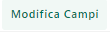{width="0.5715277777777777in"
height="0.16875in"} ) presente nella barra degli strumenti di questa
stessa maschera.

In questo modo si verrà ricondotti alla maschera "**Lista dei Campi del
Feed**"

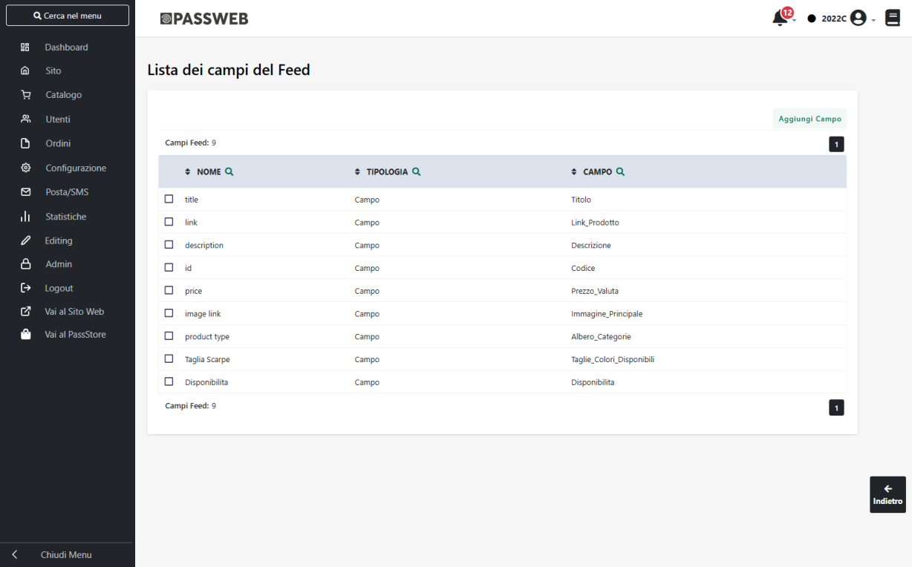{width="5.5777777777777775in"
height="3.467361111111111in"}

contenente l'elenco dei campi attualmente gestiti per il Feed in esame.

Per ciascuno dei campi presenti in elenco è indicato:

- Nome del campo (colonna "**Nome**"). E' il nome che verrà utilizzato
  nelle intestazioni dei campi del Feed

- Tipologia del campo (colonna "**Tipologia**"). Indica se il campo in
  esame è mappato su di un Campo o su di un Attributo Articolo

- Campo (colonna "**Campo**"). Indica esattamente il nome del Campo /
  Attributo Articolo su cui è mappato il relativo campo del Feed

I pulsanti presenti nella barra degli strumenti consentono
rispettivamente di:

**Sposta Campo** (
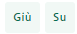{width="0.4027777777777778in"
height="0.175in"} ): consente di spostare rispettivamente verso il basso
e verso l'alto il campo attualmente selezionato in elenco definendo così
la sua posizione. Dipendentemente dallo specifico motore a comparazione
di prezzo con il quale si desidera effettuare l'integrazione, la
posizione di uno specifico campo all'interno del feed e conseguentemente
all'interno del file di export da esso generato può o meno essere una
delle specifiche da soddisfare

**Modifica Campo**
(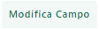{width="0.5847222222222223in"
height="0.175in"} ): consente di modificare le proprietà e le
caratteristiche del campo attualmente selezionato in elenco

**Elimina Campo**
(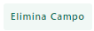{width="0.5520833333333334in"
height="0.18819444444444444in"} ): consente di eliminare definitivamente
il campo attualmente selezionato in elenco.

**NOTA BENE:** eventuali modifiche apportate ai campi articolo di un
Feed, così come una loro eventuale eliminazione non comporta la
rigenerazione automatica del file che dovrà, quindi, essere avviata
manualmente (pulsante "Genera Feed") o tramite sincronizzazione.

**Aggiungi Campo**
(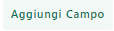{width="0.5909722222222222in"
height="0.1625in"} ): consente di aggiungere al Feed un nuovo campo
articolo.

Cliccando su questo pulsante verrà quindi aperta la maschera "**Nuovo
Campo**"

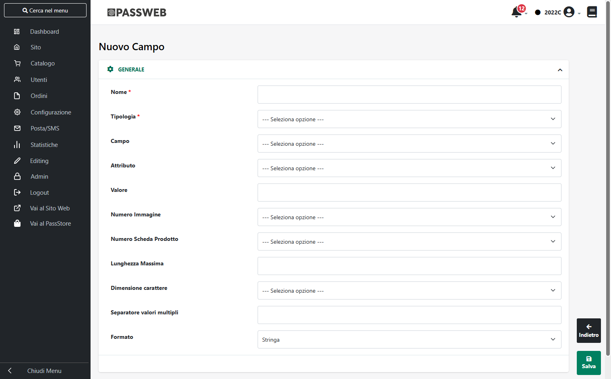{width="5.5777777777777775in"
height="3.467361111111111in"}

attraverso cui poter definire tutte le caratteristiche e le proprietà
del campo articolo che si desidera inserire all'interno del Feed.

In particolare per ogni singolo campo sarà necessario specificare un
valore per i seguenti parametri:

**Nome:** nome che identifica il campo in oggetto. Tale nome verrà
utilizzato nell'intestazione dei file csv o txt, posto ovviamente che
sia stata richiesto di inserire all'interno di questi file la riga di
intestazione, o come tag identificativo del relativo campo all'interno
dei file xml.

**Occorre quindi prestare particolare attenzione, nel caso ad esempio
dei file xml, al nome richiesto dallo specifico motore a comparazione di
prezzo per i vari campi (obbligatori e non)**

**Tipologia:** consente di specificare la tipologia del campo che si
desidera inserire all'interno del corrispondente Feed Articoli. E'
possibile selezionare uno dei seguenti valori:

- **Campo:** in questo caso il campo articolo da inserire all'interno
  del feed dovrà corrispondere ad uno dei campi Mexal selezionabili dal
  sottostante menu a tendina. In questo senso è possibile selezionare
  uno dei seguenti valori:

  - **Albero Categorie** -- Campo a valori multipli: elenco di tutte le
    categorie merceologiche principali cui appartiene, all'interno
    dell'albero delle categorie merceologiche del gestionale, lo
    specifico articolo.

> Facendo riferimento, ad esempio, ad un articolo appartenente alla
> categoria DESKTOP all'interno della struttura di categorie INFORMATICA
> 🡪 PC 🡪 DESKTOP, in queste condizioni verrebbero inseriti all'interno
> del Feed, e conseguentemente pubblicati all'interno del relativo
> motore a comparazione di prezzo, per questo stesso articolo le
> stringhe INFORMATICA, PC e DESKTOP separate dal carattere indicato
> all'interno del successivo campo "**Separatore Valori Multipli**"

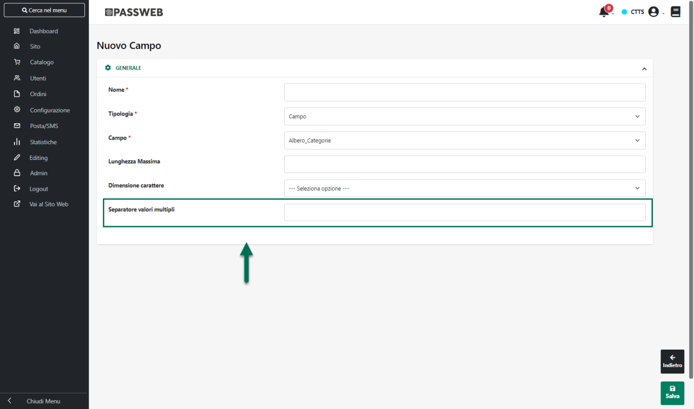{width="5.825in"
height="3.441666666666667in"}

> **ATTENZIONE! Per categoria merceologica principale si intende sempre
> e comunque quella cui è stato associato l'articolo all'interno del
> relativo gestionale Passepartout**

- **Alias** -- Campo a valori multipli**:** elenco dei Codici Alias
  associati, lato gestionale, al corrispondente prodotto.

> Considerando che il campo in oggetto è a valori multipli i codici
> Alias verranno inseriti all'interno di questo campo separati dal
> carattere indicato nel successivo campo **"Separatore valori
> multipli"**

- **Categoria:** selezionando questo valore il campo in oggetto verrà
  fatto corrispondere **al nome della** **categoria merceologica
  principale del relativo articolo, vale a dire quella associata
  all'articolo stesso direttamente all'interno del gestionale
  Passepartout.**

> Facendo riferimento, ad esempio, ad un articolo appartenente alla
> categoria DESKTOP all'interno della struttura di categorie INFORMATICA
> 🡪 PC 🡪 DESKTOP, in queste condizioni verrebbe inserito all'interno del
> Feed, e conseguentemente pubblicato all'interno del relativo motore a
> comparazione di prezzo, per questo stesso articolo il valore DESKTOP
>
> Anche in questo caso il nome della categoria merceologica verrà
> considerato nella lingua di gestione del feed.

- **Categoria Padre:** selezionando questo valore il campo in oggetto
  verrà fatto corrispondere al nome della categoria merceologica
  principale presente a livello 0 nell'albero delle categorie
  merceologiche definito all'interno del gestionale.

> Facendo riferimento, ad esempio, ad un articolo appartenente alla
> categoria DESKTOP all'interno della struttura di categorie INFORMATICA
> 🡪 PC 🡪 DESKTOP, in queste condizioni verrebbe inserito all'interno del
> Feed, e conseguentemente pubblicato all'interno del relativo motore a
> comparazione di prezzo, per questo stesso articolo il valore
> INFORMATICA

- **Categoria Statistica**: nome della categoria statistica associata,
  lato gestionale, al corrispondente prodotto

- **Codice:** Codice gestionale del relativo prodotto

- **Codice Alternativo:** Codice alternativo del relativo prodotto

- **Codice Articolo Fornitore** -- Campo a valori multipli: Codice
  Articolo Fornitore associato, lato gestionale, al relativo prodotto.
  Considerando che il campo in oggetto è a valori multipli, nel momento
  in cui ad un articolo dovessero essere associati più Codici Fornitore,
  i relativi valori verranno inseriti all'interno dello stesso campo del
  tracciato record separati uno dall'altro dal carattere indicato
  all'interno del successivo campo **"Separatore valori multipli"**

- **Codice Categoria**: codice della categoria merceologica principale
  associata all'articolo stesso direttamente all'interno del gestionale
  Passepartout**.**

- **Codice Articolo Fornitore**: Codice Articolo Fornitore assegnato al
  relativo prodotto all'interno del gestionale Passepartout

- **Codice Alternativo:** Codice alternativo del relativo prodotto

- **Colori** -- Campo a valori multipli: elenco di tutti i colori
  indicati, per il relativo articolo, all'interno della Tabella Taglie
  di Mexal (indipendentemente dal fatto che tali colori siano
  effettivamente disponibili)

> **ATTENZIONE!** il campo in oggetto verrà valorizzato solamente per
> gli articoli che utilizzano la Tabella Taglie/Colori di Mexal e che
> sono associati ad una Serie marcata come "Serie Colori"
>
> Per maggiori informazioni relativamente a come poter marcare una Serie
> della relativa Tabella Mexal come "Serie Colori" si veda quanto
> indicato all'interno del capitolo *"Catalogo -- Gestione Articoli --
> Taglie o Colori Ecommerce Mexal -- Configurazione di una serie di
> Taglie / Colori"* di questo manuale
>
> Considerando che il campo in questione è a valori multipli i dati
> presenti al suo interno verranno separati dal carattere indicato
> all'interno del successivo campo "**Separatore Valori Multipli**"

- **Colori Disponibili** -- Campo a valori multipli: analogo al campo
  precedente con l'unica differenza che, in questo caso, verranno
  considerati i soli colori effettivamente disponibili

- **Confezione:** selezionando questo valore il campo in oggetto
  conterrà, per ogni articolo gestito a confezioni, l'esatto numero di
  elementi presenti nella specifica confezione. Tale campo, verrà
  ovviamente valorizzato solo per articoli gestiti a confezione.

- **Data Creazione formato dd/MM/yyyy:** data di importazione in Passweb
  del corrispondente articolo

- **Data Creazione formato UNIX**: data di importazione in Passweb del
  corrispondente articolo espressa in formato UNIX

- **Descrizione:** Descrizione Web dell'articolo. Corrisponde a quanto
  presente nell'omonimo campo dell' Anagrafica Passweb del relativo
  articolo.

> Come noto quanto presente all'interno di questo campo, può essere
> inserito direttamente in Passweb articolo per articolo oppure può
> essere valorizzato automaticamente con il contenuto della risorsa di
> tipo D (file testuale) associata in Mexal ai vari articoli.
>
> Anche in questo caso verrà inserita all'interno del file la
> descrizione in oggetto nella lingua di gestione del Feed.
>
> **ATTENZIONE!** Qualora nel campo Descrizione dovessero essere
> presenti dei tag HTML e l'esigenza dovesse essere quella di inserire
> nel feed una descrizione testuale (priva dunque di qualsiasi tag) sarà
> necessario utilizzare il campo "**Descrizione senza codice HTML**"

- **Descrizione Dettagliata:** Descrizione Dettagliata dell'articolo.
  Corrisponde a quanto presente nell'omonimo campo dell' Anagrafica
  Passweb del relativo articolo.

> Come noto quanto presente all'interno di questo campo, può essere
> inserito direttamente in Passweb articolo per articolo oppure può
> essere valorizzato automaticamente con il contenuto del relativo campo
> Mexal.
>
> Anche in questo caso verrà inserita all'interno del file la
> descrizione in oggetto nella lingua di gestione del Feed.
>
> **ATTENZIONE!** Qualora nel campo Descrizione Dettagliata dovessero
> essere presenti dei tag HTML e l'esigenza dovesse essere quella di
> inserire nel feed una descrizione testuale (priva dunque di qualsiasi
> tag) sarà necessario utilizzare il campo "**Descrizione Dettagliata
> senza codice HTML**"

- **Descrizione HTML / 2 / 3:** selezionando questo valore il campo in
  oggetto verrà fatto corrispondere al campo **"Descrizione HTML/2/3"**
  presente all'interno della maschera **"Modifica Articolo"**
  accessibile, in Passweb, dalla voce di menu *"Catalogo -- Gestione
  Articoli"* dopo aver selezionato uno specifico articolo ed aver
  cliccato sul pulsante "Modifica Articolo" presente nella barra degli
  strumenti.

- **Descrizione HTML / 2 / 3 senza codice HTML:** analogo al campo
  precedente. In questo caso però il testo presente all'interno del
  campo verrà epurato di eventuali tag HTML

- **Disponibilità:** selezionando questo valore il campo in oggetto
  conterrà, per ogni articolo, il valore della disponibilità
  dell'articolo stesso aggiornato all'ultima sincronizzazione e
  calcolato sulla base di quanto impostato alla pagina \"*Catalogo -
  Configurazione Parametri Catalogo*\" del Wizard.

- **Group_Id --** disponibile solo nel caso in cui per il feed in esame
  sia stato attivato il parametro "Includi Articoli Padre".

> Selezionando questa opzione il campo corrispondente all'interno del
> feed verrà valorizzato solo ed esclusivamente per gli articoli
> strutturati (padri e figli) con il codice gestionale dell'articolo
> padre di struttura. Un padre di struttura e i relativi figli avranno
> quindi in corrispondenza di questo campo sempre lo stesso valore

- **Group_Leader --** disponibile solo nel caso in cui per il feed in
  esame sia stato attivato il parametro "Includi Articoli Padre"

> Selezionando questa opzione il campo corrispondente all'interno del
> feed verrà valorizzato solo ed esclusivamente per gli articoli
> strutturati (padri e figli). Nello specifico gli articoli padri di
> struttura avranno questo campo valorizzato a **true** mentre gli
> articoli figlio avranno il campo valorizzato a **false**.
>
> **ATTENZIONE!** le opzioni Group_Id e Group_Leader sono gestite in
> automatico dall'applicativo, non hanno quindi bisogno di ulteriori
> configurazioni ma per poter funzionare in maniera corretta devono
> necessariamente avere come "Nome" del campo rispettivamente group_id e
> group_leader

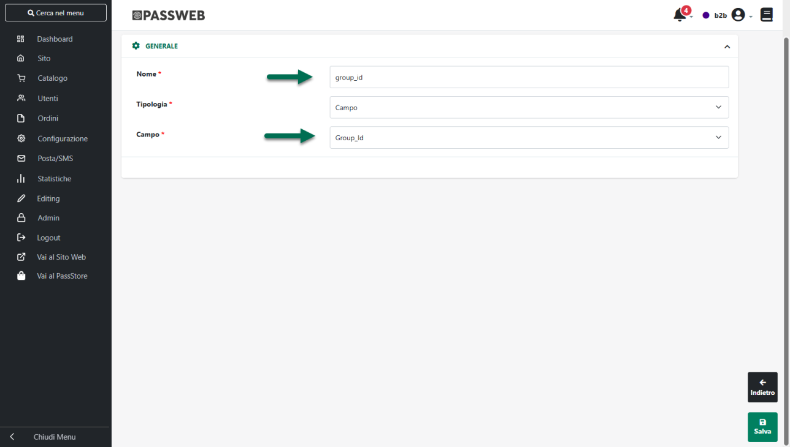{width="5.856944444444444in"
height="3.3180555555555555in"}

- **Immagine Principale:** url completo dell'immagine utilizzata
  all'interno del sito Passweb come immagine principale della scheda
  prodotto. In questo modo sarà quindi possibile pubblicare all'interno
  del relativo motore a comparazione di prezzo, per ogni singolo
  articolo, la stessa immagine prodotto utilizzata all'interno del
  proprio sito ecommerce

- **Immagine Secondaria:** url completo dell'immagine utilizzata
  all'interno del sito Passweb come immagine secondaria della scheda
  prodotto. Sarà necessario indicare poi all'interno del successivo
  campo "**Numero Immagine**" anche a quale delle immagini secondarie
  fare riferimento.

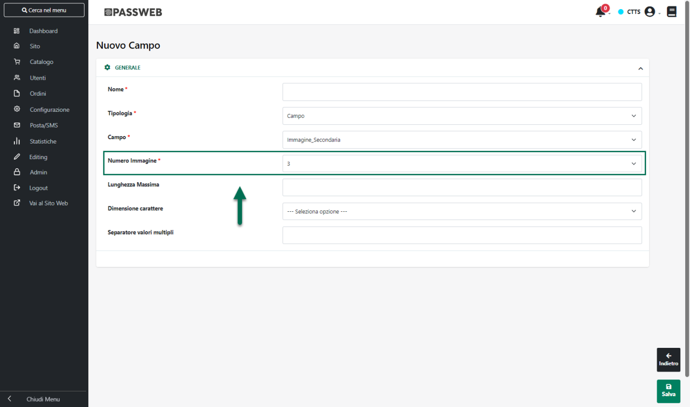{width="5.825in"
height="3.441666666666667in"}

**NOTA BENE:** l' url inserito all'interno dei campi "Immagine
Principale" e "Immagine Secondaria" farà sempre riferimento alle
immagini originali e non a quelle ridimensionate da Passweb. Sarà poi la
procedura di importazione delle specifico motore a comparazione di
prezzo a preoccuparsi di ridimensionare queste immagini secondo le sue
specifiche esigenze

- **Iva:** aliquota iva del corrispondente prodotto

- **Link Prodotto:** url della relativa pagina prodotto all'interno del
  proprio sito ecommerce

- **Misuratore Spedizioni**: valore del parametro "Misuratore Trasposto
  a scaglioni" presente nell'Anagrafica Passweb dell'articolo

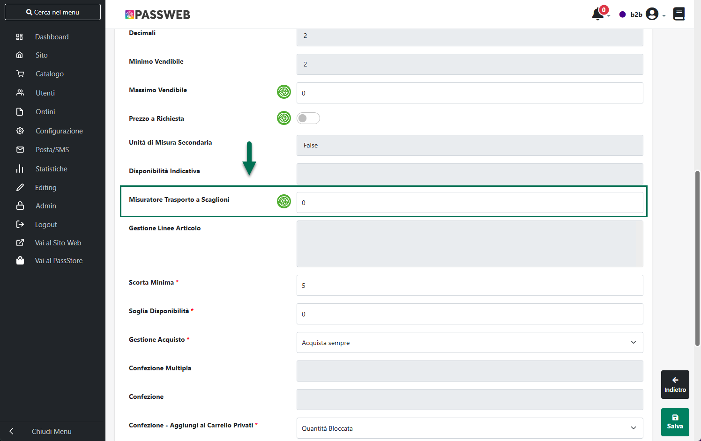{width="5.5in"
height="3.4611111111111112in"}

- **Natura:** descrizione della Natura associata sul gestionale al
  relativo articolo

- **Natura Codice:** codice della Natura associata sul gestionale al
  relativo articolo

- **Nominativo Fornitore** -- Campo a valori multipli: Nominativo (Nome
  Cognome / Ragione Sociale) Fornitore associato, lato gestionale, al
  relativo prodotto.

> Considerando che il campo in oggetto è a valori multipli, nel momento
> in cui ad un articolo dovessero essere associati più Fornitore, i
> relativi valori verranno inseriti all'interno dello stesso campo del
> tracciato record separati uno dall'altro dal carattere indicato
> all'interno del successivo campo **"Separatore valori multipli"**

- **Prezzo:** prezzo dell'articolo calcolato sulla base del listino e
  della valuta indicati nei parametri di configurazione del Feed
  **tenendo in considerazione anche la Categoria Sconto Cliente
  eventualmente impostata sul Feed.**

- **Prezzo Valuta:** prezzo dell'articolo calcolato sulla base del
  listino e della valuta indicati nei parametri di configurazione del
  Feed **tenendo in considerazione anche la Categoria Sconto Cliente
  eventualmente impostata sul Feed** comprensivo anche del codice ISO
  della valuta di gestione del feed.

- **Prezzo Listino:** prezzo dell'articolo definito per il listino
  indicato nei parametri di configurazione del Feed

- **Prezzo Listino Valuta:** prezzo dell'articolo definito per il
  listino indicato nei parametri di configurazione del Feed comprensivo
  anche del codice ISO della valuta di gestione del feed.

- **Prezzo Originale:** prezzo originale dell'articolo. A differenza del
  campo "Prezzo" il campo "Prezzo Originale" non è, di base, un dato
  obbligatorio

<!-- -->

- **Prezzo Originale Valuta:** prezzo originale dell'articolo
  comprensivo anche del codice ISO della valuta di gestione del feed.

- **Prezzo Scontato:** prezzo scontato dell'articolo. Tale prezzo verrà
  quindi calcolato sulla base del listino e della valuta indicati nei
  parametri di configurazione del Feed **prendendo anche in
  considerazione eventuali sconti attivi per l'articolo stesso.**

> **ATTENZIONE!** Il prezzo scontato verrà effettivamente pubblicato
> all'interno del feed solo se diverso dal prezzo originale

- **Prezzo Scontato Valuta:** prezzo scontato dell'articolo comprensivo
  anche del codice ISO della valuta di gestione del feed

> **ATTENZIONE!** anche in questo caso il prezzo in esame verrà
> effettivamente pubblicato all'interno del feed solo se diverso dal
> prezzo originale

**ATTENZIONE!** Tutti i prezzi pubblicati nel Feed saranno o meno
comprensivi di iva dipendentemente da quanto impostato per il parametro
"Prezzo" presente nella maschera di configurazione del Feed

- **Scheda Prodotto**: selezionando questo valore il campo in oggetto
  conterrà, l' url completo del file utilizzato all'interno del sito
  Passweb come scheda tecnica del relativo articolo. Sarà necessario
  indicare poi all'interno del successivo campo "**Numero Scheda
  Prodotto**" anche l'esatto numero della scheda tecnica cui fare
  riferimento.

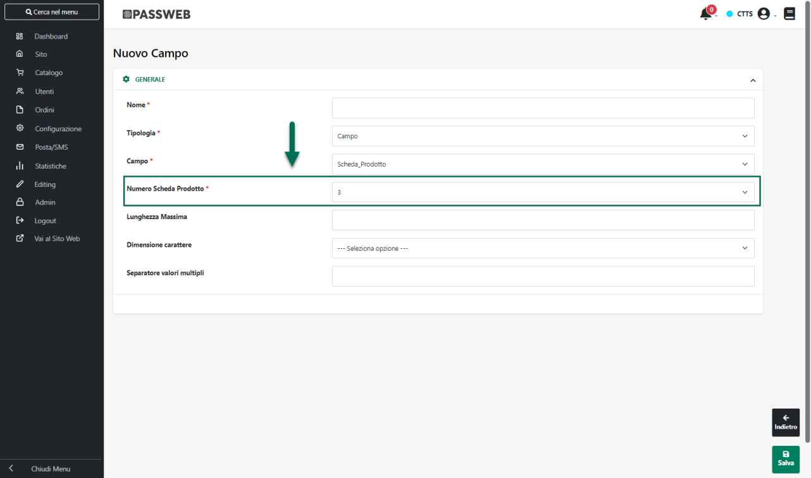{width="5.825in"
height="3.441666666666667in"}

- **Taglie** -- Campo a valori multipli: elenco di tutte le taglie
  indicate, per il relativo articolo, all'interno della Tabella Taglie
  di Mexal (indipendentemente dal fatto che queste siano o meno
  effettivamente disponibili)

> **ATTENZIONE!** il campo in oggetto verrà valorizzato solamente per
> gli articoli che utilizzano la Tabella Taglie/Colori di Mexal e che
> sono associati ad una Serie marcata come "Serie Taglie"
>
> Per maggiori informazioni relativamente a come poter marcare una Serie
> della relativa Tabella Mexal come "Serie Taglie" si veda quanto
> indicato all'interno del capitolo *"Catalogo -- Gestione Articoli --
> Taglie o Colori Ecommerce Mexal -- Configurazione di una serie di
> Taglie / Colori"* di questo manuale
>
> Considerando che il campo in questione è a valori multipli i dati
> presenti al suo interno verranno separati dal carattere indicato
> all'interno del successivo campo "**Separatore Valori Multipli**"

- **Taglie Disponibili** -- Campo a valori multipli: analogo al campo
  precedente con l'unica differenza che, in questo caso, verranno
  considerate le sole taglie effettivamente disponibili

- **Taglie/Colori --** Campo a valori multipli: selezionando questo
  valore il campo in oggetto conterrà, nel caso di articoli gestiti a
  Taglie\\Colori (e che utilizzano per questo la corrispondente Tabella
  Mexal) l'elenco di tutte le taglie/colori dello specifico articolo.

> **ATTENZIONE:** all'interno di questo stesso campo verranno inserite
> le taglie o i colori dell'articolo indipendentemente dal fatto che la
> relativa serie sia stata marcata come Serie Taglie o come Serie Colori
>
> Considerando che il campo è a valori multipli i dati presente al suo
> interno verranno separati dal carattere indicato nel successivo campo
> "**Separatore Valori Multipli**"

- **Taglie/Colori Disponibili --** Campo a valori multipli: analogo al
  campo precedente con l'unica differenza che, in questo caso, verranno
  considerate solamente taglie e colori effettivamente disponibili

- **Titolo:** titolo del corrispondente prodotto. Corrisponde a quanto
  stampato sul sito utilizzando il componente "Titolo"

- **Valuta:** selezionando questo valore il campo in oggetto verrà fatto
  corrispondere al codice ISO della valuta. In questo modo sarà quindi
  possibile inserire all'interno del Feed, e pubblicare all'interno del
  relativo motore a comparazione di prezzo il codice ISO della valuta di
  gestione del Feed (codice di tre lettere utilizzato per definire i
  nomi delle valute e stabilito dall\'Organizzazione Internazionale per
  le Standardizzazioni)

<!-- -->

- **Attributo:** in questo caso il campo articolo da inserire
  all'interno del feed dovrà corrispondere ad uno degli Attributi
  Articolo (siano essi Attributi di tipo Mexal o di tipo Passweb)
  gestiti all'interno del sito e selezionabili dal sottostante menu a
  tendina (campo **"Attributo"**)

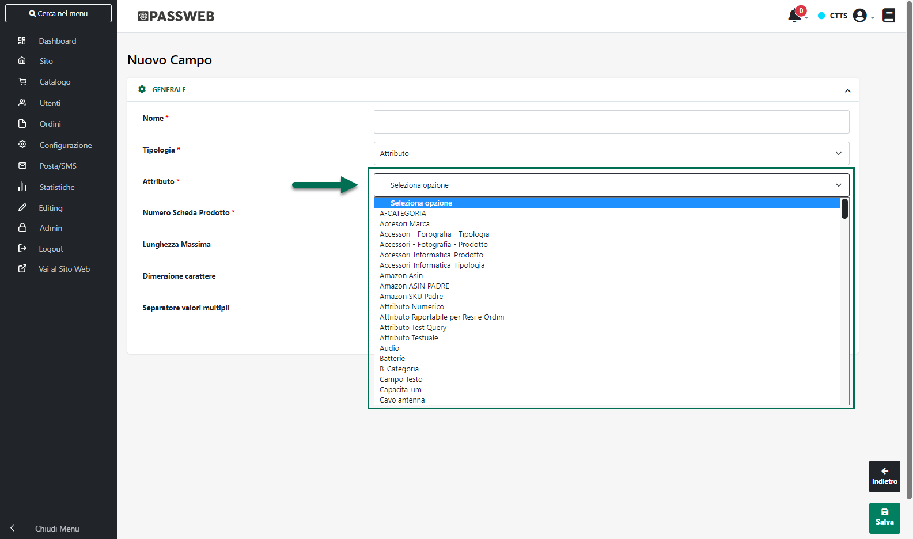{width="5.825in"
height="3.441666666666667in"}

**NOTA BENE:** sarà possibile selezionare dal menu a tendina sopra
evidenziato tutti gli Attributi Articolo definiti nella corrispondente
sezione del Wizard ad eccezione dei soli Attributi Passweb di tipo HTML
e Immagine

- **Personalizzato:** in questo caso verrà inserito all'interno del Feed
  e conseguentemente pubblicato all'interno del corrispondente motore a
  comparazione di prezzo, indistintamente per tutti gli articoli, un
  campo con il valore indicato nel successivo parametro **"Valore"**

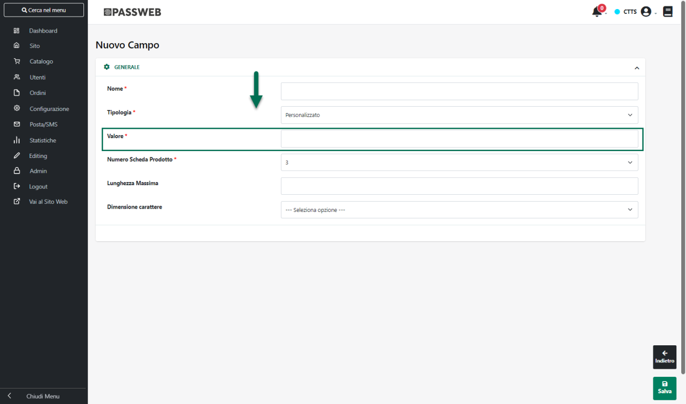{width="5.825in"
height="3.441666666666667in"}

**NOTA BENE:** quanto indicato all'interno del campo "Valore" verrà
riportato esattamente per tutti gli articoli gestiti all'interno del
feed

**Lunghezza Massima:** consente di impostare il numero massimo di
caratteri che dovranno essere gestiti per il campo io oggetto. Nel caso
in cui il valore del campo dovesse avere un numero di caratteri
superiore a quello indicato all'interno di questo parametro, questo
verrebbe automaticamente troncato.

**Dimensione Carattere:** consente di specificare se il per il valore
del campo in oggetto dovranno essere utilizzati solo caratteri minuscoli
o solo caratteri maiuscoli. In un caso o nell'altro l'eventuale
conversione verrà eseguita automaticamente da Passweb.

Il pulsante "**Salva**" presente nella parte bassa della maschera
consente di salvare il campo appena creato/modificato

