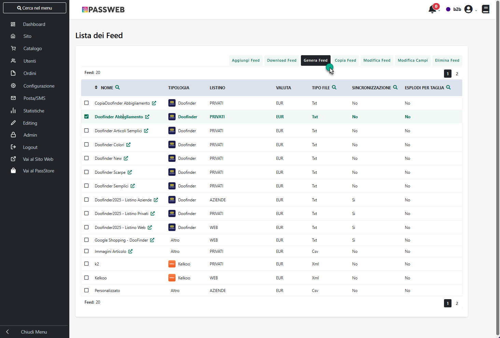
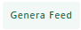
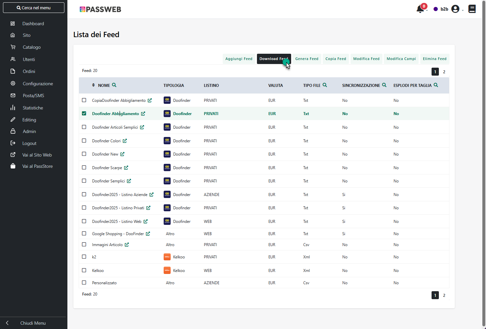
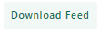

# GENERAZIONE DI UN FEED ARTICOLI

Arrivati a questo punto, dopo aver definito le caratteristiche e la
struttura del Feed articoli che si intende realizzare e, soprattutto,
dopo aver definito l'insieme dei campi, e conseguentemente delle
informazioni articolo, da inserire all'interno del Feed, l'ultimo step
di questo processo sarà chiaramente quello relativo alla generazione
vera e propria del Feed e quindi all'esportazione dei dati ad uso e
consumo ad esempio di uno specifico motore a comparazione di prezzo.

Per generare quindi un Feed articoli sarà sufficiente selezionarlo tra
quelli presenti in elenco all'interno della maschera "Lista Feed" e
cliccare poi sul pulsate "**Genera Feed**" presente nella barra degli
strumenti di questa stessa maschera.

{width="5.383333333333334in"
height="3.6493055555555554in"}

**Genera Feed** (
{width="0.47430555555555554in"
height="0.18194444444444444in"} ): cliccando su questo pulsante verrà
avviata la generazione del Feed attualmente selezionato in elenco e la
creazione del relativo file contenente le informazioni associate ai
campi del feed in relazione agli articoli che soddisfano il filtro
impostato per questo stesso feed.

**La generazione del Feed e la conseguente realizzazione del file di
export avverranno in background e l'utente verrà avvisato al
completamento dell'operazione mediante un'apposita mail.**

Nella mail sarà indicato anche l'indirizzo della pagina web all'interno
della quale poter visualizzare il file generato. Questo indirizzo potrà
essere passato anche al motore a comparazione di prezzo che utilizzerà
quindi questa pagina web per prelevare le informazioni sugli articoli da
pubblicare al suo interno.

**NOTA BENE:** all'interno di questa pagina web verrà, di fatto,
visualizzato sempre un file di tipo txt indipendentemente da quello che
è lo specifico formato selezionato per la generazione del file associato
al feed. Questo perché, per i motori a comparazione di prezzo, è
necessario che il file sia apribile tramite browser ed in questo senso
un file con estensione csv, ad esempio, non lo è.

La pagina web all'interno della quale visualizzare il contenuto del file
di export associato al Feed appena generato può essere raggiunta anche
cliccando sul nome del corrispondente Feed all'interno della maschera
"Lista dei Feed"

{width="5.1625in"
height="3.928472222222222in"}

In definitiva dunque, una volta generato il Feed Articoli, e prodotto
quindi il corrispondente file di export, per completare l'integrazione e
pubblicare quindi i propri articoli all'interno del relativo motore a
comparazione di prezzo, sarà necessario, ovviamente, fornire al motore
stesso le informazioni presenti all'interno di questo file. Questo potrà
essere fatto in due modi diversi:

a)  **Download del file generato dal sito Passweb e Upload di questo
    stesso file all'interno del motore a comparazione di prezzo.**

> In questo caso sarà quindi necessario per prima cosa cliccare sul
> pulsante "Download Feed" presente nella barra degli strumenti della
> maschera "Lista Feed"

{width="5.383333333333334in"
height="3.6493055555555554in"}

- **Download Feed** (
  {width="0.5715277777777777in"
  height="0.175in"} ): cliccando su questo pulsante sarà possibile
  scaricare il file associato al Feed Articoli attualmente selezionato
  in elenco

> Effettuato il download di questo file dal sito Passweb sarà poi
> necessario effettuare manualmente anche l'upload di questo stesso file
> all'interno del corrispondente motore a comparazione di prezzo.
>
> Operando in questo modo, ovviamente, a seguito di ogni modifica
> apportata al Feed in esame, e indipendentemente dal fatto di
> rigenerare poi il Feed manualmente o automaticamente alla
> sincronizzazione, per aggiornare i dati presenti nel motore a
> comparazione di prezzo andrebbe effettuato ogni volta il download e
> l'upload manuale del relativo file.

b)  **Fornendo al motore a comparazione di prezzo l'indirizzo della
    pagina web da cui andarsi a prelevare il contenuto del file
    corrispondente al Feed articoli desiderato**

> Al fine di evitare le operazioni manuali indicate al punto a), quasi
> tutti i motori a comparazione di prezzo consentono di indicare loro
> l'indirizzo di una pagina web da cui poi il motore stesso andrà a
> prelevare automaticamente le informazioni relative agli articoli che
> dovranno essere pubblicati al suo interno.
>
> In questo senso sarà quindi sufficiente indicare allo specifico
> motore, negli appositi campi, l'indirizzo della pagina web prodotta
> automaticamente da Passweb alla generazione del feed, indirizzo questo
> riportato nella mail inviata da Passweb all'amministratore del sito al
> termine della procedura di generazione del Feed Articoli e
> individuabile anche cliccando direttamente sul nome del Feed
> all'interno della maschera "Lista Feed".
>
> Supponendo poi di aver impostato il Feed in maniera tale che questo
> possa aggiornarsi e rigenerarsi, se necessario, automaticamente alla
> sincronizzazione (parametro "Aggiornamento Sincronizzazione") le
> operazioni manuali da effettuare per aggiornare i dati pubblicati
> all'interno del relativo motore a comparazione di prezzo sarebbero
> praticamente azzerate.
>
> A seguito di una sincronizzazione, se necessario, verrebbe infatti
> automaticamente rigenerato il Feed Articoli e aggiornato anche il
> contenuto della relativa pagina web, pagina questa da cui il motore a
> comparazione di prezzo andrebbe poi autonomamente, secondo quelle che
> sono le sue tempistiche di aggiornamento, a prelevare le nuove
> informazioni aggiornando così i dati pubblicati al suo interno.
