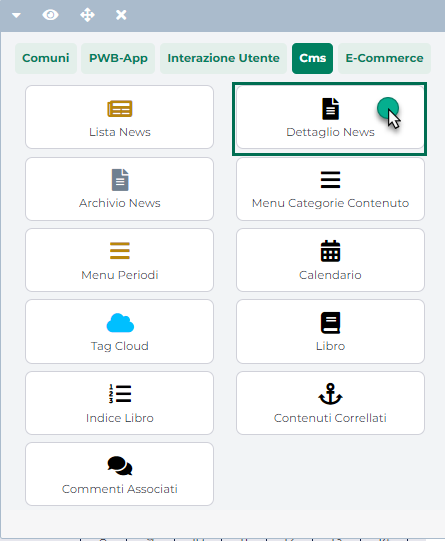

# CREAZIONE DI UN NUOVO UTENTE

Per creare un nuovo utente abilitato ad accedere al Backend di Passweb è
necessario per prima cosa accedere alla sezione "Gestione Ruoli"
precedentemente esaminata, selezionare la tipologia di Ruolo in
relazione alla quale si desidera creare un nuovo utente e cliccare
quindi sul pulsante **Gestisci gli Utenti per questo Ruolo** (
 )

In questo modo si avrà infatti accesso alla maschera la maschera
**"Lista Utenti Ruolo -- Nome Ruolo"**

contenente l'elenco di tutti gli utenti attualmente associati al Ruolo
in oggetto.

Il pulsante **Nuovo Utente** (
 ), presente nella contestuale barra degli
strumenti consente quindi di accedere alla maschera "**Dati Utente**".

all'interno della quale poter indicare i dati dell'utente (Nome,
Cognome, Email), le sue credenziali di accesso al Wizard (Login e
Password) e alcune impostazioni di base sull'utilizzo dell'ambiente di
sviluppo (es. Blocca accesso Wizard, Numero di tentativi Password ...).

Ovviamente tali impostazioni potranno poi essere modificate e
personalizzate dall'utente stesso, una volta effettuato l'accesso al
Wizard, direttamente dal suo Profilo. (per maggiori informazioni in
merito si veda dunque anche la sezione *"Profilo Utente*" di questo
manuale)

Relativamente alle credenziali di accesso è bene sottolineare che la
password assegnata ad ogni utente dovrà necessariamente soddisfare i
seguenti requisiti:

- **Lunghezza minima di 12 caratteri**

- **Utilizzo di almeno 1 carattere maiuscolo, 1 carattere minuscolo, 1
  numero, 1 carattere speciale**

- **Non dovrà contenere parti del nome dell\'utente**

> Nello specifico verrà fatto un controllo per sottostringhe di
> lunghezza pari a 3. In conseguenza di ciò la password indicata verrà
> accetta solo se non contiene sequenze di 3 caratteri consecutivi
> uguali a quelle presenti nei campi "Nome" e "Cognome" dell'anagrafica
> Passweb del relativo utente

- **Non potrà essere utilizzata nessuna delle ultime 6 password
  inserite**

- **Avrà una durata massima di 90 giorni** al termine dei quali sarà
  obbligatorio impostare una nuova password di accesso.

> Nel momento in cui un utente dovesse quindi tentare di effettuare
> l'accesso al Wizard del proprio sito una volta trascorso il periodo di
> validità della password attualmente in uso, verrà automaticamente
> visualizzata la seguente maschera di "**Reset Password**"

> all'interno della quale inserire obbligatoriamente la nuova Password
> di accesso, password questa che dovrà soddisfare, ovviamente, tutti i
> requisiti richiesti
>
> **ATTENZIONE!** i 90 giorni di validità partiranno sempre dalla data
> di ultima modifica della password attualmente in uso.

Oltre a tutto ciò occorre anche ricordare che**, indipendentemente dalla
tipologia di utente considerato, l'accesso al Back end di Passweb sarà
sempre regolato anche da un meccanismo di autenticazione a 2 fattori**
per cui una volta inserite Username e Password cliccando sul pulsante di
Login verrà visualizzata un'ulteriore schermata all'interno della quale
dover digitare il proprio codice di accesso, codice questo che potrà
essere generato utilizzando l'App Google Authenticator

Per maggiori informazioni relativamente al meccanismo di autenticazione
a due fattori, si veda anche la sezione "*Profilo Utente -- Accesso al
Wizard e autenticazione a due fattori*" di questo manuale

Gli ulteriori parametri presenti all'interno della maschera "Dati
utente" consentono rispettivamente di:

- **Blocca Accesso Wizard:** consente, se selezionato, di impedire ,
  temporaneamente, all'utente in esame, l'accesso al Wizard.

- **Numero tentativi Password:** consente di visualizzare il numero di
  tentativi di accesso al Wizard effettuati per l'utente in esame con
  una password di accesso non corretta.

> **ATTENZIONE! Dopo 3 tentativi di accesso sbagliati l'utenza verrà
> automaticamente bloccata**
>
> Al blocco dell'utenza verrà inviata una mail all'amministratore del
> sito (ossia all'indirizzo specificato alla pagina "Account e-mail e
> SMS" del Wizard) e all'utente bloccato per informarli della
> situazione.
>
> Lo sblocco dell'utenza potrà quindi essere effettuato
> dall'amministratore del sito, eliminando il flag sul precedente
> parametro "Blocca Accesso al Wizard" e reimpostando a 0 il "Numero
> tentativi Password".
>
> In alternativa l'utente stesso potrà effettuare lo sblocco della
> propria utenza richiedendo una nuova Password di accesso mediante il
> link "**Hai dimenticato la Password?**" presente all'interno della
> schermata di blocco.

> Ovviamente, affinché tale procedura possa andare a buon fine è
> indispensabile che all'utente abbia precedentemente indicato nella sua
> anagrafica un indirizzo mail valido e univoco. E' a tale indirizzo,
> infatti, che verranno inviati eventuali link di reimpostazione della
> propria password di accesso

- **Interazione editor (valido solo per Varianti non responsive):**
  consente di impostare la modalità di gestione dell'inserimento di
  nuovi componenti all'interno della pagina web (Drag & Drop o Point &
  click)

- **Protezione di default:** consente di indicare il livello di
  protezione che dovranno avere, a default, le nuove Pagine e i nuovi
  componenti inseriti all'interno del sito.

> Grazie a questo parametro sarà quindi possibile decidere, ad esempio,
> se le nuove Pagine e i nuovi componenti potranno essere gestiti, a
> default, dai soli utenti appartenenti al Ruolo di Amministratori, dai
> soli utenti appartenenti al Ruolo Utente o da entrambe le tipologie
> (per maggiori informazioni in si veda anche la sezione "*Profilo
> Utente*" di questo manuale)

- **Posizione del menu del Wizard** **(valido solo per Varianti non
  responsive):** consente di impostare la modalità di default per la
  visualizzazione del menu quando si entra nella modalità "Live Editing"
  per la creazione delle varie pagine del sito.

- **Visualizzazione Gestione Risorse**: consente di impostare la
  modalità di visualizzazione (Tabellare o Preview) che dovrà essere
  utilizzata a default all'interno della maschera "Gestione Risorse del
  Sito" tipologie (per maggiori informazioni in si veda anche la sezione
  "*Profilo Utente*" di questo manuale)

- **Visualizza il Layout dei Contenitori (valido solo per Varianti non
  responsive):** se selezionato verrà visualizzata a default la griglia
  dei contenitori.

- **Visualizza i Componenti in gestione (valido solo per Varianti non
  responsive):** se selezionato verranno visualizzati a default i
  componenti che l'utente ha in gestione all'interno della specifica
  pagina.

- **Visualizza le Label per i Contenitori non raggiungibili in Gestione
  Contenitori (valido solo per Varianti non responsive):** se
  selezionato, attivando la modalità di gestione dei contenitori della
  pagina web, verranno visualizzate a default delle etichette
  identificative dei vari contenitori presenti all'interno della pagina.

- **Disabilita controllo Ortografico Browser:** consente, se
  selezionato, di disabilitare le funzioni di controllo ortografico del
  browser utilizzate negli editor di testo presenti all'interno del
  Wizard (per maggiori informazioni in si veda anche la sezione
  "*Profilo Utente*" di questo manuale)

- **Abilita Passweb Monitor** consente invece di abilitare l'utente in
  esame per l'accesso alla relativa App.

> Per maggior informazioni in merito all'App Passweb Monitor si veda
> anche il relativo capitolo di questo manuale ("*Passweb Monitor*")

- **Resetta autenticazione a due fattori:** consente di resettare, per
  l'utenza in esame, il meccanismo di autenticazione a due fattori.
  Cliccando su questo pulsante l'utenza verrà riportata nelle condizioni
  iniziali e, al prossimo accesso, dopo aver inserito le relative
  credenziali (Username e Password) verrà mostrato nuovamente il QR Code
  necessario per attivare all'interno dell'App Google Authenticator la
  generazione del codice a 6 cifre (per maggiori informazioni in si veda
  anche la sezione "*Profilo Utente -- Reset dell'autenticazione a due
  fattori*" di questo manuale)

Il controllo "**Attiva suggerimenti codice**" (sezione "**Editor di
codice HTML, Javascript, CSS**")

consente, se abilitato, di attivare per tutti gli editor di codice
presenti all'interno del sito (componente HTML, Layout, maschere di
configurazione del Wizard \...) la funzione di autocompletamento,
mostrando dunque all'utente in fase di inserimento di una nuova
istruzione dei suggerimenti utili a completare automaticamente
l'istruzione stessa

**ATTENZIONE!** I suggerimenti mostrati dalla funzione di
autocompletamento sono relativi unicamente ai linguaggi HTML. Javascript
e CSS

