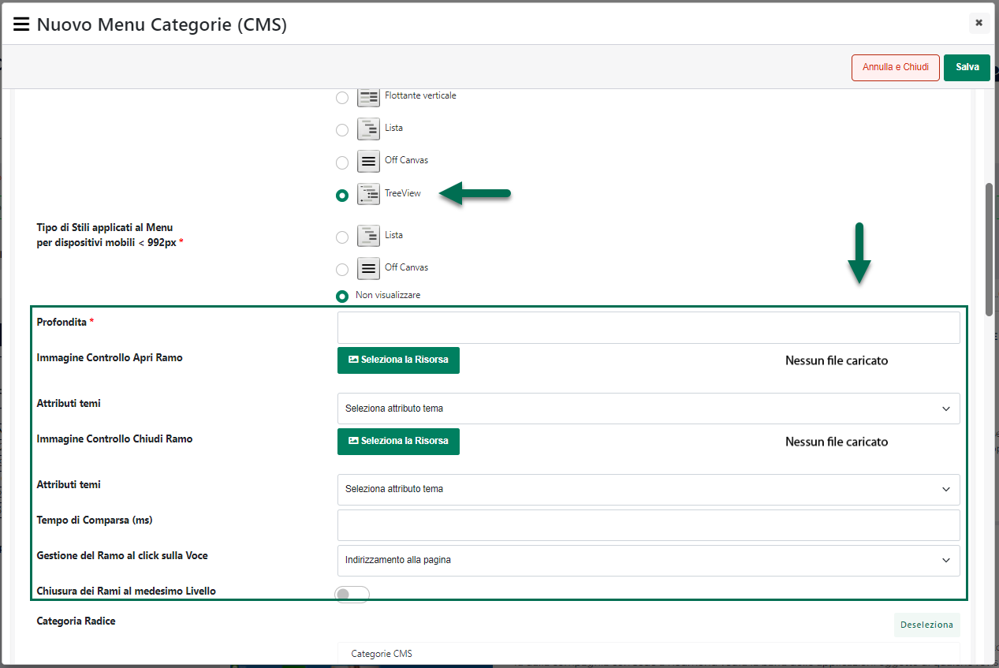
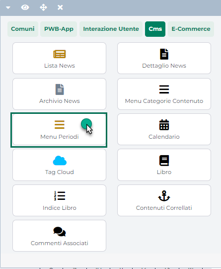
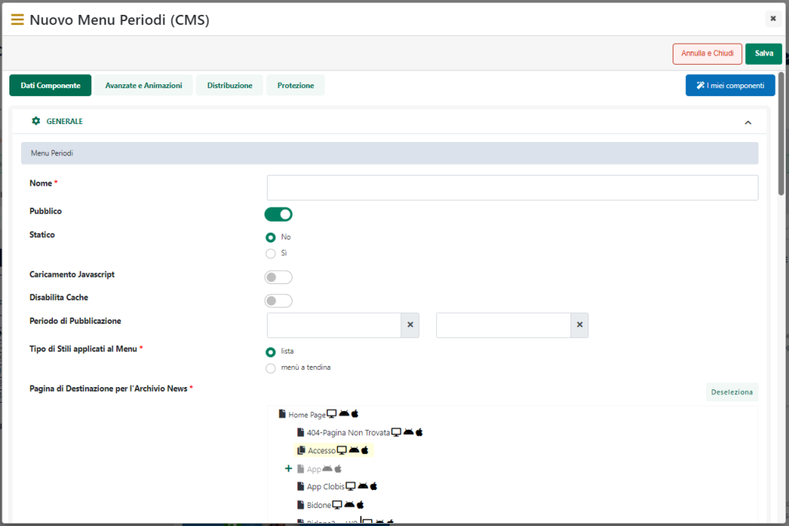
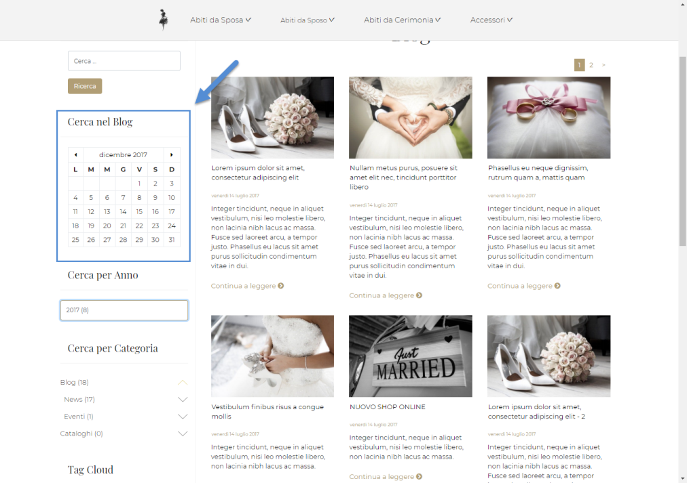

# PERMESSI SULLE PAGINE

La sezione "Permessi sulle Pagine ", accessibile cliccando sul pulsante
"**Modifica Permessi**" della maschera "**Gestione Ruoli**"
precedentemente analizzata, consente di definire le specifiche pagine
cui potranno o non potranno avere accesso, all'interno del Wizard, tutti
gli utenti appartenenti al Ruolo in esame.

{width="5.714583333333334in"
height="3.370138888888889in"}

Per poter consentire agli utenti appartenenti al Ruolo in oggetto di
gestire una specifica pagina del sito, è sufficiente selezionarla
mediante l'apposito flag.

I pulsanti presenti nella contestuale barra degli strumenti consentono
rispettivamente di:

- **Tutte le Pagine** (
  {width="0.5451388888888888in"
  height="0.175in"} ): consente di selezionare contemporaneamente tutte
  le pagine del sito.

- **Pagine** **Prodotto**
  ({width="0.5909722222222222in"
  height="0.18819444444444444in"} ): consente di selezionare
  contemporaneamente tutte le pagine "Prodotto" del sito (pagine rosse).

- **Pagine** **Catalogo**
  ({width="0.5909722222222222in"
  height="0.18194444444444444in"} ): consente di selezionare
  contemporaneamente tutte le pagine "Catalogo" del sito (pagine
  azzurre).

- **Deseleziona**
  ({width="0.5131944444444444in"
  height="0.1951388888888889in"} ): consente di deselezionare
  contemporaneamente tutte le pagine attualmente selezionate.

Per maggiori informazioni sulle diverse tipologie di pagina gestite da
un sito ecommerce si veda il capitolo *"Sito -- Live Editing"* di questo
manuale

**NOTA BENE:** le pagine selezionate all'interno dell'albero potranno
essere effettivamente gestite unicamente nel caso cui sia stata
selezionata la proprietà **"Accesso"** per l'elemento **"Gestione
Pagine"** all'interno della griglia di permessi precedentemente
esaminata.

**NOTA BENE:** le pagine NON selezionate all'interno dell'albero
potranno essere aperte, dagli utenti appartenenti alla tipologia Ruolo
in oggetto, in sola visualizzazione. Non sarà quindi possibile gestire
in alcun modo i componenti presenti all'interno di queste pagine,
indipendentemente dalla configurazione di questi stessi componenti.

