# UTENTI

All'interno di questa sezione è possibile visualizzare e gestire, come
precedentemente evidenziato, l'elenco completo di tutti gli utenti del
proprio sito web.

Effettuando l'accesso verrà visualizzata la maschera **"Lista Utenti"**

{width="5.707638888888889in"
height="3.4805555555555556in"}

attraverso cui poter ricercare uno specifico utente, visualizzarne
l'anagrafica, modificarne, se possibile, i dati ed eventualmente
bloccargli anche l'accesso al sito con la conseguente impossibilità di
effettuare ordini.

Le prime tre icone presenti nell'intestazione della griglia consentono
di attivare e gestire la selezione multipla degli utenti in elenco

Nello specifico l'icona:

- {width="0.11666666666666667in"
  height="9.097222222222222e-2in"}: consente di attivare / disattivare
  la selezione multipla

- {width="9.722222222222222e-2in"
  height="9.722222222222222e-2in"}: consente di selezionare in blocco
  tutti gli utenti attualmente presenti in elenco

- {width="9.097222222222222e-2in"
  height="9.097222222222222e-2in"}: consente di deselezionare in blocco
  tutti gli utenti presenti in elenco

**ATTENZIONE!** la selezione multipla è attiva, per ovvie ragioni, solo
ed esclusivamente in relazione alla funzionalità di "Elimina Utente"

L' icona raffigurante due piccole frecce posta in testata ad ogni
singola colonna (
{width="0.12361111111111112in"
height="0.14930555555555555in"} ) consente invece di ordinare in maniera
crescente e/o decrescente, sulla base dei dati presenti all'interno di
quella stessa colonna, i dati in tabella

Il pulsante "**Colonne**" (
{width="0.11666666666666667in"
height="0.11666666666666667in"} ), presente in testata, in
corrispondenza dell'ultima colonna della griglia, consente di decidere
quali informazioni dovranno essere visualizzate direttamente in tabella.
Cliccando su questo pulsante verrà infatti visualizzata la maschera
"**Colonne**"

{width="3.779166666666667in"
height="1.9347222222222222in"}

mediante la quale poter decidere quale campo attivare / disattivare e
conseguentemente quale informazione mostrare / nascondere.

I dati non presenti direttamente in tabella potranno comunque essere
visualizzati tra le "**ulteriori informazioni**" del cliente (oltre che
ovviamente nella relativa maschera di dettaglio) disponibili cliccando
sul pulsante raffigurante una piccola i (
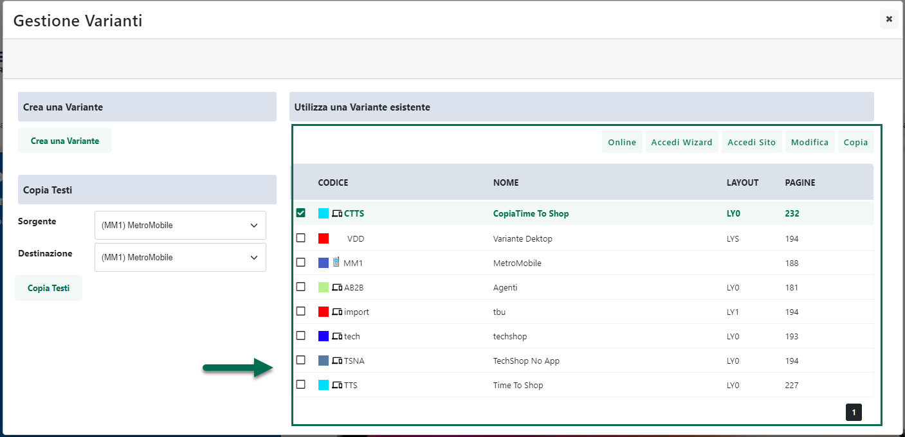{width="0.11666666666666667in"
height="0.11666666666666667in"} ) posto in corrispondenza di ogni
singola riga

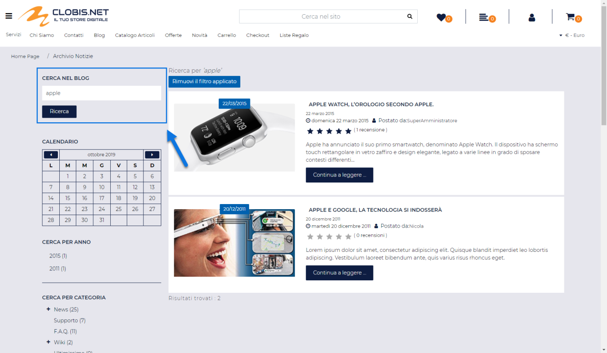{width="5.675in"
height="3.454861111111111in"}

In definitiva dunque, all'interno di questa maschera sarà possibile
visualizzare / nascondere per ogni singolo cliente le seguenti
informazioni:

- **Id:** identificativo Passweb del cliente -- visualizzato a default

- **Nominativo:** Nome / Cognome / Ragione Sociale del cliente --
  visualizzato a default

- **Codice:** codice gestionale del cliente -- visualizzato a default

- **Data Registrazione:** data di registrazione al sito

- **Tipologia:** tipologia dell'utente Agente, Cliente, Contatto ...)

- **Telefono**

- **Codice fiscale**

- **Email**

- **Username**

- **Ospite:** valorizzato o meno con la stringa "Ospite" a seconda del
  fatto che l'utente abbia o meno effettuato la registrazione completa
  al sito

- **Partita Iva**

I tre pulsanti posti, per ogni singola riga, in corrispondenza della
penultima colonna sono strettamente collegati alle informazioni (numero
di telefono e indirizzo mail) assegnate al relativo cliente e consentono
rispettivamente di:

- **Mail** (
  {width="0.18819444444444444in"
  height="0.2013888888888889in"} ): consente, se cliccato, di aprire
  automaticamente il programma di posta elettronica, impostato a default
  sul proprio dispositivo, già settato per l'invio di una nuova mail
  all'indirizzo del relativo utente

- **Telefono** (
  {width="0.18194444444444444in"
  height="0.18819444444444444in"} ): consente, se cliccato, di avviare
  automaticamente una chiamata al numero di telefono del relativo utente
  (utile nel momento in cui questa sezione del Wizard dovesse essere
  consultata da mobile o da app Passweb Monitor)

- **Whatsapp** (
  {width="0.175in"
  height="0.2013888888888889in"} ): consente, se cliccato, di aprire
  Whatsapp sul numero di telefono del relativo utente (utile nel momento
  in cui questa sezione del Wizard dovesse essere consultata da mobile o
  da app Passweb Monitor e, ovviamente, nel caso in cui su tale
  dispositivo sia correttamente installata l'app di Whatsapp)

**ATTENZIONE!** gli stessi pulsanti con le rispettive funzionalità sono
presenti anche in corrispondenza dei relativi campi nell'Anagrafica
Passweb di ogni singolo cliente

{width="5.7659722222222225in"
height="4.467361111111111in"}

Infine, nel momento in cui l'esigenza dovesse essere quella di ricercare
determinati clienti tra quelli presenti in elenco, sarà possibile
utilizzare i due pulsanti "**Filtri**" (
{width="0.3701388888888889in"
height="0.16875in"} ) e "**Filtri Avanzati**" (
{width="0.5131944444444444in"
height="0.175in"} ) presenti nella contestuale barra degli strumenti.

{width="5.675in"
height="3.454861111111111in"}

Nello specifico il pulsante:

**Filtri** (
{width="0.3701388888888889in"
height="0.16875in"} ) : consente, se cliccato, di aprire un pannello di
ricerca contenente una serie di campi standard sulla base dei quali
poter ricercare gli utenti in griglia

{width="6.0in"
height="3.4805555555555556in"}

Utilizzando questa tipologia di filtro sarà quindi possibile effettuare
delle ricerche sulla base dei seguenti campi:

- **Identificativo utente** (campo Id)

- **Codice gestionale** dell' utente (campo Codice)

- **Email** dell'utente (campo Email)

- **Nome / Cognome / Ragione Sociale** (campo Nominativo)

- **Username** **utente** (campo Username)

- **Tipologia** **Utente** (campo Tipologia)

- **Utenti di tipo Ospite** (campo Ospite)

- **Gruppo di appartenenza**

**Filtri** **Avanzati**(
{width="0.5131944444444444in"
height="0.175in"} ) : consente, se cliccato, di aprire un pannello di
ricerca contenente un query builder utilizzabile per creare e
customizzare il proprio filtro

{width="5.688194444444444in"
height="3.4611111111111112in"}

Il pulsante "**Aggiungi un nuovo filtro**" consente di visualizzare
l'elenco dei campi su cui poter impostare la condizione di filtro.

{width="5.552083333333333in"
height="3.4090277777777778in"}

Oltre a campi utente "standard" come Codice, Categoria Statistica, Zona,
Partita IVA ... saranno disponibili e selezionabili anche tutti gli
attributi utente attualmente in uso all'interno del sito.

Una volta selezionato il campo su cui impostare il filtro, sarà poi
necessario selezionare l'operatore relazionale (uguale, contiene, è in
...) da utilizzare all'interno del filtro stesso ed il valore che il
campo in esame dovrà assumere affinché la condizione impostata possa
essere effettivamente soddisfatta.

{width="5.675in"
height="3.4479166666666665in"}

In questo senso, ovviamente, gli operatori disponibili e le modalità di
inserimento del valore da soddisfare potranno cambiare in relazione alla
tipologia di campo su cui è stato impostato il filtro.

Nel caso in cui, ad esempio, il filtro dovesse essere impostato, come in
figura, sul campo "**Privato**" gli operatori relazioni disponibili
saranno solo "**uguale**" e "**diverso da**" mentre il valore da
impostare potrà essere solo "**Vero**" o "**Falso**"

Impostando invece il filtro sul campo "**Nazione**", gli operatori
relazioni disponibili saranno "**è in**" e "**non è in**" e, una volta
selezionato quello desiderato, cliccando sull'etichetta "**Nazioni**"
verrà aperta una piccola finestra contenente l'elenco delle Nazioni
attualmente gestite all'interno del sito.

{width="5.675in"
height="3.4479166666666665in"}

A questo punto sarà quindi sufficiente selezionare le Nazioni
desiderate, tra quelle presenti in elenco, e chiudere la finestra di
selezione cliccando in un qualsiasi altro punto del pannello di ricerca

**ATTENZIONE!** effettuare il click di chiusura all'interno del pannello
di ricerca e non nell'area più scura della pagina, cosa questa che,
oltre a chiudere la maschera di selezione delle Nature, chiuderebbe
anche l'interno pannello di ricerca

**E' inoltre possibile concatenare tra loro due o più condizioni di
filtro, basate anche su più campi differenti, in maniera tale da
realizzare delle query più o meno complesse a seconda del tipo di
risultato che si desidera ottenere.**

Al termine di ogni condizione verrà infatti visualizzata una **"e"**,
corrispondente all'operatore logico "**AND"**, e utilizzata, a default,
per concatenare tra loro eventuali ulteriori condizioni che dovranno
essere considerate nella costruzione della query di ricerca degli
articoli.

Cliccando su questo elemento verranno visualizzati tutti gli operatori
logici da poter utilizzare nella costruzione della propria query.

{width="5.675in"
height="3.4479166666666665in"}

In questo senso, come precedentemente evidenziato, la **"e"**
corrisponderà all'operatore logico **AND** mentre la **"o"**
all'operatore logico **OR.** Le eventuali parentesi, poste prima o dopo
questi operatori, potranno essere utilizzate, esattamente come avviene
in algebra, per specificare quali condizioni dovranno essere valutate
prima e quali dopo.

{width="5.675in"
height="3.4479166666666665in"}

Il filtro rappresentato in figura consente, ad esempio, di ricercare
tutti gli utenti di una data Nazione e che risultano avere l'attributo
utente "Professione Passweb" valorizzato su "Avvocato" o su "Ingegnere"

Il pulsante "**Vai**" presente nella parte bassa del pannello di ricerca
consente di applicare il filtro impostato e chiudere automaticamente il
pannello stesso.

Infine, per poter eliminare i filtri di ricerca avanzati eventualmente
impostati è possibile procedere in due modi diversi:

- Aprire il pannello di ricerca dei filtri avanzati, eliminare tutte le
  condizioni di filtro eventualmente impostate cliccando per questo sul
  pulsante raffigurante un piccolo cestino (
  {width="0.24027777777777778in"
  height="0.2076388888888889in"} ) posto in corrispondenza di ogni
  singola condizione e cliccare, infine, sul pulsante "Vai"

- Cliccare sul pulsante "**Elimina filtri avanzati**" (
  {width="0.9548611111111112in"
  height="0.18819444444444444in"} ) che verrà visualizzato, una volta
  applicato un filtro di questo tipo, nella relativa barra degli
  strumenti

{width="5.675in"
height="3.4479166666666665in"}

**ATTENZIONE! i filtri standard non sono compatibili con i filtri di
ricerca avanzati**

Ciò significa dunque che applicando un filtro di ricerca avanzato
verranno automaticamente eliminati eventuali filtri standard
precedentemente applicati e viceversa

##### TIPOLOGIA UTENTI

La maschera "**Lista Utenti**" consente di individuare diverse tipologie
di utenza. In particolare all'interno di questo elenco verranno
evidenziati:

- **in bianco** gli utenti di tipo "**Cliente"**

{width="6.415277777777778in"
height="0.22083333333333333in"}

Questo tipo di utenti rappresentano i **clienti del sito E-commerce che
hanno già effettuato degli ordini e la cui anagrafica è già stata
inserita, dunque, anche all'interno del gestionale. Tali utenti,
inoltre, autenticandosi al sito NON potranno accedere all'Area
Riservata** e non avranno quindi la possibilità di sfruttare le
specifiche funzionalità caratteristiche di questa particolare sezione
del sito web.

- **in azzurro** gli utenti di tipo "**Cliente Area Riservata"**
  abilitati ad accedere all'Area Riservata.

{width="6.344444444444444in"
height="0.22083333333333333in"}

Questo tipo di utenti rappresentano i **clienti del sito E-commerce che
hanno già effettuato degli ordini e la cui anagrafica è già stata
inserita, dunque, anche all'interno del gestionale. Tali utenti,
inoltre, autenticandosi al sito avranno accesso diretto all'Area
Riservata** e potranno quindi sfruttare in pieno le specifiche
funzionalità caratteristiche di questa particolare sezione del sito web.

- **in grigio** gli utenti di tipo **"Agente" (solo Ecommerce Mexal)**

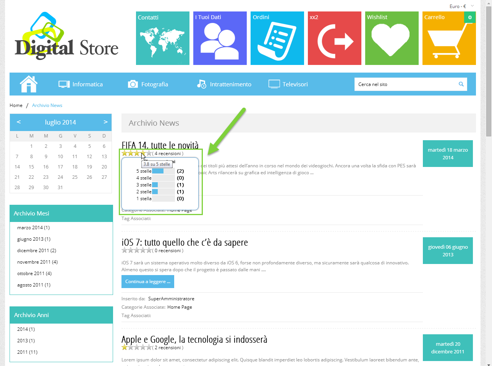{width="6.292361111111111in"
height="0.22083333333333333in"}

Questo tipo di utenti altro non sono se non gli **Agenti Mexal**
correttamente esportati e gestiti anche all'interno del sito. Ogni
Agente autenticandosi **verrà sempre ricondotto all'Area Riservata** e
avrà quindi sempre la possibilità di sfruttare tutte le potenzialità di
questa particolare sezione del sito web

Inoltre le funzionalità messe a disposizione all'interno dell'Area
Riservata, potranno variare in relazione al fatto che l'accesso a questa
specifica area avvenga da parte di un utente di tipo "Cliente" oppure da
parte di un utente di tipo "Agente".

**NOTA BENE:** per maggiori informazioni relativamente alle funzionalità
messe a diposizione dall'Area Riservata in relazione anche alla
tipologia di utente che effettua l'accesso si veda anche il successivo
capitolo "Utenti Area Riservata" di questo manuale

- **in giallo** gli utenti di tipo **"Contatto"**

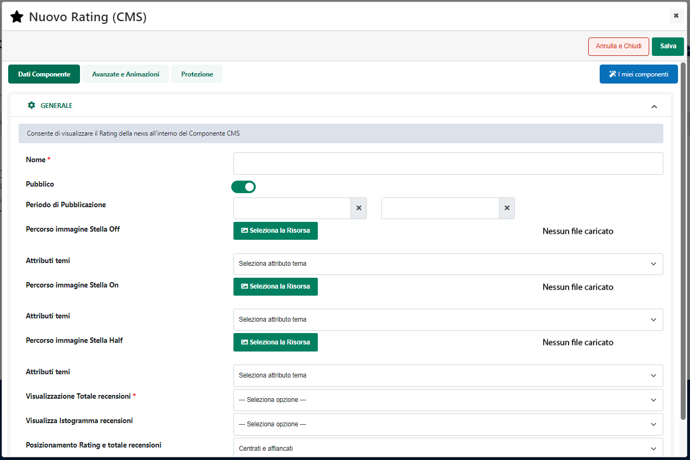{width="6.285416666666666in"
height="0.21458333333333332in"}

Questa tipologia rappresenta i nuovi utenti del sito E-commerce, ossia
quei clienti che hanno effettuato una nuova registrazione senza però
effettuare ancora degli ordini. Un utente di tipo "**Contatto**" dopo
aver effettuato la registrazione sarà immediatamente in grado di
autenticarsi sul sito ed effettuare così nuovi ordini.

**NOTA BENE:** l'Amministratore del sito avrà comunque sempre la
possibilità di bloccare, temporaneamente, l'Accesso al sito (con la
conseguente impossibilità di effettuare nuovi ordini) sia agli utenti di
tipo "Cliente" che agli utenti di tipo "Contatto".

Dipendentemente poi dalla particolare modalità di attivazione dei nuovi
utenti impostata all'interno del proprio sito (si vedano in questo senso
le diverse possibilità offerte dal parametro "**Attivazione Utenti**"
presente alla pagina "Utenti - Gestione Parametri Utenti Ecommerce --
Configurazione Utenti" del Wizard), oltre agli utenti di tipo Contatto,
potranno comparire in elenco (sempre evidenziati in giallo ma con testo
in grassetto e corsivo) anche utenti di tipo **"Contatto Non Attivo"**
oppure di tipo **"Contatto Non Verificato"**

In questo senso utenti di tipo "**Contatto Non Attivo**"
rappresenteranno quei clienti che hanno appena effettuato una nuova
registrazione, ma che non sono ancora stati abilitati
dall'Amministratore del sito e che non avranno quindi, attualmente, la
possibilità di autenticarsi e di effettuare ordini sul sito.

**NOTA BENE:** utenti di tipo "Contatto Non Attivo" potranno essere
presenti in elenco solo nel caso in cui per l'attivazione dei nuovi
utenti sia stata impostata una gestione "Differita".

Utenti di tipo "**Contatto Non verificato**" rappresenteranno invece
quei clienti che hanno effettuato correttamente la registrazione sul
sito ma che non hanno ancora verificato il proprio indirizzo mail e che
non hanno ancora completato, dunque, la procedura di attivazione del
proprio account. Come nel caso precedente anche questa tipologia di
utenti non avranno ancora la possibilità di autenticarsi e di effettuare
ordini all'interno del sito.

**NOTA BENE:** utenti di tipo "Contatto Non Verificato" potranno essere
presenti in elenco solo nel caso in cui per l'attivazione dei nuovi
utenti sia stata impostata la modalità di gestione che prevede
l'attivazione dell'account solo ed esclusivamente previa verifica
dell'indirizzo mail inserito in fase di registrazione.

Per maggiori informazioni relativamente alla diverse possibilità di
attivazione dei nuovi utenti e al passaggio di stato da "Contatto Non
Attivo" o da "Contatto Non Verificato" a "Contatto" si veda anche la
sezione "Utenti - Gestione Parametri Utenti Ecommerce -- Configurazione
Utenti" di questo manuale.

Oltre alle diverse tipologia di utenza fin qui esaminate, ogni utente (a
parte ovviamente quelli di tipologia Agente) potrà anche essere marcato
o meno come utente di tipo **"Ospite"** dipendentemente dal fatto di
aver effettuato la registrazione al sito o di aver completato un ordine
in modalità Guest:

Nello specifico, verranno identificati come Ospiti, e marcati mediante
la relativa etichetta all'interno dell'omonima colonna della tabella
"Lista Utenti", quegli utenti che hanno utilizzato il modulo di One Step
Checkout per completare un ordine in modalità Guest decidendo cioè di
non creare un loro account di accesso al sito.

Pur avendo quindi una loro anagrafica, tali utenti non potranno in alcun
modo accedere al sito per visualizzare lo stato e/o lo storico dei
propri ordini.

Per maggiori informazioni relativamente al modulo di "One Step Checkout"
si veda anche l'apposita sezione di questo manuale ("*Varianti
Responsive -- Lista Componenti Ecommerce -- Componente Ordine Custom
(Checkout) -- One Step Checkout*")

##### GESTIONE UTENTI

I pulsanti presenti nella barra degli strumenti della maschera "Lista
Utenti" consentono rispettivamente di:

**Importazione Dati Utente**
({width="0.8506944444444444in"
height="0.1951388888888889in"} ): consente di gestire in maniera
massiva, mediante l'upload di un apposito file csv, determinati dati
degli utenti attualmente presenti all'interno del proprio sito Passweb.

**ATTENZIONE!** per ovvie ragioni non potranno essere gestiti in maniera
massiva dati personali degli utenti quali Nome, Cognome, Codice Fiscale
ecc...

Cliccando su questo pulsante verrà visualizzata la maschera **"File Dati
Utenti"** mediante la quale poter effettuare l'upload del file
contenente le informazioni desiderate.

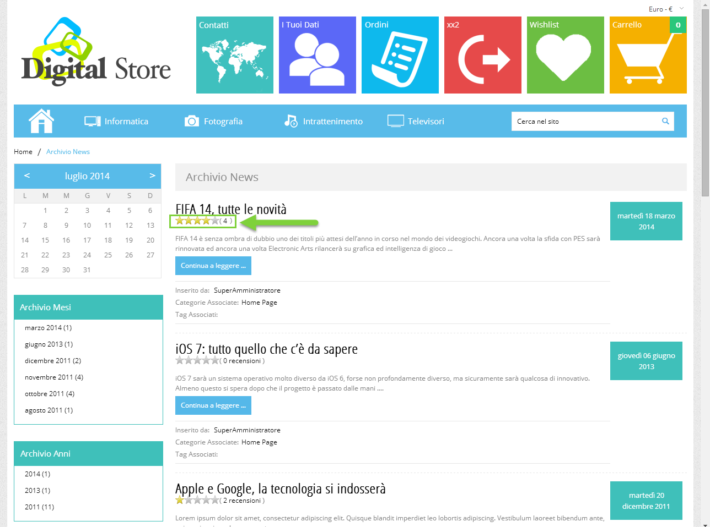{width="5.207638888888889in"
height="3.4868055555555557in"}

Nello specifico all'interno di questa sezione sarà necessario indicare:

- **File (csv-txt):** consente di selezionare il file txt o csv da
  uplodare e contenente i dati da associare ai vari utenti gestiti
  all'interno del sito

- **Lingua**: consente di indicare la lingua del sito a cui dovranno
  fare riferimento i dati presenti all'interno del file di importazione

- **Separatore**: consente di indicare, selezionandolo, dall'apposito
  menu a tendina, il carattere che è stato utilizzato all'interno del
  file di importazione come separatore per i vari campi

Affinchè la procedura di import possa funzionare in maniera corretta e i
dati contenuti nel file possano essere associati ai relativi utenti,
dovranno essere rispettate determinate regole. Nello specifico

- Prima di avviare la procedura di import dovranno già essere stati
  creati all'interno di Passweb, eventuali attributi utente da
  valorizzare attraverso la procedura in esame

- Il file da importare deve avere estensione .csv o .txt

- Il carattere separatore dei vari campi deve essere esattamente quello
  indicato all'interno del campo "**Separatore**" presente nel form di
  importazione.

- L'intestazione, ossia la prima riga del file, deve necessariamente
  contenere l'elenco dei nomi dei campi che dovranno poi essere
  valorizzati con i dati presenti all'interno del file stesso.

- Il primo campo deli file, **obbligatorio e utilizzato come chiave**,
  dovrà essere **l'identificativo Passweb** **del relativo utente**,
  dato questo reperibile in corrispondenza della colonna ID della
  maschera "**Lista Utenti**" del Wizard oppure all'interno del relativo
  campo presente nel file di esportazione dei dati utente

> **NOTA BENE:** se all'interno del file da importare non è presente
> l'identificativo utente passweb e/o se tale valore non corrisponde a
> quello di un utente effettivamente gestito all'interno del proprio
> sito la procedura di import non valorizzerà, ovviamente, alcun campo

- **Il file di importazione deve soddisfare le specifiche del formato
  RFC4180**

> **ATTENZIONE!** In questo senso è quindi necessario che il valore dei
> campi contenenti interruzioni di riga, e/o lo stesso carattere
> utilizzato anche come separatore sia necessariamente racchiuso tra
> virgolette.
>
> Inoltre nel caso in cui il valore di un campo abbia al suo interno
> elementi racchiusi da doppi apici (come potrebbe ad esempio avvenire
> nel caso di codice HTML) sarà necessario racchiudere tra virgolette
> oltre all'intero campo anche questi stessi elementi.

- E' necessario creare file distinti per le diverse lingue gestite
  all'interno del sito. In fase di importazione sarà poi possibile, come
  visto, indicare la specifica lingua cui il file fa riferimento

Di seguito viene indicato l'elenco dei campi utente che potranno essere
inseriti all'interno del file csv e che potranno quindi essere
valorizzati in maniera massiva mediante la procedura in esame:

- **id**: identificativo dell\'utente reperibile in corrispondenza della
  colonna ID della maschera "**Lista Utenti**" del Wizard oppure
  all'interno del relativo campo presente nel file di esportazione dei
  dati utente

> **ATTENZIONE! il campo id è obbligatorio e verrà utilizzato come campo
> chiave**

- **isBloccato**: corrispondente al parametro "**Blocca accesso al
  login**". Consente di indicare se il relativo utente potrà o meno
  effettuare l'autenticazione al sito

> Il campo è un booleano e ammette i seguenti valori:

- **SI 🡪** L'utente può effettuare il login al sito

- **NO 🡪** L'utente non può effettuare il login al sito

<!-- -->

- **bloccoOrdine**: corrispondente al parametro "**Blocco Ordine**"
  **disponibile solo per i siti collegati ad uno dei gestionali
  Ho.ReCa**. Consente di indicare se il relativo utente potrà o meno
  effettuare nuovi ordini.

> Il campo è un booleano e ammette i seguenti valori:

- **SI 🡪** L'utente può effettuare nuovi ordini

- **NO 🡪** L'utente non può effettuare nuovi ordini

<!-- -->

- **listino**: corrispondente al campo "**Listino**" presente nella
  sezione "**Condizioni Commerciali**" dell'anagrafica Passweb del
  relativo utente

> Consente di indicare **il nome del listino** da associare al relativo
> utente
>
> **ATTENZIONE!** il campo in esame verrà considerato e potrà quindi
> essere valorizzato solo per utenti di tipo **Contatto**.

- **pcasi**: corrispondente al campo "**Aliquota IVA (VAT)**" presente
  nella sezione "**Condizioni Commerciali**" dell'anagrafica Passweb del
  relativo utente

> Consente di indicare **l'aliquota iva** da impostare per il relativo
> utente
>
> **ATTENZIONE!** il campo in esame verrà considerato e potrà quindi
> essere valorizzato solo per utenti di tipo **Contatto**.

- **minimoOrdine**: corrispondente al campo "**Minimo d'Ordine**"
  presente nella sezione "**Condizioni Commerciali**" dell'anagrafica
  Passweb del relativo utente

> Consente di impostare il minimo d'ordine da applicare al relativo
> utente.
>
> **ATTENZIONE!** il campo in esame verrà considerato e potrà quindi
> essere valorizzato solo per utenti di tipo **Contatto**.

- **pagamento**: corrispondente al campo "**Pagamento Abituale**"
  presente nella sezione "**Condizioni Commerciali**" dell'anagrafica
  Passweb del relativo utente

> Consente di indicare il nome del pagamento da applicare al relativo
> utente.
>
> **ATTENZIONE!** il campo in esame verrà considerato e potrà quindi
> essere valorizzato solo per utenti di tipo **Contatto**.

- **categoriaStatisticheCliente**: corrispondente al campo "**Categoria
  Statistica**" presente nella sezione "**Condizioni Commerciali**"
  dell'anagrafica Passweb del relativo utente. D**isponibile solo per i
  siti collegati a Mexal**

> Consente di indicare il nome della categoria statistica da associare
> al relativo cliente
>
> **ATTENZIONE!** il campo in esame verrà considerato e potrà quindi
> essere valorizzato solo per utenti di tipo **Contatto**.

- **zoneCliente**: corrisponde al campo "**Zona**" presente nella
  sezione "**Condizioni Commerciali**" dell'anagrafica Passweb del
  relativo utente **Disponibile solo per i siti collegati a Mexal**

> Consente di indicare il nome della zona da associare al relativo
> cliente.
>
> **ATTENZIONE!** il campo in esame verrà considerato e potrà quindi
> essere valorizzato solo per utenti di tipo **Contatto**.

- **sconto**: corrisponde al campo "**Sconto Incondizionato**" presente
  nella sezione "**Condizioni Commerciali**" dell'anagrafica Passweb del
  relativo utente. **Disponibile solo per i siti collegati a Mexal**

> Consente di indicare lo sconto incondizionato da applicare al relativo
> utente.
>
> **ATTENZIONE!** il campo in esame verrà considerato e potrà quindi
> essere valorizzato solo per utenti di tipo **Contatto**.

- **categorieScontoCliente**: corrisponde al campo "**Categoria
  Sconto**" presente nella sezione "**Condizioni Commerciali**"
  dell'anagrafica Passweb del relativo utente. **Disponibile solo per i
  siti collegati a Mexal**

> Consente di indicare il nome della categoria sconto da applicare al
> relativo utente.
>
> **ATTENZIONE!** il campo in esame verrà considerato e potrà quindi
> essere valorizzato solo per utenti di tipo **Contatto**.

- **agente**: corrisponde al campo "**Agente**" presente nella sezione
  "**Condizioni Commerciali**" dell'anagrafica Passweb del relativo
  utente. **Disponibile solo per i siti collegati a Mexal**

> Consente di indicare il codice conto dell'agente da associare al
> relativo utente.
>
> **ATTENZIONE!** il campo in esame verrà considerato e potrà quindi
> essere valorizzato solo per utenti di tipo **Contatto**.

- **categorieProvvigioniCliente**: corrisponde al campo "**Categoria
  Provvigioni**" presente nella sezione "**Condizioni Commerciali**"
  dell'anagrafica Passweb del relativo utente. **Disponibile solo per i
  siti collegati a Mexal**

> Consente di indicare il nome della categoria provvigione cliente da
> applicare al relativo utente.
>
> **ATTENZIONE!** il campo in esame verrà considerato e potrà quindi
> essere valorizzato solo per utenti di tipo **Contatto**.

- **\<nome_attributo\>**: consente di indicare il valore da impostare
  per l'attributo utente indicato

La procedura di importazione dei dati verrà effettuata in maniera
asincrona per cui dopo aver indicato il file da caricare ed aver
cliccato sul pulsante "Salva" sarà possibile uscire dalla maschera senza
attendere necessariamente il termine del processo.

Al termine della procedura verrà inviata una mail di notifica, con il
relativo esito, all'indirizzo impostato nella sezione "**Posta/SMS**"
del Wizard. Tale mail potrà anche essere visionata alla sezione "**Log
Mail**" del Wizard filtrando per tipo "**Mail di Importazione Dati
Utenti**"

**Esportazione Utenti**
({width="0.7208333333333333in"
height="0.2013888888888889in"} ): consente di esportare **in formato
csv** l'elenco di tutti gli utenti attualmente presenti all'interno del
proprio sito.

Cliccando su questo pulsante verrà visualizzata la maschera
"**Esportazione Utenti**" all'interno della quale poter configurare
l'esportazione dei dati.

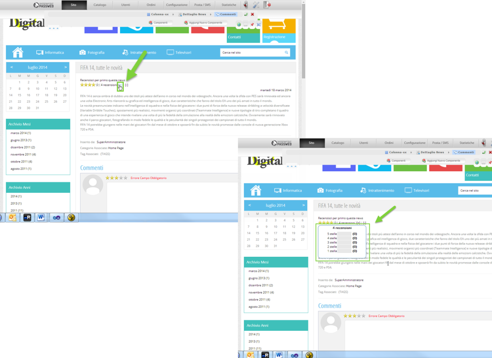{width="5.584722222222222in"
height="3.441666666666667in"}

E' possibile impostare (campo **Separatore**) il carattere che dovrà
essere utilizzato nel file di esportazione come separatore dei vari
campi , un filtro sulla base del quale selezionare gli utenti che
dovranno essere esportati (sezione **Filtro**) e, soprattutto, è
possibile indicare esattamente quali campi (e conseguentemente che tipo
di informazioni) dovranno essere esportati per ogni singolo utente
(sezione **Campi**).

**NOTA BENE:** Per maggiori informazioni relativamente alla creazione di
un Filtro Utenti si rimanda alla sezione "Utenti -- Gruppi Utenti Sito
-- Filtri Utente e Filtri Articolo -- Filtri Utente" di questo manuale.

E' possibile esportare informazioni relative sia all'anagrafica
dell'utente (campi del gestionale e/o attributi utente) che alle sue
condizioni commerciali.

In questo senso è sufficiente selezionare i campi desiderati tra quelli
presenti nel riquadro sinistro ed inserirli in quello destro cliccando
sul pulsante raffigurante una piccola freccia verde rivolta verso
destra.

Allo stesso modo per eliminare uno specifico campo dal file di
esportazione, è sufficiente selezionarlo dal riquadro destro e cliccare
sul pulsante raffigurante una piccola freccia rossa rivolta verso
sinistra.

I pulsanti raffiguranti due piccole frecce rivolte verso l'alto e verso
il basso permettono infine di variare l'ordinamento dei campi e
conseguentemente delle informazioni che dovranno essere esportate.

**ATTENZIONE!** Nel caso in cui tra i campi selezionati siano presenti
anche degli attributi di tipo "File", in fase di esportazione dati verrà
generato uno zip contenente, oltre al file csv, anche tutti i vari file
relativi agli utenti oggetto dell'esportazione.

**Elimina Utente**
({width="0.5652777777777778in"
height="0.2076388888888889in"} ): consente di eliminare, dal database di
Passweb, gli utenti attualmente selezionati in elenco

**ATTENZIONE! La corretta procedura di eliminazione di un utente dal
sito è quella che prevede di agire direttamente all'interno del
gestionale impostando l'anagrafica del cliente in modo tale che non
venga più esportato e gestito all'interno del sito.**

Nel caso in cui si dovesse comunque decidere di procedere
all'eliminazione tramite questo pulsante, sarà poi necessario
intervenire anche lato gestionale ; in caso contrario lo specifico
utente potrebbe comunque essere riesportato a seguito di una futura
sincronizzazione.

Eliminando un utente dal sito (mediante il pulsante "Elimina Utente" o,
in maniera più corretta, operando per questo direttamente all'interno
del gestionale) verranno automaticamente eliminate anche tutte le
cartelle presenti in Area Riservata (sezione Documenti) create da quello
stesso utente, **che non risultano essere legate ad altri gruppi e che
non hanno file al loro interno**.

Per maggiori informazioni relativamente alle diverse sezioni e
funzionalità dell'Area Riservata si veda anche la sezione *"Business to
Business Area Riservata"* di questo manuale.

**ATTENZIONE!** Eventuali cartelle legate ad utenti eliminati dal sito
che, per qualche ragione, non possono essere eliminate contestualmente
all'eliminazione dell'utente potranno essere gestite all'interno della
sezione "**Cartelle Non Assegnate**" del Wizard

**Modifica Utente** (
{width="0.5972222222222222in"
height="0.18819444444444444in"} ): consente di accedere all'anagrafica
Passweb dell'utente attualmente selezionato in elenco in maniera tale da
poterne visualizzare e, nel caso, anche modificare i relativi dati.

Per maggiori informazioni in merito si vedano anche i successivi
capitoli di questo manuale

**Converti Contatto in Cliente** (
{width="0.9743055555555555in"
height="0.18819444444444444in"} ): visibile solo nel caso in cui
l'utente selezionato in elenco sia un utente di tipo "**Contatto**".

Consente di convertire il contatto attualmente selezionato in cliente.
Al termine della conversione verrà effettuata automaticamente una
sincronizzazione parziale in maniera tale da inserire, anche lato
gestionale, il cliente appena convertito.

Tale opzione consente quindi di inserire manualmente all'interno delle
anagrafiche del gestionale, codificandoli come clienti, utenti del sito
che pur essendosi registrati non hanno ancora effettuato il primo ordine
e può rivelarsi particolarmente utile nel caso in cui, ad esempio, la
necessità dovesse essere quella di assegnare al nuovo utente, lato
gestionale, specifiche condizioni commerciali ancor prima che questo
abbia effettuato il suo primo ordine.

###### ANAGRAFICA PASSWEB -- INFORMAZIONI GENERALI

La sezione "**Informazioni Generali**" presente all'interno della
maschera "**Dati Utente"** consente di visualizzare e gestire i
principali dati anagrafici dell'utente in esame,

{width="5.8180555555555555in"
height="4.50625in"}

**ATTENZIONE!** I dati presenti all'interno di questa maschera possono
variare a seconda della particolare tipologia di utenza considerata e,
nella maggior parte dei casi sono direttamente collegati ai relativi
campi dell'Anagrafica Utente del gestionale.

In conseguenza di ciò **eventuali modifiche apportate alle informazioni
presenti all'interno di questa sezione verranno inserite, durante la
prima sincronizzazione utile, sul gestionale andando quindi a
sovrascrivere eventuali informazioni già presenti nella relativa
anagrafica.**

Queste stesse informazioni potranno essere variate, non solo
dall'amministratore del sito ma anche dal cliente stesso agendo per
questo direttamente dalla pagina "Profilo Utente" del sito e, anche in
tal caso, le nuove informazioni verranno inserite lato gestionale
durante la prima sincronizzazione utile.

**Non è ovviamente possibile modificare da questa sezione del Wizard le
credenziali di accesso (login e password) inserite dall'utente in fase
di registrazione. Tali dati potranno essere variati solo ed
esclusivamente dall'utente stesso all'interno della pagina "Profilo
Utente"**

Oltre ai campi prettamente anagrafici (Nome, Cognome, Email, Codice
Fiscale ecc...) possiamo trovare anche altri parametri di fondamentale
importanza come ad esempio:

- **Tipologia Utente**: consente di visualizzare la tipologia
  dell'utente in esame.

> Generalmente è un campo in sola lettura, nel caso in cui l'utente in
> esame dovesse essere però di tipo "**Contatto non attivo**" il campo
> diventerà una combo box e l'amministratore avrà la possibilità di
> variare tale tipologia portandola da "Contatto non attivo" a
> "Contatto".
>
> **ATTENZIONE!** Effettuando il passaggio da "Contatto non attivo" a
> "Contatto", al salvataggio della maschera verrà inviata anche la mail
> di attivazione utente.
>
> Per maggiori informazioni in merito alle diverse possibili tipologie
> di utenti si veda anche il precedente capitolo ("*Utenti -- Tipologia
> Utenti*") di questo manuale.
>
> **ATTENZIONE!** la tipologia utente verrà utilizzata anche come classe
> CSS assegnata al tag body della pagina nel momento in cui un
> determinato utente dovesse effettuare l'autenticazione al sito
>
> Grazie a queste classi, volendo, sarà quindi possibile applicare
> determinate regole CSS in base alla specifica tipologia di utenza
> attualmente loggata sul sito.
>
> Nello specifico verranno gestite le seguenti classi CSS:

- **cliente**: assegnata al tag body nel momento in cui l'utente loggato
  sul sito dovesse essere un **utente di tipo Cliente** (non abilitato
  ad accedere in area riservata)

- **privato**: assegnata al tag body nel momento in cui l'utente loggato
  sul sito dovesse essere un **utente di tipo Cliente Privato**

- **clienteareariservata**: assegnata al tag body nel momento in cui
  l'utente loggato sul sito dovesse essere **un utente di tipo Cliente
  abilitato ad accedere in Area Riservata**

- **contatto**: assegnata al tag body nel momento in cui l'utente
  loggato sul sito dovesse essere un **utente di tipo Contatto**

- **azienda**: assegnata al tag body nel momento in cui l'utente loggato
  sul sito dovesse essere un **utente di tipo Cliente Azienda**

- **agente**: assegnata al tag body nel momento in cui l'utente loggato
  sul sito dovesse essere un **Agente**

- **agentecliente:** assegnata al tag body nel momento in cui l'utente
  loggato sul sito dovesse essere un Agente che impersonifica un
  determinato cliente

<!-- -->

- **Privato**: consente di verificare se l'utente in esame è un utente
  Privato (check selezionato) o Azienda (check non selezionato).

> **ATTENZIONE!** variando la tipologia utente da Privato ad Azienda (e
> viceversa) cambieranno anche i dati richiesti dalla relativa
> anagrafica. Per un utente di tipo privato sono richiesti, ad esempio,
> nome e cognome mentre per un utente di tipo Azienda sono richiesti
> Ragione Sociale e Partita IVA.
>
> Oltre a ciò occorre considerare che passando da Privato ad Azienda
> potrebbe variare anche la tipologia di documenti generati (OC
> piuttosto che OX) per l'utente in esame con tutto ciò che ne consegue.

- **Persona Fisica**: consente di verificare se l'utente di tipo Azienda
  è da considerarsi come una persona fisica o come una persona giuridica
  (ditta individuale)

- **Ente Pubblico**: consente di verificare se l'utente in esame è o
  meno un "Ente Pubblico".

> Come per il parametro "Privato" anche in questo caso modificando il
> valore assegnato a questo campo cambieranno i dati richiesti dalla
> relativa anagrafica, soprattutto in termini di fatturazione
> elettronica. Per un ente pubblico è richiesto infatti il "**Codice
> Ufficio PA**" mentre per utenti che non sono enti pubblici è richiesto
> il "**Codice Destinatario SDI**"

- **Iscrizione VIES**: consente di visualizzare lo stato di iscrizione
  al VIES per l'azienda in esame.

- **Dettaglio Risposta VIES**: consente di visualizzare il dettaglio
  dell'ultima risposta ottenuta da Passweb a seguito delle richieste
  effettuate ai servizi esposti dal VIES per determinare se l'azienda in
  esame risulta essere o meno iscritta al sistema. Tale campo potrebbe
  risultare particolarmente utile nel momento le richieste effettuate da
  Passweb dovessero ritornare degli errori per visualizzare che tipo di
  errore si è verificato e perché quindi la richiesta effettuata non ha
  ottenuto una risposta valida

> **ATTENZIONE!** ovviamente i due campi in esame saranno eventualmente
> valorizzati solo per utenti di tipo Azienda
>
> Per maggiori informazioni relativamente alla procedura di verifica per
> l'iscrizione al VIES si veda quanto indicato all'interno del capitolo
> "*Ordini -- Tasse -- Verifica Iscrizione al VIES*" di questo manuale

- **Fattura Elettronica**: permette di capire se il cliente in esame è o
  meno soggetto, sulla base delle impostazione del sito e dei dati da
  lui stesso inseriti in fase di registrazione, alla fatturazione
  elettronica

> **ATTENZIONE!** eventuali modifiche apportate a questo parametro
> verranno inserite, in fase di sincronizzazione, all'interno del
> gestionale modificando quindi le condizioni di fatturazione in essere
> per il cliente in esame.

- **Consenso alla Privacy / Data Consenso alla Privacy:** campi non
  modificabili. Sono utilizzati per memorizzare le informazioni relative
  all'accettazione, da parte dell'utente, delle condizioni di
  registrazione al sito, accettazione questa obbligatoria ai fini della
  registrazione stessa.

- **OPT OUT Telegram --** Campo non modificabile collegato al modulo per
  l'integrazione tra Passweb e Telegram.

> Consente di visualizzare lo stato dell'utente in merito all'opzione di
> Opt Out per Telegram
>
> Per maggiori informazioni in merito si veda quanto indicato
> all'interno del relativo capitolo ("*Passweb e Telegram -- Privacy e
> GDPR*") di questo manuale

- **OPT OUT Whatsapp --** Campo non modificabile collegato al modulo per
  l'integrazione tra Passweb e WA Smart Business.

> Consente di visualizzare lo stato dell'utente in merito all'opzione di
> Opt Out per Whatsapp gestito mediante la piattaforma di WA Smart
> Business
>
> Per maggiori informazioni in merito si veda quanto indicato
> all'interno del relativo capitolo ("*Passweb e WA Smart Business --
> Privacy e GDPR*") di questo manuale

- **Utente Guest:** campo non modificabile. Consente di verificare se
  l'anagrafica in esame è riferita ad un utente "Guest", ossia ad un
  utente che ha effettuato un acquisto sul sito in modalità "Ospite",
  oppure se è riferita ad un utente che si è regolarmente registrato
  all'interno del sito.

<!-- -->

- **Blocca accesso al Login:** consente, se selezionato, di bloccare
  manualmente l'accesso al sito (e conseguentemente anche all' Area
  Riservata) impedendo così all'utente di effettuare nuovi ordini.

> **ATTENZIONE:** il parametro "Blocca Accesso al Login" non compare,
> ovviamente, per gli utenti di tipo "Contatto Non Attivo".
>
> Nel caso in cui si voglia impedire ad un cliente l'accesso alla sola
> Area Riservata del sito E-commerce, mantenendo comunque per esso la
> possibilità di effettuare ordini, sarà necessario:

- per i **siti Ecommerce collegati a Mexal** agire direttamente
  all'interno del gestionale impostando per lo specifico cliente **il
  campo Passweb "Abil. Area Riservata" sul valore N**.

- per i **siti Ecommerce collegati ad uno dei gestionali Ho.Re.Ca.**
  agire dal parametro **Tipologia Cliente** impostandolo, ovviamente,
  sul valore "**Cliente**".

> Infine, nel caso in cui l'esigenza dovesse essere quella di permettere
> allo specifico utente di effettuare l'autenticazione al sito, ed
> eventualmente anche l'accesso in Area Riservata, bloccandogli però la
> possibilità di effettuare nuovi ordini sarà necessario

- per i **siti Ecommerce collegati a Mexal** agire direttamente
  all'interno del gestionale impostando per lo specifico cliente **il
  campo Passweb "Blocco Ordine" sul valore N**.

- per i **siti Ecommerce collegati ad uno dei gestionali Ho.Re.Ca.**
  agire direttamente dall' Anagrafica Passweb dello specifico cliente
  selezionando il parametro **"Blocco Ordine"**.

<!-- -->

- **Numero di Tentativi Password**: consente di visualizzare il numero
  di tentativi errati di inserimento Password effettuati dall'utente in
  esame.

> **ATTENZIONE!** Al raggiungimento di un determinato numero di
> tentativi errati l'utenza potrebbe essere bloccata in automatico
> dall'applicazione (dipendentemente da quanto impostato per il
> parametro "**Numero di Tentativi Password**" in "*Configurazione
> Parametri degli Utenti -- Impostazioni Generali*" del Wizard) . **In
> queste condizioni per sbloccare l'utenza sarà necessario impostare il
> campo in esame sul valore 0**
>
> Per maggiori informazioni in merito al numero massimo di volte in cui
> un utente potrà sbagliare ad inserire la propria password di accesso
> al sito prima che la sua utenza venga bloccata in automatico
> dall'applicazione si veda anche il relativo capitolo di questo manuale
> ("*Utenti -- Siti Ecommerce -- Utenti Sito -- Utenti -- Gestione
> Utenti*")

**ATTENZIONE! Per utenti di tipo Agente (Ecommerce Mexal) i campi
anagrafici presenti all'interno di questa sezione sono campi in sola
lettura.**

Non è quindi possibile modificare i dati anagrafici di un Agente
operando all'interno del Wizard di Passweb. Eventuali variazioni in
questo senso dovranno essere apportate direttamente all'interno della
relativa anagrafica Mexal.

###### ANAGRAFICA PASSWEB -- INDIRIZZI DI SPEDIZIONE

La sezione "**Indirizzi di Spedizione**" presente all'interno della
maschera "**Dati Utente"** e **visibile solo ed esclusivamente per
utenti di tipo Cliente o Contatto,** consente di visualizzare e gestire
tutti gli indirizzi di spedizione dell'utente in esame.

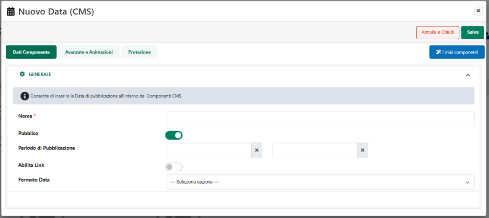{width="5.792361111111111in"
height="3.422222222222222in"}

Nella parte sinistra è visualizzato l'elenco di tutti gli indirizzi di
spedizione attualmente associati all'utente.

Nello specifico, **l'indirizzo evidenziato in grassetto** corrisponde
**all'indirizzo primario** dell'utente (quello presente anche nella sua
anagrafica gestionale), tutti gli altri sono invece **indirizzi
secondari di spedizione**, indirizzi questi che per i siti collegati a
Mexal verranno poi memorizzati nella relativa **"Anagrafica degli
indirizzi di spedizione"** mentre per i siti collegati ad uno dei
gestionali Ho.Re.Ca. resteranno memorizzati nel database di Passweb per
essere poi inseriti nel piede dei documenti gestionali che ne faranno
uso

Selezionando uno degli indirizzi presenti in elenco verrà immediatamente
visualizzata, nella parte destra, la maschera "**Modifica Indirizzo**"
mediante la quale poterne modificare i dati.

**ATTENZIONE!** relativamente all'indirizzo primario non verrà
visualizzato il campo "**Referente**" essendo questa informazione
propria solo ed esclusivamente di eventuali indirizzi secondari di
spedizione.

Ovviamente anche queste informazioni potranno essere variate, non solo
dall'amministratore del sito ma anche dal cliente stesso agendo per
questo direttamente dalla pagina "**Profilo Utente**" del sito (posto
che all'interno di questa pagina sia stato inserito il componente
"**Rubrica Indirizzi**"). In entrambi i casi le nuove informazioni
verranno inserite lato gestionale durante la prima sincronizzazione
utile.

###### ANAGRAFICA PASSWEB -- CONDIZIONI COMMERCIALI

Al pari della sezione relativa agli indirizzi di spedizione, anche
quella relativa alle "**Condizioni Commerciali**" sarà visibile solo per
utenti di tipo Cliente o Contatto.

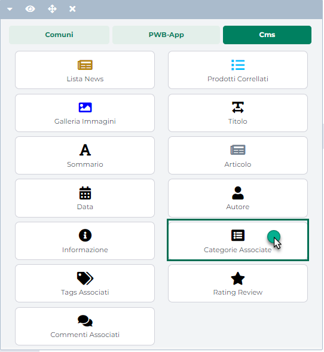{width="5.792361111111111in"
height="3.422222222222222in"}

In particolare poi

- Per **utenti di tipo Cliente**, la cui anagrafica è già stata inserita
  all'interno del gestionale, i campi presenti all'interno di questa
  sezione saranno essenzialmente campi **in sola lettura**.

> L'unica eccezione in questo senso è rappresentata dal parametro
> "**Minimo d'ordine**" per i **siti collegati ad uno dei gestionali
> Ho.Re.Ca.**. Per questa tipologia di siti infatti il campo in oggetto
> sarà abilitato anche in scrittura essendo questa una funzionalità la
> cui gestione è demandata interamente a Passweb
>
> **ATTENZIONE! Non è possibile modificare le condizioni commerciali di
> un utente di tipo Cliente agendo all'interno del Wizard di Passweb.
> Eventuali modifiche in tal senso dovranno essere quindi apportate
> necessariamente all'interno dei relativi campi del gestionale.**

- Per **utenti di tipo Contatto** alcune delle informazioni presenti
  all'interno di questa sezione sono ancora perfettamente modificabili.

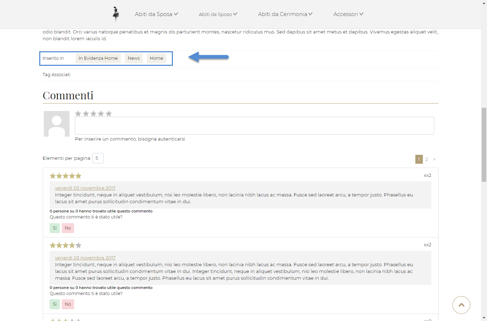{width="5.513194444444444in"
height="3.4479166666666665in"}

In quest'ultimo caso infatti l'anagrafica dell'utente non è ancora stata
inserita sul gestionale per cui il campo:

- **Listino:** consente associare all'utente in esame uno specifico
  Listino, selezionandolo per questo tra i Listini Mexal attualmente
  disponibili

- **Categoria Statistica -- solo Ecommerce Mexal:** consente di
  associare all'utente in esame una specifica Categoria Statistica,
  selezionandola tra quelle codificate all'interno del gestionale e
  correttamente esportate anche all'interno del sito web

- **Zona -- solo Ecommerce Mexal:** consente di associare all'utente in
  esame una specifica Zona, selezionandola tra quelle codificate
  all'interno del gestionale e correttamente esportate anche all'interno
  del sito web

- **Aliquota Iva (VAT):** consente di impostare l'aliquota IVA cui dovrà
  essere assoggettato l'utente in esame. È possibile indicare anche una
  delle esenzioni IVA appositamente codificate all'interno del
  gestionale.

> Il menu a tendina presente in corrispondenza di questo campo permette
> di decidere se impostare un "Valore Personalizzato" oppure, nel caso
> di siti Ecommerce collegati a Mexal, una delle esenzioni definite
> all'interno della relativa tabella gestionale:

- **Sconto incondizionato (solo Ecommerce Mexal):** consente di
  impostare per l'utente in esame un ben preciso sconto incondizionato
  che potrà essere definito esattamente allo stesso modo in cui viene
  definito all'interno del gestionale. Sono quindi ammessi sconti in
  percentuale, a valore, e in cascata.

> **ATTENZIONE!** così come avviene all'interno del gestionale, anche in
> questo caso, uno sconto incondizionato ha priorità maggiore rispetto
> ad uno sconto definito da una specifica categoria sconto.

- **Categoria Sconto (solo Ecommerce Mexal):** consente di associare
  all'utente in esame una specifica "**Categoria Sconto**"
  selezionandola tra le categorie sconto Mexal attualmente disponibili.

- **Minimo d'ordine:** consente di impostare un importo minimo al di
  sotto del quale l'utente in esame non potrà completare l'ordine.

> Il valore inizialmente presente all'interno di questo campo può
> derivare direttamente da quanto impostato per l'analogo campo della
> maschera **"Configurazione Parametri Utenti Ecommerce"**

- **Pagamento Abituale:** consente di associare all'utente in esame un
  ben preciso pagamento abituale selezionandolo tra l'elenco dei
  pagamenti attualmente abilitati e quindi effettivamente utilizzabili
  all'interno del sito

- **Agente -- solo Ecommerce Mexal:** consente di associare l'utente in
  esame ad un ben preciso Agente selezionandolo tra quelli attualmente
  esportati e gestiti all'interno del sito.

- **Categoria Provvigioni -- solo Ecommerce Mexal:** consente di
  associare all'utente in esame una specifica Categoria Provvigioni,
  selezionandola tra quelle codificate all'interno del gestionale e
  correttamente esportate anche all'interno del sito web

- **Vettore abituale -- solo Ecommerce Mexal:** campo in sola lettura.
  Consente di visualizzare il vettore abituale dell'utente

- **Valuta abituale -- solo Ecommerce Mexal:** campo in sola lettura.
  Consente di visualizzare la valuta abituale dell'utente

**ATTENZIONE! I campi sopra indicati possono assumere ben precisi valori
di default come conseguenza dell'appartenenza del Contatto stesso ad un
ben preciso gruppo di utenti e delle condizioni commerciali impostate
sul gruppo stesso.**

Per maggiori informazioni in merito alla definizione e alla gestione
delle condizioni commerciali sui gruppi utente si veda anche la sezione
*"Utenti -- Gruppi Utenti Sito"* di questo manuale

In ogni caso è sempre bene ricordare che:

- **Per utenti di tipo contatto le condizioni commerciali definite sull'
  Anagrafica Passweb dell'utente hanno sempre la priorità rispetto a
  condizioni analoghe definite su eventuali gruppi di appartenenza del
  contatto stesso**

- **Per utenti di tipo Cliente valgono sempre e soltanto le condizioni
  commerciali definite per il cliente stesso direttamente all'interno
  del gestionale**.

###### ANAGRAFICA PASSWEB -- GRUPPI

La sezione **"Gruppi",** presente all'interno della maschera "**Dati
Utente"**, consente di gestire l'associazione dell'utente in esame ad
uno dei gruppi attualmente definiti e gestiti all'interno del sito

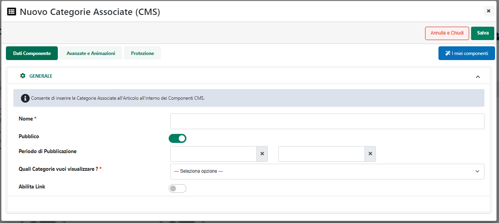{width="5.538888888888889in"
height="3.4090277777777778in"}

**NOTA BENE:** l'associazione "Utente -- Gruppo" è di fondamentale
importanza sia ai fini della comunicazione all'interno dell'area
riservata sia ai fini di eventuali filtri articolo associati allo
specifico gruppo. Per maggiori informazioni si veda anche la sezione
"Gruppi Utenti Sito" di questo manuale.

I campi di ricerca presenti immediatamente al di sopra di entrambi i box
consentono, digitando almeno 3 caratteri, di filtrare gli elementi
presenti nel relativo box.

Per poter associare l'utente in esame a uno o a più gruppi è sufficiente
selezionare il gruppo desiderato dal box di sinistra ed inserirlo nel
box di destra cliccando sul pulsante raffigurante una piccola freccia
rivolta verso sinistra.

Analogamente per eliminare l'associazione di un utente da un gruppo è
sufficiente selezionare il gruppo dal box di destra e cliccare sul
pulsante raffigurante una piccola freccia rossa.

Una volta definite le associazioni Utente -- Gruppo, sarà poi necessario
cliccare sul pulsante **"Salva"**.

###### ANAGRAFICA PASSWEB -- ATTRIBUTI

La sezione "**Attributi**" presente all'interno della maschera "**Dati
Utente"**, consente di visualizzare e/o modificare i vari attributi
utente (Mexal e/o Passweb) codificati all'interno della corrispondente
sezione del Wizard

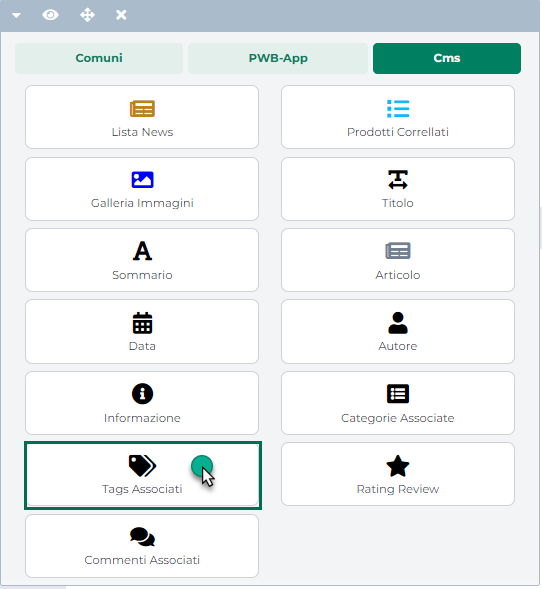{width="5.746527777777778in"
height="3.3895833333333334in"}

**NOTA BENE:** per maggiori informazioni relativamente alla gestione
degli "Attributi Cliente" si veda anche la corrispondente sezione
(Utenti -- Gestione Parametri Utenti Ecommerce -- Gestione Attributi) di
questo manuale.

Nello specifico occorre considerare che:

- Di base, per utenti di tipo Cliente e/o Contatto è possibile
  modificare sia attributi di tipo Passweb che attributi di tipo Mexal

- Per utenti di tipo Agente (Ecommerce Mexal) è invece possibile
  modificare solo ed esclusivamente attributi di tipo Passweb

- I campi relativi all'accettazione o meno delle condizioni opzionali di
  privacy (inserite all'interno del sito nei vari form di registrazione
  e/o profilo utente) **sono campi in sola lettura e non potranno mai,
  per ovvie ragioni, essere modificate dall'amministratore del sito ma
  soltanto dagli stessi utenti agendo direttamente dai relativi moduli
  presenti sul front end del sito stesso.**

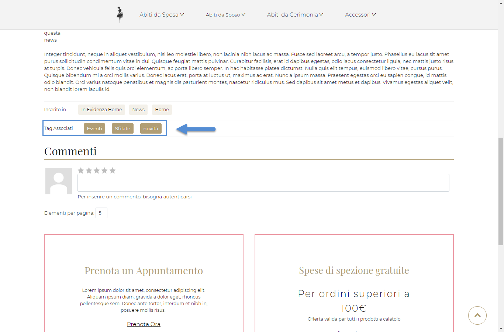{width="5.746527777777778in"
height="3.3895833333333334in"}

> Per maggiori informazioni relativamente alla gestione delle condizioni
> di privacy e trattamento dei dati personali si vedano anche i capitoli
> "*Lista Componenti Interazione Utente -- Componenti Interni ai
> componenti di interazione Utente -- Campo Privacy*"

- I campi relativi ad attributi di tipo File sono campi in sola lettura.
  **Anche in questo caso dunque le informazioni presenti al loro interno
  potranno essere variate soltanto dagli stessi utenti agendo
  direttamente dai relativi moduli presenti sul front end del sito**. In
  questo caso inoltre, cliccando sul nome del file verrà avviato il
  download della relativa risorsa (risorse queste che potranno essere
  scaricate anche mediante un export massivo dei dati utente)

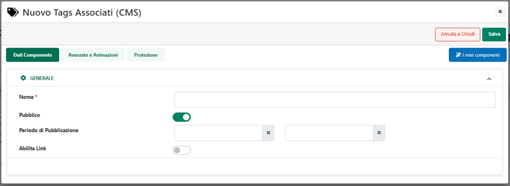{width="5.746527777777778in"
height="3.3895833333333334in"}

