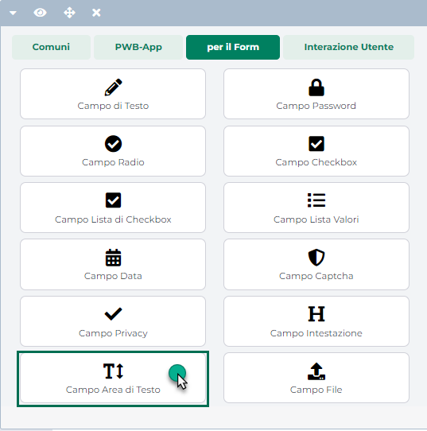

# CONFIGURAZIONE DI UN GRUPPO UTENTI

Come già indicato nel precedente capitolo per creare un nuovo Gruppo
Utenti sarà necessario accedere alla sezione "**Utenti -- Gruppi Utenti
Sito -- Gruppi**" del Wizard e cliccare poi sul pulsante **Nuovo Gruppo
Utenti** (
 ) presente nella relativa barra degli
strumenti.

In questo modo si avrà infatti accesso alla maschera **"Creazione
Gruppo"**

in cui poter definire tutti i parametri di configurazione del Gruppo
Utenti che si intende realizzare.

##### PANNELLO AREA RISERVATA

I parametri presenti all'interno di questo pannello consentono
rispettivamente di:

- **Gestione SMS:** se attivato, consente di abilitare, in Area
  Riservata, gli utenti del gruppo all'invio di SMS per notificare ai
  rispettivi destinatari l'inserimento di un nuovo messaggio, di una
  nuova attività in agenda, ecc...

> **ATTENZIONE!** per poter attivare effettivamente l'invio delle
> notifiche SMS è necessario aver impostato correttamente i parametri di
> configurazione presenti all'interno della sezione "**Configurazione
> SMS**" alla pagina "Account e-mail e SMS" del Wizard (menu "*Posta/SMS
> -- Impostazioni -- Configurazione*")
>
> Per maggiori informazioni in merito all'attivazione dell'account SMS
> si rimanda a quanto indicato nel relativo capitolo di questo manuale
> ("*Parametri Posta /SMS -- Configurazione*")

- **Gestione Telegram --** visualizzato solo nel caso in cui sia stato
  acquistato e correttamente configurato il modulo per l'integrazione
  Passweb -- Telegram

> Se attivato, consente di abilitare, in Area Riservata, gli utenti del
> gruppo all'invio delle notifiche Telegram relativamente
> all'inserimento di un nuovo messaggio, di una nuova attività in
> agenda, ecc...
>
> Per maggiori informazioni in merito all'integrazione Passweb --
> Telegram si rimanda a quanto indicato nel relativo capitolo di questo
> manuale ("*Passweb e Telegram*")

- **Gestione Whatsapp --** visualizzato solo nel caso in cui sia stato
  acquistato e correttamente configurato il modulo per l'integrazione
  Passweb -- WA Smart Business

> Se attivato, consente di abilitare, in Area Riservata, gli utenti del
> gruppo all'invio delle notifiche Whatsapp (tramite piattaforma WA
> Smart Business) relativamente all'inserimento di un nuovo messaggio,
> di una nuova attività in agenda, ecc...
>
> Per maggiori informazioni in merito all'integrazione Passweb -- WA
> Smart Business si rimanda a quanto indicato nel relativo capitolo di
> questo manuale ("*Passweb e WA Smart Business*")

- **Comunicazione interna**: flaggando questo parametro, verrà abilitata
  in Area Riservata la comunicazione tra gli utenti di pari livello. In
  queste condizioni quindi tutti gli utenti appartenenti al gruppo in
  esame potranno comunicare tra loro

- **Comunicazione Utenti Livello Superiore**: flaggando questo
  parametro, verrà abilitata in Area Riservata la possibilità di
  comunicare con i singoli utenti dei gruppi padre (collocati quindi ad
  un livello gerarchico più alto) del gruppo in esame. Nel caso in cui
  tale parametro non venga selezionato, la comunicazione verso l'alto
  potrà essere effettuata a livello di intero gruppo ma non a livello di
  singoli utenti.

- **Mostra Agente Cliente (solo Ecommerce Mexal)**: permette di indicare
  se mostrare o meno in Area Riservata, nella sezione "Clienti", la
  colonna Agente all'interno della quale viene visualizzato l'Agente
  assegnato in Mexal al relativo cliente

**NOTA BENE:** i parametri "Gestione SMS", "Comunicazione interna",
"Comunicazione Livello Superiore" e "Mostra Agente Cliente" non hanno
alcun effetto per utenti non abilitati ad accedere in Area Riservata

##### PANNELLO FILTRI

All'interno di questo pannello è possibile definire e associare al
gruppo che si sta realizzando specifici **filtri articolo** e/o
specifici **filtri utente**

**ATTENZIONE!** per maggiori informazioni in merito alla gestione dei
filtri (articolo e/o utente) si veda il successivo capitolo "Filtri
Utenti e Filtri Articolo" di questo manuale

##### PANNELLO CONDIZIONI COMMERCIALI

Il pannello **"Condizioni Commerciali associate all'utente"** consente
di associare al gruppo che si sta realizzando specifiche condizioni
commerciali a livello di prezzi, assoggettamento iva, sconti ecc...
indicando anche come e quando queste condizioni dovranno essere
applicate

Nello specifico il parametro

**Priorità condizione Commerciale:** consente di associare alle
condizioni commerciali del gruppo in esame una specifica priorità, che
verrà poi presa in considerazione nel caso in cui un utente si ritrovi a
far parte, contemporaneamente, di più gruppi diversi con associate
diverse condizioni commerciali (es. diversi listini e/o diversa
scontistica ...).

**Nel caso in questione (utente appartenete a più gruppi diversi)
verranno applicate le condizioni commerciali del gruppo a priorità più
elevata. Il grado più elevato di priorità è identificato dal numero 1,
seguiranno quindi le condizioni commerciali a priorità 2, 3 ecc...**

**ATTENZIONE!!!** In generale nel caso in cui, per utenti di tipo
Contatto, si decida di modificare le condizioni commerciali dello
specifico utente direttamente dalla sua Anagrafica Passweb, queste
avranno sempre priorità rispetto ad analoghe condizioni definite su
eventuali gruppi di appartenenza.

Per maggiori informazioni relativamente alla gestione delle condizioni
commerciali di un Contatto direttamente dalla sua Anagrafica Passweb si
veda anche il capitolo *"Utenti -- Utenti Sito -- Gestione Utenti"* di
questo manuale.

###### SEZIONE CONDIZIONI

La sezione "**Condizioni**" consente di associare al gruppo in esame
specifiche condizioni relativamente ai prezzi di listino, alle aliquote
iva, ai pagamenti abituali, all'associazione automatica cliente --
agente ecc...

Nello specifico il parametro

**Applicazione Condizioni:** consente di definire quando dovranno essere
applicate le condizioni commerciali definite all'interno della sotto
sezione "Condizioni". È possibile selezionare uno dei seguenti valori:

- **Assegnazione in fase di registrazione:** selezionando questo valore
  le condizioni commerciali definite all'interno di questa sotto sezione
  verranno applicate solo ed esclusivamente in fase di registrazione di
  un nuovo utente.

> In fase di registrazione l'applicazione valuterà quindi se il nuovo
> utente possa o meno rientrare nel gruppo in esame e, in caso positivo
> provvederà ad assegnare a questo stesso utente il Listino, l'aliquota
> IVA, il Pagamento Abituale e l'Agente eventualmente indicati nei
> successivi campi
>
> **Tali valori verranno, inizialmente, memorizzati sul database di
> Passweb, poi nel momento in cui l'utente effettuerà il suo primo
> ordine, contestualmente all'inserimento in Mexal dell'ordine stesso e
> dell'anagrafica del cliente, gli stessi dati verranno inseriti anche
> nei relativi campi Mexal**.
>
> Considerando che, in queste condizioni, l'associazione delle
> condizioni commerciali al relativo cliente avviene solo ed
> esclusivamente in fase di registrazione, è bene ricordare anche che se
> successivamente alla definizione del gruppo e delle relative
> condizioni commerciali si dovesse decidere di modificare le condizioni
> in esame, per le nuove registrazione verranno correttamente
> considerate le nuove condizioni mentre per gli utenti già registrati e
> già appartenenti a questo gruppo continueranno a valere le condizioni
> precedentemente associate al gruppo stesso.

- **Assegnazione in fase di registrazione e profilo:** selezionando
  questo valore le condizioni commerciali definite all'interno di questa
  sotto sezione verranno applicate, come nel caso precedente, in fase di
  registrazione di un nuovo utente ed anche nel caso in cui utenti già
  registrati dovessero apportare al proprio profilo modifiche tali da
  farli rientrare nel gruppo in esame.

> **ATTENZIONE! In questo caso le condizioni associate al Gruppo Utenti
> Passweb, avranno priorità rispetto alle corrispondenti condizioni
> definite lato gestionale**
>
> Supponendo dunque di associare al gruppo in esame, ad esempio, il
> Listino n.2, nel momento in cui per un utente già registrato e magari
> anche già presente nelle anagrafiche gestionali (quindi con le sue
> specifiche condizioni commerciali ed il suo specifico listino)
> dovessero essere effettuate delle modifiche al Profilo (direttamente
> dall'utente stesso attraverso la corrispondente pagina web) tali da
> farlo rientrare nel gruppo in esame, dal quel momento in avanti al
> cliente in questione verrà applicato il Listino n.2 (andando, in
> sincronizzazione, a sovrascrivere anche le vecchie impostazioni
> gestionali)
>
> **ATTENZIONE!** In queste condizioni per evitare di andare a
> sovrascrivere dati impostati lato gestionale, nel caso in cui il
> cliente e dovesse variare l'anagrafica, è necessario non valorizzare
> lato Passweb i campi che non dovranno essere sovrascritti

**ATTENZIONE!** In entrambi i casi, per utenti di tipo Contatto,
condizioni impostate direttamente sull'Anagrafica Passweb dello
specifico utente avranno priorità rispetto a condizioni analoghe
impostate a livello di gruppo.

**Listino:** consente di associare al gruppo che si sta realizzando uno
specifico Listino, selezionandolo per questo tra i Listini Mexal
attualmente disponibili.

In questo modo potrebbe quindi essere possibile utilizzare all'interno
del sito due diversi listini ad esempio per i clienti privati e per le
aziende.

> **NOTA BENE:** non è ovviamente possibile associare uno specifico
> listino ai gruppi utente di tipo "Utente Non Autenticato". In
> relazione ad utenti appartenenti a questa particolare tipologia di
> gruppo il listino applicato sarà infatti determinato sulla base del
> paese associato all'indirizzo IP del visitatore e di quanto impostato
> alla pagina "Configurazione -- Parametri Paese, Lingua e Valuta --
> Gestione Listini" del Wizard

In generale per meglio comprendere quale listino venga effettivamente
applicato ad uno specifico cliente occorre considerare le seguenti
casistiche:

- Per quel che riguarda gli utenti non ancora registrati verranno
  visualizzati i prezzi del listino associato al paese di provenienza
  del visitatore (determinato sulla base del suo indirizzo IP) secondo
  quanto definito alla pagina *"Configurazione -- Parametri Paese,
  Lingua e Valuta"* del Wizard.

- In fase di registrazione l'applicazione valuterà se il nuovo utente
  possa o meno rientrare in uno dei gruppi definiti in questa sezione
  del Wizard. In caso affermativo a questo utente verrà associato, nelle
  sue condizioni commerciali, lo stesso listino associato anche al suo
  gruppo di appartenenza.

- Nel caso in cui, a seguito di una nuova registrazione, l'utente entri
  a far parte contemporaneamente di due o più gruppi distinti con
  associati diversi listini, e per tali gruppi sia stata indicata una
  specifica priorità, i prezzi visualizzati dall'utente saranno quelli
  del listino associato al gruppo d'appartenenza a priorità più elevata.

- Nel caso in cui, a seguito di una nuova registrazione, entri a far
  parte contemporaneamente di due o più gruppi distinti e per il gruppo
  a priorità maggiore non sia stato specificato alcun listino, i prezzi
  visualizzati dall'utente saranno quelli del listino associato al suo
  paese di provenienza o eventualmente quelli del listino di default.

- Nel caso in cui, a seguito di una nuova registrazione, l'utente entri
  a far parte contemporaneamente di due o più gruppi distinti con
  associati diversi listini, e per questi gruppi non sia stata indicata
  nessuna priorità i prezzi visualizzati dall'utente saranno quelli del
  listino impostato come default alla pagina *"Configurazione --
  Parametri Paese, Lingua e Valuta"* del Wizard.

- Nel caso in cui il nuovo utente non rientri in nessuno dei gruppi
  definiti in questa sezione il listino a lui associato nelle relative
  condizioni commerciali continuerà ad essere quello definito sulla base
  del suo paese di provenienza e di quanto impostato quindi alla pagina
  *"Configurazione -- Parametri Paese, Lingua e Valuta"* del Wizard.

**ATTENZIONE! Nel caso in cui il parametro "Applicazione Condizioni" sia
stato impostato sul valore "Assegnazione in fase di registrazione e
profilo" tutto ciò che avviene in fase di Registrazione avverrà anche in
fase di variazione del Profilo di utenti già registrati. In queste
condizioni inoltre le condizioni commerciali impostate a livello di
Gruppo Passweb avranno priorità sulle corrispondenti condizioni
commerciali impostate lato gestionale**

Il fatto di associare ad un nuovo cliente uno specifico listino non
significa necessariamente che una volta effettuata l'autenticazione
verranno visualizzati a questo utente i prezzi di questo stesso listino.

La visualizzazione dei prezzi articolo una volta effettuata
l'autenticazione dipende infatti, per prima cosa, da quanto impostato
per il parametro "**Listino**" alla pagina "*Catalogo - Configurazione
Parametri*" del Wizard. Nel caso in cui tale parametro sia stato
impostato sul valore "Cliente" verranno visualizzati, dopo
l'autenticazione, i prezzi del listino assegnato allo specifico utente
nelle sue condizioni commerciali.

Nel caso in cui invece questo stesso parametro sia stato impostato sul
valore "**Web**" una volata effettuata l'autenticazione verranno sempre
e comunque visualizzati i prezzi articolo definiti dal listino associato
al paese di provenienza dell'utente o eventualmente dal listino di
default

**Categoria Statistica -- solo Ecommerce Mexal:** consente di associare
al gruppo che si sta realizzando, e conseguentemente ai relativi utenti,
una specifica "Categoria Statistica" selezionandola tra quelle gestite
in Mexal e correttamente esportate anche all'interno del sito.

Nel caso in cui, a seguito di una nuova registrazione o, eventualmente,
della variazione del proprio profilo, un utente entri a far parte
contemporaneamente di due o più gruppi distinti con associate due
diverse Categorie Statistiche, e per tali gruppi sia stata indicata una
specifica priorità, all'utente verrà associata la Categoria Statistica
del gruppo a priorità più elevata.

**Zona -- solo Ecommerce Mexal:** consente di associare al gruppo che si
sta realizzando, e conseguentemente ai relativi utenti, una specifica
"Zona" selezionandola tra quelle gestite in Mexal e correttamente
esportate anche all'interno del sito.

Nel caso in cui, a seguito di una nuova registrazione o, eventualmente,
della variazione del proprio profilo, un utente entri a far parte
contemporaneamente di due o più gruppi distinti con associate due
diverse Zone, e per tali gruppi sia stata indicata una specifica
priorità, all'utente verrà associata la Zona del gruppo a priorità più
elevata.

**Aliquota IVA (VAT):** consente di impostare l'aliquota IVA cui
verranno assoggettati tutti gli utenti che, a seguito di una nuova
registrazione sul sito, o a seguito della variazione del proprio Profilo
(dipendentemente da quanto impostato per il parametro "**Applicazione
Condizioni")** entreranno a far parte di questo stesso gruppo.

Il menu a tendina presente in corrispondenza di questo campo permette di
decidere se impostare un "Valore Personalizzato" oppure, nel caso di
siti Ecommerce collegati a Mexal, una delle esenzioni definite
all'interno della relativa tabella gestionale:

In particolare poi nel momento in cui si dovesse decidere di utilizzare
un Valore Personalizzato sarà possibile indicare, nel campo a fianco:

- **La specifica aliquota** iva cui dovranno essere assoggettati tutti
  gli utenti del gruppo (es. 22)

- **Il carattere \#** Tale carattere serve per azzerare eventuali valori
  di assoggettamento iva cui dovesse essere sottoposto un determinato
  utente prima di entrare a far parte del gruppo in esame.

> Una configurazione di questo tipo potrebbe quindi tornare
> particolarmente utile nel caso in cui, ad esempio, un utente dovesse
> prima registrarsi al sito entrando a far parte di un determinato
> gruppo in cui è stata impostata una specifica esenzione iva. Nel
> momento in cui l'utente dovesse poi uscire dal gruppo perchè non
> rientra più nella casistica indicata, di base l'esenzione IVA
> precedentemente acquisita verrebbe comunque mantenuta.
>
> Per fare in modo che tale esenzione venga resetta all'uscita dal
> gruppo sarà quindi necessario far rientrare l'utente in un nuovo
> gruppo in cui è stato impostato il carattere \# sul campo "Aliquota
> IVA (VAT)".
>
> Ovviamente, parlando di utenti già registrati, affinché il reset
> dell'aliquota iva possa avvenire correttamente sarà necessario che:

- l'utente in esame non abbia già un assoggettamento iva impostato
  direttamente nelle sue condizioni commerciali a livello gestionale

- il parametro "**Applicazione condizioni**" relativo al gruppo su cui
  il campo "Aliquota IVA (VAT)" è stato impostato sul valore #, sia
  settato su "**Applicazione in fase di registrazione e profilo**"

Nel caso in cui, a seguito di una nuova registrazione o, eventualmente,
della variazione del proprio profilo, l'utente entri a far parte
contemporaneamente di due o più gruppi distinti con associate due
diverse aliquote iva, e per tali gruppi sia stata indicata una specifica
priorità, verrà considerata l'aliquota associata al gruppo
d'appartenenza a priorità più elevata.

Nel caso in cui invece, a seguito di una nuova registrazione o,
eventualmente, della variazione del proprio profilo, l'utente entri a
far parte contemporaneamente di due o più gruppi distinti, e per il
gruppo a priorità maggiore (oppure per nessuno dei gruppi di
appartenenza) non sia stata specificata alcun'aliquota, verranno
considerate le aliquote iva impostate, lato gestionale, sui singoli
articoli. **In queste condizioni il cliente non verrà quindi
assoggettato ad alcuna aliquota iva**

Nel momento in cui un nuovo utente effettuerà il suo primo ordine sul
sito, contestualmente all'inserimento della nuova anagrafica utente
all'interno del gestionale, l'aliquota IVA memorizzata nelle sue
condizioni commerciali Passweb, verrà poi inserita anche nelle
condizioni commerciali Mexal di questo stesso cliente come
assoggettamento IVA.

**Minimo d'Ordine:** consente di impostare per il gruppo che si sta
realizzando, e conseguentemente per i relativi utenti, un ben preciso
minimo d'ordine.

**L'applicazione di tale minimo d'ordine agli utenti del gruppo avverrà
sulla base di quanto impostato all'interno del precedente parametro
"Applicazione Condizioni".**

In conseguenza di ciò se il parametro "Applicazione Condizioni" fosse
impostato, ad esempio, sul valore "Assegnazione in fase di registrazione
e profilo", il minimo d'ordine impostato sul gruppo verrebbe applicato
ai nuovi utenti che registrandosi al sito dovessero finire all'interno
del gruppo in esame oppure a quelli che già facevano parte del gruppo
solo nel momento in cui, però, questi stessi utenti dovessero apportare
una modifica al proprio profilo.

**ATTENZIONE!** Il minimo d'ordine applicato a livello di "Gruppo
Utente" avrà sempre priorità rispetto al valore impostato per lo stesso
parametro, a livello generale, all'interno della maschera
"Configurazione Utenti" del Wizard.

**Pagamento Abituale:** consente di associare al gruppo che si sta
realizzando, e conseguentemente ai relativi utenti, un ben preciso
pagamento abituale selezionandolo tra l'elenco dei pagamenti attualmente
abilitati e quindi effettivamente utilizzabili all'interno del sito.

Nel caso in cui, a seguito di una nuova registrazione o, eventualmente,
della variazione del proprio profilo, un utente entri a far parte
contemporaneamente di due o più gruppi distinti con associati due
diversi pagamenti abituali, e per tali gruppi sia stata indicata una
specifica priorità, all'utente verrà associato il pagamento abituale del
gruppo a priorità più elevata.

**Agente (solo Ecommerce Mexal):** consente di associare al gruppo che
si sta realizzando, e conseguentemente ai relativi utenti, un ben
preciso Agente selezionandolo tra quelli attualmente esportati e gestiti
all'interno del sito.

Nel caso in cui, a seguito di una nuova registrazione o, eventualmente,
della variazione del proprio profilo, un utente entri a far parte
contemporaneamente di due o più gruppi distinti con associati due
diversi Agenti, e per tali gruppi sia stata indicata una specifica
priorità, all'utente verrà associato l'Agente impostato per il gruppo a
priorità più elevata.

**ATTENZIONE!** Nel caso in cui ad effettuare la registrazione di un
nuovo utente sia direttamente un Agente, il nuovo utente sarà sempre
associato all'Agente che ha effettuato la registrazione
indipendentemente da quanto impostato su eventuali gruppi di
appartenenza.

**Categoria Provvigioni (solo Ecommerce Mexal):** consente di associare
al gruppo che si sta realizzando e, conseguentemente, ai relativi
utenti, una specifica "Categoria Provvigioni" selezionandola tra quelle
codificate all'interno del gestionale.

**ATTENZIONE!** All'interno del campo in esame verranno visualizzate
solo ed esclusivamente le "Categorie Provvigioni" cui è stata assegnata
una specifica descrizione

Grazie a questo parametro sarà quindi possibile fare in modo di
assegnare le corrette provvigioni agente anche a seguito del primo
ordine effettuato dai nuovi utenti che entreranno a far parte del gruppo
in esame

Nel caso in cui, a seguito di una nuova registrazione o, eventualmente,
della variazione del proprio profilo, un utente entri a far parte
contemporaneamente di due o più gruppi distinti con associate due
diverse "Categorie Provvigioni", e per tali gruppi sia stata indicata
una specifica priorità, all'utente verrà associato la Categoria
Provvigioni impostata per il gruppo a priorità più elevata.

###### SEZIONE SCONTISTICA

La sezione "**Scontistica**" consente di associare al gruppo in esame
specifiche condizioni di sconto.

Nello specifico il parametro

**Applicazione Sconti (solo Ecommerce Mexal):** consente di impostare la
regola che dovrà essere utilizzata per applicare gli sconti, definiti
attraverso i successivi parametri, agli utenti del gruppo in esame. E'
possibile selezionare uno dei seguenti valori:

- **Applicazione in caso di assenza di valori:** selezionando questo
  valore gli sconti definiti nelle condizioni commerciali associate al
  gruppo verranno applicati a tutti quegli utenti del gruppo per i quali
  non è ancora stata definita, nelle relative condizioni commerciali
  Mexal, una specifica scontistica.

> A differenza del caso precedente dunque, in queste condizioni,
> l'associazione degli sconti agli utenti del gruppo potrà avvenire non
> solo in fase di registrazione di un nuovo utente (che ovviamente non
> potrà ancora avere specifici sconti definiti nelle condizioni
> commerciali del gestionale) ma, ad esempio, anche quando un utente già
> registrato e già presente nelle anagrafiche Mexal, ma privo di sconti,
> entra a far parte di uno specifico gruppo a seguito, ad esempio,
> dell'applicazione di un certo filtro utenti.
>
> **In queste condizioni, inoltre, gli sconti associati alle condizioni
> commerciali di un cliente a seguito della sua appartenenza ad uno
> specifico gruppo, non verranno mai trasferiti all'interno del
> gestionale e resteranno memorizzati solo ed esclusivamente sul
> database del sito**.

- **Assegnazione in fase di registrazione:** selezionando questo valore
  gli sconti definiti nelle condizioni commerciali associate al gruppo
  verranno applicati solo ed esclusivamente in fase di registrazione del
  nuovo utente. Come avviene quindi anche per i listini, in queste
  condizioni, in fase di registrazione l'applicazione valuterà se il
  nuovo utente possa o meno rientrare in uno specifico gruppo; in caso
  affermativo a questo utente verrà associata la scontistica definita
  nelle condizioni commerciali del suo gruppo di appartenenza.

> **Tali valori verranno, inizialmente, memorizzati sul database di
> Passweb, poi nel momento in cui l'utente effettuerà il suo primo
> ordine, contestualmente all'inserimento in Mexal dell'ordine stesso e
> dell'anagrafica del cliente, verrà inserita nei relativi campi delle
> condizioni commerciali Mexal anche la scontistica applicata all'utente
> in fase di registrazione sul sito**.
>
> Considerando che, in queste condizioni, l'associazione della
> scontistica al relativo cliente avviene solo ed esclusivamente in fase
> di registrazione, è bene ricordare anche che se successivamente alla
> definizione del gruppo e delle relative condizioni commerciali si
> dovesse decidere di modificare la scontistica associata al gruppo
> stesso, per le nuove registrazione verranno correttamente considerati
> i nuovi sconti mentre nelle condizioni commerciali degli utenti già
> registrati e già appartenenti a questo gruppo continuerà ad essere
> presente la scontistica precedentemente associata al gruppo stesso.

- **Assegnazione in fase di registrazione e Profilo: :** selezionando
  questo valore gli sconti definiti all'interno di questa sotto sezione
  verranno applicati, come nel caso precedente, in fase di registrazione
  di un nuovo utente ed anche nel caso in cui utenti già registrati
  dovessero apportare al proprio profilo modifiche tali da farli
  rientrare nel gruppo in esame.

> **ATTENZIONE! In questo caso le condizioni di sconto associate al
> Gruppo Utenti Passweb, avranno priorità rispetto alle corrispondenti
> condizioni definite lato gestionale**
>
> Supponendo dunque di associare al gruppo in esame, ad esempio, la
> Categoria Sconto n.2, nel momento in cui per un utente già registrato
> e magari anche già presente nelle anagrafiche gestionali (quindi con
> le sue specifiche condizioni commerciali e la sua specifica Categoria
> Sconto) dovessero essere effettuate delle modifiche al Profilo
> (direttamente dall'utente stesso attraverso la corrispondente pagina
> web) tali da farlo rientrare nel gruppo in esame, dal quel momento in
> avanti al cliente in questione verrà applicata la Categoria Sconto n.2
> (andando, in sincronizzazione, a sovrascrivere anche le vecchie
> impostazioni gestionali)
>
> **ATTENZIONE!** In queste condizioni per evitare di andare a
> sovrascrivere dati impostati lato gestionale, nel caso in cui il
> cliente dovesse variare l'anagrafica, è necessario non valorizzare
> lato Passweb i campi che non dovranno essere sovrascritti
>
> **ATTENZIONE!** In tutti i casi, per utenti di tipo Contatto,
> eventuali sconti impostati direttamente sull'Anagrafica Passweb
> avranno priorità rispetto ad analoghi sconti impostati sulle
> condizioni commerciali dei gruppi di appartenenza dell'utente.

**Categoria Sconto Cliente (solo Ecommerce Mexal):** consente di
associare al gruppo che si sta realizzando una specifica "**Categoria
Sconto**" selezionandola tra le categorie sconto Mexal attualmente
disponibili.

> **NOTA BENE:** così come avviene all'interno del gestionale, anche in
> questo caso eventuali sconti su listino avranno una priorità maggiore
> rispetto agli sconti determinati dall'incrocio tra la categoria sconto
> e la categoria di formazioni prezzo dell'articolo.

In conseguenza di ciò nel momento in cui un utente si trovi a far parte
di un gruppo con associata una specifica categoria sconto e uno
specifico listino, gli articoli per i quali è stato impostato, lato
gestionale, uno sconto su questo stesso listino visualizzeranno questo
tipo di scontistica anziché quella determinata dalla categoria sconto
associata al gruppo di appartenenza dell'utente

**Sconto Incondizionato (solo Ecommerce Mexal):** consente di associare
al gruppo che si sta realizzando uno sconto incondizionato, che potrà
essere definito esattamente allo stesso modo in cui viene definito
all'interno del gestionale. Sono quindi ammessi sconti in percentuale, a
valore, e in cascata.

> **NOTA BENE:** così come avviene all'interno del gestionale, anche in
> questo caso, uno sconto incondizionato ha un priorità maggiore
> rispetto ad uno sconto definito da una specifica categoria sconto.

**Nel caso in cui dunque per un gruppo venga definita sia una categoria
sconto che uno sconto incondizionato, a prevalere sarà sempre
quest'ultimo.**

Riassumendo dunque, per meglio comprendere quale sconto possa essere
effettivamente applicato e visualizzato all'interno del sito ad un
cliente che si ritroverà a far parte di uno specifico gruppo, è
necessario considerare sempre alcune regole di fondamentale importanza.
Nello specifico:

- Il fatto di associare una specifica scontistica ad un gruppo di utenti
  non significa necessariamente che tutti gli utenti del gruppo si
  ritroveranno applicati all'interno del sito esattamente questi stessi
  sconti. **L'effettiva applicazione di uno sconto piuttosto che di un
  altro infatti dipende da diversi fattori** come ad esempio il fatto
  che l'utente abbia o meno degli sconti definiti direttamente nella sua
  Anagrafica Passweb o, meglio ancora nelle sue condizioni commerciali
  Mexal oltre che nelle condizioni commerciali del suo gruppo di
  appartenenza all'interno di Passweb; da come è stato impostato il
  parametro "**Applicazione Sconti**" precedentemente esaminato e
  soprattutto da come è stato impostato il parametro "**Sconto**" alla
  pagina "*Catalogo -- Configurazione Parametri*" del Wizard e quindi
  dal fatto che l'applicazione sia stata impostata o meno per
  riconoscere al login lo specifico utente.

- Nel caso in cui il parametro "Applicazione Sconti" sia stato impostato
  sul valore "Assegnazione in fase di registrazione" **le condizioni di
  sconto definite all'interno del gestionale avranno sempre priorità
  rispetto a quelle definite, all'interno di Passweb, per il relativo
  gruppo di utenti**. Nel caso in cui dunque l'applicazione sia stata
  impostata per riconoscere l'utente al login, e questo abbia degli
  sconti definiti in maniera specifica nelle sue condizioni commerciali
  Mexal, verranno sempre applicati tali sconti indipendentemente dal
  fatto che questo utente appartenga ad un certo gruppo con associate
  determinate condizioni commerciali.

- Nel caso in cui il parametro "Applicazione Sconti" sia stato impostato
  sul valore "Applicazione in caso di assenza valori" **la priorità di
  applicazione di un certo sconto dipenderà dalla tipologia di sconto
  considerato**. Nel caso in cui dunque l'applicazione sia stata
  impostata per riconoscere l'utente al login, e questo abbia associato
  nelle sue condizioni commerciali Mexal una determinata categoria
  sconto e appartenga allo stesso tempo anche ad un gruppo utenti di
  Passweb con associato uno specifico sconto incondizionato, a prevalere
  sarà sempre lo sconto incondizionato.

- Nel caso in cui il parametro "Applicazione Sconti" sia stato impostato
  sul valore "Assegnazione in fase di registrazione e profilo" **le
  condizioni di sconto definite a livello di Gruppo Utenti Passweb
  avranno sempre priorità rispetto a quelle definite lato gestionale**

- Nel caso in cui un utente si ritrovi a far parte contemporaneamente di
  più gruppi diversi, con associata una diversa scontistica (e non siano
  stati impostati appositi sconti nella sua Anagrafica Passweb), verrà
  presa in considerazione la scontistica associata al gruppo con
  priorità più elevata, secondo quanto impostato dunque per il parametro
  "**Priorità Condizione Commerciale**". Nel caso in cui poi per il
  gruppo a priorità più elevata sia stato impostata sia una categoria
  sconto che uno sconto incondizionato a prevalere sarà sempre
  quest'ultimo.

###### SEZIONE MAGAZZINO

La sezione "**Magazzino**" consente di definire uno specifico sezionale
che dovrà poi essere utilizzato per memorizzare, all'interno del
gestionale, i Documenti (OC, OX) e i Preventivi (PR, PC) generati dai
clienti / agenti appartenenti al gruppo in esame.

Nello specifico il parametro:

**Numero di Serie del Documento:** consente di indicare il numero di
serie da utilizzare per memorizzare gli Ordini all'interno del
gestionale nel caso in cui questi vengano effettuati direttamente dai
clienti appartenenti a quello specifico gruppo

**Numero di Serie del Preventivo:** consente di indicare il numero di
serie da utilizzare per memorizzare all'interno del gestionale i
Preventivi nel caso in cui questi vengano effettuati direttamente dai
clienti appartenenti a quello specifico gruppo

**ATTENZIONE!** nella gestione di questi due parametri occorre tenere in
considerazione i seguenti punti:

- **Sono parametri non obbligatori** per cui il gruppo potrebbe essere
  configurato anche lasciandoli privi di valore. In queste condizioni
  (parametri non valorizzati) a tutti i documenti e/o preventivi
  generati dal sito sarà assegnato il numero di serie configurato
  all'interno dei relativi parametri presenti alla sezione "**Ordini --
  Configurazione Ordini**" del Wizard.

- Nel caso in cui un utente fosse presente in più gruppi con i due
  parametri "Numero di Serie del Documento" e "Numero di Serie del
  Preventivo" correttamente valorizzati, verranno presi in
  considerazione ed applicati i valori imposti per il gruppo con
  "**Priorità Condizione Commerciale**" maggiore

**Numero di Serie del Documento per Agente:** consente di indicare il
numero di serie da utilizzare per memorizzare gli Ordini all'interno del
gestionale nel caso in cui questi vengano effettuati da un Agente che
sta impersonificando un determinato cliente

**Numero di Serie del Preventivo per Agente:** consente di indicare il
numero di serie da utilizzare per memorizzare i Preventivi all'interno
del gestionale nel caso in cui questi vengano effettuati da un Agente
che sta impersonificando un determinato cliente

**ATTENZIONE!** in relazione a questi due campi occorre considerare in
fase di memorizzazione sul gestionale di un documento generato (sul
sito) da un Agente che impersonifica un cliente, il numero di serie da
utilizzare verrà determinato secondo la logia di seguito indicata:

- Verranno analizzati, per prima cosa, i Gruppi Utente cui appartiene il
  cliente intestatario del documento. Se uno di questi gruppi dovesse
  avere i parametri "**Numero di Serie del Documento / Preventivo per
  Agente**" valorizzati verrà utilizzato il sezionale indicato in
  corrispondenza di questi stessi parametri. Nel caso in cui il cliente
  dovesse appartenere a più gruppi contemporaneamente e due o più di
  questi dovessero avere impostato uno specifico valore per i parametri
  in esame, i Gruppi verranno ordinati per "**Priorità Condizioni
  Commerciali**" e verrà poi utilizzato il valore del sezionale
  impostato, per i parametri in questione, nel Gruppo a più alto grado
  di priorità

- Nel caso in cui per nessuno dei Gruppi Utente cui appartiene il
  cliente intestatario del documento dovesse essere stato impostato un
  valore in corrispondenza dei parametri "**Numero di Serie del
  Documento / Preventivo per Agente**", verranno valutati, con la stessa
  logica i Gruppi Utente cui appartiene l'Agente che sta effettuando
  l'Ordine/Preventivo

- Nel momento in cui non dovesse essere stato impostato un valore in
  corrispondenza dei parametri "**Numero di Serie del Documento /
  Preventivo per Agente**" neppure per i Gruppi Utente cui appartiene
  l'Agente che sta effettuando l'ordine, verranno utilizzati i sezionali
  indicati in corrispondenza dei parametri "**Numero di Serie del
  Documento per Agente**" e "**Numero di Serie del Preventivo per
  Agente**" specificati nella maschera "**Configurazione Parametri
  dell\'Ordine**" del Wizard

**ATTENZIONE** si ricorda che il grado più elevato di priorità delle
condizioni commerciali è identificato dal numero 1; seguiranno quindi le
condizioni commerciali a priorità 2, 3 ecc...

##### PANNELLO CODICI MASTRO

Il pannello **"Codici Mastro", presente solo per i siti Ecommerce
collegati a Mexal,** consente di associare al gruppo che si sta
realizzando uno o più codici mastro che dovranno essere preventivamente
codificati all'interno dell'apposita sezione del Wizard ("*Utenti --
Gestione Parametri Utenti Ecommerce -- Gestione Codici Mastro*"). In
questo modo sarà possibile, ad esempio, utilizzare per la registrazione
degli utenti di tipo "Privato" e per quelli di tipo "Azienda" due
diversi Mastri Mexal

I campi di ricerca presenti immediatamente al di sopra di entrambi i box
consentono, digitando almeno 3 caratteri, di filtrare gli elementi
presenti all'interno del box stesso.

Per associare un codice mastro al gruppo in esame è sufficiente
selezionarlo dall'elenco di sinistra ed inserirlo nell'elenco di destra
cliccando per questo sul pulsante raffigurante una piccola freccia
verde. Allo stesso modo per eliminare l'associazione è sufficiente
selezionare il codice desiderato dall'elenco di destra e cliccare poi
sul pulsante raffigurante una piccola freccia rossa.

**NOTA BENE:** nel caso in cui un utente appartenga a più gruppi
contemporaneamente e a questi gruppi siano stati associati codici mastro
differenti, l'utente in questione verrà inserito nel mastro associato al
primo gruppo di appartenenza. **In ogni caso si consiglia di non
inserire un utente in più gruppi con associati diversi codici mastro.**

Dopo aver creato il nuovo gruppo questo comparirà nella parte sinistra
della maschera e sarà quindi possibile, a questo punto, associargli
anche dei sottogruppi.

**NOTA BENE:** per maggiori informazioni in merito alla creazione di una
gerarchia di gruppi si veda il capitolo "Creazione e gestione di una
Gerarchia Agenti" di questo manuale.

