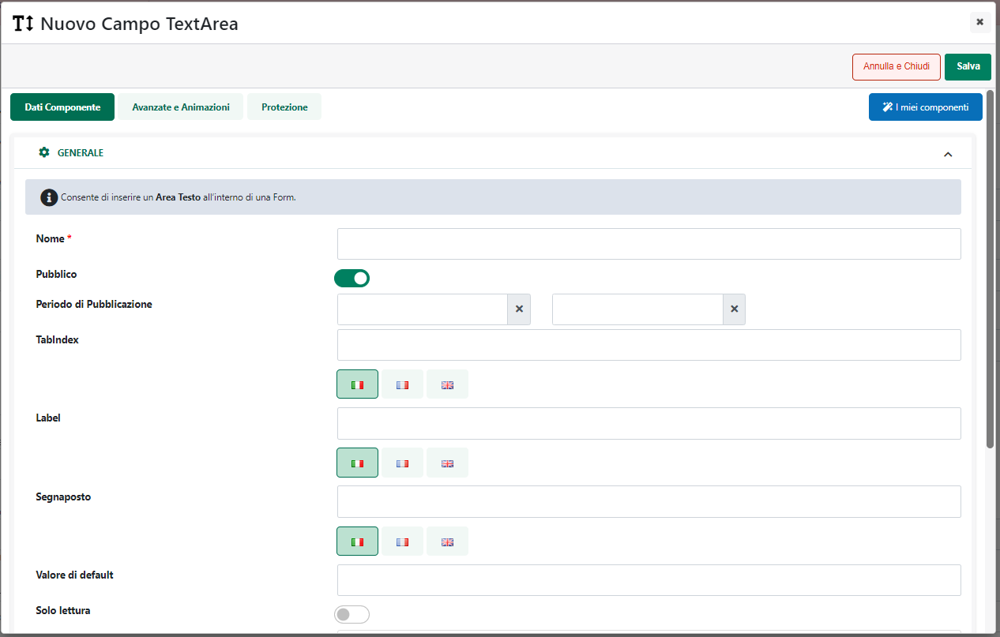
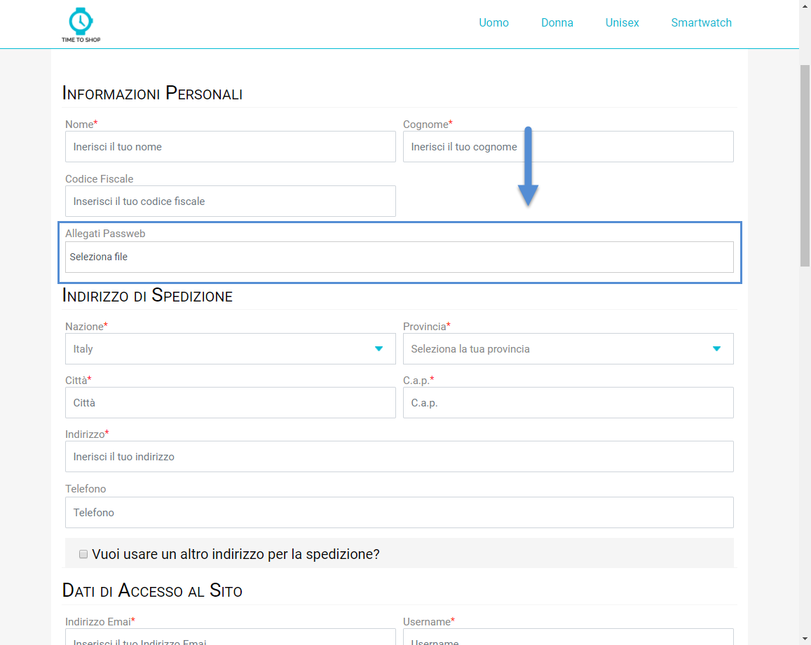

# GRUPPI DI UTENTI STANDARD

Come evidenziato nel precedente capitolo, oltre ai gruppi utente creati
in maniera manuale dall'amministratore del sito secondo le sue
specifiche esigenze, Passweb mette a disposizione, a default, anche due
gruppi Standard denominati rispettivamente "**Utente Autenticato**" e
"**Utente Non Autenticato**", gestiti in maniera completamente
automatica dall'applicazione, non eliminabili ed evidenziati,
nell'elenco dei gruppi utente, in verde.

**Utente Autenticato:** fanno parte di questo gruppo tutti gli utenti
che hanno effettuato il login al sito. Nel momento in cui, dunque, un
qualsiasi cliente effettui l'accesso al sito verrà automaticamente
inserito all'interno di questo gruppo.

**Il gruppo "Utente Autenticato" è unico, non eliminabile, e non può
essere gestito in alcun modo se non associandogli uno specifico filtro
articoli.**

Selezionando questo gruppo e cliccando sul pulsante "**Modifica**",
presente nella contestuale barra degli strumenti, verrà infatti
visualizzata la maschera di configurazione del gruppo qui di seguito
riportata

all'interno della quale sarà appunto possibile personalizzare il
**Nome** del gruppo e, eventualmente, associargli anche uno specifico
filtro articoli (sezione "**Filtri**") secondo le modalità descritte
all'interno del capitolo "*Filtri Articolo*" di questo manuale.

**Utente Non Autenticato:** fanno parte di questo gruppo tutti gli
utenti che visitano il sito senza aver ancora effettuare
l'autenticazione.

Mentre il gruppo standard "Utenti Autenticati" è unico e, come detto,
non può essere gestito in alcun modo se non associandogli uno specifico
filtro articoli, **per quel che riguarda gli "Utenti non Autenticati"
oltre al gruppo standard creato in automatico dall'applicazione e non
eliminabile, sarà possibile creare anche altri gruppi di questo tipo
così come sarà possibile associare a tali gruppi oltre ad un filtro
articoli, anche uno specifico filtro utenti basato però unicamente sulla
loro nazione di provenienza determinata in base all'indirizzo IP del
visitatore**.

Per personalizzare il gruppo standard "Utente Non Autenticato" è
sufficiente selezionarlo tra quelli in elenco e cliccare sul pulsante
"Modifica" presente nella contestuale barra degli strumenti.

Il pulsante "**Nuovo Gruppo Utenti Non Autenticati"** ( ) consente
invece di creare e definire un nuovo gruppo di "Utenti Non Autenticati".

In entrambi i casi verrà comunque visualizzata la maschera di
configurazione di questa particolare tipologia di gruppo

all'interno della quale sarà possibile definire, il **Nome** del gruppo,
eventuali filtri articolo o utente da applicare al gruppo stesso
(sezione "**Filtri**") e, volendo, anche delle specifiche condizioni
commerciali (a livello di sconti) da applicare agli utenti che
entreranno a far parte del gruppo in esame (sezione "**Condizioni
Commerciali associate all'utente**").

**NOTA BENE:** per maggiori informazioni relativamente alla gestione dei
filtri articolo/utente e/o delle condizioni commerciali da poter
associare ad uno specifico gruppo di utenti si vedano i successivi
capitoli di questo manuale.

**ATTENZIONE**! I gruppi di utenti "Non Autenticati" creati manualmente
verranno visualizzati, nella lista dei gruppi utente, in giallo

