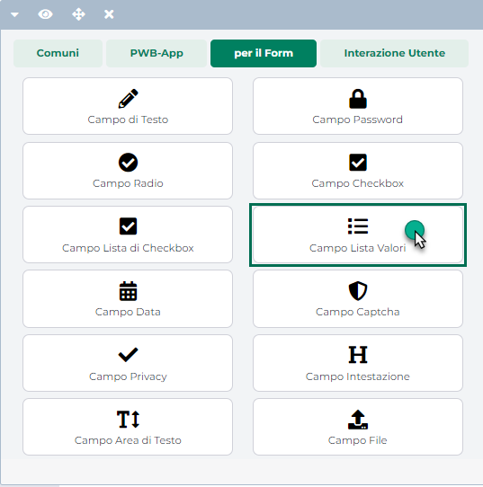
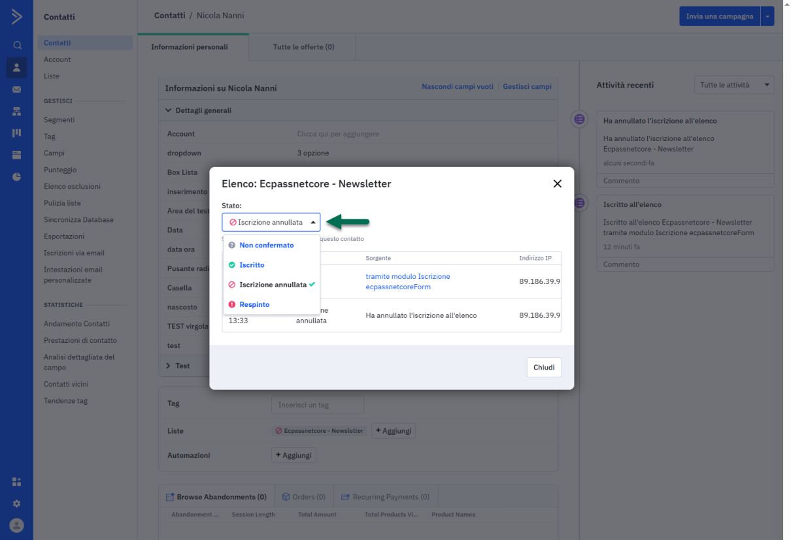
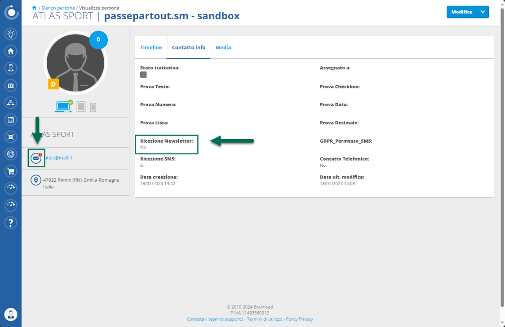
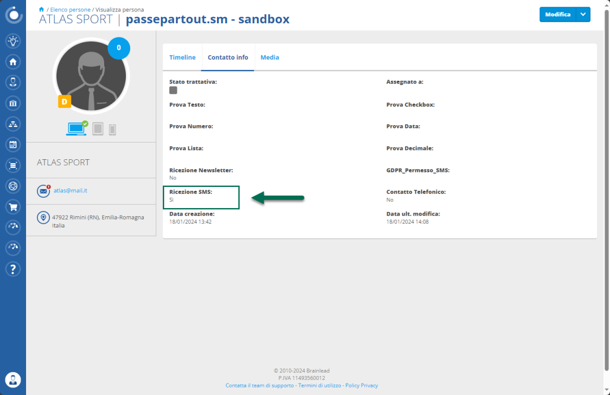
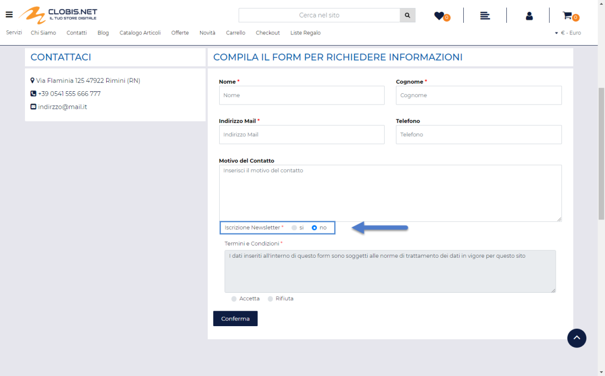
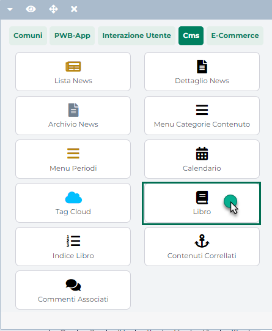
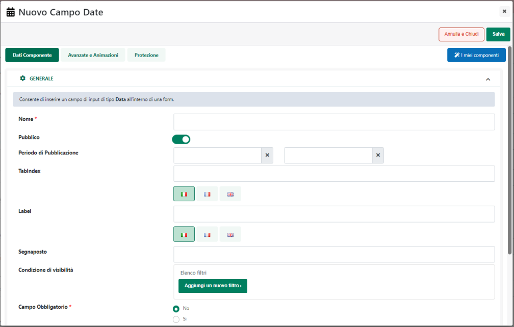
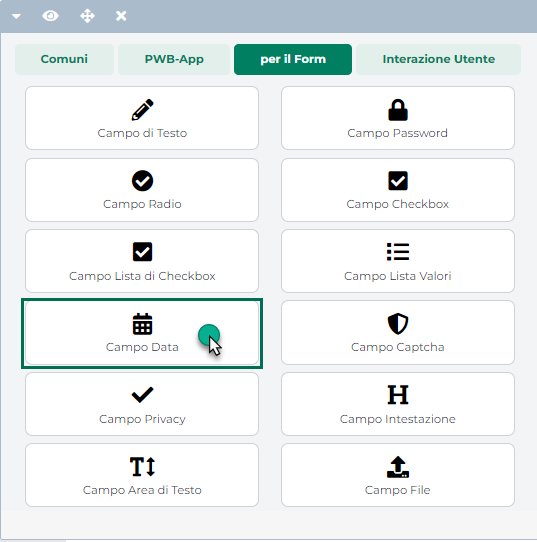
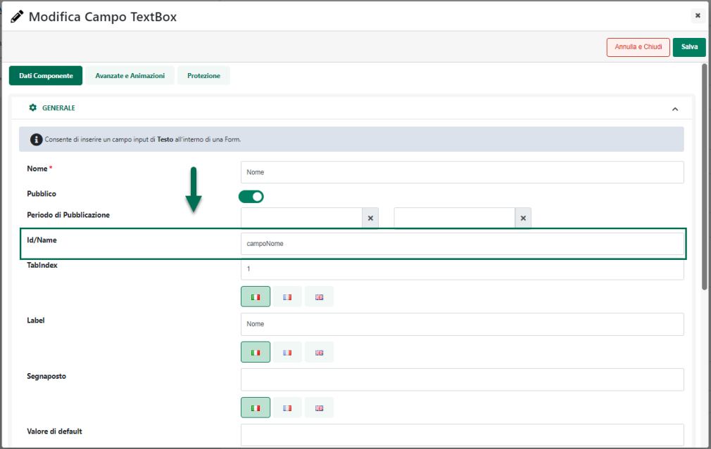
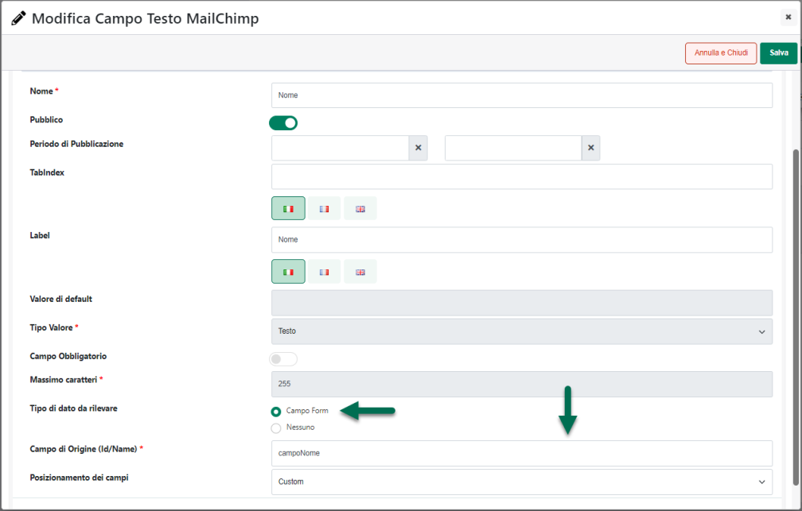

# CREAZIONE E GESTIONE DI UNA GERARCHIA AGENTI

Nel caso in cui si voglia gestire all'interno del proprio sito una forza
vendita strutturata su diversi livelli (Amministratore Agenti -- Capo
Area -- Agenti di Zona -- Sotto Agenti di zona ecc ...), abilitando
anche le diverse possibilità di comunicazione gerarchica messe a
disposizione dall'Area Riservata del sito Ecommerce, sarà necessario,
per prima cosa ovviamente, codificare la corrispondente gerarchia dei
gruppi e degli utenti.

**ATTENZIONE!** Quanto detto relativamente alla creazione di una
gerarchia Agenti vale ovviamente anche nel caso in cui, per siti
Ecommerce collegati ad uno dei gestionali Ho.Re.Ca. si voglia realizzare
una gerarchia di Utenti abilitati ad accedere in Area Riservata e
strutturata su N diversi livelli

**NOTA BENE:** nel caso in cui non venga definita nessuna gerarchia, i
vari utenti abilitati ad accedere all'Area Riservata, siano essi Agenti
o Clienti Mexal, potranno comunque continuare ad accedere a questa
sezione del sito con le rispettive funzionalità determinate sulla base
del tipo di utente considerato, ma, ovviamente il tutto sarà strutturato
su di un unico livello e verrà quindi a mancare, per questi utenti, la
possibilità di comunicare tra loro in maniera gerarchica.

Tenendo conto del fatto che il livello di comunicazione di un utente
dipende dal suo gruppo di appartenenza e dalla posizione in cui tale
gruppo viene collocato all'interno della struttura gerarchica, **occorre
fare particolare attenzione nel momento in cui si andrà a definire la
gerarchia dei gruppi e degli utenti che andrà poi a regolare le
comunicazioni in Area Riservata** a livello di scambio messaggio, di
inserimento attività, scadenze o appuntamenti in agenda e di scambio di
generici documenti (NON Docuvision).

Fatte queste considerazioni di fondamentale importanza, per creare ora
una nuova gerarchia occorrerà innanzi tutto definire il suo gruppo
radice.

Per far questo sarà quindi necessario portarsi alla pagina "Utenti --
Gruppi Utenti Sito"

{width="5.207638888888889in"
height="3.4868055555555557in"}

e creare un nuovo gruppo cliccando sul corrispondente pulsante presente
nella barra degli strumenti.

{width="5.1819444444444445in"
height="3.298611111111111in"}

Dovremo quindi definire il nome del gruppo radice ed eventualmente le
sue caratteristiche a livello di Gestione SMS, Comunicazione Interna e
Filtri articolo e/o Cliente.

Una volta creato il gruppo radice sarà necessario stabilire la struttura
della gerarchia definendo quindi i gruppi che ne faranno parte e i vari
legami tra un gruppo e l'altro.

Per poter far ciò sarà sufficiente selezionare il gruppo radice presente
nella parte sinistra della maschera e utilizzare poi i pulsanti presenti
nella barra degli strumenti per creare gruppi figli del gruppo radice,
per eliminare o spostare gruppi all'interno dell'albero e, ovviamente
per definire gli utenti appartenenti allo specifico gruppo.

{width="5.513194444444444in"
height="3.325in"}

In questo senso i pulsanti presenti nella barra degli strumenti
consentiranno di:

- **Nuovo Gruppo** (
  {width="0.5520833333333334in"
  height="0.1951388888888889in"} ): consente di creare un nuovo gruppo
  **figlio del gruppo attualmente selezionato**. Nella parte destra
  della maschera sarà poi possibile definire le proprietà e le
  caratteristiche del gruppo stesso.

> In particolare dunque per ogni nuovo gruppo occorrerà indicare:

- **Nome**: etichetta identificativa del gruppo che si sta
  creando/modificando. Tale campo è obbligatorio.

<!-- -->

- **Gestione SMS:** settando questo parametro è possibile abilitare, in
  Area Riservata, gli utenti del gruppo all'invio di SMS per notificare
  ai rispettivi destinatari l'inserimento di un nuovo messaggio, di una
  nuova attività in agenda, ecc... Questa gestione verrà abilitata
  unicamente nel caso in cui siano stati correttamente inseriti i dati
  impostati per l'invio degli SMS alla pagina "Posta/SMS" del Wizard
  (vedi anche sezione "Posta/SMS" di questo manuale).

- **Comunicazione interna**: se impostato a SI, questo parametro
  consente di abilitare in Area Riservata la comunicazione tra gli
  utenti dello stesso gruppo.

- **Comunicazione Utenti Livello Superiore**: flaggando questo
  parametro, verrà abilitata in Area Riservata la possibilità di
  comunicare con i singoli utenti dei gruppi padre (collocati quindi ad
  un livello gerarchico più alto) del gruppo in esame. Nel caso in cui
  tale parametro non venga selezionato, la comunicazione verso l'alto
  potrà essere effettuata a livello di intero gruppo ma non a livello di
  singoli utenti.

<!-- -->

- **Filtri:** all'interno di questa sezione è possibile associare al
  gruppo che si sta realizzando degli specifici filtri articoli e/o
  degli specifici filtri utente

<!-- -->

- **Lista Utenti** (
  {width="0.46111111111111114in"
  height="0.1951388888888889in"} ): consente di visualizzare la lista
  degli utenti attualmente presenti all'interno del gruppo selezionato.
  Cliccando su questo pulsante si verrà quindi ricondotti alla maschera
  "**Lista Utenti -- Nome Gruppo**" attraverso cui poter gestire gli
  utenti del gruppo attualmente selezionato. Verranno evidenziati in
  grigio gli utenti di tipo **Agente** ed in azzurro gli utenti di tipo
  **Cliente Area Riservata**.

I pulsanti presenti nella contestuale barra degli strumenti, consentono
rispettivamente di:

- **Modifica Utente** (
  {width="0.40902777777777777in"
  height="0.12986111111111112in"} ): consente di modificare, ove
  possibile, l'anagrafica dell'utente attualmente selezionato. Cliccando
  su questo pulsante verrà infatti aperta la maschera **"Dati Utente"**
  attraverso cui poter gestire i dati dell'utente compresi indirizzi di
  spedizione, condizioni commerciali e associazione Utente -- Gruppi.

{width="5.8180555555555555in"
height="4.50625in"}

> Per maggiori informazioni in merito alla gestione dell'anagrafica
> utente si veda anche la sezione "*Utenti -- Utenti Sito -- Utenti --
> Gestione Utenti*" di questo manuale.

- **Aggiungi Esistenti** (
  {width="0.7208333333333333in"
  height="0.2076388888888889in"} ): consente di associare al gruppo
  attualmente selezionato all'interno dell'albero, un qualsiasi utente
  del sito. Cliccando su questo pulsante verrà quindi visualizzata la
  maschera, **a selezione multipla**, dei possibili utenti da aggiungere
  al gruppo

> **NOTA BENE:** dall'elenco dei possibili utenti da aggiungere al
> gruppo verranno ovviamente esclusi quelli che dello specifico gruppo
> fanno già parte.
>
> Per associare uno più utenti al gruppo in esame sarà quindi
> sufficiente selezionarli all'interno della tabella sopra evidenziata
> (filtrabile attraverso l'apposito pannello di ricerca), e cliccare poi
> sul pulsante "**Aggiungi**" visualizzato nella contestuale barra degli
> strumenti.

**NOTA BENE:** non è possibile associare ad un gruppo utenti di tipo
"Contatto Non Attivo".

- **Sposta** (
  {width="0.30486111111111114in"
  height="0.1951388888888889in"} ): consente di spostare il gruppo
  attualmente selezionato in una diversa posizione della gerarchia che
  si sta considerando. Cliccando su questo pulsante, infatti, il
  puntatore del mouse si modificherà assumendo la forma di quattro
  piccole frecce.

> Occorrerà quindi selezionare il nuovo gruppo di destinazione e
> cliccare su di esso per effettuare lo spostamento (verrà in ogni caso
> richiesta una conferma per l'operazione che si sta effettuando)

- **Elimina** (
  {width="0.3506944444444444in"
  height="0.18819444444444444in"} ): consente di eliminare dalla
  gerarchia il gruppo attualmente selezionato.

> **NOTA BENE:** eliminando un gruppo NON verranno eliminati gli utenti
> in esso contenuti i quali dunque potranno essere gestiti, ed
> eventualmente associati a nuovi gruppi.

Cliccando su questo pulsante verrà visualizzato un messaggio del tipo di
quello qui di seguito riportato

{width="2.8569444444444443in"
height="1.1625in"}

> consentendo quindi all'utente di decidere se eliminare il singolo
> gruppo oppure anche tutti i suoi gruppi figli. Nel primo caso,
> eliminando il singolo gruppo, gli eventuali gruppi figlio saliranno
> tutti di un livello all'interno della gerarchia. Nel secondo caso
> invece assieme al gruppo selezionato verranno eliminati
> definitivamente anche tutti i gruppi figlio.
>
> **NOTA BENE:** nel caso di siti B2B o Misti è buona norma creare una
> specifica gerarchia per la sola gestione di Agenti ed Utenti abilitati
> ad accedere in Area Riservata.

