# CONFIGURAZIONE UTENTI

All'interno di questa sezione è possibile definire i criteri per la
gestione delle password utente, abilitare o meno il Case Sensitive sul
pannello di login, definire come dovrà essere gestita la registrazione
al sito di nuovi contatti e/o di nuovi clienti, impostare un minimo
d'ordine per gli utenti che effettuano una nuova registrazione,
impostare, in tutte le lingue gestite all'interno del sito, i contenuti
delle e-mail inviate in automatico dall'applicazione in corrispondenza
di diversi eventi ecc...

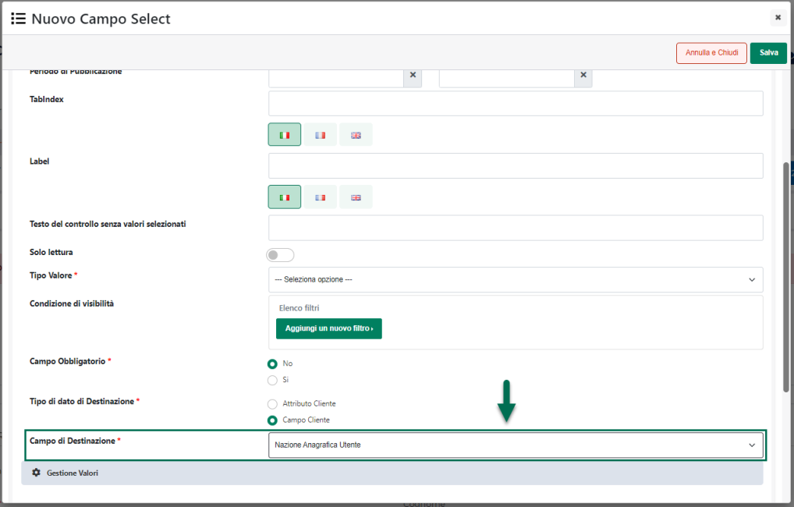

##### IMPOSTAZIONI GENERALI -- GESTIONE DELLE CREDENZIALI

All'interno di questa sezione è possibile definire i criteri per la
gestione delle password utente e abilitare o meno il Case Sensitive sul
pannello di login.

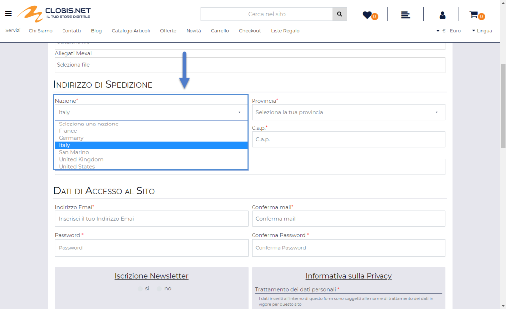

In particolare dunque il campo:

- **Formato della Password**: consente di impostare l'espressione
  regolare che verrà poi utilizzata per validare il formato della
  Password che gli utenti dovranno scegliere in fase di registrazione al
  sito e/o di modifica del proprio profilo.

> Nello specifico dunque il campo:

- **Lettere Maiuscole**: consente di impostare il numero di caratteri
  Maiuscoli che dovranno essere necessariamente presenti nella password
  scelta dagli utenti al fine di poter essere validata correttamente

- **Caratteri Speciali**: consente di impostare il numero di caratteri
  speciali che dovranno essere necessariamente presenti nella password
  scelta dagli utenti al fine di poter essere validata correttamente.

> **ATTENZIONE!** i caratteri considerati come "**speciali**" sono
> quelli di seguito indicati: **! @ \# \$ % & \* - \_ .**

- **Lettere Minuscole**: consente di impostare il numero di caratteri
  Minuscoli che dovranno essere necessariamente presenti nella password
  scelta dagli utenti al fine di poter essere validata correttamente

- **Numeri**: consente di impostare il numero di caratteri Numerici che
  dovranno essere necessariamente presenti nella password scelta dagli
  utenti al fine di poter essere validata correttamente

- **Lunghezza minima**: consente di impostare la lunghezza minima che
  dovrà avere la password scelta dagli utenti al fine di poter essere
  validata correttamente.

> In base alle impostazioni settate per i campi appena analizzati (e
> all'espressione regolare creata automaticamente da Passweb proprio
> sulla base di tali impostazioni) sarà quindi possibile obbligare o
> meno gli utenti ad inserire ed utilizzare password più o meno sicure.
>
> Inoltre, se attivato il parametro "**Visualizza suggerimenti
> password**" presente nella maschera di configurazione del componente
> "Password" (componente questo da inserire all'interno dei form di
> Registrazione / Profilo Utente) compariranno anche, in fase di
> inserimento della password sul front end del sito, una serie di
> suggerimenti utili per aiutare l'utente a capire quali siano
> effettivamente i criteri da soddisfare affinché la password da lui
> inserita possa effettivamente essere ritenuta valida

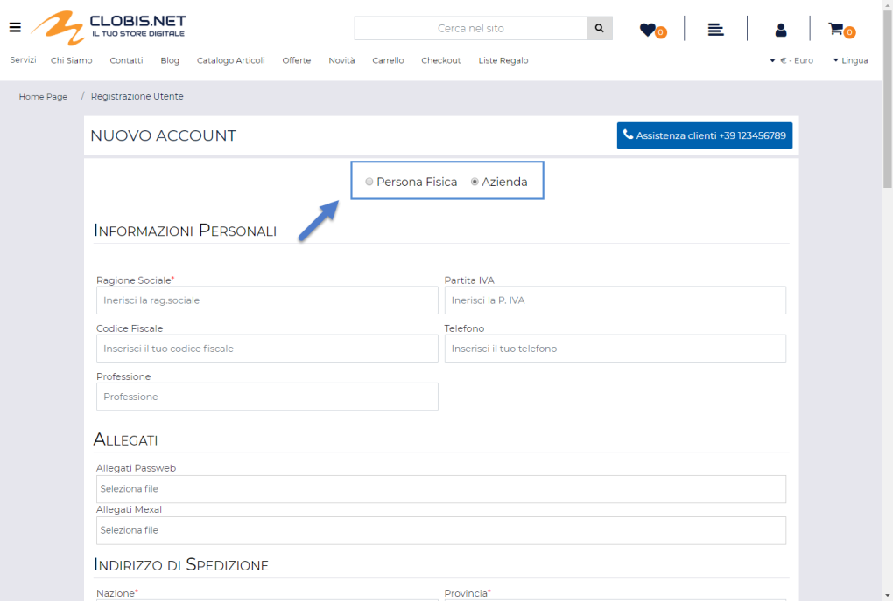

> Nel caso in cui si desiderasse, ad esempio, obbligare gli utenti ad
> utilizzare il classico formato delle password sicure caratterizzato da
> una lunghezza di almeno 8 caratteri, almeno un lettera maiuscola, un
> numero ed un carattere speciale allora i campi appena analizzati
> andrebbero impostati, ovviamente, come nella figura di seguito
> riportata:

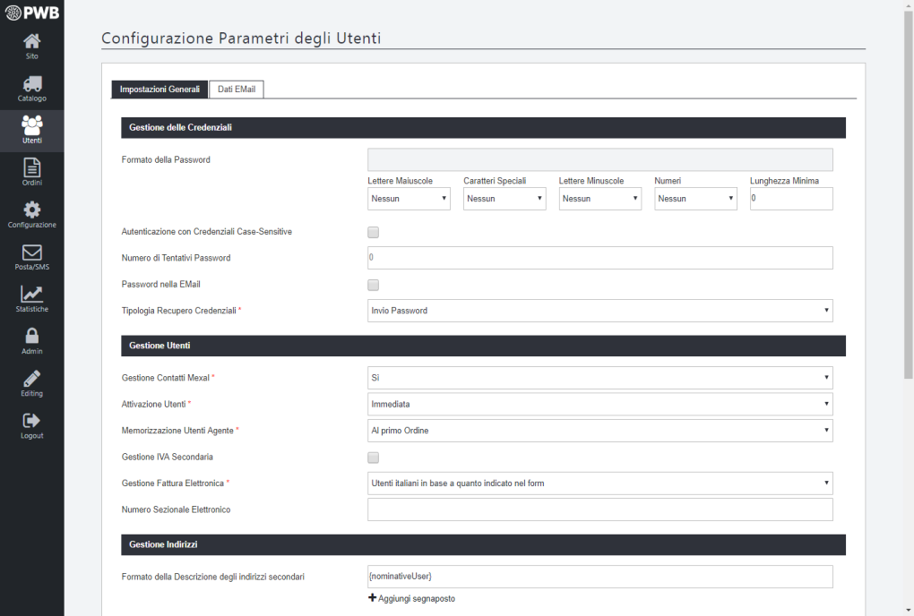

> Nel caso in cui si volesse invece privilegiare la semplicità **a
> discapito della sicurezza**, si potrebbe allora pensare di non imporre
> nessun vincolo particolare al formato delle password impostando i
> campi in esame come nella figura di seguito indicata (senza cioè
> creare nessuna specifica espressione regolare)

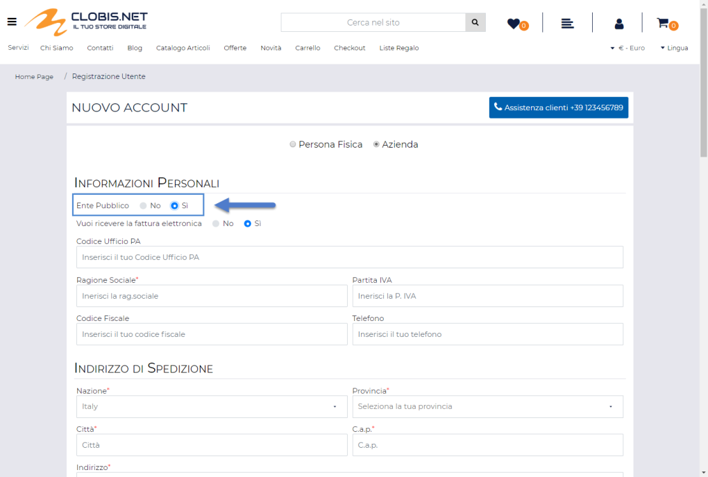

> **ATTENZIONE!** In queste condizioni gli utenti potrebbero utilizzare,
> per il proprio account, una password qualsiasi (al limite anche di un
> solo carattere).
>
> **Al fine di garantire la sicurezza dei dati dei propri clienti è
> quindi consigliabile imporre specifici criteri per la robustezza delle
> password.**

- **Autenticazione con credenziali Case-Sensitive:** se selezionato, il
  campo password utilizzato per effettuare l'autenticazione al sito sarà
  Case Sensitive. In queste condizioni dunque per poter effettuare
  l'accesso l'utente dovrà necessariamente digitare la stessa password
  (**anche a livello di lettere minuscole e maiuscole**) inserite in
  fase di registrazione.

> Nel caso in cui tale parametro non venga selezionato il controllo Case
> Sensitive sul campo password verrà disabilitato. In queste condizioni
> per effettuare l'accesso al sito sarà quindi sufficiente digitare la
> stessa password inserita in fase di registrazione, senza dover
> necessariamente considerare lo stesso utilizzo di lettere minuscole e
> maiuscole.
>
> **ATTENZIONE!** indipendentemente dal fatto di aver attivato o meno il
> parametro in questione, sul campo "Username" non verranno mai
> applicati controlli relativi all'utilizzo di lettere maiuscole o
> minuscole

- **Numero di Tentativi Password**: consente di definire quante volte un
  utente potrà sbagliare ad inserire la propria password di accesso al
  sito prima che la sua utenza venga automaticamente bloccata.

> **ATTENZIONE!** Impostando il campo in esame sul valore 0 i tentativi
> a disposizione dell'utente saranno infiniti e l'utente non correrà
> quindi il rischio di trovarsi l'utenza bloccata a seguito di un
> eccessivo numero di tentativi errati.
>
> Supponendo invece di impostare questo campo sul valore 3, al terzo
> tentativo errato di inserimento password l'utenza (corrispondente allo
> username inserito) verrà automaticamente bloccata.
>
> Sul sito, all'utente bloccato verrà visualizzato un apposito messaggio
> di avviso e, contestualmente, verrà anche inviata una mail
> all'amministratore del sito, nello specifico all'indirizzo impostato
> alla pagina "*Posta / SMS -- Configurazione*" del Wizard per
> informarlo del fatto che l'utente in esame è stato bloccato perché ha
> esaurito i tentativi a sua disposizione per poter inserire la password
> corretta.
>
> In queste condizioni l'utente in esame dovrà quindi richiedere lo
> sblocco direttamente all'amministratore del sito.
>
> Per effettuare lo sblocco dell'utenza l'amministratore dovrà accedere
> al Wizard, portarsi nella sezione "*Utenti Sito -- Utenti*",
> selezionare, tra quelli presenti in elenco, l'utente in esame,
> accedere alla sua Anagrafica e impostare il campo "**Numero di
> Tentativi Password**" sul valore 0.

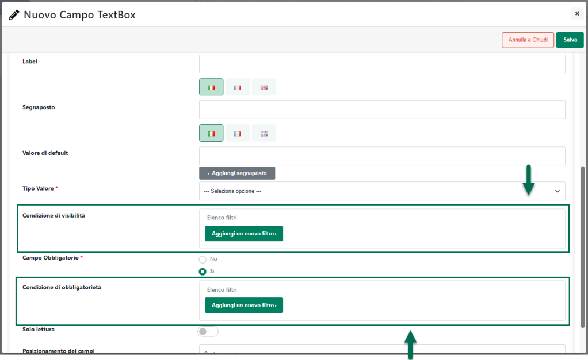

> A questo punto l'utente avrà di nuovo a disposizione altri N tentativi
> per poter inserire correttamente la proprio Password prima che la sua
> utenza venga nuovamente bloccata.

##### IMPOSTAZIONI GENERALI -- GESTIONE UTENTI

All'interno della sezione "**Gestione Utenti**" è possibile impostare
alcuni parametri di configurazione relativi, principalmente, alla
registrazione e all'attivazione di nuovi utenti.

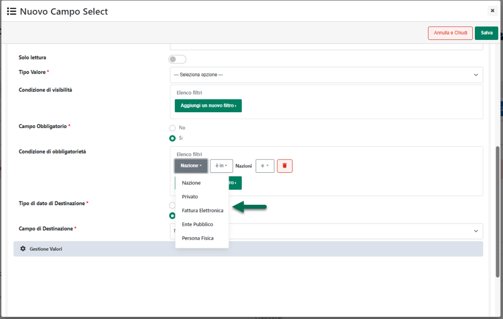

Nello specifico il parametro:

**Gestione Contatti Mexal (solo Ecommerce Mexal):** consente di
abilitare/disabilitare la memorizzazione dei contatti web nella relativa
**"Anagrafica Contatti"** di Mexal.

Impostando questo parametro sul valore NO, i contatti resteranno
memorizzati unicamente all'interno di Passweb.

Nel caso invece in cui questo parametro sia stato impostato sul valore
SI, e sia stata quindi attivata la memorizzazione dei contatti
all'interno del gestionale, alla sincronizzazione tutte le anagrafiche
di quegli utenti che si sono registrati sul sito, che sono stati
abilitati per effettuare ordini, ma che non hanno ancora effettuato
veramente dei nuovi ordini (in altri termini tutti gli utenti di tipo
"**Contatto**") verranno inserite nella **"Anagrafica Contatti"** di
Mexal.

> **NOTA BENE:** gli utenti di tipo "Contatto non Attivo" non verranno
> mai memorizzati nell'Anagrafica Contatti di Mexal.

Per ciascuno di essi verrà inoltre inserito, nella relativa anagrafica,
il primo indirizzo di spedizione da essi registrato all'interno del
sito. **Non verranno invece presi in considerazione, a livello di
contatti, eventuali indirizzi di spedizione secondari ne tali indirizzi
verranno memorizzati nell' "Anagrafica Indirizzi di Spedizione di
Mexal"** (questo perché l'anagrafica indirizzi di spedizione di Mexal
necessita di un codice conto cliente, non ancora disponibile,
ovviamente, per i contatti).

> **NOTA BENE:** eventuali modifiche effettuate nell'anagrafica contatti
> di Mexal non verranno riportate, a seguito di una sincronizzazione,
> sul web.

Al contrario nel caso in cui un Contatto Attivo apporti delle variazioni
alla sua anagrafica, operando direttamente all'interno del sito, tali
variazioni verranno memorizzate, alla successiva sincronizzazione nella
corrispondente anagrafica mexal, limitatamente però alle sole
informazioni gestite da Mexal stesso.

**Occorre ricordare infatti che sull'anagrafica contatti di Mexal non
sono attive le videate Passweb, per cui informazioni quali ad esempio le
credenziali di accesso al sito o altri dati, legati comunque a videate
aggiuntive, non saranno visualizzabili nell'anagrafica contatti di Mexal
(tali dati dovranno essere visualizzati, per forza di cose, unicamente
all'interno del Wizard di Passweb).**

Ovviamente nel momento in cui un Contatto effettuerà il suo primo ordine
all'interno del sito, alla successiva sincronizzazione, verrà creata in
Mexal la nuova anagrafica cliente, verrà eliminata l'anagrafica contatto
e verranno memorizzati tutti gli indirizzi di spedizione del cliente
oltre, chiaramente, al nuovo ordine (l'utente sarà quindi diventato a
tutti gli effetti un cliente sia lato Passweb che lato Mexal).

> **NOTA BENE:** nel caso in cui si decida di eliminare manualmente un
> contatto dalla relativa anagrafica di Mexal, sarà poi necessario
> eliminare manualmente il relativo contatto anche all'interno di
> Passweb. Allo stesso modo nel caso in cui si decida di trasformare un
> contatto Mexal in cliente in maniera manuale, operando quindi
> direttamente all'interno dell' Anagrafica Contatti di Mexal, sarà poi
> necessario rimuovere manualmente il contatto anche all'interno di
> Passweb. In caso contrario potrebbero verificarsi errori in fase di
> sincronizzazione.

**Attivazione Utenti:** consente di impostare la modalità con cui
verranno attivati gli utenti che si registrano all'interno del sito.

E' possibile selezionare uno dei seguenti valori:

- **Differita:** selezionando questo valore, ed abilitando
  conseguentemente la gestione differita dei contatti, un nuovo utente,
  dopo essersi registrato, riceverà, all'indirizzo da lui specificato,
  la mail di registrazione contenente il riepilogo dei propri dati **ma
  non avrà, ancora, la possibilità di autenticarsi e conseguentemente di
  effettuare ordini sul sito.**

> In queste condizioni, infatti, ogni nuovo utente verrà considerato
> dall'applicazione come un **"Contatto Non Attivo"**. Sarà quindi
> compito dell'Amministratore del sito decidere se attivare o meno lo
> specifico contatto abilitandogli così la possibilità di autenticarsi e
> di fare ordini all'interno del sito.
>
> Per poter effettuare questa operazione sarà quindi necessario portarsi
> alla pagina "Utenti -- Utenti Sito" selezionare, tra tutti gli utenti
> in elenco, il contatto che si desidera attivare (in questo senso
> potrebbe essere molto utile filtrare per tipologia utente selezionando
> i soli utenti di tipo "Contatto Non Attivo") e cliccare poi sul
> pulsante **"Attiva Contatto"** (
> 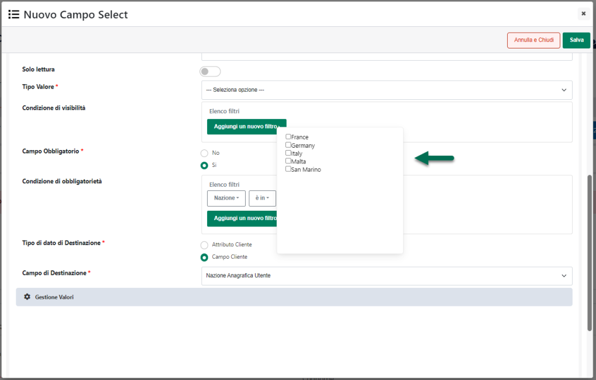 ) presente nella contestuale barra
> degli strumenti.
>
> Lo stato dell'utente in esame passerà quindi da "Contatto Non Attivo"
> a **"Contatto"**, contemporaneamente verrà inviata, all'indirizzo
> specificato dall'utente in fase di registrazione, una mail di
> attivazione contenente le sue credenziali di accesso. A questo punto
> l'utente potrà autenticarsi sul sito ed effettuare ordini.
>
> Infine, in relazione alla modalità di attivazione differita degli
> utenti è bene ricordare anche che:

- **Nel caso in cui ad effettuare la registrazione del nuovo utente
  dovesse essere un Agente, il nuovo cliente verrà sempre considerato
  attendibile e conseguentemente attivato in maniera immediata.**

- **La modalità di Attivazione Differita verrà applicata solo ed
  esclusivamente per registrazioni effettuate all'interno della pagina
  di Registrazione Utente. Nel caso in cui l'utente decida di creare un
  account direttamente all'interno del modulo di One Step Checkout il
  sistema creerà immediatamente il relativo account e autenticherà
  l'utente sul sito senza attendere eventuali ulteriori conferme.**

> Per maggiori informazioni relativamente al modulo di "One Step
> Checkout" si veda anche l'apposita sezione di questo manuale
> ("*Varianti Responsive -- Lista Componenti Ecommerce -- Componente
> Ordine Custom (Checkout) -- One Step Checkout*")

- **Immediata:** in queste condizioni a seguito di una nuova
  registrazione il corrispondente utente sarà immediatamente in grado di
  autenticarsi sul sito ed effettuare così nuovi ordini (verrà quindi
  considerato dall'applicazione immediatamente come un utente di tipo
  "Contatto").

- **Immediata per Aziende e Differita per Privati:** in queste
  condizioni per i nuovi utenti di tipo "Azienda" verrà utilizzata la
  modalità di attivazione "Immediata" precedentemente descritta; per gli
  utenti di tipo "Privato" verrà invece utilizzata la modalità di
  attivazione "Differita".

- **Immediata per Privati e Differita per Aziende:** in queste
  condizioni per i nuovi utenti di tipo "Azienda" verrà utilizzata la
  modalità di attivazione "Differita" precedentemente descritta; per gli
  utenti di tipo "Privato" verrà invece utilizzata la modalità di
  attivazione "Immediata".

- **Verifica Email:** in queste condizioni l'utente che effettua la
  nuova registrazione, per completare la procedura, dovrà
  necessariamente cliccare, **ENTRO 24 ORE,** sul link presente
  all'interno della mail di "Nuovo Utente Ecommerce" che verrà inviata
  dall'applicazione, all'atto della conferma del form, all'indirizzo
  indicato dallo stesso utente in fase di registrazione.

> **Il relativo account verrà quindi attivato solo ed esclusivamente nel
> momento in cui l'utente effettuerà il click sul link presente
> all'interno della mail.**
>
> **Una volta attivato il nuovo account, il relativo utente verrà
> automaticamente passato, all'interno di Passweb, dallo stato di
> "Contatto Non Verificato" a quello di "Contatto"**
>
> **NOTA BENE:** fintanto che l'utente in questione non attiverà il suo
> account cliccando o visitando il link indicato all'interno della mail,
> tale utente verrà posto, all'interno di Passweb, nello stato di
> "Contatto non Verificato" e, conseguentemente, non avrà ancora la
> possibilità di autenticarsi e di effettuare ordini all'interno del
> sito.
>
> **Nel caso in cui si scelga di attivare questa opzione, affinché la
> procedura possa funzionare il maniera corretta, sarà quindi necessario
> inserire nel corpo della mail di "Nuovo Utente Ecommerce" il
> segnaposto {{VERIFYURL}} che sarà poi automaticamente sostituito
> dall'applicazione con il relativo link di verifica (nello specifico
> tale link farà riferimento alla pagina di Registrazione Utente del
> proprio sito).**
>
> Per maggiori informazioni relativamente alla composizione delle mail
> connesse alle varie fasi di registrazione utenti si veda anche quanto
> successivamente indicato all'interno di questo stesso paragrafo
>
> In ogni caso nel momento in cui si fosse deciso di attivare questa
> opzione e non venisse inserito nella mail di "Nuovo Utente Ecommerce"
> il segnaposto indicato, al salvataggio della relativa pagina verrà
> visualizzato un messaggio di errore ad indicare proprio questa
> mancanza
>
> **ATTENZIONE! Fintanto che un utente resterà nello stato di "Contatto"
> (Attivo, Non Attivo o Non Verificato non fa differenza),
> l'Amministratore del sito avrà sempre la possibilità di eliminare
> questo utente operando direttamente all'interno di Passweb.**
>
> Per far questo sarà necessario portarsi alla pagina "Utenti -- Utenti
> Sito", selezionare tra quelli presenti in elenco lo specifico
> "Contatto" da eliminare, e cliccare poi sul pulsante "Elimina" (
> 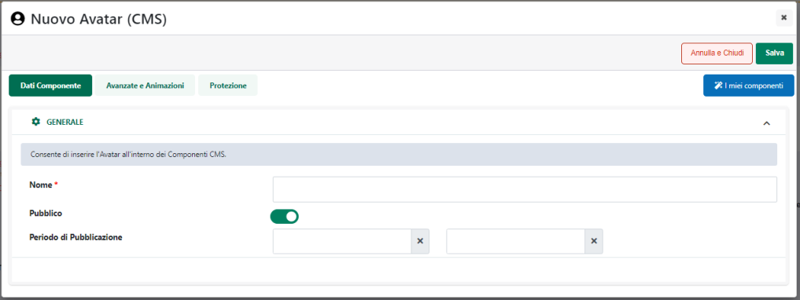 ) presente nella contestuale barra
> degli strumenti.
>
> **Nel momento in cui un Contatto effettuerà il suo primo ordine,
> contestualmente all'inserimento sul gestionale di questo documento,
> verrà inserita all'interno del gestionale anche la nuova anagrafica
> dell'utente che, solo a questo punto passerà dallo stato di "Contatto"
> allo stato di "Cliente"**
>
> **NOTA BENE:** non è possibile eliminare gli utenti di tipo "Cliente"
> direttamente da Passweb. Tali utenti hanno infatti già associata
> un'anagrafica all'interno del gestionale e dovranno per forza di cose
> essere gestiti direttamente sul gestionale stesso.
>
> Infine, in relazione alla modalità di attivazione utenti mediante
> verifica mail è bene ricordare anche che:

- **Nel caso in cui ad effettuare la registrazione del nuovo utente
  dovesse essere un Agente, il nuovo cliente verrà sempre considerato
  attendibile e conseguentemente verrà attivato in maniera immediata**.

<!-- -->

- **Nel caso in cui la registrazione al sito avvenga tramite social
  l'utente verrà sempre considerato attendibile e, conseguentemente,
  verrà attivato in maniera immediata. In queste condizioni verrà
  comunque inviata, all'utente, la mail di registrazione (nello
  specifico all'indirizzo ottenuto dal relativo social network) che però
  non conterrà alcun link di attivazione account**

- **La modalità di Attivazione mediante Verifica Email verrà applicata
  solo ed esclusivamente per registrazioni effettuate all'interno della
  pagina di Registrazione Utente. Nel caso in cui l'utente decida di
  creare un account direttamente all'interno del modulo di One Step
  Checkout il sistema creerà immediatamente il relativo account e
  autenticherà l'utente sul sito senza attendere eventuali ulteriori
  conferme.**

> Per maggiori informazioni relativamente al modulo di "One Step
> Checkout" si veda anche l'apposita sezione di questo manuale
> ("*Varianti Responsive -- Lista Componenti Ecommerce -- Componente
> Ordine Custom (Checkout) -- One Step Checkout*")

**Attivazione Utenti Agente:** consente di impostare la modalità con cui
dovranno essere attivati gli utenti che sono stati registrati da Agenti
appositamente abilitati. Anche in questo caso, come per il parametro
precedente, è possibile selezionare uno dei seguenti valori:

- Differita

- Immediata

- Immediata per Aziende e Differita per privati

- Immediate per Privati e Differita per Aziende

- Verifica Email

**Memorizzazione Utenti**: consente di decidere come dovrà comportarsi
l'applicativo in relazione all'inserimento sul gestionale delle
anagrafiche dei nuovi utenti che hanno effettuato la registrazione al
sito. E' possibile selezionare uno dei seguenti valori:

- **Al primo Ordine:** selezionando questa opzione la memorizzazione
  dell'anagrafica utente sul gestionale avverrà contestualmente
  all'inserimento del suo primo ordine.

> In queste condizioni dunque fintanto che l'utente non effettuerà
> almeno un ordine la sua anagrafica resterà memorizzata solo in Passweb

- **Alla Registrazione:** selezionando questa opzione la memorizzazione
  dell'anagrafica utente sul gestionale avverrà nel momento stesso in
  cui l'utente avrà completato la registrazione al sito (posto ovviamene
  che, in quel momento, il gestionale sia correttamente contattabile).

- **Alla Registrazione per Aziende:** selezionando questa opzione la
  memorizzazione dell'anagrafica utente sul gestionale avverrà nel
  momento stesso in cui l'utente avrà completato la registrazione al
  sito solo se l'utente in esame dovesse essere di tipo "Azienda".

> In queste condizioni dunque le anagrafiche di eventuali nuovi utenti
> di tipo "Privato" verranno inserite sul gestionale contestualmente al
> loro primo ordine

- **Alla Registrazione per Privati:** selezionando questa opzione la
  memorizzazione dell'anagrafica utente sul gestionale avverrà nel
  momento stesso in cui l'utente avrà completato la registrazione al
  sito solo se l'utente in esame dovesse essere di tipo "Privato".

> In queste condizioni dunque le anagrafiche di eventuali nuovi utenti
> di tipo "Azienda" verranno inserite sul gestionale contestualmente al
> loro primo ordine
>
> **ATTENZIONE!** Le opzioni "Alla Registrazione", "Alla Registrazione
> per Aziende" e "Alla Registrazione per Privati" potrebbero portare ad
> un considerevole aumento, sul gestionale, delle anagrafiche di utenti
> che non hanno ancora effettuato ordini.

**Memorizzazione Utenti Agente (solo Ecommerce Mexal):** permette di
decidere quando dovrà essere inserita all'interno del gestionale
l'anagrafica di un nuovo utente nel caso in cui tale utente sia stato
registrato da un Agente. E' possibile selezionare uno dei seguenti
valori:

- **Al primo Ordine:** in questo caso l'anagrafica del nuovo utente
  verrà inserita all'interno del gestionale contestualmente alla
  memorizzazione del suo primo ordine

- **Alla Registrazione:** in questo caso l'anagrafica del nuovo utente
  verrà inserita all'interno del gestionale subito dopo aver completato
  la registrazione ( senza dover dunque effettuare necessariamente un
  ordine).

- **Alla Registrazione per Aziende:** selezionando questa opzione
  l'anagrafica del nuovo utente verrà inserita all'interno del
  gestionale subito dopo aver completato la registrazione solo però se
  l'utente in esame dovesse essere di tipo "Azienda".

> In queste condizioni dunque le anagrafiche di eventuali nuovi utenti
> di tipo "Privato" verranno inserite sul gestionale contestualmente al
> loro primo ordine

- **Alla Registrazione per Privati:** selezionando questa opzione
  l'anagrafica del nuovo utente verrà inserita all'interno del
  gestionale subito dopo aver completato la registrazione solo però se
  l'utente in esame dovesse essere di tipo "Privato".

> In queste condizioni dunque le anagrafiche di eventuali nuovi utenti
> di tipo "Azienda" verranno inserite sul gestionale contestualmente al
> loro primo ordine

**Gestione IVA Secondaria (solo Ecommerce Mexal):** consente di
abilitare o meno, in relazione alla gestione, nel Gestionale, della
Partita IVA secondaria, il relativo campo collegato nell'anagrafica
utente di Mexal.

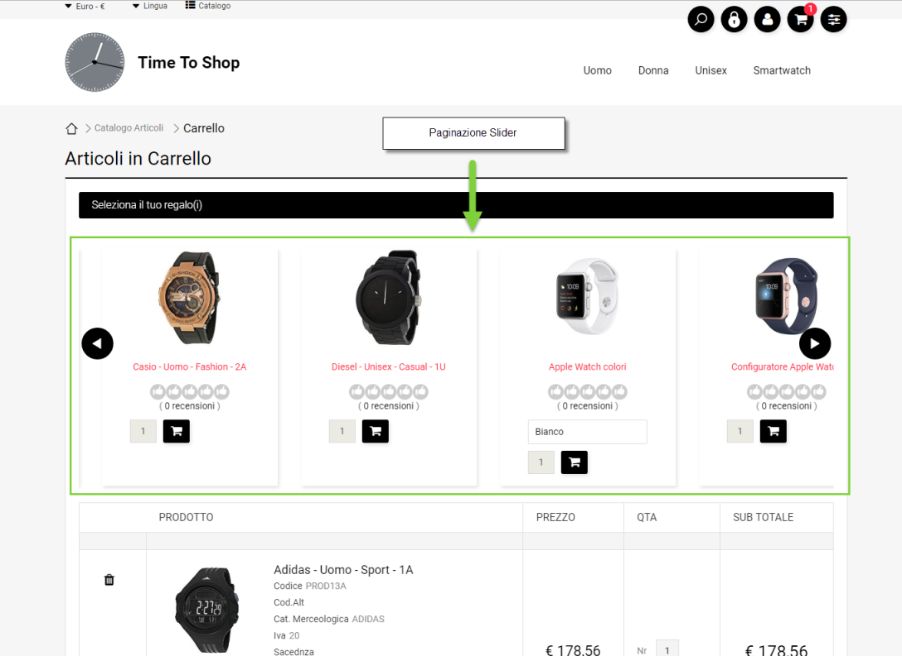

Nello specifico occorre dunque considerare che per i nuovi utenti:

- Selezionando questo parametro, nel momento in cui un nuovo utente si
  andrà a registrare sul sito ed effettuerà anche il suo primo ordine,
  contestualmente all'inserimento di questo stesso ordine **verrà
  creata, all'interno del gestionale, anche la nuova anagrafica utente
  con il campo relativo alla Partita IVA secondaria impostato a S**.

- Nel caso in cui il parametro in oggetto non venga selezionato, nel
  momento in cui un nuovo utente si andrà a registrare sul sito ed
  effettuerà anche il suo primo ordine, contestualmente all'inserimento
  di questo stesso ordine **verrà creata, all'interno del gestionale,
  anche la nuova anagrafica utente con il campo relativo alla Partita
  IVA secondaria impostato a N**.

**L'attivazione o meno della Partita IVA secondaria risulta
particolarmente utile nella gestione di quegli utenti già presenti
all'interno del gestionale (con una Partita IVA già assegnata) ma non
ancora esportati all'interno del sito, nel momento in cui questi stessi
utenti dovessero effettuare anche una registrazione web.**

In queste condizioni occorre infatti considerare che:

- Attivando la gestione della Partita IVA secondaria nel momento in cui
  un utente **già presente nelle anagrafiche del gestionale e non ancora
  esportato sul sito**, dovesse effettuare una registrazione web
  **fornendo la stessa Partita IVA già presente nella sua anagrafica
  Mexal**, e questo stesso utente dovesse anche effettuare un nuovo
  ordine, verrà creata nel gestionale una nuova anagrafica con i dati
  inseriti dall'utente in fase di registrazione, la stessa partita IVA
  dell'anagrafica già presente nel gestionale ed il campo relativo alla
  partita IVA secondaria impostato a S. **In queste condizioni dunque ad
  uno stesso utente corrisponderebbero due distinte anagrafiche
  gestionali**.

- Nel caso in cui la gestione della Partita IVA secondaria non sia stata
  attivata, nel momento in cui un utente **già presente nelle
  anagrafiche del gestionale e non ancora esportato sul sito**, dovesse
  effettuare una registrazione web **fornendo la stessa Partita IVA già
  presente nella sua anagrafica Mexal**, e questo stesso utente dovesse
  anche effettuare un nuovo ordine, il fatto di creare o meno una nuova
  anagrafica dipenderà questa volta dalle impostazione dell'anagrafica
  utente già presente all'interno del gestionale.

> Se l'anagrafica in questione ha il campo della partita IVA secondaria
> impostato a S, anche in queste condizioni verrà creata una nuova
> anagrafica con i dati inseriti dall'utente in fase di registrazione,
> la stessa partita IVA dell'anagrafica già presente nel gestionale ed
> il campo relativo alla partita IVA secondaria impostato questa volta a
> N.
>
> Se l'anagrafica in questione ha invece il campo della partita IVA
> secondaria impostato a N, non verrà creata una nuova anagrafica.
>
> **ATTENZIONE!!:** **In queste condizioni verrà invece agganciata
> l'anagrafica già presente all'interno del gestionale e i suoi dati
> verranno sovrascritti con quelli inseriti dall'utente in fase di
> registrazione sul sito.**

Infine nel momento in cui un utente "Azienda" **già presente nelle
anagrafiche del gestionale ed esportato anche all'interno del sito**
tentasse di inserire nel campo Partita IVA **fornendo la stessa Partita
IVA già presente nella sua anagrafica Mexal,** il processo di
registrazione verrebbe bloccato visualizzando un messaggio di "Partita
IVA già esistente"

In considerazione di ciò nel caso in cui si desideri bloccare la
possibilità di modificare le informazioni di un anagrafica gestionale a
seguito di una nuova registrazione web sarà possibile agire in due modi
diversi:

a)  Esportare gli utenti sul sito (assegnandogli o meno delle
    credenziali di accesso a seconda che gli si voglia concedere o meno
    la possibilità di autenticarsi sul sito per effettuare ordini)

b)  Abilitare la gestone della Partita IVA secondaria

**ATTENZIONE!** **Il parametro "Gestione IVA secondaria" è di
fondamentale importanza per regolare la registrazione di utenti con
Partita IVA nel caso di più siti collegati alla stessa azienda Mexal.**
**E' tale parametro infatti che garantisce, nel caso in cui uno stesso
utente si registri su due siti diversi con la stessa Partita IVA, la
possibilità di creare comunque, in Mexal, anagrafiche utente distinte.**

Per maggiori informazioni in merito si veda anche la sezione
"*Configurazione gestionale -- Registrazione Utenti da web su più siti
collegati alla stessa azienda Mexal*" di questo manuale.

**Gestione Fattura Elettronica:** consente di indicare come dovrà essere
gestita, in relazione alla registrazione di nuovi utenti, l'abilitazione
della fattura elettronica lato gestionale e, nello specifico, come dovrà
quindi essere impostato il parametro "**Tipo Fattura Elettronica**"
della corrispondente anagrafica.

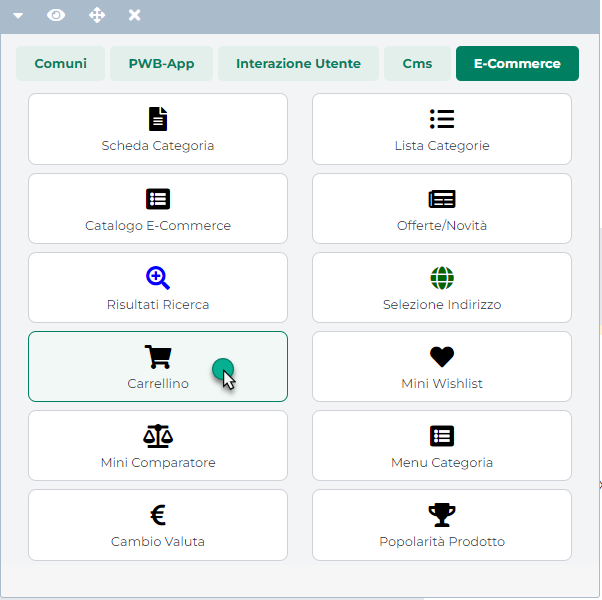

In questo senso è subito bene evidenziare che nel momento in cui nei
form di Registrazione / Profilo Utente dovesse essere inserito un Campo
Radio mappato sul campo cliente "**Fattura Elettronica**", il campo
"Tipo Fattura Elettronica" dell'anagrafica gestionale **verrà
valorizzato sempre sulla base della scelta effettuata dall'utente in
corrispondenza di questo stesso campo (indipendentemente dalle
impostazioni settate per il parametro in esame)**

**ATTENZIONE!** Per maggiori informazioni relativamente a come poter
inserire nei form di Registrazione / Profilo Utente un Campo Radio
mappato sul campo cliente "**Fattura Elettronica**", si veda anche la
sezione "*Lista Componenti Interazione Utente -- Componenti interni ai
Componenti interazione utente -- Campo Radio*" di questo manuale

Nel caso in cui invece il Campo Radio mappato sul campo cliente
"**Fattura Elettronica**" non dovesse essere inserito né nel form di
Registrazione Utente, né nel form di Profilo Utente il campo "Tipo
Fattura Elettronica" dell'anagrafica gestionale potrà essere valorizzato
solo in fase di registrazione e, in queste condizioni, verrà valorizzato
in maniera diversa a seconda delle impostazioni settate per il parametro
in oggetto.

In particolare:

- **Utenti italiani in base a quanto indicato nel form**: selezionando
  questa opzione il campo "Tipo Fattura Elettronica" dell'anagrafica
  gestionale verrà valorizzato secondo la seguente logica:

  - **Utenti di tipo Azienda**: se nel form di Registrazione sono stati
    inseriti **Campi Testo** mappati su "**Codice Destinatario SDI**" e
    / o "**PEC**" allora nel caso in cui uno di questi due campi sia
    stato correttamente valorizzato il campo "**Tipo Fattura
    Elettronica**" della corrispondente anagrafica gestionale verrà
    impostato su "**Fattura B2B**". Se invece nessun di questi due campi
    dovesse essere stato valorizzato il capo Tipo Fattura Elettronica"
    verrà impostato su "**Non gestita"**

  <!-- -->

  - **Utenti Privati:** se nel form di Registrazione è stato inserito un
    **Campo Testo** mappato sul "**Codice Fiscale**" allora nel caso in
    cui tale campo sia stato correttamente valorizzato il campo "**Tipo
    Fattura Elettronica**" della corrispondente anagrafica gestionale
    verrà impostato sul "**Fattura B2B**". In caso contrario verrà
    invece impostato su "**Non gestita**"

<!-- -->

- **Sempre:** selezionando questa opzione, in relazione alla
  registrazione di nuovi utenti, il campo "**Tipo Fattura Elettronica**"
  della corrispondente anagrafica gestionale verrà impostato su
  "**Fattura B2B**" indipendentemente dal fatto di considerare clienti
  Italiani o esteri, Privati o Aziende

- **Sempre escluso clienti esteri**: selezionando questa opzione, in
  relazione alla registrazione di nuovi utenti, il campo "**Tipo Fattura
  Elettronica**" della corrispondente anagrafica gestionale verrà
  impostato su "**Fattura B2B**" per utenti Italiani (Privati o Aziende
  non fa differenza). Per utenti esteri il campo verrà invece impostato
  sempre su "**Non gestita**"

- **Mai**: selezionando questa opzione, in relazione alla registrazione
  di nuovi utenti, il campo "**Tipo Fattura Elettronica**" della
  corrispondente anagrafica gestionale verrà sempre impostato su "**Non
  gestita**" indipendentemente dal fatto di considerare clienti Italiani
  o esteri, Privati o Aziende

**Numero Sezionale Elettronico (solo Ecommerce Mexal):** consente di
indicare il numero di sezionale che dovrà essere inserito in fase di
memorizzazione della relativa anagrafica utente, all'interno del campo
"**Sezionale iva**".

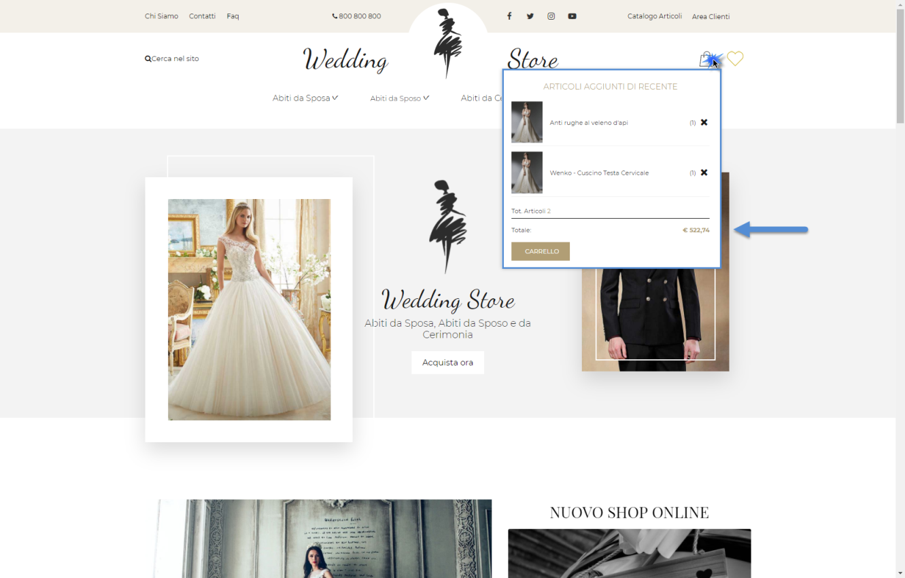

Grazie a questo parametro è quindi possibile specificare in quale, tra i
sezionali abilitati alla fatturazione elettronica, dovranno essere
riportati i documenti emessi per il relativo cliente.

**ATTENZIONE!** il numero indicato all'interno del campo "Numero
Sezionale Elettronico" deve corrispondere necessariamente al numero di
un sezionale opportunamente abilitato, lato gestionale, per la
fatturazione elettronica.

##### IMPOSTAZIONI GENERALI -- GESTIONE INDIRIZZI

All'interno di questa sezione, **disponibile solo nel caso di siti
Ecommerce collegati a Mexal**, è possibile decidere in che modo dovrà
essere valorizzato, all'interno del gestionale, il campo
"**Descrizione**" presente nell'anagrafica di ogni singolo indirizzo di
spedizione.

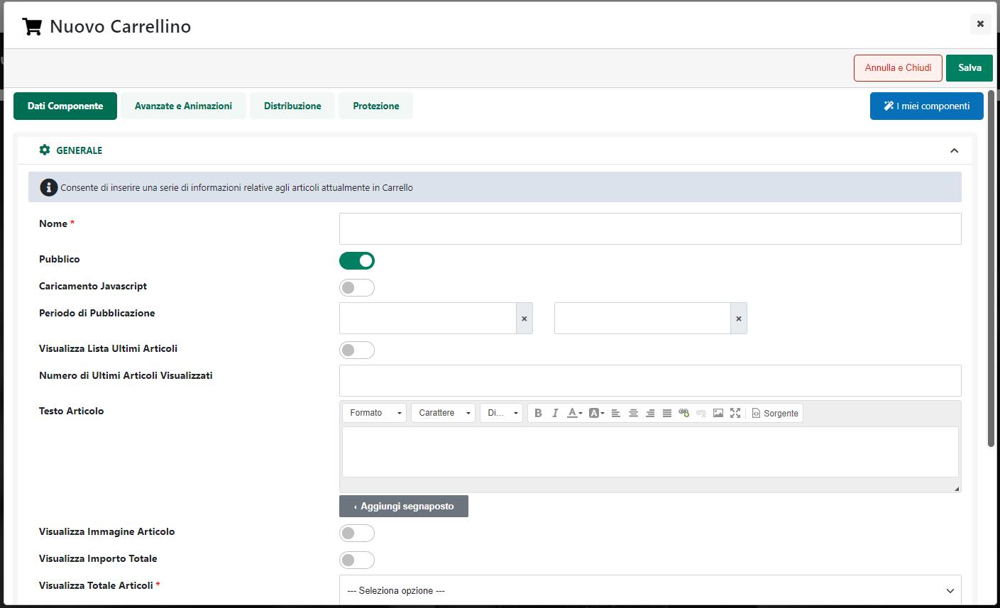

**Formato della Descrizione degli Indirizzi secondari:** consente di
decidere come e con che cosa dovrà essere valorizzato il campo
**Descrizione** presente all'interno di ogni singolo indirizzo di
spedizione.

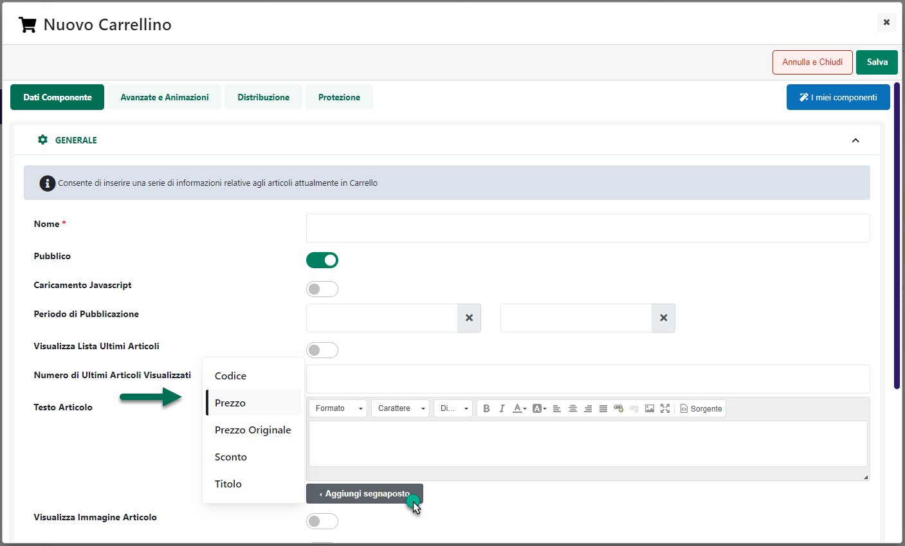

**ATTENZIONE!** Nel caso in cui si dovesse inserire all'interno del
campo in oggetto una specifica stringa, questa verrà poi riportata allo
stesso modo nel campo Descrizione di ogni singolo indirizzo di
spedizione

Nel caso in cui l'esigenza dovesse essere quella di valorizzare il campo
Descrizione in maniera diversa a seconda dello specifico indirizzo di
spedizione sarà quindi necessario inserire all'interno di questo campo
uno dei segnaposto messi a disposizione da Passweb cliccando sul
relativo pulsante **"Aggiungi segnaposto"**

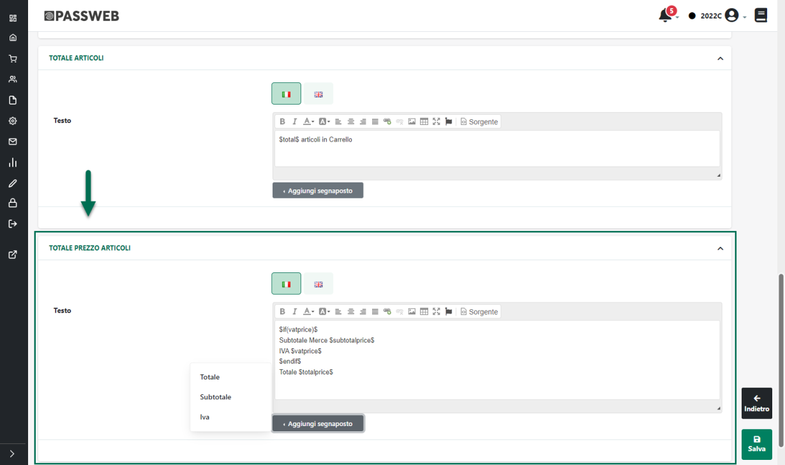

Sono gestiti i seguenti segnaposto:

- **Nominativo dell'indirizzo:** in queste condizioni il campo
  Descrizione del corrispondente indirizzo di spedizione Mexal, verrà
  valorizzato con quanto inserito dall'utente, in fase di codifica
  dell'indirizzo stesso, all'interno del campo "**Nominativo**"

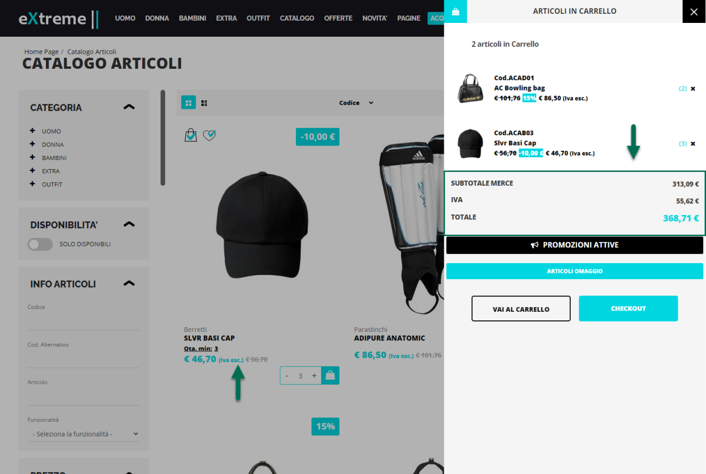

- **Nominativo dell'utente:** in queste condizioni il campo Descrizione
  del corrispondente indirizzo di spedizione Mexal verrà valorizzato con
  il Nome e Cognome / Ragione Sociale dell'utente che sta codificando
  l'indirizzo e a cui l'indirizzo stesso verrà associato all'interno del
  gestionale.

- **Codice Mastro dell'utente:** in queste condizioni il campo
  Descrizione del corrispondente indirizzo di spedizione Mexal verrà
  valorizzato con codice conto dell'utente che sta codificando
  l'indirizzo e a cui l'indirizzo stesso verrà associato all'interno del
  gestionale

- **Indirizzo:** in queste condizioni il campo Descrizione del
  corrispondente indirizzo di spedizione Mexal verrà valorizzato con
  quanto inserito dall'utente in fase di codifica dell'indirizzo stesso
  all'interno del campo "**Indirizzo**"

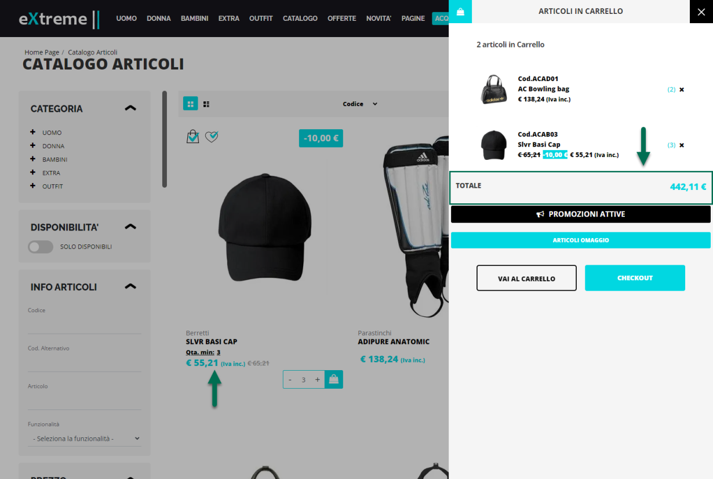

**Se il parametro in oggetto non dovesse essere valorizzato, il campo
"Descrizione" dell'indirizzo di spedizione verrà valorizzato
automaticamente, in fase di inserimento sul gestionale, con quanto
indicato dall'utente all'interno del campo "Nominativo".**

Nel caso in cui anche il campo Nominativo non dovesse essere
valorizzato, all'interno del campo Descrizione verrà inserito
direttamente l'indirizzo di spedizione.

**ATTENZIONE!** Quanto inserito all'interno del campo "**Formato della
Descrizione degli Indirizzi secondari"** verrà poi riportato anche come
primo elemento di ogni singolo indirizzo di spedizione visualizzabile e
selezionabile in fase di checkout ordine dall'apposito menu a tendina.

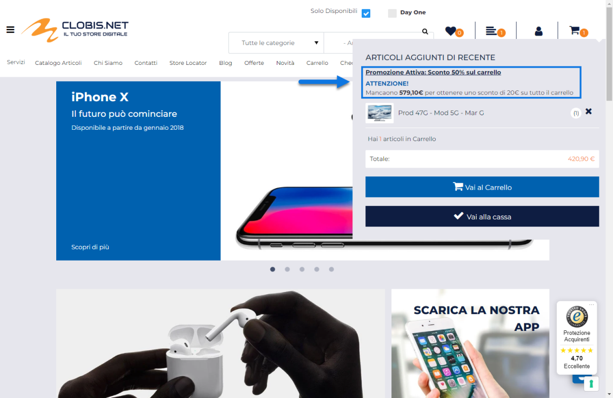

##### IMPOSTAZIONI GENERALI -- GESTIONE ORDINI

All'interno di questa sezione è possibile gestire l'applicazione di un
eventuale minimo d'ordine in relazione agli utenti abilitati ad
effettuare ordini all'interno del sito.

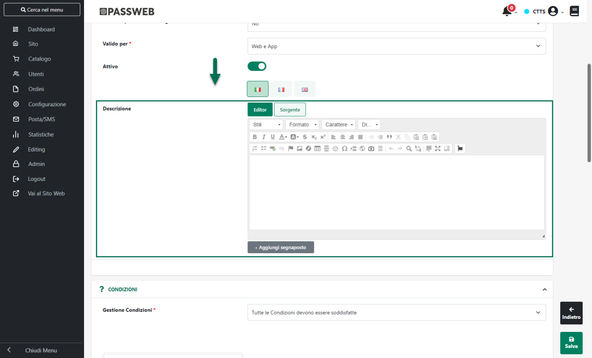

In questo senso il parametro:

**Applicazione Minimo d'Ordine:** consente di impostare la regola che
dovrà essere utilizzata per applicare il minimo d'ordine definito
attraverso il corrispondente parametro. E' possibile selezionare uno dei
seguenti valori

- **Assegnazione in fase di registrazione:** selezionando questo valore
  il minimo d'ordine indicato nel successivo campo verrà applicato
  **solo ed esclusivamente in fase di registrazione di nuovo utente**.

> In queste condizioni dunque:

- per i nuovi utenti che andranno a registrarsi sul sito verrà applicato
  il minimo d'ordine indicato nel successivo campo

- per gli utenti già registrati continueranno invece ad essere valide le
  precedenti condizioni d'ordine, per cui se questi utenti dovessero
  avere un minimo d'ordine già specificato nel corrispondente campo
  Mexal oppure nel relativo campo della loro Anagrafica Passweb
  (Ecommerce Ho.Re.Ca.) questo continuerà ad essere applicato
  indipendentemente da quanto indicato, all'interno di questa sezione
  del Wizard.

> Se invece questi utenti non dovessero avere nessun minimo d'ordine
> associato potranno tranquillamente continuare ad effettuare ordini
> senza dover superare per forza di cose un certo importo minimo.
>
> Nel caso di siti Ecommerce collegati a Mexal, per i nuovi utenti il
> minimo d'ordine verrà, inizialmente, memorizzato sul database di
> Passweb, poi nel momento in cui l'utente effettuerà il suo primo
> ordine, contestualmente all'inserimento in Mexal dell'ordine stesso e
> dell'anagrafica del cliente, verrà inserito nel corrispondente campo
> anche il minimo d'ordine applicata all'utente in fase di registrazione
> sul sito.
>
> Nel caso invece di siti Ecommerce collegati ad uno dei gestionali
> Ho.Re.Ca. il minimo d'ordine resterà sempre memorizzato soltanto sul
> database di Passweb.
>
> Infine considerando che, in queste condizioni, l'associazione del
> minimo d'ordine definito su Passweb al relativo cliente, avviene solo
> ed esclusivamente in fase di registrazione, è bene ricordare anche che
> se successivamente si dovesse poi decidere di modificare il suo
> importo per le nuove registrazione verrà correttamente applicato il
> nuovo minimo d'ordine mentre per gli utenti già registrati continuerà
> ad essere applicato il minimo d'ordine precedentemente considerato.

- **Applicazione in caso di assenza di valori:** selezionando questo
  valore il minimo d'ordine indicato nel successivo campo verrà
  applicato **a tutti gli utenti del sito** (**nuovi e già registrati**)
  per i quali non è ancora stato indicato uno specifico minimo d'ordine
  all'interno del corrispondente campo Mexal o del relativo campo della
  loro Anagrafica Passweb.

> **In queste condizioni, inoltre, anche per i siti Ecommerce collegati
> a Mexal il minimo d'ordine definito su Passweb non verrà mai
> trasferito all'interno del gestionale e resterà quindi memorizzato
> solo ed esclusivamente sul database del sito**.

**Minimo d'Ordine:** consente di specificare un minimo d'ordine, in
valuta di gestione, che dovrà essere necessariamente raggiunto per poter
confermare l'ordine. Tale valore verrà poi considerato ivato o non ivato
dipendentemente da quanto impostato in corrispondenza del successivo
parametro "Gestione Minimo d'Ordine".

**ATTENZIONE!** L'applicazione del minimo d'ordine ai nuovi utenti del
sito e/o agli utenti già registrati avverrà sulla base di quanto
impostato all'interno del precedente parametro "Applicazione Minimo
d'Ordine"

**Gestione Minimo d'Ordine**: consente di decidere se il minimo d'ordine
applicato all'utente dovrà essere considerato o meno comprensivo di iva.

E' possibile selezionare una delle seguenti opzioni:

- **Ivato** -- impostazione di default

> In queste condizioni il minimo d'ordine verrà considerato ivato e, in
> conseguenza di ciò, l'ordine potrà essere concluso solo nel momento in
> cui il valore del **totale merce ivato** dovesse effettivamente
> superare il valore del mimino d'ordine applicato al relativo utente

- **Non Ivato**

> In queste condizioni il minimo d'ordine verrà considerato non ivato e,
> in conseguenza di ciò, l'ordine potrà essere concluso nel momento in
> cui il valore del solo **totale merce** dovesse effettivamente
> superare il valore del mimino d'ordine applicato al relativo utente

##### IMPOSTAZIONI GENERALI -- GESTIONE EMAIL

All'interno di questa sezione è possibile decidere di abilitare o meno
l'invio da parte del sito, ad uno o più indirizzi mail di
amministrazione, di specifiche mail al verificarsi di determinati eventi
quali la registrazione da parte di un nuovo utente e/o l'accesso al sito
(login) da parte di un utente già registrato.

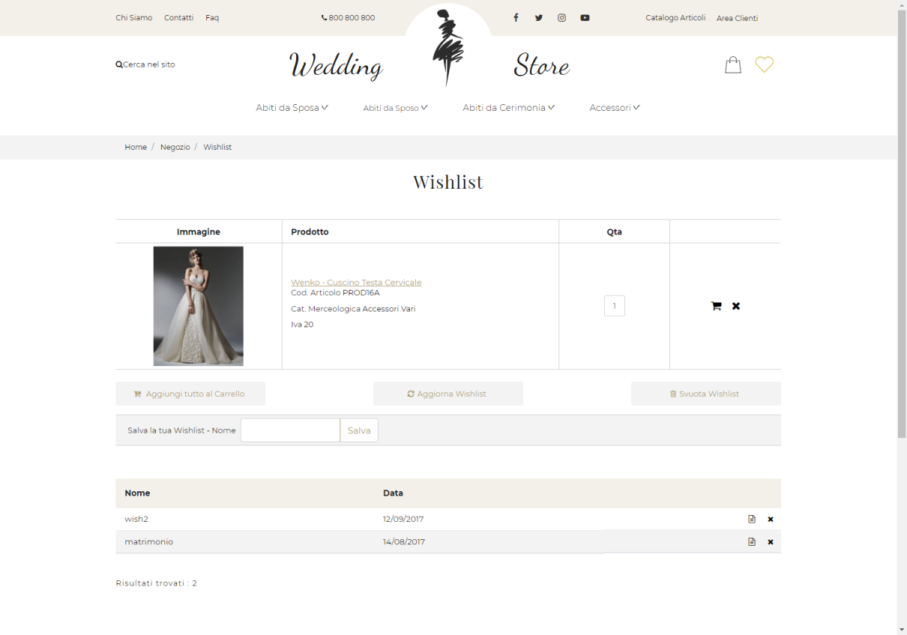

In questo senso dunque il campo:

- **Indirizzi Email per la Email di Informazione Utenti:** consente di
  specificare uno o più indirizzi mail (separati da ;) cui verrà
  inoltrata un'Email di Informazione relativa:

  - all'avvenuta registrazione di un nuovo utente sul sito

  - alla cancellazione da parte di un determinato utente del proprio
    profilo

- **Oggetto per la Email di Informazione Utenti in registrazione /
  Cancellazione:** consente di specificare l'oggetto della mail che
  verrà inviata agli indirizzi indicati all'interno del campo
  "**Indirizzi Email per la Email di Informazione Utenti**"
  ogniqualvolta un nuovo utente effettuerà la registrazione /
  cancellazione al sito.

- **Oggetto per la Email di Informazione Utenti in modifica Profilo:**
  consente di specificare l'oggetto della mail che verrà inviata agli
  indirizzi indicati all'interno del campo "**Indirizzi Email per la
  Email di Informazione Utenti**" ogniqualvolta un utente dovesse
  apportare delle modifiche al proprio profilo.

- **Indirizzi Email per la Email di Login Utenti:** consente di
  specificare uno o più indirizzi mail (separati da ;) cui verrà
  inoltrata un'Email di avviso per notificare l'accesso al sito (login)
  da parte di un utente registrato.

- **Oggetto per la Email di Login Utenti:** consente di specificare
  l'oggetto della mail che verrà inviata agli indirizzi indicati nel
  precedente campo ogniqualvolta un utente registrato effettuerà il
  login al sito.

Il pulsante "**Aggiungi Segnaposto**" presente in corrispondenza di ogni
campo di tipo "**Oggetto per la Email ...**" consente di personalizzare
l'oggetto della relativa mail inserendo appositi segnaposto che verranno
poi valorizzati dinamicamente da Passweb con i dati dello specifico
utente che ha effettuato l'accesso e/o la registrazione al sito .

Per comporre l'oggetto delle mail di "Informazione Utenti" e di "Login
Utenti" è quindi possibile utilizzare i seguenti segnaposto:

- **Cliente:** consente di inserire all'interno del relativo campo
  Oggetto, il segnaposto *\$customer\$* che verrà poi sostituito, in
  fase di creazione della mail, con il nominativo del cliente che ha
  effettuato l'accesso e/o la registrazione al sito

- **Agente:** consente di inserire all'interno del relativo campo
  Oggetto, il segnaposto *\$agent\$* che verrà poi sostituito, in fase
  di creazione della mail, con il nominativo dell'Agente associato al
  cliente che ha effettuato l'accesso e/o la registrazione al sito

> Ovviamente nel caso di registrazione al sito, per fare in modo che il
> segnaposto *\$agent\$* venga valorizzato in maniera corretta sarà
> necessario impostare il sito in maniera tale che, alla registrazione,
> l'utente venga automaticamente inserito in un Gruppo Utenti con
> associato un determinato Agente

- **Nome del sito:** consente di inserire all'interno del relativo campo
  Oggetto, il segnaposto *\$site_name \$* che verrà poi sostituito, in
  fase di creazione della mail, con il nome assegnato al proprio sito
  web

- **Url del Sito:** consente di inserire all'interno del relativo campo
  Oggetto, il segnaposto *\$site_url\$* che verrà poi sostituito, in
  fase di creazione della mail, con l' url del proprio sito web

<!-- -->

- **Se l'utente è un Privato / Pubblica amministrazione / Azienda:** nel
  momento in cui si dovesse decidere di utilizzare uno di questi
  segnaposto, all'interno del campo in esame verrà inserita,
  rispettivamente una delle seguenti istruzioni condizionali

> **\$if(isuserprivate)\$ \$endif\$**
>
> **\$if(isuserpubliccompany)\$ \$endif\$**
>
> **\$if(isusercompany)\$ \$endif\$**
>
> mediante la quale poter differenziare l'oggetto delle mail a seconda
> del fatto che il destinatario sia un Privato, una Pubblica
> Amministrazione o un utente di tipo Azienda.
>
> Nello specifico poi, il testo da inserire nel momento in cui il
> destinatario dovesse essere ad esempio un Privato, dovrà essere
> posizionato tra l' istruzione \$if(isuserprivate)\$ e l'istruzione
> \$endif\$
>
> **NOTA BENE:** per attivare l'invio automatico della mail di
> "Informazione Utenti" e/o di "Login Utenti" è sufficiente impostare,
> nel relativo campo, l'oggetto di queste stesse mail. Nel caso in cui
> non venga indicato nessun oggetto la corrispondente mail non verrà mai
> inviata.
>
> **NOTA BENE:** il testo delle mail di "Informazione Utenti" e "Login
> Utenti" è cablato all'interno di Passweb e non può essere modificato.

##### DATI EMAIL

Oltre alle mail di notifica evidenziate all'interno del precedente
capitolo, e inviate a specifici indirizzi di amministrazione, è
possibile gestire all'interno di Passweb anche tutta una serie di Email
inviate in automatico dall'applicazione ai relativi utenti, al
verificarsi dei seguenti eventi:

- Registrazione di un nuovo utente

- Aggiornamento Profilo Utente

- Cancellazione Profilo Utente

- Attivazione Contatto

- Recupero Credenziali

- Attivazione sessioni concorrenti

Tali mail potranno essere personalizzate sia a livello di Oggetto che a
livello di contenuti operando per questo all'interno della sezione
"**Dati Email**".

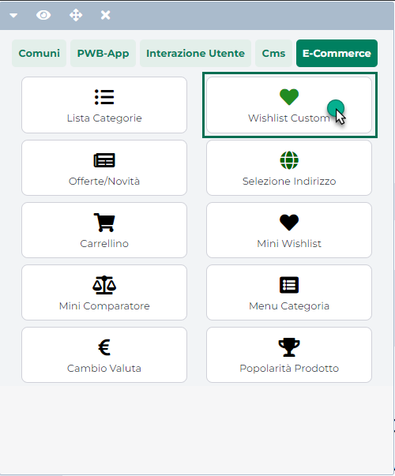

E' possibile indicare uno specifico contenuto ed uno specifico oggetto
per le seguenti mail:

- **E-Mail di Nuovo Utente:** testo dell\'e-mail che verrà inviata
  all\'indirizzo specificato dal cliente all\'atto della registrazione
  sul sito, subito dopo aver completato la registrazione e solo ed
  esclusivamente nel caso in cui questo stesso utente sia gestito con
  una modalità di attivazione "Immediata".

> Tale mail conterrà un riepilogo dei dati forniti dall'utente stesso in
> fase di registrazione.
>
> **NOTA BENE:** nel caso in cui per il parametro "Attivazione Utenti"
> sia stato impostato il valore "Verifica Mail" sarà necessario inserire
> all'interno di questa mail il segnaposto **{{VERIFYURL}}** che sarà
> poi automaticamente sostituito dall'applicazione con il relativo link
> di verifica. In caso contrario il processo di attivazione del nuovo
> utente non potrà mai terminare in maniera corretta.

- **Email Attivazione Differita:** testo dell\'e-mail che verrà inviata
  all\'indirizzo specificato dal cliente all\'atto della registrazione
  sul sito, subito dopo aver completato la registrazione e solo ed
  esclusivamente nel caso in cui questo stesso utente sia gestito con
  una modalità di attivazione "Differita".

> In questo modo è quindi possibile differenziare le mail inviate agli
> utenti di tipo "Privato" e a quelli di tipo "Azienda" nel caso in cui
> per queste due tipologie di utenza si sia scelto di gestire una
> differente modalità di attivazione.

- **Email di Modifica Utente:** testo dell\'e-mail che verrà inviata
  all\'indirizzo specificato dal cliente all\'atto della registrazione
  sul sito, nel momento in cui il cliente stesso apporterà,
  confermandole, delle variazioni ai propri dati personali.

> **ATTENZIONE!** Il parametro "**Password nella Email**" presente
> all'interno di questa sezione consente, se selezionato, di inserire
> nelle mail inviate dall'applicazione a seguito della registrazione di
> un nuovo utente e/o della variazione dei propri dati anagrafici anche
> la Password (in chiaro) utilizzata dall'utente stesso per effettuare
> l'autenticazione al sito.

- **Email di Attivazione Contatti:** testo dell\'e-mail che verrà
  inviata all\'indirizzo specificato dal cliente all\'atto della
  registrazione sul sito, nel momento in cui l'amministratore del sito
  deciderà di attivare il corrispondente Contatto. All'interno di questa
  mail verranno inserite le credenziali di accesso al sito indicate
  dall'utente all'atto della registrazione

- **Email Cancellazione Utente:** testo dell'e-mail che verrà inviata
  all\'indirizzo specificato dal cliente all\'atto della registrazione
  sul sito, nel momento in cui l'utente dovesse decidere di eliminare il
  proprio profilo annullando di fatto la sua registrazione.

- **Email di Recupero Credenziali:** testo dell\'e-mail che verrà
  inviata all\'indirizzo specificato dal cliente all\'atto della
  registrazione sul sito, nel momento in cui l'utente richieda, mediante
  il corrispondente componente, di farsi inviare nuovamente le proprie
  credenziali di accesso. Il contenuto di tale mail dipende da come è
  stato impostato il componente **"Recupero Credenziali"** (per maggiori
  informazioni in merito si veda anche la sezione *"Live Editing --
  Lista Componenti Interazione Utente -- Recupero Credenziali"* di
  questo manuale).

> **NOTA BENE:** nel caso in cui per il parametro "Tipologia di recupero
> credenziali" sia stato impostato il valore "Invio link con Modifica
> della Password" sarà necessario inserire all'interno di questa mail il
> segnaposto **{{VERIFYURL}}** che sarà poi automaticamente sostituito
> dall'applicazione con il relativo link di "Cambio Password".

- **Email di Sessioni Concorrenti:** testo dell'email che verrà inviata
  automaticamente all\'indirizzo specificato dal cliente all\'atto della
  registrazione sul sito, nel momento in cui si dovesse verificare
  l'accesso al front end da parte un dispositivo/browser diverso (anche
  per indirizzo IP) da quello in cui lo stesso utente risulta aver già
  effettuato l'autenticazione (e per il quale è ovviamente ancora in
  corso la relativa sessione di navigazione)

Il pulsante "**Aggiungi Segnaposto**" presente in corrispondenza di ogni
campo di tipo "**Oggetto Email**" e "**Testo Email**" consente di
personalizzare l'oggetto e il testo della relativa mail inserendo
appositi segnaposto che verranno poi valorizzati dinamicamente da
Passweb con i dati dello specifico utente che ha effettuato una
determinata azione.

Nello specifico per comporre l'oggetto delle mail presenti all'interno
di questa sezione del Wizard è possibile utilizzare i seguenti
segnaposto:

- **Cliente:** consente di inserire all'interno del relativo campo, il
  segnaposto *\$customer\$* che verrà poi sostituito, in fase di
  creazione della mail, con il nominativo del cliente che ha effettuato
  l'accesso e/o la registrazione al sito

- **Agente:** consente di inserire all'interno del relativo campo, il
  segnaposto *\$agent\$* che verrà poi sostituito, in fase di creazione
  della mail, con il nominativo dell'Agente associato al cliente che ha
  effettuato l'accesso e/o la registrazione al sito

> Ovviamente nel caso di registrazione al sito, per fare in modo che il
> segnaposto *\$agent\$* venga valorizzato in maniera corretta sarà
> necessario impostare il sito in maniera tale che, alla registrazione,
> l'utente venga automaticamente inserito in un Gruppo Utenti con
> associato un determinato Agente

- **Nome del sito:** consente di inserire all'interno del relativo
  campo, il segnaposto *\$site_name \$* che verrà poi sostituito, in
  fase di creazione della mail, con il nome assegnato al proprio sito
  web

- **Url del Sito:** consente di inserire all'interno del relativo campo,
  il segnaposto *\$site_url\$* che verrà poi sostituito, in fase di
  creazione della mail, con l' url del proprio sito web

<!-- -->

- **Se l'utente è un Privato / Pubblica amministrazione / Azienda:** nel
  momento in cui si dovesse decidere di utilizzare uno di questi
  segnaposto, all'interno del campo in esame verrà inserita,
  rispettivamente una delle seguenti istruzioni condizionali

> **\$if(isuserprivate)\$ \$endif\$**
>
> **\$if(isuserpubliccompany)\$ \$endif\$**
>
> **\$if(isusercompany)\$ \$endif\$**
>
> mediante la quale poter differenziare l'oggetto delle mail a seconda
> del fatto che il destinatario sia un Privato, una Pubblica
> Amministrazione o un utente di tipo Azienda.
>
> Nello specifico poi, il testo da inserire nel momento in cui il
> destinatario dovesse essere ad esempio un Privato, dovrà essere
> posizionato tra l' istruzione \$if(isuserprivate)\$ e l'istruzione
> \$endif\$

**NOTA BENE:** **per attivare l'invio di una delle mail presenti
all'interno di questa sezione è sufficiente specificare per essa un
oggetto. Nel caso in cui non venga indicato nessun oggetto la relativa
mail non verrà mai inviata**.

Per quel che riguarda invece il testo delle mail, oltre ai segnaposto
appena analizzati, sarà possibile utilizzare anche il segnaposto
**"Dettaglio Form"**

In questo senso è bene ricordare che il testo delle mail utente,
configurabili all'interno dei questa sezione del Wizard, è composto,
essenzialmente, da due distinti elementi:

- Un "**Testo libero**"

- **Il dettaglio del form**, ossia i dati inseriti dall'utente sul front
  end del sito in fase di compilazione del form stesso

Il segnaposto "Dettaglio Form" consente quindi di inserire quest'ultimo
elemento in una qualsiasi posizione della relativa mail.

**ATTENZIONE!** Nel caso in cui si decida di non utilizzare nel testo di
una mail il segnaposto "Dettaglio Form" i dati del relativo form utente
verranno inseriti come ultimo elemento della corrispondente mail

Per maggiori informazioni relativamente a come poter personalizzare il i
contenuti del "Dettaglio Form" si veda anche il successivo capitolo di
questo manuale.

##### FORM

All'interno della sezione **Form** è possibile gestire e personalizzare
il Template utilizzato per la costruzione e la visualizzazione del
dettaglio del form utente, ossia dei dati inseriti dall'utente sul front
end del sito in fase di compilazione del form stesso

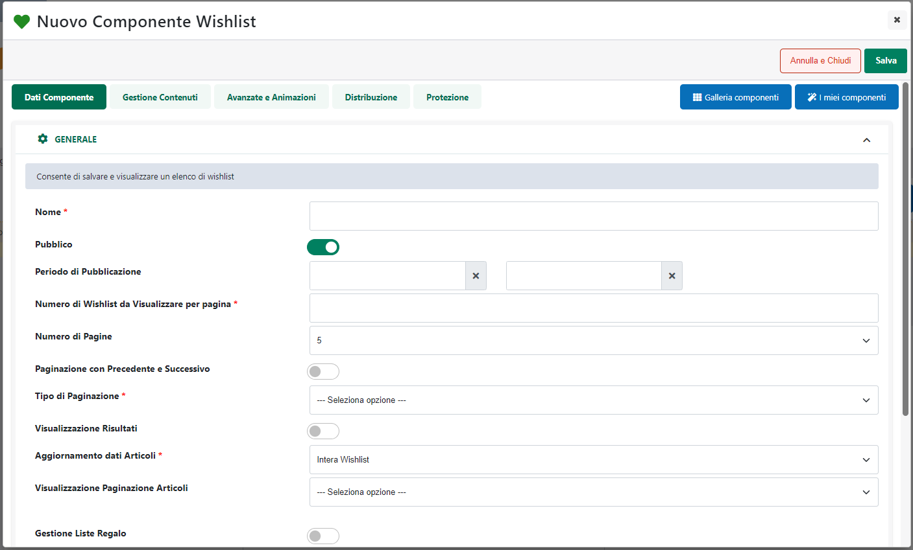

Nel momento in cui l'esigenza dovesse essere dunque quella di
personalizzare, all'interno di una mail, i dati inseriti dall'utente sul
front end del sito in fase di compilazione del relativo form, sarà
necessario agire sul codice HTML presente all'interno del campo
"**Dettaglio**" evidenziato in figura.

Volendo è possibile aprire l'editor in modalità full screen utilizzando
il tasto funzione **F11**.

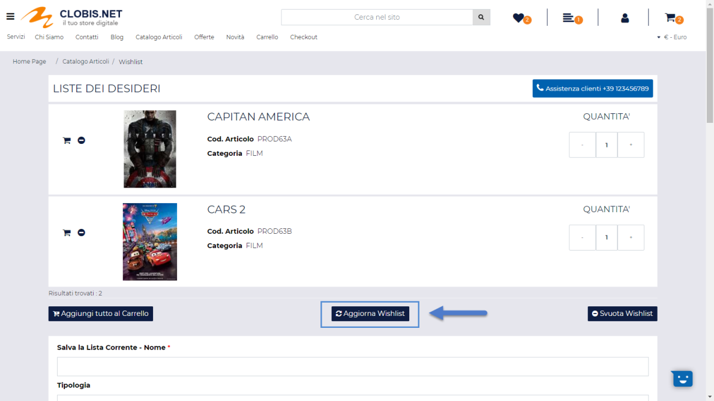

Una volta entrati in modalità full screen è poi possibile ritornare alla
visualizzazione standard utilizzando il tasto **ESC**.

Il pulsante "**Preview**" presente nella parte alta della maschera
consente invece di visualizzare un'anteprima del Template che si sta
realizzando, dove, ovviamente, al posto dei dati reali relativi ai campi
del form, verranno visualizzati appositi segnaposto.

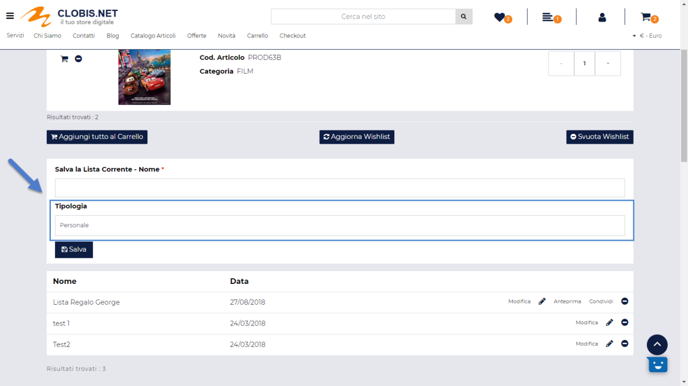

In modalità Preview è possibile selezionare uno qualsiasi degli elementi
presenti all'interno del Template **(2)**.

Cliccandoci sopra si passerà automaticamente alla versione
"**Sorgente**" del template con evidenziata la riga di codice relativa
all'elemento selezionato

La possibilità di intervenire direttamente sul codice HTML del template
offre, indubbiamente, ampie possibilità di personalizzazione.

**D'altra parte dovendo intervenire direttamente sul codice HTML questo
tipo di personalizzazione richiede chiaramente specifiche conoscenze
tecniche.**

In questo senso Passweb viene comunque in aiuto dell'utente in due modi
diversi.

Innanzi tutto il pulsante "**Default**" presente immediatamente al di
sotto dell'editor HTML consente di impostare una struttura di base per
il form utente, comprensiva di tutti gli elementi effettivamente
gestibili.

Inoltre nel momento in cui il template auto generato non dovesse
soddisfare le specifiche esigenze del caso, e ci fosse quindi la
necessità di integrarlo a livello di contenuti con altre informazioni,
sarà possibile sfruttare uno degli appositi segnaposto messi a
disposizione da Passweb.

In questo senso una volta posizionato il cursore nel punto del template
in cui dovrà essere inserita la nuova informazione, sarà necessario
cliccare sul pulsante "**Seleziona un segnaposto ...**" in maniera tale
da visualizzare l'elenco di tutti i segnaposto disponibili

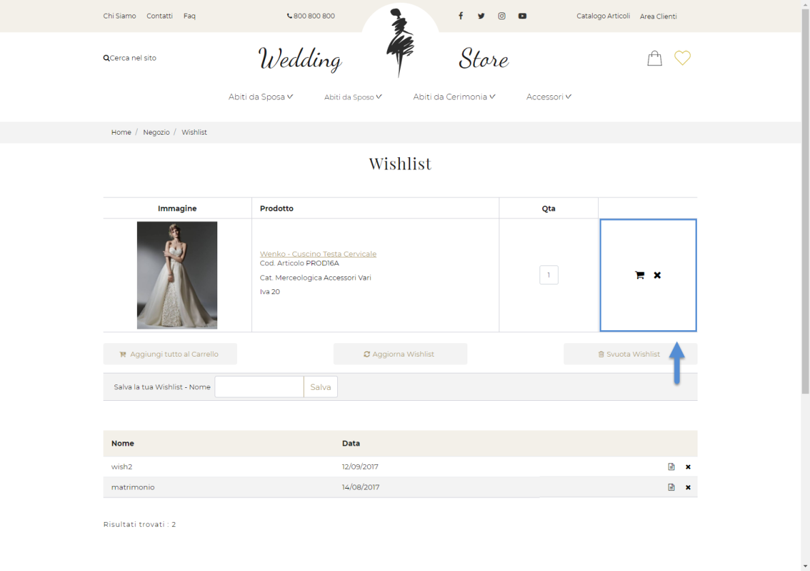

Selezionando quindi il segnaposto desiderato tra quelli presenti in
elenco, Passweb provvederà poi ad inserire automaticamente nel template
tutto il codice necessario per gestire quello specifico tipo di
informazione.

In particolare gli elementi presenti all'interno della sezione
"**Condizioni Form**" consentono di introdurre apposite istruzioni
condizionali mediante le quali poter differenziare il Template in
relazione alla specifica tipologia di Mail da inviare.

Nello specifico il segnaposto:

- **Se Registrazione** dovrà essere utilizzato per identificare il testo
  della mail da inviare agli utenti che hanno effettuato la
  registrazione al sito indipendentemente dal fatto che siano gestiti
  con attivazione immediata o differita

- **Se Mail Registrazione Utente** dovrà essere utilizzato per
  identificare il testo della mail da inviare agli utenti che hanno
  effettuato la registrazione al sito e che sono gestiti con attivazione
  immediata

- **Se Mail Attivazione Differita** dovrà essere utilizzato per
  identificare il testo della mail da inviare agli utenti che hanno
  effettuato la registrazione al sito e che sono gestiti con attivazione
  differita

- **Se Mail Attivazione Contatti** dovrà essere utilizzato per
  identificare il testo della mail da inviare nel momento in cui
  l'amministratore del sito deciderà di attivare un determinato Contatto

- **Se Profilo** dovrà essere utilizzato per identificare il testo della
  Mail da inviare nel momento in cui un determinato utente dovesse
  apportare modifiche ai dati del proprio Profilo

- **Se Invio Credenziali** dovrà essere utilizzato per identificare il
  testo della Mail da inviare nel momento in cui un utente dovesse ad
  esempio effettuare la registrazione al sito mediante Social Network

- **Se Mail Recupero Credenziali** dovrà essere utilizzato per
  identificare il testo della Mail da inviare nel momento in cui un
  utente del sito dovesse avviare la procedura di Recupero Credenziali

Gli elementi presenti all'interno della sezione "**Condizioni Gruppi**"
consentono di introdurre apposite istruzioni condizionali mediante le
quali poter differenziare il Template in relazione al gruppo di
appartenenza dell'utente cui dovrà essere recapitata la mail.

Nello specifico il segnaposto:

**Se l'utente appartiene al Gruppo \< Nome Gruppo \>** dovrà essere
utilizzato per identificare il testo della mail da inviare

Gli elementi presenti all'interno della sezione "**Condizioni Utente**"
consentono di introdurre apposite istruzioni condizionali mediante le
quali poter differenziare il Template in relazione alla tipologia di
utente cui dovrà essere recapitata la mail.

Nello specifico il segnaposto:

- **Se l'utente è un privato** dovrà essere utilizzato per identificare
  il testo della mail da inviare esclusivamente agli utenti di tipo
  "Azienda"

- **Se l'utente è un'Azienda** dovrà essere utilizzato per identificare
  il testo della mail da inviare esclusivamente agli utenti di tipo
  "Privato"

- **Se l'utente è una Pubblica Amministrazione** dovrà essere utilizzato
  per identificare il testo della mail da inviare esclusivamente agli
  utenti di tipo "Pubblica Amministrazione"

Gli elementi presenti all'interno della sezione "**Campi Form**"
consento infine di:

- **Etichetta:** consente di inserire nel Template del form la label dei
  vari campi

- **Valore:** consente di visualizzare nel Template del form il dato
  inserito dall'utente stesso, in fase di compilazione del form,
  all'interno dei vari campi

- **Ciclo -- Campi Form:** consente di inserire l'istruzione necessaria
  per creare un ciclo di iterazione su tutti i campi del form, in
  maniera tale quindi da non dover gestire, individualmente ogni singolo
  campo.

> Selezionando questo elemento nel Template verranno inserite le
> seguenti istruzioni
>
> **\$listValues:{**
>
> **}\$**
>
> Fatto questo andranno poi inseriti tra le due parentesi graffe i
> segnaposto relativi all'etichetta e/o al valore dei campi del form.
>
> In questo caso ovviamente tutti i campi del form verranno tratti e
> gestiti allo stesso modo

Nel caso in cui l'esigenza dovesse essere invece quella di formattare
individualmente i singoli campi del form, sarà possibile indirizzare
questi stessi campi **facendo riferimento al loro attributo "name"**.

**ATTENZIONE!** Il valore dell'attributo "name" di uno specifico campo
del form può essere ottenuto analizzando, sul front end del sito il DOM
della pagina, oppure, più semplicemente, lato Wizard, selezionando il
componente desiderato e cliccando sull' icona "**Informazioni
Componente**" (
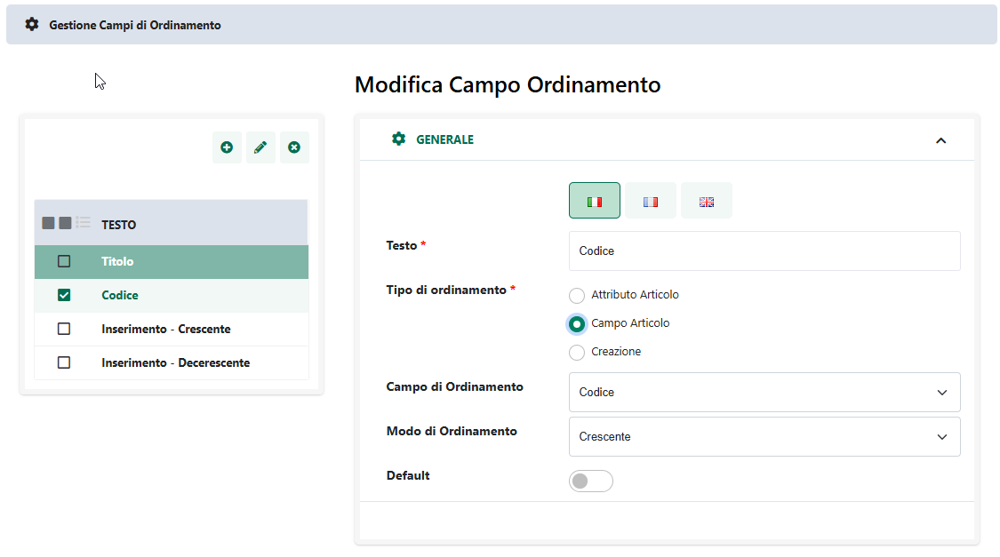 )

Ovviamente in queste condizioni non dovrà essere creato alcun ciclo e
ogni singolo campo del form andrà inserito e gestito manualmente
all'interno del Template

In questo senso per inserire nel Template del form la label e/o il
valore di uno specifico campo sarà necessario utilizzare le seguenti
variabili:

- **\$\<name\>\_key\$** - consente di inserire nel Template del form la
  label di uno specifico campo

- **\$\<name\>\_value\$** - consente di inserire nel Template del form
  il dato di uno specifico campo

dove \<name\> dovrà essere sostituito con il valore dell'attributo
"name" del relativo campo

Supponendo quindi di voler inserire nel Template del form, ad esempio,
il campo relativo al "Cognome" dell'utente sarà necessario, per prima
cosa, individuare il valore del suo attributo name

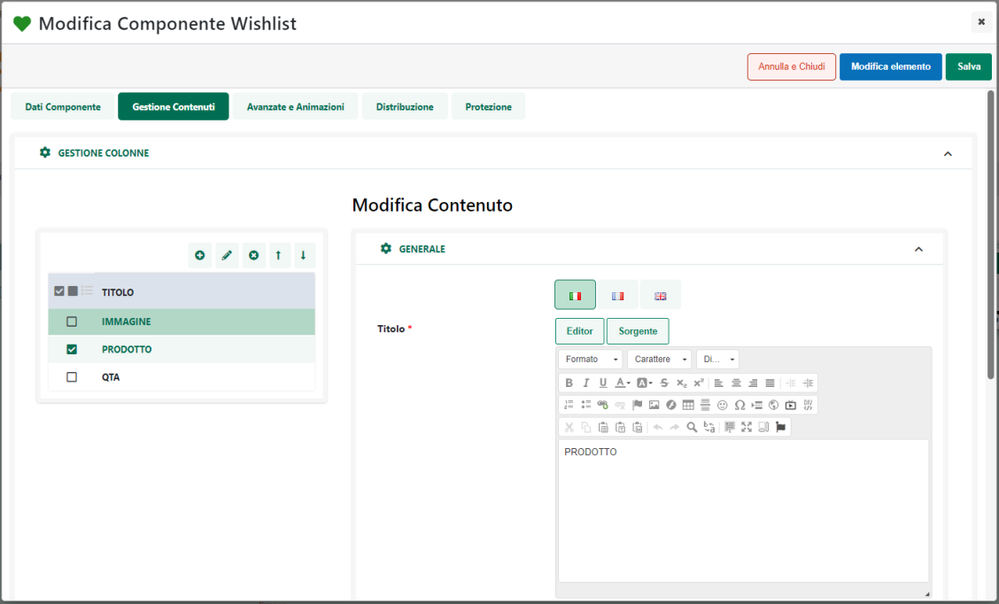

valore questo che, come evidenziato in figura, è esattamente
"**last_name**", e successivamente sarà necessario inserire nel Template
del form le seguenti variabili: **\$last_name_key\$** (per gestire la
label del campo) e **\$last_name_value\$** (per gestire il valore del
campo)

Una volta definito e personalizzato il Template da utilizzare per i vari
Form Utente, questo potrà poi essere inserito nel corpo di una qualsiasi
mail (di Registrazione, di Profilo, di Recupero Credenziali ecc..)
utilizzando il segnaposto "**Dettaglio Form**".

Per maggiori informazioni in merito ai segnaposto utilizzabili nel corpo
delle mail utente si veda anche il precedente capitolo di questo manuale

