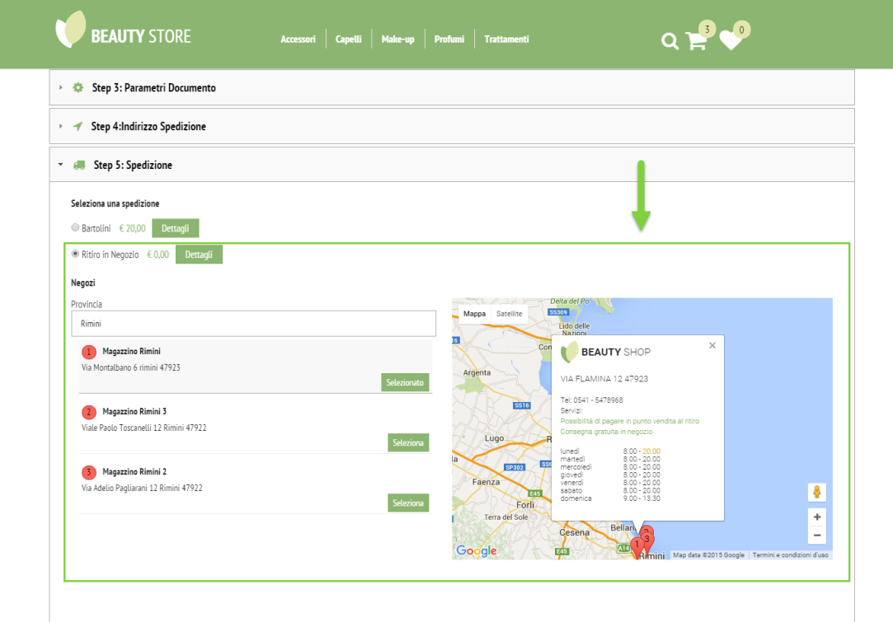
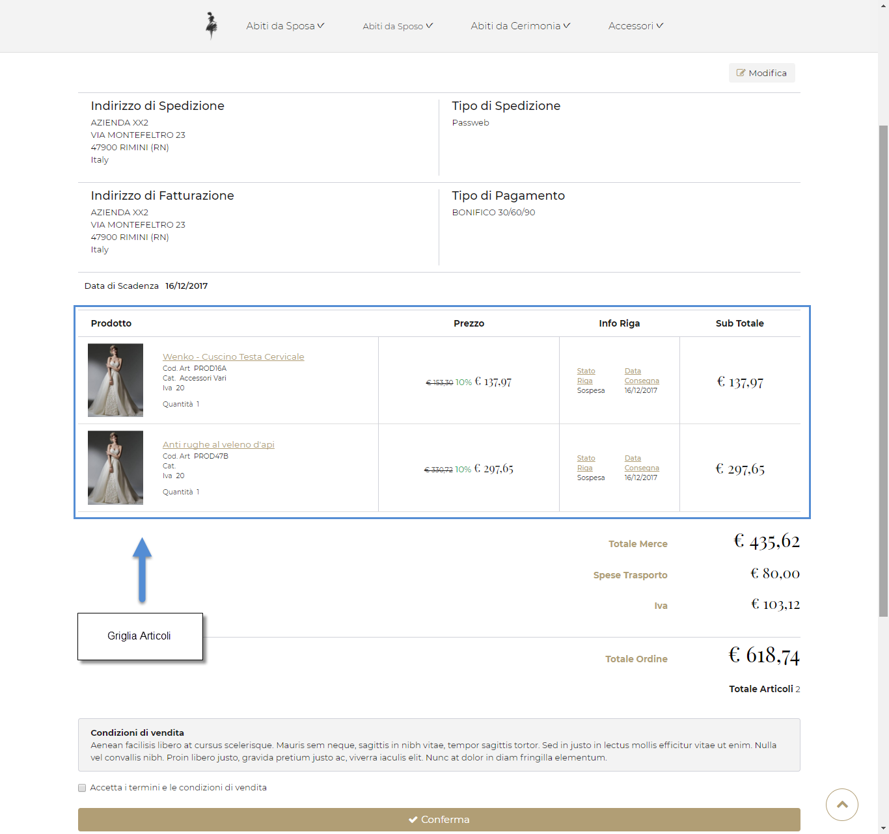
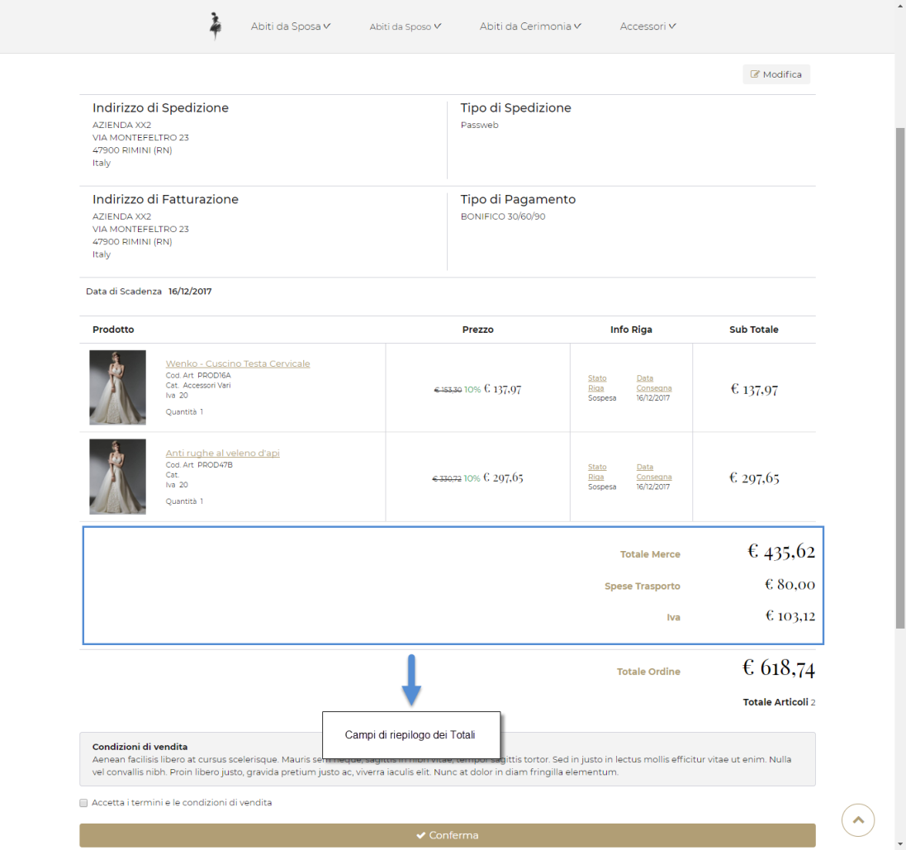
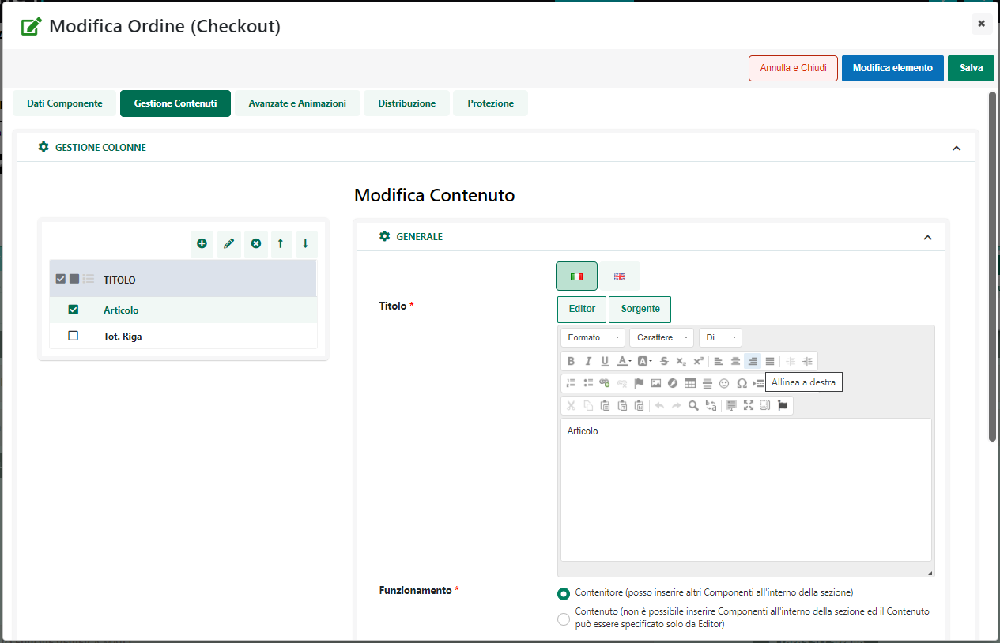
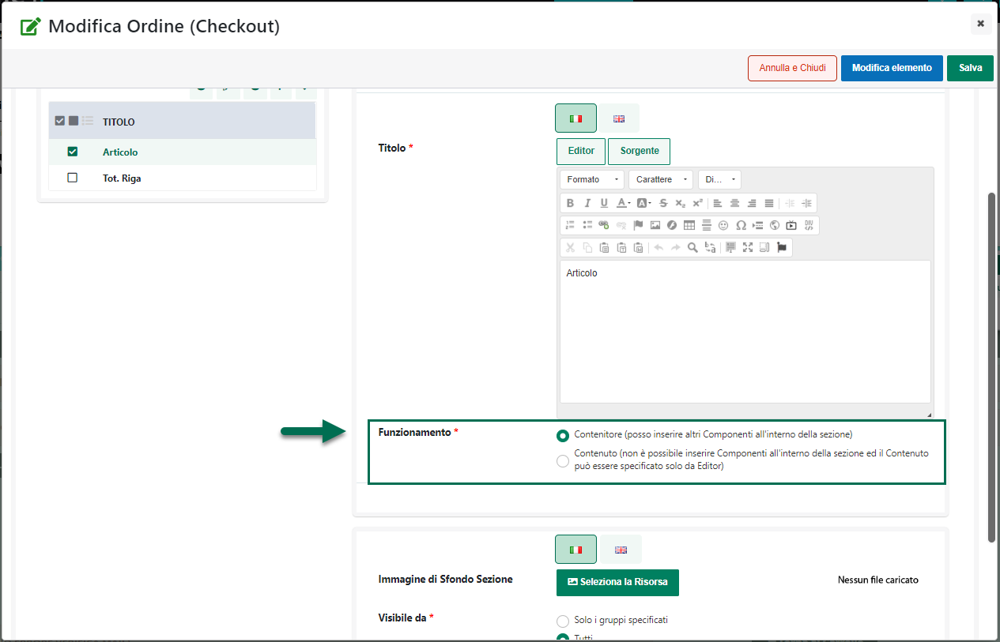
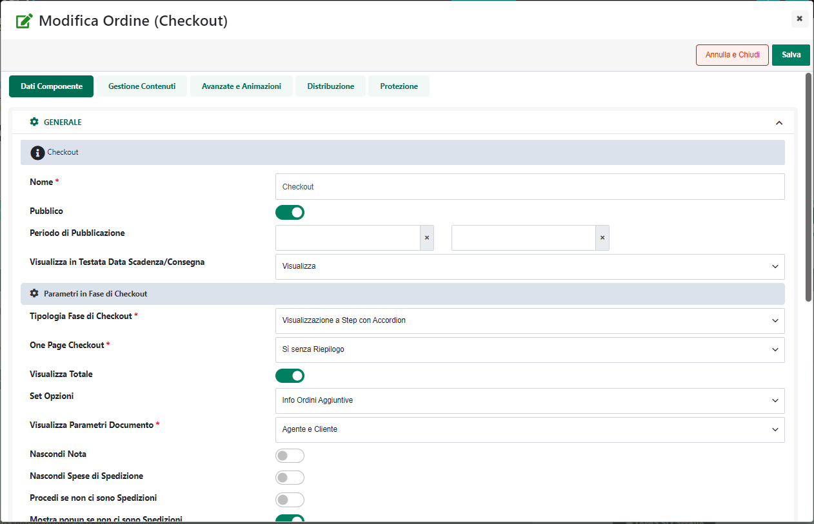
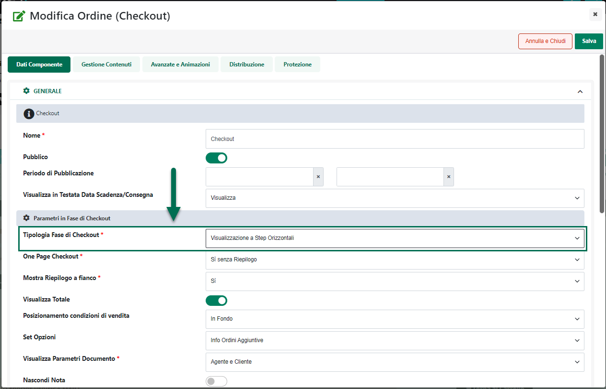
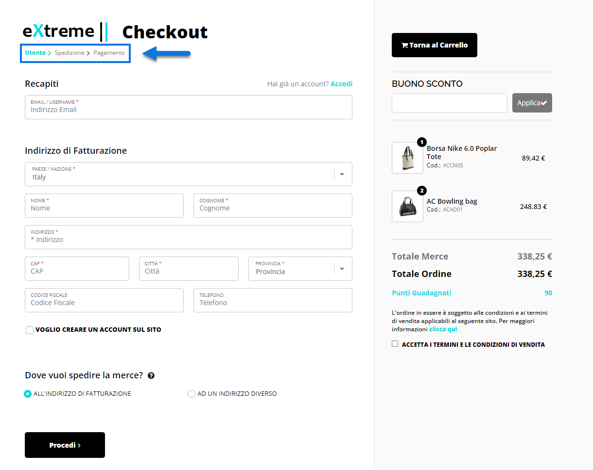
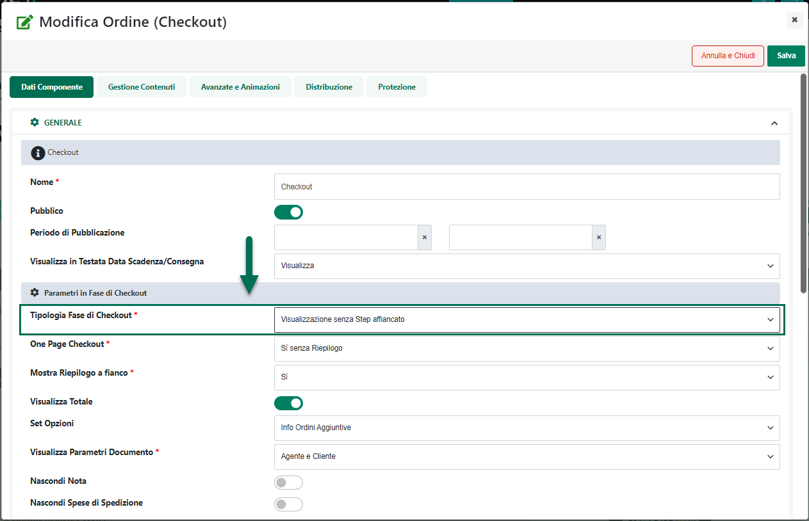
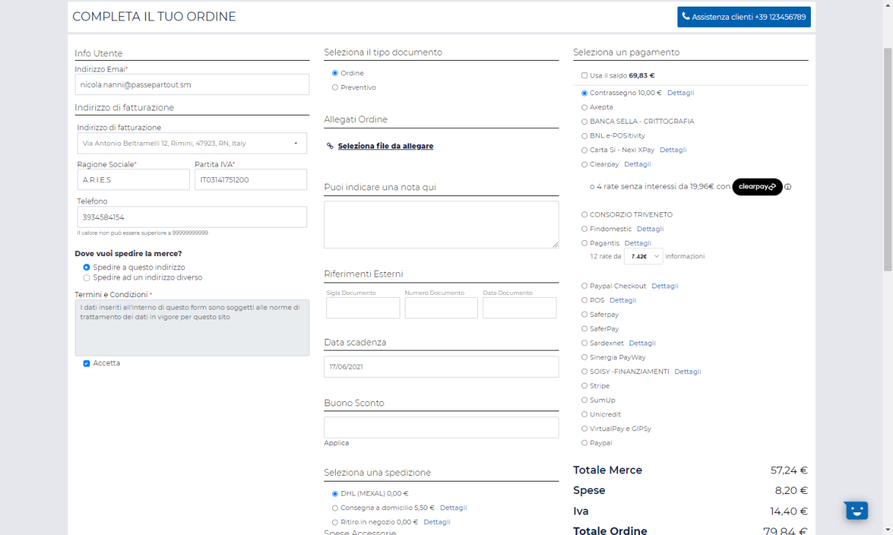

# TIPOLOGIA

All'interno di questa sezione del Wizard è possibile gestire le due
tipologie di Wishlist attivabili all'interno del sito.

Effettuando l'accesso verrà visualizzata la maschera **"Lista
Tipologie"**

all'interno della quale poter trovare le due tipologie di Wishlist
gestibili all'interno del sito:

- **Wishlist Personali**: sono liste di articoli gestibili unicamente
  dallo stesso utente che le ha create e salvate.

> Per maggiori informazioni in merito si veda anche la sezione "*Lista
> Componenti Ecommerce -- Componente Wishlist Custom -- Wishlist
> Personali"* di questo manuale

- **Liste Regalo**: sono liste di articoli, selezionati da un
  determinato utente (il creatore della lista), e che altri utenti
  opportunamente abilitati (con i quali è stata cioè condivisa la lista
  stessa) potranno acquistare, fino ad esaurimento della lista stessa,
  accedendo all'apposita sezione del sito.

> Per maggiori informazioni in merito si veda anche la sezione "*Lista
> Componenti Ecommerce -- Componente Wishlist Custom -- Wishlist per
> Liste Regalo"* di questo manuale.

Il pulsante "**Modifica Tipologia**"
( ) consente di accedere alla maschera di
configurazione della Tipologia attualmente selezionata in elenco.

I campi presenti all'interno di questa maschera consentono
rispettivamente di:

- **Descrizione**: consente di personalizzare la descrizione di ognuna
  delle due tipologie di Wishlist gestite.

> Le descrizioni impostate all'interno di questa maschera del Wizard
> rappresenteranno poi le due possibili opzioni tra cui un utente dovrà
> scegliere, e che verranno quindi visualizzate sul front end del sito,
> nel componente Wishlist (campo "**Tipologia**"), nel momento in cui
> questo stesso utente dovesse decidere di salvare una Wishlist.

> **ATTENZIONE!** Il campo Tipologia verrà visualizzato, ovviamente,
> solo ad utenti autenticati e solo nel caso in cui il per il relativo
> componente "Wishlist Custom" sia stato selezionato (in fase di
> configurazione del componente stesso) il parametro "**Gestione Lista
> Regalo"**

- **Email -- presente solo per la tipologia** "**Lista Regalo"**.
  Consente di attivare la condivisione delle Liste Regalo anche via
  Email

> Una volta selezionato questo parametro infatti, nel form di
> condivisione della Lista Regalo sul front end del sito, comparirà
> anche la sezione "**Condividi tramite Email**"

> all'interno della quale poter indicare, nei rispettivi campi, l'elenco
> degli indirizzi mail di quelli che dovranno essere gli "invitati" alla
> lista, oltre che un messaggio da inserire nel corpo della mail che
> verrà loro inviata al salvataggio della Lista stessa.
>
> **ATTENZIONE! nel caso in cui l'esigenza dovesse essere quella di
> consentire agli utenti del sito di condividere via mail le proprie
> liste regalo è necessario accertarsi di aver selezionato il parametro
> "Email" appena esaminato**
>
> In caso contrario infatti eventuali liste regalo potranno essere
> condivisibili solo ed esclusivamente via Social Network
>
> Inoltre affinchè la condivisione via mail possa andare a buon fine
> sarà necessario accertarsi anche di aver selezionato, in fase di
> configurazione del componente "Wishlist Custom", il parametro
> "Gestione Liste Regalo" e, soprattutto, di aver configurato
> correttamente l'integrazione tra il proprio sito Passweb e MailChimp e
> di aver creato un'apposita campagna di tipo "Lista Regalo".
>
> Per maggiori informazioni in merito si veda anche la sezione "*Lista
> Componenti Ecommerce -- Componente Lista Regalo -- Condivisione di una
> Lista Regalo"* di questo manuale.

- **Indirizzo Spedizione** -- **presente solo per la tipologia**
  "**Lista Regalo"**. Se selezionato, consente di attivare nel form di
  creazione della Lista Regalo il campo relativo alla selezione
  dell'indirizzo di spedizione

> Nel caso in cui, dunque, si dovesse decidere di non selezionare questo
> parametro, poi in fase di creazione della Wishlist l'utente del sito
> non avrà la possibilità di associare alla Lista stessa uno specifico
> indirizzo di spedizione.
>
> **ATTENZIONE!** In conseguenza di ciò gli utenti che andranno ad
> acquistare articoli della lista regalo, in fase di checkout, non
> avranno più la possibilità di far inviare gli articoli direttamente al
> gestore della lista ma potranno scegliere di farsi inviare la merce
> solo ed esclusivamente ad un loro specifico indirizzo di spedizione.

- **Template**: consente di impostare il template che dovrà poi essere
  utilizzato nella stampa delle relative Wishlist.

> Nel momento in cui l'esigenza dovesse essere dunque quella di
> personalizzare la stampa delle Liste Regalo di una determinata
> tipologia, sarà necessario agire sul codice HTML presente all'interno
> del campo evidenziato in figura.
>
> Volendo è possibile aprire l'editor in modalità full screen
> utilizzando il tasto funzione **F11**.
>
> Una volta entrati in modalità full screen è poi possibile ritornare
> alla visualizzazione standard utilizzando il tasto **ESC**.
>
> Il pulsante "**Preview**" consente invece di visualizzare un'anteprima
> del Template che si sta realizzando, dove, ovviamente, al posto dei
> dati reali relativi ai campi del form, verranno visualizzati appositi
> segnaposto.
>
> In modalità Preview è anche possibile selezionare uno qualsiasi degli
> elementi presenti all'interno del Template. Cliccandoci sopra si
> passerà automaticamente alla versione "**Sorgente**" con evidenziata
> la riga di codice relativa all'elemento selezionato

**ATTENZIONE!** La possibilità di intervenire direttamente sul codice
HTML del template offre, indubbiamente, ampie possibilità di
personalizzazione. **D'altra parte dovendo intervenire direttamente sul
codice HTML questo tipo di personalizzazione richiede anche specifiche
conoscenze tecniche.**

In fase di creazione del Template di stampa, per accedere alle varie
informazioni sugli articoli sarà possibile utilizzare i diversi
segnaposto messi a disposizione da Passweb

In questo senso una volta posizionato il cursore nel punto del template
in cui dovrà essere inserita la nuova informazione, sarà sufficiente
cliccare sul pulsante "**Seleziona un segnaposto ...**" per visualizzare
l'elenco di tutti i segnaposto disponibili.

Selezionando quindi il segnaposto desiderato tra quelli presenti in
elenco, Passweb provvederà poi ad inserire automaticamente nel template
tutto il codice necessario per gestire quello specifico tipo di
informazione

E' possibile selezionare differenti tipologie di segnaposto:

- **Campi Riga Wishlist**: all'interno di questa sezione è possibile
  trovare segnaposto che fanno riferimento ai vari articoli presenti
  all'interno della Wishlist. Sono gestite quindi informazioni relative
  a campi gestionali quali Codice Articolo, Titolo, Immagine, Prezzo,
  Sconto, Quantità Nota, ..., piuttosto che relative ad un qualsiasi
  attributo Passweb gestito all'interno del sito.

> **Ovviamente questo tipo di informazioni andranno ripetute e
> contestualizzate per ogni singola riga presente nella Wishlist per cui
> i relativi segnaposto, ed il codice HTML "di contorno", andranno
> necessariamente inseriti in un apposito ciclo che permetta di ripetere
> l'informazione per ogni singola riga articolo.**
>
> In questo senso il segnaposto "**CICLO -- Articoli Wishlist**",
> presente all'interno di questa sezione, consente di inserire
> l'istruzione necessaria per gestire questo tipo di ciclo. Selezionando
> questo elemento nel Template verranno infatti inserite le seguenti
> istruzioni
>
> **\$wishlistItems:{**
>
> **}\$**
>
> Il codice HTML e i segnaposto inseriti tra le due parentesi graffe
> dell'istruzione sopra evidenziata verranno quindi ripetuti e
> contestualizzati per ogni singola riga articolo presente nel
> documento.
>
> **ATTENZIONE!** nel caso in cui i segnaposto relativi alle
> informazioni sugli articoli non siano stati inseriti all'interno di
> questo ciclo, in fase di generazione del documento non potranno poi
> essere sostituiti con i relativi dati.

- **Campi Taglie Riga Wishlist** **(Ecommerce Mexal):** all'interno di
  questa sezione è possibile trovare i segnaposto relativi alle
  informazioni sugli articoli a taglie (nello specifico la taglia e la
  relativa quantità dell' articolo presente in Wishlist).

> In questo senso il segnaposto "**CICLO -- Taglie Articolo**", presente
> all'interno di questa sezione, consente di inserire l'istruzione
> necessaria per creare un ciclo di iterazione su tutte le taglie degli
> articoli in Wishlist.
>
> Selezionando questo elemento nel Template verranno infatti inserite le
> seguenti istruzioni
>
> **\$it.entryListSize:{s\|**
>
> **}\$**
>
> Fatto questo andranno poi inseriti tra le due parentesi graffe i
> segnaposto relativi alla taglia e/o alla quantità dello specifico
> articolo. In questo modo sarà quindi possibile inserire nel template
> di stampa della Wishlist la tabellina di dettaglio delle singole
> taglie e le relative quantità.
>
> **ATTENZIONE!** nel caso in cui i segnaposto relativi alla taglia e/o
> alla quantità non siano stati inseriti all'interno di questo ciclo, in
> fase di generazione del documento non saranno sostituiti con i
> relativi dati.
>
> Tipicamente, infine, il ciclo sulle taglie è preceduto dal segnaposto
> relativo alla Condizione Riga Wishlist "**Se è un articolo a taglie**"

- **Condizioni Riga Wishlist**: i segnaposto presenti all'interno di
  questa sezione permettono di inserire nel template di stampa delle
  istruzioni mediante le quali poter condizionare la visualizzazione di
  determinate informazioni al fatto che gli articoli presenti in lista
  siano articoli semplici oppure articoli a taglie.

> Supponendo dunque di selezionare il segnaposto "**Se è un articolo a
> taglie**" nel template verranno inserite le seguenti istruzioni
>
> **\$if(it.entrySize)\$**
>
> **\$endif\$**
>
> In questo modo tutto il codice HMTL e i vari segnaposto inseriti tra
> le due istruzioni sopra evidenziate verranno visualizzati solo ed
> esclusivamente nel momento in cui l'articolo considerato sia
> effettivamente un articolo a taglie

- **Campi Piede Wishlist:** all'interno di questa sezione è possibile
  trovare i segnaposto relativi ad informazioni da inserire nel Piede
  del documento di documento di stampa come ad esempio il Totale Merce
  degli articoli attualmente presenti in lista

- **Condizioni Gruppi**: i segnaposto presenti all'interno di questa
  sezione permettono di inserire nel template di stampa delle istruzioni
  mediante le quali poter condizionare la visualizzazione di determinate
  informazioni all'appartenenza dell'utente ad uno dei Gruppi Utente
  gestiti all'interno del sito.

> Supponendo dunque di selezionare il segnaposto "**Se l'utente
> appartiene al Gruppo Clienti Agente Rossi**" (dove "Clienti Agente
> Rossi" è un gruppo creato all'interno dell'apposita sezione del
> Wizard) nel template verranno inserite le seguenti istruzioni
>
> **\$if(id_gruppo)\$**
>
> **\$endif\$**
>
> In questo modo il codice HMTL e i vari segnaposto inseriti tra le due
> istruzioni sopra evidenziate verranno visualizzati solo ed
> esclusivamente nel caso in cui l'utente attualmente loggato appartenga
> al gruppo indicato nella condizione.

**ATTENZIONE!** Il carattere \$ è un carattere speciale che, come
evidenziato, serve a racchiudere ed identificare le diverse istruzioni e
i diversi segnaposto presenti nel template. **Nel momento in cui dovesse
quindi essere necessario inserire nel template di stampa il \$ come
semplice carattere, sarà necessario farlo precedere dal carattere \\ (es
.\\\$)**

Una volta definito e personalizzato il Template di stampa, nel momento
in cui l'utente proprietario della Wishlist dovesse accedere, sul front
end, alla pagina delle Wishlist e visualizzare il dettaglio di una delle
Liste precedentemente salvate (pulsante "Visualizza"), si troverà
disponibile anche un pulsante "**Stampa**" mediante il quale poter
stampare il dettaglio della Wishlist in esame secondo il Template
precedentemente definito

Infine, in relazione a questo tipo di stampe è bene sottolineare anche
che:

- I prezzi presenti nella stampa delle Wishlist verranno considerati
  sempre e soltanto come prezzi ivati

- Considerando che all'interno di queste stampe saranno mostrati i
  valori salvati per la relativa Wishlist, si consiglia di impostare il
  campo "Aggiornamento dati Articoli", presente nella maschera di
  configurazione del componente "Wishlist Custom", sul valore
  "Automatico" per evitare che l\'utente effettui una variazione alla
  wishlist ed avvii poi la stampa senza aver prima eseguito il
  salvataggio della modifica appena effettuata.

