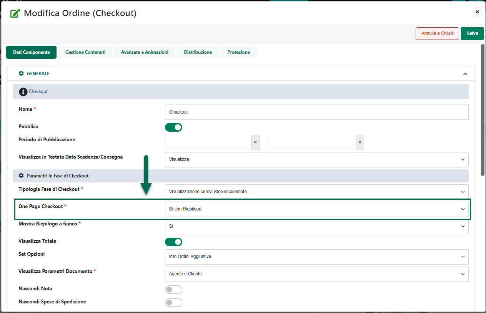
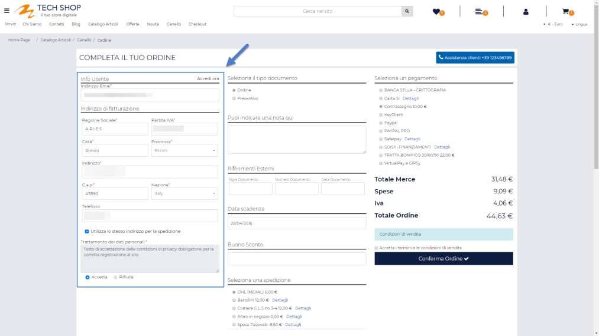
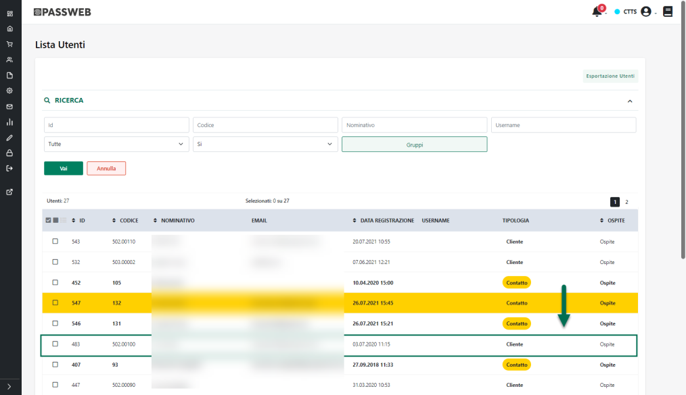

# GIFT CARD

All'interno di questa sezione del Wizard è possibile visualizzare e
gestire le diverse tipologie di Gift Card (Carte Regalo) che potranno
poi essere utilizzate all'interno del sito.

Per ogni Gift Card, dipendentemente dalla sua tipologia, sarà possibile
definire diversi parametri di configurazione come ad esempio l'articolo
spesa da inserire nei documenti dei clienti che faranno poi uso di
questa stessa carta, la sua durata, a che cosa dovrà essere applicata
(al totale dell'ordine, al totale merce ....), le sue eventuali
condizioni di utilizzo ( se potrà quindi essere utilizzata in relazione
all'acquisto di un qualsiasi prodotto o se dovrà essere valida solo per
l'acquisto di determinati articoli) ecc...

Effettuando l'accesso a questa sezione del Wizard verrà quindi
visualizzata la maschera **"Lista delle Gift Card"**

{width="5.759722222222222in"
height="3.4027777777777777in"}

contenente l'elenco di tutte le Gift Card attualmente codificate.

Per ciascuna delle carte in elenco verrà visualizzato il nome ad essa
associata oltre che la sua tipologia.

Il campo di ricerca attivabile cliccando sulla lente di ingrandimento,
presente in testata di ogni singola colonna, consente di filtrare i dati
in griglia sulla base dei valori presenti all'interno della colonna
stessa.

Una volta impostato un filtro di ricerca, per poterlo poi eliminare sarà
sufficiente cliccare sull'icona raffigurante una piccola lente di
ingrandimento con un -- all'interno (
{width="7.777777777777778e-2in"
height="9.722222222222222e-2in"} ) che comparirà in testata alla colonna
in corrispondenza della quale è stato impostato il filtro stesso.

Infine è anche possibile ordinare, in maniera crescente e/o decrescente,
gli elementi in griglia cliccando semplicemente sull'icona raffigurante
due piccole frecce posta anch' essa in testata ad ogni singola colonna
della griglia (
{width="0.12361111111111112in"
height="0.14930555555555555in"} )

I pulsanti presenti nella barra degli strumenti consentono
rispettivamente di:

- **Elimina Gift Card** (
  {width="0.6236111111111111in"
  height="0.18194444444444444in"} )**:** consente di eliminare la Gift
  Card attualmente selezionata in elenco.

> **ATTENZIONE!** Non è possibile eliminare Gift Card cui sono associati
> dei codici riscattati e attualmente in uso dai clienti

- **Modifica Gift Card** (
  {width="0.6493055555555556in"
  height="0.18819444444444444in"} )**:** consente di accedere alle
  impostazioni di configurazione della Gift Card attualmente selezionata
  in elenco.

- **Copia Gift Card** (
  {width="0.5652777777777778in"
  height="0.1951388888888889in"} )**:** consente di copiare la Gift Card
  attualmente selezionata in elenco.

> **ATTENZIONE!** La copia è relativa all'intera Gift Card. Verranno
> quindi copiate non solo le Impostazioni generali ma anche le Email e
> il Template configurato sulla Gift Card sorgente.

- **Aggiungi Gift Card** (
  {width="0.66875in"
  height="0.175in"} )**:** consente di creare una nuova Gift Card.

Cliccando su questo pulsante verrà infatti visualizzata la maschera
"**Nuova Gift Card**"

{width="5.759722222222222in"
height="3.4027777777777777in"}

suddivisa in tre diverse sezioni, Impostazioni Generali, Dati Email e
Template.

