# CODICI

All'interno di questa sezione del Wizard è possibile visualizzare
l'elenco di tutti i codici generati in relazione alle diverse tipologie
di Gift Card in uso all'interno del sito

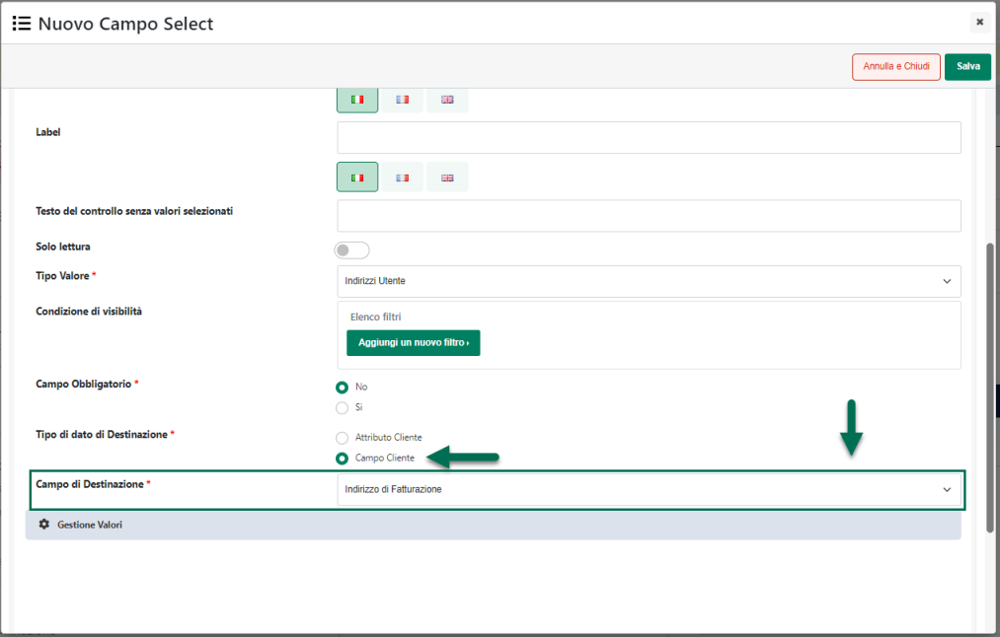{width="5.675in"
height="3.4805555555555556in"}

Le prime tre icone presenti nell'intestazione della griglia consentono
di attivare e gestire la selezione multipla dei codici in elenco

Nello specifico l'icona:

- 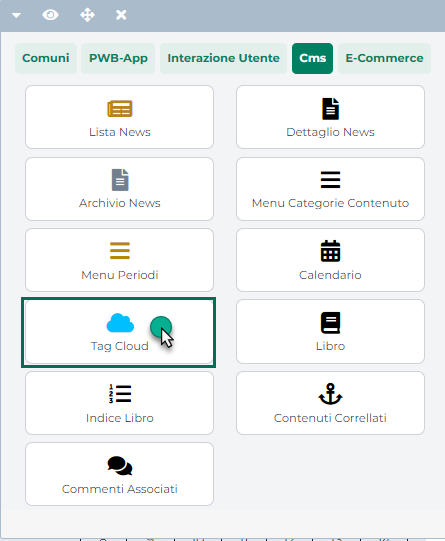{width="0.11666666666666667in"
  height="9.097222222222222e-2in"}: consente di attivare / disattivare
  la selezione multipla

- {width="9.722222222222222e-2in"
  height="9.722222222222222e-2in"}: consente di selezionare in blocco
  tutti i codici presenti in elenco

- 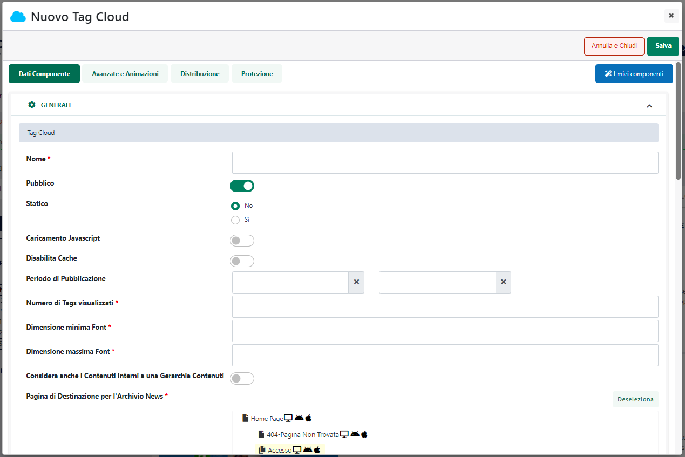{width="9.097222222222222e-2in"
  height="9.097222222222222e-2in"}: consente di deselezionare in blocco
  tutti i codici presenti in elenco

**ATTENZIONE!** la selezione multipla è attiva, per ovvie ragioni, solo
ed esclusivamente in relazione alla funzionalità di Eliminazione dei
codici selezionati

Il campo di ricerca attivabile cliccando sulla lente di ingrandimento,
presente in testata di ogni singola colonna, consente di filtrare i dati
in griglia sulla base dei valori presenti all'interno della colonna
stessa.

Una volta impostato un filtro di ricerca, per poterlo poi eliminare sarà
sufficiente cliccare sull'icona raffigurante una piccola lente di
ingrandimento con un -- all'interno (
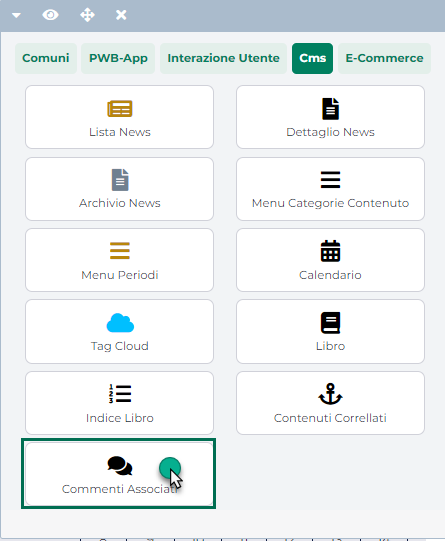{width="7.777777777777778e-2in"
height="9.722222222222222e-2in"} ) che comparirà in testata alla colonna
in corrispondenza della quale è stato impostato il filtro stesso.

Infine è anche possibile ordinare, in maniera crescente e/o decrescente,
gli elementi in griglia cliccando semplicemente sull'icona raffigurante
due piccole frecce posta anch' essa in testata ad ogni singola colonna
della griglia (
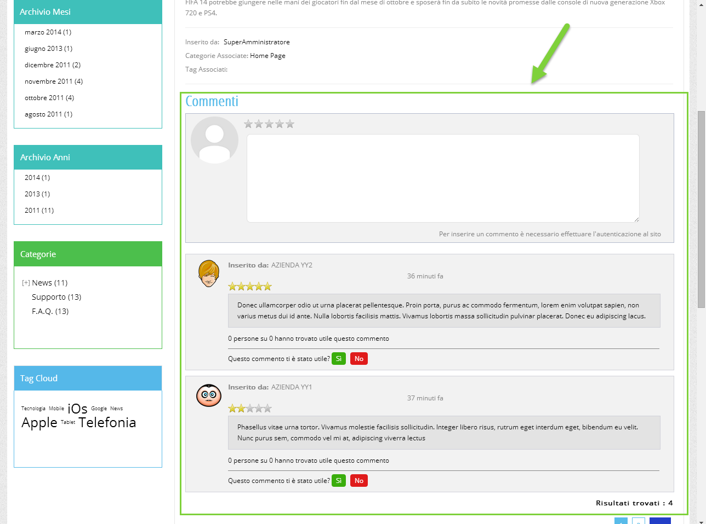{width="0.12361111111111112in"
height="0.14930555555555555in"} )

Per ciascuno dei codici presenti in elenco verranno indicate le seguenti
informazioni:

- **Valore iniziale:** indica il saldo iniziale della Gift Card
  riscattata mediante il corrispondente codice

- **Residuo:** indica il saldo attuale della Gift Card riscattata
  mediante il corrispondente codice

> **ATTENZIONE!** Per le Gift Card di tipo Ho.Re.Ca. il saldo del
> relativo Buono Sconto viene gestito e dovrà quindi essere visualizzato
> direttamente all'interno di Beauty (non è un' informazione presente
> nel database del sito)

- **Gift Card:** indica la tipologia di Gift Card (Fisica o Virtuale)
  cui è associato il corrispondente codice

- **Id Documento:** indica l'identificativo Passweb del documento che ha
  prodotto l'attivazione del corrispondente codice Gift Card.

> **Nel caso di Gift Card Virtuali**, considerato il processo di
> attivazione e gestione di questa specifica tipologia di carte regalo,
> l'associazione "Codice Gift Card -- Documento" è automatica e il campo
> in esame verrà quindi valorizzato dal programma nel momento stesso in
> cui verrà esportata sul sito la fattura / corrispettivo di acquisto
> della corrispondente Gift Card.
>
> In queste condizioni quindi i codici Gift Card collegati ad uno
> specifico documento potranno essere visualizzati e gestiti anche a
> partire dal dettaglio del documento stesso.

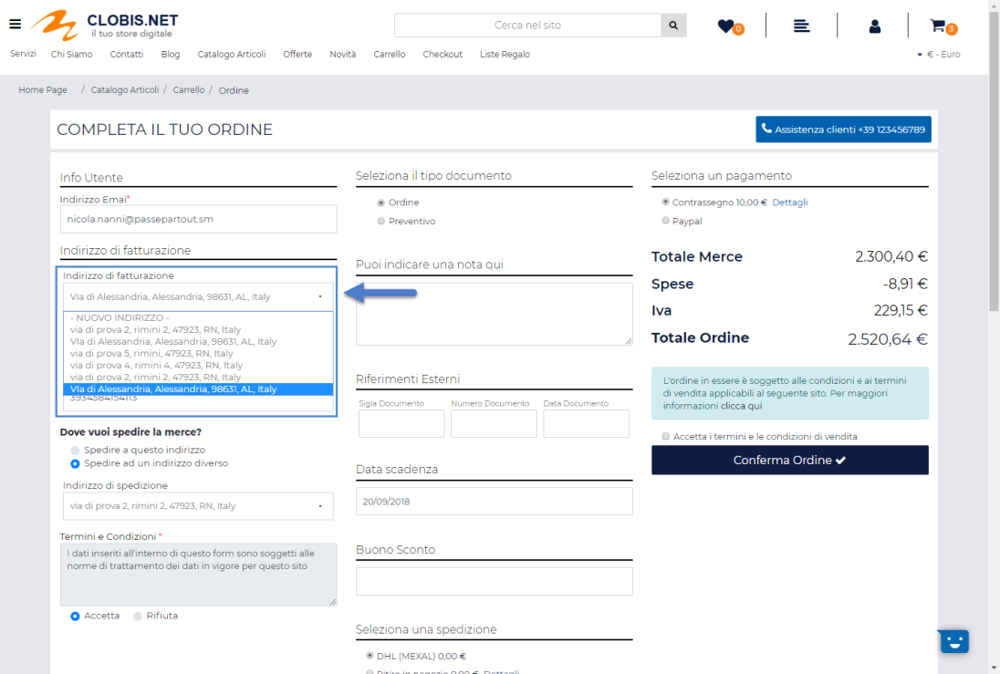{width="5.746527777777778in"
height="3.3895833333333334in"}

> **Nel caso invece di Gift Card Fisiche** l'associazione "codice Gift
> Card -- Documento" non è automatica per cui il campo in esame, a
> default, non verrà mai valorizzato.
>
> Se l'esigenza dovesse comunque essere quella di legare codici di Gift
> Card Fisiche ad uno specifico documento, sarà necessario generare
> questi codici a partire dal dettaglio del documento stesso agendo per
> questo all'interno della sezione "**Codici Gift Card**" sopra
> evidenziata (per maggiori informazioni in merito si veda anche quanto
> indicato alla sezione "*Ordini -- Gestione Ordini -- Codici Gift
> Card*" di questo manuale)
>
> **ATTENZIONE!** Codici di Gift Card Fisiche generati a partire dalla
> sezione "*Utenti -- Gift Card -- Codici*" del Wizard, non potranno poi
> essere collegati ad uno specifico documento

- **Cliente:** indica il cliente che ha riscattato il corrispondente
  codice Gift Card e che ha quindi associato al proprio profilo il
  relativo saldo

- **Data di scadenza:** indica la data di scadenza del corrispondente
  codice Gift Card

- **Stato:** indica lo stato del corrispondente codice Gift Card

- **Automatico:** indica se il corrispondente codice Gift Card è stato
  creato o meno in maniera automatica da Passweb

I pulsanti presenti nella contestuale barra degli strumenti consentono
rispettivamente di:

- **Elimina** (
  {width="0.3506944444444444in"
  height="0.18819444444444444in"} )**:** consente di eliminare il codice
  Gift Card attualmente selezionato

- **Modifica** (
  {width="0.4027777777777778in"
  height="0.18819444444444444in"} )**:** consente di accedere alle
  impostazioni di configurazione del codice Gift Card attualmente
  selezionato.

> **ATTENZIONE!** Per loro stessa natura i Codici relativi a Gift Card
> di tipo Ho.Re.Ca. non potranno essere modificati operando direttamente
> all'interno del Wizard di Passweb

- **Importa da File** (
  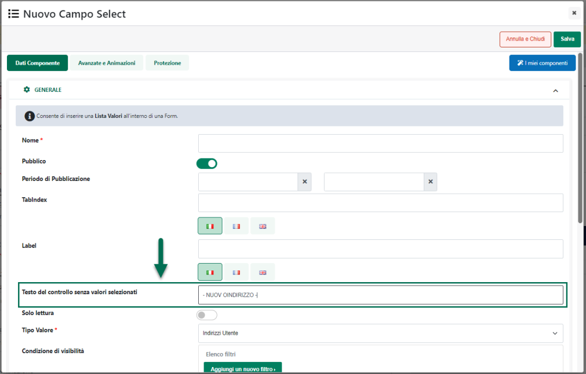{width="0.6166666666666667in"
  height="0.1951388888888889in"} )**:** consente di importare in maniera
  massiva una serie di codici Gift Card. Per maggiori informazioni in
  merito si veda anche il successivo capitolo di questo manuale.

- **Esporta** (
  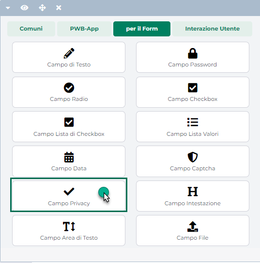{width="0.33125in"
  height="0.18194444444444444in"} )**:** consente di esportare
  all'interno di un file .csv i codici Gift Card attualmente presenti in
  elenco

- **Transazioni** (
  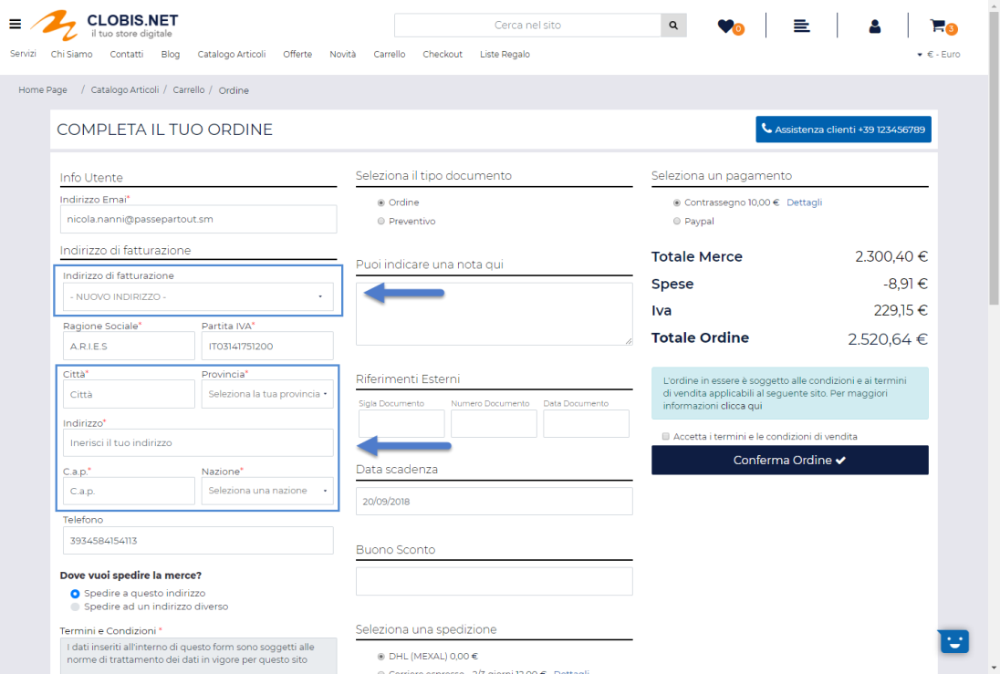{width="0.43472222222222223in"
  height="0.175in"} )**:** consente di visualizzare l'elenco delle
  Transazioni relative al codice Gift Card attualmente selezionato in
  elenco.

> Cliccando su questo pulsante verrà infatti visualizzata la maschera
> "**Transazioni Codice Gift Card**"

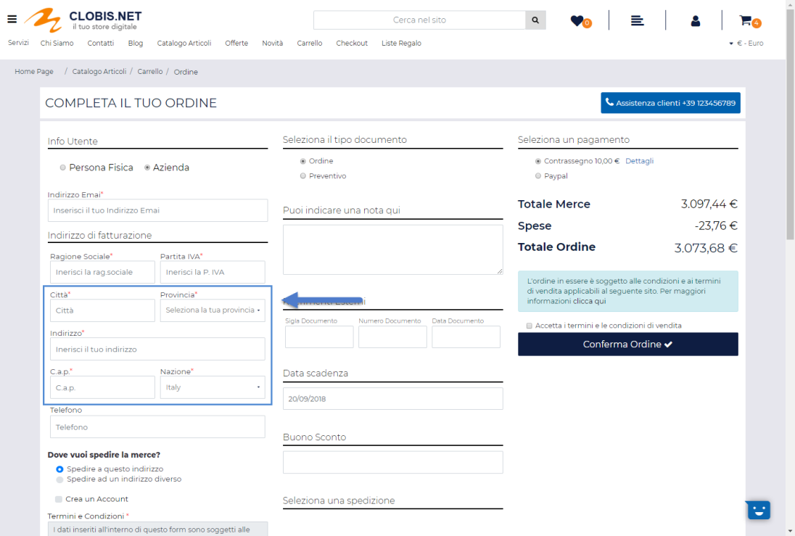{width="5.746527777777778in"
height="3.3895833333333334in"}

> all'interno della quale potremo trovare l'elenco di tutte le
> operazioni effettuate in merito al codice in esame.
>
> Nello specifico, le transazioni in elenco possono essere di tre tipi
> diversi:

- **Aggiunta della carta regalo all'account**: evento che si verifica
  nel momento in cui l'utente utilizzerà il pulsante "**Applica al tuo
  Account**" per riscattare il codice in esame:

- **Transazione**: evento che si verifica nel momento in cui un utente
  utilizzerà la corrispondente carta regalo per effettuare acquisti
  all'interno del sito

- **Variazione amministrativa**: evento che si verifica nel momento in
  cui l'amministratore del sito dovesse decidere di variare da Wizard il
  residuo della corrispondente carta regalo

> **ATTENZIONE**! Le transazioni tracciate e visualizzate all'interno di
> questa sezione del Wizard sono visibili, al relativo utente, anche sul
> front end del sito all'interno della pagina Gift Card.
>
> I testi descrittivi delle diverse tipologie di transazione possono
> essere personalizzati all'interno della sezione "Testi/Messaggi Sito"
> agendo sul componente "Gift Card".

- **Invia Mail di Attivazione** (
  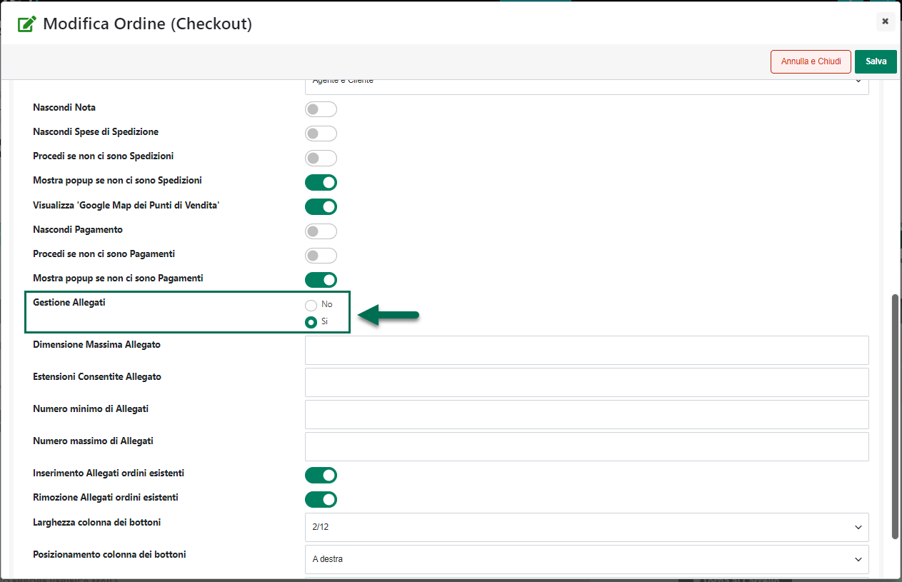{width="0.7597222222222222in"
  height="0.1951388888888889in"} ) **-- solo per Gift Card Virtuali:**
  Consente di inviare all'acquirente la mail di Attivazione della Gift
  Card

> **ATTENZIONE!** il pulsante in esame è visibile solo nel caso in cui
> il codice Gift Card attualmente selezionato sia stato associato ad un
> ben preciso documento e sia quindi noto l'acquirente della
> corrispondente carta regalo.
>
> Nel caso in cui la mail di attivazione risulti essere già stata
> inviata, alla pressione del pulsante verrà visualizzato un apposito
> messaggio per informare l'amministratore del sito di questo fatto.

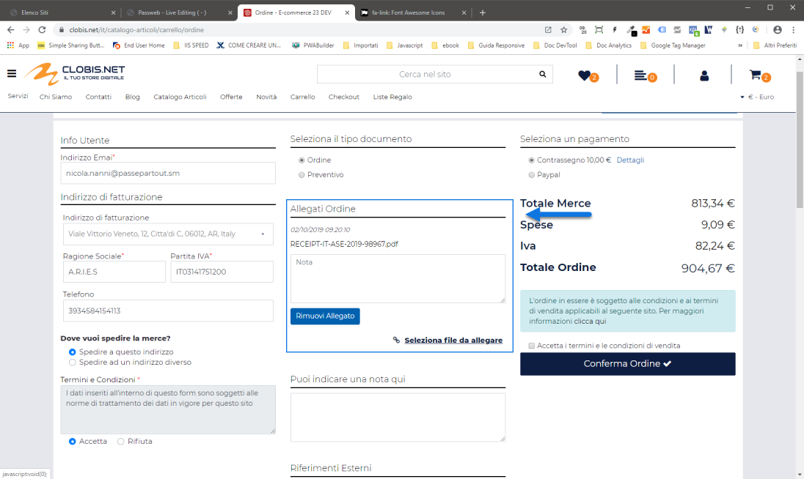{width="1.7791666666666666in"
height="0.7465277777777778in"}

> Confermando la richiesta la mail di attivazione verrà comunque inviata

- **Invia Mail Assegnazione** (
  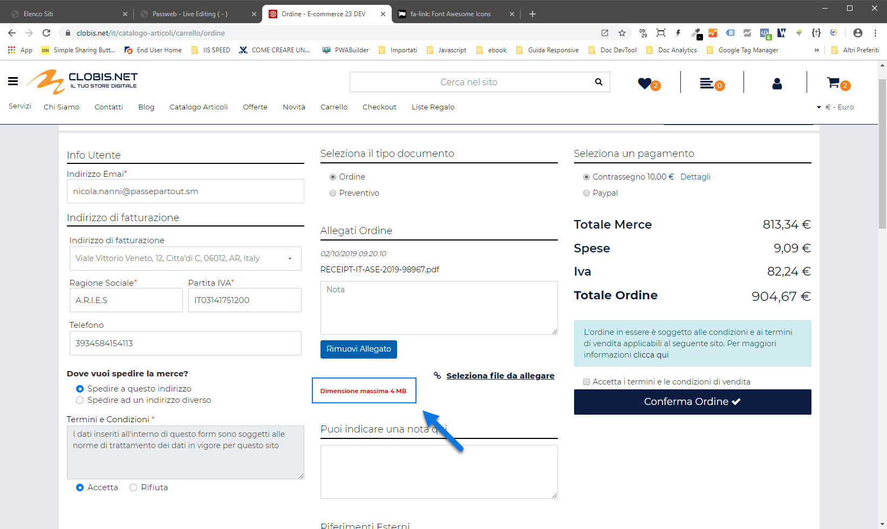{width="0.8375in"
  height="0.18819444444444444in"} ) **-- solo per Gift Card Virtuali e
  per codici generati manualmente:** consente di inviare all'utente
  associato al relativo Codice Gift Card la mail di Assegnazione utile
  per informarlo del relativo accredito.

> **ATTENZIONE!** il pulsante in esame è visibile solo nel caso in cui
> il codice Gift Card attualmente selezionato:

- sia relativo ad una Gift Card Virtuale

- sia stato generato manualmente all'interno del Wizard

- sia stato associato ad un ben preciso utente.

> Anche in questo caso nel momento in cui la mail di assegnazione
> risulti essere già stata inviata, alla pressione del pulsante verrà
> visualizzato un apposito messaggio per informare l'amministratore del
> sito di questo fatto.

- **Link Condivisione** (
  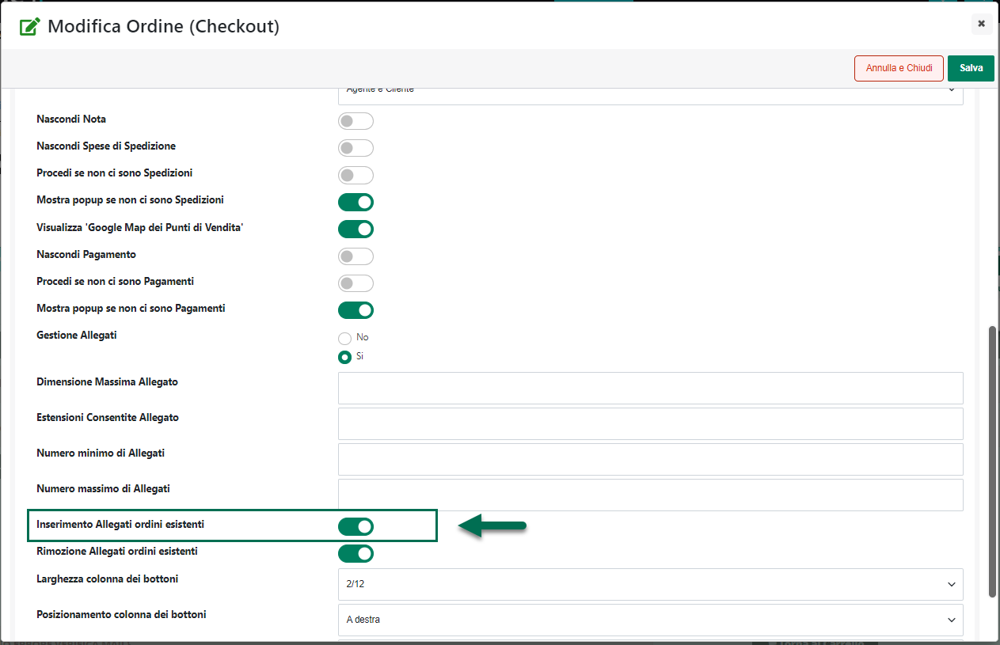{width="0.7208333333333333in"
  height="0.18194444444444444in"} ) **-- solo per Gift Card Virtuali:**
  consente di copiare negli appunti il link di condivisione della Carta
  Regalo in maniera tale da poterlo poi incollare, ad esempio in una
  mail, e inviare a chi di dovere

- **Nuovo** (
  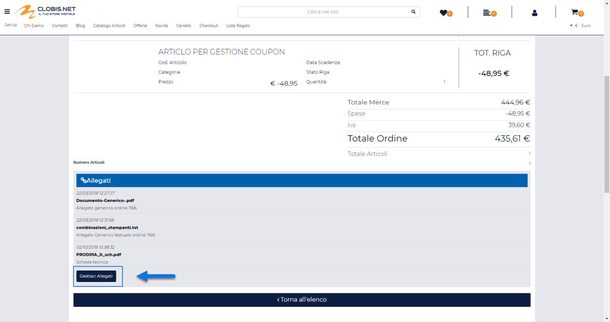{width="0.325in"
  height="0.1951388888888889in"} )**:** consente di codificare un nuovo
  codice Gift Card

In relazione alla creazione di nuovi codici Gift Card vanno fatte alcune
considerazioni di fondamentale importanza distinguendo tra Gift Card di
tipo Ho.Re.Ca., Fisiche e Virtuali avendo, come detto, ogni tipologia di
carta regalo uno specifico processo di gestione e attivazione.

Nello specifico, dunque, per quel che riguarda le **Gift Card di tipo
Ho.Re.Ca.** **non sarà mai possibile creare nuovi codici in maniera
manuale operando direttamente all'interno del Wizard di Passweb.**

Per questa particolare tipologia di Gift Card infatti, contestualmente
all'acquisizione da parte del gestionale di un ordine contenente uno o
più Trattamenti e/o uno o più articoli di tipo "Ricarica Promozione",
sarà Beauty stesso a preoccuparsi di creare, in maniera completamente
automatica, altrettanti "Buoni Sconto" il cui codice verrà poi
comunicato a Passweb e sarà questo che, da una parte, l'amministratore
del sito potrà visualizzare all'interno di questa sezione del Wizard e
che, dall'altra parte, gli utenti del sito dovranno effettivamente
utilizzare in fase di pagamento dei relativi trattamenti per poter
usufruire dello sconto corrispondente.

Per quel che riguarda invece le **Gift Card Fisiche,** **i codici delle
carte regalo dovranno essere creati necessariamente in maniera manuale**
e, in questo senso, sarà possibile procedere in due modi diversi:

- Importazione massiva di codici mediante upload di un file csv
  appositamente creato (per maggiori informazioni in merito si veda
  anche il successivo capitolo di questo manuale)

- Creazione manuale del singolo codice

In quest'ultimo caso cliccando sul pulsante "**Nuovo**" verrà
visualizzata la maschera "**Nuovo Codice Gift Card**"

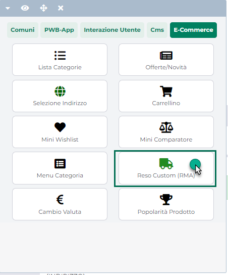{width="5.746527777777778in"
height="3.3895833333333334in"}

all'interno della quale poter impostare i parametri di configurazione
del singolo codice. Nello specifico il campo:

- **Gift Card**: consente di indicare la specifica Gift Card a cui dovrà
  essere collegato il codice in esame

- **Codice**: consente di impostare il codice da associare alla Gift
  Card indicata in corrispondenza del precedente parametro.

> Può essere inserito manualmente senza particolari restrizioni (sono
> accettati in questo senso anche caratteri speciali), oppure è
> possibile lasciare all'applicazione il compito di generarlo in maniera
> automatica (pulsante "**Genera Codice**") sulla base del template
> inserito all'interno del campo "**Formato Codice**" presente nella
> maschera di configurazione della Gift Card collegata al codice stesso.

- **Cliente**: cliente beneficiario del codice Gift Card. Il campo è ad
  auto completamento e il cliente può essere ricercato in base al suo
  codice conto gestionale (es.502.1) oppure in base al suo nome /
  cognome / ragione sociale.

> **ATTENZIONE!** di base, il campo Cliente non andrebbe mai valorizzato
> in maniera manuale in quanto sarà l'applicazione stessa che si
> preoccuperà poi di associare al codice in esame il corrispondente
> cliente nel momento in cui il cliente stesso provvederà a riscattarlo
>
> Potrebbero comunque configurarsi situazioni in cui l'amministratore
> del sito possa avere la necessità di assegnare ad uno specifico
> cliente un certo codice Gift Card (con il relativo saldo da poter
> spendere sullo store online) e, in questo caso, potrà tranquillamente
> farlo agendo mediante il campo in esame.

- **Articolo**: consente di indicare lo specifico articolo che dovrà
  essere utilizzato nelle relative mail piuttosto che all'interno della
  pagina Gift Card, nel momento in cui si sia deciso di inserire nel
  Template utilizzato per gestire il "Dettaglio della Gift Card" il
  segnaposto "Immagine Articolo"

- **Descrizione**: consente di indicare il testo che dovrà essere
  utilizzato nelle relative mail piuttosto che all'interno della pagina
  Gift Card, nel momento in cui si sia deciso di inserire nel Template
  utilizzato per gestire il "Dettaglio della Gift Card" il segnaposto
  "Descrizione Gift Card"

> **ATTENZIONE!** Se la Gift Card è virtuale e il codice viene generato
> partendo dalla sezione "Codici Gift Card" presente sul dettaglio del
> relativo documento (effettuando quindi un' associazione "codice --
> documento" manuale) la descrizione inserita all'interno del campo in
> esame verrà visualizzata all'interno del componente "Checkout" assieme
> al link di condivisione.

- **Valuta**: consente di indicare la valuta in relazione alla quale
  considerare l'importo del codice Gift Card in questione

- **Valore** **Iniziale**: consente di specificare l'importo iniziale
  della carta regalo che verrà caricato sul profilo del cliente nel
  momento in cui provvederà al riscatto del codice in esame. Dovrà
  quindi essere coerente con il prezzo di vendita della relativa Gift
  Card.

> **ATTENZIONE!** Una volta salvato il codice Gift Card non sarà più
> possibile, per ovvie ragioni, modificare l'importo presente
> all'interno di questo campo

- **Residuo**: consente di visualizzare e gestire il saldo attuale
  associato al codice Gift Card in questione. A differenza del "Valore
  Iniziale" l'amministratore del sito avrà sempre la possibilità di
  modificare l'importo presente in questo campo.

> **ATTENZIONE!** considerando che il processo di creazione e gestione
> delle Gift Card Fisiche prevede che i codici vengano generati e
> gestiti in maniera manuale, è abbastanza semplice comprendere che **in
> fase di generazione di un nuovo codice gli importi inseriti
> all'interno dei campi "Valore Iniziale" e "Residuo" dovranno essere
> identici tra loro e uguali anche al prezzo assegnato all'articolo
> utilizzato per vendere la Gift Card cui è stato assegnato il codice in
> esame**.

- **Data** **di scadenza**: consente di impostare la data di scadenza
  del codice Gift Card in questione.

- **Stato**: consente di impostare lo stato del codice Gift Card in
  questione. E' possibile selezionare uno dei seguenti valori:

  - **Inattivo:** i codici in questo stato anche se riscattati non
    potranno essere utilizzati per effettuare acquisti all'interno del
    sito

  - **Attivo:** i codici in questo stato, una volta riscattati, possono
    poi essere utilizzati per effettuare acquisti all'interno del sito.

> **ATTENZIONE!** Per le Gift Card Fisiche l'attivazione dei codici non
> è automatica come nel caso delle Gift Card virtuali per cui è
> necessario prestare particolare attenzione al fatto di vendere codici
> Gift Card attivi e quindi correttamente utilizzabili dagli utenti per
> effettuare acquisti all'interno del sito

- **Scaduto:** un codice Gift Card passa automaticamente in questo stato
  quando la data attuale è successiva a quella impostata all'interno del
  suo campo "Data di scadenza". I codici in questo stato non possono
  essere utilizzati per effettuare acquisti all'interno del sito

- **Usato:** un codice Gift Card passa automaticamente in questo stato
  quando il suo importo "Residuo" è esaurito. I codici in questo stato
  non possono essere utilizzati per effettuare acquisti all'interno del
  sito

Infine, nel caso di **Gift Card Virtuali** i codici verranno creati
automaticamente dall'applicazione per cui l'amministratore del sito non
dovrà, in questo senso, preoccuparsi di nulla.

Come precedentemente evidenziato, la generazione automatica dei codici
avverrà in fase di importazione sul sito di una fattura / corrispettivo
di acquisto contente articoli marcati come "Gift Card". Più esattamente,
nel momento in cui dovesse essere importata sul sito una fattura /
corrispettivo contenente N articoli (su di una stessa riga o su righe
distinte non fa differenza) marcati come articoli di tipo "Gift Card",
Passweb provvederà a creare automaticamente, e contestualmente anche ad
attivare, N distinti codici Gift Card con le seguenti caratteristiche:

- **Gift Card**: la Gift Card assegnata al codice generato in automatico
  da Passweb sarà esattamente quella associata allo specifico articolo
  presente in fattura

- **Codice**: il codice verrà generato in automatico sulla base del
  template inserito all'interno del campo "**Formato Codice**" presente
  nella maschera di configurazione della relativa Gift Card

- **Cliente**: il campo non verrà valorizzato, per cui il cliente verrà
  associato al codice Gift Card solo nel momento in cui il codice verrà
  effettivamente riscattato

- **Articolo**: l'articolo associato al codice generato automaticamente
  da Passweb sarà esattamente quello presente in fattura (e utilizzato
  quindi per vendere la relativa carta regalo)

- **Descrizione Gift Card**: la descrizione associata al codice generato
  automaticamente da Passweb coinciderà con il titolo dell'articolo
  presente in fattura (e utilizzato quindi per vendere la relativa carta
  regalo)

- **Valuta**: la valuta associata al codice generato automaticamente da
  Passweb sarà esattamente la valuta di gestione dell'articolo presente
  in fattura (e utilizzato quindi per vendere la relativa carta regalo)

- **Valore Iniziale / Residuo**: per i codici generati automaticamente
  da Passweb, i due campi in oggetto avranno, ovviamente, lo stesso
  importo calcolato seguendo le regole di seguito indicate:

  - Di base l'importo inserito all'interno dei campi Valore Iniziale e
    Residuo coinciderà esattamente con il prezzo di vendita / acquisto
    del corrispondente articolo presente in fattura e marcato come
    articolo di tipo "Gift Card"

  - Nel caso in cui per l'articolo di tipo Gift Card sia stato indicato
    uno sconto **(cosa che non dovrebbe mai avvenire)**, l'importo
    assegnato ai due campi in esame sarà uguale al prezzo scontato di
    questo stesso articolo

  - Nel caso in cui per l'articolo di tipo Gift Card sia stata impostata
    una certa aliquota iva (**nonostante il fatto che questa tipologia
    di articoli andrebbe gestita iva esente**) l'importo assegnato ai
    due campi in esame sarà uguale al prezzo di vendita / acquisto dello
    stesso articolo iva esclusa

  - Se il documento di vendita era già stato processato ma, per qualche
    ragione, è stato variato lato gestionale, verrà verificato se i
    codici Gift Card che il documento stesso avrebbe dovuto generare
    sono o meno tutti presenti in elenco e :

    - Eventuali codici non presenti (perché magari lato gestionale è
      stato aggiunto al documento un articolo di tipo Gift Card non
      presente nell'ordine web) verranno creati e verrà inviata anche la
      relativa mail di attivazione

    - Se dalle verifiche effettuate dovesse risultare che alcuni dei
      codici precedentemente creati sono stati rimossi (perché è stata
      cancellata la corrispondente riga documento) o ne è stato variato
      l'importo (perché è stato modificato il totale della
      corrispondente riga del documento) allora, se tali codici non sono
      ancora stati riscattati, verranno automaticamente cancellati o
      aggiornati. In caso contrario, se il codice "incriminato" dovesse
      essere cioè, già stato riscattato, non sarà più possibile
      eliminarlo o aggiornarlo per cui al termine della sincronizzazione
      verrà generato un errore del tipo "***E' stata effettuata una
      variazione non ammessa sulle Gift Card presenti nel documento
      \<sigla documento\>***"

- **Data di Scadenza**: coinciderà con la data di esportazione della
  fattura / corrispettivo di acquisto più i giorni impostati, in fase di
  configurazione della Gift Card, in corrispondenza del parametro
  "**Durata**"

- **Stato**: i codici generati automaticamente da Passweb verranno
  immediatamente posti nello stato "**Attivo**"

