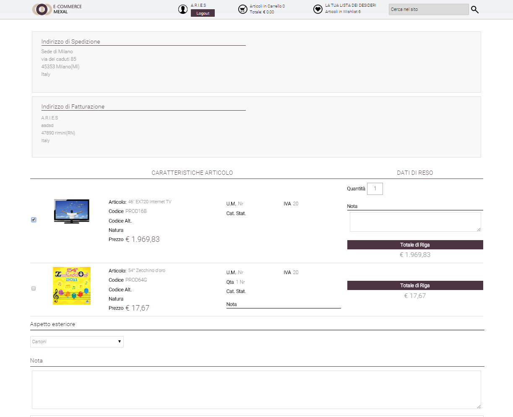
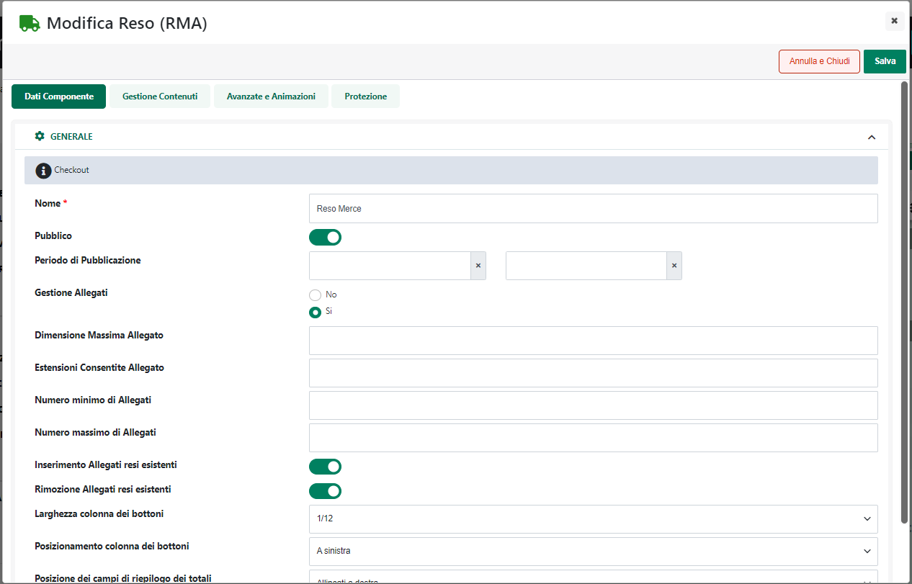
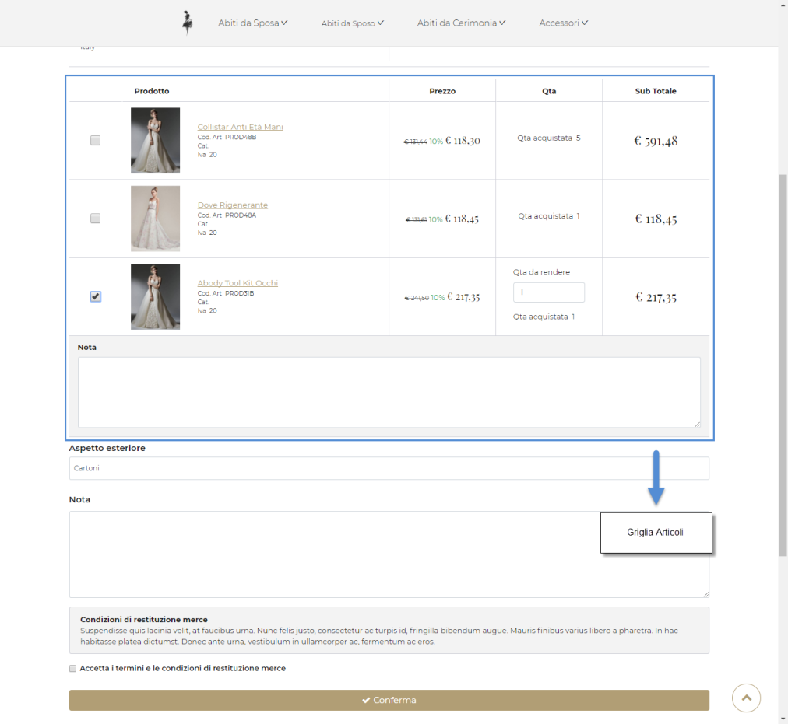

# IMPORTAZIONE / ESPORTAZIONE MASSIVA DI CODICI GIFT CARD

Come accennato nel precedente capitolo di questo manuale, nel momento in
cui l'esigenza dovesse essere quella di gestire delle **Gift Card
Fisiche**, i codici da stampare, attivare e assegnare alle varie carte
regalo dovranno essere inseriti manualmente all'interno del Wizard.

Questa operazione di inserimento può essere fatta singolarmente, codice
per codice, portandosi all'interno della sezione "*Utenti Gift Card --
Codici*" del Wizard e cliccando sul pulsante "**Nuovo**", oppure in
maniera massiva sfruttando l'importazione di un file csv appositamente
costruito.

In questo caso (importazione massiva) sarà necessario accedere ancora
una volta alla sezione "*Utenti Gift Card -- Codici*" e cliccare però
sul pulsante "**Importa da File"** (
 ) presente nella barra principale degli
strumenti. In questo modo verrà infatti visualizzata la maschera
"**Importazione Codici Gift Card**"

mediante la quale poter effettuare l'upload del file contenente le
informazioni desiderate.

**ATTENZIONE!** non essendo possibile creare in maniera manuale nuovi
codici per Gift Card di tipo Ho.Re.Ca., allo stesso modo nelle
operazioni di export/import csv eventuali codici agganciati alla "Gift
Card" di tipo "Ho.Re.Ca." non verranno considerati.

Nello specifico all'interno di questa sezione sarà necessario indicare:

- **File (csv-txt):** consente di selezionare il file txt o csv da
  uplodare e che dovrà quindi contenere i dati di tutti i codici Gift
  Card da inserire

- **Separatore**: consente di indicare, selezionandolo, dall'apposito
  menu a tendina, il carattere che è stato utilizzato all'interno del
  file di importazione come separatore per i vari campi

Affinchè la procedura di import e la conseguente creazione dei codici
Gift Card possa funzionare in maniera dovranno essere rispettate delle
regole ben precise. Nello specifico:

- Il file da importare deve avere estensione .csv o .txt

- Il carattere separatore dei vari campi deve essere esattamente quello
  indicato all'interno del campo "**Separatore**" presente nel form di
  importazione.

- Il file di importazione deve soddisfare le specifiche del formato
  RFC4180.

- L'intestazione, ossia la prima riga del file, dovrà contenere i
  seguenti campi (indicati esattamente come di seguito riportato):

  - codice

  - valore

  - residuo

  - stato

  - valuta

  - dataScadenza

  - giftCard

  - utente

- Coerentemente con l'intestazione del file, per ogni singolo record
  dovranno essere indicate in corrispondenza della relativa colonna le
  seguenti informazioni:

  - **codice**: codice della Gift Card

  - **valore**: valore della Gift Card. Deve essere necessariamente un
    valore decimale.

  - **residuo**: residuo della Gift Card. Deve essere necessariamente un
    valore decimale.

  - **stato**: stato della Gift Card. Sono ammessi i seguenti valori:

    - **Inattivo**: codice non attivo

    - **Attivo**: codice attivo

    - **Scaduto**: codice scaduto

    - **Usato**: codice usato

  - **valuta**: codice iso della valuta utilizzata per gli importi
    indicati in corrispondenza dei campi "valore" e "residuo"

  - **dataScadenza**: data di scadenza della Gift Card nel formato
    "giorno/mese/anno", con due cifre per "giorno" (da 01 a 31) e "mese"
    (da 01 a 12) e 4 cifre per "anno".

  - **giftCard**: nome della Gift Card.

  - **utente**: identificativo dell'utente al quale associare la Gift
    Card

> **ATTENZIONE!** Per consentire all'amministratore del sito di
> assegnare Gift Card ad utenti che non sono ancora clienti, in
> corrispondenza del campo in questione **dovrà essere utilizzato
> l'identificativo Passweb e NON il codice cliente gestionale.**
>
> E' possibile ottenere l'identificativo Passweb dei vari utenti
> mediante una semplice operazione di "Esportazione Utenti" inserendo
> tra i dati di esportazione il campo "ID"

In considerazione di quanto detto e supponendo di voler utilizzare come
carattere separatore dei vari campi il carattere ; un possibile esempio
di file di importazione potrebbe essere quello qui di seguito riportato:

codice;valore;residuo;stato;valuta;dataScadenza;giftCard;utente

GFT-XZT-218-FIS;500,00;500,00;Attivo;EUR;31/12/2020;Gift Card Fisica;452

GFT-CNK-207-FIS;1000,00;1000,00;Attivo;EUR;31/12/2020;Gift Card
Fisica;658

GFT-T7R-3C7-VIR;500,00;500,00;Attivo;EUR;04/04/2020;Gift Card
Virtuale;478

**ATTENZIONE!!** nel caso in cui nel file di importazione siano indicati
eventuali codici Gift Card già presenti in elenco, questi verranno
sovrascritti con i dati indicati all'interno del file.

Nel momento in cui l'esigenza dovesse essere quella di esportare in un
file csv tutti i codici Gift Card attualmente presenti in elenco (ad
esempio per apportare piccole modifiche da ricaricare poi in maniera
massiva) sarà possibile utilizzare la procedura di esportazione.

Il pulsante **Esporta**
( ) consente infatti di esportare **in
formato .csv** l'elenco di tutti i codici Gift Card attualmente gestiti.

Cliccando su questo pulsante verrà visualizzata la maschera
"**Esportazione Codici Gift Card**"

all'interno della quale poter configurare l'esportazione dei dati.

Il campo **Separatore** consente di indicare, selezionandolo,
dall'apposito menu a tendina, il carattere da utilizzare in fase di
creazione del file di esportazione, come separatore per i vari campi

