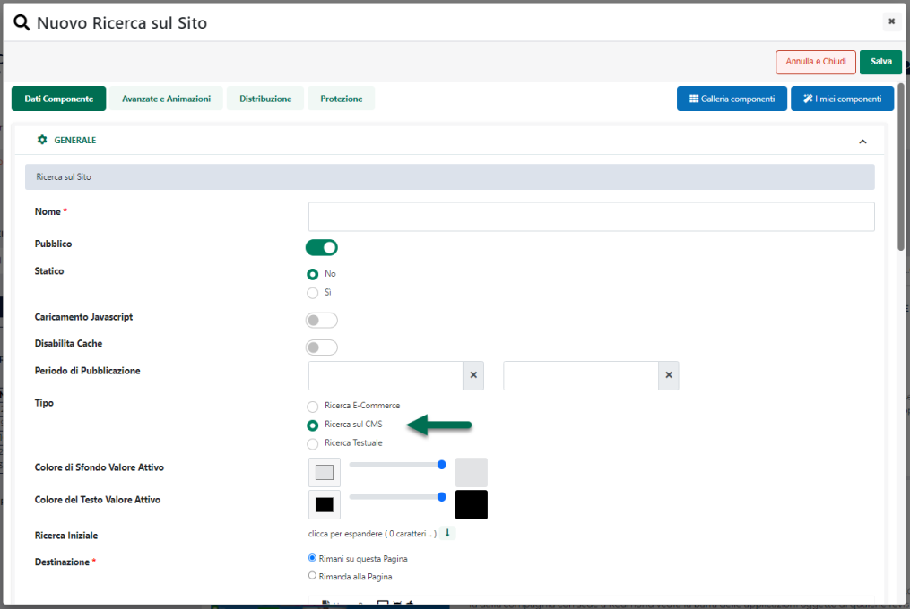

# \@POS

La modalità di pagamento etichettata a default come **\@POS** viene
riconosciuta e gestita da tutte le banche che utilizzano il relativo
gateway di pagamento online.

Per poter attivare questa specifica modalità di pagamento in Passweb
sarà necessario:

1.  Codificare all'interno della Tabella **"Lista Pagamenti"** del
    gestionale uno specifico pagamento al quale poter poi agganciare il
    pagamento on line in oggetto assegnandogli, ad esempio, la
    descrizione \@POS

2.  Effettuare una sincronizzazione sito -- gestionale in modo tale da
    rendere disponibile questo nuovo pagamento anche in Passweb
    all'interno della maschera **" Lista dei Metodi di Pagamento"**
    precedentemente esaminata.

3.  Attivare questa nuova modalità di pagamento secondo quanto descritto
    nel capitolo *"Configurazione Modalità di Pagamento"* di questo
    manuale.

4.  Impostare in maniera corretta i parametri specifici per questa
    particolare modalità di pagamento.

In particolare per poter eseguire quest'ultimo passaggio sarà necessario
selezionare il pagamento in oggetto all'interno della maschera **"Lista
dei Metodi di Pagamento"** e cliccare sul pulsante "**Modifica
Pagamento**", presente nella barra degli strumenti.

Verrà quindi visualizzata la maschera di configurazione e
personalizzazione del pagamento, all'interno della quale sarà necessario
impostare, oltre ai parametri classici di configurazione del pagamento,
anche quelli specifici del gateway attualmente considerato e presenti
all'interno della sezione "**Parametri Gateway**"

Nel caso specifico il parametro:

- **Ambiente del Gateway:** permette di definire se utilizzare come
  ambiente del pagamento, l'ambiente di test (da utilizzare solo ed
  esclusivamente in fase di sviluppo del sito) oppure l'ambiente reale
  di produzione.

- **Merchant ID:** codice identificativo del negozio assegnato
  all\'esercente dalla banca;

- **Contabilizzazione:** consente di specificare se la contabilizzazione
  delle transazioni effettuate dovrà avvenire in maniera **"Immediata"**
  o **"Differita"**. Una contabilizzazione immediata, ad esempio,
  permetterà all'esercente di rendere automaticamente contabili tutte le
  transazione autorizzate, senza un suo specifico intervento dall'
  applicazione di Back Office della banca.

> Una contabilizzazione differita richiederà invece che le operazioni
> autorizzate siano esplicitamente rese contabili dall'esercente
> attraverso la relativa applicazione di Back Office fornita dalla
> banca.

- **Autorizzazione:** consente di specificare il tipo di Autorizzazione
  che dovrà essere utilizzata sulle transazioni effettuate. In questo
  senso sarà quindi possibile utilizzare un'autorizzazione **Immediata**
  o **Differita.**

> La modalità di autorizzazione immediata prevede che durante la fase di
> pagamento online venga immediatamente inviata la richiesta di
> autorizzazione ai circuiti internazionali. Una volta conclusa la
> transazione in modo positivo l'esercente ha la certezza che quanto
> dovuto dal cliente è stato "prenotato" dal suo plafond.
>
> La modalità di autorizzazione differita prevede che durante la fase di
> pagamento online le transazioni siano prese in carico ma non inoltrate
> ai circuiti (viene comunque effettuato un controllo della validità
> della carta presso l'issuer).
>
> L'esercente che utilizza questa modalità di accettazione dei pagamenti
> è in grado, in un secondo tempo, di far elaborare le richieste di
> autorizzazione pendenti che lo riguardano. Le richieste di
> autorizzazione differita possono pervenire a PIB per un importo
> inferiore a quello originale; l'esercente può inoltrare una serie di
> autorizzazioni differite fino a coprire il totale originale.

- **Chiave Segreta Avvio:** chiave segreta fornita dalla Banca
  all'esercente all'atto della sottoscrizione del servizio e necessaria
  per il calcolo del MAC.

**NOTA BENE**: \@POS gestisce solamente importi in euro.

Per maggiori dettagli relativi alla Contabilizzazione o
all'Autorizzazione Immediata o Differita, così come per maggiori
dettagli relativi alla specifica applicazione di BackOffice della banca
si rimanda ai relativi manuali.

**NOTA BENE**: quanto indicato in questo manuale relativamente
all'utilizzo dell'applicazione di Back Office del sistema \@POS potrebbe
non essere allineato con la corrente versione di tale software. Si
consiglia quindi di utilizzare la specifica manualistica.

**NOTA BENE**: per eventuali malfunzionamenti o problemi relativi ad
addebiti o accrediti sui c/c o all' applicazione di Back Office, occorre
rivolgersi alla relativa assistenza.

Le informazioni da inserire nei campi sopra indicati non sono reperibili
sul gestionale ma vengono fornite direttamente all'esercente dalla
banca, al momento della sua registrazione sul sito e/o della sua
adesione al servizio offerto.

Tali informazioni sono di fondamentale importanza in quanto saranno poi
quelle che consentiranno di accedere al gateway di pagamento \@POS e di
poter così portare a termine il pagamento tramite carta di credito.

**NOTA BENE**: un'eventuale discordanza tra i dati inseriti nei campi
sopra indicati e quelli forniti all'esercente dalla banca, renderà
impossibile agli utenti del sito utilizzare questa modalità di
pagamento.

Una volta impostati correttamente i parametri presenti all'interno della
sezione "Configurazione Parametri Gateway", se l'utente dovesse, alla
conferma dell'ordine, selezionare la modalità di pagamento in esame,
l'ordine sarà memorizzato nel database di Passweb, e l'utente verrà
reindirizzato alla specifica pagina di accesso del gateway "@POS":

**A questo punto però l'ordine non è ancora stato preso in carico dalla
banca e, conseguentemente, non è ancora avvenuto alcun pagamento**.
L'utente potrà ancora decidere, quindi, di annullare tutto oppure di
portare a termine l'acquisto e completare la transazione.

Nel primo caso, annullamento della transazione (pulsante "**Annulla**"),
l'utente verrà reindirizzato al sito ecommerce dove si troverà l'ordine
ancora da confermare. Volendo potrà dunque decidere di ripartire dalla
situazione attuale, modificando se necessario l'ordine in essere con
l'aggiunta o l'eliminazione di determinati articoli, selezionando altre
tipologie di trasporto e /o altri pagamenti ecc... per poi passare
nuovamente a concludere l'ordine.

Nel momento in cui l'utente, una volta ritornato al sito, dovesse
comunque decidere di non chiudere l'ordine, questo resterebbe
memorizzato nel database di Passweb in stato di "**Pagamento non
confermato**"

Nel secondo caso (conferma della transazione) l'ordine verrà preso in
carico e gestito, da questo momento in avanti, dall'applicazione della
banca.

**ATTENZIONE!** **\@POS supporta nativamente la modalità Server to
Server** (non sono necessarie ulteriori configurazioni nell'applicazione
di backoffice della banca).

Nel momento in cui l'utente dovesse quindi arrivare alla schermata sopra
evidenziata l'applicazione di back office della banca invierà una
notifica al sito per informarlo del corretto esito della transazione.

In queste condizioni dunque l'utente potrebbe completare l'acquisito
(pulsante "**Completa l'acquisto**") tornando sul sito ecommerce oppure
potrebbe anche chiudere il browser. In ogni caso grazie alla notifica
server to server lato Passweb l'ordine risulterà pagato e potrà quindi
essere inserito all'interno del gestionale

Il numero ordine che viene riportato nella mail o visualizzato nel Back
Office rappresenta l'identificativo dell'ordine sul database di Passweb.
Per determinare la sigla ordine del gestionale corrispondente
all'identificativo è necessario utilizzare la pagina Gestione Ordini del
Wizard. Effettuando infatti una ricerca per identificativo, verrà
visualizzato il record indicante la sigla dell'ordine sul gestionale (se
l'ordine è stato registrato sul gestionale, se l'ordine non è stato
ancora inserito sul gestionale il campo è vuoto).

**NOTA BENE**: eventuali mail di notifica di avvenuta transazione, così
come accrediti e addebiti sui relativi c/c sono gestiti totalmente
dall'applicazione della banca.

**NOTA BENE**: verranno inseriti all'interno del gestionale unicamente
gli ordini in relazione ai quali è stata ricevuta una risposta positiva
dall'applicazione di pagamento on line.

Nel caso in cui siano stati effettuati ordini a seguito dei quali
l'applicazione di Back Office non ha restituito alcuna risposta (ad
esempio perché è stato chiuso il browser prima di completare il
pagamento) tali ordini resteranno unicamente all'interno del database di
Passweb nello stato di **"Pagamento Non Confermato"**.

**NOTA BENE**: la piattaforma di pagamento \@POS gestisce la notifica di
avvenuto pagamento. Indipendentemente quindi dalle azioni effettuate del
cliente dopo aver cliccato sul pulsante di pagamento, non appena il
circuito autorizzativo risponde alla richiesta inoltrata dal sistema
\@POS il sito verrà informato dell\'esito positivo della transazione.

Per maggiori informazioni relativamente a come poter gestire eventuali
ordini in stato di **"Pagamento Non Confermato"** si veda anche quanto
indicato all'interno del capitolo "*Ordini -- Ordini -- Stati
dell'Ordine*" di questo manuale.

