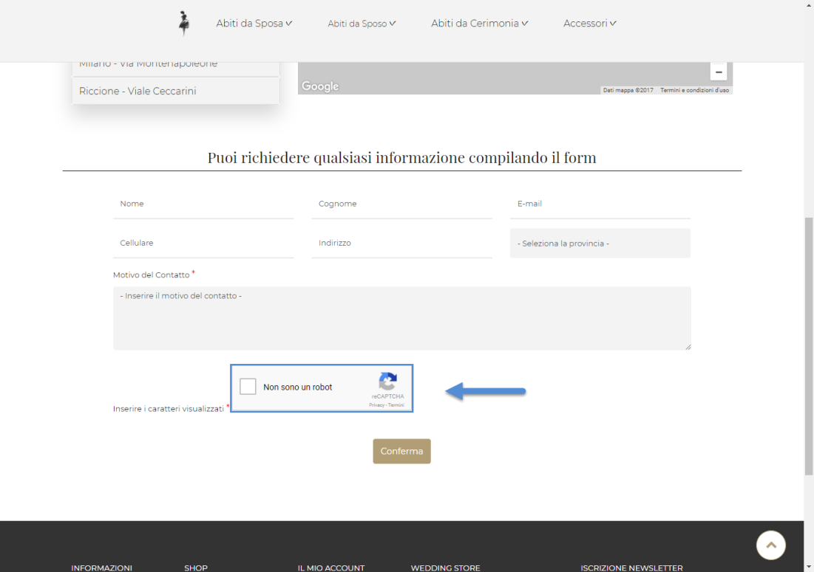
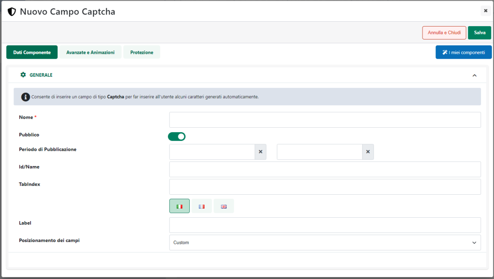
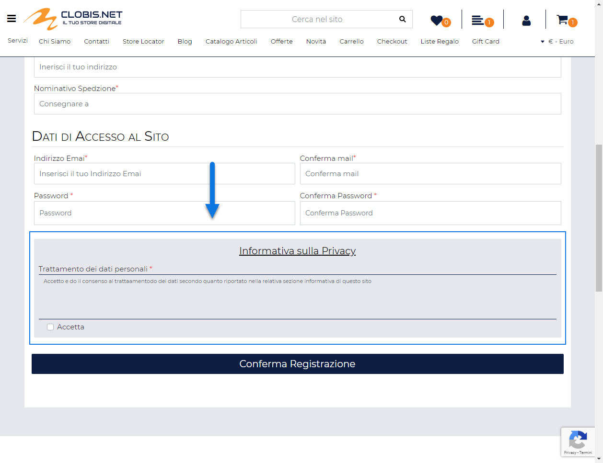

# PAGAMENTI SEMPLICI

Nel momento in cui l'esigenza dovesse essere quella di gestire, con
Nexi, dei pagamenti online "tradizionali" ossia, dei pagamenti in cui
l'utente verrà ricondotto, ogni volta, sulla pagina del gateway dove
dovrà poi inserire i dati della sua carta di credito per poter
concludere la transazione, il parametro "**Soluzione**" dovrà essere
impostato sull'opzione "**Pagamento Semplice / One click**" e andranno
impostati solamente i parametri di configurazione presenti all'interno
della sezione "**Pagamento Semplic**e"

Nello specifico il parametro:

- **Alias:** consente di indicare il codice identificativo
  dell'esercente

- **Chiave Segreta:** consente di inserirei la chiave di configurazione
  necessaria per l'integrazione Passweb -- Nexi. Tale chiave verrà
  fornita all'esercente direttamente dalla banca all'atto della sua
  adesione al servizio

**NOTA BENE**: le informazioni da inserire nei campi Alias e Chiave
segreta **sono obbligatorie** e non sono reperibili sul gestionale ma
vengono fornite direttamente all'esercente da Nexi, al momento della sua
adesione al servizio offerto. Una eventuale discordanza tra i dati
inseriti nei campi Alias, Chiave segreta e quelli forniti all'esercente,
renderà impossibile agli utenti del sito utilizzare questa modalità di
pagamento

- **Contabilizzazione:** consente di specificare se la contabilizzazione
  delle transazioni effettuate dovrà avvenire in maniera **"Immediata"**
  o **"Differita"**. Una contabilizzazione immediata, ad esempio,
  permetterà all'esercente di rendere automaticamente contabili tutte le
  transazione autorizzate, senza un suo specifico intervento dall'
  applicazione di Back Office della banca.

> Una contabilizzazione differita richiederà invece che le operazioni
> autorizzate siano esplicitamente rese contabili dall'esercente
> attraverso la relativa applicazione di Back Office fornita dalla
> banca.
>
> **ATTENZIONE!** Per abilitare la contabilizzazione differita può
> essere necessario richiedere l'autorizzazione al supporto del relativo
> gateway di pagamento

Una volta impostati correttamente i parametri presenti all'interno delle
due sezioni appena analizzate, se l'utente dovesse, alla conferma
dell'ordine, selezionare la modalità di pagamento in esame, l'ordine
sarà memorizzato nel database di Passweb, e l'utente verrà reindirizzato
sul sito del gateway di pagamento dove dovrà inserire i relativi dati.

**A questo punto però l'ordine non è ancora stato preso in carico dalla
banca e, conseguentemente, non è ancora avvenuto alcun pagamento**.
L'utente potrà ancora decidere, quindi, di annullare tutto (link
"Annulla transazione") oppure di portare a termine l'acquisto e
completare la transazione.

Nel primo caso, annullamento della transazione, l'utente verrà
reindirizzato al sito ecommerce dove si troverà l'ordine ancora da
confermare. Volendo potrà dunque decidere di ripartire dalla situazione
attuale, modificando se necessario l'ordine in essere con l'aggiunta o
l'eliminazione di determinati articoli, selezionando altre tipologie di
trasporto e /o altri pagamenti ecc... per poi passare nuovamente a
concludere l'ordine.

In queste condizioni dunque non essendo concluso, l'ordine non verrà
ovviamente memorizzato nel database di Passweb né tanto meno verrà
inserito in Mexal

Nel secondo caso (conferma della transazione) dopo aver inserito i dati
della propria carta di credito verrà presentata all'utente una pagina
web con il riassunto dei dati relativi alla transazione in essere.

Cliccando sul pulsante "**Conferma**" verrà visualizzato un ulteriore
step in cui il cliente dovrà il codice 3D Secure

Una volta completata la transazione (pulsante "**Prosegui**") l'utente
sarà ricondotto automaticamente al sito Ecommerce e l'esercente verrà
avvisato da un'apposita mail inviata direttamente dai server del gateway
di pagamento .

**NOTA BENE**: le mail di notifica di avvenuta transazione, così come
gli accrediti e addebiti sui relativi c/c sono gestiti totalmente dal
gateway di pagamento.

**NOTA BENE**: verranno inseriti all'interno del gestionale unicamente
gli ordini in relazione ai quali è stata ricevuta, dal gateway di
pagamento, una risposta positiva.

**ATTENZIONE!** **Nexi Xpay supporta la modalità Server to Server**. In
tale modalità l'applicazione di back office della banca invierà una
notifica al sito per gestire l'esito della transazione anche nel caso in
cui l'acquirente non dovesse fare ritorno sul sito dell'esercente (ad
esempio perché a transazione conclusa chiude semplicemente il browser).

In ogni caso nel momento in cui siano stati effettuati ordini a seguito
dei quali l'applicazione di Back Office non ha restituito alcuna
risposta tali ordini resteranno unicamente all'interno del database di
Passweb nello stato di **"Pagamento Non Confermato"**.

Per maggiori informazioni relativamente a come poter gestire eventuali
ordini in stato di **"Pagamento Non Confermato"** si veda anche quanto
indicato all'interno del capitolo "*Ordini -- Ordini -- Stati
dell'Ordine*" di questo manuale.

**NOTA BENE**: Nexi XPay gestisce solamente importi in euro; per
eventuali ordini in valuta il totale del documento verrà quindi
opportunamente convertito in euro e passato alla banca.

**NOTA BENE**: quanto indicato in questo manuale relativamente
all'utilizzo dell'applicazione di Back Office di Nexy potrebbe non
essere allineato con la corrente versione di tale software. Si consiglia
quindi di utilizzare la specifica manualistica reperibile dal sito della
banca.

**NOTA BENE**: per eventuali malfunzionamenti o problemi relativi ad
addebiti o accrediti sui c/c o alle applicazioni di Back Office di
proprietà CartaSì occorre rivolgersi alla relativa assistenza.

