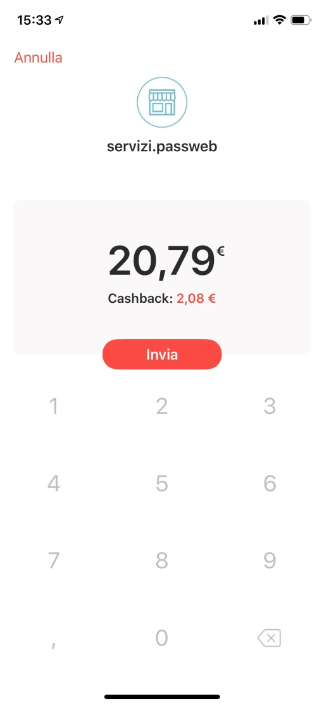

# SATISPAY

La modalità di pagamento etichettata a default come **Satispay**
consente agli utenti del sito di effettuare il pagamento dei propri
ordini mediante la piattaforma online di Satispay
(<https://www.satispay.com/>) e, soprattutto, mediante la relativa App
Mobile.

**ATTENZIONE!** Lato esercente per poter attivare questa specifica
modalità di pagamento è necessario **disporre di un proprio Account
Satispay di tipo Business**. Per maggiori informazioni in merito alla
creazione di un account di questo tipo e ad eventuali costi aggiuntivi
si rimanda alla relativa piattaforma online
(<https://www.satispay.com/>).

Una volta attivato il proprio account Satispay, per completare la
configurazione del pagamento lato Passweb sarà necessario:

1.  Codificare all'interno della Tabella Pagamenti del gestionale uno
    specifico pagamento al quale poter poi agganciare il pagamento on
    line in oggetto assegnandogli, ad esempio, la descrizione
    **Satispay**

<!-- -->

2.  Effettuare una sincronizzazione sito -- gestionale in modo tale da
    rendere disponibile questo nuovo pagamento anche in Passweb
    all'interno della maschera **"Lista dei Metodi di Pagamento"**
    precedentemente esaminata.

3.  Attivare questa nuova modalità di pagamento secondo quanto descritto
    nel capitolo *"Configurazione Modalità di Pagamento"* di questo
    manuale.

4.  Impostare in maniera corretta i parametri specifici per questa
    particolare modalità di pagamento.

In particolare per poter eseguire quest'ultimo passaggio sarà necessario
selezionare il pagamento in oggetto all'interno della maschera **"Lista
dei Metodi di Pagamento"** e cliccare sul pulsante "**Modifica
Pagamento**", presente nella barra degli strumenti.

Verrà quindi visualizzata la maschera di configurazione e
personalizzazione del pagamento, all'interno della quale sarà necessario
impostare, oltre ai parametri classici di configurazione del pagamento,
anche quelli specifici del gateway attualmente considerato e presenti
all'interno della sezione "**Parametri Gateway**"

{width="5.545138888888889in"
height="3.2729166666666667in"}

Nel caso specifico il parametro:

- **Ambiente del Gateway:** permette di definire se utilizzare come
  ambiente del pagamento, l'ambiente di test (da utilizzare solo ed
  esclusivamente in fase di sviluppo del sito) oppure l'ambiente reale
  di produzione.

- **Token:** consente di inserire il codice di attivazione della
  modalità di pagamento in esame. Tali codici dovranno essere scaricati,
  sia per l'ambiente di Test che per quello di Produzione, operando
  direttamente dalla Dashboard di Satispay

**NOTA BENE**: per eventuali malfunzionamenti o problemi relativi ad
addebiti o accrediti sui c/c o all' applicazione di Back Office, occorre
rivolgersi alla relativa assistenza.

Una volta impostati correttamente i parametri presenti all'interno della
sezione "Configurazione Parametri Gateway", se l'utente dovesse, alla
conferma dell'ordine, selezionare la modalità di pagamento in esame,
l'ordine sarà memorizzato nel database di Passweb, e l'utente verrà
reindirizzato sulla piattaforma di Satispay dove, oltre all'importo da
pagare, gli verrà mostrato anche un apposito QR Code.

{width="4.980555555555555in"
height="3.045138888888889in"}

**A questo punto però l'ordine non è ancora stato preso in carico dalla
banca e, conseguentemente, non è ancora avvenuto alcun pagamento**.
L'utente potrà ancora decidere, quindi, di annullare tutto oppure di
portare a termine l'acquisto e completare la transazione.

Nel primo caso, annullamento della transazione, l'utente verrà
reindirizzato al sito ecommerce dove si troverà l'ordine già confermato
e non avrà modo di modificarlo. Come detto, infatti l'ordine viene
memorizzato nel database di Passweb prima che l'utente venga ricondotto
al sito della banca.

In queste condizioni però l'utente non ha ancora effettuato il pagamento
per cui l'ordine, memorizzato nel database di Passweb, assumerà lo stato
di "Pagamento Non Confermato" e, conseguentemente, alla sincronizzazione
non verrà inserito in maniera automatica all'interno del gestionale.

**In queste stesse condizioni, nel caso in cui l'utente volesse
effettuare comunque l'ordine utilizzando però una diversa modalità di
pagamento, dovrà ripartire da zero inserendo gli articoli in carrello ed
effettuando nuovamente la procedura di checkout.**

Nel secondo caso per completare il pagamento sarà sufficiente
scansionare con la relativa App Mobile il QR Code mostrato a video in
maniera tale ricevere direttamente sul proprio Smartphone la conferma di
pagamento

{width="2.33125in"
height="5.052083333333333in"}

Utilizzando il pulsante "Invia" il pagamento verrà completato e, nel
caso in cui l'utente dovesse avere ancora la pagina web aperta, verrà
automaticamente ricondotto alla pagina di "Ordine Registrato".

Il numero ordine che viene riportato nella mail o visualizzato nel Back
Office rappresenta l'identificativo dell'ordine sul database di Passweb.
Per determinare la sigla ordine gestionale corrispondente
all'identificativo è necessario utilizzare la pagina Gestione Ordini del
Wizard. Effettuando infatti una ricerca per identificativo, verrà
visualizzato il record indicante la sigla dell'ordine utilizzata sul
gestionale (se l'ordine è già stato registrato, se l'ordine non è stato
ancora inserito sul gestionale campo sarà invece vuoto).

**NOTA BENE**: eventuali notifiche di avvenuta transazione
sull'applicazione mobile di Satispay, così come accrediti e addebiti sui
relativi c/c sono gestiti totalmente dalla relativa piattaforma

**ATTENZIONE!** **Satispay supporta la modalità Server to Server** per
cui quand'anche l'utente dovesse chiudere il browser prima di confermare
il pagamento sull'App mobile, comunque a pagamento effettuato verrà
inviata al sito Ecommerce apposita notifica per cui il relativo ordine
potrà correttamente essere inserito anche sul gestionale

In ogni caso nel momento in cui siano stati effettuati ordini a seguito
dei quali la piattaforma di finanziamento non ha restituito alcuna
risposta tali ordini resteranno unicamente all'interno del database di
Passweb nello stato di **"Pagamento Non Confermato"**.

Per maggiori informazioni relativamente a come poter gestire eventuali
ordini in stato di **"Pagamento Non Confermato"** si veda anche quanto
indicato all'interno del capitolo "*Ordini -- Ordini -- Stati
dell'Ordine*" di questo manuale.

