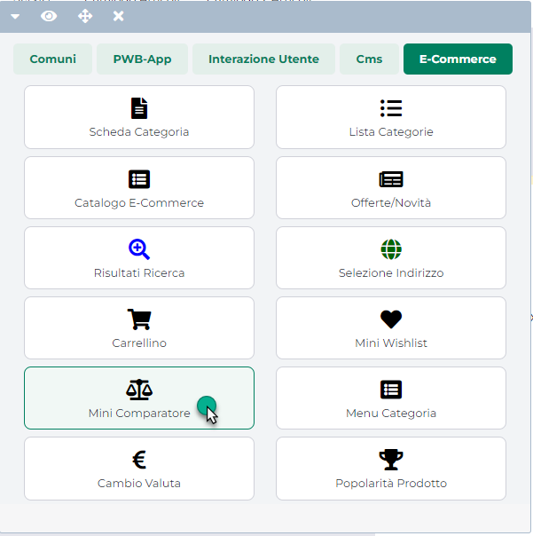
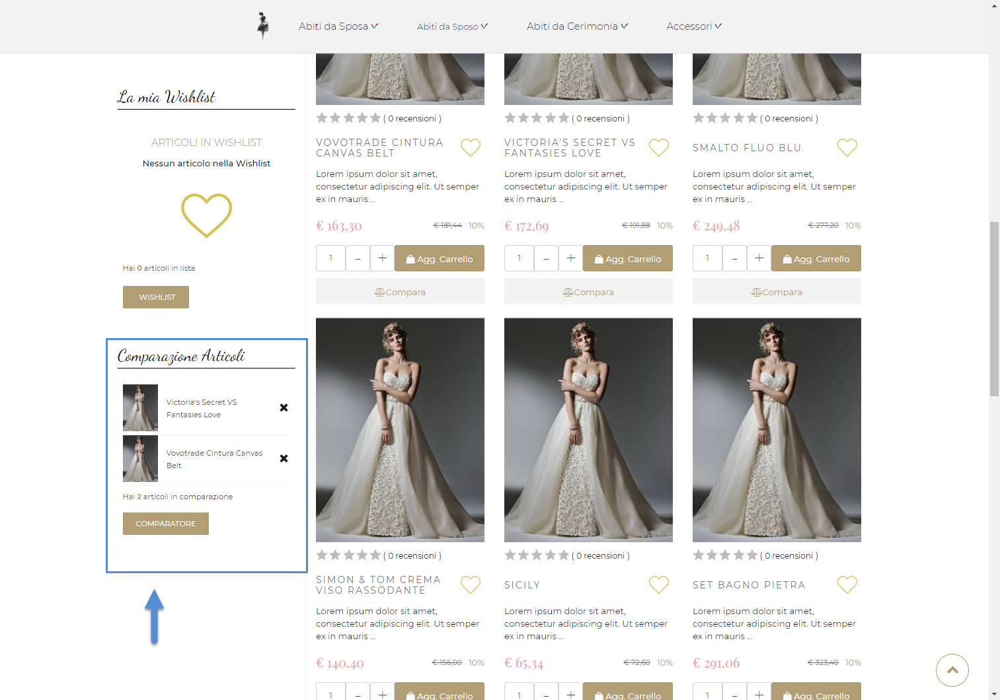
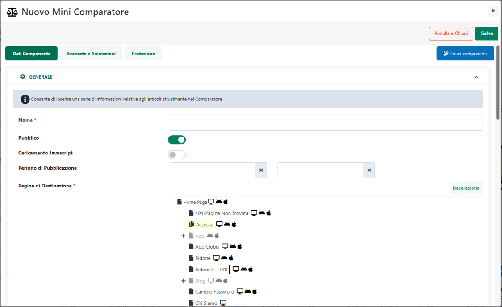

# STRIPE

**ATTENZIONE! Per poter gestire i pagamenti mediante la piattaforma
digitale Stripe è necessario attivare prima cosa il relativo modulo su
Passstore**

Stripe ( <https://stripe.com> ) è una piattaforma globale per la
gestione dei pagamenti online completamente integrata e basata su cloud
che consente ai commercianti e alle aziende di mettere a disposizione
dei propri clienti diversi metodi di pagamento tra cui: carte di
credito, carte di debito, Alipay, Apple Pay, Google Pay, Addebito SEPA
ecc...

E' una soluzione rapida (i pagamenti vengono elaborati praticamente
all'istante) e sicura. Stripe infatti risponde ai requisiti più severi
in fatto di sicurezza ed è certificato come provider di servizi conforme
allo standard PCI di livello 1.

Gli utenti del sito non avranno bisogno di un account Stripe per poter
effettuare dei pagamenti, tutto ciò di cui avranno bisogno sarà infatti
una carta di credito, bancomat o ricaricabile valida

E' un servizio che non ha costi di attivazione o canoni mensili; si paga
solamente sulla base delle transazioni effettuate e del metodo di
pagamento selezionato dall'utente. Ad esempio, verrà addebitato un costo
fisso e una percentuale sul valore della transazione ogni volta che si
accetta un pagamento con carta di credito o di debito (la tariffa è la
stessa per tutte le carte europee e non si paga se l'addebito non va a
buon fine). Per maggiori informazioni relativamente alle tariffe
proposte dalla piattaforma si consiglia comunque di fare riferimento al
relativo prezzario (<https://stripe.com/it/pricing> )

Per poter attivare sul proprio sito Ecommerce i pagamenti mediate la
piattaforma Stripe occorre soddisfare due prerequisiti di fondamentale
importanza. Nello specifico è necessario:

- **Disporre di un account Stripe valido e correttamente funzionante**.

> Nel caso in cui non si disponga di questo account sarà possibile
> crearlo, senza costi aggiuntivi, partendo dalla relativa pagina di
> registrazione <https://dashboard.stripe.com/register>
>
> Una volta registrato l'account, questo andrà poi attivato fornendo
> tutti i dati richiesti tra cui ovviamente quelli del conto bancario su
> cui dovranno poi essere accreditati i pagamenti.
>
> **ATTENZIONE!** Solo dopo aver attivato l'account sarà possibile
> sfruttare al 100% tutte le potenzialità della piattaforma
>
> Per attivare determinati metodi di pagamento potrebbe infatti essere
> richiesta l'attivazione dell'account, così come, ovviamente, verrà
> richiesta l'attivazione dell'account anche prima di poter prelevare
> tutti i codici necessari per realizzare l'integrazione con il proprio
> sito ecommerce in ambiente live (produzione)

- **Aver attivato per il proprio sito ecommerce un certificato SSL.**

> Dal punto di vista della sicurezza, come precedentemente evidenziato,
> Stripe è certificato come provider di servizi conforme allo standard
> PCI di livello 1 che è attualmente il più rigoroso in ambito di
> pagamenti on line.
>
> Non sarà lo shop online a gestire i dati sensibili delle carte, dati
> questi che verranno invece traferiti al server sicuro di Stripe senza
> "passaggi" intermedi. In tutto questo per garantire uno standard di
> sicurezza elevato è chiaro che la comunicazione con il server di
> Stripe debba essere quanto meno criptata e che il sito debba quindi
> disporre di un proprio certificato SSL. Per maggiori informazioni si
> consiglia comunque di consultare la relativa sezione sicurezza sul
> sito di Stripe (<https://stripe.com/docs/security/stripe> )

Una volta soddisfatti i due prerequisiti appena evidenziati sarà poi
necessario:

1.  Codificare all'interno della Tabella Pagamenti del gestionale una
    specifica entry alla quale poter agganciare il pagamento on line in
    oggetto assegnandogli, ad esempio, la descrizione "Stripe".

2.  Effettuare una sincronizzazione sito -- gestionale in modo tale da
    rendere disponibile questo nuovo pagamento anche in Passweb
    all'interno della maschera **"Lista dei Metodi di Pagamento"**
    precedentemente esaminata.

3.  Attivare questa nuova modalità di pagamento secondo quanto descritto
    nel capitolo *"Configurazione Modalità di Pagamento"* di questo
    manuale.

4.  Impostare in maniera corretta i parametri specifici per questa
    particolare modalità di pagamento.

In particolare per poter eseguire quest'ultimo passaggio sarà necessario
selezionare il pagamento in oggetto all'interno della maschera **"Lista
dei Metodi di Pagamento"** e cliccare sul pulsante "**Modifica
Pagamento**", presente nella barra degli strumenti.

Verrà quindi visualizzata la maschera di configurazione e
personalizzazione del pagamento, all'interno della quale sarà necessario
impostare, oltre ai parametri classici di configurazione del pagamento,
anche quelli specifici del gateway attualmente considerato e presenti
all'interno della sezione " **Parametri Gateway**

{width="5.844444444444444in"
height="3.441666666666667in"}

Nello specifico all'interno di questa sezione sarà possibile indicare un
valore per i seguenti parametri:

- **Ambiente del Gateway:** permette di definire se utilizzare come
  ambiente del pagamento, l'ambiente di test (da utilizzare solo ed
  esclusivamente in fase di sviluppo del sito) oppure l'ambiente reale
  di produzione. Per maggiori informazioni relativamente a come poter
  passare, su Stripe, dall'ambiente di test a quello di produzione si
  veda anche quanto indicato nel successivo capitolo ("*Stripe Parametri
  di integrazione*") di questo manuale o comunque si faccia riferimento
  alla documentazione della specifica piattaforma

- **Chiave pubblica / segreta:** all'interno di questi campi andranno
  impostate le chiavi di configurazione necessarie per poter garantire
  l'integrazione tra il proprio sito Ecommerce e la piattaforma Stripe.
  Per maggiori informazioni relativamente a dove e a come poter reperire
  queste informazioni si veda anche quanto indicato nel successivo
  capitolo ("*Parametri di integrazione*") di questo manuale

- **Contabilizzazione:** consente di specificare se la contabilizzazione
  delle transazioni effettuate dovrà avvenire in maniera "Immediata"
  (**Addebito Immediato**) o "Differita" (Autorizzazione).

> Di base contabilizzazione immediata permetterà all'esercente di
> rendere automaticamente contabili tutte le transazione autorizzate,
> senza un suo specifico intervento da effettuare all'interno della
> relativa applicazione di Back Office
>
> Una contabilizzazione differita richiederà invece che le operazioni
> autorizzate siano esplicitamente rese contabili dall'esercente
> attraverso la relativa applicazione di Back Office.

- **Metodi di Pagamento:** consente di selezionare tra quelli proposti,
  i metodi di pagamento che dovranno poi essere mostrati all'utente nel
  momento in cui verrà ricondotto sulla pagina di pagamento di Stripe.

> Ovviamente affinché il metodo di pagamento selezionato venga
> effettivamente mostrato nella pagina di pagamento gestita da Stripe è
> necessario che questo stesso pagamento sia stato correttamente
> attivato e configurato anche nel back end di Stripe
>
> **ATTENZIONE!** Per poter attivare determinate modalità di pagamento
> in ambiente live (produzione) sarà necessario per prima cosa
> completare l'attivazione del proprio account Stripe
>
> Sotto questo punto di vista è quindi possibile procedere in due modi
> diversi. Si potrebbe infatti:

- Codificare lato Passweb un solo pagamento di tipo "Stripe" attivando
  per esso diverse possibili modalità da proporre all'utente.

> In queste condizioni l'effettiva scelta del metodo di pagamento da
> utilizzare (Carta, Bonifico ecc...) verrà effettuata nella pagina
> gestita da Stripe su cui l'utente verrà ricondotto dopo aver
> selezionato sul sito Ecommerce il pagamento in esame

- Codificare lato Passweb N distinti pagamenti di tipo "Stripe"
  attivando per ciascuno di essi una sola modalità di pagamento (ad
  esempio un pagamento Stripe con attiva la modalità "Carte di Credito"
  e un altro pagamento Stripe con attiva la modalità "Bonifico")

> In queste condizioni quindi l'effettiva scelta del metodo di pagamento
> da utilizzare avverrà direttamente sul sito Ecommerce, dopo di che
> l'utente verrà ricondotto sulla pagina gestita da Stripe dove potrà
> inserire i dati necessari al completamento della transazione senza
> però poter selezionare una modalità diversa da quella indicata in
> partenza

Una volta impostati correttamente i parametri di configurazione, se
l'utente dovesse, alla conferma dell'ordine, selezionare la modalità di
pagamento in esame, l'ordine sarà memorizzato nel database di Passweb, e
l'utente verrà reindirizzato sul gateway di pagamento dove, come detto,
a seconda della configurazione attivata potrà indicare la specifica
modalità di pagamento da utilizzare o semplicemente inserire i dati
richiesti per completare il pagamento.

{width="5.325in"
height="3.4743055555555555in"}

**A questo punto però l'ordine non è ancora stato preso in carico da
Stripe e, conseguentemente, non è ancora avvenuto alcun pagamento**.
L'utente potrà ancora decidere, quindi, di annullare tutto (pulsante
"Indietro") oppure di portare a termine l'acquisto e completare la
transazione.

Nel primo caso, annullamento della transazione, l'utente verrà
reindirizzato al sito ecommerce dove si troverà l'ordine ancora da
confermare. Volendo potrà dunque decidere di ripartire dalla situazione
attuale, modificando se necessario l'ordine in essere con l'aggiunta o
l'eliminazione di determinati articoli, selezionando altre tipologie di
trasporto e /o altri pagamenti ecc... per poi passare nuovamente a
concludere l'ordine.

Nel momento in cui l'utente, una volta ritornato al sito, dovesse
comunque decidere di non chiudere l'ordine, questo resterebbe
memorizzato nel database di Passweb in stato di "**Pagamento non
confermato**"

Nel secondo caso (conferma della transazione) dopo aver, eventualmente,
indicato il metodo di pagamento da utilizzare ed aver inserito i dati
richiesti, sarà sufficiente cliccare sul pulsante "**Paga**" per potare
a termine l'rodine.

{width="5.325in"
height="3.4743055555555555in"}

Una volta elaborato il pagamento e completata la transazione l'utente
sarà ricondotto automaticamente al sito Ecommerce e l'ordine, se
possibile, verrà immediatamente inserito all'interno del gestionale.

**NOTA BENE**: le mail di notifica di avvenuta transazione, così come
gli accrediti e addebiti sui relativi c/c sono gestiti totalmente dal
gateway di pagamento.

**NOTA BENE**: verranno inseriti all'interno del gestionale unicamente
gli ordini in relazione ai quali è stata ricevuta, dal gateway di
pagamento, una risposta positiva.

**ATTENZIONE!** **Stripe supporta la modalità Server to Server**. In
tale modalità l'applicazione di back office del gateway di pagamento
invierà una notifica al sito per gestire l'esito della transazione anche
nel caso in cui l'acquirente non dovesse fare ritorno sul sito
dell'esercente (ad esempio perché a transazione conclusa chiude
semplicemente il browser).

Per maggiori informazioni relativamente a come poter attivare la
modalità Server to Server si veda anche quanto indicato all'interno del
successivo capitolo di questo manuale ("*Parametri di integrazione*")

In ogni caso nel momento in cui siano stati effettuati ordini a seguito
dei quali, per qualsiasi motivo, il gateway di pagamento non ha
restituito alcuna risposta, tali ordini resteranno unicamente
all'interno del database di Passweb nello stato di **"Pagamento Non
Confermato"**.

Per maggiori informazioni relativamente a come poter gestire eventuali
ordini in stato di **"Pagamento Non Confermato"** si veda anche quanto
indicato all'interno del capitolo "*Ordini -- Ordini -- Stati
dell'Ordine*" di questo manuale.

**NOTA BENE**: per eventuali malfunzionamenti o problemi relativi ad
addebiti o accrediti sui c/c o alle applicazioni di Back Office di
proprietà del Gateway di paramento occorre rivolgersi alla relativa
assistenza.

