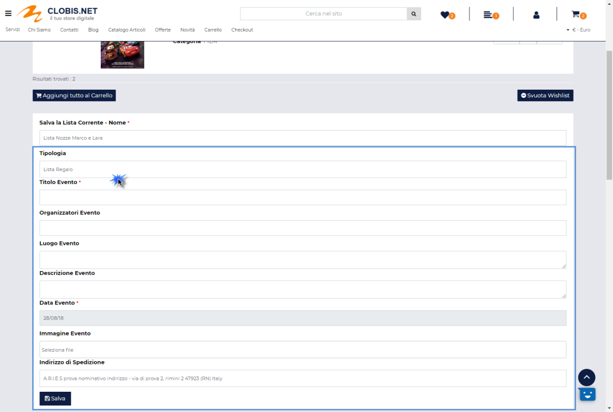
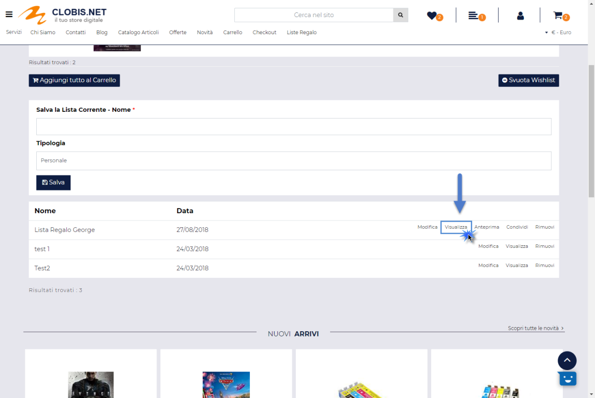
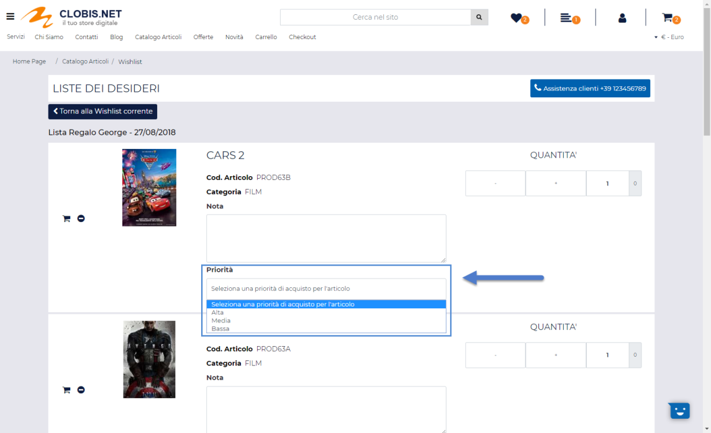
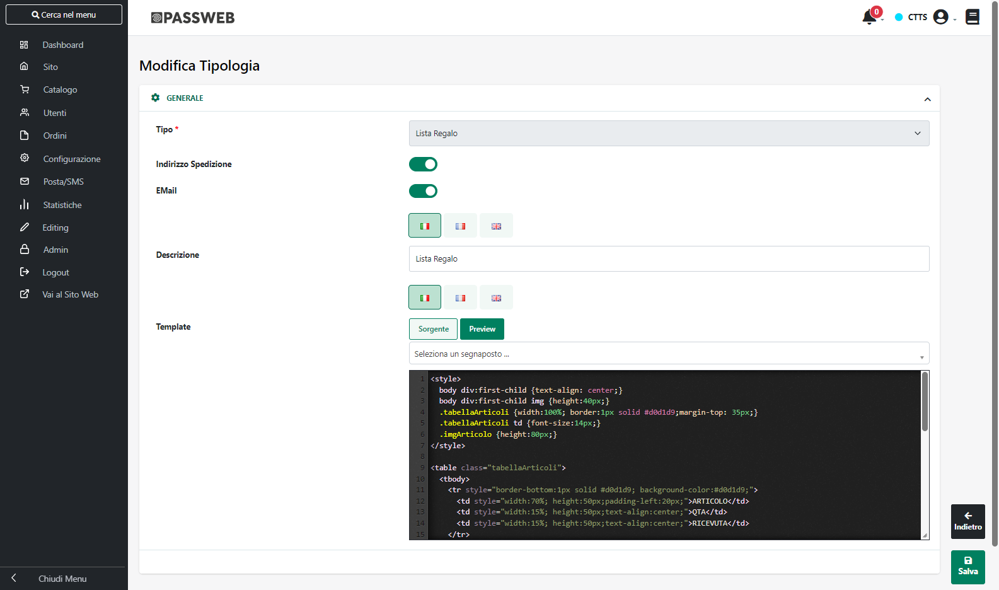

# APPLE PAY E GOOGLE PAY

Come evidenziato nei precedenti capitoli di questo manuale tra le
modalità di pagamento attivabili sulla piattaforma Stripe ci sono anche
**Apple Pay** e **Google Pay.**

Questo tipo di pagamenti verranno però attivati solo al verificarsi di
determinate condizioni in maniera tale da essere proposti ai soli utenti
che possono effettivamente utilizzarli

Nello specifico per quel che riguarda **Apple Pay** il relativo pulsante
di pagamento verrà visualizzato sul Checkout di Stripe al verificarsi
delle seguenti condizioni:

1.  La modalità di pagamento "**Apple Pay**" è stata correttamente
    attivata nella configurazione del Checkout all'interno del back end
    del proprio account Stripe.

> Per verificare questa attivazione è necessario:

- Effettuare l'accesso alla piattaforma di Stripe utilizzando il proprio
  account

- Accedere alle "**Impostazioni**" cliccando sulla corrispondente voce
  presente nel menu posto sulla sinistra della pagina

- Cliccare sulla voce "**Impostazioni di Checkout**" posta all'interno
  del pannello "Payments"

- Verificare che l'interruttore relativo ad Apple Pay presente
  all'interno della sezione relativa ai "**Portafogli Elettronici**" sia
  stato correttamente attivato

2.  Il device utilizzato dal cliente per effettuare il pagamento
    utilizza come sistema operativo **macOS 10.14.1** (o superiore)
    oppure **iOS 12.1** (o superiore).

3.  L'utente che effettua il pagamento sta utilizzando Safari

4.  L'utente che effettua il pagamento ha una carata di credito valida
    registrata con Apple Pay

Per ulteriori informazioni relativamente all'utilizzo di Apple Pay si
consiglia anche di consultare la relativa documentazione presente sul
sito di Appel

<https://support.apple.com/it-it/HT201239>

<https://support.apple.com/it-it/HT201239#safari>

<https://support.apple.com/it-it/HT204506>

Per quel che riguarda invece **Google Pay** il relativo pulsante di
pagamento verrà visualizzato, sul Checkout di Stripe, al verificarsi
delle seguenti condizioni:

1.  La modalità di pagamento "**Google Pay**" è stata correttamente
    attivata nella configurazione del Checkout all'interno del back end
    del proprio account Stripe.

> Per verificare questa attivazione è necessario:

- Effettuare l'accesso alla piattaforma di Stripe utilizzando il proprio
  account

- Accedere alle "**Impostazioni**" cliccando sulla corrispondente voce
  presente nel menu posto sulla sinistra della pagina

- Cliccare sulla voce "**Impostazioni di Checkout**" posta all'interno
  del pannello "Payments"

- Verificare che l'interruttore relativo ad Google Pay presente
  all'interno della sezione relativa ai "**Portafogli Elettronici**" sia
  stato correttamente attivato

2.  L'utente che effettua il pagamento sta utilizzando Chrome o Safari

3.  L'utente che effettua il pagamento ha una carata di credito valida
    registrata con Google Pay

Per maggiori informazioni relativamente alle condizioni di applicabilità
di questi pagamenti si consiglia di fare riferimento alla relativa
documentazione e / o assistenza offerta da Stripe

