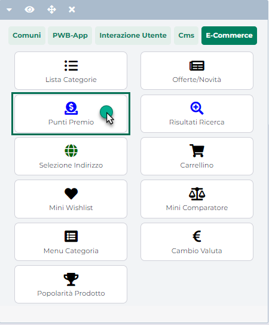

# INTEGRAZIONE PASSWEB -- MAGENTO / PRESTASHOP

Nel caso in cui Passweb dovesse essere utilizzato esclusivamente come
connettore tra uno dei gestionali Passepartout (Mexal / Ho.Re.Ca.) e
Magento / Prestashop, l'attivazione di determinate modalità pagamento
servirà solo ed esclusivamente per consentire di mappare i pagamenti
effettivamente in uso sulla piattaforma esterna con quelli presenti
nelle relative anagrafiche gestionali, facendo quindi in modo che gli
ordini acquisiti sulla piattaforma terza possano poi arrivare sul
gestionale con anche l'indicazione della specifica modalità di pagamento
selezionata dall'utente in fase di ordine.

Considerando quindi che, in queste condizioni, i pagamenti non dovranno
di fatto essere utilizzati sul front end di un sito Passweb, non sono
richieste particolari configurazioni, ne tanto meno è richiesta
l'attivazione di specifiche modalità di pagamento on line.

L'unico requisito necessario per far sì che un determinato pagamento
possa poi essere tra quelli effettivamente utilizzabili per mappare uno
dei pagamenti in uso su Magento / Prestashop è quello che prevede di
codificarlo all'interno del gestionale.

Una volta fatto questo alla successiva sincronizzazione il pagamento in
esame verrà esportato su Passweb e sarà subito disponibile (senza dover
dunque ne attivarlo ne tanto meno configurarlo in maniera particolare)
tra quelli selezionabili, in fase di mapping, all'interno del campo
"**Pagamento Gestionale**"

**ATTENZIONE!** Nel caso in cui dovesse essere acquisito da Magento /
Prestashop un ordine con l'indicazione di un pagamento che non è stato
correttamente mappato, il corrispondente documento verrà inserito nel
gestionale con il campo relativo al pagamento non valorizzato.

Per maggiori informazioni relativamente a come poter effettuare questa
mappatura si veda anche quanto indicato all'interno del capitolo
"*Catalogo -- Altri Marketplace -- Magento / Prestashop --
Configurazione Ordini -- Metodi di Pagamento*" di questo manuale.

