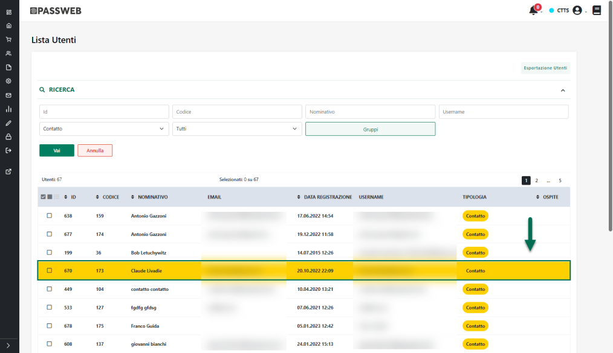
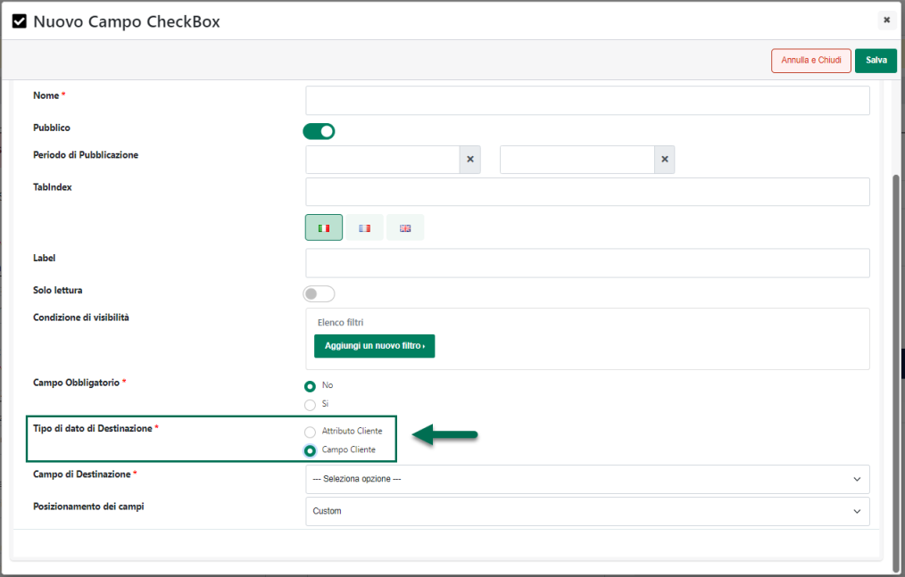
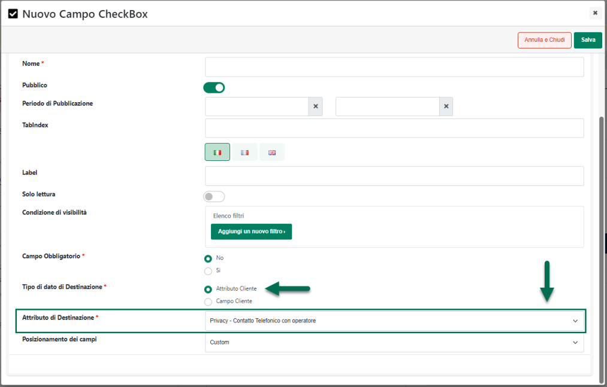
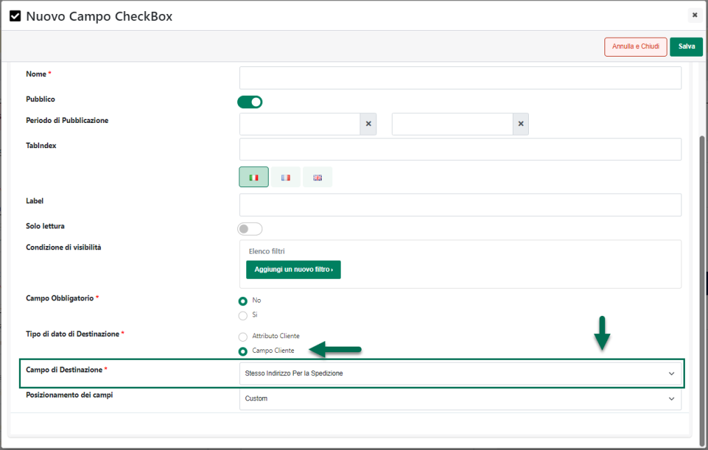
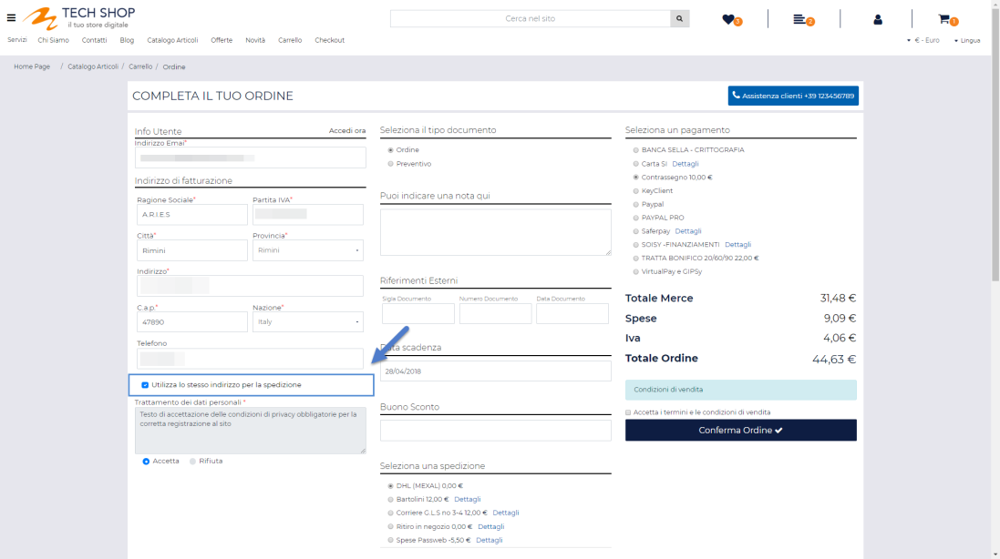
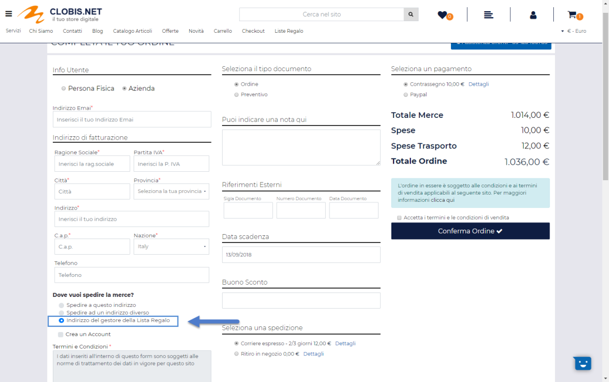

# ZONE DI SPEDIZIONE

Tutti i parametri esaminati fino a questo momento definiscono alcune
caratteristiche di base della tipologia di spesa di trasporto che si sta
configurando **ma non indicano ancora la specifica modalità di calcolo
(es. fissa o tabellare) da applicare alla spesa di trasporto in
questione, così come non indicano neppure i relativi importi**.

**Tali informazioni, infatti non vengono associate alla modalità di
spedizione nel suo complesso, ma bensì alla specifica zona di spedizione
in cui verrà poi inviata la merce.**

**NOTA BENE:** è possibile associare ad ognuno dei metodi di trasporto
definiti una o più zone di spedizione in relazione alle quali sarà poi
possibile indicare la modalità di calcolo delle spese (fisse o
tabellari) ed i relativi importi.

Considerando poi che, potrebbe configurarsi la necessità di codificare
la stessa tipologia di calcolo delle spese di trasporto, e anche gli
stessi importi, per differenti aree geografiche, Passweb offre
all'utente la possibilità di organizzare e raggruppare queste aree in
**Zone di spedizione** distinte.

Per ogni singola Zona di spedizione sarà quindi possibile definire la
tipologia di calcolo delle spese di trasporto con i relativi importi e
associare poi alla zona stessa una o più aree geografiche distinte
selezionando in questo senso la Nazione, la Regione, la Provincia, la
Località e anche il singolo C.A.P. che identificano l'area geografica
desiderata.

**NOTA BENE:** la selezione della Regione potrà avvenire solo ed
esclusivamente in relazione alla nazione Italia. Per tutte le altre
nazioni sarà invece possibile indicare Provincia/Stato, Località e
Codice di Avviamento Postale.

Infine è anche possibile, volendo, escludere determinate aree
geografiche dalla zona di spedizione che si sta configurando.

La sezione **"Zone di Spedizione"** presente all'interno della maschera
"**Configurazione del Metodo di Trasporto**" consente di realizzare
tutto quanto sopra indicato.

Per prima cosa sarà quindi necessario creare una nuova "**Zona di
spedizione**" in relazione alla quale andranno poi definite le modalità
di calcolo della spesa di trasporto oltre, ovviamente, alle varie aree
geografiche da associare alla zona stessa.

**Una volta impostati i parametri di configurazione precedentemente
analizzati, cliccando sul pulsante "Salva" presente nella parte bassa
della maschera verrà automaticamente creata una prima Zona di spedizione
con associata l'area geografica "Tutto il mondo".**

In ogni caso tale Zona potrà sempre essere modificata e/o eliminata
secondo le specifiche esigenze del caso.

I pulsanti presenti nella barra degli strumenti consentono infatti di:

- **Modifica / Elimina Zona**
  ( )
  ( ): consente di modificare / eliminare la Zona di
  spedizione attualmente selezionata in elenco.

- **Svuota**
  ( ): consente di eliminare in blocco
  tutte le Zone di spedizione presenti in elenco.

- **Aggiungi Zona**
  ( ): consente di creare una nuova Zonda di spedizione

Cliccando su quest'ultimo pulsante verrà infatti aperta la maschera
"**Configura Zona**" all'interno della quale poter specificare i
parametri di configurazione della Zona stessa

In particolare per ogni singola Zona di spedizione sarà necessario
indicare un valore per i seguenti parametri:

**Nome:** consente di impostare un'etichetta identificativa della Zona
di spedizione che si sta codificando

**Tipo di Spesa:** consente di definire la specifica modalità di calcolo
che dovrà essere utilizzata per le spese di trasporto associate alla
Zona che si sta codificando. E' possibile selezionare uno tra i seguenti
valori:

- **Fissa:** in questo caso verranno considerate, per la zona in
  oggetto, spese di trasporto **Fisse** il cui importo dovrà essere
  indicato all'interno del successivo campo "**Indicare i parametri di
  Spesa (Valore)**".

- **Sommatoria:** selezionando questo valore verranno considerate, per
  la zona in oggetto, delle spese di trasporto calcolate:

  - **Ecommerce Mexal:** sulla base del valore inserito, per ogni
    singolo articolo in ordine, all'interno del campo Mexal collegato
    alla "Funzionalità" **"Spese di trasporto a Scaglioni"** oppure,
    dipendentemente dalla configurazione adottata, sulla base del valore
    inserito, per ogni singolo articolo in ordine, all'interno dell'
    Attributo Articolo indicato in corrispondenza del campo
    "**Attributo**" presente tra i parametri di configurazione del
    metodo di trasporto in oggetto.

  - **Ecommerce Ho.Re.Ca**.: sulla base del valore inserito, per ogni
    singolo articolo in ordine, all'interno del campo "**Misuratore
    Trasporto a Scaglioni**" della sua Anagrafica Passweb.

- **Tabellare:** selezionando questo valore verranno considerate, per la
  zona in oggetto, delle spese di trasporto **Tabellari.** Sarà quindi
  necessario definire i vari scaglioni con i relativi importi da
  applicare

**ATTENZIONE!** per maggiori informazioni in merito alle diverse
tipologie di spesa si vedano anche i successivi capitoli di questo
manuale

Una volta definita la modalità di calcolo da utilizzare per la Zona di
spedizione che si sta codificando, sarà necessario associare a questa
stessa zona una o più aree geografiche agendo, in questo senso,
all'interno della sezione "**Aree di Spedizione**".

In questo senso sarà possibile agire in maniera inclusiva, andando
quindi ad includere una ad una tutte le aree geografiche da associare
alla Zona in esame, oppure, volendo sarà possibile operare anche in
maniera esclusiva andando cioè ad escludere dalla Zona in esame
determinate aree geografiche.

**Ovviamente nel momento in cui si dovesse decidere di lavora in maniera
"esclusiva" sarà comunque indispensabile includere nella stessa Zona
almeno un'area geografica valida**

**ATTENZIONE!** Zone di spedizione con sole aree geografiche da
escludere non avrebbero, ovviamente, alcun senso e il relativo metodo di
trasporto non potrebbe mai essere visualizzato all'interno del sito

In altri termini supponendo, ad esempio, di dover gestire un determinato
vettore che effettua spedizioni in tutta Italia tranne che ad Anacapri,
anziché andare ad includere nella nostra Zona di spedizione uno ad uno
tutte le regioni e le provincie gestite dal vettore potremmo, in maniera
molto più semplice:

- Creare una prima area geografica corrispondente a tutta l'Italia e
  quindi con le opzioni:

  - Gestione = Includi

  - Nazione = Italy

- Creare una seconda area geografica da escludere relativa alla sola
  città di Anacapri e quindi con le opzioni:

  - Gestione = Escludi

  - Nazione = Italy

  - Provincia = Napoli

  - CAP = 80071

Per includere o escludere determinate aree geografiche dalla Zona di
spedizione che si sta codificando è sufficiente agire dai relativi
pulsanti presenti nella barra degli strumenti della sezione "Aree di
Spedizione", pulsanti questi che consentono rispettivamente di:

**Italia** (
 ): consente di associare alla zona di
spedizione che si sta codificando una specifica area geografica
all'interno della nazione Italia.

Cliccando su questo pulsante verrà infatti visualizzata la maschera
"**Configurazione Italia**"

all'interno della quale sarà necessario indicare un valore per i
seguenti parametri:

**Gestione**: consente di decidere se l'area geografica che si sta
codificando dovrà essere **inclusa** o **esclusa** dalla relativa zona
di spedizione:

**ATTENZIONE!** si ricorda che Zone di spedizione con sole aree
geografiche da escludere non avrebbero, ovviamente, alcun senso e il
relativo metodo di trasporto non potrebbe mai essere visualizzato
all'interno del sito. Nel momento in cui si dovesse decidere, dunque, di
escludere determinate aree geografiche da una zona di spedizione sarà di
fondamentale importanza verificare che, per la stessa zona, sia
presente, almeno, anche un' area geografica il cui parametro
"**Gestione**" è stato correttamente impostato su "**Includi**"

**Regione / Provincia / Località / CAP**: consente di specificare la
Regione / Provincia / Località / CAP dell'area geografica che si sta
codificando

Selezionando la regione verrà visualizzata la combo box relativa alle
provincie della regione stessa e, una volta indicata la provincia,
verranno visualizzati il campo relativo alle località e l'area
all'interno della quale poter differenziare ulteriormente in base ai
singoli codici di avviamento postale (**utile soprattutto nel caso in
cui sia necessario gestire i "C.A.P." disagiati**)

Per aggiungere un nuovo C.A.P. sarà sufficiente indicarlo all'interno
dell'apposito campo e confermare poi da tastiera con il pulsante
"Invio".

In fase di inserimento dei C.A.P è inoltre possibile utilizzare il
carattere "\_" come wildcard per sostituire uno dei caratteri
effettivamente presenti nel relativo codice di avviamento postale.

**ATTENZIONE!** è fondamentale gestire correttamente il carattere \_
ricordando sempre che **un "underscore" sostituisce un solo carattere**

Supponendo dunque di indicare come C.A.P. il valore "4_900" verranno poi
presi in considerazione e validati tutti i codici di avviamento postale
che hanno come primo carattere 4, come secondo carattere un qualunque
valore, come terzo carattere 9, come quarto carattere 0 e come quindi
carattere ancora 0

Supponendo invece di indicare come C.A.P. il valore "**47\_\_\_**" (47
seguito da tre distinti caratteri di underscore), verranno poi presi in
considerazione e validati tutti i codici di avviamento postale che
iniziano con 47 e che proseguono con altri 3 caratteri qualsiasi.

**Km:** consente di indicare quella che dovrà essere la distanza massima
(in chilometri) tra l'indirizzo di spedizione merce indicato dall'utente
in fase di checkout ed eventuali punti vendita associati al metodo di
trasporto, affinché questi stessi punti vendita possano essere ritenuti
"validi" per la spedizione.

**ATTENZIONE! Il campo Km verrà visualizzato solo nel momento in cui per
il metodo di trasporto in esame sia stata correttamente attivata la
gestione dei punti vendita (parametro "Gestione dei Punti Vendita" =
SI)**

In altri termini dunque se la distanza tra l'indirizzo di spedizione
indicato dal cliente e i punti vendita associati al metodo di trasporto
dovesse essere in ogni caso superiore a quanto indicato all'interno del
campo Km, il metodo di trasporto in esame non sarà selezionabile in fase
di checkout. Per maggiori informazioni in merito di veda anche quanto
indicato all'interno del precedente capitolo ("*Trasporto a mezzo
mittente*") di questo manuale

**ATTENZIONE**! Per fare in modo che la distanza tra l'indirizzo di
spedizione merce indicato dall'utente ed eventuali punti vendita
associati al metodo di trasporto venga calcolate in maniera corretta è
necessario verificare di aver inserito la chiave corretta all'interno
del campo "***Chiave Google Maps Distance API" alla pagina "Sito --
Preferenze -- Integrazioni***" del Wizard

Il pulsante "**Salva**" presente nella parte bassa della pagina consente
di salvare l'area geografica codificata accodandola a quelle già
presenti in elenco.

Relativamente al salvataggio della nuova area geografica occorre anche
considerare le seguenti casistiche:

- Se è già presente in elenco un'area geografica precedentemente
  codificata come "**Italia -- Tutte le regioni**" e, per la nuova area
  che si sta codificando, viene indicata invece oltre alla nazione
  Italia anche una specifica regione e/o provincia, alla conferma l'area
  "Italia-Tutte le Regioni" sarà automaticamente rimossa e sostituita
  dalla specifica area appena codificata

- Se in elenco sono già presenti una o più aree geografiche del tipo
  "**Italia-Regione-Specifica Provincia**" e per la nuova area che si
  sta codificando viene selezionata l'opzione "Tutte le regioni", alla
  conferma tutte le aree "Italia-Regione-Provincia" saranno rimosse

- Se è già presente in elenco un'area geografica codificata come
  "**Italia-Regione-Provincia-Cap**" e per la nuova area che si sta
  codificando viene indicata, oltre alla nazione Italia, anche la stessa
  regione e la stessa provincia ma non il CAP, alla conferma l'area
  precedentemente presente in elenco verrà eliminata e sostituita da
  quella nuova appena codificata

- Se è già presente in elenco un'area geografica codificata come
  "**Italia- Regione-Provincia**" e per la nuova area che si sta
  codificando viene indicata, oltre alla nazione Italia, anche la stessa
  regione, la stessa provincia e in più anche una specifica località e/o
  uno specifico CAP, alla conferma l'area precedentemente presente in
  elenco verrà eliminata e sostituita da quella nuova appena codificata.

- Se è già presente in elenco un'area geografica codificata come
  "**Italia -Regione-Provincia -- Località**" e per la nuova area che si
  sta codificando viene indicata, oltre alla nazione Italia anche la
  stessa regione, la stessa provincia, la stessa località e in più
  vengono indicati anche specifici CAP, alla conferma l'area
  precedentemente presente in elenco verrà eliminata e sostituita da
  quella nuova appena codificata.

- Se sono già presenti in elenco aree geografica codificate come
  "**Italia -- Regione-Provincia --Località --CAP**" e per la nuova area
  che si sta codificando viene indicata oltre alla nazione Italia anche
  la stessa regione, la stessa provincia e la stessa la località ma non
  il CAP, alla conferma tutte le aree precedentemente codificate anche
  il CAP associato verranno eliminate e sostituite da quella nuova
  appena codificata.

- Se sono già presenti in elenco aree geografica codificate come
  "**Italia -- Regione - Provincia --Località --CAP**" e per la nuova
  area che si sta codificando viene indicata oltre alla nazione Italia
  anche la stessa regione e la stessa provincia ma non il CAP e la
  Località, alla conferma tutte le aree precedentemente codificate anche
  il CAP e la località associata verranno eliminate e sostituite da
  quella nuova appena codificata.

**Paesi Esteri** (
 ): consente di associare alla zona di
spedizione che si sta codificando una specifica area geografica
all'interno di una nazione diversa dall'Italia.

Cliccando su questo pulsante verrà visualizzata la maschera
"**Configurazione Paesi Esteri**"

all'interno della quale sarà necessario indicare un valore per i
seguenti parametri:

**Gestione**: consente di decidere se l'area geografica che si sta
codificando dovrà essere **inclusa** o **esclusa** dalla relativa zona
di spedizione:

**ATTENZIONE!** si ricorda che Zone di spedizione con sole aree
geografiche da escludere non avrebbero, ovviamente, alcun senso e il
relativo metodo di trasporto non potrebbe mai essere visualizzato
all'interno del sito. Nel momento in cui si dovesse decidere, dunque, di
escludere determinate aree geografiche da una zona di spedizione sarà di
fondamentale importanza verificare che, per la stessa zona, sia
presente, almeno, anche un' area geografica il cui parametro
"**Gestione**" è stato correttamente impostato su "**Includi**"

**Nazione / Stato / Provincia / Località / CAP**: consente di
specificare la Nazione, lo Stato / Provincia, la Località e il CAP
dell'area geografica che si sta codificando

Nel momento in cui l'esigenza dovesse essere quella di inserire,
all'interno di una zona geografica, più provincie contemporaneamente,
sarà sufficiente selezionarle dal relativo elenco sulla sinistra in
corrispondenza del campo "Stato / Provincia" ed inserirle in quello di
destra cliccando sull'icona della piccola freccia verde rivolta verso
destra.

Anche in questo caso in fase di inserimento di eventuali C.A.P sarà
possibile utilizzare il carattere "\_" come wildcard per sostituire uno
dei caratteri effettivamente presenti nel relativo codice di avviamento
postale.

**Nazioni** (
 ): consente di associare all'Area di
spedizione che si sta codificando una zona geografica relativa ad
un'intera Nazione (comunque diversa dall'Italia). Tale opzione risulta
quindi utile nel caso in cui si debbano configurare delle spese di
trasporto identiche per una o più Nazioni, senza dover necessariamente
indicare il dettaglio dello Stato/Provincia, della Località o del Codice
di Avviamento Postale.

Cliccando su questo pulsante verrà visualizzata la maschera
"**Configurazione Nazioni**"

all'interno della quale sarà necessario indicare un valore per i
seguenti parametri:

**Gestione**: consente di decidere se l'area geografica che si sta
codificando dovrà essere **inclusa** o **esclusa** dalla relativa zona
di spedizione:

**ATTENZIONE!** si ricorda che Zone di spedizione con sole aree
geografiche da escludere non avrebbero, ovviamente, alcun senso e il
relativo metodo di trasporto non potrebbe mai essere visualizzato
all'interno del sito. Nel momento in cui si dovesse decidere, dunque, di
escludere determinate aree geografiche da una zona di spedizione sarà di
fondamentale importanza verificare che, per la stessa zona, sia
presente, almeno, anche un' area geografica il cui parametro
"**Gestione**" è stato correttamente impostato su "**Includi**"

**Nazioni:** consente di indicare l'elenco delle Nazioni che devono
essere associate alla zona di spedizione che si sta codificando

Per associare alla zona di spedizione una specifica Nazione, è
sufficiente selezionarla dall'elenco di sinistra ed inserirla in quello
di destra cliccando sul pulsante raffigurante una piccola freccia verde
rivolta verso destra. Allo stesso modo per eliminare l'associazione tra
le zona di spedizione in esame ed una specifica Nazione, sarà
sufficiente selezionarla dall'elenco di destra e cliccare poi sul
pulsante raffigurante la piccola freccia rossa rivolta verso sinistra

**Importa da file** ( ): consente di definire le varie aree geografiche
da associare alla zona di spedizione in esame importandole in blocco da
un file di tipo txt o csv appositamente formattato.

Cliccando su questo pulsante verrà visualizzata la maschera
"**Importazione Aree da File**"

all'interno della quale poter selezionare (campo **File**), importandolo
ad esempio dal proprio pc, il file .txt o .csv con indicate tutte le
aree geografiche da associare alla zona in esame.

Il campo **Separatore** consente invece di indicare, selezionandolo,
dall'apposito menu a tendina, il carattere che è stato utilizzato
all'interno del file di importazione come separatore per i vari campi

Affinché la procedura possa terminare in maniera corretta è necessario
che il file txt o csv utilizzato soddisfi determinate regole. Nello
specifico:

- L'intestazione, ossia la prima riga del file, deve essere costituita
  dai seguenti campi

> *gestione;nazione;provincia;localita;cap;km*

- per ogni record del file (e quindi per ogni area geografica) è
  possibile inserire, nell'ordine indicato, le seguenti informazioni:

  - **gestione: 0** nel caso in cui la relativa area geografica debba
    essere inclusa nella Zona, **1** nel caso in cui la relativa area
    geografica debba essere esclusa

> **ATTENZIONE!** Il campo "gestione" non è obbligatorio e può quindi
> anche non essere inserito nel tracciato record del file di
> importazione. In questo caso (**campo non specificato**) **la relativa
> area geografica verrà considerata, a default, come inclusa** nella
> zona di spedizione

- **nazione**: codice iso a 2 caratteri della nazione

- **provincia**: sigla della provincia

- **localita**: nome della localita

- **cap**: codice di avviamento postale della localita (con possibilità
  di utilizzare il carattere "\_" come carattere wildcard)

- **km**: campo numerico con due decimali. Distanza massima (in
  chilometri) tra l'indirizzo di spedizione merce indicato dall'utente
  in fase di checkout ed eventuali punti vendita associati al metodo di
  trasporto, affinché questi stessi punti vendita possano essere
  ritenuti "validi" per la spedizione.

> **ATTENZIONE**! il campo km è gestito unicamente per Spedizioni in cui
> è attiva la gestione dei Punti Vendita

- Il carattere separatore dei vari campi deve essere esattamente quello
  indicato all'interno del campo "**Separatore**" presente nel form di
  importazione

- Il file di importazione deve soddisfare le specifiche del formato
  RFC4180.

> In questo senso è quindi necessario che il valore dei campi contenenti
> interruzioni di riga, doppi apici e/o lo stesso carattere utilizzato
> anche come separatore sia necessariamente racchiuso da virgolette

Supponendo di voler utilizzare come carattere separatore il ; la
struttura del file potrebbe quindi essere:

FR;;;;

IT;SA;;;

IT;RN;;47900;

IT;RN;Viserba;47922;1,00

IT;RN;Viserbella;;

Nelle condizioni sopra indicate verrebbero quindi aggiunte alla zona di
spedizione in esame 5 distinte aree geografiche: la prima relativa alla
nazione Francia, la seconda relativa all'area geografica corrispondente
alla provincia di Salerno in Italia, la terza relativa alla provincia di
Rimini e nello specifico al codice di avviamento postale 47900, la
quarta sempre relativa alla provincia di rimini ma più specificatamente
alla località Viserba e al codice di avviamento postale 47922 e per essa
verrebbe anche impostata una distanza massima di 1 Km. Infine la quinta
relativa alla provincia di rimini e nello specifico alla località
Viserbella.

> **NOTA BENE:** nel caso di "Importazione da file" non verranno
> effettuati controlli di alcun tipo relativamente alle aree geografiche
> eventualmente già associate alla zona in esame. Occorre quindi fare
> particolare attenzioni, in queste condizioni, a non inserire delle
> aree geografiche doppie o triple.

**Esporta** (
 ): consente di esportare all'interno di
un file csv, nello stesso formato valido anche per l'importazione,
l'elenco di tutte le aree geografiche attualmente associate alla zona di
spedizione in esame.

Cliccando su questo pulsante verrà visualizzata la maschera
"**Esportazione Aree**"

all'interno della quale poter indicare il carattere separatore che dovrà
essere utilizzato in fase di creazione del file csv.

Il pulsante "**Salva**" presente nella parte bassa della maschera
consente di avviare la procedura di esportazione

**Elimina Area** (
 ): consente di eliminare l'area geografica
attualmente selezionata in elenco

**Svuota** ( ): consente di eliminare in blocco tutte le aree
geografiche associate alla zona di spedizione in esame

##### SPESE FISSE

Nel momento in cui l'esigenza dovesse essere quella di utilizzare per
una determinata zona geografica delle spese di trasporto fisse, sarà
necessario impostare, per prima cosa, nella maschera di configurazione
della Zona, il parametro "**Tipo Spesa**" sul valore "**Fissa**" e
successivamente indicare l'esatto importo da applicare all'interno del
campo "**Valore**"

**Valore** consente di definire l'importo da applicare nel caso in cui
l'indirizzo di spedizione della merce rientri in una delle aree
geografiche associate alla zona che si sta codificando. Sono accettati i
seguenti valori:

- **Valori numerici positivi -- es. "20":** supponendo dunque di
  inserire all'interno del campo in esame il valore 20, nel caso in cui
  l'indirizzo di spedizione della merce rientri in una delle aree
  geografiche associate alla zona che si sta codificando, l'importo da
  considerare per la spesa di trasporto in oggetto sarà di 20 €

- **Valori numerici negativi -- es. "-20":** supponendo dunque di
  inserire all'interno del campo in esame il valore -20 nel caso in cui
  l'indirizzo di spedizione della merce rientri in una delle aree
  geografiche associate alla zona che si sta codificando l'importo da
  considerare per la spesa di trasporto in oggetto sarà di -20 €.

> **In queste condizioni dunque le spese di trasporto non aumenteranno
> il totale del documento ma, al contrario, andranno ad abbattere tale
> importo.**
>
> L'utilizzo di valori negativi potrebbe rivelarsi quindi
> particolarmente utile nel momento in cui l'esigenza dovesse essere, ad
> esempio, quella di applicare un certo sconto in carrello nel caso in
> cui l'utente dovesse selezionare uno specifico metodo di trasporto
> (es. -20€ sul totale merce per ritiro in negozio).

- **Valori percentuali positivi -- es. "20%":** supponendo dunque di
  inserire all'interno del campo in esame il valore 20%, nel caso in cui
  l'indirizzo di spedizione della merce rientri in una delle aree
  geografiche associate alla zona che si sta codificando, l'importo da
  considerare per la spesa di trasporto in oggetto sarà pari al 20% del
  Totale Merce o dell'Imponibile dipendentemente da quanto impostato per
  il parametro **"Scaglioni e Calcolo Percentuale**" presente nella
  maschera di configurazione del metodo di trasporto precedentemente
  esaminata

> Inoltre il Totale Merce così come l'Imponibile, utilizzato come base
> di calcolo, verrà considerato comprensivo o meno di eventuali articoli
> spesa aggiunti in carrello a seguito dell'applicazione di determinate
> promozioni o buoni sconto, dipendentemente dall'impostazione scelta
> per il parametro "**Gestione Totale Merce**" presente nella sezione
> "*Catalogo -- Configurazione Parametri Catalogo*" del Wizard

- **Valori percentuali negativi -- es. "-20%":** anche in questo caso
  l'importo da considerare per la spesa di trasporto verrà calcolato
  come percentuale del Totale Merce o dell'Imponibile dipendentemente da
  quanto impostato per il parametro **"Scaglioni e Calcolo
  Percentuale**" presente nella maschera di configurazione del metodo di
  trasporto precedentemente esaminata.

> Trattandosi inoltre di valori negativi, anche in queste condizioni le
> spese di trasporto non aumenteranno il totale del documento ma, al
> contrario andranno ad abbattere tale importo.
>
> **ATTENZIONE! Nel caso in cui si codifichino spese di trasporto con
> importi negativi (fissi o in percentuale) è indispensabile gestire la
> relativa spesa mediante articoli di tipo S (Spesa) da inserire nel
> corpo del documento (il gestionale non ammette infatti l'utilizzo di
> valori negativi per le spese di trasporto).**
>
> In questo senso sarà quindi necessario selezionare all'interno della
> maschera "Configurazione del Metodo di Trasporto" in corrispondenza
> del campo "Articolo" uno degli articoli spesa presenti nel
> corrispondente menu a tendina. Per maggiori informazioni in merito si
> veda anche il precedente capitolo "Trasporti di tipo Passweb" di
> questo manuale

**ATTENZIONE!** Il valore presente all'interno di questo campo o quello
risultante dalla percentuale indicata sarà considerato comprensivo di
IVA o meno dipendentemente da quanto impostato per il parametro "**Tipo
di Costo**" presente nella maschera di "Configurazione del metodo di
Trasporto".

**ATTENZIONE! come già indicato, nel momento in cui non dovesse essere
gestita un' aliquota fissa (e l'utente non dovesse avere la fatturazione
elettronica abilitata), l'IVA sulle spese di trasporto verrà ripartita
in base agli articoli presenti in ordine.**

Per evitare la ripartizione dell'IVA sulle spese di trasporto è quindi
necessario nel caso di:

**[SITI ECOMMERCE COLLEGATI A MEXAL]{.underline}**

Impostare un'aliquota fissa oppure un'apposita esenzione, all'interno
del campo "**Aliquota iva spese trasp**" presente nella tabella
"*Bolli/cti sp.banca/omaggi/rivalsa iva*" di Mexal

**[SITI ECOMMERCE COLLEGATI AD UNO DEI GESTIONALI
HO.RE.CA.]{.underline}**

Impostare un'aliquota fissa, all'interno del campo "**Aliquota iva spese
trasporto**" presente all'interno della maschera "Configurazione
Parametri dell'Ordine" del Wizard

**In ogni caso, indipendentemente dal fatto di considerare siti
collegati a Mexal o ad uno del gestionali Ho.Re.Ca. l'eventuale IVA
calcolata sulle spese di trasporto verrà sempre inserita nella
corrispondente voce del piede del documento**

##### SPESE CALCOLATE -- SOMMATORIA

Nel momento in cui l'esigenza dovesse essere quella di calcolare per una
determinata zona geografica delle spese di trasporto in maniera più
dinamica, potrebbe essere necessario impostare, nella maschera di
configurazione della Zona, il parametro "**Tipo Spesa**" sul valore
"**Sommatoria**"

In queste condizioni verranno considerate, per la zona in oggetto, delle
spese di trasporto calcolate nel caso di:

- **Siti Ecommerce collegati a Mexal:** sulla base del valore inserito,
  per ogni singolo articolo in ordine, all'interno del campo Mexal
  collegato alla "Funzionalità" **"Spese di trasporto a Scaglioni"**
  oppure, dipendentemente dalla configurazione adottata, sulla base del
  valore inserito, per ogni singolo articolo in ordine, all'interno
  dell' Attributo Articolo indicato in corrispondenza del campo
  "**Attributo**" presente tra i parametri di configurazione del metodo
  di trasporto.

- **Siti Ecommerce collegati ad uno dei gestionali Ho.Re.Ca**.: sulla
  base del valore inserito, per ogni singolo articolo in ordine,
  all'interno del campo "**Misuratore Trasporto a Scaglioni**" della sua
  Anagrafica Passweb.

In maniera più precisa, in queste condizioni, l'importo delle spese di
trasporto verrà determinato moltiplicando, per ogni articolo, la
quantità dello stesso inserita in ordine per il valore presente, per
questo stesso articolo, all'interno di uno dei campi sopra indicati. I
totali di queste moltiplicazioni verranno poi sommati tra loro ed il
risultato definitivo determinerà l'importo delle spese di trasporto.

L'importo ottenuto verrà espresso nella valuta indicata in fase di
configurazione della spesa. Nel caso in cui l'ordine effettuato
dall'utente faccia riferimento ad un\'altra valuta l'importo verrà
convertito nella valuta di destinazione.

**ESEMPIO**

Supponiamo di aver attivato in Mexal la Funzionalità "Spese di Trasporto
a Scaglioni" e di aver impostato per i due articoli **LETTDVD1 e
LETTDVD2** il campo Spese Trasp. A Scagli sui valori:

**LETTDVD1 🡪 Spese Trasp. A Scagli = 10;**

**LETTDVD2 🡪 Spese Trasp. A Scagli = 20;**

Supponiamo inoltre di aver attivato in Passweb una tipologia di spese di
trasporto con associata una zona di spedizione merce per la quale sono
state definite delle spese di trasporto con il campo "Tipo Spesa"
impostato sul valore "Sommatoria"

In queste condizioni dunque nel caso in cui venga fatto un ordine con i
due articoli:

**LETTDVD1 in quantità 2;**

**LETTDVD2 in quantità 3;**

venga selezionata la tipologia di spese di trasporto in oggetto e
l'indirizzo di spedizione merce appartenga alla zona appena considerata,
per ottenere l'importo delle spese di spedizione verrà effettuato il
seguente calcolo:

(10 x 2)+(20 x 3) = 80

Il valore delle spese di trasporto che verrà applicato all'ordine sarà
quindi di 80 euro (ipotizzando anche di aver utilizzato come valuta di
riferimento per questa tipologia di spese di trasporto l'euro)

##### SPESE TABELLARI

Nel momento in cui l'esigenza dovesse essere quella di utilizzare per
una determinata zona geografica delle spese di trasporto che consentano
di applicare diversi valori a seconda di determinati scaglioni, sarà
necessario impostare, nella maschera di configurazione della Zona, il
parametro "**Tipo Spesa**" sul valore "**Tabellare**"

In queste condizioni verrà infatti visualizzata la tabella qui di
seguito riportata

attraverso la quale poter definire i vari scaglioni, ed il relativo
importo, che verranno poi considerati per determinare le spese di
trasporto nel caso in cui l'indirizzo di spedizione della merce rientri
in una delle aree geografiche associate alla zona di spedizione che si
sta codificando.

Il campo **Numero Scaglioni** consente di specificare il numero esatto
di scaglioni da gestire.

**ATTENZIONE!** A default il Numero Scaglioni è impostato sul valore 2 e
non è possibile, ovviamente gestire un numero di scaglioni inferiore.
Inoltre non sarà possibile indicare all'interno di questo campo un
numero di scaglioni inferiore a quelli per cui è stato specificato un
determinato Valore.

Per poter definire questi scaglioni sarà poi necessario settare
correttamente i seguenti parametri:

**Fino a:** valore numerico che definisce il limite del corrispondente
scaglione. L'unità di misura dello scaglione è determinata sulla base di
quanto impostato all'interno del campo "**Scaglioni e Calcolo
Percentuale**" presente nella maschera di configurazione del metodo di
trasporto precedentemente esaminata.

Dipendentemente dunque da quanto impostato per questo parametro il
valore indicato nel campo "Fino a" potrà fare riferimento al Totale
Merce, all'Imponibile, al Numero di Articoli o a uno specifico campo
personalizzato.

**Valore:** importo delle spese di trasporto relativo al corrispondente
scaglione. In particolare all'interno di questo campo è possibile
indicare:

- **L'esatto importo (valore numerico) da considerare per la spesa di
  trasporto in oggetto oppure un valore in percentuale (valore numerico
  seguito dal simbolo %).**

> In quest'ultimo caso la percentuale indicata verrà calcolata sul
> Totale Merce o sull'Imponibile dipendentemente da quanto impostato per
> il parametro "Scaglioni e Calcolo Percentuale" presente nella maschera
> di configurazione del metodo di trasporto precedentemente esaminata.
>
> Inoltre il Totale Merce così come l'Imponibile, utilizzato come base
> di calcolo, verrà considerato comprensivo o meno di eventuali articoli
> spesa aggiunti in carrello a seguito dell'applicazione di determinate
> promozioni o buoni sconto, dipendentemente dall'impostazione scelta
> per il parametro "**Gestione Totale Merce**" presente nella sezione
> "*Catalogo -- Configurazione Parametri Catalogo*" del Wizard
>
> **ATTENZIONE!** L'esatto valore presente all'interno di questo campo o
> quello risultante dalla percentuale indicata sarà considerato
> comprensivo di IVA o meno dipendentemente dalla tipologia di documento
> generato (Ecommerce Mexal), o da quanto impostato per il precedente
> parametro "Tipo di Costo" (Ecommerce Ho.Re.Ca.). A tal proposito si
> veda anche quanto detto per l'analogo campo presente per spese di
> trasporto a valore fisso.
>
> **Come per le spese fisse, anche in questo caso sono accettati sia
> valori positivi che valori negativi (sia fissi che in percentuale)**.
>
> Ovviamente, anche in queste condizioni, utilizzando valori negativi le
> spese di trasporto non aumenteranno il totale del documento ma, al
> contrario andranno ad abbattere tale importo.
>
> **ATTENZIONE! Nel caso in cui si codifichino spese di trasporto con
> importi negativi (fissi o in percentuale) è indispensabile gestire la
> relativa spesa mediante articoli di tipo S (Spesa) da inserire nel
> corpo del documento (il gestionale non ammette infatti l'utilizzo di
> valori negativi per le spese di trasporto).**
>
> In questo senso sarà quindi necessario selezionare all'interno della
> maschera "Configurazione del Metodo di Trasporto" in corrispondenza
> del campo "Articolo" uno degli articoli spesa presenti nel
> corrispondente menu a tendina. Per maggiori informazioni in merito si
> veda anche il precedente capitolo "Trasporti di tipo Passweb" di
> questo manuale

- **Il carattere \#**. In questo caso, nel momento in cui le condizioni
  d'ordine dovessero essere tali da far ricadere le spese di trasporto
  esattamente all'interno di questo scaglione, la modalità di trasporto
  in esame non verrà visualizzata tra quelle selezionabili dall'utente.

> **L'utilizzo del carattere \# consente quindi di visualizzare un
> determinato metodo di trasporto solo ed esclusivamente nel momento in
> cui si rientri all'interno di determinati scaglioni**.
>
> Se, ad esempio, il corriere associato ad un certo metodo di
> spedizione, dovesse trasportare solo merce sopra i 20 Kg i relativi
> scaglioni andrebbero codificati in questo modo:
>
> Fino a 🡪 20 Valore 🡪 \#
>
> Fino a 🡪 50 Valore 🡪 15
>
> Fino a 🡪 100 Valore 🡪 20
>
> Oltre Valore 🡪 30
>
> Così facendo il metodo di trasporto in oggetto verrà visualizzato, e
> potrà essere selezionato dall'utente, solo ed esclusivamente nel
> momento in cui la merce in ordine superi i 20 Kg

- **Formula:** è possibile definire esattamente la formula da utilizzare
  per determinare il valore della spesa di trasporto che dovrà essere
  applicato nel momento in cui le condizioni d'ordine dovessero essere
  tali da far ricadere la spesa all'interno dello scaglione in esame.

> Nella definizione della formula è possibile utilizzare:

- **gli operatori standard (+-\*/)**

- **elevatore a potenza (Pow)**

> [Esempio]{.underline}: supponendo di voler calcolare il valore
> dell'espressione "due alla terza" la formula da utilizzare dovrà
> essere:
>
> **Pow(2,3)**

- **radice quadrata (Sqrt)**

> [Esempio]{.underline}: supponendo di voler calcolare il valore
> dell'espressione "radice quadrata di 16" la formula da utilizzare
> dovrà essere:
>
> **Sqrt(16)**

- **modulo (%)**

> [Esempio]{.underline}: questo operatore dovrà essere utilizzato nella
> forma:
>
> **10%3**
>
> e consentirà di dividere il primo argomento per il secondo,
> restituendo come risultato solo il resto (nell'esempio indicato il
> risultato ottenuto sarà 1)

- **valore assoluto (Abs)**

> [Esempio]{.underline}: questo operatore dovrà essere utilizzato nella
> forma
>
> **Abs(-5)**
>
> e consentirà di ottenere come risultato il valore assoluto del numero
> indicato tra parentesi (nell'esempio indicato il risultato ottenuto
> sarà 5)

- **valore intero (Truncate)**

> [Esempio]{.underline}: questo operatore dovrà essere utilizzato nella
> forma
>
> **Truncate(5.2)**
>
> e consentirà di ottenere come risultato il valore intero del numero
> indicato tra parenesi (nell'esempio considerato il risultato ottenuto
> sarà 5)

- **valore intero superiore (Ceiling)**

> [Esempio]{.underline}: questo operatore dovrà essere utilizzato nella
> forma
>
> **Ceiling(5.2)**
>
> e consentirà di ottenere come risultato il valore intero
> immediatamente superiore al numero indicato tra parentesi
> (nell'esempio indicato il risultato ottenuto sarà 6)

- **parentesi tonde**

- **la variabile x che rappresenta l'esatto valore del misuratore
  (prezzo, numero articolo o campo personalizzato) che ha fatto ricadere
  le spese di trasporto nello specifico scaglione**

- **la variabile y che rappresenta il valore del Totale Merce NON
  ivato**

- **la variabile z che rappresenta il valore del Totale Merce Ivato**

- **condizione "if"**

> All'interno della formula è possibile utilizzare anche l'istruzione
> condizionale "if" come operatore ternario quindi nel formato
>
> **if(condizione, valore da applicare se condizione verificata, valore
> da applicare se condizione non verificata)**

**ATTENZIONE!** **E' fondamentale che come separatore dei decimali venga
utilizzato sempre e soltanto il "." (punto).**

Nel caso in cui si dovesse utilizzare come separatore la "," (virgola)
la formula non risulterà essere corretta e il risultato ottenuto non
sarà quindi quello desiderato.

**ATTENZIONE!** Nel caso in cui vengano effettuati ordini che prevedono
spese di trasporto a scaglioni, in caso di modifica dell'ordine (ordine
nello stato di Sospeso) tali spese verranno opportunamente ricalcolate
eventualmente tenendo conto anche della zona di spedizione della merce.

I pulsanti "**Importa da file**" e "**Esporta**" consentono infine di
popolare in maniera massiva, mediante import di appositi file csv, la
tabella dei diversi scaglioni.

Nello specifico cliccando sul pulsante "**Importa da File**" verrà
visualizzata la maschera "**Importazione Scaglioni da file**"

all'interno della quale poter indicare:

- **File (csv-txt)**: consente di selezionare il file txt o csv
  contenente l'elenco dei valori da utilizzare per definire i vari
  scaglioni e i relativi importi da applicare

- **Separatore:** consente di indicare, selezionandolo, dall'apposito
  menu a tendina, il carattere che è stato utilizzato all'interno del
  file di importazione come separatore per i vari campi

Affinchè la procedura di importazione possa funzionare in maniera
corretta è necessario, ovviamente, che il file in oggetto soddisfi
determinate specifiche. In particolare:

- Il file dovrà avere estensione .csv o .txt

- Il file di importazione deve soddisfare le specifiche del formato
  RFC4180.

- Il carattere separatore dei vari campi deve essere esattamente quello
  indicato all'interno del campo "**Separatore**" presente nel form di
  importazione

- L'intestazione, ossia la prima riga del file, deve contenere **i campi
  di seguito indicati nell'ordine indicato e con le diciture indicate**:
  fino A, Valore

> Considerata l'intestazione del file, ogni suo record dovrà ovviamente
> contenere le seguenti informazioni:

- **fino A:** valore di definizione del relativo scaglione

- **Valore:** importo da applicare in corrispondenza del relativo
  scaglione

<!-- -->

- L'importo da utilizzare in corrispondenza dello scaglione "**Oltre**"
  sarà quello inserito, all'interno del file di importazione, sulla riga
  in cui è stato indicato il numero 0 in corrispondenza della colonna
  "Fino A"

In definitiva dunque, supponendo di voler utilizzare come carattere
separatore il ; il file da importare dovrà avere una struttura del tipo
di quella indicata

**fino A;Valore**

**10;20**

**20;40**

**30;60**

**40;80**

**0;100**

Cliccando invece sul pulsante "Esporta" verrà visualizzata la maschera
"**Esportazione Scaglioni**"

all'interno della quale poter avviare la procedura di esportazioni, in
un apposito file csv con il carattere separatore indicato in
corrispondenza del relativo parametro, degli scaglioni attualmente
codificati per la zona geografica in esame.

**ATTENZIONE!** E' possibile, ovviamente, effettuare l'esportazione dei
soli scaglioni già salvati

Nel momento in cui si dovesse, dunque, compilare manualmente la tabella
degli scaglioni e si dovesse tentare poi di effettuare un'esportazione
di questi valori senza aver prima cliccato sul pulsante "Salva" il file
di esportazione generato potrà essere vuoto oppure potrà contenere i
valori precedentemente salvati per i relativi scaglioni.

