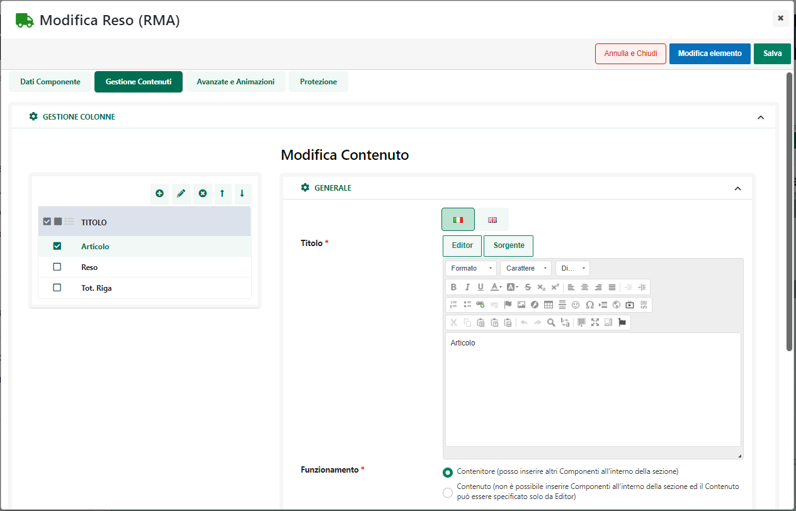
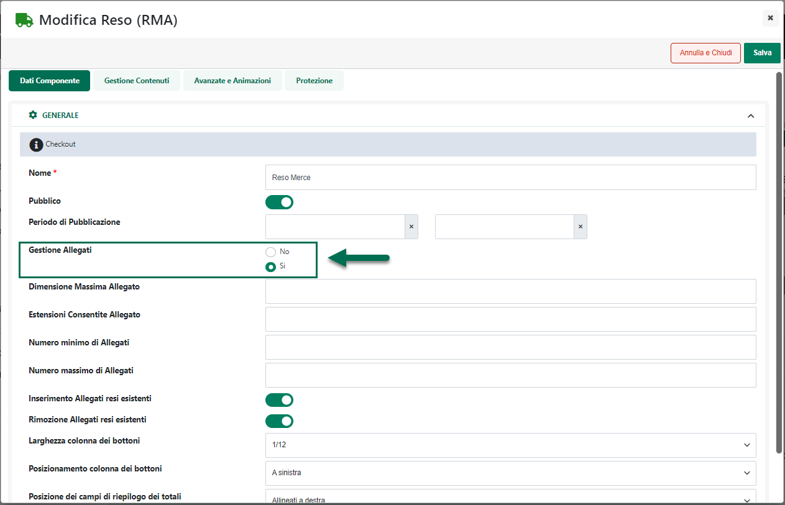

# SPEDIZIONI CON PASSDELIVERY

Passweb offre la possibilità di integrare il proprio sito Ecommerce con
Passdelivery l'applicazione Passepartout utilizzabile per gestire le
consegne a domicilio.

Di seguito vengono indicati i prerequisiti e la procedura da seguire per
implementare al meglio questo tipo di integrazione dando all'esercente,
da una parte, la possibilità di acquisire ordini dal sito Ecommerce
gestendo poi le relative consegne con la propria struttura di rider
attraverso l'applicazione Passdelivery, e al cliente, dall'altra parte,
la possibilità di selezionare in fase di acquisto la consegna a
domicilio e di visualizzare in ogni momento, direttamente all'interno
del sito Ecommerce piuttosto che all'interno del portale di
Passdelivery, lo stato della consegna relativo all'ordine da lui
effettuato.

##### ECOMMERCE MEXAL

Nel caso in cui il sito Ecommerce sia collegato a Mexal per poter
attivare l'integrazione con il portale di Passdelivery occorre,
innanzitutto:

- **Disporre di un proprio account sul portale di Passdelivery**

- **Aver scaricato e attivato l'App "Invio Ordini a Passdelivery"**

Una volta soddisfatti questi semplici prerequisiti sarà poi necessario:

1.  Impostare correttamente i dati di spedizione di ogni articolo
    gestito all'intero del sito, utilizzando, in questo senso, i campi
    della relativa tabella messa a disposizione dall' App "Invio Ordini
    a Passdelivery"

> Per maggiori informazioni relativamente a come poter accedere a questa
> tabella e impostare Altezza, Larghezza, Profondità e Peso dei vari
> articoli, si veda anche quanto indicato all'interno del capitolo
> "*Catalogo -- Gestione Articoli -- Articoli -- Anagrafica Articolo
> Servizio -- Anagrafica Passweb -- Spedizioni*" di questo manuale
>
> **ATTENZIONE!** l'impostazione delle dimensioni dei singoli articoli
> gestiti all'interno del sito non è un passaggio obbligatorio ai fini
> dell'integrazione tra il proprio sito Ecommerce e PassDelivery
>
> Questo passaggio diventa però di fondamentale importanza nel momento
> in cui si desideri rendere disponibile sul sito questa specifica
> modalità di spedizione solamente nel caso in cui le dimensioni degli
> articoli in ordine soddisfino determinati requisiti di altezza,
> larghezza, lunghezza, volume o peso.
>
> Nel momento in cui tali dimensioni non dovessero essere impostate la
> spedizione mediante PassDelivery potrebbe comunque essere condizionata
> ad altri elementi come ad esempio l'indirizzo di spedizione, il
> raggiungimento di un certo totale merce, l'utente che effettua
> l'ordine ecc... ma non più alle dimensioni degli articoli che i rider
> potrebbero effettivamente consegnare.

2.  Definire all'interno del gestionale uno o più vettori specifici da
    utilizzare per le spedizioni mediante PassDelivery.

> Portarsi quindi all'interno del menu "**Servizi -- App (X) -- Invio
> documenti a PassDelivery -- Parametri**"

> in maniera tale da visualizzare l'elenco dei vettori attualmente
> gestibili con PassDelivery
>
> Cliccare quindi sul pulsante "**Nuovo (F4)**" e compilare la maschera
> di configurazione del Vettore PassDelivery

> indicando, in particolare, il codice del vettore da utilizzare
> all'interno del campo "**Vettore per Delivery**" evidenziato in figura
> (per maggiori informazioni relativamente agli ulteriori parametri di
> configurazione presenti all'interno di questa maschera, si rimanda
> alla documentazione della specifica App)
>
> **ATTENZIONE!** La definizione di appositi Vettori PassDelivery **non
> è un passaggio obbligatorio**.
>
> In questo senso anzi, occorre considerare che nel momento in cui si
> dovessero definire appositi Vettori PassDelivery in fase di invio
> ordini al portale verranno poi mostrati, all'interno dell' apposita
> sezione (**Monitor Documenti**) dell'App, solo ed esclusivamente quei
> documenti ai quali è stato associato effettivamente uno dei "Vettori
> PassDelivery" appena definiti

3.  Impostare nel back end del sito uno specifico metodo di Trasporto ad
    uso PassDelivery

> Portarsi quindi, sul Wizard del sito, all'interno della sezione
> "**Ordini -- Metodi di Trasporto -- Trasporti**" e codificare un nuovo
> metodo di spedizione (di tipo Passweb) facendo attenzione ad impostare
> i "Parametri del Trasporto" come evidenziato in figura

- **Trasporto a mezzo** = Vettore

- **Vettore =** PassDelivery

- **Codice Gestionale del Vettore =** indicare il codice del Vettore che
  dovrà essere inserito nel piede del relativo documento gestionale e
  che dovrà, di fatto, gestire poi la consegna

> **ATTENZIONE!** Nel caso in cui all'interno dell'App Mexal siano stati
> definiti appositi Vettori PassDelivery, sarà necessario accertarsi del
> fatto che il valore inserito all'interno del campo "Codice Gestionale
> del Vettore" coincida esattamente con il codice di uno di questi
> stessi Vettori
>
> In caso contrario il documento proveniente dal sito, una volta bollato
> o fatturato, non comparirà, ovviamente, tra quelli presenti
> all'interno del "Monitor Documenti"
>
> Volendo potrebbe essere possibile codificare per PassDelivery anche un
> Trasporto di tipo "Mexal" utilizzando cioè uno dei Vettori abituali
> opportunamente esportati anche all'interno del sito.
>
> In queste condizioni si perderebbe però la possibilità di condizionare
> la visibilità del trasporto alle dimensioni degli articoli in ordine
> essendo i campi Lunghezza Massima, Altezza massima ecc... disponibili
> solo per trasporti di tipo Passweb.
>
> Per maggiori informazioni relativamente a come poter configurare un
> metodo di trasporto si veda quanto indicato nei precedenti capitoli di
> questo manuale

A questo punto nel momento in cui dovessero essere soddisfatte tutte le
condizioni di applicabilità per il metodo di trasporto appena definito
(eventuali dimensioni degli articoli, indirizzo di spedizione, limiti
del totale merce ecc...), in fase di checkout l'utente avrà la
possibilità di selezionare, tra i vari trasporti proposti, anche la
consegna mediante PassDelivery

Selezionata questa opzione e confermato l'odine, questo verrà inserito
normalmente all'interno del gestionale dove gli verrà assegnato il
Vettore indicato in fase di configurazione del metodo di trasporto
(punto 3)

Volendo in questa fase è possibile anche visualizzare ed eventualmente
modificare le dimensioni degli articoli presenti nel documento. Per fare
questo è sufficiente selezionare uno degli articoli presenti in ordine,
portarsi all'interno del campo contenente la descrizione del prodotto,
cliccare sul pulsante "**Dati aggiuntive righe**"

e selezionare quindi all'interno della successiva maschera l'opzione
"**Delivery -- Dati spedizione Art**"

In questo modo si ha infatti accesso alla maschera "**Delivery -- Dati
Spedizione Art**"

all'interno della quale poter visualizzare ed eventualmente modificare
le dimensioni del prodotto.

**ATTENZIONE!** Eventuali modifiche apportate in questa fase alle
dimensioni dei prodotti resteranno localizzate sullo specifico documento
e non avranno effetto sui valori impostati nell'anagrafica dell'articolo
stesso

Una volta revisionato l'ordine, per gestire la spedizione sarà
necessario, per prima cosa, trasformare il documento in Bolla o Fattura
e accedere poi al menu "**Magazzino -- App(X) -- Invio Documenti a
PassDelivery -- Monitor documenti**"

dove troveremo l'elenco di tutti i documenti gestibili tramite
PassDelivery

**ATTENZIONE!** nel momento in cui dovessero essere stati definiti
appositi "Vettori PassDelivery" all'interno di questa sezione verranno
visualizzati solo ed esclusivamente i documenti (bolle, fatture ...) con
associato uno di questi Vettori

A questo punto è sufficiente selezionare il / i documenti da inviare e
cliccare sul pulsante "**Invia**"

In questo modo i documenti selezionati verranno inviati a PassDelivery
dove potranno essere assegnati al rider che si occuperà di effettuare la
consegna. (per maggiori informazioni relativamente a come poter gestire
le consegne su PassDelivery si rimanda alla relativa documentazione di
prodotto)

Il pulsante "**Sincronizza**" presente nella parte bassa del "Monitor
Documenti" consente invece di aggiornare lo stato dei documenti
selezionati in elenco in maniera tale da poter visualizzare direttamente
da questa sezione del gestionale lo stato delle diverse consegne

Lato cliente, quando la Bolla / Fattura inviata a PassDelivery verrà
riportata, durante la prima sincronizzazione utile, anche sul sito
Ecommerce, Passweb andrà a recuperare direttamente dal portale di
Passdelivery il tracking number assegnato al documento per cui quando il
cliente, accedendo alla sezione dei suoi ordini, dovesse scegliere di
visualizzare il dettaglio della bolla / fattura in esame troverà questo
codice di tracciamento e un pulsante "**Segui la Spedizione**"

che gli permetterà di verificare direttamente da qui lo stato della sua
consegna. Cliccando infatti su questo pulsante verrà ridiretto su di una
specifica pagina del sito dove gli verranno mostrati i dati principali
(prelevati in tempo reale direttamente da PassDelivery) della relativa
consegna.

Il cliente avrà comunque la possibilità di visualizzare queste ed altre
informazioni (oltre ovviamente allo storico di tutte le consegne) anche
accedendo direttamente al portale PassDelivery.

Nel momento in cui dal gestionale verranno inviati dei documenti a
PassDelivery, i relativi clienti riceveranno infatti anche una mail con
tutte le istruzioni necessarie per l'attivazione del loro account sul
relativo portale

##### ECOMMERCE HO.RE.CA.

Nel caso in cui il sito Ecommerce sia collegato ad uno dei gestionali
Ho.Re.Ca. per utilizzare 'integrazione con il portale di Passdelivery
sarà necessario, innanzitutto, attivare un proprio account sul portale
di Passdelivery.

Una volta attivato questo account sarà poi necessario:

1.  Impostare correttamente i dati di spedizione di ogni articolo,
    utilizzando in questo senso, i campi presenti all'interno della
    sezione "**Spedizione**" dell'anagrafica Passweb di ogni singolo
    prodotto

> Per maggiori informazioni relativamente a questi campi e a come,
> eventualmente valorizzarli in maniera massiva mediate upload di file
> csv, si veda anche quanto indicato all'interno del capitolo "*Catalogo
> -- Gestione Articoli -- Articoli -- Anagrafica Articolo Servizio --
> Anagrafica Passweb -- Spedizioni*" di questo manuale.
>
> **ATTENZIONE!** l'impostazione delle dimensioni dei singoli articoli
> gestiti all'interno del sito non è un passaggio obbligatorio ai fini
> dell'integrazione tra il proprio sito Ecommerce e PassDelivery
>
> Questo passaggio diventa però di fondamentale importanza nel momento
> in cui si desideri rendere disponibile sul sito questa specifica
> modalità di spedizione solamente nel caso in cui le dimensioni degli
> articoli in ordine soddisfino determinati requisiti di altezza,
> larghezza, lunghezza, volume o peso.
>
> Nel momento in cui tali dimensioni non dovessero essere impostate la
> spedizione mediante PassDelivery potrebbe comunque essere condizionata
> ad altri elementi come ad esempio l'indirizzo di spedizione, il
> raggiungimento di un certo totale merce, l'utente che effettua
> l'ordine ecc... ma non più alle dimensioni degli articoli che i rider
> potrebbero effettivamente consegnare.

2.  Impostare nel back end del sito uno specifico metodo di Trasporto ad
    uso PassDelivery

> Portarsi quindi, sul Wizard del sito, all'interno della sezione
> "**Ordini -- Metodi di Trasporto -- Trasporti**" e codificare un nuovo
> metodo di spedizione (di tipo Passweb) facendo attenzione ad impostare
> i "Parametri del Trasporto" come evidenziato in figura

- **Trasporto a mezzo** = Vettore

<!-- -->

- **Vettore =** PassDelivery

- **Nome del Vettore =** indicare il nome del Vettore che dovrà essere
  inserito nel piede del relativo documento gestionale e che dovrà, di
  fatto, gestire poi la consegna

> Per maggiori informazioni relativamente a come poter configurare un
> metodo di trasporto si veda quanto indicato nei precedenti capitoli di
> questo manuale

A questo punto nel momento in cui dovessero essere soddisfatte tutte le
condizioni di applicabilità per il metodo di trasporto appena definito
(eventuali dimensioni degli articoli, indirizzo di spedizione, limiti
del totale merce ecc...), in fase di checkout l'utente avrà la
possibilità di selezionare, tra i vari trasporti proposti, anche la
consegna mediante PassDelivery

Selezionata questa opzione e confermato l'odine, questo verrà inserito
normalmente all'interno del gestionale dove gli verrà assegnato il
Vettore indicato in fase di configurazione del metodo di trasporto
(punto 2)

Una volta revisionato l'ordine, per gestire la spedizione sarà
necessario, per prima cosa, trasformare il documento in Bolla o Fattura,
aprire poi il menu contestuale e cliccare sulla voce "**PassDelivery**"

In questo modo il documento in esame verrà inviato a PassDelivery dove
potrà essere assegnato al rider che si occuperà di effettuare la
consegna. (per maggiori informazioni relativamente a come poter gestire
le consegne su PassDelivery si rimanda alla relativa documentazione di
prodotto)

Lato cliente, quando la Bolla / Fattura inviata a PassDelivery verrà
riportata anche sul sito Ecommerce, il cliente, accedendo alla sezione
dei suoi ordini e visualizzando il dettaglio del documento in esame
troverà il codice di tracciamento e un pulsante "**Segui la
Spedizione**"

che gli permetterà di verificare direttamente da qui lo stato della sua
consegna. Cliccando infatti su questo pulsante verrà ridiretto su di una
specifica pagina del sito dove gli verranno mostrati i dati principali
(prelevati in tempo reale direttamente da PassDelivery) della relativa
consegna.

Il cliente avrà comunque la possibilità di visualizzare queste ed altre
informazioni (oltre ovviamente allo storico di tutte le consegne) anche
accedendo direttamente al portale PassDelivery.

Nel momento in cui dal gestionale verranno inviati dei documenti a
PassDelivery, i relativi clienti riceveranno infatti anche una mail con
tutte le istruzioni necessarie per l'attivazione del loro account sul
relativo portale

