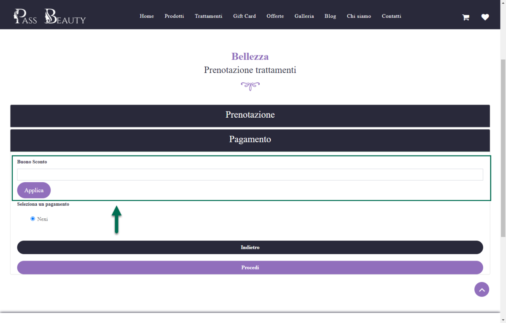

# TRASPORTI DI TIPO MEXAL

I trasporti di tipo "Mexal" corrispondono, come precedentemente
evidenziato, a vettori abituali del gestionale **e sono quindi importati
alla sincronizzazione direttamente dalla tabella Mexal dei Vettori
abituali**

Per poter visualizzare un vettore abituale all'interno della maschera
"Lista dei Metodi di Trasporto" sarà quindi necessario:

1.  Assicurarsi di aver utilizzato all'interno del gestionale il vettore
    in questione, per almeno un cliente, come suo Vettore abituale

2.  Aver effettuato a partire dal rilascio della versione 2012B di
    Passweb (versione di implementazione della Gestione degli Attributi
    Ordine) almeno una sincronizzazione sito-gestionale.

**NOTA BENE**: per visualizzare all'interno della maschera "Lista Metodi
di Trasporto", uno specifico vettore definito all'interno del
gestionale, non è sufficiente codificare in Mexal la sua anagrafica.
Tale vettore dovrà poi necessariamente essere utilizzato, per almeno un
cliente, come suo vettore abituale.

**ATTENZIONE!** Diversamente da quanto indicato per i trasporti di tipo
Passweb, l'attivazione e/o la disattivazione dei trasporti di tipo Mexal
dipende da quanto impostato per il parametro "**Gestione del Trasporto
Abituale"** all'interno della maschera *"Configurazione Ordini"* di
Passweb.

A seconda dunque delle impostazioni settate per il parametro evidenziato
in figura l'utente potrà avere la possibilità di selezionare, in fase di
conferma ordine, oltre ai trasporti Passweb appositamente abilitati,
anche il proprio vettore abituale, vettore questo che potrebbe essere
proposto come scelta di default ("**Gestione del Trasporto Abituale =
Abilitato**") oppure come unica scelta possibile per l'utente
("**Gestione del Trasporto Abituale = Abilitato Esclusivo**").

Nel momento in cui il parametro evidenziato in figura dovesse invece
essere impostato sul valore "**Non Abilitato**", l'utente in fase di
conferma ordine, potrà selezionare solo ed esclusivamente i trasporti
Passweb opportunamente abilitati.

Per maggiori informazioni in merito a queste possibilità si veda anche
quanto indicato all'interno del capitolo "*Ordini -- Ordini --
Configurazione Ordini -- Impostazioni generali*" di questo manuale

**ATTENZIONE!** non è possibile Abilitare/Disabilitare direttamente
dalla maschera "Lista dei Metodi di Trasporto" i trasporti di tipo
Mexal.

Allo stesso modo, per quella che è la loro stessa natura, non sarà
ovviamente possibile aggiungere o eliminare trasporti di tipo Mexal
direttamente dalla maschera "Lista dei Metodi di Trasporto".

Selezionando, tra presenti in elenco, un trasporto di tipo Mexal e
cliccando poi sul pulsante "**Modifica Trasporto**" ( ) presente nella
barra degli strumenti, verrà visualizzata la maschera "**Configurazione
del Metodo di Trasporto**"

attraverso la quale poter impostare un valore per i seguenti parametri

- **Ordinamento:** consente di assegnare alla modalità di spedizione in
  esame uno specifico numero che verrà poi utilizzato per ordinare
  l'elenco delle spedizioni disponibili, elenco questo visualizzato, sul
  front end del sito, in fase di checkout piuttosto che all'interno del
  relativo modulo per il preventivo sulle spese di spedizione presente
  in carrello.

> **ATTEZNIONE!** Le spedizioni attive per le quali non è stato
> specificato un numero d'ordine verranno visualizzate per prime
>
> Inoltre:

- a parità di ordinamento le spedizioni attive presenti in elenco
  verranno ordinate per descrizione

- nel caso in cui sia gestito il "vettore abituale", questo verrà
  visualizzato sempre e comunque come primo elemento in elenco
  (indipendentemente dal fatto di avergli assegnato o meno uno specifico
  numero d'ordine)

<!-- -->

- **Descrizione:** etichetta identificativa della modalità di spedizione
  utilizzata

- **Dettaglio:** consente di inserire ulteriori informazioni
  relativamente al metodo di trasporto selezionato.

- **Visualizza dettaglio:** consente di decidere se, e dove visualizzare
  le informazioni aggiuntive sulla spesa di trasporto in oggetto. E'
  possibile selezionare uno dei seguenti valori:

  - **Non visualizzare:** in queste condizioni non verrà, ovviamente,
    visualizzata nessuna informazione aggiuntiva sulla spesa di
    trasporto, indipendentemente da quanto inserito all'interno del
    campo "Dettaglio"

  - **In fase di Checkout:** in queste condizioni una volta inserite,
    all'interno del campo "Dettaglio", le informazioni aggiuntive sulla
    spesa di trasporto, verrà visualizzato sul sito, in fase di checkout
    e accanto alla descrizione della spesa in esame, un pulsante
    "**Dettagli**" mediante il quale l'utente potrà visualizzare le
    informazioni aggiuntive precedentemente inserite.

  - **Nel Dettaglio dell'Ordine:** in queste condizioni le informazioni
    aggiuntive sulla spesa di trasporto verranno visualizzate nel
    dettaglio dell'Ordine che l'utente si appresta a confermare. Inoltre
    queste stesse informazioni verranno inserite anche in tutte le mail
    inviate dall'applicativo all'interno delle quali compare il
    dettaglio dell'ordine effettuato dal cliente.

  - **In fase di Checkout e nel Dettaglio dell'Ordine:** in queste
    condizioni le informazioni aggiuntive sulla spesa di trasporto
    verranno visualizzate in fase di checkout (mediante l'apposito
    pulsante "Dettagli"), nel riepilogo dell'ordine che l'utente si
    appresta a confermare e anche in tutte le mail inviate
    dall'applicativo e che contengono il dettaglio dell'ordine
    effettuato dal cliente.

**ATTENZIONE!** anche per i Trasporti di tipo Mexal, trattandosi sempre
e comunque di trasporti di tipo Vettore, sarà possibile gestire un
Number Tracking (per maggiori informazioni in merito si veda quanto
indicato all'interno del successivo capitolo "*Parametri del
Trasporto*")

Infine per quel che riguarda il valore delle spese di traporto che verrà
applicato nel momento in cui il cliente dovesse effettivamente
selezionare in fase di ordine, tra tutti i metodi di spedizione
disponibili, quello relativo al suo Vettore abituale il concetto di base
è che tale valore non potrà essere definito all'interno di Passweb ma
verrà ereditato direttamente dalle impostazioni settate all'interno del
gestionale.

Per maggiori informazioni si veda anche quanto indicato nel successivo
capitolo di questo manuale

