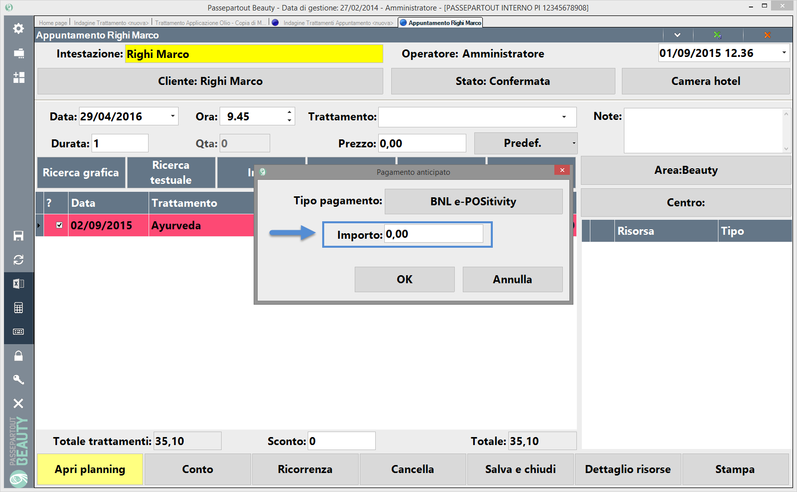
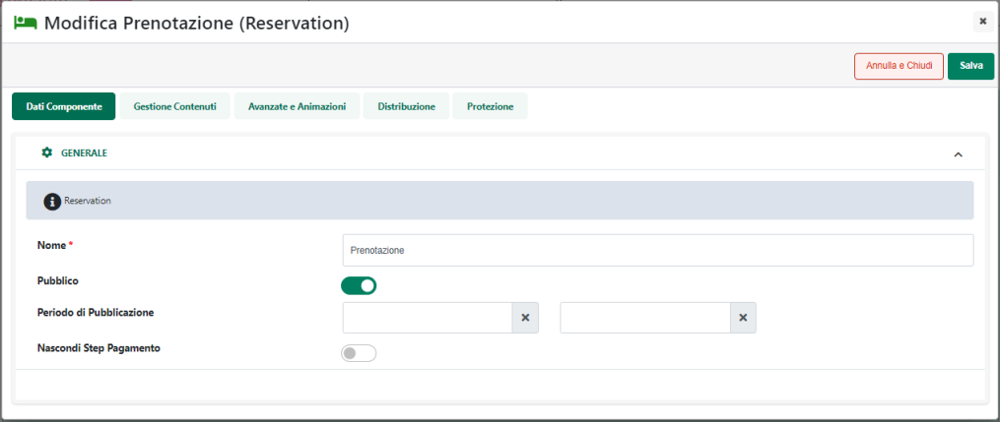
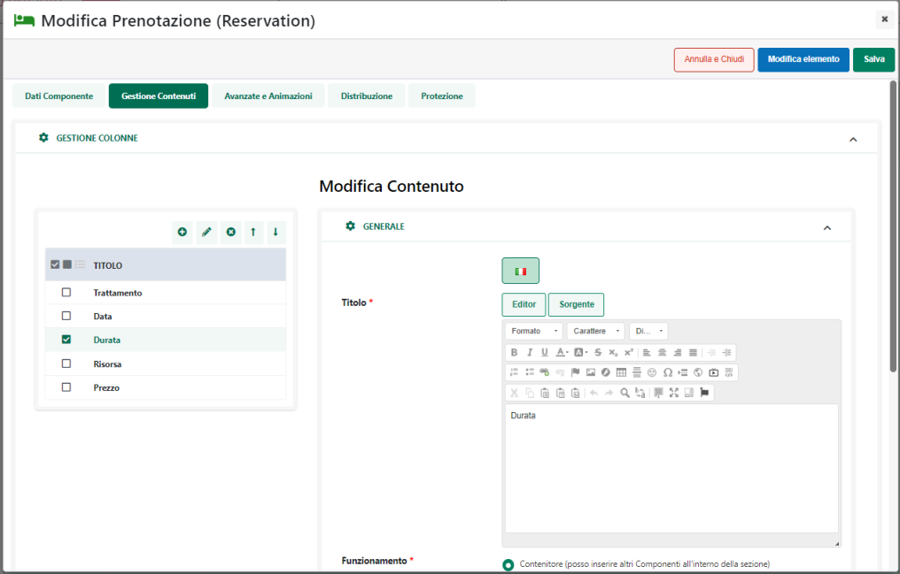

# MEXAL / HO.RE.CA -- SPESE DI TRASPORTO A SCAGLIONI

La "Funzionalità" **"Spese di trasporto a Scaglioni" (attivabile solo ed
esclusivamente per trasporti di tipo Passweb)** consente di attivare una
particolare modalità di definizione e di calcolo degli scaglioni nel
caso in cui si stiano gestendo delle spese di trasporto di tipo
Tabellare e, soprattutto, si sia scelto di utilizzare come unità di
definizione di questi stessi scaglioni un'unità di misura
personalizzata.

**Tale funzionalità non avrà dunque nessuna influenza nel caso di spese
di trasporto di tipo tabellare per le quali il campo "Scaglioni e
Calcolo Percentuale" sia stato impostato sui valori "Scaglioni in base
al prezzo ..." o "Scaglioni in base al numero di Articoli ..." né tanto
meno, nel caso di spese di trasporto fisse.**

Per poter attivare questa particolare modalità di calcolo delle spese di
trasporto sarà quindi necessario operare in un certo modo tanto
all'interno del gestionale (Mexal o Ho.Re.Ca.) quanto all' interno del
Wizard di Passweb.

Nello specifico:

**[MEXAL]{.underline}**

E' necessario attivare, per prima cosa, la Funzionalità Mexal **"Spese
di trasporto a scaglioni"**.

Una volta preparata dunque, all'interno del gestionale, la struttura
dati utilizzata per gestire le "Funzionalità Mexal", secondo quanto
descritto nel relativo capitolo di questo manuale ( "*Configurazione
Gestionale -- Mexal Parametri configurazione gestionale -- Mexal
Attivazione Passweb*"), sarà poi necessario richiamare la maschera
**"Configurazione gestione dati web articolo"** qui di seguito
riportata, e flaggare il campo **"Spese di trasporto a scaglioni".**

> **NOTA BENE:** la maschera "Configurazione gestione dati web articolo"
> può essere richiamata in un qualsiasi momento grazie al pulsante
> **"Dati Articolo"** **(F5)** attivo in Mexal in corrispondenza della
> voce di menu "Anagrafica Azienda -- Dati Aziendali -- Configurazione
> Moduli -- Passweb"

Portandosi poi nell'anagrafica dello specifico articolo, cliccando sul
pulsante **"Dati Aggiuntivi/ eCommerce" (Shift + F8)** e selezionando,
tra quelle presenti in elenco, la videata aggiuntiva articoli relativa
allo specifico sito su cui si intende operare, sarà possibile trovare,
nella successiva maschera, il campo **Spese Trasp. A Scagli.**
corrispondente alla "Funzionalità Mexal" precedentemente attivata.

Questo campo dovrà contenere il valore numerico che verrà utilizzato
come Misuratore per il calcolo delle spese di trasporto quando
l\'articolo in esame verrà inserito in un ordine. **Questo Misuratore
dovrà quindi essere, ad esempio, un valore identificativo dello spazio
occupato dall\'articolo in esame all\'interno del mezzo di trasporto**.
(Es: una penna che occuperà, indubbiamente, un volume limitato potrà
avere come Misuratore un valore 1; il monitor di un computer che
occuperà invece un volume sicuramente maggiore potrà avere come
Misuratore un valore 10);

A questo punto quindi occorrerà selezionare gli articoli gestiti sul
sito e, per ciascuno di essi, inserire all\'interno di questo campo uno
specifico valore identificativo, ad esempio, del volume che quello
stesso articolo potrebbe occupare all'interno del mezzo di trasporto.

> **NOTA BENE:** dopo aver attivato la "Funzionalità Mexal" in esame ed
> aver correttamente valorizzato il relativo campo della videata
> aggiuntiva di ogni articolo gestito all'interno del sito, sarà
> necessario lanciare una sincronizzazione in modo tale da riportare le
> variazioni effettuate in Mexal anche all'interno di Passweb.

**[HORECA]{.underline}**

E' necessario inserire all'interno campo "**Misuratore Trasporto a
Scaglioni**" dell' Anagrafica Passweb di ogni singolo articolo il valore
numerico che verrà utilizzato come Misuratore per il calcolo delle spese
di trasporto quando l\'articolo in esame verrà inserito in un ordine.

**Questo Misuratore dovrà quindi essere, ad esempio, un valore
identificativo dello spazio occupato dall\'articolo in esame
all\'interno del mezzo di trasporto.** (Es: una penna che occuperà,
indubbiamente, un volume limitato potrà avere come Misuratore un valore
1; il monitor di un computer che occuperà invece un volume sicuramente
maggiore potrà avere come Misuratore un valore 10);

**[PASSWEB]{.underline}**

Una volta impostati i valori del misuratore sui singoli articoli, lato
Passweb sarà poi necessario:

- Codificare una tipologia di spesa di trasporto impostando il campo
  "**Scaglioni e Calcolo Percentuale"**, presente all'interno della
  maschera "**Configurazione del Metodo di Trasporto**" su uno dei
  valori "**Scaglioni in base al campo Personalizzato ..."**

- Impostare i parametri di configurazione "**Tipo di Campo**" e
  "**Campo**" rispettivamente sui valori "**Campo Articolo**" e
  "**Misuratore**"

- Definire per la tipologia di spesa di trasporto in esame almeno una
  zona di spedizione per la quale il parametro **"Tipo di Spesa"**
  presente all'interno della maschera **"Configurazione Zona"** sia
  impostato sul valore **"Tabellare"**

- Definire i vari scaglioni indicando per ciascuno di essi il valore
  limite ed il corrispondente importo delle spese di trasporto (si veda
  anche quanto detto in proposito nei precedenti capitoli di questo
  manuale)

- Attivare la tipologia di spesa di trasporto appena definita secondo
  quanto descritto nel capitolo *"Configurazione Metodi di Trasporto"*
  di questo manuale.

In queste condizioni dunque nel caso in cui il cliente selezioni
all'interno del sito web la tipologia di spesa di trasporto appena
definita e l'indirizzo di spedizione merce rientri in una zona per la
quale sono state definite delle spese di tipo tabellare, l'importo da
applicare all'ordine, in relazione alle spese di spedizione, verrà
determinato moltiplicando, per ogni articolo, la quantità dello stesso
inserita nel ordine per il suo Misuratore (es. per il valore inserito in
Mexal all'interno del campo "Spese Trasp. A Scagli." precedentemente
esaminato).

I totali di queste moltiplicazioni verranno poi sommati tra loro ed il
risultato definitivo determinerà lo scaglione di riferimento ed il
conseguente importo da applicare all\' ordine.

**ATTENZIONE!** Nel caso di articoli Campionario il valore complessivo
del misuratore potrà variare a seconda del fatto di aver impostato il
parametro "**Gestione Articoli Box**" (pagina "**Configurazione
Catalogo**" del Wizard, sezione "**Gestione Carrello**") sull'opzione
"**Considera il Box**" o "**Considera i componenti del box**").

Nel primo caso ("**Considera il box**") il valore complessivo sarà dato
dalla somma dei misuratori assegnati ai singoli componenti più il valore
del misuratore eventualmente assegnato direttamente all'articolo
Campionario.

Nel secondo caso invece ("**Considera i componenti del box**") il valore
complessivo sarà dato solamente dalla somma dei misuratori assegnati ai
singoli componenti (in queste condizioni non verrà quindi considerato il
misuratore eventualmente assegnato all'articolo Campionario)

\-\-\-\-\-\-\-\-\-\-\-\-\-\-\-\-\-\-\-\-\-\-\-\-\-\-\-\-\-\-\-\-\-\-\-\-\-\-\-\-\-\-\-\-\-\-\-\-\-\-\-\-\-\-\-\-\-\-\-\-\-\-\-\-\-\-\-\-\-\-\-\-\-\-\-\-\-\-\-\-\-\-\-\-\-\-\-\-\-\-\-\-\-\-\-\-\-\-\-\-\-\-\-\-\-\-\-\-\-\-\-\-\-\-\-\-\-\-\-\-\-\-\-\-\-\-\-\-\-\-\-\-\-\-\-\-\-\-\-\-\-\-\-\-\-\-\-\-\-\-\-\-\-\-\-\-\-\-\-\-\-\-\-\-\-\-\-\-\--

**ESEMPIO**

Supponiamo di aver attivato in Mexal la Funzionalità "Spese di Trasporto
a Scaglioni" e di aver impostato per i due articoli LETTDVD1 e LETTDVD2
il campo **Spese Trasp. A Scagli** sui valori:

**LETTDVD1** 🡪 Spese Trasp. A Scagli = 11;

**LETTDVD2** 🡪 Spese Trasp. A Scagli = 12;

Supponiamo inoltre di aver attivato in Passweb una tipologia di spese di
trasporto con il campo **Scaglioni e Calcolo Percentuale** impostato sul
valore "**Scaglioni in Base al campo personalizzato e Calcolo
Percentuale sul Totale Merce**", una zona di spedizione con associata
l'area geografica "Italia -- Tutte le Regioni" e scaglioni del tipo

- **Fino a: 200 Valore: 20**

- **Fino a 500 Valore: 10**

- **Oltre Valore: 5**

In queste condizioni dunque nel caso in cui venga fatto un ordine con i
due articoli:

**LETTDVD1** in quantità 2;

**LETTDVD2** in quantità 10;

venga selezionata la tipologia di spese di trasporto in oggetto e
l'indirizzo di spedizione merce appartenga alla regione Emilia-Romagna,
per ottenere l'importo delle spese di spedizione verrà effettuato il
seguente calcolo:

(11x2)+(12x10) = 142

Il risultato ottenuto rientra nel primo scaglione (fino a 200) e quindi
il valore delle spese di trasporto che verrà applicato all'ordine sarà
di 20 euro (ipotizzando anche di aver utilizzato come valuta di
riferimento per questa tipologia di spese di trasporto l'euro)

\-\-\-\-\-\-\-\-\-\-\-\-\-\-\-\-\-\-\-\-\-\-\-\-\-\-\-\-\-\-\-\-\-\-\-\-\-\-\-\-\-\-\-\-\-\-\-\-\-\-\-\-\-\-\-\-\-\-\-\-\-\-\-\-\-\-\-\-\-\-\-\-\-\-\-\-\-\-\-\-\-\-\-\-\-\-\-\-\-\-\-\-\-\-\-\-\-\-\-\-\-\-\-\-\-\-\-\-\-\-\-\-\-\-\-\-\-\-\-\-\-\-\-\-\-\-\-\-\-\-\-\-\-\-\-\-\-\-\-\-\-\-\-\-\-\-\-\-\-\-\-\-\-\-\-\-\-\-\-\-\-\-\-\-\-\-\-\-\--

Volendo, infine, tanto per siti collegati a Mexal quanto per i siti
collegati ad uno dei gestionali Ho.Re.Ca. è anche possibile calcolare
gli scaglioni delle spese di trasporto di tipo Tabellare utilizzando
come unità di definizione di questi stessi scaglioni:

- il **Peso** degli articoli indicato nel relativo campo dell'Anagrafica
  Passweb all'interno della sezione "**Spedizione**"

> In queste condizioni sarà poi necessario:

- Verificare di aver correttamente valorizzato per ogni articolo gestito
  all'interno del sito il campo "Peso".

- Per maggiori informazioni in merito a come poter gestire il campo
  "Peso" evidenziato in figura, si veda anche quanto indicato
  all'interno del capitolo "*Catalogo -- Gestione Articoli -- Articoli
  -- Anagrafica Articolo / Servizio -- Anagrafica Passweb - Spedizione*"
  di questo manuale

- Selezionare, nel Wizard di Passweb, il metodo di trasporto in esame e
  impostare i due parametri di configurazione "**Tipo di Campo**" e
  "**Campo**" rispettivamente sui valori "**Campo Articolo**" e
  "**Peso**"

- il valore definito per ogni Articolo all'interno di un Attributo
  Passweb appositamente creato.

> In questo caso sarà necessario:

- Creare un Attributo articolo di tipo **Numerico** o **Testuale** da
  utilizzare come Misuratore per il calcolo delle spese di trasporto

- Associare il nuovo Attributo ai Set di Attributi gestiti

- Valorizzare per ogni singolo articolo gestito all'interno del sito il
  nuovo Attributo con uno specifico valore identificativo, ad esempio,
  del volume che quello stesso articolo potrebbe occupare all'interno
  del mezzo di trasporto

- Selezionare, nel Wizard di Passweb, il metodo di trasporto in esame,
  impostare il parametro di configurazione "**Tipo di Campo**" sul
  valore "**Attributo Articolo**" e indicare poi all'interno del
  successivo campo "**Attributo**" l'attributo Articolo precedentemente
  creato

