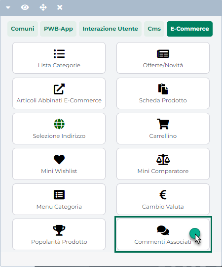

# SPESE ACCESSORIE

La sezione **"Spese Accessorie"** consente di definire e gestire una o
più spese accessorie (es. spese di assicurazione, spese per imballaggi
ecc...) che potranno poi essere associate ai vari ordini effettuati
all'interno del sito.

Per ciascuna delle spese presenti all'interno di questa sezione del
Wizard sarà possibile definire i singoli costi che andranno a comporre
il valore della spesa, il tipo di gestione dei costi, eventuali linee
articolo, metodi di trasporto e/o gruppi di utenti in corrispondenza dei
quali abilitare/disabilitare la corrispondente spesa accessoria ecc...

Portandosi dunque all'interno di questa sezione verrà visualizzata la
maschera "**Lista delle Spese Accessorie**"

{width="5.811805555555556in"
height="3.532638888888889in"}

contenente l'elenco delle spese attualmente codificate e gestite
all'interno del sito.

Il campo di ricerca attivabile cliccando sulla lente di ingrandimento,
presente in testata di ogni singola colonna, consente di filtrare i dati
in griglia sulla base dei valori presenti all'interno della colonna
stessa.

Una volta impostato un filtro di ricerca, per poterlo poi eliminare sarà
sufficiente cliccare sull'icona raffigurante una piccola lente di
ingrandimento con un -- all'interno (
{width="7.777777777777778e-2in"
height="9.722222222222222e-2in"} ) che comparirà in testata alla colonna
in corrispondenza della quale è stato impostato il filtro stesso.

Infine è anche possibile ordinare, in maniera crescente e/o decrescente,
gli elementi in griglia cliccando semplicemente sull'icona raffigurante
due piccole frecce posta anch' essa in testata ad ogni singola colonna
della griglia (
{width="0.12361111111111112in"
height="0.14930555555555555in"} )

I pulsanti presenti nella barra degli strumenti consentono
rispettivamente di:

**Attiva** (
{width="0.46111111111111114in"
height="0.175in"} ) **\\ Disattiva**
({width="0.5715277777777777in"
height="0.18819444444444444in"} ) **Spesa**: consente di
attivare\\disattivare la spesa accessoria attualmente selezionata in
elenco. Ovviamente potranno essere effettivamente applicate ai vari
ordini effettuati all'interno del sito, solo ed esclusivamente le spese
accessorie opportunamente abilitate.

> **NOTA BENE:** le spese accessorie abilitate per essere utilizzate
> all'interno del sito verranno evidenziate in grassetto.

**Elimina Spesa**
({width="0.5131944444444444in"
height="0.18194444444444444in"} ): consente di eliminare la spesa
accessoria attualmente selezionata in elenco

**Modifica Spesa**
({width="0.5652777777777778in"
height="0.18819444444444444in"} ): consente di modificare le
impostazioni della spesa accessoria attualmente selezionata in elenco

**Copia Spesa**
({width="0.4673611111111111in"
height="0.18819444444444444in"} ): consente di duplicare la spesa
accessoria attualmente selezionata in elenco.

**Modifica Costi**
({width="0.5326388888888889in"
height="0.18194444444444444in"} ): consente di definire e/o modificare i
vari costi associati alla spesa accessoria attualmente selezionata in
elenco

> **NOTA BENE:** per maggiori informazioni relativamente alla gestione
> dei costi che andranno a definire il valore di ogni spesa accessoria
> si veda il successivo capitolo di questo manuale (Spese Accessorie --
> Gestione Costi).

**Aggiungi Spesa**
({width="0.5652777777777778in"
height="0.18819444444444444in"} ): consente di definire una nuova spesa
accessoria.

Cliccando su questo pulsante verrà quindi visualizzata la maschera
**"Configurazione della Spesa Accessoria"**

{width="5.779166666666667in"
height="3.5256944444444445in"}

all'interno della quale poter definire le caratteristiche della spesa
che si intende codificare.

In particolare sarà necessario impostare un valore per i seguenti campi:

**Stato della Spesa Accessoria:** consente di abilitare/disabilitare la
spesa accessoria rendendola quindi effettivamente utilizzabile o meno
all'interno del sito (allo stesso modo di quanto avviene con i pulsante
"**Attiva Spesa**" e "**Disattiva Spesa**" precedentemente esaminati).

**Descrizione:** consente di definire l'etichetta identificativa della
spesa accessoria che si sta codificando. Tale etichetta verrà poi
visualizzata in corrispondenza della spesa stessa all'intero del modulo
di checkout ordine

**Dettagli:** consente di inserire ulteriori informazioni relativamente
alla spesa accessoria che si sta codificando

Una volta inserite, all'interno di questo campo, le informazioni
aggiuntive, all'interno del sito in fase di checkout ordine, verrà
visualizzato accanto alla descrizione della spesa accessoria, un
pulsante "**Dettagli**" mediante il quale l'utente potrà visualizzare le
relative informazioni aggiuntive.

{width="5.207638888888889in"
height="3.5131944444444443in"}

**Selezionabile:** consente di decidere se la spesa accessoria che si
sta codificando dovrà o meno essere selezionabile da parte dell'utente
in fase di conferma ordine.

In particolare selezionando questo parametro, e nell'ipotesi di aver
ovviamente abilitato in maniera corretta la spesa in questione,
all'interno del modulo di conferma ordine verrà poi visualizzata, nello
step relativo alle spese di trasporto, anche l'etichetta identificativa
della spesa accessoria che si sta codificando. A fianco di questa
etichetta comparirà inoltre un check **che consentirà all'utente di
decidere liberamente se inserire o meno anche questa ulteriore spesa**
(es. spese per assicurazione) nel suo ordine.

Nel caso invece in cui questo parametro non venga selezionato, nel
modulo di conferma ordine comparirà, come nel caso precedente,
all'interno dello step relativo alle spese di spedizione, anche
l'etichetta identificativa di questa spesa accessoria. In questo caso
però il check visualizzato a fianco della spesa **sarà selezionato a
default e non potrà essere modificato dall'utente** (es. spese di
imballaggio). **In queste condizioni dunque la spesa accessoria verrà
sempre e comunque applicata al corrispondente ordine**.

**Tipo di gestione dei costi:** per ogni singola spesa accessoria sarà
necessario definire uno o più costi che verranno poi utilizzati per
determinare il valore complessivo della spesa sulla base, ad esempio,
degli articoli inseriti in ordine o della zona geografica di spedizione
della merce. Per ciascun costo potrà essere definito un Limite Minimo
e/o un Limite Massimo che verranno applicati nel momento in cui, a
seguito del verificarsi di determinate condizioni, il valore del costo
dovesse risultare rispettivamente inferiore o superiore a tali limiti.

Il parametro in oggetto consente quindi di **specificare il metodo di
calcolo che dovrà essere utilizzato per determinare il valore
complessivo della spesa accessoria nel caso in cui, ovviamente, per tale
spesa siano stati configurati dei costi multipli**.

E' possibile selezionare uno dei seguenti valori:

- **Sommatoria:** in questo caso il valore complessivo della spesa
  accessoria verrà determinato come somma dei valori dei singoli costi
  associati alla spesa stessa.

- **Minimo dei Limiti Massimi o Sommatoria:** selezionando questa
  opzione, nel caso in cui venga raggiunto o superato per tutti i costi
  della spesa accessoria il rispettivo limite massimo, il valore
  complessivo della spesa coinciderà esattamente con il più basso dei
  limiti massimi associati ai singoli costi.

> Al contrario nel caso in cui un solo costo non raggiunga il suo limite
> massimo il valore complessivo della spesa sarà determinato dalla somma
> dei singoli costi.

- **Massimo dei Limiti Massimi o Sommatoria:** selezionando questa
  opzione, nel caso in cui venga raggiunto o superato per tutti i costi
  della spesa accessoria il rispettivo limite massimo, il valore
  complessivo della spesa coinciderà esattamente con il più alto dei
  limiti massimi associati ai singoli costi.

> Al contrario nel caso in cui un solo costo non raggiunga il suo limite
> massimo il valore complessivo della spesa sarà determinato dalla somma
> dei singoli costi.

- **Minimo dei Limiti Minimi o Sommatoria:** selezionando questa
  opzione, nel caso in cui non venga superato per tutti i costi della
  spesa accessoria il rispettivo limite minimo, il valore complessivo
  della spesa coinciderà esattamente con il più basso dei limiti minimi
  associati ai singoli costi.

> Al contrario nel caso in cui anche un solo costo superi il suo limite
> minimo il valore complessivo della spesa sarà determinato dalla somma
> dei singoli costi.

- **Massimo dei Limiti Minimi o Sommatoria:** selezionando questa
  opzione, nel caso in cui non venga superato per tutti i costi della
  spesa accessoria il rispettivo limite minimo, il valore complessivo
  della spesa coinciderà esattamente con il più alto dei limiti minimi
  associati ai singoli costi.

> Al contrario nel caso in cui anche un solo costo superi il suo limite
> minimo il valore complessivo della spesa sarà determinato dalla somma
> dei singoli costi.

**Tipo Costo:** consente di indicare se l'importo specificato nelle zone
e nei limiti di costo dovrà essere considerato o meno comprensivo di
iva.

> **NOTA BENE:** per maggiori informazioni relativamente alla gestione
> dei costi che andranno a definire il valore di ogni spesa accessoria
> si veda il successivo capitolo di questo manuale (Spese Accessorie --
> Gestione Costi).

Sarà quindi possibile selezionare uno dei seguenti valori:

- **Non Ivato:** in questo caso l'importo specificato nelle zone e nei
  limiti di costo sarà considerato **iva esclusa**. In conseguenza di
  ciò se ad effettuare l'ordine sul sito dovesse essere un privato
  (generando quindi un OX) su tali importi verrà calcolata l'iva.
  L'importo della spesa accessoria, presente nel riepilogo dell'ordine
  alla voce "Spese" (quello indicato in figura)

{width="5.558333333333334in"
height="3.4347222222222222in"}

> sarà dunque quello definito in fase di configurazione della spesa
> stessa (e dei relativi costi) maggiorato dell'iva, calcolata secondo
> l'aliquota in uso all'interno del gestionale (iva cliente,
> particolarità iva, iva articolo, iva ripartita ...).
>
> Nel caso in cui ad effettuare l'ordine dovesse invece essere un utente
> di tipo azienda (generando quindi un OC) l'importo della spesa
> accessoria, presente nel riepilogo dell'ordine alla voce "Spese",
> coinciderà esattamente con quello definito in fase di configurazione
> della spesa stessa (e dei relativi costi). L'iva sulla spesa
> accessoria verrà comunque calcolata e andrà ad influire sul totale
> della relativa voce presente nel piede del documento.

{width="5.558333333333334in"
height="3.4347222222222222in"}

- **Ivato:** in questo caso l'importo specificato nelle zone e nei
  limiti di costo sarà considerato **iva compresa**. In conseguenza di
  ciò se ad effettuare l'ordine sul sito dovesse essere un privato
  (generando quindi un OX) l'importo della spesa accessoria, presente
  nel riepilogo dell'ordine alla voce "Spese", coinciderà esattamente
  con quello definito in fase di configurazione della spesa stessa (e
  dei relativi costi).

> Nel caso in cui ad effettuare l'ordine dovesse invece essere un utente
> di tipo azienda (generando quindi un OC) l'importo della spesa
> accessoria, presente nel riepilogo dell'ordine, sarà quello definito
> in fase di configurazione della spesa stessa (e dei relativi costi)
> scorporato dell'iva, secondo l'aliquota in uso all'interno del
> gestionale (iva cliente, particolarità iva, iva articolo, iva
> ripartita ...). L'iva così calcolata andrà quindi ad influire sul
> totale della relativa voce presente nel piede del documento.

**ATTENZIONE!!** per quel che riguarda gli importi indicati a fianco
delle singole spese accessorie presenti, in checkout, nello step
relativo alla selezione del metodo di trasporto

{width="5.558333333333334in"
height="3.4347222222222222in"}

questi potranno essere ivati o non ivati (con la relativa etichetta)
dipendentemente da come è stato impostato il parametro "**Prezzo**"
presente alla pagina "**Configurazione Catalogo**" del Wizard. Il
consiglio, in questo senso è, ovviamente, quello di gestire questo
valore coerentemente con la tipologia di documento generata e quindi con
il valore che verrà poi indicato anche nel riepilogo dell'ordine.

**Articolo:** codice dell'articolo di tipo Spesa che verrà utilizzato,
lato gestionale, per gestire la relativa Spesa Accessoria

**ATTENZIONE! Al fine di poter codificare all'interno del proprio sito
E-commerce delle spese accessorie è quindi necessario utilizzare un
articolo di tipo Spesa opportunamente codificato all'interno del
gestionale (Ecommerce Mexal) oppure marcato come tale all'interno del
Wizard di Passweb (Ecommerce Ho.Re.Ca.)**

Per maggiori informazioni relativamente alla gestione, sui siti
Ho.Re.Ca., degli articoli di tipo spesa si veda anche la sezione
*"Configurazione gestionale -- Ho.Re.Ca. Parametri Configurazione
Gestionale -- Funzionalità di gestione articoli -- Articoli di tipo
Spesa"* di questo manuale.

Una volta impostati questi parametri generali, sarà poi necessario
definire anche:

- le Linee Articolo in relazione alle quali dover eventualmente
  considerare la Spesa Accessoria che si sta codificando -- sezione
  **Linee Articolo**

- i Gruppi Utente in relazione ai quali dover eventualmente considerare
  la Spesa Accessoria che si sta codificando -- sezione **Gruppi
  Utente**

- i Metodi di Trasporto in relazione ai quali dover eventualmente
  considerare la Spesa Accessoria che si sta codificando -- sezione
  **Spedizioni**

