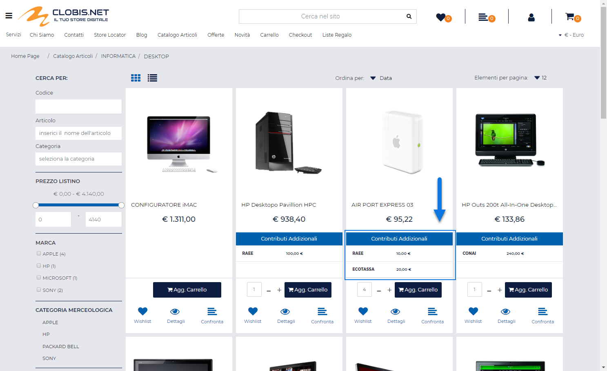
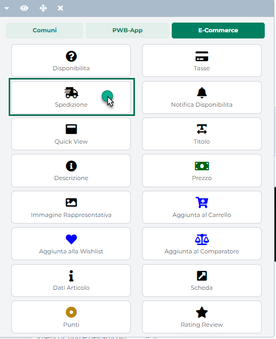
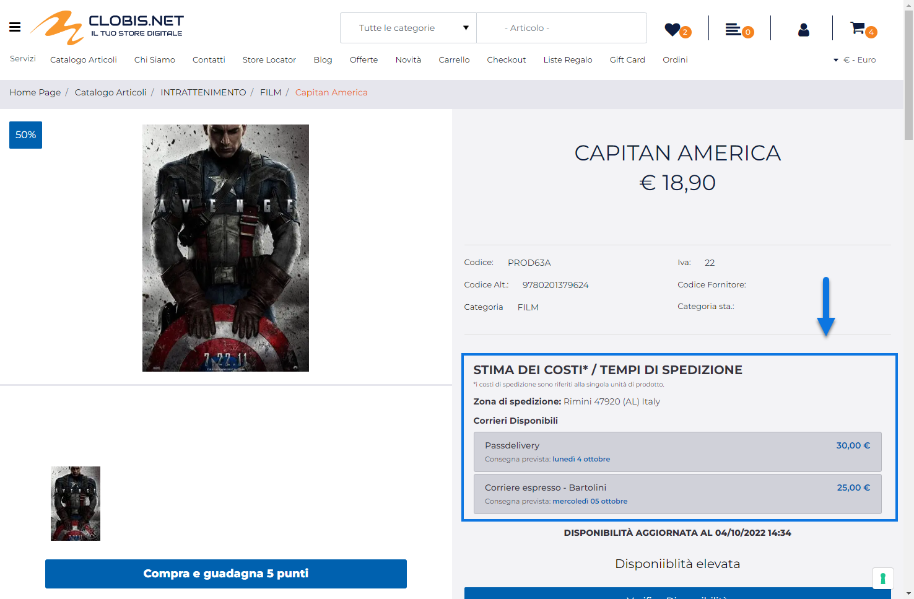

# TASSE IVA

Come già indicato nei precedenti capitoli di questo manuale le Tasse di
tipo IVA consentono di soddisfare le normative di legge in materia di
OSS (One Stop Shop) e/o Cessioni intra o extra comunitarie mettendo
l'amministratore del sito nelle condizioni di poter gestire, per gli
utenti Privati e per le Aziende iscritte o non iscritte al VIES,
un'aliquota iva e/o un' esenzione IVA diversa in relazione allo
specifico paese in cui dovrà poi essere spedita la merce

Per codificare una tassa di questo tipo sarà necessario cliccare sul
pulsante **Aggiungi Tassa**
( ) presente nella barra degli strumenti della maschera
"**Tasse**" precedentemente analizzata e, successivamente, impostare il
parametro "**Tipologia Tassa**" sull'opzione "**IVA**"

I restanti parametri presenti all'interno di questa maschera consentono
rispettivamente di:

- **Soggetto**: consente di impostare il soggetto, e quindi la tipologia
  di utenza, in relazione alla quale la tassa in esame dovrà
  effettivamente essere applicata.

> Le opzioni possibili sono:

- **Azienda iscritta al VIES**: selezionando questa opzione la tassa in
  esame verrà applicata solo agli utenti di tipo Azienda la cui partita
  IVA risulta essere iscritta al VIES

- **Azienda non iscritta al VIES**: selezionando questa opzione la tassa
  in esame verrà applicata solo agli utenti di tipo Azienda la cui
  partita IVA non risulta essere iscritta al VIES

- **Privato**: selezionando questa opzione la tassa in esame verrà
  applicata solo agli utenti di tipo Privato

<!-- -->

- **Gestione Tassa**: consente di specificare se, nell'applicazione
  della tassa in esame, dovrà essere considerata un'aliquota / esenzione
  IVA diversa per ogni singolo articolo oppure la stessa aliquota /
  esenzione per tutti gli articoli gestiti all'interno del sito.

> E' possibile selezionare una delle seguenti opzioni:

- **Articolo**: selezionando questa opzione, nell'applicazione della
  tassa in esame verrà considerata un'aliquota / esenzione iva che
  potrebbe anche essere diversa per ogni singolo articolo. Nel caso
  specifico l'aliquota / esenzione IVA da applicare verrà prelevata
  dall'attributo articolo indicato all'interno del successivo campo
  "**Attributo**"

- **Fissa**: selezionando questa opzione nell'applicazione della tassa
  in esame verrà considerata la stessa aliquota / esenzione iva per
  tutti gli articoli gestiti all'interno del sito. Nel caso specifico
  l'aliquota / esenzione IVA applicata sarà esattamente quella indicata
  all'interno del successivo campo "**Aliquota Iva**"

<!-- -->

- **Aliquota IVA -- solo per "Gestione Tassa = Fissa"**: consente di
  impostare l'aliquota / esenzione IVA che dovrà essere effettivamente
  considerata nell'applicazione della relativa tassa per tutti gli
  articoli gestiti all'interno del sito.

> **ATTENZIONE!** nel caso in cui si dovesse gestire una stessa
> esenzione IVA per tutti gli articoli gestiti all'interno del sito è di
> fondamentale importanza impostare all'interno di questo campo un
> codice esenzione effettivamente gestito anche in Mexal

- **Attributo -- solo per "Gestione Tassa = Articolo"**

> Consente di specificare, selezionandolo tra quelli presenti in elenco,
> l' Attributo Articolo (Passweb o Mexal) che dovrà essere utilizzato
> per indicare, in relazione alla tassa che si sta codificando, la
> specifica aliquota Iva cui dovrà essere soggetto un determinato
> articolo.
>
> **ATTENZIONE!** l'attributo in esame dovrà essere utilizzato per
> indicare l'aliquota (o l'esenzione) Iva a cui sarà soggetto il
> relativo articolo nel momento in cui il paese di spedizione della
> merce dovesse coincidere con quello di applicazione della Tassa che si
> sta codificando.
>
> Il fatto poi di applicare una Tassa di tipo IVA solo ai privati oppure
> anche alle aziende iscritte o non iscritte al VIES dipende da come è
> stato settato il parametro "Soggetto" precedentemente esaminato
>
> **ATTENZIONE!** Si ricorda inoltre che gli ordini in arrivo dal sito
> dovranno generare documenti che possano rientrare nel "Registro IVA
> Vendite" di Mexal, in maniera tale da poter poi consentire al
> gestionale di effettuare la relativa liquidazione.
>
> **In conseguenza di ciò nel momento in cui si dovesse decidere di
> aderire alla gestione OSS sarà necessario impostare il proprio sito
> Passweb in maniera tale che vengano generati documenti di tipo OC
> anche per ordini effettuati da utenti Privati appartenenti ad uno dei
> paesi che rientrano nella gestione OSS** (per maggiori informazioni
> relativamente a come poter attivare questo tipo di impostazione si
> veda anche quanto indicato all'interno della sezione "*Ordini --
> Ordini -- Configurazione Ordini -- Impostazioni Generali*" di questo
> manuale)
>
> In caso contrario, se si dovesse cioè partire da documenti OX
> trasformando poi questi stessi documenti in FT, potrebbero verificarsi
> scostamenti nei totali del documento dovuti alle procedure di calcolo
> IVA applicate direttamente dal gestionale.
>
> Relativamente alla definizione dell'Attributo da utilizzare per
> indicare l'aliquota o l'esenzione cui sarà soggetto lo specifico
> articolo nel paese di destinazione della merce, è possibile utilizzare
> indifferentemente Attributi Articolo di tipo Passweb o di tipo Mexal
> mappati, in questo caso, sia su campi di videate aggiuntive sia su
> campi MyDB.
>
> **In ogni caso il consiglio è quello di non creare nuovi campi
> gestionali definiti appositamente per questo scopo ( e che andrebbero
> poi gestiti manualmente) ma bensì quello di utilizzare l'App Mexal
> "Passweb dati articolo IVA OSS"**
>
> All'interno di quest'App infatti è già disponibile una tabella MyDB
> con un campo per ogni Nazione Europea utilizzabile per indicare
> l'aliquota o l'esenzione cui sarà soggetto l'articolo in quella stessa
> nazione.

> Si consiglia quindi di installare questa App Mexal e di creare gli
> Attributi Articolo mappandoli esattamente sui campi di questa
> specifica tabella MyDB (per maggiori informazioni relativamente a
> questa operazione di mapping si veda quanto indicato all'interno del
> capitolo *"Configurazione -- MyDB -- Campi per APP "Passweb Dati
> Articolo IVA OSS"* di questo manuale)
>
> In questo modo sarà poi possibile sfruttare l'App per rendere più
> agevole e veloce la manutenzione delle aliquote iva dei vari paesi UE
> sugli articoli oltre che per poterle valorizzare in maniera massiva
> sfruttando l'apposita funzione accessibile dal menu **"Magazzino --
> APP --** **Passweb dati articolo IVA OSS -- Popola aliquota IVA su
> articoli"**
>
> **ATTENZIONE!** per maggiori informazioni in merito all'APP **Passweb
> dati articolo IVA OSS** si rimanda alla specifica documentazione.
>
> Una volta codificate e attivate Tasse di tipo IVA, nel momento in cui
> un utente corrispondente alla tipologia di soggetto indicato in fase
> di configurazione della tassa, dovesse effettuare l'autenticazione al
> sito, verrà controllata la Nazione associata al suo indirizzo
> principale (generalmente quella indicata nell'indirizzo di
> fatturazione e dichiarata quindi nel relativo campo dell'anagrafica
> gestionale) e se dovesse essere rilevata una Tassa di tipo IVA valida
> per questa Nazione, verranno automaticamente applicate le aliquote /
> esenzioni definite in corrispondenza del campo "Aliquota IVA" o dell'
> Attributo Articolo dichiarato in fase di definizione della Tassa
> stessa (**posto ovviamente che non siano attive eventuali
> particolarità IVA o assoggettamenti specifici per il cliente in
> esame**)
>
> Allo stesso modo nel momento in cui l'utente dovesse selezionare, in
> fase di checkout, un indirizzo di spedizione la cui Nazione coincide
> con quella di applicazione della Tassa in esame, verranno
> automaticamente aggiornati i totali del documento e le aliquote
> utilizzate per calcolare questi totali non saranno più quelle presenti
> in anagrafica articolo ma bensì quelle indicate ad esempio all'interno
> dell'attributo dichiarato in corrispondenza di questo parametro.

- **Lingua Attributo**: consente di indicare la lingua di riferimento
  per l'Attributo Articolo dichiarato in corrispondenza del precedente
  parametro.

> **ATTENZIONE**! Questo campo si rivela quindi particolarmente utile
> nel momento in cui si dovesse decidere di utilizzare (per siti
> multilingua) un Attributo Articolo di tipo Passweb
>
> In queste condizioni infatti l'utente non dovrà indicare l'importo
> della Tassa o l'aliquota Iva per tutte le lingue gestite ma solo per
> la lingua indicata in corrispondenza di questo parametro

Una volta impostati questi parametri generali, sarà poi possibile
definire anche:

- le Zone geografiche (identificate con l'indirizzo di spedizione merce)
  in relazione alle quali dover effettivamente applicare la tassa in
  esame

Per maggiori informazioni in merito a queste due ulteriori operazioni si
vedano anche i successivi capitoli di questo manuale.

