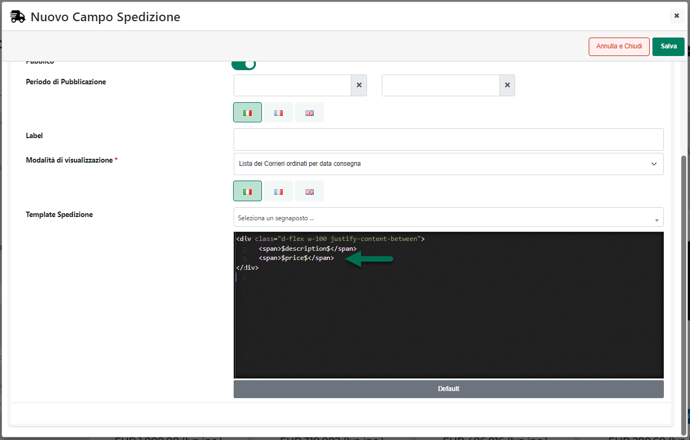

# ZONE GEOGRAFICHE

La sezione "**Zone Tasse**" consente di specificare le zone geografiche
(**identificate poi con i relativi indirizzi di spedizione merce**) in
corrispondenza delle quali dover effettivamente applicare la tassa che
si sta codificando

Ovviamente affinché la tassa in esame possa essere correttamente
applicata sarà necessario codificare almeno una Zona che possa
corrispondere con gli indirizzi di spedizione selezionati, in fase di
ordine, dagli utenti del sito.

**Nel momento in cui infatti non dovesse essere codificata nessuna Zona
Geografica, o l'indirizzo di spedizione selezionato dall'utente in fase
di ordine non dovesse rientrare in nessuna delle Zone codificate, la
tassa in esame non verrà, ovviamente, applicata e questo
indipendentemente da quelli che possono essere i valori settati per gli
altri parametri di configurazione della tassa stessa.**

E' bene sottolineare inoltre che, nel caso in cui l'utente non abbia
indicato uno specifico indirizzo di spedizione merce, ai fini
dell'applicazione o meno di una determinata tassa verrà considerato:

- se l'utente è autenticato, il suo indirizzo primario (quello definito
  cioè nella sua anagrafica gestionale)

- se l'utente non è autenticato verrà valutata invece la Nazione di
  appartenenza ricavata sulla base della lingua del browser utilizzato
  o, qualora questo non fosse possibile, sulla base del suo indirizzo IP

I pulsanti presenti nella barra degli strumenti della sezione "Zona
Tasse" consentono rispettivamente:

**Modifica Zona**
( ): consente di modificare la Zona
attualmente selezionata in elenco

**Elimina Zona**
( ): consente di eliminare la Zona
attualmente selezionata in elenco

**Svuota** ( ) consente invece di eliminare in blocco tutte le Zone
attualmente presenti in elenco.

**Aggiungi Zona**
( ): consente di codificare una nuova Zona
geografica. In questo senso è bene sottolineare subito che:

- per Tasse addizionali (**Tipologia di Tassa = Tassa Extra**) sarà
  possibile codificare una Zona geografica specificando Nazione (tra cui
  ovviamente anche l'Italia), Provincia, Località e CAP

- per Tasse di tipo IVA (**Tipologia di Tassa = IVA**) sarà possibile
  codificare una Zona Geografica specificando solamente la Nazione
  (esclusa ovviamente l'Italia)

Cliccando sul pulsante "Aggiungi Zona" verrà quindi visualizzata la
maschera "**Configurazione Zona**"

all'interno della quale poter associare una specifica etichetta (campo
**Nome**) alla Zona che si sta codificando.

Fatto questo sarà poi necessario associare a questa stessa zona una o
più aree geografiche agendo all'interno della sezione "**Aree di
Spedizione**".

In questo senso sarà possibile agire in maniera inclusiva, andando
quindi ad includere una ad una tutte le aree geografiche da associare
alla Zona in esame, oppure, volendo sarà possibile operare anche in
maniera esclusiva andando cioè ad escludere dalla Zona in esame
determinate aree geografiche.

**Ovviamente nel momento in cui si dovesse decidere di lavora in maniera
"esclusiva" sarà comunque indispensabile includere nella stessa Zona
almeno un'area geografica valida**

**ATTENZIONE!** Zone di spedizione con sole aree geografiche da
escludere non avrebbero, ovviamente, alcun senso e la relativa tassa non
potrebbe mai essere applicata

In altri termini supponendo, ad esempio, di dover gestire tutta l'Italia
tranne Anacapri, anziché andare ad includere nella nostra Zona di
spedizione uno ad uno tutte le regioni e le provincie gestite dal
vettore potremmo, in maniera molto più semplice:

- Creare una prima area geografica corrispondente a tutta l'Italia e
  quindi con le opzioni:

  - Gestione = Includi

  - Nazione = Italy

- Creare una seconda area geografica da escludere relativa alla sola
  città di Anacapri e quindi con le opzioni:

  - Gestione = Escludi

  - Nazione = Italy

  - Provincia = Napoli

  - CAP = 80071

Per includere o escludere determinate aree geografiche dalla Zona di
spedizione che si sta codificando è sufficiente agire dai relativi
pulsanti presenti nella barra degli strumenti della sezione "Aree di
Spedizione", pulsanti questi che consentono rispettivamente di:

**Italia** (
 ) **-- solo per "Tipologia Tassa = Tassa
Extra"** -- Consente di associare alla zona che si sta codificando una
specifica area geografica all'interno della nazione Italia.

Cliccando su questo pulsante verrà infatti visualizzata la maschera
"**Configurazione Italia**"

all'interno della quale sarà necessario indicare un valore per i
seguenti parametri:

**Gestione**: consente di decidere se l'area geografica che si sta
codificando dovrà essere **inclusa** o **esclusa** dalla relativa zona
di spedizione:

**ATTENZIONE!** si ricorda che Zone di spedizione con sole aree
geografiche da escludere non avrebbero, ovviamente, alcun senso

Nel momento in cui si dovesse decidere, dunque, di escludere determinate
aree geografiche da una zona di spedizione sarà di fondamentale
importanza verificare che, per la stessa zona, sia presente, almeno,
anche un' area geografica il cui parametro "**Gestione**" è stato
correttamente impostato su "**Includi**"

**Regione / Provincia / Località / CAP**: consente di specificare la
Regione / Provincia / Località / CAP dell'area geografica che si sta
codificando

Selezionando la regione verrà visualizzata la combo box relativa alle
provincie della regione stessa e, una volta indicata la provincia,
verranno visualizzati il campo relativo alle località e l'area
all'interno della quale poter differenziare ulteriormente in base ai
singoli codici di avviamento postale (**utile soprattutto nel caso in
cui sia necessario gestire i "C.A.P." disagiati**)

Per aggiungere un nuovo C.A.P. sarà sufficiente indicarlo all'interno
dell'apposito campo e confermare poi da tastiera con il pulsante
"Invio".

In fase di inserimento dei C.A.P è inoltre possibile utilizzare il
carattere "\_" come wildcard per sostituire uno dei caratteri
effettivamente presenti nel relativo codice di avviamento postale.

**ATTENZIONE!** è fondamentale gestire correttamente il carattere \_
ricordando sempre che **un "underscore" sostituisce un solo carattere**

Supponendo dunque di indicare come C.A.P. il valore "**4_900**" verranno
poi presi in considerazione e validati tutti i codici di avviamento
postale che hanno come primo carattere 4, come secondo carattere un
qualunque valore, come terzo carattere 9, come quarto carattere 0 e come
quindi carattere ancora 0

Supponendo invece di indicare come C.A.P. il valore "**47\_\_\_**" (47
seguito da tre distinti caratteri di underscore), verranno poi presi in
considerazione e validati tutti i codici di avviamento postale che
iniziano con 47 e che proseguono con altri 3 caratteri qualsiasi.

> **NOTA BENE:** la differenziazione per Regione, Provincia e Codice di
> Avviamento Postale può essere effettuata solo ed esclusivamente per la
> nazione Italia.

Il pulsante "**Salva**" presente nella parte bassa della maschera
consente di salvare l'area geografica codificata accodandola a quelle
già presenti in elenco.

In questo senso è necessario considerare anche le seguenti casistiche:

- Se è già presente in elenco un'area geografica precedentemente
  codificata come "**Italia -- Tutte le regioni**" e, per la nuova area
  che si sta codificando, viene indicata invece oltre alla nazione
  Italia anche una specifica regione e/o provincia, alla conferma l'area
  "Italia-Tutte le Regioni" sarà automaticamente rimossa e sostituita
  dalla specifica area appena codificata

- Se in elenco sono già presenti una o più aree geografiche del tipo
  "**Italia-Regione-Specifica Provincia**" e per la nuova area che si
  sta codificando viene selezionata l'opzione "Tutte le regioni", alla
  conferma tutte le aree "Italia-Regione-Provincia" saranno rimosse

- Se è già presente in elenco un'area geografica codificata come
  "**Italia-Regione-Provincia-Cap**" e per la nuova area che si sta
  codificando viene indicata, oltre alla nazione Italia, anche la stessa
  regione e la stessa provincia ma non il CAP, alla conferma l'area
  precedentemente presente in elenco verrà eliminata e sostituita da
  quella nuova appena codificata

- Se è già presente in elenco un'area geografica codificata come
  "**Italia- Regione-Provincia**" e per la nuova area che si sta
  codificando viene indicata, oltre alla nazione Italia, anche la stessa
  regione, la stessa provincia e in più anche una specifica località e/o
  uno specifico CAP, alla conferma l'area precedentemente presente in
  elenco verrà eliminata e sostituita da quella nuova appena codificata.

- Se è già presente in elenco un'area geografica codificata come
  "**Italia -Regione-Provincia -- Località**" e per la nuova area che si
  sta codificando viene indicata, oltre alla nazione Italia anche la
  stessa regione, la stessa provincia, la stessa località e in più
  vengono indicati anche specifici CAP, alla conferma l'area
  precedentemente presente in elenco verrà eliminata e sostituita da
  quella nuova appena codificata.

- Se sono già presenti in elenco aree geografica codificate come
  "**Italia -- Regione-Provincia --Località --CAP**" e per la nuova area
  che si sta codificando viene indicata oltre alla nazione Italia anche
  la stessa regione, la stessa provincia e la stessa la località ma non
  il CAP, alla conferma tutte le aree precedentemente codificate anche
  il CAP associato verranno eliminate e sostituite da quella nuova
  appena codificata.

- Se sono già presenti in elenco aree geografica codificate come
  "**Italia -- Regione - Provincia --Località --CAP**" e per la nuova
  area che si sta codificando viene indicata oltre alla nazione Italia
  anche la stessa regione e la stessa provincia ma non il CAP e la
  Località, alla conferma tutte le aree precedentemente codificate anche
  il CAP e la località associata verranno eliminate e sostituite da
  quella nuova appena codificata.

**Paesi Esteri** (
 ) **-- solo per "Tipologia Tassa = Tassa
Extra"**: consente di associare alla zona geografica che si sta
codificando una specifica area all'interno di una nazione diversa
dall'Italia.

Cliccando su questo pulsante verrà visualizzata la maschera
"**Configurazione Paesi Esteri**"

all'interno della quale sarà necessario indicare un valore per i
seguenti parametri:

**Gestione**: consente di decidere se l'area geografica che si sta
codificando dovrà essere **inclusa** o **esclusa** dalla relativa zona
di spedizione:

**ATTENZIONE!** si ricorda che Zone di spedizione con sole aree
geografiche da escludere non avrebbero, ovviamente, alcun senso

Nel momento in cui si dovesse decidere, dunque, di escludere determinate
aree geografiche da una zona di spedizione sarà di fondamentale
importanza verificare che, per la stessa zona, sia presente, almeno,
anche un' area geografica il cui parametro "**Gestione**" è stato
correttamente impostato su "**Includi**"

**Nazione / Stato / Provincia / Località / CAP**: consente di
specificare la Nazione, lo Stato / Provincia, la Località e il CAP
dell'area geografica che si sta codificando

Nel momento in cui l'esigenza dovesse essere quella di inserire,
all'interno di una zona geografica, più provincie contemporaneamente,
sarà sufficiente selezionarle dal relativo elenco sulla sinistra in
corrispondenza del campo "Stato / Provincia" ed inserirle in quello di
destra cliccando sull'icona della piccola freccia verde rivolta verso
destra.

Anche in questo caso in fase di inserimento di eventuali C.A.P sarà
possibile utilizzare il carattere "\_" come wildcard per sostituire uno
dei caratteri effettivamente presenti nel relativo codice di avviamento
postale.

**Nazioni** (
 ): consente di associare alla zona che si
sta codificando un'area geografica relativa ad un'intera Nazione
(comunque diversa dall'Italia).

Cliccando su questo pulsante verrà visualizzata la maschera
"**Configurazione Nazioni**"

all'interno della quale sarà necessario indicare un valore per i
seguenti parametri:

**Gestione**: consente di decidere se l'area geografica che si sta
codificando dovrà essere **inclusa** o **esclusa** dalla relativa zona
di spedizione:

**ATTENZIONE!** si ricorda che Zone di spedizione con sole aree
geografiche da escludere non avrebbero, ovviamente, alcun senso

Nel momento in cui si dovesse decidere, dunque, di escludere determinate
aree geografiche da una zona di spedizione sarà di fondamentale
importanza verificare che, per la stessa zona, sia presente, almeno,
anche un' area geografica il cui parametro "**Gestione**" è stato
correttamente impostato su "**Includi**"

**Nazioni:** consente di indicare l'elenco delle Nazioni che devono
essere associate alla zona di spedizione che si sta codificando

Per associare alla zona di spedizione una specifica Nazione, è
sufficiente selezionarla dall'elenco di sinistra ed inserirla in quello
di destra cliccando sul pulsante raffigurante una piccola freccia verde
rivolta verso destra. Allo stesso modo per eliminare l'associazione tra
le zona di spedizione in esame ed una specifica Nazione, sarà
sufficiente selezionarla dall'elenco di destra e cliccare poi sul
pulsante raffigurante la piccola freccia rossa rivolta verso sinistra

**Importa da file**
( ): consente di definire le varie aree
geografiche da associare alla zona di spedizione in esame importandole
in blocco da un file di tipo txt o csv appositamente formattato.

Cliccando su questo pulsante verrà infatti visualizzata un'ulteriore
sezione "**Importazione Aree da File**"

all'interno della quale poter selezionare (campo **File**), importandolo
ad esempio dal proprio pc, il file .txt o .csv con indicate tutte le
aree geografiche da associare alla zona in esame.

Il campo **Separatore** consente invece di indicare, selezionandolo,
dall'apposito menu a tendina, il carattere che è stato utilizzato
all'interno del file di importazione come separatore per i vari campi

Affinché la procedura possa terminare in maniera corretta è necessario
che il file txt o csv utilizzato soddisfi determinate regole. Nello
specifico:

[TASSE DI TIPO EXTRA]{.underline}

- L'intestazione, ossia la prima riga del file, deve essere costituita
  dai seguenti campi

> *gestione;nazione;provincia;localita;cap;km*

- per ogni record del file (e quindi per ogni area geografica) è
  possibile inserire, nell'ordine indicato, le seguenti informazioni:

  - **gestione: 0** nel caso in cui la relativa area geografica debba
    essere inclusa nella Zona, **1** nel caso in cui la relativa area
    geografica debba essere esclusa

> **ATTENZIONE!** Il campo "gestione" non è obbligatorio e può quindi
> anche non essere inserito nel tracciato record del file di
> importazione. In questo caso (**campo non specificato**) **la relativa
> area geografica verrà considerata, a default, come inclusa** nella
> zona di spedizione

- **nazione**: codice iso a 2 caratteri della nazione

- **provincia**: sigla della provincia

- **localita**: nome della localita

- **cap**: codice di avviamento postale della localita (con possibilità
  di utilizzare il carattere \_ come carattere wildcard)

<!-- -->

- Il carattere separatore dei vari campi deve essere esattamente quello
  indicato all'interno del campo "**Separatore**" presente nel form di
  importazione

- Il file di importazione deve soddisfare le specifiche del formato
  RFC4180.

> In questo senso è quindi necessario che il valore dei campi contenenti
> interruzioni di riga, doppi apici e/o lo stesso carattere utilizzato
> anche come separatore sia necessariamente racchiuso da virgolette

Supponendo di voler utilizzare come carattere separatore il ; la
struttura del file potrebbe quindi essere:

FR;;;

IT;SA;;

IT;RN;;47900

IT;RN;Viserba;47922

IT;RN;Viserbella;

Nelle condizioni sopra indicate verrebbero quindi aggiunte alla zona di
spedizione in esame 5 distinte aree geografiche: la prima relativa alla
nazione Francia, la seconda relativa all'are geografica corrispondente
alla provincia di Salerno in Italia, la terza relativa alla provincia di
Rimini e nello specifico al codice di avviamento postale 47900, la
quarta sempre relativa alla provincia di rimini ma più specificatamente
alla località Viserba e al codice di avviamento postale 47922 e la
quinta relativa alla provincia di rimini e nello specifico alla località
Viserbella.

> **NOTA BENE:** nel caso di "Importazione da file" non verranno
> effettuati controlli di alcun tipo relativamente alle aree geografiche
> eventualmente già associate alla zona in esame. Occorre quindi fare
> particolare attenzioni, in queste condizioni, a non inserire delle
> aree geografiche doppie o triple.

[TASSE DI TIPO IVA]{.underline}

- L'intestazione, ossia la prima riga del file, deve essere costituita
  dal seguente campo

> *nazione*

- per ogni record del file (e quindi per ogni nazione) è possibile
  inserire, nell'ordine indicato, le seguenti informazioni:

  - **nazione**: codice iso a 2 caratteri della nazione

- Il file di importazione deve soddisfare le specifiche del formato
  RFC4180.

**ATTENZIONE!** Relativamente alla tasse di tipo IVA è possibile gestire
zone geografiche distinte unicamente in base alla Nazione

**Esporta** (
 ): consente di esportare all'interno di
un file csv, nello stesso formato valido anche per l'importazione,
l'elenco di tutte le aree geografiche attualmente presenti in elenco.

Cliccando su questo pulsante verrà infatti visualizzata un'ulteriore
sezione "**Esportazione Aree**"

all'interno della quale poter indicare il carattere separatore che dovrà
essere utilizzato in fase di creazione del file csv.

Il pulsante "**Salva**" presente nella parte bassa della maschera
consente di avviare la procedura di esportazione

**Elimina Area** (
 ): consente di eliminare l'area
geografica attualmente selezionata in elenco

**Svuota** (
 ): consente di eliminare in blocco tutte le aree
geografiche associate alla zona in esame

