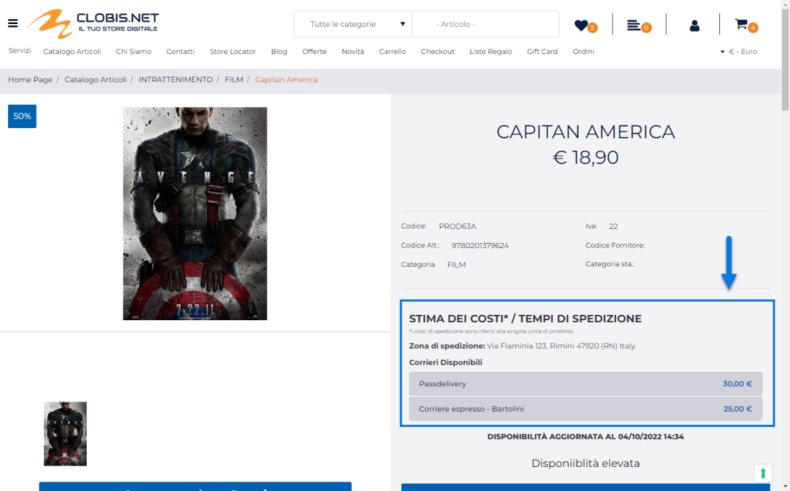
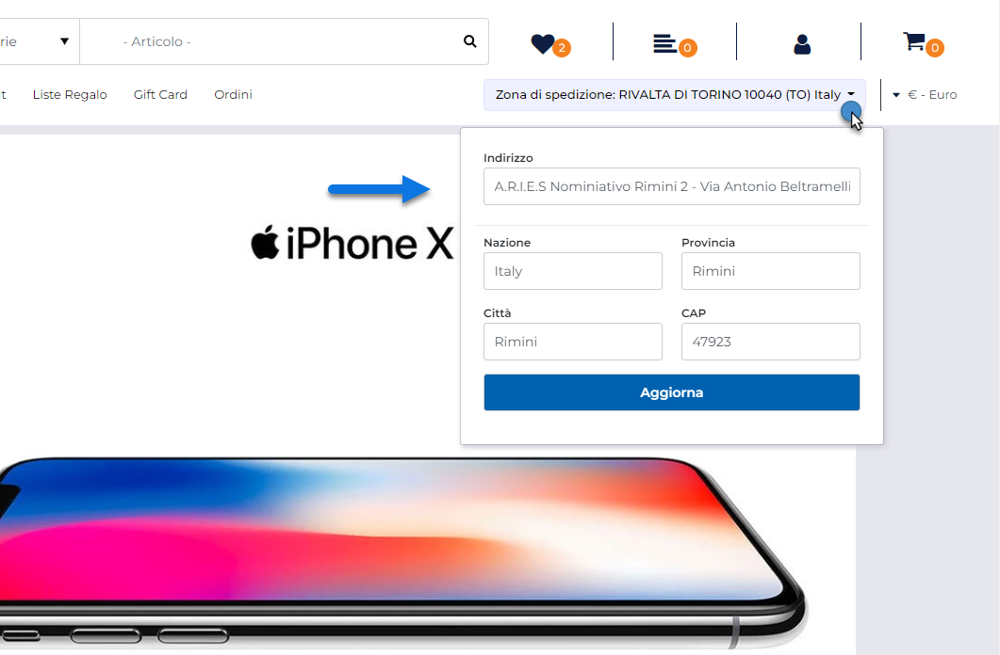

# APPLICAZIONE DI UNA TASSA ADDIZIONALE

Sulla base di quanto indicato nei precedenti capitoli di questo manuale
dovrebbe ormai essere chiaro che all'interno del sito verranno applicate
solo ed esclusivamente quelle Tasse addizionali che risultano essere
correttamente attivate (pulsante "**Attiva Tassa**") e che soddisfano
tutti i criteri di applicabilità definiti in fase di configurazione
della tassa stessa (gruppi di appartenenza dell'utente, aree geografiche
di spedizione della merce ...).

In queste condizioni, per le Tasse addizionali (**Tasse Extra**) sarà
anche possibile visualizzare, in corrispondenza di ogni singolo articolo
soggetto a quel tipo di tassa, il relativo importo direttamente in
catalogo piuttosto che, ad esempio, all'interno della sua scheda
prodotto utilizzando per questo il componente E-commerce "Tasse"

Per maggiori informazioni relativamente alla configurazione e
all'utilizzo del componente "Tasse" si veda anche il corrispondente
capitolo di questo manuale ("*Varianti sito Responsive -- Lista
componenti E-commerce -- Componente Ecommerce Tasse*").

**Nel momento in cui un utente dovesse poi decidere di acquistare uno
degli articoli soggetto a questo tipo costi, l'applicazione della
relativa tassa addizionale si espliciterà mediante l'inserimento in
carrello / ordine dell'articolo spesa indicato in fase di configurazione
della tassa stessa.**

L'importo visualizzato in corrispondenza di questo articolo spesa potrà
coincidere o meno con quello indicato in fase di configurazione della
relativa tassa dipendentemente dall'utente che sta effettuando l'ordine,
dal fatto di aver dichiarato tale importo come ivato o non ivato (per
maggiori informazioni in merito si vedano i precedenti capitoli di
questo manuale) oltre che ovviamente dalle aliquote iva cui saranno
soggetti gli articoli acquistati.

Altra cosa di fondamentale importanza da tenere sempre in considerazione
è che l'importo di queste tasse addizionali potrebbe variare in
relazione alla specifica zona geografica di spedizione della merce **per
cui l'importo inizialmente visualizzato in Catalogo potrebbe modificarsi
nel momento in cui l'utente dovesse in qualche modo indicare una diversa
zona di spedizione.**

In questo senso è bene ricordare che la zona di spedizione merce
potrebbe variare, ad esempio, a seconda del fatto che l'utente che sta
navigando il sito abbia o meno effettuato il login

In particolare:

- Per utenti **non autenticati** la zona di spedizione della merce (da
  cui dipenderà poi l'effettivo importo delle tasse addizionali) verrà
  determinata, inizialmente, utilizzando soltanto la Nazione ricavata
  sulla base delle impostazioni di lingua / paese del browser
  dell'utente o, qualora questo non fosse possibile, sulla base del suo
  indirizzo IP.

> **ATTENZIONE!** La corrispondenza Indirizzo IP -- Paese di provenienza
> è determinata automaticamente da Passweb sulla base di un servizio
> gratuito di tipo "light" la cui precisione potrebbe non essere quindi
> garantita al 100% soprattutto in virtù di eventuali riassegnazioni
> degli indirizzi IP da parte dei vari provider.

- Se l'utente che sta navigando il sito **ha effettuato il login**, la
  zona di spedizione della merce verrà invece determinata, inizialmente,
  utilizzando il suo indirizzo primario vale a dire l'indirizzo di
  fatturazione associato alla sua anagrafica utente.

In ogni caso, indipendentemente dal fatto di aver effettuato o meno
l'autenticazione, l'utente potrebbe avere anche la necessità di inserire
una zona di spedizione merce diversa da quella inizialmente considerata,
in maniera tale da poter poi valutare l'ammontare delle tasse
addizionali anche per quella specifica zona di spedizione.

In questo senso dunque, è opportuno inserire e gestire correttamente
all'interno del sito anche il componete "**Selezione Indirizzo**".

Grazie a questo componente infatti l'utente avrà a disposizione un
piccolo form mediante il quale poter indicare (specificando Nazione,
Provincia, Città e Cap, oppure selezionando, se autenticato, uno dei
suoi indirizzi di spedizione) una ben precisa zona in relazione alla
quale valutare l'importo delle Tasse Addizionali.

Per maggiori informazioni relativamente al componente "Selezione
Indirizzo" si veda anche quanto indicato nel relativo capitolo di questo
manuale ("*Varianti Sito Responsive -- Lista Componenti Ecommerce --
Componente Selezione Indirizzo*")

Oltre al componete "Selezione Indirizzo" l'utente potrebbe poi impostare
uno specifico indirizzo di spedizione lavorando anche in carrello
(mediante l'apposito modulo di preventivo delle spese di spedizione) o
direttamente in checkout. Anche in questo caso verranno automaticamente
ricalcolati, sulla base di queste nuove impostazioni, tutti gli importi
delle Tasse Addizionali e, allo stesso modo, verrà ovviamente aggiornato
anche l'indirizzo visualizzato all'interno del componente "Selezione
Indirizzo".

**ATTENZIONE!** In ogni caso una volta arrivato alla fase di checkout
l'importo delle tasse addizionali sarà valutato sempre in relazione
all'indirizzo di spedizione merce effettivamente selezionato dall'utente
in questa stessa fase.

**ATTENZIONE!** In fase di reso merce, alla conferma del documento
verranno aggiunte eventuali tasse addizionali in relazione agli articoli
che l'utente ha deciso di rendere e all'indirizzo di spedizione presente
sul documento di origine.

