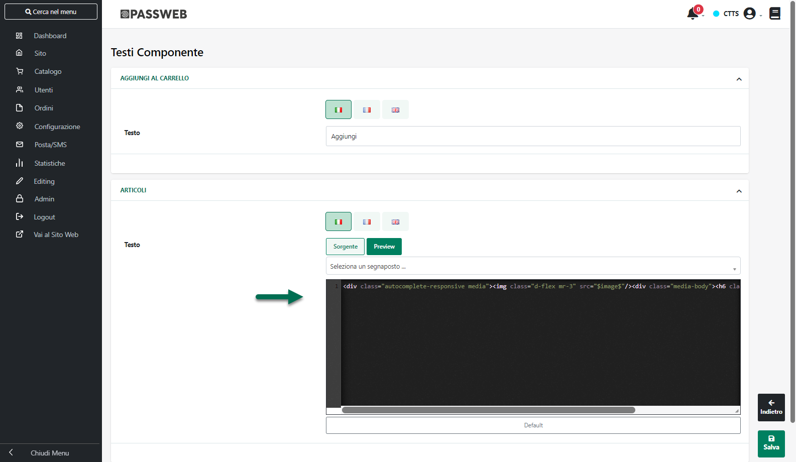
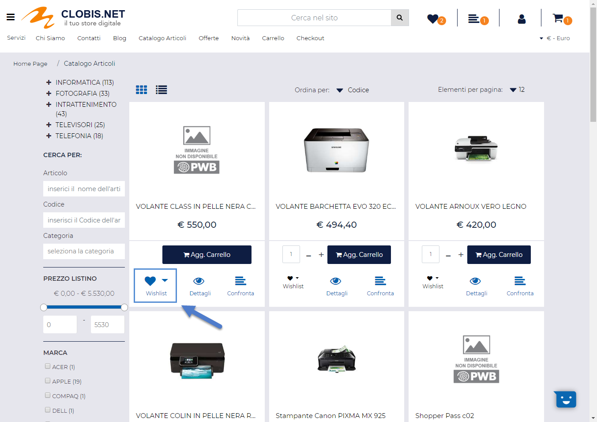
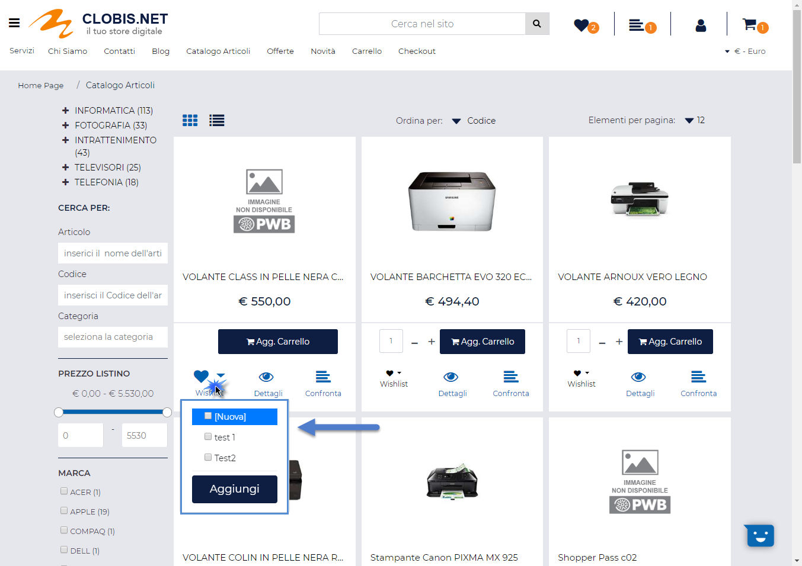
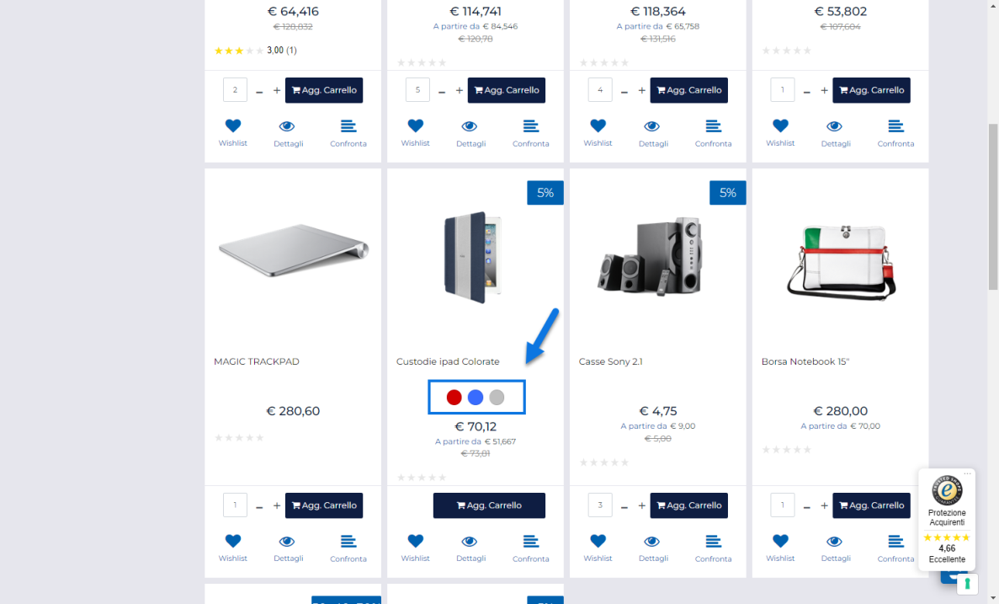
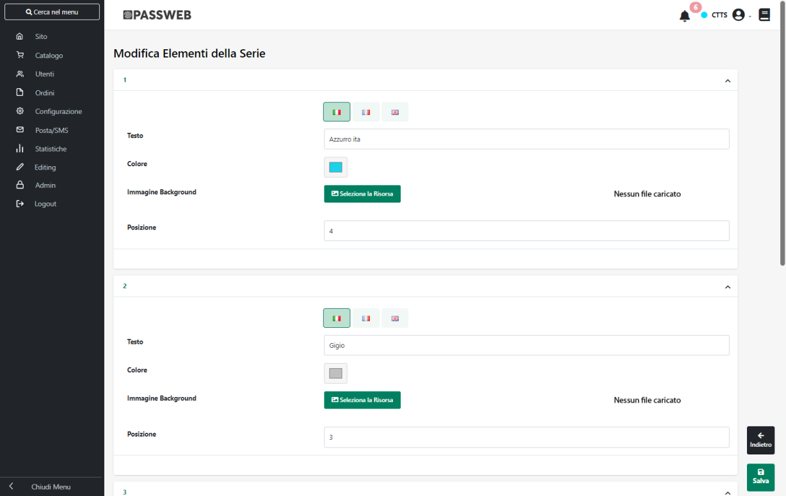

# PROMOZIONE -- AZIONI

Una volta definite tutte le condizioni necessarie per poter
effettivamente ritenere valida la Promozione, occorre impostare,
ovviamente, la parte più importante della Promozione stessa ossia la sua
logica di funzionamento.

Questo lo si fa agendo all'interno della sezione **Azione.**

Il parametro **Azione** presente all'interno di questa sezione permette
infatti di indicare se la Promozione in esame dovrà esplicitarsi con
l'applicazione di determinati sconti oppure con l'aggiunta di
determinati articoli in carrello.

Per maggiori informazioni in merito si rimanda a quanto indicato nei
successivi capitoli di questo manuale.

##### AGGIUNGI ARTICOLI IN CARRELLO

Impostando il parametro **Azione** sul valore **"Aggiungi articoli in
carrello"** la promozione si espliciterà mediante l'inserimento
automatico in carrello di determinati articoli.

**ATTENZIONE!** Prima di poter definire l'elenco di articoli che, al
verificarsi delle condizioni di applicabilità della Promozione, dovranno
essere aggiunti in ordine come articoli omaggio, è necessario effettuare
almeno un salvataggio della Promozione in esame.

Una vota salvata la Promozione si attiverà infatti, come mostrato in
figura, un nuovo pulsante mediante il quale poter indicare esattamente
l'articolo / gli articoli che **dovranno essere inseriti automaticamente
in carrello** al verificarsi delle condizioni di applicabilità della
Promozione

Cliccando su questo pulsante verrà quindi visualizzata la maschera
"**Articolo**"

all'interno della quale poter indicare:

- **Impostazione Articolo:** consente di stabilire quali articoli
  dovranno essere inseriti in carrello al verificarsi delle condizioni
  di applicabilità della promozione. E' possibile selezionare uno dei
  seguenti valori:

  - **Articolo Condizione:** selezionando questa opzione, l'articolo
    aggiunto automaticamente in carrello sarà esattamente lo stesso che
    ha soddisfatto le condizioni di applicabilità della promozione.

> Supponendo, ad esempio, di impostare una condizione tale per cui la
> promozione venga attivata solo nel caso in cui si aggiunga in carrello
> un articolo della categoria "Stampanti", nel momento in cui l'utente
> andrà ad inserire, ad esempio, l'articolo "Stampante Canon X23" la
> promozione verrà attivata e sarà aggiunto in carrello (in una riga
> diversa) lo stesso articolo "Stampante Canon X23" che ha determinato
> l'applicazione della promozione.
>
> **ATTENZIONE! In queste condizioni è necessario impostare, per ovvie
> ragioni, almeno una condizione di applicabilità della promozione. In
> caso contrario infatti non sarebbe possibile determinare quale
> articolo dovrebbe essere inserito in carrello.**
>
> Nel caso in cui l'articolo da aggiungere come omaggio dovesse essere
> un articolo a taglie, questo verrà aggiunto con la stessa taglia dell'
> articolo attualmente presente in carrello in quantità maggiore. Se poi
> in carrello dovessero essere già presenti, per l'articolo oggetto
> della promozione, più taglie differenti con la stessa quantità allora
> la taglia dell'articolo omaggio verrà determinata sulla base di un
> criterio di ordinamento interno a Passweb.

- **Articolo Economico:** selezionando questa opzione, l'articolo
  aggiunto automaticamente sarà, di base, quello più economico tra tutti
  quelli attualmente presenti in carrello.

> Il successivo campo "**Numero Ordinale**" consente in realtà di
> stabilire se l'articolo aggiunto automaticamente in carrello dovrà
> essere effettivamente il più economico oppure il secondo più
> economico, il terzo più economico ...
>
> **ATTENZIONE!** in fase di valutazione dell'articolo più economico non
> verranno prese in considerazione eventuali condizioni di applicabilità
> della promozione.
>
> In conseguenza di ciò, se anche dovessimo aver impostato una
> condizione del tipo "**Sconto in Riga = 'Stringa vuota'**" (campo
> "**Filtro Carrello**") e l'articolo più economico attualmente presente
> in carrello dovesse essere un articolo con uno sconto già applicato,
> sarebbe comunque questo ad essere aggiunto automaticamente in
> carrello.
>
> Si ricorda inoltre che nel caso in cui dovesse essere presente, in
> carrello, un articolo di tipo Campionario, in fase di valutazione
> dell'articolo più economico verrà considerato l'articolo Campionario
> in sé piuttosto che i suoi componenti dipendentemente da come è stato
> impostato il parametro "**Gestione articoli Box**" alla pagina
> "**Configurazione Catalogo**" del Wizard.
>
> Infine nel momento in cui l'articolo da aggiungere automaticamente in
> carrello dovesse risultare essere un articolo a taglie, questo verrà
> aggiunto con la taglia che ha la quantità più alta in carrello. Se poi
> in carrello dovessero essere presenti, per l'articolo oggetto della
> promozione, più taglie differenti con la stessa quantità allora la
> taglia dell'articolo omaggio verrà determinata sulla base di un
> criterio di ordinamento interno a Passweb

- **Altro Articolo:** selezionando questa opzione, sarà poi necessario
  indicare, all'interno del successivo campo "**Articolo**" lo specifico
  prodotto che dovrà essere aggiunto automaticamente in carrello al
  verificarsi delle condizioni di applicabilità della promozione

- **Filtro Articoli**: selezionando questa opzione sarà poi necessario
  indicare all'interno del successivo campo "**Filtro articoli**" il
  filtro che consente di determinare in maniera dinamica l'articolo o
  gli articoli che dovranno essere aggiunti in carrello al verificarsi
  delle condizioni di applicabilità della promozione.

- **Numero Ordinale**: visualizzato solo nel caso in cui il parametro
  "**Impostazione Articolo**" sia stato settato sul valore "**Articolo
  Economico**".

> Consente di stabilire esattamente il numero dell'articolo più
> economico che dovrà essere aggiunto automaticamente in carrello.
> Supponendo, ad esempio, di inserire in corrispondenza del campo
> "**Numero Ordinale**" il valore 1 quello aggiunto automaticamente in
> carrello sarà effettivamente l'articolo più economico. Nel caso in
> cui, invece, il parametro in esame dovesse essere impostato sul valore
> 2 quello aggiunto automaticamente sarebbe il secondo articolo più
> economico tra quelli attualmente presenti in carrello.
>
> **ATTENZIONE!** nel momento in cui il campo "**Numero Ordinale**"
> dovesse essere impostato **su di un valore diverso da 1**, nel
> valutare quello che è l'articolo da aggiungere automaticamente in
> carrello verrà considerato non solo il prezzo dei singoli articoli ma
> anche la quantità con cui questi stessi articoli sono effettivamente
> presenti in carrello.
>
> Supponendo dunque di avere in carrello una situazione del tipo di
> quella di seguito indicata
>
> ART1 -- Prezzo 10€ -- Quantità 2
>
> ART2 -- Prezzo 15€ -- Quantità 1
>
> ART3 -- Prezzo 20€ -- Quantità 1
>
> e di aver impostato il campo "Numero Ordinale" sul valore 2, allora
> l'articolo aggiunto automaticamente in carrello sarebbe comunque ART1.
>
> Considerando infatti che questo articolo è presente in quantità due,
> l'articolo più economico sarebbe ovviamente ART1 ma anche il secondo
> articolo più economico, tra quelli sopra indicati, sarebbe comunque
> sempre ART1

- **Articolo**: visualizzato solo nel caso in cui il parametro
  "**Impostazione Articolo**" sia stato settato sul valore "**Altro
  Articolo**".

> Consente di indicare l'articolo che dovrà essere aggiunto
> automaticamente in ordine al verificarsi delle condizioni di
> applicabilità della Promozione.
>
> Il campo è ad autocompletamento ed è possibile indicare al suo interno
> il codice dell'articolo, la sua descrizione, o parte di essi. In ogni
> caso, infatti, dopo aver inserito almeno 3 caratteri l'applicazione
> proporrà in automatico, tra tutti gli articoli attualmente gestiti sul
> sito, quelli che presentano nel loro codice e/o nella loro descrizione
> la stringa indicata.
>
> **ATTENZIONE!** Nel momento in cui all'articolo da aggiungere
> automaticamente in carrello dovesse essere associato un determinato
> Set di Opzioni (cosa questa che, di base, dovrebbe essere evitata),
> indipendentemente dal fatto poi che tali opzioni siano o meno
> obbligatorie, l'articolo verrà comunque aggiunto in carrello senza
> nessuna opzione.

- **Taglia**: visualizzato solo nel caso in cui il parametro
  "**Impostazione Articolo**" sia stato settato sul valore "**Altro
  Articolo**" e l'articolo da aggiungere in carrello sia un articolo a
  Taglie.

> All'interno di questo campo è quindi possibile indicare esattamente la
> specifica taglia che, al verificarsi delle condizioni di applicabilità
> della Promozione, verrà automaticamente aggiunta in ordine.

- **Filtro articoli**: visualizzato solo nel caso in cui il parametro
  "**Impostazione Articolo**" sia stato settato sul valore "**Filtro
  Articoli**"

> Consente di impostare il filtro che dovrà determinare in maniera
> dinamica l'articolo o gli articoli da aggiungere automaticamente in
> ordine al verificarsi delle condizioni di applicabilità della
> Promozione.
>
> Per maggiori informazioni relativamente alla creazione di un filtro
> articoli si veda anche la sezione *"Utenti -- Gruppi Utenti Sito --
> Filtri Utente e Filtri Articolo -- Filtri Articolo"* di questo
> manuale.

- **Sconto:** consente di specificare lo sconto che dovrà essere
  applicato all'articolo aggiunto automaticamente in ordine al
  verificarsi delle condizioni di applicabilità della Promozione.

> **ATTENZIONE!** Tipicamente questo genere di Promozioni prevede, al
> verificarsi di determinate condizioni, l'inserimento in carrello di
> articoli in omaggio. **In conseguenza di ciò all'interno di questo
> campo andrebbe indicato lo sconto merce (100 -- 109) o lo sconto
> omaggio con rivalsa iva (130 -- 139).**
>
> Per maggiori informazioni su come gestire, lato gestionale, questa
> particolare tipologia di sconti si rimanda al relativo manuale.
>
> In ogni caso, come evidenziato nel tooltip informativo, è comunque
> possibile inserire all'interno di questo campo una qualsiasi delle
> tipologie di sconto gestite all'interno del gestionale, dal normale
> sconto a valore, a quello in percentuale a quelli in cascata ecc...
>
> Nel momento in cui si dovesse, ad esempio, inserire all'interno di
> questo campo il valore 50, al verificarsi delle condizioni di
> applicabilità della Promozione il relativo articolo verrà
> automaticamente aggiunto in ordine NON in omaggio ma con uno sconto
> del 50%

- **Operatore**: consente di indicare un eventuale operatore da
  utilizzare nella determinazione della quantità con cui l'articolo
  indicato dovrà essere inserito in ordine al verificarsi delle
  condizioni di applicabilità della Promozione.

> E' possibile selezionare uno dei seguenti valori:

- **Nessuno:** in questo caso non verrà utilizzato nessun operatore per
  cui l'articolo indicato verrà automaticamente aggiunto in ordine, al
  verificarsi delle condizioni di applicabilità della Promozione,
  esattamente nella quantità indicata all'interno del successivo campo
  **Quantità**

- **((Quantità Prodotti Selezionati) / (Quantità)) x Quantità Y:** in
  questo caso la quantità dell'articolo da inserire automaticamente in
  ordine sarà determinata **dividendo** la quantità complessiva degli
  articoli già presenti in carrello, e che soddisfano il filtro articoli
  impostato nelle condizioni di applicabilità della promozione, per il
  valore inserito nel successivo campo **Quantità.** Il risultato
  ottenuto verrà poi moltiplicato per il valore inserito nel successivo
  campo "**Quantità Y**"

> **ATTENZIONE!** Il risultato della divisione verrà sempre arrotondato
> per difetto

- **(Quantità Prodotti Selezionati) x (Quantità):** in questo caso la
  quantità dell'articolo da inserire automaticamente in ordine sarà
  determinata **moltiplicando** la quantità complessiva degli articoli
  già presenti in carrello, e che soddisfano il filtro articoli
  impostato nelle condizioni di applicabilità della promozione, per il
  valore inserito nel successivo campo **Quantità**.

- **(Quantità Prodotti Selezionati) / (Quantità):** in questo caso la
  quantità dell'articolo da inserire automaticamente in ordine sarà
  determinata **dividendo** la quantità complessiva degli articoli già
  presenti in carrello, e che soddisfano il filtro articoli impostato
  nelle condizioni di applicabilità della promozione, per il valore
  inserito nel successivo campo **Quantità**

> **ATTENZIONE!** Il risultato della divisione verrà sempre arrotondato
> per difetto

- **(Elementi Prodotti Selezionati) x (Quantità):** in questo caso la
  quantità dell'articolo da inserire automaticamente in ordine sarà
  determinata **moltiplicando** il numero delle righe degli articoli in
  carrello che soddisfano la condizione impostata sulla promozione per
  il valore inserito nel successivo campo **Quantità**

> **ATTENZIONE!** Nel momento in cui il precedente parametro
> "**Impostazioni Articolo**" dovesse essere settato sul valore
> "**Articolo Condizione**" la "**Quantità Prodotti Selezionati**" farà
> riferimento alla quantità di riga di ogni prodotto presente in
> carrello.
>
> In tutti gli latri casi invece la "Quantità Prodotti selezionati"
> continuerà a fare riferimento (come indicato sopra) alla quantità
> complessiva dei prodotti in carrello
>
> **ATTENZIONE!** Nel caso in cui si decida di utilizzare l'operatore di
> moltiplicazione o quello di divisione è necessario aver impostato,
> nelle condizioni di applicabilità della promozione, un filtro articoli
> (necessario per individuare esattamente, tra gli articoli presenti in
> carrello, quelli la cui quantità dovrà essere moltiplicata / divisa
> per il valore inserito nel successivo campo "Quantità"). **In caso
> contrario non sarà possibile determinare la quantità con cui inserire
> in ordine l'articolo indicato che, quindi, non verrà mai aggiunto.**

- **Quantità:** consente di impostare il valore da utilizzare,
  coerentemente con quanto impostato per il precedente campo, nella
  determinazione della quantità con cui inserire automaticamente in
  ordine, al verificarsi delle condizioni di applicabilità della
  Promozione, l'articolo indicato.

> Per meglio comprendere il significato e l'utilizzo degli ultimi due
> campi appena esaminati, consideriamo ora un paio di semplici esempi.
>
> **[ESEMPIO 1]{.underline}**: **Acquistando almeno un articolo della
> categoria "Informatica" ottengo in omaggio il film "Capitan America"
> (cod. Prodotto PROD63A)**
>
> Per poter implementare questo tipo di promozione sarà necessario, per
> prima cosa, impostare sulla Promozione stessa una condizione con un
> filtro articoli sulla categoria "Informatica", in maniera tale da
> garantire che solo nel caso in cui sia presente in carrello un
> prodotto di questa categoria la Promozione possa effettivamente essere
> ritenuta valida ed applicata.
>
> Una volta impostata questa condizione sarà poi necessario configurare
> la sezione "Azioni" come mostrato in figura

> I parametri "**Azione**" impostati sul valore "**Aggiungi Articoli in
> Carrello**" e "**Impostazione Articolo**" sul valore "**Altro
> Articolo**" ci permettono di esplicitare la promozione mediante
> l'aggiunta automatica in ordine di determinati articoli, indicati in
> maniera esplicita.
>
> Il parametro "Articolo" impostato sul valore PORD63A (corrispondente
> effettivamente al film "Capitan America") ci dice quale articolo
> aggiungere in carrello.
>
> Tale articolo è configurato inoltre per essere aggiunto in carrello
> con uno sconto del 100% (sconto merce) e sempre e soltanto in quantità
> 1, indipendentemente dal numero e/o dalla quantità dei prodotti della
> categoria "Informatica" già presenti in carrello.
>
> Il parametro "Operatore" infatti è impostato sul valore "Nessuno" per
> cui l'articolo in esame verrà inserito in ordine sempre nell'esatta
> quantità indicata all'interno del campo "Quantità"
>
> **[ESEMPIO 2]{.underline}: Per ogni materasso acquistato ottengo in
> omaggio 2 cuscini (cod. Prodotto PROD01B)**
>
> Per poter implementare questo tipo di promozione sarà necessario, per
> prima cosa, impostare sulla Promozione stessa una condizione con un
> filtro articoli sulla categoria "Materassi", in maniera tale da
> garantire che tale promozione verrà applicata solo nel momento in cui
> l'utente inserirà effettivamente in carrello almeno un articolo di
> questa categoria.
>
> In questo caso inoltre la quantità dell'articolo da inserire come
> omaggio (il cuscino) dipende direttamente dalla quantità dei prodotti
> già presenti in carrello che soddisfano il filtro articoli impostato.
> Mettendo dunque in carrello un materasso l'utente dovrà ricevere 2
> cuscini in omaggio, mettendo invece in carrello 3 distinti materassi,
> o lo stesso materasso in quantità 3, dovrà ricevere in omaggio 6
> cuscini ( 2 per ogni materasso).
>
> Per poter ottenere questo risultato sarà quindi necessario configurare
> la sezione "Azioni" come mostrato in figura

> Anche in questo caso i parametri "**Azione**" impostati sul valore
> "**Aggiungi Articoli in Carrello**" e "**Impostazione Articolo**" sul
> valore "**Altro Articolo**" ci permettono di esplicitare la promozione
> mediante l'aggiunta automatica in ordine di determinati articoli,
> indicati in maniera esplicita.
>
> Il parametro "Articolo" impostato sul valore PORD01B (corrispondente
> effettivamente al cuscino) ci dice quale articolo aggiungere in
> carrello.
>
> Tale articolo è configurato inoltre per essere aggiunto in carrello
> con uno sconto del 100% (sconto merce) e in una quantità che dipende
> direttamente dalle quantità degli articoli già presenti in carrello e
> che soddisfano il filtro articoli impostato sulla condizione della
> Promozione.
>
> Il parametro "Operatore" infatti è impostato sul valore "(Quantità
> Prodotti Selezionati) X (Quantità)" per cui l'effettiva quantità di
> cuscini da inserire come omaggio sarà determinata moltiplicando la
> quantità di materassi presenti in carrello per il valore inserito nel
> successivo campo "Quantità".
>
> Supponendo dunque che l'utente abbia inserito in carrello un solo
> materasso ma in quantità 3, il numero complessivo di cuscini in
> omaggio sarà esattamente (3X2) = 6
>
> Allo stesso modo nel caso in cui l'utente inserisca in carrello 3
> distinti materassi ciascuno in quantità 1, il numero complessivo di
> cuscini in omaggio sarà (1+1+1)X2=6

Volendo è anche possibile importare gli articoli che dovranno essere
inseriti automaticamente in carrello al verificarsi delle condizioni di
applicabilità della Promozione, e i relativi parametri di
configurazione, in maniera massiva, senza dunque operare un articolo
alla volta, ma importando un apposito file contente tutti i dati
necessari.

In questo senso i due pulsanti presenti nella barra degli strumenti
consentono rispettivamente di:

- **Importa** (
   ): consente di importare in maniera
  massiva un elenco di tutti gli articoli, con i relativi parametri di
  configurazione che dovranno essere inseriti in carrello al verificarsi
  delle condizioni di applicabilità della promozione.

> Cliccando su questo pulsante verrà infatti visualizzata la maschera
> **"Importa Valori"**

> all'interno della quale poter indicare:

- **File (csv-txt)**: consente di selezionare il file txt o csv
  contenente l'elenco degli articoli con i relativi parametri di
  configurazione

- **Lingua:** consente di indicare la lingua del sito a cui dovranno
  fare riferimento i dati indicati all'interno del file di importazione

- **Separatore:** consente di indicare, selezionandolo, dall'apposito
  menu a tendina, il carattere che è stato utilizzato all'interno del
  file di importazione come separatore per i vari campi

> Il parametro **"Elimina valori non presenti nel file"** consente, se
> acceso, di eliminare automaticamente eventuali codici articolo
> attualmente presenti in elenco ma non dichiarati nel file che si
> desidera importare.
>
> Affinchè la procedura di importazione possa funzionare in maniera
> corretta è necessario, ovviamente, che il file in oggetto soddisfi
> determinate specifiche. In particolare:

- Il file dovrà avere estensione .csv o .txt

- Il carattere separatore dei vari campi deve essere esattamente quello
  indicato all'interno del campo "**Separatore**" presente nel form di
  importazione

- Il file di importazione deve soddisfare le specifiche del formato
  RFC4180.

> In questo senso è quindi necessario che il valore dei campi contenenti
> interruzioni di riga, doppi apici e/o lo stesso carattere utilizzato
> anche come separatore sia necessariamente racchiuso tra virgolette

- L'intestazione, ossia la prima riga del file, deve contenere **i campi
  di seguito indicati nell'ordine indicato e con le diciture indicate**:

> codice, taglia, sconto, quantita, operatore, quantitaY, filtroArticoli
>
> Considerata l'intestazione del file, ogni suo record dovrà ovviamente
> contenere le seguenti informazioni:
>
> **codice:** codice dell'articolo che dovrà essere inserito in carrello
> al verificarsi delle condizioni di applicabilità della promozione.
> **Obbligatorio**
>
> **taglia:** Taglia con cui l'articolo indicato nel campo precedente
> dovrà essere inserito in carrello. **Obbligatorio solo per articoli
> gestiti a taglie** e indicato nella lingua di importazione del file
> (specificata nel successivo campo "Lingua di riferimento")
>
> **sconto:** sconto che dovrà essere applicato all'articolo inserito in
> carrello. **Opzionale.** Nel caso in cui per un determinato articolo
> non venga indicato nessuno sconto questo verrà inserito
> automaticamente in carrello al verificarsi delle condizioni di
> applicabilità della promozione a prezzo pieno
>
> **quantita:** quantità con cui l'articolo dovrà essere inserito in
> carrello al verificarsi delle condizioni di applicabilità della
> promozione. **Opzionale.** Nel caso in cui non venga indicata
> esplicitamente una quantità verrà considerata a default la quantità 1
>
> **operatore:** operatore da utilizzare nella determinazione della
> quantità con cui l'articolo dovrà essere inserito in carrello al
> verificarsi delle condizioni di applicabilità della promozione.
> **Opzionale.** Può assumere i seguenti valori:

- **0**: non verrà considerato nessun operatore per cui la quantità con
  cui inserire l'articolo in carrello sarà esattamente quella indicata
  in corrispondenza del campo Quantità

- **1**: in questo caso la quantità dell'articolo da inserire
  automaticamente in ordine sarà determinata sulla base della formula
  **"(Quantità Prodotti Selezionati) x (Quantità)"**, moltiplicando cioè
  la quantità complessiva degli articoli già presenti in carrello, e che
  soddisfano il filtro articoli impostato nelle condizioni di
  applicabilità della promozione, per il valore inserito in
  corrispondenza del campo **Quantità**.

- **2**: in questo caso la quantità dell'articolo da inserire
  automaticamente in ordine sarà determinata sulla base della formula
  **"(Quantità Prodotti Selezionati) / (Quantità)"**, dividendo cioè la
  quantità complessiva degli articoli già presenti in carrello, e che
  soddisfano il filtro articoli impostato nelle condizioni di
  applicabilità della promozione, per il valore inserito in
  corrispondenza del campo **Quantità**.

- **3**: in questo caso la quantità dell'articolo da inserire
  automaticamente in ordine sarà determinata sulla base della formula
  **"(Elementi Prodotti Selezionati) x (Quantità)"**, moltiplicando cioè
  il numero delle righe degli articoli in carrello che soddisfano la
  condizione impostata sulla promozione per il valore inserito in
  corrispondenza del campo Quantità

- **4**: in questo caso la quantità dell'articolo da inserire in
  automaticamente in ordine sarà determinata sulla base della formula
  "**((Quantità Prodotti Selezionati) / (Quantità)) x Quantità Y**", e
  quindi dividendo per prima cosa la quantità complessiva degli articoli
  già presenti in carrello, e che soddisfano il filtro articoli
  impostato nelle condizioni di applicabilità della promozione, per il
  valore inserito in corrispondenza del Quantità e moltiplicando poi il
  valore ottenuto per il quello inserito in corrispondenza del campo
  "**Quantità Y**"

> **quantita Y**: valore del parametro "Quantità Y" da utilizzare in
> corrispondenza del relativo parametro nel momento in cui il precedente
> campo "operatore" sia stato impostato sul valore 4
>
> **filtroArticoli:** eventuale filtro di selezione degli articoli che
> dovranno essere aggiunti in carrello al verificarsi delle condizioni
> di applicabilità della promozione.
>
> Corrisponde al filtro impostabile in corrispondenza dell'omonimo campo
> "**Filtro Articoli**" presente nella maschera di configurazione
> dell'Azione da associare alla Promozione.

> **ATTENZIONE! Per determinare in maniera corretta il filtro articoli e
> quindi il valore esatto da inserire in corrispondenza di questa
> colonna è necessario utilizzare il Wizard di Passweb.**
>
> Occorre quindi portarsi all'interno della maschera di configurazione
> dell'Azione da associare alla Promozione e costruire, per prima cosa,
> il filtro desiderato mediante l'editor visuale presente in
> corrispondenza del campo "**Filtro** **Articoli**"
>
> Una volta creato il filtro desiderato sarà poi sufficiente cliccare
> sul pulsante "**Copia Filtro**" per ottenere esattamente la stringa
> corrispondente al filtro impostato, stringa questa che dovrà poi
> essere incollata all'interno del file di importazione in
> corrispondenza della colonna "filtroArticoli"
>
> In definitiva dunque, supponendo di voler utilizzare come carattere
> separatore il ; il file da importare dovrà avere una struttura del
> tipo di quella indicata
>
> **codice, taglia, sconto, quantita, operatore, quantitaY,
> filtroArticoli**
>
> **Prod01A;xl;-10;2;0;;**
>
> **Prod02A;;5;2;1;;**
>
> **Prod03A;s;25;2;2;;**
>
> **Prod04A;;-5;1;0;;**
> "**\[{columnslot:\"\"cat\"\",opslot:11,chainslot:0,columnvalue:\"\"12\"\"}\]"**
>
> **...**
>
> Infine, nel caso in cui nel file da importare siano stati dichiarati
> articoli già presenti in elenco, i relativi valori verranno
> sovrascritti con quanto indicato per questi stessi articoli
> all'interno del file di importazione.

- **Esporta**
  ( ): consente di esportare l'attuale
  elenco di articoli che verranno aggiunti in carrello al verificarsi
  delle condizioni di applicabilità della promozione all'interno di un'
  apposito file .csv.

> Cliccando su questo pulsante verrà infatti visualizzata la maschera
> **"Esporta Valori"**

> all'interno della quale poter indicare:

- **Lingua:** consente di indicare la lingua del sito a cui dovranno
  fare riferimento i dati indicati all'interno del file di esportazione

- **Separatore:** consente di indicare, selezionandolo, dall'apposito
  menu a tendina, il carattere che dovrà essere utilizzato all'interno
  del file di esportazione come separatore per i vari campi

##### SCEGLI ARTICOLI IN CARRELLO

Impostando il parametro **Azione** sul valore **"Scegli Articoli in
Carrello"** la promozione si espliciterà nella possibilità da parte
dell'utente di scegliere tra una lista di articoli predefiniti, quali
poter aggiungere gratuitamente (o a condizioni particolari) in Carrello.

Il parametro **"Numero Articoli da scegliere**" consente di impostare il
numero esatto di articoli che l'utente potrà selezionare tra quelli
elencati

**ATTENZIONE!** Prima di poter definire l'elenco di articoli tra cui
l'utente potrà scegliere è necessario effettuare almeno un salvataggio
della Promozione in esame.

Una vota salvata la Promozione si attiverà infatti, come mostrato in
figura, un nuovo pulsante mediante il quale poter definire l'elenco di
articoli tra cui l'utente potrà scegliere quali inserire in carrello
alle condizioni particolari per essi definite.

Cliccando su questo pulsante verrà infatti visualizzata la maschera
"**Articolo**"

all'interno della quale poter indicare:

- **Impostazione Articolo:** consente di stabilire quali dovranno essere
  gli articoli che l'utente potrà selezionare ed aggiungere in carrello
  al verificarsi delle condizioni di applicabilità della Promozione:

  - **Articolo Condizione:** selezionando questa opzione, l'articolo
    aggiunto tra l'elenco di quelli che l'utente potrà selezionare come
    "Omaggio", sarà esattamente lo stesso che ha soddisfatto le
    condizioni di applicabilità della promozione.

> Supponendo, ad esempio, di impostare una condizione tale per cui la
> promozione venga attivata solo nel caso in cui si aggiunga in carrello
> un articolo della categoria "Stampanti", nel momento in cui l'utente
> andrà ad inserire, ad esempio, l'articolo "Stampante Canon X23" la
> promozione verrà attivata e l'utente si troverà lo stesso articolo
> "Stampante Canon X23" anche tra quelli selezionabili come omaggio.
>
> **ATTENZIONE! In queste condizioni è necessario impostare, per ovvie
> ragioni, almeno una condizione di applicabilità della promozione. In
> caso contrario infatti non sarebbe possibile determinare quale
> articolo dovrebbe essere inserito in carrello.**
>
> Nel caso in cui l'articolo da inserire tra quelli selezionabili come
> omaggio dovesse essere un articolo a taglie, questo comparirà nel box
> regalo con la taglia selezionabile.

- **Articolo Economico:** selezionando questa opzione, l'articolo
  aggiunto tra l'elenco di quelli che l'utente potrà selezionare come
  "Omaggio" sarà, di base, quello più economico tra tutti quelli
  attualmente presenti in carrello.

> Il successivo campo "**Numero Ordinale**" consente in realtà di
> stabilire se l'articolo aggiunto tra l'elenco di quelli che l'utente
> potrà selezionare come "Omaggio" dovrà essere effettivamente il più
> economico oppure il secondo più economico, il terzo più economico ...
>
> **ATTENZIONE!** in fase di valutazione dell'articolo più economico non
> verranno prese in considerazione eventuali condizioni di applicabilità
> della promozione.
>
> In conseguenza di ciò, se anche dovessimo aver impostato una
> condizione del tipo "**Sconto in Riga = 'Stringa vuota'**" (campo
> "**Filtro Carrello**") e l'articolo più economico attualmente presente
> in carrello dovesse essere un articolo con uno sconto già applicato,
> sarebbe comunque questo ad essere aggiunto tra l'elenco di quelli che
> l'utente potrà selezionare come "Omaggio".
>
> Si ricorda inoltre che nel caso in cui dovesse essere presente, in
> carrello, un articolo di tipo Campionario, in fase di valutazione
> dell'articolo più economico verrà considerato l'articolo Campionario
> in sé piuttosto che i suoi componenti dipendentemente da come è stato
> impostato il parametro "**Gestione articoli Box**" alla pagina
> "**Configurazione Catalogo**" del Wizard.
>
> Infine nel momento in cui l'articolo da aggiungere tra l'elenco di
> quelli che l'utente potrà selezionare come "Omaggio" dovesse risultare
> essere un articolo a taglie, questo verrà aggiunto con la taglia che
> ha la quantità più alta in carrello. Se poi in carrello dovessero
> essere presenti, per l'articolo oggetto della promozione, più taglie
> differenti con la stessa quantità allora la taglia dell'articolo
> omaggio verrà determinata sulla base di un criterio di ordinamento
> interno a Passweb

- **Altro Articolo:** selezionando questa opzione, sarà poi necessario
  indicare, all'interno del successivo campo "**Articolo**" lo specifico
  prodotto che dovrà essere aggiunto all'elenco di quelli che l'utente
  potrà selezionare come "Omaggio"

- **Filtro Articoli**: selezionando questa opzione sarà poi necessario
  indicare all'interno del successivo campo "**Filtro articoli**" il
  filtro che consente di determinare in maniera dinamica l'articolo o
  gli articoli che dovranno essere aggiunti all'elenco di quelli che
  l'utente potrà selezionare come "Omaggio"

<!-- -->

- **Numero Ordinale**: visualizzato solo nel caso in cui il parametro
  "**Impostazione Articolo**" sia stato settato sul valore "**Articolo
  Economico**".

> Consente di stabilire esattamente il numero dell'articolo più
> economico che dovrà essere aggiunto tra l'elenco di quelli che
> l'utente potrà selezionare come "Omaggio". Supponendo, ad esempio, di
> inserire in corrispondenza del campo "**Numero Ordinale**" il valore 1
> il prodotto da aggiungere tra l'elenco di quelli che l'utente potrà
> selezionare come "Omaggio" sarà effettivamente l'articolo più
> economico. Nel caso in cui, invece, il parametro in esame dovesse
> essere impostato sul valore 2 il prodotto da aggiungere tra l'elenco
> di quelli che l'utente potrà selezionare come "Omaggio" sarebbe il
> secondo articolo più economico tra quelli attualmente presenti in
> carrello.
>
> **ATTENZIONE!** nel momento in cui il campo "**Numero Ordinale**"
> dovesse essere impostato **su di un valore diverso da 1**, nel
> valutare quello che è l'articolo da aggiungere tra l'elenco di quelli
> che l'utente potrà selezionare come "Omaggio" verrà considerato non
> solo il prezzo dei singoli articoli ma anche la quantità con cui
> questi stessi articoli sono effettivamente presenti in carrello.
>
> Supponendo dunque di avere in carrello una situazione del tipo di
> quella di seguito indicata
>
> ART1 -- Prezzo 10€ -- Quantità 2
>
> ART2 -- Prezzo 15€ -- Quantità 1
>
> ART3 -- Prezzo 20€ -- Quantità 1
>
> e di aver impostato il campo "Numero Ordinale" sul valore 2, allora
> l'articolo aggiunto tra l'elenco di quelli che l'utente potrà
> selezionare come "Omaggio" sarebbe comunque ART1.
>
> Considerando infatti che questo articolo è presente in quantità due,
> l'articolo più economico sarebbe ovviamente ART1 ma anche il secondo
> articolo più economico, tra quelli sopra indicati, sarebbe comunque
> sempre ART1

- **Articolo**: visualizzato solo nel caso in cui il parametro
  "**Impostazione Articolo**" sia stato settato sul valore "**Altro
  Articolo**".

> Consente di indicare l'articolo che l'utente potrà selezionare ed
> aggiungere in carrello al verificarsi delle condizioni di
> applicabilità della Promozione.
>
> E' possibile indicare all'interno di questo campo direttamente il
> codice dell'articolo, la sua descrizione, o parte di essi. In ogni
> caso, infatti, dopo aver inserito almeno 3 caratteri l'applicazione
> proporrà in automatico, tra tutti gli articoli attualmente gestiti sul
> sito, quelli che presentano nel loro codice e/o nella loro descrizione
> la stringa indicata.
>
> **ATTENZIONE! A differenza di quanto avveniva per le precedenti
> promozioni (relative all'aggiunta automatica di articoli in carrello),
> in questo caso sarà possibile indicare anche Padri di Struttura e/o
> Articoli a Taglie\\Colori senza indicare però la specifica
> Taglia\\Colore dell'articolo da inserire in elenco.**
>
> Nel momento in cui si dovesse dunque decidere di inserire in elenco
> questo tipo di articoli, sarà poi l'utente stesso in fase di acquisto
> e di "selezione del regalo" a dover configurare lo specifico articolo
> da inserire in carrello.
>
> **ATTENZIONE! Non è invece possibile inserire in questo tipo di
> promozioni articoli Campionario Configurabili**

- **Taglia**: visualizzato solo nel caso in cui il parametro
  "**Impostazione Articolo**" sia stato settato sul valore "**Altro
  Articolo**" e l'articolo da aggiungere in carrello sia un articolo a
  Taglie. All'interno di questo campo è quindi possibile indicare
  esattamente la specifica taglia dell'articolo che, al verificarsi
  delle condizioni di applicabilità della Promozione, dovrà essere
  aggiunta nell'elenco dei possibili prodotti selezionabili dall'utente.

> In questo caso oltre ad indicare una specifica Taglia\\Colore,
> volendo, è possibile impostare questo campo anche sul valore "**A
> Scelta**"
>
> **In queste condizioni sarà l'utente stesso in fase di acquisto
> all'interno del sito a poter selezionare la specifica Taglia/Colore
> dell'articolo da inserire in Carrello alle condizioni particolari per
> esso definite.**

- **Filtro articoli**: visualizzato solo nel caso in cui il parametro
  "**Impostazione Articolo**" sia stato settato sul valore "**Filtro
  Articoli**"

> Consente di impostare il filtro che dovrà determinare in maniera
> dinamica l'articolo o gli articoli da aggiungere automaticamente in
> ordine al verificarsi delle condizioni di applicabilità della
> Promozione.
>
> Per maggiori informazioni relativamente alla creazione di un filtro
> articoli si veda anche la sezione *"Utenti -- Gruppi Utenti Sito --
> Filtri Utente e Filtri Articolo -- Filtri Articolo"* di questo
> manuale.

- **Sconto:** consente di specificare lo sconto che dovrà essere
  applicato all'articolo nel momento in cui l'utente dovesse
  selezionarlo tra quelli disponibili in elenco ed aggiungerlo in
  carrello.

> **ATTENZIONE!** Tipicamente questo genere di Promozioni viene
> utilizzata per consentire all'utente, al verificarsi di determinate
> condizioni, di scegliere all'interno di un elenco prestabilito, uno o
> più articoli da aggiungere gratuitamente in carrello. **In conseguenza
> di ciò all'interno di questo campo andrebbe indicato lo sconto merce
> (10-0 -- 109) o lo sconto omaggio con rivalsa iva (130 -- 139).**
>
> Per maggiori informazioni su come gestire, lato gestionale, questa
> particolare tipologia di sconti si rimanda al relativo manuale.
>
> In ogni caso, come evidenziato nel tooltip informativo, è comunque
> possibile inserire all'interno di questo campo una qualsiasi delle
> tipologie di sconto gestite sul gestionale, dal normale sconto a
> valore, a quello in percentuale a quelli in cascata ecc...
>
> Nel momento in cui si dovesse, ad esempio, inserire all'interno di
> questo campo il valore 50, al verificarsi delle condizioni di
> applicabilità della Promozione il relativo articolo, se selezionato
> dall'utente, verrà aggiunto in carrello NON gratuitamente ma con uno
> sconto del 50%

- **Operatore**: consente di indicare un eventuale operatore da
  utilizzare nella determinazione della quantità con cui l'articolo
  indicato dovrà essere inserito in carrello.

> E' possibile selezionare uno dei seguenti valori:

- **Nessuno:** in questo caso non verrà utilizzato nessun operatore per
  cui l'articolo indicato verrà aggiunto in carrello, se selezionato
  dall'utente, esattamente nella quantità indicata all'interno del
  successivo campo **Quantità**

- **((Quantità Prodotti Selezionati) / (Quantità)) x Quantità Y:** in
  questo caso la quantità dell'articolo da inserire automaticamente in
  carrello sarà determinata **dividendo** la quantità complessiva degli
  articoli già presenti in carrello, e che soddisfano il filtro articoli
  impostato nelle condizioni di applicabilità della promozione, per il
  valore inserito nel successivo campo **Quantità.** Il risultato
  ottenuto verrà poi moltiplicato per il valore inserito nel successivo
  campo "**Quantità Y**"

> **ATTENZIONE!** Il risultato della divisione verrà sempre arrotondato
> per difetto

- **(Quantità Prodotti Selezionati) X (Quantità):** in questo caso la
  quantità dell'articolo da inserire in carrello sarà determinata
  **moltiplicando** la quantità complessiva degli articoli già presenti
  in carrello, e che soddisfano il filtro articoli impostato nelle
  condizioni di applicabilità della promozione, per il valore inserito
  nel successivo campo **Quantità**.

- **(Quantità Prodotti Selezionati) / (Quantità):** in questo caso la
  quantità dell'articolo da inserire automaticamente in carrello sarà
  determinata **dividendo** la quantità complessiva degli articoli già
  presenti in carrello, e che soddisfano il filtro articoli impostato
  nelle condizioni di applicabilità della promozione, per il valore
  inserito nel successivo campo **Quantità**

> **ATTENZIONE!** Il risultato della divisione verrà sempre arrotondato
> per difetto
>
> **ATTENZIONE!** Nel momento in cui il precedente parametro
> "**Impostazioni Articolo**" dovesse essere settato sul valore
> "**Articolo Condizione**" la "**Quantità Prodotti Selezionati**" farà
> riferimento alla quantità di riga di ogni prodotto presente in
> carrello.
>
> In tutti gli latri casi invece la "Quantità Prodotti selezionati"
> continuerà a fare riferimento (come indicato sopra) alla quantità
> complessiva dei prodotti in carrello
>
> **ATTENZIONE!** Nel caso in cui si decida di utilizzare l'operatore di
> moltiplicazione o quello di divisione è necessario aver impostato,
> nelle condizioni di applicabilità della promozione, un filtro articoli
> (necessario per individuare esattamente, tra gli articoli presenti in
> carrello, quelli la cui quantità dovrà essere moltiplicata / divisa
> per il valore inserito nel successivo campo "Quantità"). In caso
> contrario non sarà possibile determinare la quantità con cui inserire
> in carrello l'articolo indicato.

- **Quantità:** consente di impostare il valore da utilizzare,
  coerentemente con quanto definito per il precedente campo, nella
  determinazione della quantità con cui inserire in carrello l'articolo
  selezionato dall'utente.

Per meglio comprendere il significato e l'utilizzo degli ultimi due
campi appena esaminati si veda anche quanto detto in proposito nel
capitolo di questo manuale relativo alla Promozione per l'aggiunta
automatica di articoli in carrello.

Volendo è anche possibile importare gli articoli da inserire nell'elenco
di selezione che verrà mostrato all'utente al verificarsi delle
condizioni di applicabilità della Promozione, e i relativi parametri di
configurazione, in maniera massiva, senza dunque operare un articolo
alla volta, ma importando un apposito file contente tutti i dati
necessari.

In questo senso i due pulsanti presenti nella barra degli strumenti
consentono rispettivamente di:

- **Importa** (
   ): consente di importare in maniera
  massiva un elenco di tutti gli articoli, con i relativi parametri di
  configurazione che dovranno essere inseriti nell'elenco di selezione
  mostrato all'utente al verificarsi delle condizioni di applicabilità
  della promozione. Cliccando su questo pulsante verrà infatti
  visualizzata la maschera **"Importa Valori"**

> all'interno della quale poter indicare:

- **File (csv-txt)**: consente di selezionare il file txt o csv
  contenente l'elenco degli articoli con i relativi parametri di
  configurazione

- **Lingua:** consente di indicare la lingua del sito a cui dovranno
  fare riferimento i dati indicati all'interno del file di importazione

- **Separatore:** consente di indicare, selezionandolo, dall'apposito
  menu a tendina, il carattere che è stato utilizzato all'interno del
  file di importazione come separatore per i vari campi

> Il check **"Elimina valori non presenti nel file"** consente, se
> selezionato, di eliminare automaticamente eventuali codici articolo
> attualmente presenti in elenco ma non dichiarati nel file che si
> desidera importare.
>
> Affinchè la procedura di importazione possa funzionare in maniera
> corretta è necessario, ovviamente, che il file in oggetto soddisfi
> determinate specifiche. In particolare:

- Il file dovrà avere estensione .csv o .txt

- Il carattere separatore dei vari campi deve essere esattamente quello
  indicato all'interno del campo "**Separatore**" presente nel form di
  importazione

- Il file di importazione deve soddisfare le specifiche del formato
  RFC4180.

> In questo senso è quindi necessario che il valore dei campi contenenti
> interruzioni di riga, doppi apici e/o lo stesso carattere utilizzato
> anche come separatore sia necessariamente racchiuso tra virgolette

- L'intestazione, ossia la prima riga del file, deve contenere **i campi
  di seguito indicati nell'ordine indicato e con le diciture indicate**:

> codice, taglia, sconto, quantita, operatore, quantitaY, filtroArticoli
>
> Considerata l'intestazione del file, ogni suo record dovrà ovviamente
> contenere le seguenti informazioni:
>
> **codice:** codice dell'articolo che dovrà essere inserito in carrello
> al verificarsi delle condizioni di applicabilità della promozione.
> **Obbligatorio**
>
> **taglia:** Taglia con cui l'articolo indicato nel campo precedente
> dovrà essere inserito in carrello. **Obbligatorio solo per articoli
> gestiti a taglie** e indicato nella lingua di importazione del file
> (specificata nel successivo campo "Lingua di riferimento")
>
> **sconto:** sconto che dovrà essere applicato all'articolo inserito in
> carrello. **Opzionale.** Nel caso in cui per un determinato articolo
> non venga indicato nessuno sconto questo verrà inserito
> automaticamente in carrello al verificarsi delle condizioni di
> applicabilità della promozione a prezzo pieno
>
> **quantita:** quantità con cui l'articolo dovrà essere inserito in
> carrello al verificarsi delle condizioni di applicabilità della
> promozione. **Opzionale.** Nel caso in cui non venga indicata
> esplicitamente una quantità verrà considerata a default la quantità 1
>
> **operatore:** operatore da utilizzare nella determinazione della
> quantità con cui l'articolo dovrà essere inserito in carrello al
> verificarsi delle condizioni di applicabilità della promozione.
> **Opzionale.** Può assumere i seguenti valori:

- **0**: non verrà considerato nessun operatore per cui la quantità con
  cui inserire l'articolo in carrello sarà esattamente quella indicata
  in corrispondenza del campo Quantità

- **1**: in questo caso la quantità dell'articolo da inserire
  automaticamente in ordine sarà determinata sulla base della formula
  **"(Quantità Prodotti Selezionati) x (Quantità)"**, moltiplicando cioè
  la quantità complessiva degli articoli già presenti in carrello, e che
  soddisfano il filtro articoli impostato nelle condizioni di
  applicabilità della promozione, per il valore inserito in
  corrispondenza del campo **Quantità**.

- **2**: in questo caso la quantità dell'articolo da inserire
  automaticamente in ordine sarà determinata sulla base della formula
  **"(Quantità Prodotti Selezionati) / (Quantità)"**, dividendo cioè la
  quantità complessiva degli articoli già presenti in carrello, e che
  soddisfano il filtro articoli impostato nelle condizioni di
  applicabilità della promozione, per il valore inserito in
  corrispondenza del campo **Quantità**.

- **3**: in questo caso la quantità dell'articolo da inserire
  automaticamente in ordine sarà determinata sulla base della formula
  **"(Elementi Prodotti Selezionati) x (Quantità)"**, moltiplicando cioè
  il numero delle righe degli articoli in carrello che soddisfano la
  condizione impostata sulla promozione per il valore inserito in
  corrispondenza del campo Quantità

- **4**: in questo caso la quantità dell'articolo da inserire in
  automaticamente in ordine sarà determinata sulla base della formula
  "**((Quantità Prodotti Selezionati) / (Quantità)) x Quantità Y**", e
  quindi dividendo per prima cosa la quantità complessiva degli articoli
  già presenti in carrello, e che soddisfano il filtro articoli
  impostato nelle condizioni di applicabilità della promozione, per il
  valore inserito in corrispondenza del Quantità e moltiplicando poi il
  valore ottenuto per il quello inserito in corrispondenza del campo
  "**Quantità Y**"

> **quantita Y**: valore del parametro "Quantità Y" da utilizzare in
> corrispondenza del relativo parametro nel momento in cui il precedente
> campo "operatore" sia stato impostato sul valore 4
>
> **filtroArticoli:** eventuale filtro di selezione degli articoli che
> dovranno essere aggiunti in carrello al verificarsi delle condizioni
> di applicabilità della promozione.
>
> Corrisponde al filtro impostabile in corrispondenza dell'omonimo campo
> "**Filtro Articoli**" presente nella maschera di configurazione
> dell'Azione da associare alla Promozione.

> **ATTENZIONE! Per determinare in maniera corretta il filtro articoli e
> quindi il valore esatto da inserire in corrispondenza di questa
> colonna è necessario utilizzare il Wizard di Passweb.**
>
> Occorre quindi portarsi all'interno della maschera di configurazione
> dell'Azione da associare alla Promozione e costruire, per prima cosa,
> il filtro desiderato mediante l'editor visuale presente in
> corrispondenza del campo "**Filtro** **Articoli**"
>
> Una volta creato il filtro desiderato sarà poi sufficiente cliccare
> sul pulsante "**Copia Filtro**" per ottenere esattamente la stringa
> corrispondente al filtro impostato, stringa questa che dovrà poi
> essere incollata all'interno del file di importazione in
> corrispondenza della colonna "filtroArticoli"
>
> In definitiva dunque, supponendo di voler utilizzare come carattere
> separatore il ; il file da importare dovrà avere una struttura del
> tipo di quella indicata
>
> **codice, taglia, sconto, quantita, operatore, quantitaY,
> filtroArticoli**
>
> **Prod01A;xl;-10;2;0;;**
>
> **Prod02A;;5;2;1;;**
>
> **Prod03A;s;25;2;2;;**
>
> **Prod04A;;-5;1;0;;**
> "**\[{columnslot:\"\"cat\"\",opslot:11,chainslot:0,columnvalue:\"\"12\"\"}\]"**
>
> **...**
>
> Infine, nel caso in cui nel file da importare siano stati dichiarati
> articoli già presenti in elenco, i relativi valori verranno
> sovrascritti con quanto indicato per questi stessi articoli
> all'interno del file di importazione.

- **Esporta**
  ( ): consente di esportare l'attuale
  elenco di articoli all'interno di un' apposito file .csv.

> Cliccando su questo pulsante verrà infatti visualizzata la maschera
> **"Esporta Valori"** all'interno della quale poter indicare:

- **Lingua:** consente di indicare la lingua del sito a cui dovranno
  fare riferimento i dati indicati all'interno del file di esportazione

- **Separatore:** consente di indicare, selezionandolo, dall'apposito
  menu a tendina, il carattere che dovrà essere utilizzato all'interno
  del file di esportazione come separatore per i vari campi

**ATTENZIONE!** Per poter visualizzare, lato Sito, all'interno della
pagina Carrello, l'elenco di articoli "omaggio" tra cui l'utente potrà
scegliere è necessario, non solo che siano verificate le condizioni di
applicabilità della Promozione, ma anche che sia stato correttamente
inserito e configurato, in fase di costruzione del sito, all'interno
della stessa pagina Carrello anche il componente "**Selezione Regalo"**

Per maggiori informazioni relativamente alla configurazione e alla
gestione del componente "**Selezione Regalo**" si vedano anche le
sezione *"Varianti Sito Responsive -- Lista Componenti Ecommerce --
Componente Selezione Regalo"* e *"Varianti Sito Standard e Mobile --
Lista Componenti Ecommerce -- Componente Selezione Regalo"* di questo
manuale.

##### APPLICA UNO SCONTO GENERICO

Impostando il parametro **Azione** sul valore **"Applica uno sconto
generico"** la promozione in esame si espliciterà mediante
l'applicazione di un determinato sconto.

In questo caso infatti non verrà più visualizzato l'elenco di eventuali
articoli da aggiungere in omaggio e compariranno invece i parametri di
configurazione della particolare tipologia di sconto da applicare al
verificarsi delle condizioni di validità della Promozione.

In particolare il parametro:

- **Articolo Spesa:** permette di selezionare l'articolo di tipo S
  (spesa) che dovrà essere utilizzato, lato gestionale, per gestire
  l'applicazione dello sconto.

> **Al fine di poter applicare uno sconto su di un documento Mexal è
> obbligatorio utilizzare un articolo di tipo Spesa opportunamente
> codificato, ed abilitato per essere esportato e gestito anche
> all'interno del sito.**
>
> In fase di memorizzazione del documento sul gestionale, otre alle
> righe relative agli articoli acquistati e prima di eventuali note di
> corpo, verrà inserita anche la riga relativa all'articolo spesa con
> l'importo dello sconto applicato.
>
> Considerando inoltre che Mexal non permette di indicare importi
> negativi, in questo caso, la riga relativa all'articolo spesa
> presenterà una quantità negativa (e un importo positivo)
>
> **NOTA BENE:**. gli articoli di tipo spesa utilizzati per
> l'applicazione di sconti sono automaticamente considerati come non
> visualizzabili in negozio, indipendentemente da quanto impostato per
> il campo "Visualizza in Negozio"
>
> **NOTA BENE:** è possibile utilizzare lo stesso articolo di tipo Spesa
> per Promozioni differenti

- **Tipo:** permette di definire il tipo di sconto che dovrà essere
  automaticamente applicato al verificarsi delle condizioni di validità
  della promozione. Sono gestite le seguenti tipologie di sconti:

  - Sconti sul Carrello

  - Sconto sui prodotti Selezionati

  - Sconto sull'Articolo più economico

  - Sconto su determinati articoli

  - Spedizione

  - Compri X paghi Y

  - Sconto ogni X articoli in Carrello

  - Sconto ogni X articoli in Riga

  - Sconto ogni Z in Carrello

  - Sconto ogni Z Imponibile in Carrello

> **ATTENZIONE!** Per maggiori informazioni in merito alla specifica
> tipologia di sconto si vedano anche i successivi capitoli di questo
> manuale.

- **Tipo Valore:** consente di specificare la modalità di calcolo,
  **Fissa o in Percentuale**, da utilizzare nella determinazione
  dell'importo dello sconto da applicare.

- **Base Calcolo percentuale:** visualizzato solo in corrispondenza di
  determinate tipologie di Sconti (es. "Sconto sul Carrello", "Sconto
  sui Prodotti Selezionati", "Sconto sull\'Articolo più Economico" ....)
  e solo nel caso in cui il precedente campo "Tipo Valore" sia stato
  impostato su "**Percentuale**".

> Consente di specificare quale dovrà essere l'importo da utilizzare
> come base per il calcolo della percentuale. E' possibile selezionare
> uno dei seguenti valori:

- **Con IVA:** selezionando questo valore come base di calcolo
  percentuale verrà considerato un importo ivato. Nello specifico:

  - Per "Sconti su Carrello" verrà considerato il Totale merce ivato

  - Per "Sconti sui prodotti selezionati" verrà considerato il Totale di
    riga ivato

  - Per "Sconti sull'articolo più economico" verrà considerato il prezzo
    ivato, ovviamente dell'articolo più economico in carrello

  - Per "Sconti su determinati articoli" verrà considerato il totale di
    riga ivato del relativo prodotto

- **Senza IVA** selezionando questo valore come base di calcolo
  percentuale verrà considerato un importo NON ivato. Nello specifico:

  - Per "Sconti su Carrello" verrà considerato l'imponibile

  - Per "Sconti sui prodotti selezionati" verrà considerato il Totale di
    riga NON ivato

  - Per "Sconti sull'articolo più economico" verrà considerato il prezzo
    NON ivato, ovviamente dell'articolo più economico in carrello

  - Per "Sconti su determinati articoli" verrà considerato il totale di
    riga NON ivato del relativo prodotto

- **IVA Cliente:** selezionando questo valore verrà considerato un
  importo Ivato o non Ivato nel caso in cui il cliente in oggetto sia un
  rispettivamente privato o un'azienda.

<!-- -->

- **Valore:** consente di indicare, dipendentemente dalla particolare
  modalità di calcolo utilizzata, l' esatto importo dello sconto o il
  suo valore percentuale.

> **ATTENZIONE! Sono accettati sia valori positivi che valori negativi**
>
> Ovviamente, nel momento in cui dovessimo inserire all'interno di
> questo campo un valore con segno -- (es. -10) anziché applicare uno
> sconto di 10€ o del 10% rispetto ad un determinato Totale, andremo ad
> incrementare del corrispondente valore il Totale merce in carrello.

- **Applicazione IVA:** consente di specificare se l'importo dello
  sconto definito dalla Promozione dovrà essere considerato o meno
  comprensivo di iva. E' possibile selezionare uno dei seguenti valori:

  - **Non Ivato:** in questo caso l'importo indicato nel precedente
    campo "Valore" sarà considerato **iva esclusa**. In conseguenza di
    ciò se ad effettuare l'ordine sul sito dovesse essere un privato
    (generando quindi un OX) verrà calcolata l'iva sull'importo inserito
    all'interno del campo Valore. L'importo dello sconto presente nel
    riepilogo dell'ordine sarà dunque quello indicato all'interno del
    campo Valore maggiorato dell''iva calcolata secondo l'aliquota in
    uso all'interno del gestionale (iva cliente, particolarità iva, iva
    articolo).

> Nel caso in cui ad effettuare l'ordine sia invece un utente di tipo
> azienda (generando quindi un OC) l'importo dello sconto presente nel
> riepilogo dell'ordine coinciderà esattamente con quanto inserito
> all'interno del campo Valore. L'iva sullo sconto verrà comunque
> calcolata e andrà ad influire sul totale della relativa voce presente
> nel piede del documento.

- **Ivato:** in questo caso l'importo indicato nel precedente campo
  "Valore" sarà considerato **iva compresa**. In conseguenza di ciò se
  ad effettuare l'ordine sul sito dovesse essere un privato (generando
  quindi un OX) l'importo dello sconto inserito nel riepilogo
  dell'ordine coinciderà esattamente con quello indicato all'interno del
  campo Valore.

> Nel caso in cui ad effettuare l'ordine fosse invece un utente di tipo
> azienda (generando quindi un OC) l'importo dello sconto presente nel
> riepilogo dell'ordine coinciderà con quello inserito nel campo Valore
> scorporato dell'iva, secondo l'aliquota in uso all'interno del
> gestionale (iva cliente, particolarità iva, iva articolo). L'iva così
> calcolata andrà ad influire sul totale della relativa voce presente
> nel piede del documento.
>
> **ATTENZIONE!** Il parametro "Applicazione IVA" non è visualizzato nel
> caso di sconti su spese di trasporto. In questo caso infatti se si sta
> utilizzando un'aliquota iva fissa per le spese di trasporto il valore
> indicato verrà sempre maggiorato dell'iva calcolata sulla base di tale
> aliquota.

Infine, per questo particolare tipo di Promozioni in Carrello, verrà
sempre visualizzata anche la sezione "**Pagamenti non consentiti**"

sezione questa all'interno della quale poter indicare eventuali metodi
di pagamento che non dovranno essere mostrati in fase di checkout nel
caso in cui la promozione dovesse essere effettivamente applicata.

Per fare in modo dunque che con l'applicazione della promozione in esame
l'utente non possa selezionare uno specifico metodo di pagamento, sarà
sufficiente selezionarlo tra quelli presenti nel box di sinistra ed
inserirlo nel box di destra cliccando per questo sul pulsante
raffigurante una piccola freccia verde rivolta verso destra.

Nei successivi capitoli di questo manuale verranno analizzate più nel
dettaglio le diverse tipologie di sconto applicabili con questo tipo di
promozioni in carrello.

###### SCONTO SUL CARRELLO

Nel momento in cui il campo "**Tipo**", presente all'interno della
sezione "**Azione**", dovesse essere impostato sul valore "**Sconto sul
Carrello**"

lo sconto indicato verrà poi applicato all'intero carrello.

Nel caso in cui la modalità di calcolo dello sconto sia a valore fisso,
il valore indicato verrà applicato all'intero carrello andando quindi a
diminuire il Totale Merce.

Nel caso in cui la modalità di calcolo dello sconto sia invece in
percentuale, tale percentuale verrà calcolata sul **Totale Merce o
sull'imponibile** dipendentemente da come è stato impostato il parametro
**"Base Calcolo Percentuale"**

###### SCONTO SUI PRODOTTI SELEZIONATI

Nel momento in cui il campo "**Tipo**", presente all'interno della
sezione "**Azione**", dovesse essere impostato sul valore "**Sconto sui
Prodotti Selezionati**"

lo sconto indicato verrà applicato ai soli prodotti presenti in carrello
che soddisfano eventuali filtri articolo impostati nelle condizioni di
validità della Promozione.

**ATTENZIONE!** nel momento in cui l'esigenza dovesse essere quella di
applicare lo sconto solamente a determinati prodotti e solamente nel
caso in cui tali prodotti non abbiano già uno sconto applicato, sarà
necessario verificare di aver impostato, nelle regole di applicabilità
della Promozione, anche una condizione del tipo "**Sconto in Riga =
'Stringa vuota'**" (campo "**Filtro Carrello**"). Per maggiori
informazioni in merito si veda anche quanto indicato nel precedente
capitolo ("*Promozione -- Condizioni*") di questo manuale

Si ricorda inoltre che nel caso in cui dovesse essere presente, in
carrello, un articolo di tipo Campionario, nel verificare la condizione
di applicabilità della Promozione, verrà considerato l'articolo in sé
piuttosto che i suoi componenti dipendentemente da come è stato
impostato il parametro "**Gestione articoli Box**" alla pagina
"**Configurazione Catalogo**" del Wizard.

Per quel che riguarda poi la modalità di calcolo dello sconto occorre
ricordare che:

- Nel momento in cui si dovesse decidere di applicare uno sconto fisso,
  e dovessero effettivamente essere validate le condizioni di
  applicabilità, il risultato ottenuto sarebbe esattamente lo stesso che
  si otterrebbe anche applicando uno sconto fisso all'interno carrello

- Nel momento in cui si dovesse decidere di applicare uno sconto in
  **percentuale**, la percentuale indicata verrà poi calcolata sul
  **totale di riga, ivato o non ivato,** a seconda di come è stato
  impostato il parametro **"Base Calcolo Percentuale".**

> In queste condizioni inoltre, se non fosse stato indicato uno
> specifico Filtro Articoli e le condizioni di validità della promozione
> dovessero essere validate, la percentuale di sconto verrebbe applicata
> di fatto a tutti gli articoli presenti in carrello e il risultato che
> si otterrebbe sarebbe esattamente lo stesso che si avrebbe anche
> applicando lo stesso sconto in percentuale a tutto il carrello.

###### SCONTO SULL'ARTICOLO PIU' ECONOMICO

Nel momento in cui il campo "**Tipo**", presente all'interno della
sezione "**Azione**", dovesse essere impostato sul valore "**Sconto
sull'Articolo più Economico**"

Sarà poi possibile decidere, ragionando in termini di prezzo degli
articoli presenti in carrello, a quale di essi dovrà essere applicato lo
sconto indicato.

Il campo "**Numero Ordinale**" consente infatti di indicare esattamente
il numero dell'articolo più economico cui dovrà essere effettivamente
applicato lo sconto indicato. Supponendo, ad esempio, di inserire in
corrispondenza del campo "**Numero Ordinale**" il valore 1 lo sconto
indicato verrà applicato al primo articolo più economico. Nel caso in
cui, invece, il parametro in esame dovesse essere impostato sul valore 2
lo sconto indicato verrebbe applicato al secondo articolo più economico
tra quelli presenti in carrello

**ATTENZIONE!** nel momento in cui il campo "**Numero Ordinale**"
dovesse essere impostato **su di un valore diverso da 1**, nel valutare
quello che è l'articolo cui dover applicare effettivamente lo sconto
verrà considerato non solo il prezzo dei singoli articoli ma anche la
quantità con cui questi stessi articoli sono effettivamente presenti in
carrello.

Supponendo dunque di avere in carrello una situazione del tipo di quella
di seguito indicata

- ART1 -- Prezzo 10€ -- Quantità 2

- ART2 -- Prezzo 15€ -- Quantità 1

- ART3 -- Prezzo 20€ -- Quantità 1

e di aver impostato il campo "Numero Ordinale" sul valore 2, allora
l'articolo cui applicare lo sconto sarebbe comunque ART1.

Considerando infatti che questo articolo è presente in quantità due,
l'articolo più economico sarebbe ovviamente ART1 ma anche il secondo
articolo più economico, tra quelli sopra indicati, sarebbe comunque
sempre ART1

**ATTENZIONE!** in fase di valutazione dell'articolo più economico
attualmente presente in carrello non verranno prese in considerazione
eventuali condizioni di applicabilità della promozione.

In conseguenza di ciò se anche dovessimo aver impostato una condizione
del tipo "**Sconto in Riga = 'Stringa vuota'**" (campo "**Filtro
Carrello**") e l'articolo più economico attualmente presente in carrello
dovesse essere un articolo con uno sconto già applicato, la promo, una
volta validata, verrebbe comunque applicata a questo stesso articolo

Si ricorda inoltre che nel caso in cui dovesse essere presente, in
carrello, un articolo di tipo Campionario, nel verificare la condizione
di applicabilità della Promozione e, allo stesso modo, nel verificare
quale possa essere effettivamente l'articolo più economico attualmente
presente in carrello verrà considerato l'articolo Campionario in sé
piuttosto che i suoi componenti dipendentemente da come è stato
impostato il parametro "**Gestione articoli Box**" alla pagina
"**Configurazione Catalogo**" del Wizard.

Per quel che riguarda poi la modalità di calcolo dello sconto occorre
ricordare che:

- Nel caso in cui la modalità di calcolo dello sconto sia a valore
  fisso, il valore indicato verrà sottratto al totale di riga
  dell'articolo con il prezzo più basso.

- Nel caso in cui la modalità di calcolo dello sconto sia a percentuale,
  tale percentuale verrà calcolata sul prezzo di questo stesso articolo
  **ivato o non ivato,** a seconda di come è stato impostato il
  parametro **"Base Calcolo Percentuale"**.

> L'importo dello sconto dipenderà quindi unicamente dal prezzo di
> questo stesso articolo e non dal relativo totale di riga.

**ATTENZIONE!** Per ovvie ragioni lo sconto sull'articolo più economico
andrebbe calcolato sempre in percentuale

###### SCONTO SU DETERMINATI ARTICOLI

Nel momento in cui il campo "**Tipo**", presente all'interno della
sezione "**Azione**", dovesse essere impostato sul valore "**Sconto su
Determinati Articoli**" sarà possibile indicare esattamente i singoli
articoli cui applicare lo sconto, specificando inoltre, per ciascuno di
essi, l'esatto importo da considerare.

**L'importo complessivo dello sconto sarà dato quindi dalla somma degli
sconti applicati ai singoli articoli presenti in carrello.**

In queste condizioni verrà visualizzata, come evidenziato in figura, un
ulteriore sezione contenente l'elenco degli articoli cui applicare lo
sconto.

Per aggiungere un nuovo articolo all'elenco è sufficiente cliccare sul
pulsante raffigurante un piccolo +

In questo modo verrà infatti visualizzata la maschera "**Articolo"**
grazie alla quale poter selezionare il prodotto da aggiungere in elenco
indicando anche quello che dovrà essere lo sconto da applicargli.

- **Articolo**: consente di ricercare e indicare lo specifico articolo
  da aggiungere in elenco.

> Il campo è ad autocompletamento ed è possibile indicare al suo interno
> il codice dell'articolo, la sua descrizione, o parte di essi. In ogni
> caso, infatti, dopo aver inserito almeno 3 caratteri l'applicazione
> proporrà in automatico, tra tutti gli articoli attualmente gestiti sul
> sito, quelli che presentano nel loro codice e/o nella loro descrizione
> la stringa indicata.

- **Sconto**: consente di indicare esattamente lo sconto da applicare
  all'articolo attualmente considerato. E' possibile inserire sconti a
  valore, es. -10 (**il valore deve essere preceduto da un segno -**) o
  in percentuale, es. 10 (**la percentuale deve essere compresa tra lo
  0.01 e il 99.99**).

> In quest'ultimo caso la percentuale indicata verrà calcolata **sul
> prezzo ivato o non ivato del relativo articolo,** a seconda di come è
> stato impostato il parametro **"Base Calcolo Percentuale"**.

**ATTENZIONE!** **per questa specifica tipologia di Promozione, per
ovvie ragioni, non verranno presi in considerazione eventuali Filtri
Articolo impostati nelle condizioni di applicabilità**

Volendo è anche possibile importare/esportare in blocco, mediante un
apposito file, l'elenco degli articoli cui dovrà essere applicato lo
Sconto. In questo senso i due pulsanti presenti nella barra degli
strumenti consentono rispettivamente di:

- **Importa** (
   ): consente di importare in maniera
  massiva un elenco di tutti gli articoli cui dovrà essere applicato lo
  sconto. Cliccando su questo pulsante verrà infatti visualizzata la
  maschera **"Importa Valori"**

> all'interno della quale poter indicare:

- **File (csv-txt)**: consente di selezionare il file txt o csv
  contenente l'elenco degli articoli cui applicare lo sconto

- **Separatore:** consente di indicare, selezionandolo, dall'apposito
  menu a tendina, il carattere che è stato utilizzato all'interno del
  file di importazione come separatore per i vari campi

> Il check **"Elimina valori non presenti nel file"** consente, se
> selezionato, di eliminare automaticamente eventuali codici articolo
> attualmente presenti in elenco ma non dichiarati nel file che si
> desidera importare.
>
> Affinchè la procedura di importazione possa funzionare in maniera
> corretta è necessario, ovviamente, che il file in oggetto soddisfi
> determinate specifiche. In particolare:

- Il file dovrà avere estensione .csv o .txt

- Il carattere separatore dei vari campi deve essere esattamente quello
  indicato all'interno del campo "**Separatore**" presente nel form di
  importazione

- L'intestazione, ossia la prima riga del file, deve necessariamente
  contenere come primo campo la dicitura **CODICE** e come secondo campo
  la dicitura **SCONTO.**

- Ogni record del file dovrà essere composto da due campi, **il primo,
  obbligatorio, contenente il Codice Articolo**, **il secondo,
  opzionale, contenente l'indicazione dello sconto** da applicare per il
  relativo articolo (nel caso in cui non venga specificato uno sconto,
  l'articolo verrà comunque inserito in elenco ma lo sconto ad esso
  applicato sarà ovviamente nullo).

> Supponendo quindi di voler utilizzare come carattere separatore il ;
> il file dovrà essere del tipo:
>
> **CODICE;SCONTO**
>
> **PROD01A;-15**

- Il file di importazione deve soddisfare le specifiche del formato
  RFC4180.

> In questo senso è quindi necessario che il valore dei campi contenenti
> interruzioni di riga, doppi apici e/o lo stesso carattere utilizzato
> anche come separatore sia necessariamente racchiuso tra virgolette
>
> Infine nel caso in cui nel file da importare siano stati dichiarati
> articoli già presenti in elenco lo sconto per essi indicato
> all'interno del file andrà a sovrascrivere il precedente valore.

- **Esporta**
  ( ): consente di esportare l'attuale
  elenco di articoli cui dovrà essere applicato lo sconto all'interno di
  un' apposito file .csv.

> Cliccando su questo pulsante verrà infatti visualizzata la maschera
> **"Esporta Valori"**

> all'interno della quale poter indicare:

- **Separatore:** consente di indicare, selezionandolo, dall'apposito
  menu a tendina, il carattere che dovrà essere utilizzato all'interno
  del file di esportazione come separatore per i vari campi

Anche in questo caso, infine, occorre prestare particolare attenzione al
comportamento degli articoli Campionario, comportamento questo che sarà
dettato, come sempre, dalle impostazioni settate per il parametro
"**Gestione articoli Box**" alla pagina "**Configurazione Catalogo**"
del Wizard.

Supponendo infatti di inserire, tra gli articoli cui applicare uno
sconto, anche il componente di un Campionario, lo sconto ad esso
associato verrà effettivamente applicato solo nel caso in cui il
parametro **Gestione articoli Box** dovesse essere stato impostato
sull'opzione "**Considera gli articoli del Box**". In caso contrario
(Gestione Articoli Box = Considera il Box) verrebbe presa in
considerazione soltanto la riga del Carello relativa al Campionario e
non verrebbero considerate in alcun modo le righe dei suoi componenti.

###### SPEDIZIONE

Nel momento in cui il campo "**Tipo**", presente all'interno della
sezione "Azione", dovesse essere impostato sul valore "**Spedizione**"

lo sconto indicato andrà ad impattare sulle spese di trasporto
**modificando quindi il loro importo originale**.

I successivi parametri di configurazione consentono quindi di:

**Tipo Valore**: consente di specificare la modalità di calcolo, **Fissa
o in Percentuale**, da utilizzare nella determinazione del nuovo importo
delle spese di spedizione.

**ATTENZIONE!** In questo caso a seconda della modalità adottata (Fissa
o Percentuale) il calcolo del nuovo importo delle spese di spedizione
potrà essere effettuato sulla basse di uno stesso valore fisso, oppure
prendendo come riferimento iniziale, l'importo originale della relativa
spesa di spedizione, il Totale merce in carrello, oppure il Totale di
riga di determinati articoli in carrello.

In particolare, dunque, **nel momento in cui si dovesse decidere di
utilizzare una modalità di calcolo Fissa**, l'importo indicato
all'interno del corrispondente campo "Valore" sarà esattamente il nuovo
importo da considerare per tutte le spese di spedizione
indipendentemente da quello che era il loro importo originale.

Se l'esigenza dovesse essere quella di creare una Promozione tale da
azzerare le spese di trasporto (**Spedizione Gratuita**), si potrebbe
quindi pensare di utilizzare una modalità di calcolo a valore fisso con
importo pari a 0

**Nel momento in cui si dovesse decidere invece di utilizzare una
modalità di calcolo Percentuale** il nuovo importo delle spese di
spedizione verrà invece calcolato prendendo come riferimento iniziale
per il calcolo percentuale, l'importo originale della spesa stessa, il
Totale merce in carrello, oppure il Totale di riga di determinati
articoli a seconda di come verrà impostato il successivo parametro
"Applicazione Calcolo Percentuale".

**Applicazione Calcolo Percentuale --** visualizzato solo nel caso in
cui il precedente parametro "Tipo Valore" sia stato impostato su
"Percentuale".

Consente di decidere quale debba essere l'elemento da prendere come
riferimento iniziale per il calcolo percentuale che porterà poi alla
determinazione del nuovo importo delle spese di spedizione.

E' possibile selezionare uno dei seguenti valori:

- **Spedizione:** in questo caso l'elemento da prendere come riferimento
  iniziale per il calcolo percentuale che porterà poi alla
  determinazione del nuovo importo delle spese di spedizione sarà
  l'importo originale della spesa stessa

> Supponendo dunque di aver impostato come percentuale di calcolo il
> valore 10, e di avere una spedizione il cui importo originale è pari a
> 50€, l'applicazione della promozione in esame porterà il valore di
> questa stessa spesa di trasporto a soli 5€.

- **Carrello:** in questo caso l'elemento da prendere come riferimento
  iniziale per il calcolo percentuale che porterà poi alla
  determinazione del nuovo importo delle spese di spedizione sarà il
  Totale merce in carrello. Il successivo campo "**Base Calcolo
  Percentuale**" consente poi di decidere se dovrà essere utilizzato il
  Totale merce in carrello comprensivo o meno dell'IVA

> Supponendo dunque di aver impostato come percentuale di calcolo il
> valore 10, e di avere un Totale merce in carrello pari a 250€,
> l'applicazione della promozione in esame porterà il valore di tutte le
> spese di spedizione su di un importo pari a 25€

- **Prodotti Selezionati:** in questo caso l'elemento da prendere come
  riferimento iniziale per il calcolo percentuale che porterà poi alla
  determinazione del nuovo importo delle spese di spedizione sarà il
  Totale di Riga dei soli articoli che soddisfano le condizioni di
  applicabilità della promozione stessa.

> **ATTENZIONE!** nel caso in cui dovesse essere presente in Carrello un
> articolo Campionario, per valutare l'elemento da prendere come
> riferimento iniziale per il calcolo percentuale verrà considerato
> l'articolo in sé piuttosto che i suoi componenti, dipendentemente
> dalle impostazione settate per il parametro "**Gestione articoli
> Box**" alla pagina "**Configurazione Catalogo**" del Wizard
>
> Supponendo dunque di aver impostato come percentuale di calcolo il
> valore 10, di avere un totale merce in carrello pari a 250€ e di avere
> però in carrello un solo articolo che soddisfa le condizioni di
> applicabilità della promozione ed il cui totale di riga sia pari
> a100€, l'applicazione della promozione in esame porterà il valore di
> tutte le spese di spedizione su di un importo pari a 10€

**ATTENZIONE! Nel caso in cui l'esigenza dovesse essere quella di
portare in detrazione al totale ordine l'importo delle spese di
spedizione (applicando di fatto uno sconto pari a questo stesso importo)
sarà necessario utilizzare all'interno del campo "Valore" dei valori
negativi (es. -10)**

La sezione **Spedizioni** permette, infine, di associare la promozione
in oggetto ad uno o più metodi di trasporto.

Nel box di sinistra sono visualizzati tutti i metodi di trasporto
attualmente codificati all'interno della corrispondente sezione del
Wizard. Per ciascuno di essi è riportato, tra parentesi, l'id del
relativo metodo di trasporto e la descrizione ad esso assegnata.

Nel caso in cui la promozione in oggetto debba essere associata soltanto
a determinati metodi di trasporto, sarà quindi sufficiente selezionare
le spedizioni desiderate nel box di sinistra per poi inserirle nel box
di destra cliccando sul pulsante rappresentante una piccola freccia
verde rivolta verso destra.

Al contrario, nel momento in cui la promozione in oggetto dovesse essere
valida per tutti i metodi di trasporto sarà necessario verificare di non
aver inserito, nel box di destra, nessuna delle spedizioni disponibili.

Infine è bene sottolineare che:

- Nel caso in cui ci siano più promozioni o buoni sconto associati alla
  stessa spedizione verrà utilizzata la seguente regola:

  - Eventuali buoni sconto associati ad una spedizione avranno priorità
    rispetto a promozioni associate alla medesima spedizione.

> Ciò significa dunque che qualora un eventuale buono sconto associato
> alla spedizione S preveda per essa uno sconto X e una promozione
> associata anch'essa alla medesima spedizione S, preveda invece uno
> sconto Y, verrà sempre applicato lo sconto X del buono

- Nel momento in cui dovesse esistere una promozione relativa
  espressamente alla spedizione S è dovesse essere presente anche una
  promozione valida invece per tutte le spedizioni, per la spedizione S
  verrà applicata la promozione a cui è espressamente legata, mentre per
  tutte le altre spedizioni verrà applicata la promozione generica

<!-- -->

- Il nuovo importo delle spese di spedizione determinato
  dall'applicazione di promozioni di questo tipo dovrà essere
  considerato Ivato o non Ivato a seconda di come è stato impostato il
  parametro "Tipo di Costo" sulla specifica spedizione selezionata.

> Supponendo dunque di aver indicato, per la promozione in oggetto un
> valore pari a 10€, di averla associata alla Spedizione1 e alla
> Spedizione2 e di aver impostato per la Spedizione1 un "Tipo di Costo =
> Ivato" mentre per la Spedizione2 un "Tipo di Costo = Non Ivato" nel
> momento in cui l'utente dovesse selezionare sul sito la Spedizione1 i
> 10€ della Promozione in oggetto verranno considerati ivati; nel caso
> in cui l'utente dovesse invece selezionare la Spedizione2 i 10€
> verranno considerati non ivati.

**ATTENZIONE!** A seguito dell'applicazione della promozione verrà
aggiornata la voce di riepilogo relativa alle spese di trasporto e, in
ogni caso, per evidenziare l\'utilizzo della promozione, verrà comunque
inserito, tanto in carrello quanto nel corpo del documento, l\'articolo
spesa indicato in fase di configurazione con valore pari a 0.

###### COMPRA X PAGHI Y

Nel momento in cui il campo "**Tipo**", presente all'interno della
sezione "**Azione**", dovesse essere impostato sul valore "**Compra X
paghi Y"**

sarà possibile configurare una promozione del tipo "**Prendi 3 paghi
2**".

In queste condizioni verranno infatti visualizzati, come evidenziato in
figura, i due campi X e Y

all'interno dei quali poter indicare rispettivamente il numero di
articoli (**X**) che devono essere acquistati (affinché questa
particolare promozione possa essere applicata) e quanti ne dovranno
effettivamente essere pagati (**Y**).

**ATTENZIONE!** nel caso in cui in carrello dovesse essere presente un
articolo di tipo Campionario nel valutare la condizione X per Y (es.
3x2) verrà considerata la sola riga dell'articolo Campionario, piuttosto
che le righe dei singoli componenti dipendentemente dalle impostazioni
settate per il parametro "**Gestione articoli Box**" alla pagina
"**Configurazione Catalogo**" del Wizard

###### SCONTO OGNI X ARTICOLI IN CARRELLO

Nel momento in cui il campo "**Tipo**", presente all'interno della
sezione "**Azione**", dovesse essere impostato sul valore "**Sconto ogni
X articoli in Carrello**" lo sconto indicato verrà applicato per ogni X
articoli presenti in carrello.

In queste condizioni verrà dunque visualizzato un ulteriore campo **X**

all'interno del quale poter indicare la quantità di riferimento da
considerare per applicare il relativo sconto (che potrà essere fisso o
in percentuale).

**In queste condizioni lo sconto indicato verrà applicato per ogni
multiplo di "X" fino al raggiungimento (in difetto) della quantità
complessiva degli articoli soggetti alla promozione attualmente presenti
in carrello.**

Per comprendere meglio il funzionamento di questa promozione si
consideri il seguente esempio.

\*\*\*\*\*\*\*\*\*\*\*\*\*\*\*\*\*\*\*\*\*\*\*\*\*\*\*\*\*\*\*\*\*\*\*\*\*\*\*\*\*\*\*\*\*\*\*\*\*\*\*\*\*\*\*\*\*\*\*\*\*\*\*\*\*\*\*\*\*\*\*\*\*\*\*\*\*\*\*\*\*\*\*\*\*\*\*\*\*\*\*\*\*\*\*\*\*\*\*\*\*\*\*\*\*\*\*\*\*\*\*\*\*

**[ESEMPIO]{.underline}**

**Condizione di applicabilità della promozione:** Articoli che
appartengono alle categorie 1,5,10

**X =** 3

**Sconto Fisso =** 2€

[CASO 1]{.underline}

**Articoli in carrello (tipologia A)**: Articolo A di categoria 1 in
quantità 1; Articolo B di categoria 5 in quantità 1; Articolo C di
categoria 12 in quantità 3

**Sconto applicato:** nessuno

In questo caso infatti la quantità di articoli presenti in carrello e
soggetti alla promozione è pari a 2 per cui non verrà giustamente
applicato nessuno sconto

[CASO 2]{.underline}

**Articoli in carrello**: Articolo A di categoria 1 in quantità 1;
Articolo B di categoria 5 in quantità 1; Articolo C di categoria 12 in
quantità 3; Articolo D di categoria 10 in quantità 1

**Sconto applicato:** 2€

In questo caso infatti la quantità di articoli presenti in carrello e
soggetti alla promozione è pari a 3 per cui considerando che il valore
impostato per il parametro X è proprio 3 il multiplo utile da
considerare per la determinazione dello sconto da applicare è 1 e lo
sconto applicato sarà quindi pari a 1 X 2 = 2€

[CASO 3]{.underline}

**Articoli in carrello**: Articolo A di categoria 1 in quantità 2;
Articolo B di categoria 5 in quantità 4; Articolo C di categoria 12 in
quantità 3, Articolo D di categoria 10 in quantità 1

**Sconto applicato:** 4€

In questo caso infatti la quantità di articoli presenti in carrello e
soggetti alla promozione è pari a 7 per cui considerando che il valore
impostato per il parametro X è pari a 3 il multiplo utile da considerare
per la determinazione dello sconto da applicare è 2 e lo sconto
applicato sarà quindi pari a 2 X 2 = 4€

\*\*\*\*\*\*\*\*\*\*\*\*\*\*\*\*\*\*\*\*\*\*\*\*\*\*\*\*\*\*\*\*\*\*\*\*\*\*\*\*\*\*\*\*\*\*\*\*\*\*\*\*\*\*\*\*\*\*\*\*\*\*\*\*\*\*\*\*\*\*\*\*\*\*\*\*\*\*\*\*\*\*\*\*\*\*\*\*\*\*\*\*\*\*\*\*\*\*\*\*\*\*\*\*\*\*\*\*\*\*\*\*\*

**ATTENZIONE!** nell'esempio appena esaminato sono stati presi in esame
solamente articoli di magazzino "standard" di tipologia A.

La situazione potrebbe farsi invece un po' più complicata nel momento in
cui dovessero essere presi in considerazione anche articoli Campionario
(tipologia C), articoli questi che una volta inseriti in carrello
verranno effettivamente esplosi nei relativi componenti.

In queste condizioni infatti per valutare la quantità di articoli
effettivamente soggetti alla promozione in esame verrà preso in
considerazione l'articolo Campionario in se o i singoli componenti
dipendentemente da come è stato impostato il parametro "**Gestione
Articoli Box**" alla pagina "**Configurazione Catalogo**" del Wizard.

In particolare nel caso in cui il parametro in questione dovesse essere
impostato sul valore:

- **Considera il Box** -- **opzione di default**: verrà preso in
  considerazione soltanto l'articolo Campionario con la quantità
  presente nella relativa riga del carrello (non verranno invece prese
  in considerazione le righe dei componenti del Campionario).

- **Considera i componenti del Box**: verranno presi in considerazione i
  singoli componenti del Campionario con le relative quantità indicate
  sulle rispettive righe del carrello (non verrà invece presa in
  considerazione la riga relativa all'articolo Campionario)

**ATTENZIONE!** Nel caso in cui lo sconto da applicare sia stato
definito in termini percentuali occorre considerare che:

- Nel caso in cui non sia stata definita nessuna condizione di
  applicabilità della promozione (promozione sempre valida) la
  percentuale indicata verrà calcolata sul seguente importo:

> ((Totale Merce / quantità totale in carrello)\*X)

- Nel caso in cui siano state definite specifiche condizioni di
  applicabilità per la promozione in esame, la percentuale indicata
  verrà calcolata sul seguente importo:

> ((somma dei totali di riga degli articoli che soddisfano tali
> condizione) / (quantità articoli che soddisfano la condizione) \* X)

- In entrambi i casi la percentuale calcolata sugli importi sopra
  indicati verrà moltiplicata per l'ultimo multiplo utile ai fini della
  promozione.

Supponendo dunque di avere una promozione sempre valida, di avere 8
articoli in carrello per un Totale merce di 100€, di aver impostato il
parametro X sul valore 3 e lo sconto sul valore 10%, per determinare
l'importo effettivo da scontare verrà eseguito il seguente calcolo:

(((100 / 8)\*3)\*10%)\*2 = 7,5€

###### SCONTO OGNI X ARTICOLI IN RIGA

Nel momento in cui il campo "**Tipo**", presente all'interno della
sezione "**Azione**", dovesse essere impostato sul valore "**Sconto ogni
X articoli in Riga**" lo sconto indicato verrà applicato per ogni X
articoli presenti in riga.

In queste condizioni verrà dunque visualizzato un ulteriore campo **X**

all'interno del quale poter indicare la quantità di riferimento da
considerare per applicare il relativo sconto (che potrà essere fisso o
in percentuale).

**In queste condizioni lo sconto indicato verrà applicato per ogni
multiplo di "X" fino al raggiungimento (in difetto) della quantità
presente sulla singola riga per tutti articoli soggetti alla promozione
attualmente presenti in carrello.**

Per comprendere meglio il funzionamento di questa promozione si
consideri il seguente esempio.

\*\*\*\*\*\*\*\*\*\*\*\*\*\*\*\*\*\*\*\*\*\*\*\*\*\*\*\*\*\*\*\*\*\*\*\*\*\*\*\*\*\*\*\*\*\*\*\*\*\*\*\*\*\*\*\*\*\*\*\*\*\*\*\*\*\*\*\*\*\*\*\*\*\*\*\*\*\*\*\*\*\*\*\*\*\*\*\*\*\*\*\*\*\*\*\*\*\*\*\*\*\*\*\*\*\*\*\*\*\*\*\*\*

**[ESEMPIO]{.underline}**

**Condizione di applicabilità della promozione:** Articoli che
appartengono alle categorie 1,5,10

**X =** 3

**Sconto Fisso =** 2€

[CASO 1]{.underline}

**Articoli in carrello**: Articolo A di categoria 1 in quantità 1;
Articolo B di categoria 5 in quantità 3; Articolo C di categoria 12 in
quantità 3

**Sconto applicato:** 2€

In questo caso infatti avremo in carrello due righe di articoli che
soddisfano le condizioni di applicabilità della promozione: la riga
dell'articolo A e quella dell'articolo B.

La riga dell'articolo A ha quantità pari 1 per cui produce uno sconto di
0€

La riga dell'Articolo B ha una quantità pari a 3 per cui produce uno
sconto pari a 2€

Lo sconto applicato complessivamente sarà quindi pari a 0+2 = 2€

[CASO 2]{.underline}

**Articoli in carrello**: Articolo A di categoria 1 in quantità 5;
Articolo B di categoria 5 in quantità 7; Articolo C di categoria 12 in
quantità 3

**Sconto applicato:** 6€

Anche in questo caso avremo in carrello due righe di articoli che
soddisfano le condizioni di applicabilità della promozione: la riga
dell'articolo A e quella dell'articolo B.

La riga dell'articolo A ha quantità pari 4 per cui il multipli di X da
considerare per il calcolo dello sconto è 1 e lo sconto in relazione a
questa riga sarà pari a 1 X 2 = 2€

La riga dell'Articolo B ha una quantità pari a 7 per cui il multipli di
X da considerare per il calcolo dello sconto è 2 e lo sconto in
relazione a questa riga sarà pari a 2 X 2 = 2€

Lo sconto applicato complessivamente sarà quindi pari a 4+2 = 6€

\*\*\*\*\*\*\*\*\*\*\*\*\*\*\*\*\*\*\*\*\*\*\*\*\*\*\*\*\*\*\*\*\*\*\*\*\*\*\*\*\*\*\*\*\*\*\*\*\*\*\*\*\*\*\*\*\*\*\*\*\*\*\*\*\*\*\*\*\*\*\*\*\*\*\*\*\*\*\*\*\*\*\*\*\*\*\*\*\*\*\*\*\*\*\*\*\*\*\*\*\*\*\*\*\*\*\*\*\*\*\*\*\*

**ATTENZIONE!** nell'esempio appena esaminato sono stati presi in esame
solamente articoli di magazzino "standard" di tipologia A.

La situazione potrebbe farsi invece un po' più complicata nel momento in
cui dovessero essere presi in considerazione anche articoli Campionario
(tipologia C), articoli questi che una volta inseriti in carrello
verranno effettivamente esplosi nei relativi componenti.

In queste condizioni infatti per valutare la quantità di articoli
effettivamente soggetti alla promozione in esame verrà preso in
considerazione l'articolo Campionario in se o i singoli componenti
dipendentemente da come è stato impostato il parametro "**Gestione
Articoli Box**" alla pagina "**Configurazione Catalogo**" del Wizard.

In particolare nel caso in cui il parametro in questione dovesse essere
impostato sul valore:

- **Considera il Box** -- **opzione di default**: verrà preso in
  considerazione soltanto l'articolo Campionario con la quantità
  presente nella relativa riga del carrello (non verranno invece prese
  in considerazione le righe dei componenti del Campionario).

- **Considera i componenti del Box**: verranno presi in considerazione i
  singoli componenti del Campionario con le relative quantità indicate
  sulle rispettive righe del carrello (non verrà invece presa in
  considerazione la riga relativa all'articolo Campionario)

**ATTENZIONE!** Nel caso in cui lo sconto da applicare sia stato
definito in termini percentuali occorre considerare che:

- Nel caso in cui non sia stata definita nessuna condizione di
  applicabilità della promozione (promozione sempre valida) la
  percentuale indicata verrà calcolata per ogni riga in carrello sul
  seguente importo:

> ((Totali di riga / quantità di riga)\*X)

- Nel caso in cui siano state definite specifiche condizioni di
  applicabilità per la promozione in esame, la percentuale indicata
  verrà calcolata per ogni riga in carrello che soddisfa la condizione
  sul seguente:

> ((Totali di riga / quantità di riga)\*X)

- In entrambi i casi, per ogni riga in carrello o che soddisfa la
  condizione, la percentuale calcolata sugli importi sopra indicati
  verrà moltiplicata per l'ultimo multiplo utile ai fini della
  promozione e i risultati così ottenuti verranno sommati tra loro per
  determinare l'importo complessivo da scontare

###### SCONTO OGNI Z IN CARRELLO

Impostando il parametro **Tipo** sul valore **"Sconto ogni Z in
Carrello"** la promozione in esame si espliciterà nella possibilità da
parte dell'utente di definire, dinamicamente, un moltiplicatore da
applicare allo sconto associato alla promozione.

In queste condizioni verrà dunque visualizzato un ulteriore campo **Z**

all'interno del quale poter indicare un importo **IVATO** che verrà
utilizzato come divisore del **Totale Merce** al fine di individuare il
moltiplicatore da applicare allo sconto definito dalla promozione stessa

**ATTENZIONE!** Nelle condizioni in esame:

- il valore indicato all'interno del campo Z deve essere un valore IVATO

- come divisore verrà utilizzato sempre il Totale Merce (ivato)
  dell'intero carrello indipendentemente da quelle che possono essere
  eventuali condizioni di applicabilità della promozione

Per comprendere meglio il funzionamento di questa promozione si
consideri il seguente esempio.

**[ESEMPIO]{.underline}**

**Condizione di applicabilità della promozione:** Articoli che
appartengono alla categorie 1,5,10

**Tipologia di sconto:** Sconto ogni Z in Carrello

**Z =** 500

**Sconto Fisso =** 10€

CASO 1

**Articoli in carrello**: Articolo A di categoria 1 in quantità 1;
Articolo B di categoria 5 in quantità 6

**Totale merce** **=** 1000€

**Sconto applicato:** 20€

In queste condizioni per determinare l'importo complessivo dello sconto
da applicare verrà considerato, per prima cosa, il Totale Merce che
verrà poi diviso per il valore indicato, in fase di configurazione della
promozione, all'interno del campo Z ottenendo quindi:

**Moltiplicatore da applicare allo sconto**: 1000 / 500 = 2

Considerando quindi che la promozione è stata configurata sulla base di
uno sconto fisso di 10€ lo sconto complessivo applicato sarà esattamente
di

**Sconto Applicato:** 10 x 2 = 20€

Ovviamente il valore dello sconto effettivamente visualizzato in
carrello è sempre da rapportare al fatto che ad effettuare l'ordine sia
un'azienda piuttosto che un utente privato, al tipo di documento che si
è scelto di generare per la specifica tipologia di utenza e anche agli
altri parametri di configurazione della promozione stessa.

**ATTENZIONE!** Il risultato della divisione effettuata per determinare
il moltiplicatore da applicare allo sconto indicato in fase di
configurazione della promozione verrà sempre arrotondato, per difetto,
al primo intero utile

Nel momento in cui il risultato della divisione dovesse ritornare un
moltiplicatore pari a 0 non verrà, ovviamente, applicato nessuno sconto.

###### SCONTO OGNI Z IMPONIBILE IN CARRELLO

Impostando il parametro **Tipo** sul valore **"Sconto ogni Z Imponibile
in Carrello"** la promozione in esame si espliciterà nella possibilità
da parte dell'utente di definire, dinamicamente, un moltiplicatore da
applicare allo sconto associato alla promozione.

In sostanza la promozione in esame è in tutto e per tutto analoga alla
promozione "Sconto ogni Z in carrello" esaminata all'interno del
precedente capitolo di questo manuale con l'unica differenza che, in
questo caso:

- il valore indicato all'interno del campo Z dovrà essere un importo
  **NON IVATO**,

- il calcolo per determinare il moltiplicatore da applicare allo sconto
  impostato sulla promozione verrà effettuato **dividendo l' IMPONIBILE
  per il valore indicato all'interno del campo Z**

- come Imponibile verrà considerato sempre il valore dell'interno
  carrello indipendentemente da eventuali condizioni di applicabilità
  della promozione

