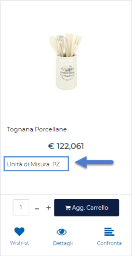

# PROMOZIONE -- GRUPPI

La sezione **Gruppi**, presente nella parte bassa della maschera,
consente di associare uno o più gruppi utente alla Promozione in esame,
definendo, quindi, quali utenti potranno o meno beneficiarne.

Nel box sulla sinistra sono visualizzati tutti i gruppi utente
codificati all'interno della corrispondente sezione del Wizard (per
maggiori informazioni in merito si veda la sezione "*Utenti -- Gruppi
Utenti Sito*" di questo manuale). Per associare un gruppo utente alla
Promozione è sufficiente selezionarlo dall'elenco di sinistra ed
inserirlo in quello di destra cliccando sul pulsante raffigurante una
piccola freccia rivolta verso destra.

Allo stesso modo per eliminare l'associazione "Gruppo Utente --
Promozione", sarà sufficiente selezionare il gruppo desiderato
dall'elenco di destra ed eliminare l'associazione cliccando sul pulsante
raffigurante una piccola freccia rivolta verso sinistra.

**Una volta associato quindi un gruppo di utenti alla Promozione,
potranno beneficiarne solo ed esclusivamente gli utenti appartenenti a
quello stesso gruppo**.

**ATTENZIONE!** Nel caso in cui alla Promozione non venga associato
alcun gruppo, questa potrà essere applicata (con i relativi limiti) ad
un qualsiasi utente del sito.

