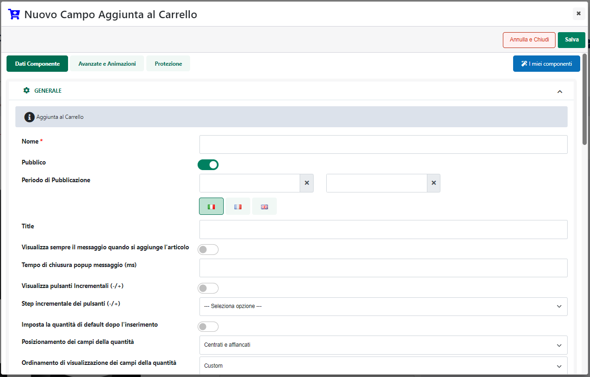
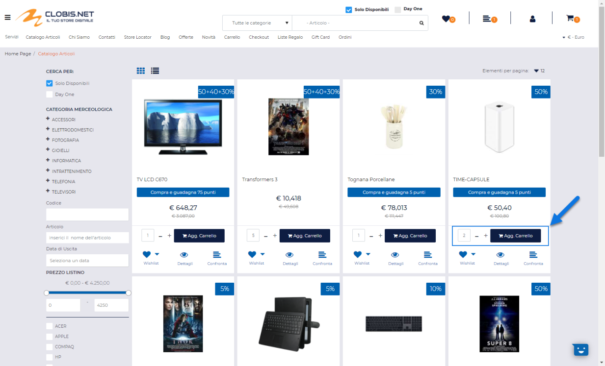

# LISTA DELLE PROMOZIONI

All'interno della maschera "**Lista delle Promozioni**", accessibile
dalla voce di menu principale "**Ordini -- Configurazione Promozioni -
Promozioni**", è possibile visualizzare e gestire le Promozioni
codificate all'interno del gestionale e correttamente esportate sul
sito.

Sono gestite le seguenti tipologie di promozioni:

- **Sconto Articolo / Prezzo Fisso**

- **Sconto Articolo Quantità**

- **Sconto Cliente**

- **Offerta M x N Semplice**

- **Offerta M x N Articoli Misti**

Il campo di ricerca attivabile cliccando sulla lente di ingrandimento,
presente in testata in corrispondenza del campo "Nome", consente di
filtrare i dati in griglia sulla base dei valori presenti all'interno
della colonna stessa.

Una volta impostato un filtro di ricerca, per poterlo poi eliminare sarà
sufficiente cliccare sull'icona raffigurante una piccola lente di
ingrandimento con un -- all'interno (
 ) che comparirà in testata alla colonna
in corrispondenza della quale è stato impostato il filtro stesso.

Infine è anche possibile ordinare, in maniera crescente e/o decrescente,
gli elementi in griglia cliccando semplicemente sull'icona raffigurante
due piccole frecce posta anch' essa in testata ad ogni singola colonna
della griglia (
 )

All'interno dell'elenco sono evidenziate in:

- **Rosso**: le Promozioni Scadute (la cui data di fine gestione è cioè
  inferiore alla data odierna)

- **Grassetto**: le Promozioni attive e (se non scadute) effettivamente
  utilizzabili all'interno del sito

Per ogni Promozione presente in elenco è indicata inoltre:

- la Data di Inizio gestione

- la Data di Fine gestione

- il suo livello di priorità.

**ATTENZIONE! Data di Inizio / Fine gestione e Priorità della
Promozione, possono essere impostate solo ed esclusivamente all'interno
del gestionale**

I pulsanti presenti nella barra degli strumenti consentono
rispettivamente di:

**Attiva Promozione**
( )**:** consente di attivare la Promozione
attualmente selezionata.

**Disattiva Promozione**
( )**:** consente di disattivare la
Promozione attualmente selezionata.

**ATTENZIONE!** Tutte le Promozioni esportate dal gestionale sono,
inizialmente, disattivate. Ciascuna di esse andrà quindi attivata ed
eventualmente configurata nella maniera corretta, prima di poterla
effettivamente applicare ed utilizzare anche all'interno del sito.

**Modifica Promozione**
( )**:** consente di modificare la
configurazione della Promozione attualmente selezionata.

I campi "**Nome**" e "**Tipologia**", presenti all'interno della
maschera di dettaglio della promozione, consentono di visualizzare
rispettivamente il Nome e la Tipologia impostate per la promozione in
esame all'interno del gestionale Ho.Re.Ca.

