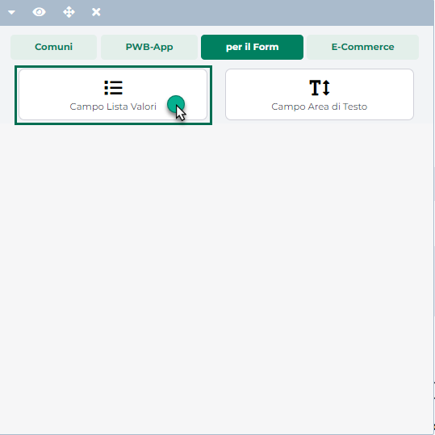

# OFFERTA M X N ARTICOLI MISTI

Questo tipo di Promozione si differenzia da quella descritta all'interno
del precedente capitolo (Offerta M x N Semplice) per il fatto che il
programma non crea più un'offerta M x N diversa per ogni articolo
coinvolto ma, al contrario, tutti gli articoli coinvolti faranno parte
sempre della stessa Promozione.

Ciò significa dunque che, in queste condizioni, l'utente potrà scegliere
M qualsiasi degli articoli coinvolti nella promozione per aver diritto
allo sconto (mentre nel caso precedente si dovevano per forza di cose
acquistare M articoli uguali per poter ottenere il diritto allo sconto).

E' possibile mettere in promozione singoli articoli (Tabella "**Articoli
in Promozione**") oppure intere categorie di articoli (Tabella
**"Articoli appartenenti alle categorie"**)

{width="5.019444444444445in"
height="3.1881944444444446in"}

**ATTENZIONE!** Nel caso in cui gli articoli coinvolti abbiano tutti gli
stessi prezzi, la Promozione si comporterà esattamente come la M x N
Semplice.

Nel caso in cui, invece, gli articoli abbiano prezzi diversi, le
modalità di applicazione dello sconto saranno dettate da quanto
impostato per i parametri "**Articoli in omaggio"**, **"Criteri di
scelta articoli in omaggio"** e **"Sconto articoli Valore o %".**

{width="5.019444444444445in"
height="3.1881944444444446in"}

In particolare il parametro:

**Criterio scelta articoli omaggio:** permette di definire se devono
essere omaggiati/scontati gli articoli che costano di più oppure quelli
che costano di meno. E' possibile selezionare uno dei seguenti valori:

- **Articoli Prezzo Inferiore:** selezionando questa opzione lo sconto
  da applicare verrà calcolato prendendo in considerazione, tra gli
  articoli coinvolti nella promozione, quello a prezzo inferiore

- **Articoli Prezzo Superiore:** selezionando questa opzione lo sconto
  da applicare verrà calcolato prendendo in considerazione, tra gli
  articoli coinvolti nella promozione, quello a prezzo più elevato

**ATTENZIONE! Sul sito, indipendentemente dal fatto di considerare
articoli gestiti con unità di misura uguale o diversa da pz, lo sconto
verrà calcolato sempre e comunque prendendo in considerazione l'articolo
a prezzo inferiore/superiore.**

Per maggiori informazioni relativamente all'applicazione di questa
promozione lato gestionale, soprattutto nel caso in cui gli articoli in
ordine siano gestiti con unità di misura diversa da pz si veda il
relativo manuale di prodotto.

**Articoli omaggio:** permette di definire se lo sconto applicato agli
articoli oggetto della promozione dovrà essere sempre lo stesso
indipendentemente da quello che possa essere l'articolo che verrà poi
effettivamente scontato/omaggiato oppure se dovrà essere diverso
articolo per articolo. E' possibile selezionare uno dei seguenti valori:

- **Tutti:** selezionando questa opzione lo sconto da applicare agli
  articoli che, in base alla promozione, dovranno essere effettivamente
  scontati/omaggiati, **sarà sempre lo stesso**. Il successivo parametro
  "**Percentuale / Valore**" permetterà di decidere se tale sconto dovrà
  essere applicato in percentuale oppure a valore oltre che, ovviamente,
  impostare l'esatta percentuale / valore dello sconto.

{width="5.019444444444445in"
height="3.1881944444444446in"}

> Nelle condizioni evidenziate in figura, ad esempio, acquistando 3
> articoli qualsiasi tra quelli coinvolti nella promozione (tabella
> "Scelta Manuale Articoli") a quello con prezzo inferiore ("Criterio
> scelta articoli in omaggio") verrà applicato uno sconto del 5% (campo
> "Percentuale") e questo indipendentemente da quale possa essere
> l'articolo con prezzo inferiore.

- **Selezione Manuale:** selezionando questa opzione lo sconto da
  applicare agli articoli che, in base alla promozione, dovranno essere
  effettivamente scontati/omaggiati, **dovrà essere definito sul singolo
  articolo e potrà quindi essere diverso a seconda del fatto che
  l'articolo da scontare sia uno oppure un altro.**

> In queste condizioni infatti il successivo parametro "**Percentuale /
> Valore**" permetterà di decidere solamente se considerare sconti in
> percentuale o a valore ma non sarà possibile indicare da qui la
> percentuale o il valore dello sconto, cosa questa che dovrà invece
> essere inserite sul singolo articolo o sulla singola categoria di
> articoli utilizzando per questo l'apposito campo (**Sconto
> %/Valore€**) presente all'interno delle tabelle "Scelta manuale
> articoli" e "Articoli appartenenti alle categorie"

{width="5.019444444444445in"
height="3.1881944444444446in"}

> Nelle condizioni evidenziate in figura, ad esempio, acquistando 3
> articoli qualsiasi tra quelli coinvolti nella promozione (tabella
> "Scelta Manuale Articoli") dipendentemente da quello che risulti
> essere l'articolo con prezzo inferiore ("Criterio scelta articoli in
> omaggio") potrà essere applicato uno sconto oppure un altro.
>
> Se ad esempio l'articolo a prezzo inferiore dovesse essere "Maschera
> Cocco", verrà applicato, ad esso, uno sconto del 50%. Se invece
> l'articolo a prezzo inferiore dovesse essere "Maschera
> pesca/albicocca" lo sconto ad esso applicato sarà del 100%.

In definitiva utilizzando correttamente questi parametri sarà possibile,
ad esempio, realizzare delle offerte del tipo "Compri 3 articoli, quello
con il prezzo inferiore viene regalato" oppure "Compri 3 articoli,
quello con prezzo inferiore lo paghi 1€".

**ATTENZIONE!** Il parametro **"Numero massimo applicazioni offerta"**
che, lato gestionale, consente di definire quante volte l'offerta possa
essere applicata prima che si disattivi in automatico, **non è
attualmente gestito all'interno del sito, dove la promozione potrà
quindi essere disattivata solo in maniera manuale oppure in base al suo
intervallo di validità.**

Dopo aver codificato questa Promozione ed averla esportata all'interno
del sito, prima di poterla effettivamente utilizzare sarà necessario,
ovviamente, attivarla e questo potrà essere fatto direttamente dalla
maschera "Lista delle Promozioni", selezionandola in elenco e cliccando
sul pulsante "**Attiva Promozione**" oppure agendo dal parametro
"**Attivo**" presente nella maschera di configurazione della Promozione
stessa.

{width="5.746527777777778in"
height="3.50625in"}

Il campo **Descrizione** presente all'interno della maschera di
configurazione della promozione consente di specificare, in tutte le
lingue attualmente gestite all'interno del sito, un testo descrittivo
della promozione in oggetto, testo questo che verrà poi mostrato
all'interno del componente "**Carrello Custom**" al verificarsi delle
seguenti condizioni:

- Il carrello non è vuoto

- La promozione in oggetto non è ancora stata applicata perché non sono
  ancora state soddisfatte le condizioni di applicabilità della
  promozione stessa definite all'interno del gestionale relativamente
  agli articoli e/o alle categorie di articoli coinvolte.

Il parametro in oggetto consente quindi di definire un testo mediante il
quale poter informare l'utente del sito che, al verificarsi di
specifiche condizioni (da dettagliare all'interno del testo stesso)
potrà beneficiare di determinate promozioni.

In questo senso, cliccando sul pulsante "**Aggiungi Segnaposto**", sarà
possibile inserire all'interno del testo il seguente placeholder:

- **Sconto**: consente di inserire all'interno del testo il segnaposto
  {discount} che verrà poi sostituito, sul front end del sito, dal
  valore dello sconto (in percentuale o in valuta) di cui l'utente potrà
  beneficiare al verificarsi delle condizioni di applicabilità della
  promozione in esame (promozione che dovrà ovviamente prevedere
  l'applicazione di un determinato sconto)

**ATTENZIONE! Gli sconti dovuti all'applicazione di questo tipo di
Promozioni verranno applicati, all'interno del sito, sempre e comunque a
livello di Carrello mediante l'inserimento di un relativo Abbuono**

{width="4.792361111111111in"
height="3.50625in"}

In queste condizioni non sarà ovviamente possibile visualizzare gli
sconti dovuti alla promozione ne in Catalogo ne tanto meno all'interno
delle varie schede prodotto.

L'Abbuono dovuto all'applicazione della Promozione verrà infatti
visualizzato soltanto in Carrello oltre che, ovviamente, in fase di
Checkout ordine.

Relativamente alle condizioni di applicabilità di questo tipo di
Promozioni occorre fare un'ulteriore considerazione molto importante.

**Nel caso in cui gli articoli coinvolti nella Promozione siano gestiti
con un unità di misura diversa da pz**, la promozione verrà applicata
sul sito, in maniera leggermente diversa a quanto avviene sul
gestionale.

In queste condizioni (articoli con unità di misura diversa da pz)
infatti la promozione verrà applicata, **sul gestionale**, solo nel
momento in cui all'interno del documento venissero inserite **righe
articolo distinte**. Il 3x2, ad esempio, potrà essere applicato solo se
nel conto cassa sono presenti 3 righe articolo distinte; non verrebbe
invece applicato se fosse presente una sola riga articolo con quantità
impostata a 3.

**Sul sito invece, in queste stesse condizioni,** la Promozione verrà
applicata semplicemente nel momento in cui la quantità sulla singola
riga articolo soddisfa quanto indicato per la promozione, come del resto
avverrà anche per articoli gestiti con unità di misura uguale a pz.

Sul sito infatti non è possibile creare più righe distinte per lo stesso
articolo in ordine; aggiungendo in carrello, anche in momenti diversi,
lo stesso articolo verrà sempre incrementata la quantità attualmente
presente sulla stessa, singola, riga articolo.

Lato gestionale, infine, nel momento in cui si andrà a caricare, in
cassa, l'ordine nato all'interno del sito web, lo sconto, dovuto alla
promozione e **applicato sul sito a livello di Carrello** mediante un
relativo **Abbuono,** verrà riportato all'interno del campo **Sconto**

{width="5.279166666666667in"
height="3.5256944444444445in"}

**ATTENZIONE!** Le Promozioni di tipo **Offerte M x N Articoli Misti**
sono considerate tra l'elenco delle Promozioni da poter escludere nel
caso di applicazione di eventuali Buoni Sconto.

Ciò significa dunque che nel momento in cui un dato utente dovesse
trovarsi applicata questo tipo di promozione, e fosse anche in possesso
di un Codice Sconto ancora valido, potrebbe essere possibile fare in
modo che l'applicazione del Buono Sconto annulli automaticamente
l'applicazione della Promozione.

Per maggiori informazioni sull'utilizzo dei Buoni Sconto e sulla
possibilità di escludere o meno determinate promozioni all'applicazione
dei Buoni Sconto si veda anche il capitolo "*Ordini -- Configurazione
Promozioni -- Buoni Sconto*" di questo manuale.

