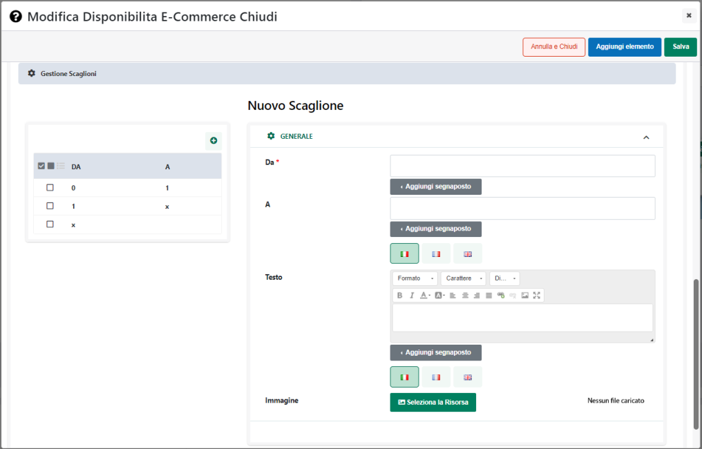

# AGGIUNGI ARTICOLI IN CARRELLO

Impostando il parametro **Azione** sul valore **"Aggiungi articoli in
carrello"** il buono sconto si espliciterà mediante l'inserimento
automatico in carrello di determinati articoli.

**ATTENZIONE!** Prima di poter definire l'elenco di articoli che, al
verificarsi delle condizioni di applicabilità, dovranno essere aggiunti
in ordine come articoli omaggio, è necessario effettuare almeno un
salvataggio del Buono Sconto in esame.

Una vota salvato il Buono Sconto si attiverà infatti, come mostrato in
figura, un nuovo pulsante mediante il quale poter indicare esattamente
l'articolo / gli articoli che dovranno essere inseriti automaticamente
in carrello al verificarsi delle condizioni di applicabilità.

Cliccando su questo pulsante verrà infatti visualizzata la maschera
"**Articolo**"

all'interno della quale poter indicare:

- **Impostazione Articolo:** consente di stabilire quali articoli
  dovranno essere aggiunti in ordine al verificarsi delle condizioni di
  applicabilità del Buono Sconto.

> E' possibile selezionare uno dei seguenti valori:

- **Articolo Condizione:** selezionando questa opzione, nel momento in
  cui le condizioni di applicabilità del Buono Sconto dovessero essere
  valide, verranno automaticamente aggiunti in ordine gli stessi
  articoli che hanno soddisfatto le condizioni di applicabilità in esame

> Supponendo, ad esempio, di impostare una condizione tale per cui il
> Buono Sconto venga validato solo nel caso in cui siano presenti in
> ordine articoli della categoria "Stampanti", quando poi l'utente andrà
> ad inserire il proprio codice sconto e, in carrello, dovesse essere
> presente ad esempio, l'articolo "Stampante Canon X23" il Buono Sconto
> verrà validato e verrà automaticamente aggiunto all'ordine (in una
> riga diversa) lo stesso articolo "Stampante Canon X23" che ha
> determinato la validazione del Buono Sconto.
>
> **ATTENZIONE**! **In queste condizioni è necessario impostare, per
> ovvie ragioni, almeno una condizione di applicabilità del Buono
> Sconto. In caso contrario infatti non sarebbe possibile determinare
> quali articoli dovrebbero essere inserito automaticamente in ordine**.
>
> Nel caso in cui l'articolo da aggiungere come omaggio dovesse essere
> un articolo a taglie, questo verrà aggiunto con la stessa taglia dell'
> articolo attualmente presente in carrello in quantità maggiore. Se poi
> in carrello dovessero essere già presenti, per l'articolo oggetto del
> Buono Sconto, più taglie differenti con la stessa quantità allora la
> taglia dell'articolo omaggio verrà determinata sulla base di un
> criterio di ordinamento interno a Passweb.

- **Articolo Economico:** selezionando questa opzione, l'articolo
  aggiunto automaticamente sarà, di base, quello più economico tra tutti
  quelli attualmente presenti in carrello.

> Il successivo campo "**Numero Ordinale**" consente in realtà di
> stabilire se l'articolo aggiunto automaticamente in carrello dovrà
> essere effettivamente il più economico oppure il secondo più
> economico, il terzo più economico ...
>
> **ATTENZIONE!** in fase di valutazione dell'articolo più economico non
> verranno prese in considerazione eventuali condizioni di applicabilità
> del Buono Sconto.
>
> In conseguenza di ciò, se anche dovessimo aver impostato una
> condizione del tipo "**Sconto in Riga = 'Stringa vuota'**" (campo
> "**Filtro Carrello**") e l'articolo più economico attualmente presente
> in carrello dovesse essere un articolo con uno sconto già applicato,
> sarebbe comunque questo ad essere aggiunto automaticamente in
> carrello.
>
> Si ricorda inoltre che nel caso in cui dovesse essere presente, in
> carrello, un articolo di tipo Campionario, in fase di valutazione
> dell'articolo più economico verrà considerato l'articolo Campionario
> in sé piuttosto che i suoi componenti dipendentemente da come è stato
> impostato il parametro "**Gestione articoli Box**" alla pagina
> "**Configurazione Catalogo**" del Wizard.
>
> Infine nel momento in cui l'articolo da aggiungere automaticamente in
> carrello dovesse risultare essere un articolo a taglie, questo verrà
> aggiunto con la taglia che ha la quantità più alta in carrello. Se poi
> in carrello dovessero essere presenti, per l'articolo oggetto della
> promozione, più taglie differenti con la stessa quantità allora la
> taglia dell'articolo omaggio verrà determinata sulla base di un
> criterio di ordinamento interno a Passweb

- **Altro Articolo:** selezionando questa opzione, sarà poi necessario
  indicare, all'interno del successivo campo "**Articolo**" lo specifico
  prodotto che dovrà essere aggiunto automaticamente in ordine al
  verificarsi delle condizioni di applicabilità del Buono Sconto

- **Filtro Articoli**: selezionando questa opzione sarà poi necessario
  indicare all'interno del successivo campo "**Filtro articoli**" il
  filtro che consente di determinare in maniera dinamica l'articolo o
  gli articoli che dovranno essere aggiunti in ordine al verificarsi
  delle condizioni di applicabilità del Buono Sconto

- **Articolo**: visualizzato solo nel caso in cui il parametro
  "**Impostazione Articolo**" sia stato settato sul valore "**Altro
  Articolo**".

> Consente di indicare l'articolo che dovrà essere aggiunto
> automaticamente in ordine al verificarsi delle condizioni di
> applicabilità del Buono Sconto.
>
> Il campo è ad autocompletamento ed è possibile indicare al suo interno
> il codice dell'articolo, la sua descrizione, o parte di essi. In ogni
> caso, infatti, dopo aver inserito almeno 3 caratteri l'applicazione
> proporrà in automatico, tra tutti gli articoli attualmente gestiti sul
> sito, quelli che presentano nel loro codice e/o nella loro descrizione
> la stringa indicata.
>
> **ATTENZIONE!** Nel momento in cui all'articolo da aggiungere
> automaticamente in carrello dovesse essere associato un determinato
> Set di Opzioni (cosa questa che, di base, dovrebbe essere evitata),
> indipendentemente dal fatto poi che tali opzioni siano o meno
> obbligatorie, l'articolo verrà comunque aggiunto in carrello senza
> nessuna opzione.

- **Numero Ordinale**: visualizzato solo nel caso in cui il parametro
  "**Impostazione Articolo**" sia stato settato sul valore "**Articolo
  Economico**".

> Consente di stabilire esattamente il numero dell'articolo più
> economico che dovrà essere aggiunto automaticamente in carrello.
> Supponendo, ad esempio, di inserire in corrispondenza del campo
> "**Numero Ordinale**" il valore 1 quello aggiunto automaticamente in
> carrello sarà effettivamente l'articolo più economico. Nel caso in
> cui, invece, il parametro in esame dovesse essere impostato sul valore
> 2 quello aggiunto automaticamente sarebbe il secondo articolo più
> economico tra quelli attualmente presenti in carrello.
>
> **ATTENZIONE!** nel momento in cui il campo "**Numero Ordinale**"
> dovesse essere impostato **su di un valore diverso da 1**, nel
> valutare quello che è l'articolo da aggiungere automaticamente in
> carrello verrà considerato non solo il prezzo dei singoli articoli ma
> anche la quantità con cui questi stessi articoli sono effettivamente
> presenti in carrello.
>
> Supponendo dunque di avere in carrello una situazione del tipo di
> quella di seguito indicata
>
> ART1 -- Prezzo 10€ -- Quantità 2
>
> ART2 -- Prezzo 15€ -- Quantità 1
>
> ART3 -- Prezzo 20€ -- Quantità 1
>
> e di aver impostato il campo "Numero Ordinale" sul valore 2, allora
> l'articolo aggiunto automaticamente in carrello sarebbe comunque ART1.
>
> Considerando infatti che questo articolo è presente in quantità due,
> l'articolo più economico sarebbe ovviamente ART1 ma anche il secondo
> articolo più economico, tra quelli sopra indicati, sarebbe comunque
> sempre ART1

- **Filtro articoli**: visualizzato solo nel caso in cui il parametro
  "**Impostazione Articolo**" sia stato settato sul valore "**Filtro
  Articoli**"

> Consente di impostare il filtro che dovrà determinare in maniera
> dinamica l'articolo o gli articoli da aggiungere automaticamente in
> ordine al verificarsi delle condizioni di applicabilità del Buono
> Sconto.
>
> Per maggiori informazioni relativamente alla creazione di un filtro
> articoli si veda anche la sezione *"Utenti -- Gruppi Utenti Sito --
> Filtri Utente e Filtri Articolo -- Filtri Articolo"* di questo
> manuale.

- **Taglia**: visualizzato solo nel caso in cui il parametro
  "**Impostazione Articolo**" sia stato settato sul valore "**Altro
  Articolo**" e l'articolo da aggiungere in carrello sia un articolo a
  Taglie.

> All'interno di questo campo è quindi possibile indicare esattamente la
> specifica taglia che, al verificarsi delle condizioni di applicabilità
> del Buono Sconto, verrà automaticamente aggiunta in ordine.

- **Sconto:** consente di specificare lo sconto che dovrà essere
  applicato all'articolo aggiunto automaticamente in ordine al
  verificarsi delle condizioni di applicabilità del Buono Sconto.

> **ATTENZIONE!** Tipicamente questo genere di sconti prevede, al
> verificarsi di determinate condizioni, l'inserimento in carrello di
> articoli in omaggio. **In conseguenza di ciò all'interno di questo
> campo andrebbe indicato lo sconto merce (100 -- 109) o lo sconto
> omaggio con rivalsa iva (130 -- 139).**
>
> Per maggiori informazioni su come gestire, lato gestionale, questa
> particolare tipologia di sconti si rimanda al relativo manuale.
>
> In ogni caso, come evidenziato nel tooltip informativo, è comunque
> possibile inserire all'interno di questo campo una qualsiasi delle
> tipologie di sconto gestite all'interno del gestionale, dal normale
> sconto a valore, a quello in percentuale a quelli in cascata ecc...
>
> Nel momento in cui si dovesse, ad esempio, inserire all'interno di
> questo campo il valore 50, al verificarsi delle condizioni di
> applicabilità del Buono Sconto il relativo articolo verrà
> automaticamente aggiunto in ordine NON in omaggio ma con uno sconto
> del 50%

- **Operatore**: consente di indicare un eventuale operatore da
  utilizzare nella determinazione della quantità con cui l'articolo
  indicato dovrà essere inserito in ordine al verificarsi delle
  condizioni di applicabilità del Buono Sconto.

> E' possibile selezionare uno dei seguenti valori:

- **Nessuno:** in questo caso non verrà utilizzato nessun operatore per
  cui l'articolo indicato verrà automaticamente aggiunto in ordine, al
  verificarsi delle condizioni di applicabilità del Buono Sconto,
  esattamente nella quantità indicata all'interno del successivo campo
  **Quantità**

- **((Quantità Prodotti Selezionati) / (Quantità)) x Quantità Y:** in
  questo caso la quantità dell'articolo da inserire automaticamente in
  ordine sarà determinata **dividendo** la quantità complessiva degli
  articoli già presenti in carrello, e che soddisfano il filtro articoli
  impostato nelle condizioni di applicabilità del Buono Sconto, per il
  valore inserito nel successivo campo **Quantità.** Il risultato
  ottenuto verrà poi moltiplicato per il valore inserito nel successivo
  campo "**Quantità Y**"

> **ATTENZIONE!** Il risultato della divisione verrà sempre arrotondato
> per difetto

- **(Quantità Prodotti Selezionati) x (Quantità):** in questo caso la
  quantità dell'articolo da inserire automaticamente in ordine sarà
  determinata **moltiplicando** la quantità complessiva degli articoli
  già presenti in carrello, e che soddisfano il filtro articoli
  impostato nelle condizioni di applicabilità del Buono Sconto, per il
  valore inserito nel successivo campo **Quantità**.

- **(Quantità Prodotti Selezionati) / (Quantità):** in questo caso la
  quantità dell'articolo da inserire automaticamente in ordine sarà
  determinata **dividendo** la quantità complessiva degli articoli già
  presenti in carrello, e che soddisfano il filtro articoli impostato
  nelle condizioni di applicabilità del Buono Sconto, per il valore
  inserito nel successivo campo **Quantità**

> **ATTENZIONE!** Il risultato della divisione verrà sempre arrotondato
> per difetto

- **(Elementi Prodotti Selezionati) x (Quantità):** in questo caso la
  quantità dell'articolo da inserire automaticamente in ordine sarà
  determinata **moltiplicando** il numero delle righe degli articoli in
  carrello che soddisfano la condizione impostata sulla promozione per
  il valore inserito nel successivo campo **Quantità**

> **ATTENZIONE!** Nel momento in cui il precedente parametro
> "**Impostazioni Articolo**" dovesse essere settato sul valore
> "**Articolo Condizione**" la "**Quantità Prodotti Selezionati**" farà
> riferimento alla quantità di riga di ogni prodotto presente in
> carrello.
>
> In tutti gli latri casi invece la "Quantità Prodotti selezionati"
> continuerà a fare riferimento (come indicato sopra) alla quantità
> complessiva dei prodotti in carrello
>
> **ATTENZIONE**! Nel caso in cui si decida di utilizzare l'operatore di
> moltiplicazione o quello di divisione è necessario aver impostato,
> nelle condizioni di applicabilità del Buono Sconto, un filtro articoli
> (necessario per individuare esattamente, tra gli articoli presenti in
> carrello, quelli la cui quantità dovrà essere moltiplicata / divisa
> per il valore inserito nel successivo campo "Quantità"). In caso
> contrario non sarà possibile determinare la quantità con cui inserire
> in ordine l'articolo indicato che, quindi, non verrà mai aggiunto.

- **Quantità:** consente di impostare il valore da utilizzare,
  coerentemente con quanto impostato per il precedente campo, nella
  determinazione della quantità con cui inserire automaticamente in
  ordine, al verificarsi delle condizioni di applicabilità del Buono
  Sconto, l'articolo indicato.

> Per meglio comprendere il significato e l'utilizzo degli ultimi due
> campi appena esaminati, consideriamo ora un paio di semplici esempi.
>
> **[ESEMPIO 1]{.underline}**: **Acquistando almeno un articolo della
> categoria "Informatica" ottengo in omaggio il film "Capitan America"
> (cod. Prodotto PROD63A)**
>
> Per poter implementare questo tipo di Buono Sconto sarà necessario,
> per prima cosa, impostare sul Buono Sconto una condizione con un
> filtro articoli sulla categoria "Informatica", in maniera tale da
> garantire che solo nel caso in cui sia presente in carrello un
> prodotto di questa categoria il codice sconto possa essere
> correttamente validato.
>
> Una volta impostata questa condizione sarà poi necessario configurare
> la sezione "Azioni" come mostrato in figura

> I parametri "**Azione**" impostati sul valore "**Aggiungi Articoli in
> Carrello**" e "**Impostazione Articolo**" sul valore "**Altro
> Articolo**" ci permettono di esplicitare il Buono Sconto mediante
> l'aggiunta automatica in ordine di determinati articoli, indicati in
> maniera esplicita.
>
> Il parametro "Articolo" impostato sul valore PORD63A (corrispondente
> effettivamente al film "Capitan America") ci dice quale articolo
> aggiungere in carrello.
>
> Tale articolo è configurato inoltre per essere aggiunto in carrello
> con uno sconto del 100% (sconto merce) e sempre e soltanto in quantità
> 1, indipendentemente dal numero e/o dalla quantità dei prodotti della
> categoria "Informatica" già presenti in carrello.
>
> Il parametro "Operatore" infatti è impostato sul valore "Nessuno" per
> cui l'articolo in esame verrà inserito in ordine sempre nell'esatta
> quantità indicata all'interno del campo "Quantità"
>
> **[ESEMPIO 2]{.underline}: Per ogni materasso acquistato ottengo in
> omaggio 2 cuscini (cod. Prodotto PROD01B)**
>
> Per poter implementare questo tipo di Buono Sconto sarà necessario,
> per prima cosa, impostare sul Buono Sconto una condizione con un
> filtro articoli sulla categoria "Materassi", in maniera tale da
> garantire che il codice sconto in esame venga correttamente validato
> solo nel momento in cui l'utente inserirà in carrello almeno un
> articolo di questa categoria.
>
> In questo caso inoltre la quantità dell'articolo da inserire come
> omaggio (il cuscino) dipende direttamente dalla quantità dei prodotti
> già presenti in carrello che soddisfano il filtro articoli impostato.
> Mettendo dunque in carrello un materasso l'utente dovrà ricevere 2
> cuscini in omaggio, mettendo invece in carrello 3 distinti materassi,
> o lo stesso materasso in quantità 3, dovrà ricevere in omaggio 6
> cuscini ( 2 per ogni materasso).
>
> Per poter ottenere questo risultato sarà quindi necessario configurare
> la sezione "Azioni" come mostrato in figura

> Anche in questo caso i parametri "**Azione**" impostati sul valore
> "**Aggiungi Articoli in Carrello**" e "**Impostazione Articolo**" sul
> valore "**Altro Articolo**" ci permettono di esplicitare il Buono
> Sconto mediante l'aggiunta automatica in ordine di determinati
> articoli, indicati in maniera esplicita.
>
> Il parametro "Articolo" impostato sul valore PORD01B (corrispondente
> effettivamente al cuscino) ci dice quale articolo aggiungere in
> carrello.
>
> Tale articolo è configurato inoltre per essere aggiunto in carrello
> con uno sconto del 100% (sconto merce) e in una quantità che dipende
> direttamente dalle quantità degli articoli già presenti in carrello e
> che soddisfano il filtro articoli impostato sulla condizione della
> Promozione.
>
> Il parametro "Operatore" infatti è impostato sul valore "(Quantità
> Prodotti Selezionati) X (Quantità)" per cui l'effettiva quantità di
> cuscini da inserire come omaggio sarà determinata moltiplicando la
> quantità di materassi presenti in carrello per il valore inserito nel
> successivo campo "Quantità".
>
> Supponendo dunque che l'utente abbia inserito in carrello un solo
> materasso ma in quantità 3, il numero complessivo di cuscini in
> omaggio sarà esattamente (3X2) = 6
>
> Allo stesso modo nel caso in cui l'utente inserisca in carrello 3
> distinti materassi ciascuno in quantità 1, il numero complessivo di
> cuscini in omaggio sarà (1+1+1)X2=6

Volendo è anche possibile importare gli articoli che dovranno essere
inseriti automaticamente in carrello al verificarsi delle condizioni di
applicabilità del Buono Sconto, e i relativi parametri di
configurazione, in maniera massiva, senza dunque operare un articolo
alla volta, ma importando un apposito file contente tutti i dati
necessari.

In questo senso i due pulsanti presenti nella barra degli strumenti
consentono rispettivamente di:

- **Importa** (
   ): consente di importare in maniera
  massiva un elenco di tutti gli articoli, con i relativi parametri di
  configurazione che dovranno essere inseriti in carrello al verificarsi
  delle condizioni di applicabilità del Buono Sconto.

> Cliccando su questo pulsante verrà infatti visualizzata la maschera
> **"Importa Valori"**

> all'interno della quale poter indicare:

- **File (csv-txt)**: consente di selezionare il file txt o csv
  contenente l'elenco degli articoli con i relativi parametri di
  configurazione

- **Lingua:** consente di indicare la lingua del sito a cui dovranno
  fare riferimento i dati indicati all'interno del file di importazione

- **Separatore:** consente di indicare, selezionandolo, dall'apposito
  menu a tendina, il carattere che è stato utilizzato all'interno del
  file di importazione come separatore per i vari campi

> Il check **"Elimina valori non presenti nel file"** consente, se
> selezionato, di eliminare automaticamente eventuali codici articolo
> attualmente presenti in elenco ma non dichiarati nel file che si
> desidera importare.
>
> Affinchè la procedura di importazione possa funzionare in maniera
> corretta è necessario, ovviamente, che il file in oggetto soddisfi
> determinate specifiche. In particolare:

- Il file dovrà avere estensione .csv o .txt

- Il carattere separatore dei vari campi deve essere esattamente quello
  indicato all'interno del campo "**Separatore**" presente nel form di
  importazione

- L'intestazione, ossia la prima riga del file, deve contenere **i campi
  di seguito indicati nell'ordine indicato e con le diciture indicate**:

> Codice, Taglia, Sconto, Quantita, Operatore
>
> Considerata l'intestazione del file, ogni suo record dovrà ovviamente
> contenere le seguenti informazioni:
>
> **Codice Articolo:** codice dell'articolo che dovrà essere inserito in
> carrello al verificarsi delle condizioni di applicabilità del Buono
> Sconto. **Obbligatorio**
>
> **Taglia:** Taglia con cui l'articolo indicato nel campo precedente
> dovrà essere inserito in carrello. **Obbligatorio solo per articoli
> gestiti a taglie** e indicato nella lingua di importazione del file
> (specificata nel successivo campo "Lingua di riferimento")
>
> **Sconto:** sconto che dovrà essere applicato all'articolo inserito in
> carrello. **Opzionale.** Nel caso in cui per un determinato articolo
> non venga indicato nessuno sconto questo verrà inserito
> automaticamente in carrello al verificarsi delle condizioni di
> applicabilità del Buono Sconto a prezzo pieno
>
> **Quantita:** quantità con cui l'articolo dovrà essere inserito in
> carrello al verificarsi delle condizioni di applicabilità del Buono
> Sconto. **Opzionale.** Nel caso in cui non venga indicata
> esplicitamente una quantità verrà considerata a default la quantità 1
>
> **Operatore:** operatore da utilizzare nella determinazione della
> quantità con cui l'articolo dovrà essere inserito in carrello al
> verificarsi delle condizioni di applicabilità del Buono Sconto.
> **Opzionale.** Può assumere i seguenti valori:

- **Campo Vuoto**: non verrà considerato nessun operatore per cui la
  quantità con cui inserire l'articolo in carrello sarà esattamente
  quella indicata in corrispondenza del campo Quantità

- **x**: in questo caso la quantità dell'articolo da inserire
  automaticamente in ordine sarà determinata **MOLTIPLICANDO** la
  quantità complessiva degli articoli già presenti in carrello, e che
  soddisfano il filtro articoli impostato nelle condizioni di
  applicabilità del Buono Sconto, per il valore inserito in
  corrispondenza del campo **Quantità**.

- **/**: in questo caso la quantità dell'articolo da inserire
  automaticamente in ordine sarà determinata **DIVIDENDO** la quantità
  complessiva degli articoli già presenti in carrello, e che soddisfano
  il filtro articoli impostato nelle condizioni di applicabilità del
  Buono Sconto, per il valore inserito in corrispondenza del campo
  **Quantità**.

> In definitiva dunque, supponendo di voler utilizzare come carattere
> separatore il ; il file da importare dovrà avere una struttura del
> tipo di quella indicata
>
> **CODICE;TAGLIA;SCONTO;QUANTITA;OPERTORE**
>
> **Prod01A;xl;-10;2;**
>
> **Prod02A;;5;2;x**
>
> **Prod03A;s;25;2;/**
>
> **...**

- Il file di importazione deve soddisfare le specifiche del formato
  RFC4180.

> In questo senso è quindi necessario che il valore dei campi contenenti
> interruzioni di riga, doppi apici e/o lo stesso carattere utilizzato
> anche come separatore sia necessariamente racchiuso da virgolette
>
> Infine, nel caso in cui nel file da importare siano stati dichiarati
> articoli già presenti in elenco, i relativi valori verranno
> sovrascritti con quanto indicato per questi stessi articoli
> all'interno del file di importazione.

- **Esporta**
  ( ): consente di esportare l'attuale
  elenco di articoli che verranno aggiunti in carrello al verificarsi
  delle condizioni di applicabilità del Buono Sconto all'interno di un'
  apposito file .csv.

> Cliccando su questo pulsante verrà infatti visualizzata la maschera
> **"Esporta Valori"**

> all'interno della quale poter indicare:

- **Lingua:** consente di indicare la lingua del sito a cui dovranno
  fare riferimento i dati indicati all'interno del file di esportazione

- **Separatore:** consente di indicare, selezionandolo, dall'apposito
  menu a tendina, il carattere che dovrà essere utilizzato all'interno
  del file di esportazione come separatore per i vari campi

