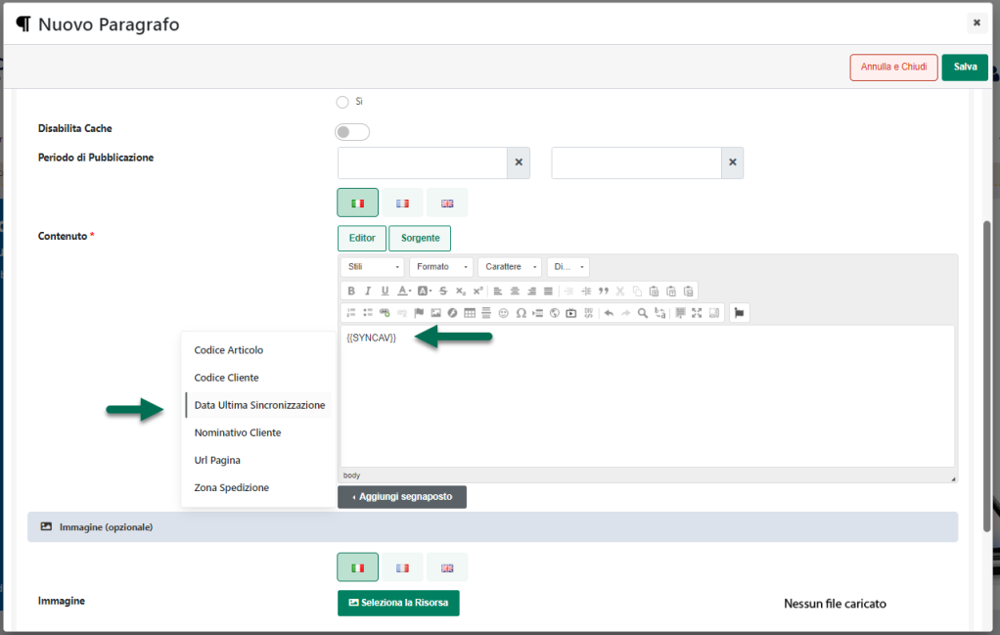
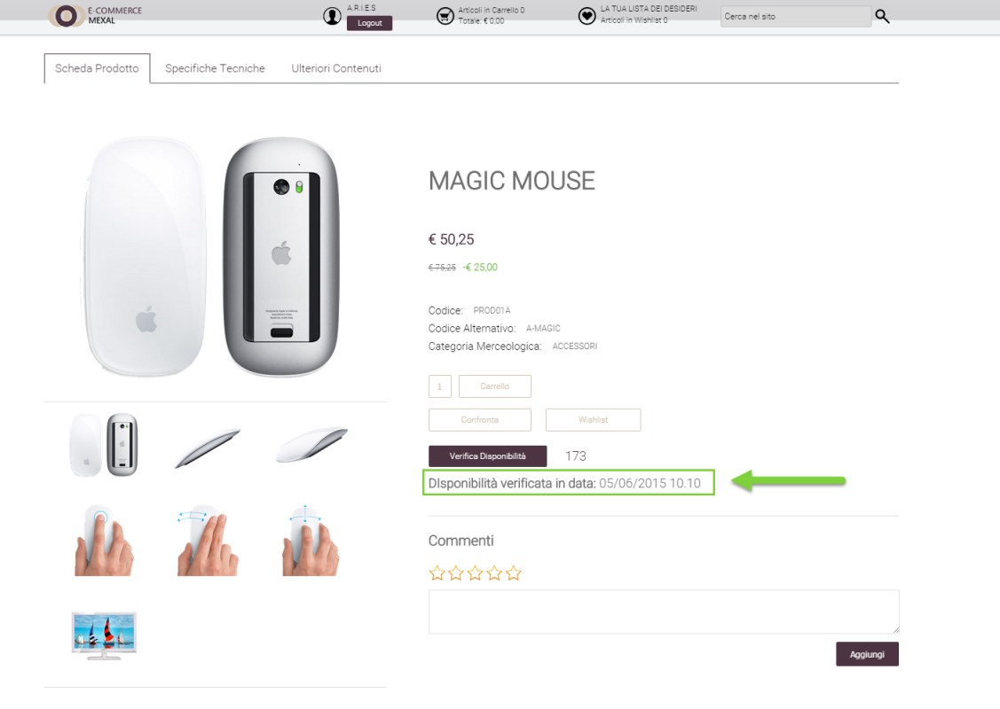

# SCEGLI ARTICOLI IN CARRELLO

Impostando il parametro **Azione** sul valore **"Scegli Articoli in
Carrello"** il Buono Sconto si espliciterà nella possibilità da parte
dell'utente di scegliere tra una lista di articoli predefiniti, quali
poter aggiungere gratuitamente (o a condizioni particolari) in Ordine.

Il parametro **"Numero Articoli da scegliere**" consente di impostare il
numero esatto di articoli che l'utente potrà selezionare tra quelli
elencati

**ATTENZIONE!** Prima di poter definire l'elenco di articoli tra cui
l'utente potrà scegliere è necessario effettuare almeno un salvataggio
del Buono Sconto in esame.

Una vota salvato il Buono Sconto si attiverà infatti, come mostrato in
figura, un nuovo pulsante mediante il quale poter definire l'elenco di
articoli tra cui l'utente potrà scegliere quali inserire in ordine alle
condizioni particolari per essi definite.

Cliccando su questo pulsante verrà infatti visualizzata la maschera
"**Articolo**"

all'interno della quale poter indicare:

- **Impostazione Articolo:** consente di stabilire quali dovranno essere
  gli articoli che l'utente potrà selezionare ed aggiungere in ordine al
  verificarsi delle condizioni di applicabilità del Buono Sconto. E'
  possibile selezionare uno dei seguenti valori:

  - **Articolo Condizione:** selezionando questa opzione, l'articolo
    aggiunto tra l'elenco di quelli che l'utente potrà selezionare come
    "Omaggio", sarà esattamente lo stesso che ha soddisfatto le
    condizioni di applicabilità del Buono Sconto.

> Supponendo, ad esempio, di impostare una condizione tale per cui il
> Buono Sconto venga validato solo nel caso in cui siano presenti in
> ordine articoli della categoria "Stampanti", quando poi l'utente andrà
> ad inserire il proprio codice sconto e, in carrello, dovesse essere
> presente ad esempio, l'articolo "Stampante Canon X23" il Buono Sconto
> verrà validato e verrà automaticamente aggiunto all'ordine (in una
> riga diversa) lo stesso articolo "Stampante Canon X23" che ha
> determinato la validazione del Buono Sconto.
>
> **ATTENZIONE! In queste condizioni è necessario impostare, per ovvie
> ragioni, almeno una condizione di applicabilità della promozione. In
> caso contrario infatti non sarebbe possibile determinare quale
> articolo dovrebbe essere inserito in carrello.**
>
> Nel caso in cui l'articolo da inserire tra quelli selezionabili come
> omaggio dovesse essere un articolo a taglie, questo comparirà nel box
> regalo con la taglia selezionabile.

- **Articolo Economico:** selezionando questa opzione, l'articolo
  aggiunto tra l'elenco di quelli che l'utente potrà selezionare come
  "Omaggio" sarà, di base, quello più economico tra tutti quelli
  attualmente presenti in carrello.

> Il successivo campo "**Numero Ordinale**" consente in realtà di
> stabilire se l'articolo aggiunto tra l'elenco di quelli che l'utente
> potrà selezionare come "Omaggio" dovrà essere effettivamente il più
> economico oppure il secondo più economico, il terzo più economico ...
>
> **ATTENZIONE!** in fase di valutazione dell'articolo più economico non
> verranno prese in considerazione eventuali condizioni di applicabilità
> della buono sconto.
>
> In conseguenza di ciò, se anche dovessimo aver impostato una
> condizione del tipo "**Sconto in Riga = 'Stringa vuota'**" (campo
> "**Filtro Carrello**") e l'articolo più economico attualmente presente
> in carrello dovesse essere un articolo con uno sconto già applicato,
> sarebbe comunque questo ad essere aggiunto tra l'elenco di quelli che
> l'utente potrà selezionare come "Omaggio".
>
> Si ricorda inoltre che nel caso in cui dovesse essere presente, in
> carrello, un articolo di tipo Campionario, in fase di valutazione
> dell'articolo più economico verrà considerato l'articolo Campionario
> in sé piuttosto che i suoi componenti dipendentemente da come è stato
> impostato il parametro "**Gestione articoli Box**" alla pagina
> "**Configurazione Catalogo**" del Wizard.
>
> Infine nel momento in cui l'articolo da aggiungere tra l'elenco di
> quelli che l'utente potrà selezionare come "Omaggio" dovesse risultare
> essere un articolo a taglie, questo verrà aggiunto con la taglia che
> ha la quantità più alta in carrello. Se poi in carrello dovessero
> essere presenti, per l'articolo oggetto del buono sconto, più taglie
> differenti con la stessa quantità allora la taglia dell'articolo
> omaggio verrà determinata sulla base di un criterio di ordinamento
> interno a Passweb

- **Altro Articolo:** selezionando questa opzione, sarà poi necessario
  indicare, all'interno del successivo campo "**Articolo**" lo specifico
  prodotto che dovrà essere aggiunto all'elenco di quelli che l'utente
  potrà selezionare come "Omaggio"

- **Filtro Articoli**: selezionando questa opzione sarà poi necessario
  indicare all'interno del successivo campo "**Filtro articoli**" il
  filtro che consente di determinare in maniera dinamica l'articolo o
  gli articoli che dovranno essere aggiunti all'elenco di quelli che
  l'utente potrà selezionare come "Omaggio"

<!-- -->

- **Numero Ordinale**: visualizzato solo nel caso in cui il parametro
  "**Impostazione Articolo**" sia stato settato sul valore "**Articolo
  Economico**".

> Consente di stabilire esattamente il numero dell'articolo più
> economico che dovrà essere aggiunto tra l'elenco di quelli che
> l'utente potrà selezionare come "Omaggio". Supponendo, ad esempio, di
> inserire in corrispondenza del campo "**Numero Ordinale**" il valore 1
> il prodotto da aggiungere tra l'elenco di quelli che l'utente potrà
> selezionare come "Omaggio" sarà effettivamente l'articolo più
> economico. Nel caso in cui, invece, il parametro in esame dovesse
> essere impostato sul valore 2 il prodotto da aggiungere tra l'elenco
> di quelli che l'utente potrà selezionare come "Omaggio" sarebbe il
> secondo articolo più economico tra quelli attualmente presenti in
> carrello.
>
> **ATTENZIONE!** nel momento in cui il campo "**Numero Ordinale**"
> dovesse essere impostato **su di un valore diverso da 1**, nel
> valutare quello che è l'articolo da aggiungere tra l'elenco di quelli
> che l'utente potrà selezionare come "Omaggio" verrà considerato non
> solo il prezzo dei singoli articoli ma anche la quantità con cui
> questi stessi articoli sono effettivamente presenti in carrello.
>
> Supponendo dunque di avere in carrello una situazione del tipo di
> quella di seguito indicata
>
> ART1 -- Prezzo 10€ -- Quantità 2
>
> ART2 -- Prezzo 15€ -- Quantità 1
>
> ART3 -- Prezzo 20€ -- Quantità 1
>
> e di aver impostato il campo "Numero Ordinale" sul valore 2, allora
> l'articolo aggiunto tra l'elenco di quelli che l'utente potrà
> selezionare come "Omaggio" sarebbe comunque ART1.
>
> Considerando infatti che questo articolo è presente in quantità due,
> l'articolo più economico sarebbe ovviamente ART1 ma anche il secondo
> articolo più economico, tra quelli sopra indicati, sarebbe comunque
> sempre ART1

- **Articolo**: visualizzato solo nel caso in cui il parametro
  "**Impostazione Articolo**" sia stato settato sul valore "**Altro
  Articolo**".

> Consente di indicare l'articolo che l'utente potrà selezionare ed
> aggiungere in ordine al verificarsi delle condizioni di applicabilità
> del Buono Sconto.
>
> E' possibile indicare all'interno di questo campo direttamente il
> codice dell'articolo, la sua descrizione, o parte di essi. In ogni
> caso, infatti, dopo aver inserito almeno 3 caratteri l'applicazione
> proporrà in automatico, tra tutti gli articoli attualmente gestiti sul
> sito, quelli che presentano nel loro codice e/o nella loro descrizione
> la stringa indicata.
>
> **ATTENZIONE! In questo caso sarà possibile indicare anche Padri di
> Struttura e/o Articoli a Taglie\\Colori senza indicare però la
> specifica Taglia\\Colore dell'articolo da inserire in elenco.**
>
> Nel momento in cui si dovesse dunque decidere di inserire in elenco
> questo tipo di articoli, sarà poi l'utente stesso in fase di acquisto
> e di "selezione del regalo" a dover configurare lo specifico articolo
> da inserire in ordine.
>
> **ATTENZIONE! Non è invece possibile inserire in questo tipo di
> promozioni articoli Campionario Configurabili**

- **Taglia**: visualizzato solo nel caso in cui il parametro
  "**Impostazione Articolo**" sia stato settato sul valore "**Altro
  Articolo**" e l'articolo da aggiungere in ordine sia un articolo a
  Taglie. All'interno di questo campo è quindi possibile indicare
  esattamente la specifica taglia dell'articolo che, al verificarsi
  delle condizioni di applicabilità del Buono Sconto, dovrà essere
  aggiunta nell'elenco dei possibili prodotti selezionabili dall'utente.

> Come detto in questo caso oltre ad indicare una specifica
> Taglia\\Colore, volendo, è possibile impostare questo campo anche sul
> valore "**A Scelta**"
>
> **In queste condizioni sarà l'utente stesso in fase di acquisto
> all'interno del sito a poter selezionare la specifica Taglia/Colore
> dell'articolo da inserire in ordine alle condizioni particolari per
> esso definite.**

- **Filtro articoli**: visualizzato solo nel caso in cui il parametro
  "**Impostazione Articolo**" sia stato settato sul valore "**Filtro
  Articoli**"

> Consente di impostare il filtro che dovrà determinare in maniera
> dinamica l'articolo o gli articoli da aggiungere automaticamente in
> ordine al verificarsi delle condizioni di applicabilità del Buono
> Sconto.
>
> Per maggiori informazioni relativamente alla creazione di un filtro
> articoli si veda anche la sezione *"Utenti -- Gruppi Utenti Sito --
> Filtri Utente e Filtri Articolo -- Filtri Articolo"* di questo
> manuale.

- **Sconto:** consente di specificare lo sconto che dovrà essere
  applicato all'articolo nel momento in cui l'utente dovesse
  selezionarlo tra quelli disponibili in elenco ed aggiungerlo in
  ordine.

> **ATTENZIONE!** Tipicamente questo genere di Buono Sconto viene
> utilizzato per consentire all'utente, al verificarsi di determinate
> condizioni, di scegliere all'interno di un elenco prestabilito, uno o
> più articoli da aggiungere gratuitamente in carrello. **In conseguenza
> di ciò all'interno di questo campo andrebbe indicato lo sconto merce
> (10-0 -- 109) o lo sconto omaggio con rivalsa iva (130 -- 139).**
>
> Per maggiori informazioni su come gestire, lato gestionale, questa
> particolare tipologia di sconti si rimanda al relativo manuale.
>
> In ogni caso, come evidenziato nel tooltip informativo, è comunque
> possibile inserire all'interno di questo campo una qualsiasi delle
> tipologie di sconto gestite sul gestionale, dal normale sconto a
> valore, a quello in percentuale a quelli in cascata ecc...
>
> Nel momento in cui si dovesse, ad esempio, inserire all'interno di
> questo campo il valore 50, al verificarsi delle condizioni di
> applicabilità della Promozione il relativo articolo, se selezionato
> dall'utente, verrà aggiunto in carrello NON gratuitamente ma con uno
> sconto del 50%

- **Operatore**: consente di indicare un eventuale operatore da
  utilizzare nella determinazione della quantità con cui l'articolo
  indicato dovrà essere inserito in carrello.

> E' possibile selezionare uno dei seguenti valori:

- **Nessuno:** in questo caso non verrà utilizzato nessun operatore per
  cui l'articolo indicato verrà aggiunto in carrello, se selezionato
  dall'utente, esattamente nella quantità indicata all'interno del
  successivo campo **Quantità**

- **((Quantità Prodotti Selezionati) / (Quantità)) x Quantità Y:** in
  questo caso la quantità dell'articolo da inserire automaticamente in
  ordine sarà determinata **dividendo** la quantità complessiva degli
  articoli già presenti in carrello, e che soddisfano il filtro articoli
  impostato nelle condizioni di applicabilità del Buono Sconto, per il
  valore inserito nel successivo campo **Quantità.** Il risultato
  ottenuto verrà poi moltiplicato per il valore inserito nel successivo
  campo "**Quantità Y**"

> **ATTENZIONE!** Il risultato della divisione verrà sempre arrotondato
> per difetto

- **(Quantità Prodotti Selezionati) x (Quantità):** in questo caso la
  quantità dell'articolo da inserire in carrello sarà determinata
  **moltiplicando** la quantità complessiva degli articoli già presenti
  in carrello, e che soddisfano il filtro articoli impostato nelle
  condizioni di applicabilità della promozione, per il valore inserito
  nel successivo campo **Quantità**.

- **(Quantità Prodotti Selezionati) / (Quantità):** in questo caso la
  quantità dell'articolo da inserire automaticamente in carrello sarà
  determinata **dividendo** la quantità complessiva degli articoli già
  presenti in carrello, e che soddisfano il filtro articoli impostato
  nelle condizioni di applicabilità della promozione, per il valore
  inserito nel successivo campo **Quantità**

> **ATTENZIONE!** Il risultato della divisione verrà sempre arrotondato
> per difetto
>
> **ATTENZIONE!** Nel momento in cui il precedente parametro
> "**Impostazioni Articolo**" dovesse essere settato sul valore
> "**Articolo Condizione**" la "**Quantità Prodotti Selezionati**" farà
> riferimento alla quantità di riga di ogni prodotto presente in
> carrello.
>
> In tutti gli latri casi invece la "Quantità Prodotti selezionati"
> continuerà a fare riferimento (come indicato sopra) alla quantità
> complessiva dei prodotti in carrello
>
> **ATTENZIONE!** Nel caso in cui si decida di utilizzare l'operatore di
> moltiplicazione o quello di divisione è necessario aver impostato,
> nelle condizioni di applicabilità della promozione, un filtro articoli
> (necessario per individuare esattamente, tra gli articoli presenti in
> carrello, quelli la cui quantità dovrà essere moltiplicata / divisa
> per il valore inserito nel successivo campo "Quantità"). **In caso
> contrario non sarà possibile determinare la quantità con cui inserire
> in carrello l'articolo indicato.**

- **Quantità:** consente di impostare il valore da utilizzare,
  coerentemente con quanto definito per il precedente campo, nella
  determinazione della quantità con cui inserire in ordine l'articolo
  selezionato dall'utente.

Per meglio comprendere il significato e l'utilizzo degli ultimi due
campi appena esaminati si veda anche quanto detto in proposito nel
capitolo di questo manuale relativo al Buono Sconto per l'aggiunta
automatica di articoli in carrello.

Volendo è anche possibile importare gli articoli da inserire nell'elenco
di selezione che verrà mostrato all'utente al verificarsi delle
condizioni di applicabilità del Buono Sconto, e i relativi parametri di
configurazione, in maniera massiva, senza dunque operare un articolo
alla volta, ma importando un apposito file contente tutti i dati
necessari.

In questo senso i due pulsanti presenti nella barra degli strumenti
consentono rispettivamente di:

- **Importa** (
   ): consente di importare in maniera
  massiva un elenco di tutti gli articoli, con i relativi parametri di
  configurazione che dovranno essere inseriti nell'elenco di selezione
  mostrato all'utente al verificarsi delle condizioni di applicabilità
  del Buono Sconto. Cliccando su questo pulsante verrà infatti
  visualizzata la maschera **"Importa Valori"** all'interno della quale
  poter indicare:

  - **File (csv-txt)**: consente di selezionare il file txt o csv
    contenente l'elenco degli articoli con i relativi parametri di
    configurazione

  - **Lingua:** consente di indicare la lingua del sito a cui dovranno
    fare riferimento i dati indicati all'interno del file di
    importazione

  - **Separatore:** consente di indicare, selezionandolo, dall'apposito
    menu a tendina, il carattere che è stato utilizzato all'interno del
    file di importazione come separatore per i vari campi

> Il check **"Elimina valori non presenti nel file"** consente, se
> selezionato, di eliminare automaticamente eventuali codici articolo
> attualmente presenti in elenco ma non dichiarati nel file che si
> desidera importare.
>
> Affinchè la procedura di importazione possa funzionare in maniera
> corretta è necessario, ovviamente, che il file in oggetto soddisfi
> determinate specifiche. In particolare:

- Il file dovrà avere estensione .csv o .txt

- Il carattere separatore dei vari campi deve essere esattamente quello
  indicato all'interno del campo "**Separatore**" presente nel form di
  importazione

- L'intestazione, ossia la prima riga del file, deve contenere **i campi
  di seguito indicati nell'ordine indicato e con le diciture indicate**:

> Codice, Taglia, Sconto, Quantita, Operatore
>
> Considerata l'intestazione del file, ogni suo record dovrà ovviamente
> contenere le seguenti informazioni:
>
> **Codice Articolo:** codice dell'articolo che dovrà essere inserito in
> carrello al verificarsi delle condizioni di applicabilità del buono
> sconto. **Obbligatorio** (per questo tipo di codici sconto sono
> accettati anche codici relativi a padri di struttura)
>
> **Taglia:** Taglia con cui l'articolo indicato nel campo precedente
> dovrà essere inserito in carrello. **Obbligatorio solo per articoli
> gestiti a taglie** e indicato nella lingua di importazione del file
> (specificata nel successivo campo "Lingua di riferimento"). Nel caso
> in cui non venga indicato alcun valore in corrispondenza di questo
> record, verrà considerata l'opzione "A Scelta" e sarà l'utente a poter
> selezionare la specifica Taglia/Colore dell'articolo omaggio da
> inserire in ordine
>
> **Sconto:** sconto che dovrà essere applicato al relativo articolo nel
> momento in cui l'utente dovesse poi selezionarlo ed aggiungerlo in
> ordine. **Opzionale.** Nel caso in cui per un determinato articolo non
> venga indicato nessuno sconto questo verrà eventualmente inserito in
> ordine a prezzo pieno
>
> **Quantita:** quantità con cui l'articolo dovrà essere inserito in
> carrello. **Opzionale.** Nel caso in cui non venga indicata
> esplicitamente una quantità verrà considerata a default la quantità 1
>
> **Operatore:** operatore da utilizzare nella determinazione della
> quantità con cui l'articolo dovrà essere inserito in ordine.
> **Opzionale.** Può assumere i seguenti valori:

- **Campo Vuoto**: non verrà considerato nessun operatore per cui la
  quantità con cui inserire l'articolo in carrello sarà esattamente
  quella indicata in corrispondenza del campo Quantità

- **x**: in questo caso la quantità dell'articolo da inserire
  automaticamente in ordine sarà determinata **MOLTIPLICANDO** la
  quantità complessiva degli articoli già presenti in carrello, e che
  soddisfano il filtro articoli impostato nelle condizioni di
  applicabilità della promozione, per il valore inserito in
  corrispondenza del campo **Quantità**.

- **/**: in questo caso la quantità dell'articolo da inserire
  automaticamente in ordine sarà determinata **DIVIDENDO** la quantità
  complessiva degli articoli già presenti in carrello, e che soddisfano
  il filtro articoli impostato nelle condizioni di applicabilità della
  promozione, per il valore inserito in corrispondenza del campo
  **Quantità**.

> In definitiva dunque, supponendo di voler utilizzare come carattere
> separatore il ; il file da importare dovrà avere una struttura del
> tipo di quella indicata
>
> **CODICE;TAGLIA;SCONTO;QUANTITA;OPERTORE**
>
> **Prod01A;xl;-10;2;**
>
> **Prod02A;;5;2;x**
>
> **Prod03A;s;25;2;/**
>
> **...**

- Il file di importazione deve soddisfare le specifiche del formato
  RFC4180.

> In questo senso è quindi necessario che il valore dei campi contenenti
> interruzioni di riga, doppi apici e/o lo stesso carattere utilizzato
> anche come separatore sia necessariamente racchiuso da virgolette
>
> Infine, nel caso in cui nel file da importare siano stati dichiarati
> articoli già presenti in elenco, i relativi valori verranno
> sovrascritti con quanto indicato per questi stessi articoli
> all'interno del file di importazione.

- **Esporta**
  ( ): consente di esportare l'attuale
  elenco di articoli all'interno di un' apposito file .csv.

> Cliccando su questo pulsante verrà infatti visualizzata la maschera
> **"Esporta Valori"** all'interno della quale poter indicare:

- **Lingua:** consente di indicare la lingua del sito a cui dovranno
  fare riferimento i dati indicati all'interno del file di esportazione

- **Separatore:** consente di indicare, selezionandolo, dall'apposito
  menu a tendina, il carattere che dovrà essere utilizzato all'interno
  del file di esportazione come separatore per i vari campi

**ATTENZIONE!** Per poter visualizzare, lato Sito, all'interno della
pagina Carrello e/o della pagina Ordine, l'elenco di articoli "omaggio"
tra cui l'utente potrà scegliere è necessario, non solo che siano
verificate le condizioni di applicabilità della Buono Sconto, ma anche
che sia stato correttamente inserito e configurato, in fase di
costruzione del sito, all'interno della stessa pagina anche il
componente "**Selezione Regalo"**

Per maggiori informazioni relativamente alla configurazione e alla
gestione del componente "**Selezione Regalo**" si vedano anche le
sezione *"Varianti Sito Responsive -- Lista Componenti Ecommerce --
Componente Selezione Regalo"* e *"Varianti Sito Standard e Mobile --
Lista Componenti Ecommerce -- Componente Selezione Regalo"* di questo
manuale.

