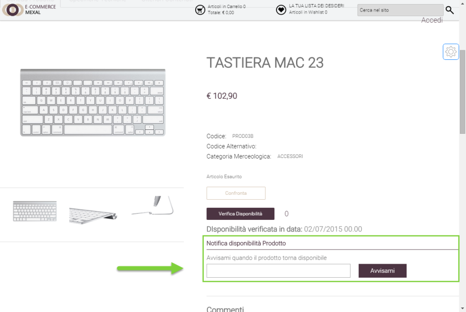
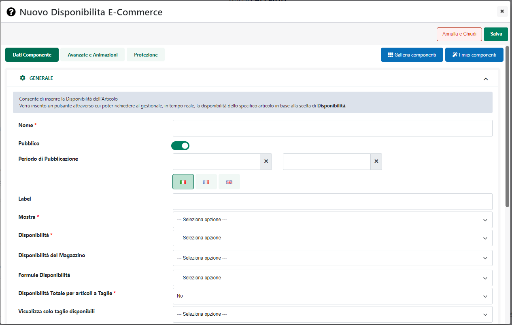

# APPLICA UNO SCONTO GENERICO

Impostando il parametro **Azione** sul valore **"Applica uno sconto
generico"** il Buono Sconto in esame si espliciterà mediante
l'applicazione di un determinato sconto.

In questo caso infatti non verrà più visualizzato l'elenco di eventuali
articoli da aggiungere in omaggio e compariranno invece i parametri di
configurazione della particolare tipologia di sconto da applicare nel
momento in cui il codice sconto dovesse essere correttamente validato

{width="5.701388888888889in"
height="2.825in"}

In particolare il parametro:

- **Articolo (solo per siti Ecommerce collegati a Mexal):** permette di
  selezionare l'articolo Mexal di tipo S (spesa) che dovrà essere
  utilizzato, lato gestionale, per gestire il Buono Sconto all'interno
  dell'ordine.

> **Al fine di poter utilizzare dei codici sconto è quindi necessario
> associare ogni Buono Sconto ad un articolo di tipo Spesa
> opportunamente codificato in Mexal, ed abilitato per essere esportato
> e gestito anche all'interno del sito.**
>
> In fase di memorizzazione ordine su Mexal, oltre alle righe relative
> agli articoli acquistati e prima di eventuali note di corpo, verrà
> inserita la riga relativa all'articolo spesa con l'importo dello
> sconto applicato. Considerando però che Mexal non permette di indicare
> importi negativi, la riga relativa all'articolo spesa presenterà una
> quantità negativa ( e un importo positivo)
>
> **NOTA BENE:**. gli articoli di tipo spesa utilizzati per gestire i
> Buoni Sconto sono automaticamente considerati come non visualizzabili
> in negozio, indipendentemente da quanto impostato in Mexal per il
> campo "Visualizza in Negozio" della videata Ecommerce relativa a
> questi stessi articoli.
>
> **NOTA BENE:** è possibile utilizzare lo stesso articolo di tipo spesa
> per Buoni Sconto differenti
>
> **ATTENZIONE! Nel caso di siti Ecommerce collegati ad uno dei
> gestionali Ho.Re.Ca. eventuali sconti dovuti all'applicazione di un
> Buono Sconto verranno applicati mediante l'utilizzo di un Abbuono
> inserito nei totali del documento**
>
> In queste condizioni nel momento in cui, lato gestionale, si andrà a
> caricare, in cassa, l'ordine nato all'interno del sito web, lo sconto,
> dovuto all'applicazione del Buono Sconto applicato sul sito mediante
> un relativo Abbuono, verrà riportato all'interno del campo **Sconto**

{width="5.279166666666667in"
height="3.5256944444444445in"}

- **Tipo:** permette di definire il tipo di sconto da applicare per il
  Buono in esame. Sono gestite le seguenti tipologie di sconti:

  - Sconti sul Carrello

  - Sconto sui prodotti Selezionati

  - Sconto sull'Articolo più economico

  - Sconto su determinati articoli

  - Spedizione

  - Compri X paghi Y

  - Sconto ogni X articoli in Carrello

  - Sconto ogni X articoli in Riga

  - Sconto ogni Z in Carrello

  - Sconto ogni Z Imponibile in Carrello

> **ATTENZIONE!** Per maggiori informazioni in merito alla specifica
> tipologia di sconto si vedano anche i successivi capitoli di questo
> manuale.

- **Tipo Valore:** consente di specificare la modalità di calcolo,
  **Fissa o in Percentuale**, da utilizzare nella determinazione
  dell'importo dello sconto da applicare.

- **Base Calcolo percentuale:** visualizzato solo per sconti di tipo
  "Sconto sul Carrello", "Sconto sui Prodotti Selezionati", "Sconto
  sull\'Articolo più Economico" ,"Sconto su Determinati Articoli" e solo
  nel caso in cui il precedente campo "Tipo Valore" sia stato impostato
  su "**Percentuale**".

> Consente di specificare quale dovrà essere l'importo da utilizzare
> come base per il calcolo della percentuale. E' possibile selezionare
> uno dei seguenti valori:

**Con IVA:** selezionando questo valore come base di calcolo percentuale
verrà considerato un importo ivato. Nello specifico:

- Per "Sconti su Carrello" verrà considerato il Totale merce ivato

- Per "Sconti sui prodotti selezionati" verrà considerato il Totale di
  riga ivato

- Per "Sconti sull'articolo più economico" verrà considerato il prezzo
  ivato, ovviamente dell'articolo più economico in carrello

- Per "Sconti su determinati articoli" verrà considerato il totale di
  riga ivato del relativo prodotto

**Senza IVA** selezionando questo valore come base di calcolo
percentuale verrà considerato un importo NON ivato. Nello specifico:

- Per "Sconti su Carrello" verrà considerato l'imponibile

- Per "Sconti sui prodotti selezionati" verrà considerato il Totale di
  riga NON ivato

- Per "Sconti sull'articolo più economico" verrà considerato il prezzo
  NON ivato, ovviamente dell'articolo più economico in carrello

- Per "Sconti su determinati articoli" verrà considerato il totale di
  riga NON ivato del relativo prodotto

> **IVA Cliente:** selezionando questo valore verrà considerato un
> importo Ivato o non Ivato nel caso in cui il cliente in oggetto sia un
> rispettivamente privato o un'azienda.

- **Valore:** consente di indicare, dipendentemente dalla particolare
  modalità di calcolo utilizzata, l' esatto importo dello sconto o il
  suo valore percentuale

- **Applicazione IVA (solo per siti Ecommerce collegati a Mexal):**
  consente di specificare se l'importo del buono sconto che si sta
  codificando dovrà essere considerato o meno comprensivo di iva. E'
  possibile selezionare uno dei seguenti valori:

  - **Non Ivato:** in questo caso l'importo indicato nel precedente
    campo "Valore" sarà considerato **iva esclusa**. In conseguenza di
    ciò se ad effettuare l'ordine sul sito dovesse essere un privato
    (generando quindi un OX) verrà calcolata l'iva sull'importo inserito
    all'interno del campo Valore. L'importo del buono sconto presente
    nel riepilogo dell'ordine sarà dunque quello indicato all'interno
    del campo Valore maggiorato dell''iva calcolata secondo l'aliquota
    in uso all'interno del gestionale (iva cliente, particolarità iva,
    iva articolo).

> Nel caso in cui ad effettuare l'ordine sia invece un utente di tipo
> azienda (generando quindi un OC) l'importo del buono sconto presente
> nel riepilogo dell'ordine coinciderà esattamente con quanto inserito
> all'interno del campo Valore. L'iva sul buono sconto verrà comunque
> calcolata e andrà ad influire sul totale della relativa voce presente
> nel piede del documento.

- **Ivato:** in questo caso l'importo indicato nel precedente campo
  "Valore" sarà considerato **iva compresa**. In conseguenza di ciò se
  ad effettuare l'ordine sul sito dovesse essere un privato (generando
  quindi un OX) l'importo del buono sconto inserito nel riepilogo
  dell'ordine coinciderà esattamente con quello indicato all'interno del
  campo Valore.

> Nel caso in cui ad effettuare l'ordine fosse invece un utente di tipo
> azienda (generando quindi un OC) l'importo del buono sconto presente
> nel riepilogo dell'ordine coinciderà con quello inserito nel campo
> Valore scorporato dell'iva, secondo l'aliquota in uso all'interno del
> gestionale (iva cliente, particolarità iva, iva articolo). L'iva così
> calcolata andrà ad influire sul totale della relativa voce presente
> nel piede del documento.
>
> **ATTENZIONE!** Il parametro "Applicazione IVA" non è visualizzato nel
> caso di sconti su spese di trasporto. In questo caso infatti se si sta
> utilizzando un'aliquota iva fissa per le spese di trasporto il valore
> indicato verrà sempre maggiorato dell'iva calcolata sulla base di tale
> aliquota.

{width="3.129861111111111in"
height="2.2465277777777777in"}

Infine, per questa particolare tipologia di Buoni Sconto, verrà sempre
visualizzata anche la sezione "**Pagamenti non consentiti**"

{width="4.376388888888889in"
height="1.8444444444444446in"}

sezione questa all'interno della quale poter indicare eventuali metodi
di pagamento che non dovranno essere mostrati in fase di checkout nel
caso in cui il Buono Sconto dovesse essere correttamente validato.

Per fare in modo dunque che con l'applicazione del buono sconto in esame
l'utente non possa selezionare uno specifico metodo di pagamento, sarà
sufficiente selezionarlo tra quelli presenti nel box di sinistra ed
inserirlo nel box di destra cliccando per questo sul pulsante
raffigurante una piccola freccia rivolta verso destra.

Nei successivi capitoli di questo manuale verranno analizzate più nel
dettaglio le diverse tipologie di sconto applicabili.

##### SCONTO SUL CARRELLO

Impostando il campo "**Tipo**", presente all'interno della sezione
"**Azione**", sul valore "**Sconto sul Carrello**" lo sconto verrà
applicato all'intero carrello.

Nel caso in cui la modalità di calcolo dello sconto sia a valore fisso,
il valore indicato verrà applicato all'intero carrello andando quindi a
diminuire il Totale Merce.

Nel caso in cui la modalità di calcolo dello sconto sia invece in
percentuale, tale percentuale verrà calcolata sul **Totale Merce o
sull'imponibile** dipendentemente da come è stato impostato il parametro
**"Base Calcolo Percentuale"**

##### SCONTO SUI PRODOTTI SELEZIONATI

Impostando il campo "**Tipo**", presente all'interno della sezione
"**Azione**", sul valore "**Sconto sui prodotti selezionati**" lo sconto
verrà applicato ai soli prodotti presenti in carrello che soddisfano
eventuali filtri articolo impostati nelle condizioni del Buono Sconto.

**ATTENZIONE!** nel momento in cui l'esigenza dovesse essere quella di
applicare lo sconto solamente a determinati prodotti e solamente nel
caso in cui tali prodotti non abbiano già uno sconto applicato, sarà
necessario verificare di aver impostato, nelle regole di applicabilità
del Buono Sconto, anche una condizione del tipo "**Sconto in Riga =
'Stringa vuota'**" (campo "**Filtro Carrello**"). Per maggiori
informazioni in merito si veda anche quanto indicato nel precedente
capitolo ("*Buono Sconto -- Condizioni*") di questo manuale

Si ricorda inoltre che nel caso in cui dovesse essere presente, in
carrello, un articolo di tipo Campionario, nel verificare la condizione
di applicabilità del Buono Sconto, verrà considerato l'articolo in sé
piuttosto che i suoi componenti dipendentemente da come è stato
impostato il parametro "**Gestione articoli Box**" alla pagina
"**Configurazione Catalogo**" del Wizard.

Per quel che riguarda poi la modalità di calcolo dello sconto occorre
ricordare che:

- Se lo sconto è a **valore fisso**, il valore indicato verrà applicato
  ad totale di riga di ogni prodotto che soddisfa eventuali filtri
  articolo

- Se lo sconto è in **percentuale**, tale percentuale verrà calcolata
  sul **totale di riga, ivato o non ivato,** a seconda di come è stato
  impostato il parametro **"Base Calcolo Percentuale"**

**ATTENZIONE!** Nel caso in cui nelle condizioni di applicazione del
Buono Sconto non siano stati impostati filtri articolo, lo "Sconto sui
prodotti selezionati" verrà applicato indiscriminatamente a tutti gli
articoli presenti in carrello, ottenendo quindi, nel caso di calcolo
percentuale, lo stesso risultato che si otterrebbe con lo sconto in
percentuale sull'interno carrello

##### SCONTO SULL'ARTICOLO PIÙ ECONOMICO

Nel momento in cui il campo "**Tipo**", presente all'interno della
sezione "**Azione**", dovesse essere impostato sul valore "**Sconto
sull'Articolo più Economico**"

{width="4.707638888888889in"
height="2.1881944444444446in"}

sarà poi possibile decidere, ragionando in termini di prezzo degli
articoli presenti in carrello, a quale di essi dovrà essere applicato lo
sconto indicato.

Il campo "**Numero Ordinale**" consente infatti di indicare esattamente
il numero dell'articolo più economico cui dovrà essere effettivamente
applicato lo sconto indicato. Supponendo, ad esempio, di inserire in
corrispondenza del campo "**Numero Ordinale**" il valore 1 lo sconto
indicato verrà applicato al primo articolo più economico. Nel caso in
cui, invece, il parametro in esame dovesse essere impostato sul valore 2
lo sconto indicato verrebbe applicato al secondo articolo più economico
tra quelli presenti in carrello

**ATTENZIONE!** nel momento in cui il campo "**Numero Ordinale**"
dovesse essere impostato **su di un valore diverso da 1**, nel valutare
quello che è l'articolo cui dover applicare effettivamente lo sconto
verrà considerato non solo il prezzo dei singoli articoli ma anche la
quantità con cui questi stessi articoli sono effettivamente presenti in
carrello.

Supponendo dunque di avere in carrello una situazione del tipo di quella
di seguito indicata

- ART1 -- Prezzo 10€ -- Quantità 2

- ART2 -- Prezzo 15€ -- Quantità 1

- ART3 -- Prezzo 20€ -- Quantità 1

e di aver impostato il campo "Numero Ordinale" sul valore 2, allora
l'articolo cui applicare lo sconto sarebbe comunque ART1.

Considerando infatti che questo articolo è presente in quantità due,
l'articolo più economico sarebbe ovviamente ART1 ma anche il secondo
articolo più economico, tra quelli sopra indicati, sarebbe comunque
sempre ART1

**ATTENZIONE!** in fase di valutazione dell'articolo più economico
attualmente presente in carrello non verranno prese in considerazione
eventuali condizioni di applicabilità della Buono Sconto.

In conseguenza di ciò se anche dovessimo aver impostato una condizione
del tipo "**Sconto in Riga = 'Stringa vuota'**" (campo "**Filtro
Carrello**") e l'articolo più economico attualmente presente in carrello
dovesse essere un articolo con uno sconto già applicato, il Buono
Sconto, una volta validato, verrebbe comunque applicato a questo stesso
articolo

Si ricorda inoltre che nel caso in cui dovesse essere presente, in
carrello, un articolo di tipo Campionario, nel verificare la condizione
di applicabilità del Buono Sconto, verrà considerato l'articolo in sé
piuttosto che i suoi componenti dipendentemente da come è stato
impostato il parametro "**Gestione articoli Box**" alla pagina
"**Configurazione Catalogo**" del Wizard.

Per quel che riguarda poi la modalità di calcolo dello sconto occorre
ricordare che:

- Nel caso in cui la modalità di calcolo dello sconto sia a valore
  fisso, il valore indicato verrà quindi sottratto al totale di riga
  dell'articolo con il prezzo più basso.

- Nel caso in cui la modalità di calcolo dello sconto sia a percentuale,
  tale percentuale verrà invece calcolata sul prezzo di questo stesso
  articolo **ivato o non ivato,** a seconda di come è stato impostato il
  parametro **"Base Calcolo Percentuale"**.

> L'importo dello sconto dipenderà quindi unicamente dal prezzo di
> questo stesso articolo e non dal relativo totale di riga.

**ATTENZIONE!** Per ovvie ragioni lo sconto sull'articolo più economico
andrebbe calcolato sempre in percentuale

##### SCONTO SU DETERMINATI ARTICOLI

Impostando il campo "**Tipo**", presente all'interno della sezione
"**Azione**", sul valore **"Sconto su determinati Articoli"** sarà
possibile indicare esattamente i singoli articoli cui applicare lo
sconto, specificando inoltre, per ciascuno di essi, l'esatto importo da
considerare.

**L'importo complessivo dello sconto sarà dato quindi dalla somma degli
sconti applicati ai singoli articoli presenti in carrello.**

In queste condizioni verrà visualizzata, come evidenziato in figura, un
ulteriore sezione contenente l'elenco degli articoli cui applicare lo
sconto.

{width="5.590972222222222in"
height="3.376388888888889in"}

Per aggiungere un nuovo articolo all'elenco è sufficiente cliccare sul
pulsante **"Aggiungi Articolo"** (
{width="0.18819444444444444in"
height="0.18819444444444444in"} ). In questo modo verrà infatti
visualizzata la maschera "**Articolo"** grazie alla quale poter
selezionare il prodotto da aggiungere in elenco indicando anche quello
che dovrà essere lo sconto da applicargli.

- **Articolo**: consente di ricercare e indicare lo specifico articolo
  da aggiungere in elenco.

> Il campo è ad autocompletamento ed è possibile indicare al suo interno
> il codice dell'articolo, la sua descrizione, o parte di essi. In ogni
> caso, infatti, dopo aver inserito almeno 3 caratteri l'applicazione
> proporrà in automatico, tra tutti gli articoli attualmente gestiti sul
> sito, quelli che presentano nel loro codice e/o nella loro descrizione
> la stringa indicata.

- **Sconto**: consente di indicare esattamente lo sconto da applicare
  all'articolo attualmente considerato. E' possibile inserire sconti a
  valore, es. -10 (**il valore deve essere preceduto da un segno -**) o
  in percentuale, es. 10 (**la percentuale deve essere compresa tra lo
  0.01 e il 99.99**).

> In quest'ultimo caso la percentuale indicata verrà calcolata **sul
> prezzo ivato o non ivato del relativo articolo,** a seconda di come è
> stato impostato il parametro **"Base Calcolo Percentuale"**.

**ATTENZIONE!** **per questa specifica tipologia di Promozione, per
ovvie ragioni, non verranno presi in considerazione eventuali Filtri
Articolo impostati nelle condizioni di applicabilità**

Volendo è anche possibile importare/esportare in blocco, mediante un
apposito file, l'elenco degli articoli cui dovrà essere applicato il
Buono Sconto. In questo senso i due pulsanti presenti nella barra degli
strumenti consentono rispettivamente di:

- **Importa** (
  {width="0.18194444444444444in"
  height="0.2013888888888889in"} ): consente di importare in maniera
  massiva un elenco di tutti gli articoli cui dovrà essere applicato il
  buono sconto. Cliccando su questo pulsante verrà infatti visualizzata
  la maschera **"Importa Valori"**

{width="5.649305555555555in"
height="3.734027777777778in"}

> all'interno della quale poter indicare:

- **File (csv-txt)**: consente di selezionare il file txt o csv
  contenente l'elenco degli articoli cui applicare lo sconto

- **Separatore:** consente di indicare, selezionandolo, dall'apposito
  menu a tendina, il carattere che è stato utilizzato all'interno del
  file di importazione come separatore per i vari campi

> Il check **"Elimina valori non presenti nel file"** consente, se
> selezionato, di eliminare automaticamente eventuali codici articolo
> attualmente presenti in elenco ma non dichiarati nel file che si
> desidera importare.
>
> Affinchè la procedura di importazione possa funzionare in maniera
> corretta è necessario, ovviamente, che il file in oggetto soddisfi
> determinate specifiche. In particolare:

- Il file dovrà avere estensione .csv o .txt

- Il carattere separatore dei vari campi deve essere esattamente quello
  indicato all'interno del campo "**Separatore**" presente nel form di
  importazione

- L'intestazione, ossia la prima riga del file, deve necessariamente
  contenere come primo campo la dicitura **CODICE** e come secondo campo
  la dicitura **SCONTO.**

- Ogni record del file dovrà essere composto da due campi, **il primo,
  obbligatorio, contenente il Codice Articolo**, **il secondo,
  opzionale, contenente l'indicazione dello sconto** da applicare per il
  relativo articolo (nel caso in cui non venga specificato uno sconto,
  l'articolo verrà comunque inserito in elenco ma lo sconto ad esso
  applicato sarà ovviamente nullo).

- Supponendo quindi di voler utilizzare come carattere separatore il ;
  il file dovrà essere del tipo:

> **CODICE;SCONTO**
>
> **PROD01A;-15**

- Il file di importazione deve soddisfare le specifiche del formato
  RFC4180.

> In questo senso è quindi necessario che il valore dei campi contenenti
> interruzioni di riga, doppi apici e/o lo stesso carattere utilizzato
> anche come separatore sia necessariamente racchiuso da virgolette
>
> Infine nel caso in cui nel file da importare siano stati dichiarati
> articoli già presenti in elenco lo sconto per essi indicato
> all'interno del file andrà a sovrascrivere il precedente valore.

- **Esporta**
  ({width="0.18819444444444444in"
  height="0.2013888888888889in"} ): consente di esportare l'attuale
  elenco di articoli cui dovrà essere applicato lo sconto all'interno di
  un' apposito file .csv.

> Cliccando su questo pulsante verrà infatti visualizzata la maschera
> **"Esporta Valori"**

{width="5.649305555555555in"
height="3.279166666666667in"}

> all'interno della quale poter indicare:

- **Separatore:** consente di indicare, selezionandolo, dall'apposito
  menu a tendina, il carattere che dovrà essere utilizzato all'interno
  del file di esportazione come separatore per i vari campi

##### SPEDIZIONE

Impostando il campo "**Tipo**", presente all'interno della sezione
"**Azione**", sul valore **"Spedizione"**

{width="4.695138888888889in"
height="1.9416666666666667in"}

lo sconto indicato andrà ad impattare sulle spese di trasporto
**modificando quindi il loro importo originale**.

I successivi parametri di configurazione consentono quindi di:

**Tipo Valore**: consente di specificare la modalità di calcolo, **Fissa
o in Percentuale**, da utilizzare nella determinazione del nuovo importo
delle spese di spedizione.

**ATTENZIONE!** In questo caso a seconda della modalità adottata (Fissa
o Percentuale) il calcolo del nuovo importo delle spese di spedizione
potrà essere effettuato sulla basse di uno stesso valore fisso, oppure
prendendo come riferimento iniziale, l'importo originale della relativa
spesa di spedizione, il Totale merce in carrello, oppure il Totale di
riga di determinati articoli in carrello.

In particolare, dunque, **nel momento in cui si dovesse decidere di
utilizzare una modalità di calcolo Fissa**, l'importo indicato
all'interno del corrispondente campo "Valore" sarà esattamente il nuovo
importo da considerare per tutte le spese di spedizione
indipendentemente da quello che era il loro importo originale.

Se l'esigenza dovesse essere quella di creare un Buono Sconto tale da
azzerare le spese di trasporto (**Spedizione Gratuita**), si potrebbe
quindi pensare di utilizzare una modalità di calcolo a valore fisso con
importo pari a 0

**Nel momento in cui si dovesse decidere invece di utilizzare una
modalità di calcolo Percentuale** il nuovo importo delle spese di
spedizione verrà invece calcolato prendendo come riferimento iniziale
per il calcolo percentuale, l'importo originale della spesa stessa, il
Totale merce in carrello, oppure il Totale di riga di determinati
articoli a seconda di come verrà impostato il successivo parametro
"Applicazione Calcolo Percentuale".

**Applicazione Calcolo Percentuale --** visualizzato solo nel caso in
cui il precedente parametro "Tipo Valore" sia stato impostato su
"Percentuale".

Consente di decidere quale debba essere l'elemento da prendere come
riferimento iniziale per il calcolo percentuale che porterà poi alla
determinazione del nuovo importo delle spese di spedizione.

E' possibile selezionare uno dei seguenti valori:

- **Spedizione:** in questo caso l'elemento da prendere come riferimento
  iniziale per il calcolo percentuale che porterà poi alla
  determinazione del nuovo importo delle spese di spedizione sarà
  l'importo originale della spesa stessa

> Supponendo dunque di aver impostato come percentuale di calcolo il
> valore 10, e di avere una spedizione il cui importo originale è pari a
> 50€, l'applicazione del buono sconto in esame porterà il valore di
> questa stessa spesa di trasporto a soli 5€.

- **Carrello:** in questo caso l'elemento da prendere come riferimento
  iniziale per il calcolo percentuale che porterà poi alla
  determinazione del nuovo importo delle spese di spedizione sarà il
  Totale merce in carrello. Il successivo campo "**Base Calcolo
  Percentuale**" consente poi di decidere se dovrà essere utilizzato il
  Totale merce in carrello comprensivo o meno dell'IVA

> Supponendo dunque di aver impostato come percentuale di calcolo il
> valore 10, e di avere un Totale merce in carrello pari a 250€,
> l'applicazione del buono sconto in esame porterà il valore di tutte le
> spese di spedizione su di un importo pari a 25€

- **Prodotti Selezionati:** in questo caso l'elemento da prendere come
  riferimento iniziale per il calcolo percentuale che porterà poi alla
  determinazione del nuovo importo delle spese di spedizione sarà il
  Totale di Riga dei soli articoli che soddisfano le condizioni di
  applicabilità della promozione stessa.

> **ATTENZIONE!** nel caso in cui dovesse essere presente in Carrello un
> articolo Campionario, per valutare se questo stesso articolo soddisfa
> o meno le condizioni di applicabilità del Buono Sconto verrà
> considerato l'articolo in sé piuttosto che i suoi componenti,
> dipendentemente dalle impostazione settate per il parametro
> "**Gestione articoli Box**" alla pagina "**Configurazione Catalogo**"
> del Wizard
>
> Supponendo dunque di aver impostato come percentuale di calcolo il
> valore 10, di avere un totale merce in carrello pari a 250€ e di avere
> però in carrello un solo articolo che soddisfa le condizioni di
> applicabilità della promozione ed il cui totale di riga sia pari
> a100€, l'applicazione del buono sconto in esame porterà il valore di
> tutte le spese di spedizione su di un importo pari a 10€

**ATTENZIONE! Nel caso in cui l'esigenza dovesse essere quella di
portare in detrazione al totale ordine l'importo delle spese di
spedizione (applicando di fatto uno sconto pari a questo stesso importo)
sarà necessario utilizzare all'interno del campo "Valore" dei valori
negativi (es. -10)**

La sezione **Spedizioni** permette infine, di associare il Buono Sconto
in oggetto, in maniera specifica, ad uno o più metodi di trasporto.

Nel box di sinistra sono visualizzati tutti i metodi di trasporto
attualmente codificati all'interno della corrispondente sezione del
Wizard. Per ciascuno di essi è riportato, tra parentesi, l'id del
relativo metodo di trasporto e la descrizione ad esso assegnata.

{width="4.325in"
height="1.8118055555555554in"}

Nel caso in cui il Buono Sconto in oggetto debba essere associato
soltanto a determinati metodi di trasporto, sarà quindi sufficiente
selezionare le spedizioni desiderate nel box di sinistra per poi
inserirle nel box di destra cliccando sul pulsante rappresentante una
piccola freccia rivolta verso destra.

Al contrario, nel momento in cui il Buono Sconto in oggetto dovesse
essere valido per tutti i metodi di trasporto sarà necessario verificare
di non aver inserito, nel box di destra, nessuna delle spedizioni
disponibili.

Infine è bene sottolineare che:

- Nel caso in cui ci siano più promozioni o buoni sconto associati alla
  stessa spedizione verrà utilizzata la seguente regola:

  - Eventuali buoni sconto associati ad una spedizione avranno priorità
    rispetto a promozioni associate alla medesima spedizione.

> Ciò significa dunque che qualora un eventuale buono sconto associato
> alla spedizione S preveda per essa uno sconto X e una promozione
> associata anch'essa alla medesima spedizione S, preveda invece uno
> sconto Y, verrà sempre applicato lo sconto X del buono

- Il valore indicato per un Buono Sconto di questo tipo dovrà essere
  considerato Ivato o non Ivato a seconda di come è stato impostato il
  parametro "Tipo di Costo" sulla specifica spedizione selezionata.

> Supponendo dunque di aver indicato, per il Buono Sconto in oggetto un
> valore pari a 10€, di averlo associato alla Spedizione1 e alla
> Spedizione2 e di aver impostato per la Spedizione1 un "Tipo di Costo =
> Ivato" mentre per la Spedizione2 un "Tipo di Costo = Non Ivato" nel
> momento in cui l'utente dovesse utilizzare il Buono Sconto in esame
> selezionando la Spedizione1 i 10€ verranno considerati ivati; nel caso
> in cui l'utente dovesse invece utilizzare il Buono Sconto selezionando
> la Spedizione2 i 10€ verranno considerati non ivati.

**ATTENZIONE!** A seguito dell'applicazione del Buono Sconto verrà
aggiornata la voce di riepilogo relativa alle spese di trasporto e, in
ogni caso, per evidenziare l\'utilizzo del Buono, verrà comunque
inserito, tanto in carrello quanto nel corpo del documento, l\'articolo
spesa indicato in fase di configurazione con valore pari a 0.

##### COMPRA X PAGHI Y

Impostando il campo "**Tipo**", presente all'interno della sezione
"**Azione**", sul valore **"Compra X Paghi Y"** sarà possibile
configurare un buono sconto del tipo "**Prendi 3 paghi 2**".

In queste condizioni verranno infatti visualizzati, come evidenziato in
figura, i due campi X e Y

{width="5.753472222222222in"
height="2.0131944444444443in"}

all'interno dei quali poter indicare rispettivamente il numero di
articoli (**X**) che devono essere acquistati (affinché questa
particolare promozione possa essere applicata) e quanti ne dovranno
effettivamente essere pagati (**Y**).

**ATTENZIONE!** nel caso in cui in carrello dovesse essere presente un
articolo di tipo Campionario nel valutare la condizione X per Y (es.
3x2) verrà considerata la sola riga dell'articolo Campionario, piuttosto
che le righe dei singoli componenti dipendentemente dalle impostazioni
settate per il parametro "**Gestione articoli Box**" alla pagina
"**Configurazione Catalogo**" del Wizard

##### SCONTO OGNI X ARTICOLI IN CARRELLO

Nel momento in cui il campo "**Tipo**", presente all'interno della
sezione "**Azione**", dovesse essere impostato sul valore "**Sconto ogni
X articoli in Carrello**" lo sconto indicato verrà applicato per ogni X
articoli presenti in carrello.

In queste condizioni verrà dunque visualizzato un ulteriore campo **X**

{width="5.779166666666667in"
height="2.50625in"}

all'interno del quale poter indicare la quantità di riferimento da
considerare per applicare il relativo sconto (che potrà essere fisso o
in percentuale).

**In queste condizioni lo sconto indicato verrà applicato per ogni
multiplo di "X" fino al raggiungimento (in difetto) della quantità
complessiva degli articoli soggetti alla promozione attualmente presenti
in carrello.**

Per comprendere meglio il funzionamento di questo buono sconto si
consideri il seguente esempio.

\*\*\*\*\*\*\*\*\*\*\*\*\*\*\*\*\*\*\*\*\*\*\*\*\*\*\*\*\*\*\*\*\*\*\*\*\*\*\*\*\*\*\*\*\*\*\*\*\*\*\*\*\*\*\*\*\*\*\*\*\*\*\*\*\*\*\*\*\*\*\*\*\*\*\*\*\*\*\*\*\*\*\*\*\*\*\*\*\*\*\*\*\*\*\*\*\*\*\*\*\*\*\*\*\*\*\*\*\*\*\*\*\*

**[ESEMPIO]{.underline}**

**Condizione di applicabilità del Buono Sconto:** Articoli che
appartengono alle categorie 1,5,10

**X =** 3

**Sconto Fisso =** 2€

[CASO 1]{.underline}

**Articoli in carrello**: Articolo A di categoria 1 in quantità 1;
Articolo B di categoria 5 in quantità 1; Articolo C di categoria 12 in
quantità 3

**Sconto applicato:** nessuno

In questo caso infatti la quantità di articoli presenti in carrello e
soggetti al buono sconto è pari a 2 per cui non verrà giustamente
applicato nessuno sconto

[CASO 2]{.underline}

**Articoli in carrello**: Articolo A di categoria 1 in quantità 1;
Articolo B di categoria 5 in quantità 1; Articolo C di categoria 12 in
quantità 3; Articolo D di categoria 10 in quantità 1

**Sconto applicato:** 2€

In questo caso infatti la quantità di articoli presenti in carrello e
soggetti al buon sconto è pari a 3 per cui considerando che il valore
impostato per il parametro X è proprio 3 il multiplo utile da
considerare per la determinazione dello sconto da applicare è 1 e lo
sconto applicato sarà quindi pari a 1 X 2 = 2€

[CASO 3]{.underline}

**Articoli in carrello**: Articolo A di categoria 1 in quantità 2;
Articolo B di categoria 5 in quantità 4; Articolo C di categoria 12 in
quantità 3, Articolo D di categoria 10 in quantità 1

**Sconto applicato:** 4€

In questo caso infatti la quantità di articoli presenti in carrello e
soggetti al buono sconto è pari a 7 per cui considerando che il valore
impostato per il parametro X è pari a 3 il multiplo utile da considerare
per la determinazione dello sconto da applicare è 2 e lo sconto
applicato sarà quindi pari a 2 X 2 = 4€

\*\*\*\*\*\*\*\*\*\*\*\*\*\*\*\*\*\*\*\*\*\*\*\*\*\*\*\*\*\*\*\*\*\*\*\*\*\*\*\*\*\*\*\*\*\*\*\*\*\*\*\*\*\*\*\*\*\*\*\*\*\*\*\*\*\*\*\*\*\*\*\*\*\*\*\*\*\*\*\*\*\*\*\*\*\*\*\*\*\*\*\*\*\*\*\*\*\*\*\*\*\*\*\*\*\*\*\*\*\*\*\*\*

**ATTENZIONE!** nell'esempio appena esaminato sono stati presi in esame
solamente articoli di magazzino "standard" di tipologia A.

La situazione potrebbe farsi invece un po' più complicata nel momento in
cui dovessero essere presi in considerazione anche articoli Campionario
(tipologia C), articoli questi che una volta inseriti in carrello
verranno effettivamente esplosi nei relativi componenti.

In queste condizioni infatti per valutare la quantità di articoli
effettivamente soggetti all'applicazione del Buono Sconto in esame verrà
preso in considerazione l'articolo Campionario in se o i singoli
componenti dipendentemente da come è stato impostato il parametro
"**Gestione Articoli Box**" alla pagina "**Configurazione Catalogo**"
del Wizard.

In particolare nel caso in cui il parametro in questione dovesse essere
impostato sul valore:

- **Considera il Box** -- **opzione di default**: verrà preso in
  considerazione soltanto l'articolo Campionario con la quantità
  presente nella relativa riga del carrello (non verranno invece prese
  in considerazione le righe dei componenti del Campionario).

- **Considera i componenti del Box**: verranno presi in considerazione i
  singoli componenti del Campionario con le relative quantità indicate
  sulle rispettive righe del carrello (non verrà invece presa in
  considerazione la riga relativa all'articolo Campionario)

**ATTENZIONE!** Nel caso in cui lo sconto da applicare sia stato
definito in termini percentuali occorre considerare che:

- Nel caso in cui non sia stata definita nessuna condizione di
  applicabilità del Buono Sconto (Buono Sconto sempre valido) la
  percentuale indicata verrà calcolata sul seguente importo:

> ((Totale Merce / quantità totale in carrello)\*X)

- Nel caso in cui siano state definite specifiche condizioni di
  applicabilità per il Buono Sconto in esame, la percentuale indicata
  verrà calcolata sul seguente importo:

> ((somma dei totali di riga degli articoli che soddisfano tali
> condizione) / (quantità articoli che soddisfano la condizione) \* X)

- In entrambi i casi la percentuale calcolata sugli importi sopra
  indicati verrà moltiplicata per l'ultimo multiplo utile ai fini della
  promozione.

Supponendo dunque di avere una promozione sempre valida, di avere 8
articoli in carrello per un Totale merce di 100€, di aver impostato il
parametro X sul valore 3 e lo sconto sul valore 10%, per determinare
l'importo effettivo da scontare verrà eseguito il seguente calcolo:

(((100 / 8)\*3)\*10%)\*2 = 7,5€

##### SCONTO OGNI X ARTICOLI IN RIGA

Nel momento in cui il campo "**Tipo**", presente all'interno della
sezione "**Azione**", dovesse essere impostato sul valore "**Sconto ogni
X articoli in Riga**" lo sconto indicato verrà applicato per ogni X
articoli presenti in riga.

In queste condizioni verrà dunque visualizzato un ulteriore campo **X**

{width="5.785416666666666in"
height="2.5194444444444444in"}

all'interno del quale poter indicare la quantità di riferimento da
considerare per applicare il relativo sconto (che potrà essere fisso o
in percentuale).

**In queste condizioni lo sconto indicato verrà applicato per ogni
multiplo di "X" fino al raggiungimento (in difetto) della quantità
presente sulla singola riga per tutti articoli soggetti alla promozione
attualmente presenti in carrello.**

Per comprendere meglio il funzionamento di questo buono sconto si
consideri il seguente esempio.

\*\*\*\*\*\*\*\*\*\*\*\*\*\*\*\*\*\*\*\*\*\*\*\*\*\*\*\*\*\*\*\*\*\*\*\*\*\*\*\*\*\*\*\*\*\*\*\*\*\*\*\*\*\*\*\*\*\*\*\*\*\*\*\*\*\*\*\*\*\*\*\*\*\*\*\*\*\*\*\*\*\*\*\*\*\*\*\*\*\*\*\*\*\*\*\*\*\*\*\*\*\*\*\*\*\*\*\*\*\*\*\*\*

**[ESEMPIO]{.underline}**

**Condizione di applicabilità del buono sconto:** Articoli che
appartengono alle categorie 1,5,10

**X =** 3

**Sconto Fisso =** 2€

[CASO 1]{.underline}

**Articoli in carrello**: Articolo A di categoria 1 in quantità 1;
Articolo B di categoria 5 in quantità 3; Articolo C di categoria 12 in
quantità 3

**Sconto applicato:** 2€

In questo caso infatti avremo in carrello due righe di articoli che
soddisfano le condizioni di applicabilità del buono sconto: la riga
dell'articolo A e quella dell'articolo B.

La riga dell'articolo A ha quantità pari 1 per cui produce uno sconto di
0€

La riga dell'Articolo B ha una quantità pari a 3 per cui produce uno
sconto pari a 2€

Lo sconto applicato complessivamente sarà quindi pari a 0+2 = 2€

[CASO 2]{.underline}

**Articoli in carrello**: Articolo A di categoria 1 in quantità 5;
Articolo B di categoria 5 in quantità 7; Articolo C di categoria 12 in
quantità 3

**Sconto applicato:** 6€

Anche in questo caso avremo in carrello due righe di articoli che
soddisfano le condizioni di applicabilità del buono sconto: la riga
dell'articolo A e quella dell'articolo B.

La riga dell'articolo A ha quantità pari 4 per cui il multipli di X da
considerare per il calcolo dello sconto è 1 e lo sconto in relazione a
questa riga sarà pari a 1 X 2 = 2€

La riga dell'Articolo B ha una quantità pari a 7 per cui il multipli di
X da considerare per il calcolo dello sconto è 2 e lo sconto in
relazione a questa riga sarà pari a 2 X 2 = 2€

Lo sconto applicato complessivamente sarà quindi pari a 4+2 = 6€

\*\*\*\*\*\*\*\*\*\*\*\*\*\*\*\*\*\*\*\*\*\*\*\*\*\*\*\*\*\*\*\*\*\*\*\*\*\*\*\*\*\*\*\*\*\*\*\*\*\*\*\*\*\*\*\*\*\*\*\*\*\*\*\*\*\*\*\*\*\*\*\*\*\*\*\*\*\*\*\*\*\*\*\*\*\*\*\*\*\*\*\*\*\*\*\*\*\*\*\*\*\*\*\*\*\*\*\*\*\*\*\*\*

**ATTENZIONE!** nell'esempio appena esaminato sono stati presi in esame
solamente articoli di magazzino "standard" di tipologia A.

La situazione potrebbe farsi invece un po' più complicata nel momento in
cui dovessero essere presi in considerazione anche articoli Campionario
(tipologia C), articoli questi che una volta inseriti in carrello
verranno effettivamente esplosi nei relativi componenti.

In queste condizioni infatti per valutare la quantità di articoli
effettivamente soggetti all'applicabilità del Buono Sconto verrà preso
in considerazione l'articolo Campionario in se o i singoli componenti
dipendentemente da come è stato impostato il parametro "**Gestione
Articoli Box**" alla pagina "**Configurazione Catalogo**" del Wizard.

In particolare nel caso in cui il parametro in questione dovesse essere
impostato sul valore:

- **Considera il Box** -- **opzione di default**: verrà preso in
  considerazione soltanto l'articolo Campionario con la quantità
  presente nella relativa riga del carrello (non verranno invece prese
  in considerazione le righe dei componenti del Campionario).

- **Considera i componenti del Box**: verranno presi in considerazione i
  singoli componenti del Campionario con le relative quantità indicate
  sulle rispettive righe del carrello (non verrà invece presa in
  considerazione la riga relativa all'articolo Campionario)

**ATTENZIONE!** Nel caso in cui lo sconto da applicare sia stato
definito in termini percentuali occorre considerare che:

- Nel caso in cui non sia stata definita nessuna condizione di
  applicabilità della Buono Sconto (Buono Sconto sempre valido) la
  percentuale indicata verrà calcolata per ogni riga in carrello sul
  seguente importo:

> ((Totali di riga / quantità di riga)\*X)

- Nel caso in cui siano state definite specifiche condizioni di
  applicabilità per il Buono Sconto in esame, la percentuale indicata
  verrà calcolata per ogni riga in carrello che soddisfa la condizione
  sul seguente:

> ((Totali di riga / quantità di riga)\*X)

- In entrambi i casi, per ogni riga in carrello o che soddisfa la
  condizione, la percentuale calcolata sugli importi sopra indicati
  verrà moltiplicata per l'ultimo multiplo utile ai fini della
  promozione e i risultati così ottenuti verranno sommati tra loro per
  determinare l'importo complessivo da scontare

##### SCONTO OGNI Z IN CARRELLO

Impostando il parametro **Tipo** sul valore **"Sconto ogni Z in
Carrello"** il buono sconto in esame si espliciterà nella possibilità da
parte dell'utente di definire, dinamicamente, un moltiplicatore da
applicare allo sconto associato al buono.

In queste condizioni verrà dunque visualizzato un ulteriore campo **Z**

{width="4.720833333333333in"
height="2.0131944444444443in"}

all'interno del quale poter indicare un importo **IVATO** che verrà
utilizzato come divisore del **Totale Merce** al fine di individuare il
moltiplicatore da applicare allo sconto definito sul buono

**ATTENZIONE!** Nelle condizioni in esame:

- il valore indicato all'interno del campo Z deve essere un valore IVATO

- come divisore verrà utilizzato sempre il Totale Merce (ivato)
  dell'intero carrello indipendentemente da quelle che possono essere
  eventuali condizioni di applicabilità del Buono Sconto\\

Per comprendere meglio il funzionamento di questo buono sconto si
consideri il seguente esempio.

**[ESEMPIO]{.underline}**

**Condizione di applicabilità del buono sconto:** Articoli che
appartengono alla categorie 1,5,10

**Tipologia di sconto:** Sconto ogni Z in Carrello

**Z =** 500

**Sconto Fisso =** 10€

CASO 1

**Articoli in carrello**: Articolo A di categoria 1 in quantità 1;
Articolo B di categoria 5 in quantità 6

**Totale merce** **=** 1000€

**Sconto applicato:** 20€

In queste condizioni per determinare l'importo complessivo dello sconto
da applicare verrà considerato, per prima cosa, il Totale Merce che
verrà poi diviso per il valore indicato, in fase di configurazione del
buono, all'interno del campo Z ottenendo quindi:

**Moltiplicatore da applicare allo sconto**: 1000 / 500 = 2

Considerando quindi che il buono sconto è stato configurata sulla base
di uno sconto fisso di 10€ lo sconto complessivo applicato sarà
esattamente di

**Sconto Applicato:** 10 x 2 = 20€

Ovviamente il valore dello sconto effettivamente visualizzato in
carrello è sempre da rapportare al fatto che ad effettuare l'ordine sia
un'azienda piuttosto che un utente privato, al tipo di documento che si
è scelto di generare per la specifica tipologia di utenza e anche agli
altri parametri di configurazione del buono stesso.

**ATTENZIONE!** Il risultato della divisione effettuata per determinare
il moltiplicatore da applicare allo sconto indicato in fase di
configurazione del buono verrà sempre arrotondato, per difetto, al primo
intero utile

Nel momento in cui il risultato della divisione dovesse ritornare un
moltiplicatore pari a 0 non verrà, ovviamente, applicato nessuno sconto.

##### SCONTO OGNI Z IMPONIBILE IN CARRELLO

Impostando il parametro **Tipo** sul valore **"Sconto ogni Z Imponibile
in Carrello"** il buono sconto in esame si espliciterà nella possibilità
da parte dell'utente di definire, dinamicamente, un moltiplicatore da
applicare allo sconto associato al buono.

{width="4.7340277777777775in"
height="2.058333333333333in"}

In sostanza del buono sconto in esame è in tutto e per tutto analoga al
buono "Sconto ogni Z in carrello" esaminato all'interno del precedente
capitolo di questo manuale con l'unica differenza che, in questo caso:

- il valore indicato all'interno del campo Z dovrà essere un importo
  **NON IVATO**,

- il calcolo per determinare il moltiplicatore da applicare allo sconto
  impostato sul Buono Sconto verrà effettuato **dividendo l' IMPONIBILE
  per il valore indicato all'interno del campo Z**

- come Imponibile verrà considerato sempre il valore dell'interno
  carrello indipendentemente da eventuali condizioni di applicabilità
  della promozione

