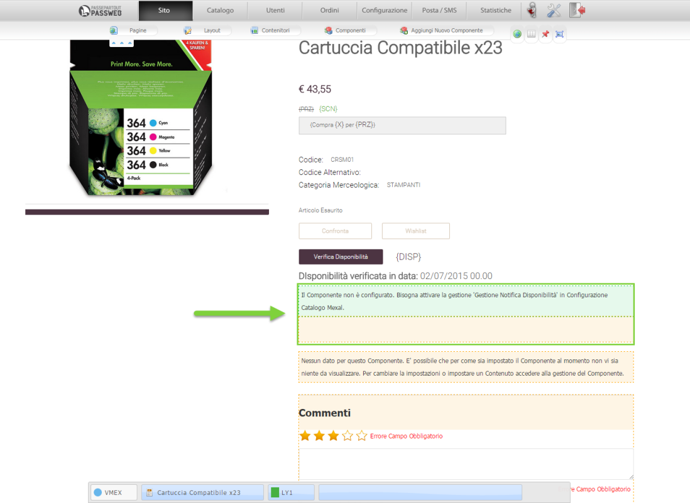

# BUONO SCONTO -- PROMOZIONI NON CONSENTITE

La sezione "**Promozioni non consentite**" permette di indicare le
"Promozioni in Carrello" che non dovranno essere applicate qualora
l'utente decida di utilizzare il Buono Sconto in esame.

Nel Box di sinistra sono indicate tutte le promozioni attualmente
codificate all'interno della sezione "*Ordini -- Promozioni --
Promozioni Carrello*" del Wizard (in nero sono evidenziate le Promozioni
attive)

E' quindi sufficiente selezionare quelle che si desidera disattivare in
concomitanza con l'utilizzo di un Buono Sconto ed inserirle poi nel box
di destra.

Nel caso di siti Ecommerce collegati ad uno dei gestionali Ho.Re.Ca. è
presente anche la sezione **"Promozioni Ho.Re.Ca. non consentite"**

che al pari della precedente permette di indicare le "Promozioni Horeca"
che non dovranno essere applicate qualora l'utente decida di utilizzare
il Buono Sconto in esame.

**ATTENZIONE! Le Promozioni Ho.Re.Ca. di tipo "Sconto Articolo / Prezzo
Fisso" e "Sconto Articolo Quantità" non sono considerate tra l'elenco
delle Promozioni da poter escludere nel caso di applicazione di
eventuali Buoni Sconto**

**ATTENZIONE!** **A default l'elenco delle promozioni non consentite è
vuoto** per cui, in condizioni normali, l'applicazione di un buono
sconto non preclude in alcun modo l'applicazione anche di eventuali
promozioni i cui sconti andranno quindi ad aggiungersi a quello definito
per il Buono Sconto in esame

