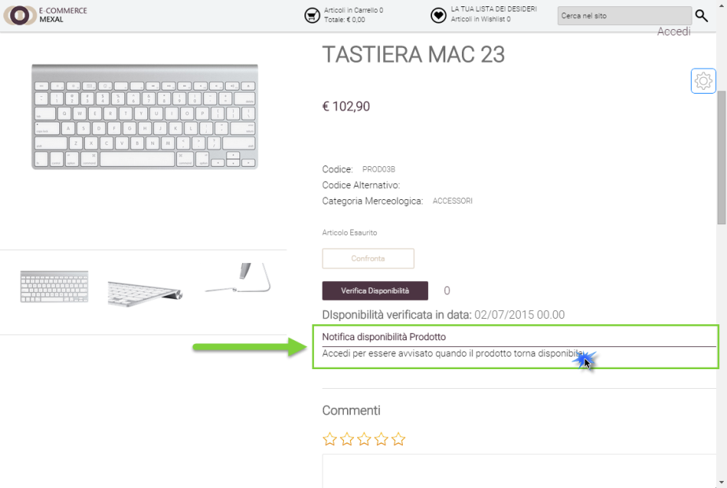
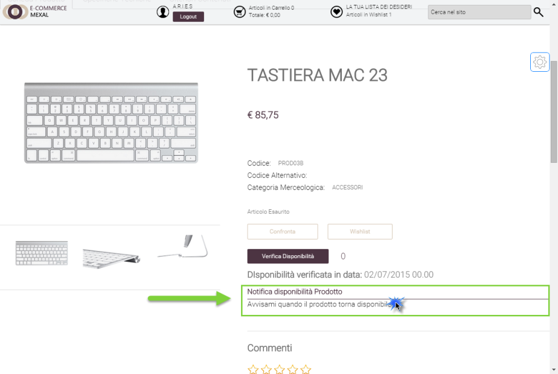
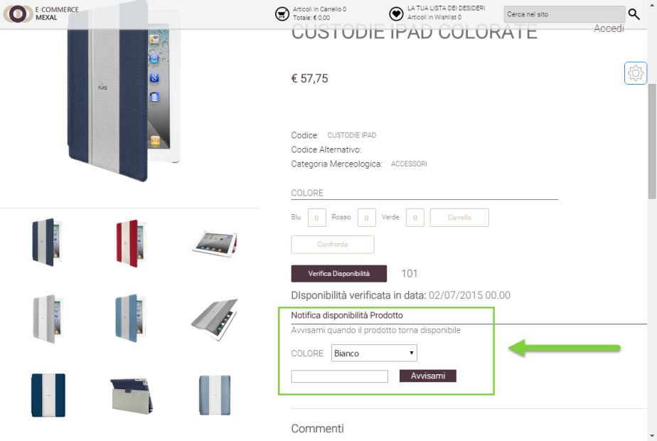
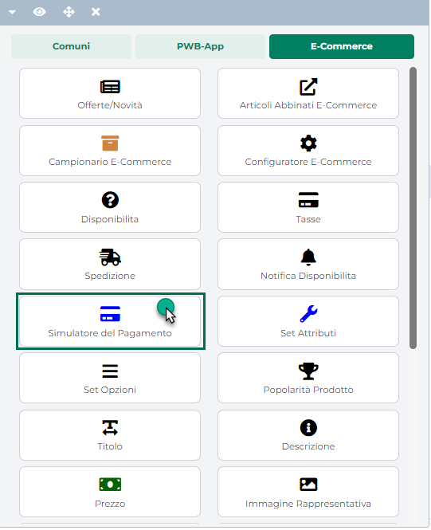
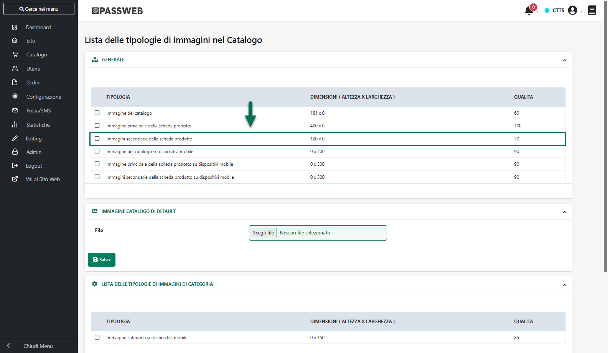
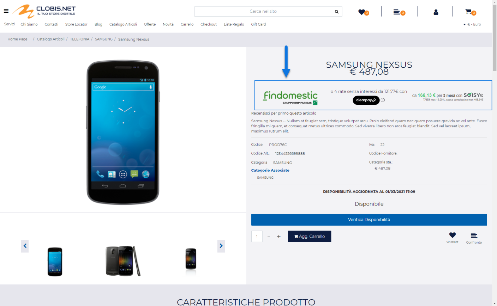
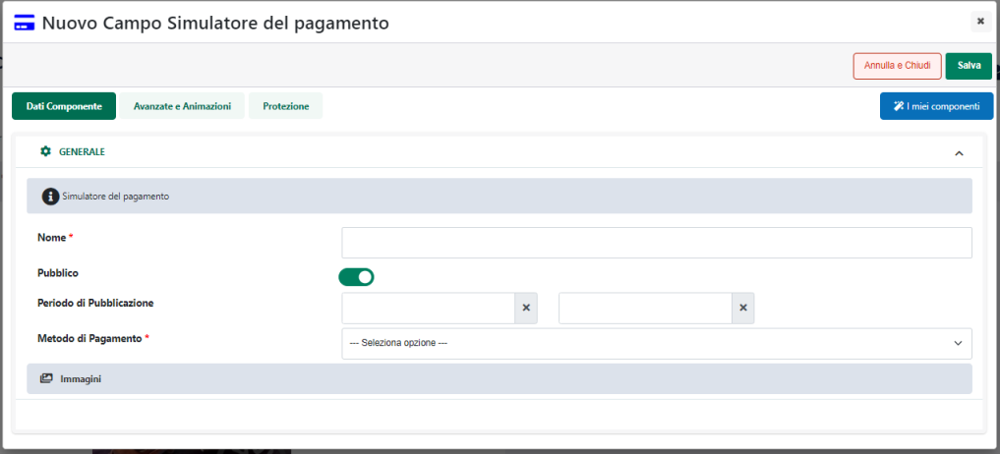
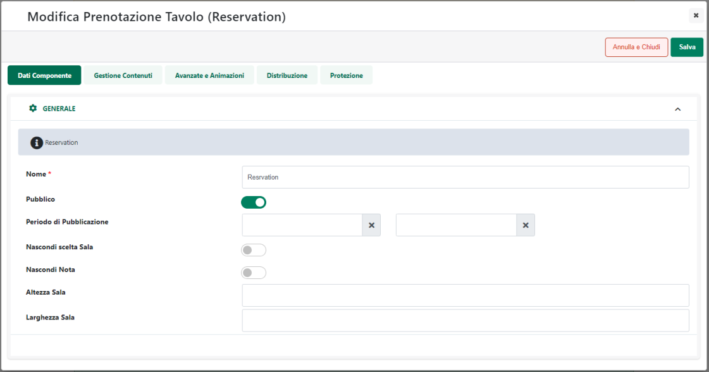
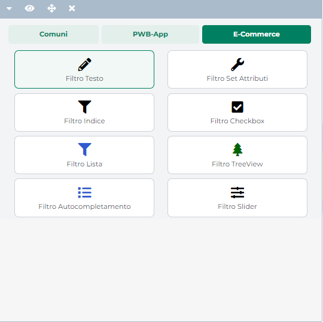

# BUONO SCONTO -- CODICI COUPON

Una volta definite tutte le caratteristiche (condizioni di
applicabilità, tipologia di sconti, gruppi consentiti ...) del Buono
Sconto che si desidera codificare l'ultimo, importante, passo sarà
ovviamente quello di generare manualmente o in maniera automatica, il/i
codici da associare al Buono Sconto stesso.

Per fare questo sarà necessario agire all'interno della sezione
"**Codici Coupon**"

**ATTENZIONE!** La sezione **Codici Coupon** verrà visualizzata solo
dopo aver effettuato un primo salvataggio del Buono Sconto in esame

I pulsanti presenti nella barra degli strumenti della sezione in oggetto
consentono rispettivamente di:.

**Aggiungi**
( )**:** permette di aggiungere in maniera
manuale un nuovo codice sconto.

Cliccando su questo pulsante verrà infatti aperta la maschera
"**Coupon**"

all'interno della quale poter indicare (campo **Nome**) il codice da
associare al Buono Sconto che si sta configurando e che dovrà quindi
essere inserito nel relativo campo del modulo d'ordine per poter
accedere alla corrispondente scontistica.

**ATTENZIONE! E' possibile inserire anche codici sconto già utilizzati
in altri Buoni in maniera tale da creare dei Buoni Sconto dinamici che
possano cioè variare automaticamente lo sconto applicato al variare
delle condizioni di applicabilità.**

Nello specifico se l'esigenza dovesse essere, ad esempio, quella di fare
in modo che con uno stesso codice venga applicato uno sconto in carrello
di 5 € nel momento in cui il totale merce fosse minore o uguale a 30 € e
di 10 € nel caso in cui il totale merce dovesse essere superiore ai 30
€, sarà necessario attivare due distinti Buoni Sconto con le seguenti
caratteristiche:

**[BUONO SCONTO 1]{.underline}**

- **Codice Sconto:** bsdinamico

- **Limite Massimo del Totale merce:** 30 €

- **Azione:** Sconto sul carrello -- Fisso -- Valore 5 €

**[BUONO SCONTO 2]{.underline}**

- **Codice Sconto:** bsdinamico

- **Limite Minimo del Totale merce:** 31 €

- **Azione:** Sconto sul carrello -- Fisso -- Valore 10 €

In queste condizioni nel momento in cui l'utente dovesse inserire nel
campo relativo all'applicazione dei Buoni Sconto il codice "bsdinamico"
verrà applicato automaticamente uno sconto di 5 o di 10 € a seconda del
fatto che il totale merce attuale sia inferiore o superiore ai 30 €

**Elimina**
( )**:** consente di eliminare il codice
sconto attualmente selezionato in elenco

**Svuota**
( )**:** consente di eliminare tutti i
codici sconto presenti in elenco

**Genera**
( )**:** consente di generare in maniera
automatica uno o più codici sconto. Cliccando su questo pulsante verrà
infatti visualizzata la maschera "**Generatore Codici Coupon**"

all'interno della quale poter impostare i parametri che dovranno essere
utilizzati nella generazione automatica dei codici sconto. In
particolare il campo:

- **Quantità Codici:** consente di impostare il numero complessivo di
  codici sconto che dovranno essere generati

- **Lunghezza Codice:** consente di impostare la lunghezza dei codici
  sconto che dovranno essere generati

- **Formato Codice:** consente di impostare il formato dei codici che
  dovranno essere generati. E' possibile creare codici Numerici,
  Alfabetici o Alfanumerici

- **Prefisso Codice:** consente di definire un eventuale prefisso da
  anteporre ad ogni singolo codice che verrà generato

- **Suffisso Codice:** consente di definire un eventuale suffisso da
  post porre ad ogni singolo codice che verrà generato

- **Trattino ogni X caratteri:** consente di inserire un carattere --
  ogni X caratteri del codice che verrà generato

Il pulsante "**Genera**" consente di avviare la creazione automatica dei
codici sconto secondo le specifiche impostate

**Esporta**
( )**:** consente di esportare tutti i
codici sconto presenti in elenco all'interno di un' apposito file .csv
in cui verrà indicato per ognuno di essi anche la sua data di creazione
e il numero di volte in cui è stato utilizzato

**Verifica**
( )**:** consente di verificare se i codici
sconto inseriti in elenco sono stati già utilizzati anche all'interno di
altri Buoni Sconto.

Cliccando su questo pulsante verrà infatti avviato un controllo sui
codici definiti all'interno di tutti i Buoni Sconto attualmente gestiti.

Nel momento in cui il controllo dovesse dare esito positivo, verrà
visualizzato nella parte bassa dello schermo un messaggio di
"**Univocità violata**" con l'indicazione dei codici sconto duplicati e
anche dei Buoni Sconto in cui questi stessi codici sono già stati
utilizzati

**ATTENZIONE!** Se da un lato il fatto di utilizzare uno stesso codice
sconto in più Buoni differenti può essere utile per realizzare dei Buoni
Sconto dinamici, dall'altro può anche essere potenzialmente pericoloso
perché utilizzando quello stesso codice l'utente potrebbe usufruire di
uno sconto che potrebbe non essere esattamente quello desiderato.

**Si consiglia quindi di effettuare sempre il controllo sull'univocità
dei codici sconto e di utilizzare uno stesso codice su più Buoni Sconto
differenti in maniera consapevole**

