# IMPOSTAZIONI GENERALI

All'interno di questa scheda è possibile settare tutti i parametri
necessari per specificare come dovranno essere gestiti gli ordini
all\'interno del sito web e come questi stessi ordini dovranno poi
essere inseriti nel gestionale.

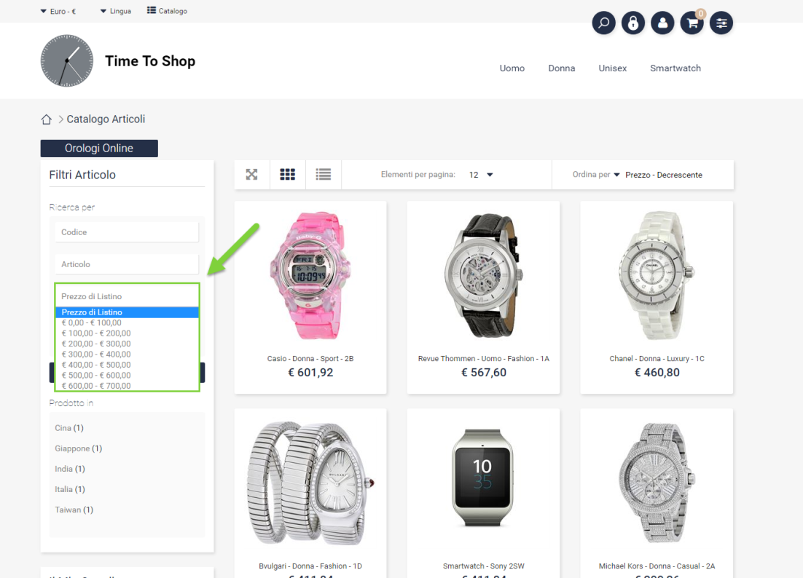

In particolare occorrerà indicare un valore per i seguenti parametri:

- **Documento Generato:** consente di stabilire la tipologia del
  documento che verrà generato e, conseguentemente, memorizzato
  all\'interno del gestionale. E\' possibile scegliere uno dei seguenti
  valori:

  - **Ordine (valore di default):** alla conferma del documento verrà
    generato un documento di tipo "**Ordine Cliente**" (OX oppure OC
    dipendentemente da chi effettua l'ordine e da come sono stati
    impostati i successivi parametri "Documento Clienti Privati \\
    Aziende");

  - **Preventivo:** alla conferma del documento, verrà generato un
    **Preventivo Cliente** (PX, PR oppure PC dipendentemente da chi
    effettua l'ordine e da come sono stati impostati i successivi
    parametri "Documento Clienti Privati \\ Aziende");

  - **A scelta:** sarà l\'utente che dovrà scegliere, alla conferma del
    documento se generare un documento di tipo "Ordine Cliente" oppure
    uno di tipo "Preventivo Cliente"

- **Documento Clienti Aziende:** consente di decidere, nel caso in cui
  ad effettuare l\'ordine sia un'Azienda, se all\'interno del gestionale
  dovrà essere generato un documento di tipo OC/PR (condizione di
  default), OX/PX oppure OC/PC

- **Documento Clienti Privati:** consente di impostare la tipologia di
  documento che dovrà essere generato sul gestionale nel momento in cui
  ad effettuare l'ordine dovesse essere un utente Privato e l'indirizzo
  di spedizione della merce dovesse appartenere ad uno dei Paesi che non
  rientra tra quelli gestibili mediante OSS (One Stop Shop)

- **Documento Clienti Privati OSS (One Stop Shop):** consente di
  impostare la tipologia di documento che dovrà essere generato sul
  gestionale nel momento in cui ad effettuare l'ordine dovesse essere un
  utente Privato e l'indirizzo di spedizione della merce dovesse
  appartenere ad uno dei Paesi che rientra tra quelli gestibili mediante
  OSS (One Stop Shop)

> **ATTENZIONE!** Per "**Paesi gestibili mediante OSS (One Stop Shop)**"
> si intendono tutti i paesi dell' Unione Europea ad esclusione di
> quello indicato in corrispondenza del parametro "**Paese Fiscale**"
> presente all'interno della sezione "*Configurazione -- Paese Lingua e
> Valuta -- Gestione Paese*" del Wizard

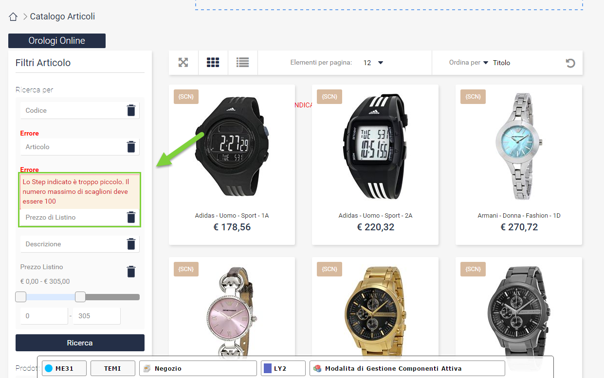

**NOTA BENE:** quanto impostato per i parametri "Documento Clienti
Privati", "Documento Clienti Privati OSS" e "Documento Clienti Aziende"
determinerà poi lo scorporo o il calcolo dell'Iva alle pagine "Carrello"
e "Ordine" del sito.

- **Numero di Serie del Documento:** consente di specificare il numero
  del sezionale all\'interno del quale verranno registrati, sul
  gestionale, i documenti di tipo "Ordine" provenienti dal sito
  e-commerce (è necessario verificare che il numero di serie indicato
  corrisponda ad un sezionale effettivamente gestito).

- **Numero di serie del Preventivo:** consente di specificare il numero
  del sezionale all\'interno del quale verranno registrati, sul
  gestionale, i documenti di tipo "Preventivo" provenienti dal sito
  e-commerce (è necessario verificare che il numero di serie indicato
  corrisponda ad un sezionale effettivamente gestito).

> **ATTENZIONE!** Il campo in esame verrà visualizzato solo nel caso in
> cui in relazione al parametro "Documento generato" sia stata
> selezionata l'opzione "A scelta" oppure "Preventivo"

- **Numero di Serie del Documento per Agente (solo Ecommerce Mexal):**
  consente di indicare uno specifico sezionale Mexal da utilizzare per
  la registrazione dei documenti di tipo "Ordine" provenienti dal sito
  e-commerce nel caso in cui sia un Agente ad effettuare l'acquisto per
  conto di un suo cliente (è necessario verificare che il numero di
  serie indicato corrisponda ad un sezionale Mexal effettivamente
  gestito).

- **Numero di Serie del Preventivo per Agente (solo Ecommerce Mexal):**
  consente di indicare uno specifico sezionale Mexal da utilizzare per
  la registrazione dei documenti di tipo "Preventivo" provenienti dal
  sito e-commerce nel caso in cui sia un Agente ad effettuare l'acquisto
  per conto di un suo cliente (è necessario verificare che il numero di
  serie indicato corrisponda ad un sezionale Mexal effettivamente
  gestito).

> **ATTENZIONE!** Il campo in esame verrà visualizzato solo nel caso in
> cui in relazione al parametro "Documento generato" sia stata
> selezionata l'opzione "A scelta" oppure "Preventivo"

- **Verifica Disponibilità Gestionale:** consente di attivare un
  controllo, in fase di checkout, sulla disponibilità degli articoli
  presenti in ordine effettuando un collegamento in tempo reale con il
  gestionale.

> **ATTENZIONE!** Ovviamente ha senso attivare un controllo di questo
> tipo solo nel caso in cui il parametro "**Gestione Acquisto**"
> presente alla pagina "**Configurazione Parametri Catalogo**" del
> Wizard sia stato impostato sull'opzione "**Acquista solo se
> disponibile**"
>
> E' possibile selezionare una delle seguenti opzioni:

- **No**: in queste condizioni non verrà effettuato nessun tipo di
  controllo in fase di checkout relativamente alla disponibilità degli
  articoli in ordine

- **Si**: in queste condizioni, alla conferma dell'ordine, verrà
  effettuato un controllo sulla reale disponibilità degli articoli
  coinvolti effettuando un collegamento in tempo reale con il
  gestionale.

> Nel caso in cui gli articoli risultino effettivamente disponibili,
> Passweb provvederà a chiudere l'ordine.
>
> Al contrario, nel momento in cui il controllo effettuato dovesse
> rilevare che alcuni degli articoli in ordine non risultano più
> disponibili, verrà visualizzata all'utente un'apposita notifica e
> l'ordine non potrà essere concluso.

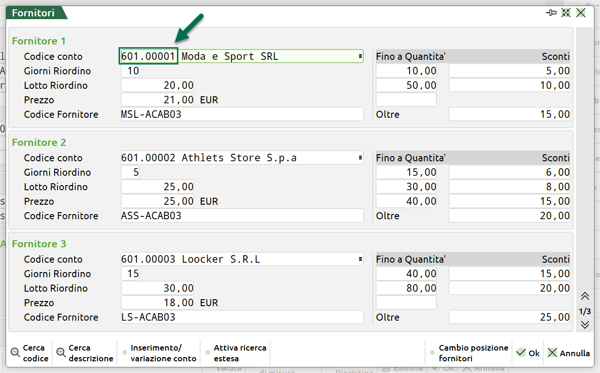

- **No se documento Agente -- solo Ecommerce Mexal**: in queste
  condizioni il controllo in fase di checkout sulla disponibilità degli
  articoli in ordine verrà effettuato solo nel caso in cui sia il
  cliente ad effettuare l'ordine (e non un Agente per suo conto)

- **Si se documento Agente -- solo Ecommerce Mexal**: in queste
  condizioni il controllo in fase di checkout sulla disponibilità degli
  articoli in ordine verrà effettuato solo nel caso in cui ad effettuare
  l'ordine sia un Agente per conto del cliente

> **ATTENZIONE!** il collegamento con il gestionale per la verifica
> della disponibilità degli articoli in ordine potrebbe richiedere
> diverso tempo e potrebbe quindi aumentare il tempo necessario a
> chiudere il checkout e a visualizzare il messaggio di "ordine
> effettuato"
>
> **ATTENZIONE!** nel caso in cui il collegamento con il gestionale
> dovesse restituire un errore (ad esempio perché in quel preciso
> momento il gestionale potrebbe non essere raggiungibile) l'ordine
> verrà comunque concluso indipendentemente dalla reale disponibilità
> dei prodotti

- **Magazzino:** numero del magazzino oggetto della movimentazione (è
  possibile selezionare uno qualsiasi dei magazzini effettivamente
  gestiti all'interno del gestionale).

- **Numero della Causale del Movimento di Magazzino Documento:**
  consente di indicare il numero identificativo della causale con cui
  memorizzare il documento all'interno del gestionale nel momento in cui
  il documento stesso dovesse essere un Ordine

- **Numero della Causale del Movimento di Magazzino Preventivo**:
  visualizzato solo nel caso in cui per il parametro "Documento
  generato" sia stata selezionata l'opzione "A scelta" oppure
  "Preventivo"**.**

> Consente di indicare il numero identificativo della causale con cui
> memorizzare il documento all'interno del gestionale nel momento in cui
> il documento stesso dovesse essere un Preventivo.
>
> **ATTENZIONE!** volendo è possibile abilitare la selezione delle
> casuali del movimento di magazzino lato front end direttamente in fase
> di checkout in maniera tale dunque che sia l'utente stesso
> (tipicamente un Agente) a poter decidere quale dovrà essere la causale
> da utilizzare per il documento in esame (indipendentemente da quanto
> impostato per i parametri "Numero della Causale del Movimento di
> Magazzino Documento / Preventivo)
>
> Per maggiori informazioni in merito si veda anche quanto indicato
> all'interno del capitolo "*Ordini -- Ordini -- Causali Documento*" di
> questo manuale

- **Numero del Centro di Costo (solo Ecommerce Mexal):** consente di
  indicare il valore da attribuire al campo "**Costi/ricavi**" presente,
  sul gestionale, nella testata dell'ordine

- **Nuova Riga Evadibile di default (solo Ecommerce Mexal):** consente
  di impostare, se selezionato, il campo "**Tipo**" presente in testata
  del documento Mexal (nella maschera di "Emissione/Revisione
  documenti") ad **E** in maniera tale che eventuali righe aggiunte al
  documento siano automaticamente evadibili (stato E)

- **Spedizione documento interamente evadibile (solo Ecommerce Mexal):**
  consente di impostare, se selezionato, il campo "**Tipo**" presente in
  testata del documento Mexal (nella maschera di "Emissione/Revisione
  documenti") a **I** rendendo quindi il documento stesso evadibile da
  "Emissione Differita" solo ed esclusivamente nel caso in cui tutte le
  righe del documento siano state poste a E (evadibili)

> **ATTENZIONE!** Nel caso in cui entrambi i parametri precedenti siano
> stati selezionati, il campo "Tipo" presente in testata del documento
> Mexal verrà impostato sul valore **"EI"**

- **Contropartita (solo Ecommerce Mexal):** consente di indicare la
  Contropartita che dovrà poi essere riportata sulle righe del relativo
  documento in fase di memorizzazione all'interno del gestionale (F6 nel
  campo quantità della riga presente in \"Emissione-Revisione
  Documenti\")

> **ATTENZIONE!** Sono accettati valori numerici compresi all'interno
> dell'intervallo 1-120 e identificativi della relativa Contropartita
> codificata in Mexal all'interno della tabella \"**Magazzino -- Tabelle
> generali -- Contropartite**\"

- **Nota Nuovo Ordine (solo Ecommerce Mexal):** consente di specificare
  una nota che verrà poi riportata all'interno del corrispondente campo
  "Note" presente nella testata del documento Mexal generato a seguito
  dell'inserimento di un nuovo ordine da web.

> Il testo inserito all'interno di questo campo verrà riportato
> indistintamente in tutti i nuovi ordini Mexal
>
> Nel momento in cui l'esigenza dovesse essere invece quella di inserire
> un elemento che possa variare in relazione allo specifico ordine sarà
> necessario utilizzare uno dei segnaposto messi a disposizione da
> Passweb e richiamabili cliccando sul relativo pulsante "**Aggiungi
> Segnaposto**"
>
> Sono gestiti i seguenti segnaposto:

- **Numero Documento:** consente di inserire all'interno del campo in
  oggetto il segnaposto **\$id\$** che verrà poi sostituito in fase di
  creazione ordine su Mexal con l'identificativo assegnato all'ordine
  stesso all'interno di Passweb

- **Riferimento Ordine Marketplace:** campo presente solo nel caso in
  cui sia stato attivato almeno un account di integrazione verso i
  marketplace Amazon, eBay o verso un cms terzo (Prestashop, Magento)

> Consente di inserire il segnaposto **\$referenceMarketplace\$** che
> verrà poi sostituito in fase di creazione ordine su Mexal con
> l'identificativo assegnato all'ordine sulla piattaforma esterna da cui
> l'ordine stesso viene prelevato

- **Numero Contratto Nexi**: consente di inserire all'interno del campo
  in oggetto il segnaposto **\$billing_nexiContractNumber\$** che verrà
  poi sostituito in fase di creazione ordine su Mexal con il "Numero
  Contratto" creato a seguito di un pagamento ricorrente gestito con
  Nexi

> Per maggiori informazioni relativamente alla gestione con Nexi dei
> pagamenti ricorrenti si rimanda a quanto indicato nel relativo
> capitolo di questo manuale ("*Ordini -- Metodi di Pagamento -- Nexi
> Xpay Pro -- Pagamenti Ricorrenti*")
>
> Nel momento in cui l'esigenza dovesse essere quella di valorizzare il
> campo Note dei documenti Mexal con l'identificativo assegnato
> all'ordine sui Marketplace esterni solo per gli ordini importati
> effettivamente da tali marketplace e, in tutti gli altri casi, con
> l'identificativo Passweb sarà necessario valorizzare il campo in esame
> come di seguito indicato
>
> **\$if(referenceMarketplace)\$\$referenceMarketplace\$\$else\$\$id\$\$endif\$**
>
> **ATTENZIONE!** nel caso in cui l'identificativo assegnato al
> documento in Passweb, o lo specifico valore definito per il campo in
> questione dovesse superare il numero di caratteri ammessi dal
> corrispondente campo gestionale questa informazione, all'interno del
> gestionale stesso, sarà ovviamente troncata..

- **Numero della Categoria di Annullamento per Cancellazione (solo
  Ecommerce Mexal):** numero identificativo della causale Mexal
  utilizzata per indicare che l\'ordine annullato è relativo agli
  acquisti effettuati tramite il sito e-commerce (utile per fare una
  ricerca, da Mexal, di tutti gli ordini annullati provenienti dal
  sito);

- **Scadenza Documento (solo Ecommerce Mexal):** numero di giorni da
  sommare alla data in cui viene effettuato l\'ordine per determinare la
  data di scadenza che verrà poi inserita in testata del corrispondente
  documento Mexal.

> Inserendo in questo campo il valore 0 la data di scadenza
> corrisponderà esattamente con la data di inserimento dell'ordine.
>
> **Nel caso in cui non si voglia invece gestire sull'ordine una
> specifica data di scadenza, il campo in oggetto dovrà essere lasciato
> vuoto. Allo stesso modo non dovranno, ovviamente, essere inserite, in
> queste condizioni, neppure specifiche scadenze di riga per gli
> articoli in carrello.**

**NOTA BENE:** in perfetto accordo con le logiche gestionali, eventuali
date di scadenza inserite in riga, per gli articoli presenti in
carrello, saranno prioritarie rispetto ad una eventuale data di scadenza
inserita in testata del documento.

- **Stato della Riga Ordine (solo Ecommerce Mexal):** consente di
  specificare lo stato in cui dovranno essere poste, in Mexal, le varie
  righe dell'ordine all\'atto della sua creazione all'interno del
  gestionale. E' possibile selezionare uno dei seguenti valori:

  - **Evadibile:** in queste condizioni ogni riga dell'ordine nascerà,
    all'interno del gestionale, con stato impostato ad **E**
    (Evadibile), indipendentemente dalla effettiva disponibilità dei
    singoli articoli

  - **Sospesa:** in queste condizioni ogni riga dell'ordine nascerà,
    all'interno del gestionale, con stato impostato ad **S** (Sospesa),
    indipendentemente dalla effettiva disponibilità dei singoli articoli

  - **Bloccata:** in queste condizioni ogni riga dell'ordine nascerà,
    all'interno del gestionale, con stato impostato ad **B** (Bloccata),
    indipendentemente dalla effettiva disponibilità dei singoli articoli

  - **Sospesa o Evadibile in base alla Disponibilità:** in queste
    condizioni, in fase di inserimento dell'ordine all'interno del
    gestionale verrà effettuato un controllo per ogni singolo articolo
    presente all'interno del documento; se la disponibilità
    dell'articolo dovesse essere superiore alla quantità inserita in
    ordine per quello stesso articolo, allora la relativa riga del
    documento verrà posta nello stato **E (Evadibile)**; in caso
    contrario lo stato della riga verrà posto a **S (Sospesa)**

  - **Bloccata o Evadibile in base alla Disponibilità:** in queste
    condizioni, in fase di inserimento dell'ordine all'interno del
    gestionale verrà effettuato un controllo per ogni singolo articolo
    presente all'interno del documento; se la disponibilità
    dell'articolo dovesse essere superiore alla quantità inserita in
    ordine per quello stesso articolo, allora la relativa riga del
    documento verrà posta nello stato **E (Evadibile)**; in caso
    contrario lo stato della riga verrà posto a **B** (Bloccata)

**NOTA BENE:** il tipo di disponibilità (Netta, Lorda, Esistenza ecc...)
che verrà valuta nei due casi sopra evidenziati, ed in base alla quale
dunque l'applicazione dovrà decidere se far nascere le righe dell'ordine
nello stato E piuttosto che nello stato S o B, è quello impostato
all'interno del campo **"Disponibilità"** presente nell'omonima sezione
della pagina **"Catalogo -- Configurazione Parametri Catalogo"** del
Wizard.

- **Richiesta Creazione/Sostituzione Matrice (solo Ecommerce Mexal):**
  attivazione/sostituzione dei documenti matrice in Mexal (funzione
  abilitata solamente se attivato in Mexal il corrispondente parametro
  in *"Anagrafica Azienda/F4/Videate Aziendali/Parametri di
  magazzino"*);

- **Periodo visualizzazione Documenti:** consente di impostare
  l'intervallo temporale oltre il quale ordini, bolle e fatture,
  dovranno essere automaticamente eliminate dal sito. Il periodo
  impostabile varia da 1 a 5 anni. A default il campo viene impostato a
  2 anni.

- **Gestione Ordini da Mexal / Ho.Re.Ca.:** impostato a **NO** consente
  all'utente di gestire gli ordini nello stato di SOSPESO all'interno
  del sito web, potendo quindi decidere se modificarli, confermarli o
  annullarli. Impostato a **SI** gli ordini verranno gestiti unicamente
  all'interno del gestionale e l'utente non avrà dunque alcuna
  possibilità di intervento sugli ordini nello stato di SOSPESPO;

- **Sincronizzazione Completa alla conferma dell'Ordine:** se impostato
  a **SI** consente di lanciare automaticamente una sincronizzazione
  completa ogni volta che viene effettuato un ordine sul sito web. Se
  impostato a **NO** effettuando un ordine all\'interno del sito web non
  viene lanciata, infine, alcuna sincronizzazione;

**NOTA BENE:** in ogni caso, indipendentemente dal valore impostato per
il precedente parametro, nel caso in cui il gestionale sia raggiungibile
e in assenza dunque di problemi di connettività, confermando un ordine
all'interno del sito, questo verrà immediatamente inserito all'interno
del gestionale senza scalare nessuna delle sincronizzazioni previste da
contratto.

> Nel caso in cui, invece, all'atto della conferma dell'ordine sul sito
> siano presenti problemi di connettività tra il sito ed il server
> Mexal, si tenterà di inserire l'ordine nel gestionale soltanto alla
> prossima sincronizzazione.
>
> **L'impostazione di questo parametro ha effetto anche sulla
> sincronizzazione lanciata automaticamente alla validazione di ordini
> in stato di "Pagamento non Confermato".** Per maggiori informazioni in
> merito si veda anche al sezione di questo manuale relativa alla
> configurazione delle varie modalità di pagamento.

- **Valorizzare sempre "Agente" e "Condizioni Agente" se Cliente -- solo
  Ecommerce Mexal:**

> Consente di decidere se valorizzare o meno i campi "**Agente**" e
> "**Cond**" (Condizione agente) in testata al documento **nel caso in
> cui ad effettuare l'ordine sia un cliente**.

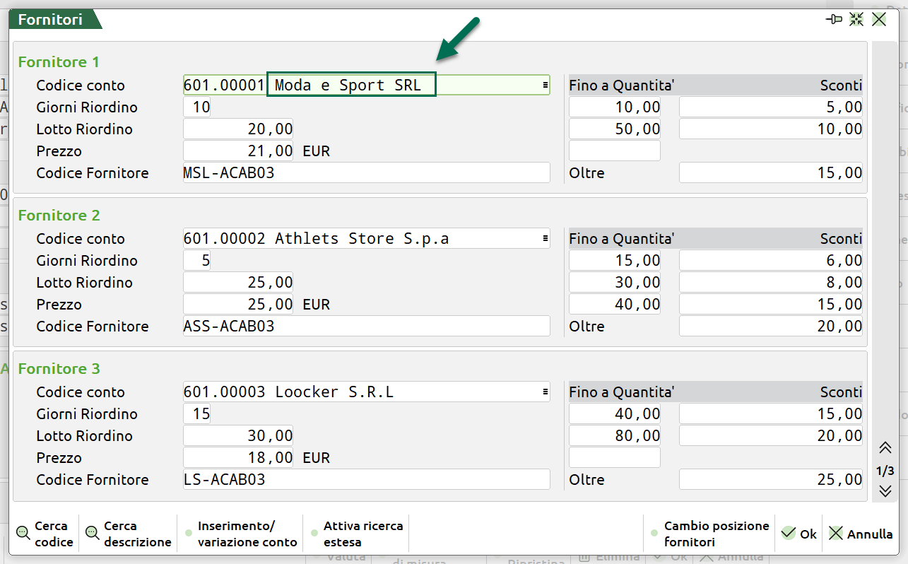

> E' possibile selezionare una delle seguenti opzioni:

- **SI**: in questo caso i campi sopra evidenziati verranno valorizzati,
  in fase di inserimento ordine in Mexal impostando in testata l'Agente
  e l'eventuale Condizione Agente indicate nell'anagrafica del cliente
  intestatario dell'ordine

- **NO:** in questo caso i campi sopra evidenziati non verranno
  valorizzati

> **ATTENZIONE!** affinché il campo "**Cond**" possa essere
> correttamente valorizzato nella testata del documento Mexal scatenando
> quindi la ripartizione delle provvigioni agente, è necessario aver
> abilitato, all'interno del gestionale, la "**Gestione Multi Agente**".
> Per maggiori informazioni in merito si rimanda all'apposita sezione
> del manuale Mexal.

- **Valorizzare sempre "Agente" e "Condizioni Agente" se Agente -- solo
  Ecommerce Mexal:**

> Consente di decidere se valorizzare o meno i campi "**Agente**" e
> "**Cond**" (Condizione agente) in testata al documento **nel caso in
> cui ad effettuare l'ordine sia un Agente**.
>
> E' possibile selezionare una delle seguenti opzioni:

- **Solo se Agente di vendita** (opzione di default): in questo caso il
  campo "**Agente**" presente nella testata del documento Mexal verrà
  valorizzato sempre con l'Agente che ha effettuato l'ordine.

> Il campo "**Cond**" invece verrà impostato con l'eventuale Condizione
> Agente indicata nell'anagrafica del cliente intestatario dell'ordine
> solo però nel caso in cui l'Agente che ha effettuato l'ordine coincide
> con l' "**Agente1**" della condizione.

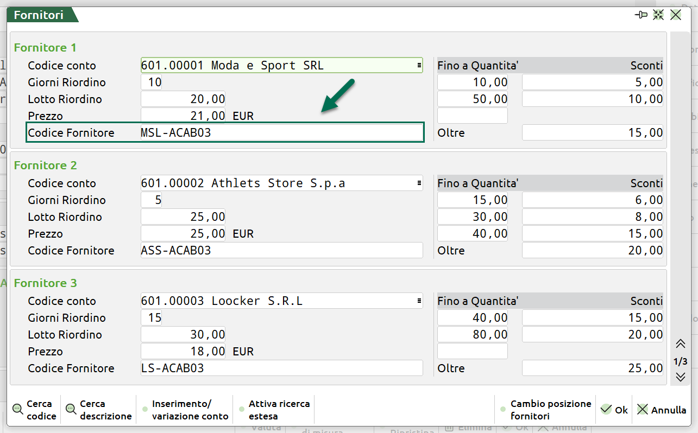

- **Solo se Agente Condizione a qualunque livello**: in questo caso il
  campo "**Agente**" presente nella testata del documento Mexal verrà
  valorizzato sempre con l'Agente che ha effettuato l'ordine.

> Il campo "**Cond**" invece verrà impostato in testata solo se l'Agente
> che ha fatto l'ordine coincide con l' "**Agente1**" della condizione.
>
> Nel caso in cui l'Agente che ha effettuato l'ordine non dovesse
> coincidere con l' "**Agente1**" ma dovesse comunque essere presente
> tra gli agenti della condizione, questa verrà inserita sulla riga
> articolo

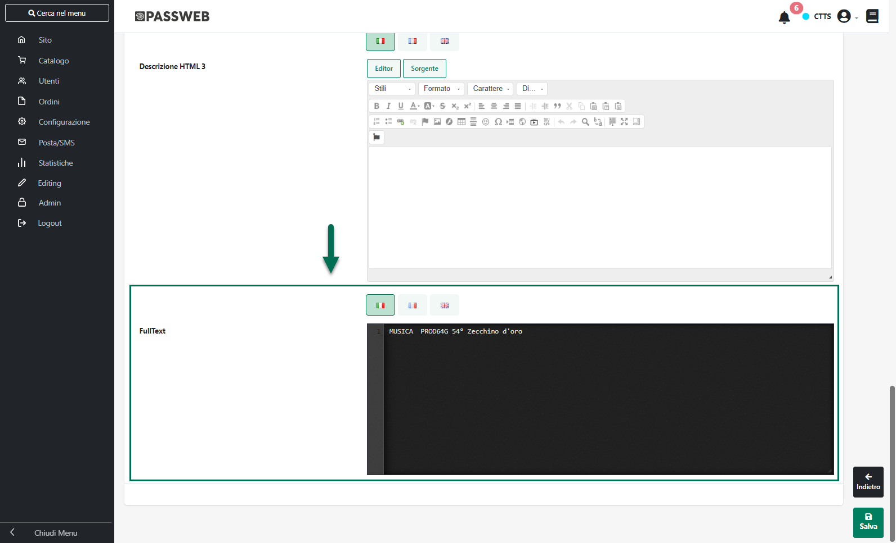

> **ATTENZIONE!** si ricorda che nel caso in cui, in fase di codifica
> della provvigione, siano stati indicati un'Agente e/o una condizione
> specifica per quella provvigione (pulsante "Agenti") saranno sempre
> questi ad essere inseriti in riga articolo indipendentemente
> dall'Agente che ha effettuato l'ordine

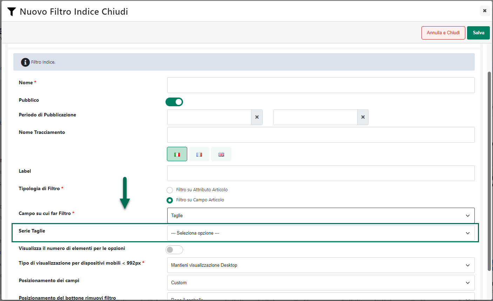

- **Sempre**: in questo caso il campo "**Agente**" presente nella
  testata del documento Mexal verrà valorizzato sempre con l'Agente che
  ha effettuato l'ordine.

> Il campo "**Cond**" invece verrà impostato in testata solo se l'Agente
> che ha fatto l'ordine coincide con l' "**Agente1**" della condizione.
>
> Nel caso in cui l'Agente che ha effettuato l'ordine non dovesse
> coincidere con l' "Agente1" della condizione, questa verrà comunque
> inserita sulla riga articolo indipendentemente dal fatto che l'Agente
> che ha effettuato l'ordine compaia o meno tra gli agenti della
> condizione
>
> **ATTENZIONE!** si ricorda che nel caso in cui, in fase di codifica
> della provvigione, siano stati indicati un'Agente e/o una condizione
> specifica per quella provvigione (pulsante "Agenti") saranno sempre
> questi ad essere inseriti in riga articolo indipendentemente
> dall'Agente che ha effettuato l'ordine

- **Gestione Clienti Agente (solo Ecommerce Mexal):** attraverso questo
  parametro è possibile decidere se un agente potrà gestire all'interno
  del sito solo ed esclusivamente i clienti ad esso associati in maniera
  diretta all'interno del gestionale (opzione "**L'agente gestisce i
  suoi clienti**") o anche quelli inseriti manualmente, attraverso le
  apposite funzioni del Wizard di Passweb, in eventuali sottogruppi del
  gruppo utenti cui esso appartiene (opzione "**L'agente gestisce i suoi
  clienti e quelli assegnati nei gruppi Passweb**").

> **Resta ovviamente valido il concetto gerarchico grazie al quale ogni
> Agente ha sempre la possibilità di gestire anche clienti associati
> all'interno del gestionale a quelli che, nella gerarchia utenti di
> Passweb, vengono considerati come suoi Sotto Agenti.**

- **Visualizzazione documenti Agente (solo Ecommerce Mexal):**
  attraverso questo parametro è possibile specificare quali documenti
  (ordini/bolle/fatture) dovranno o meno essere visualizzati in Area
  Riservata ai vari Agenti gestiti sul sito. Nello specifico, è
  possibile selezionare uno dei seguenti valori:

  - **Mostra i documenti dei clienti dell'Agente:** selezionando questo
    valore ogni agente avrà la possibilità di visualizzare in Area
    Riservata, all'interno dell'apposita sezione (Business -- Ordini),
    **tutti i documenti intestati ai clienti dello specifico Agente più
    quelli intestati a clienti di suoi eventuali Sotto-Agenti** (dove
    per Sotto-Agenti si intendono agenti collocati nella struttura
    gerarchica definita all'interno di Passweb, ad un livello inferiore
    a quello dell'agente attualmente considerato). Questo
    indipendentemente dal fatto che per tali documenti, in Mexal, sia
    stato valorizzato o meno, in testata, il campo "Agente".

  - **Mostra i documenti assegnati all'Agente:** selezionando questo
    valore ogni agente avrà la possibilità di visualizzare in Area
    Riservata, all'interno dell'apposita sezione (Business -- Ordini),
    **solo ed esclusivamente quei documenti che sono stati
    specificatamente assegnati a lui o ad uno dei suoi Sotto-Agenti.**

> In queste condizioni dunque eventuali documenti intestati a clienti
> dell'Agente considerato o a clienti di eventuali suoi Sotto-Agenti,
> che non hanno però, in Mexal, il campo Agente valorizzato (con il
> codice dell'Agente stesso o di uno dei suoi Sotto-Agenti), non
> potranno essere da lui visualizzati all'interno del sito.

- **Valorizzare sempre le Videate Riportabili di Testata (solo Ecommerce
  Mexal):** se impostato a SI consente, quando viene inserito un\'
  ordine in Mexal, di valorizzare le Videate Riportabili di Testata con
  i dati presenti negli stessi campi dell\'anagrafica clienti. Al
  contrario impostando questo parametro a NO, all\'interno del documento
  Mexal (maschera di Emissione/Revisione Documenti) non verranno poi
  valorizzate le eventuali Videate Riportabili di Testata, pur essendo
  le stesse videate correttamente valorizzate in anagrafica clienti;

- **Valorizzare sempre le Videate Riportabili di Riga (solo Ecommerce
  Mexal):** se impostato a SI consente, quando viene inserito un\'
  ordine in Mexal, di valorizzare per ogni articolo presente nel
  documento, le videate riportabili utente con i dati presenti negli
  stessi campi dell\'anagrafica articoli. Al contrario impostando questo
  parametro a NO, all\'interno del documento Mexal (maschera di
  Emissione/Revisione Documenti) non verranno poi valorizzate per i
  singoli articoli le eventuali videate riportabili utente, pur essendo
  le stesse videate correttamente valorizzate in anagrafica articoli;

- **Note sul Documento:** consente di decidere se le note eventualmente
  inserite all'interno del carrello (note di riga) o in fase di checkout
  ordine (note di corpo) dovranno essere gestite, sul documento
  gestionale, come note Riportabili o non Riportabili. E' possibile
  selezionare, dunque, uno dei seguenti valori

  - **Riportabile:** in questo caso le note eventualmente inserite a
    livello di carrello o di checkout verranno gestite lato Mexal come
    note Riportabili. Tali note verranno quindi riportate anche nei
    documenti successivi alla trasformazione dell\'ordine (bolla e
    fattura).

  - **Non Riportabile:** in questo caso le note eventualmente inserite a
    livello di carrello o di checkout verranno gestite lato Mexal come
    note NON Riportabili, e come tali saranno presenti solo ed
    esclusivamente nei documenti originari (ordini o preventivi).

- **Visualizzare lo stato della riga:** se impostato a **SI** consente
  di visualizzare all'interno del sito lo stato (SOSPESA, EVASA o
  ANNULLATA) di ogni singola riga dell'ordine.

> **ATTENZIONE!** Nel caso in cui sia stato utilizzato il componente
> "**Ordine (Checkout)**", dipendentemente dal fatto di aver impostato o
> meno a SI questo parametro, nel riepilogo del dettaglio dell'ordine
> potrà essere visualizzata un'apposita colonna con lo stato di ogni
> singola riga, come evidenziato nella figura sopra riportata.
>
> Nel caso in cui si sia deciso di utilizzare invece il componente
> "**Ordine Custom (Checkout)**", l'impostazione a SI di questo
> parametro non è sufficiente alla visualizzazione del dato all'interno
> del riepilogo ordine. In queste condizioni infatti oltre ad impostare
> a SI questo parametro sarà poi necessario inserire all'interno
> dell'Ordine Custom anche il componente "**Dati Articolo**" mappato con
> l'elemento "**Stato Riga Gestionale**"
>
> Per maggiori informazioni relativamente alla gestione dei componenti
> "**Ordine (Checkout)**" e "**Ordine Custom (Checkout)**" si vedano
> anche gli appositi capitoli all'interno della sezione *"Live Editing"*
> di questo manuale.

- **Aliquota IVA Spese Trasporto (solo Ecommerce Ho.Re.Ca.)**: consente
  di impostare un'aliquota iva fissa che verrà poi utilizzata nel
  calcolo dell'IVA sulle spese di trasporto.

> Per maggiori informazioni in merito si veda anche la sezione "*Ordini
> -- Configurazione Metodi di Trasporto*" di questo manuale

- **Gestione del Pagamento Abituale:** consente di decidere se
  visualizzare o meno per il cliente che sta effettuando l'ordine
  l'eventuale pagamento abituale ad esso associato all'interno del
  gestionale.

> E' possibile selezionare una delle seguenti opzioni:

- **Non Abilitato**: in fase di checkout, il cliente potrà selezionare
  solo ed esclusivamente uno dei pagamenti opportunamente abilitati
  all'interno del Wizard. In queste condizioni dunque, se anche il
  cliente avesse associato, sul gestionale, un pagamento abituale questo
  potrebbe comunque non essere selezionabile in fase di checkout sul
  sito (né tanto meno potrà essere quello selezionato a default)

- **Abilitato**: in fase di checkout, il cliente potrà selezionare oltre
  ai pagamenti abilitati all'interno del Wizard di Passweb, anche
  l'eventuale pagamento abituale ad esso associato all'interno del
  gestionale.

> In queste condizioni inoltre il pagamento abituale sarà anche quello
> selezionato a default.
>
> **ATTENZIONE!** la possibilità di selezionare o meno il proprio
> pagamento abituale può dipendere anche da eventuali Linee Articolo
> associate allo specifico pagamento e/o da eventuali metodi di
> trasporto selezionati dall'utente in fase di acquisto. Per maggiori
> informazioni in merito si veda anche la sezione "*Configurazione
> Modalità di Pagamento*" di questo manuale.

- **Abilitato Esclusivo:** in queste condizioni se l'utente che sta
  effettuando l'ordine dovesse avere associato all'interno del
  gestionale un pagamento abituale, questo sarà l'unica opzione che gli
  verrà proposta in fase di checkout. Nel momento in cui l'utente non
  dovesse avere nessun pagamento abituale associato, potrà invece
  scegliere tra uno qualsiasi dei pagamenti abilitati dal Wizard di
  Passweb

<!-- -->

- **Gestione del Trasporto Abituale (solo Ecommerce Mexal):** consente
  di decidere se visualizzare o meno per il cliente che sta effettuando
  l'ordine il Vettore Abituale ad esso associato all'interno del
  gestionale.

> E' possibile selezionare una delle seguenti opzioni:

- **Non Abilitato:** in fase di checkout, il cliente potrà selezionare
  solo ed esclusivamente uno dei Vettori di tipo Passweb opportunamente
  codificati e abilitati all'interno del Wizard.

> In queste condizioni dunque, le spese di trasporto potranno essere
> calcolate unicamente sulla base di quanto impostato all'interno di
> Passweb e se anche il cliente dovesse avere un Vettore abituale
> associato all'interno del gestionale questo non verrà comunque preso
> in considerazione ne tanto meno mostrato tra le possibili opzioni di
> scelta

- **Abilitato:** in fase di checkout il cliente potrà selezionare, oltre
  ai Vettori di tipo Passweb opportunamente codificati e abilitati
  all'interno del Wizard, anche l'eventuale Vettore abituale ad esso
  associato direttamente all'interno del gestionale

> **ATTENZIONE!** la possibilità di selezionare o meno il proprio
> vettore abituale può dipendere anche da eventuali Linee Articolo
> associate allo specifico metodo di trasporto. Per maggiori
> informazioni in merito si veda anche la sezione "*Configurazione
> Metodi di trasporto*" di questo manuale.

- **Abilitato Esclusivo:** selezionando questa opzione, nel momento in
  cui l'utente che sta effettuando l'ordine dovesse avere associato
  all'interno del gestionale un Vettore abituale, questo sarà l'unica
  opzione che gli verrà proposta in fase di checkout. Nel momento in cui
  l'utente non dovesse avere nessun Vettore abituale associato, potrà
  invece scegliere tra uno qualsiasi dei Vettori di tipo Passweb
  opportunamente codificati e abilitati all'interno del Wizard

- **Abilitato Esclusivo Vettore**: selezionando questa opzione, nel
  momento in cui l'utente che sta effettuando l'ordine dovesse avere
  associato all'interno del gestionale un Vettore abituale, verranno
  automaticamente nascosti tutti i trasporti di tipo Passweb con il
  campo "**Codice Gestionale del Vettore**" impostato sullo stesso
  codice conto del Vettore Abituale associato all'utente in esame

<!-- -->

- **Gestione del Calcolo Automatico Colli (solo Ecommerce Mexal)**:
  consente di abilitare la relativa funzione gestionale per il calcolo
  automatico dei colli presenti nel documento.

> E' possibile selezionare uno dei seguenti valori:

- **SI:** selezionando questa opzione il campo "**Colli**" presente nel
  piede del documento Mexal verrà impostato ad "**A**" abilitando di
  fatto il calcolo automatico dei colli

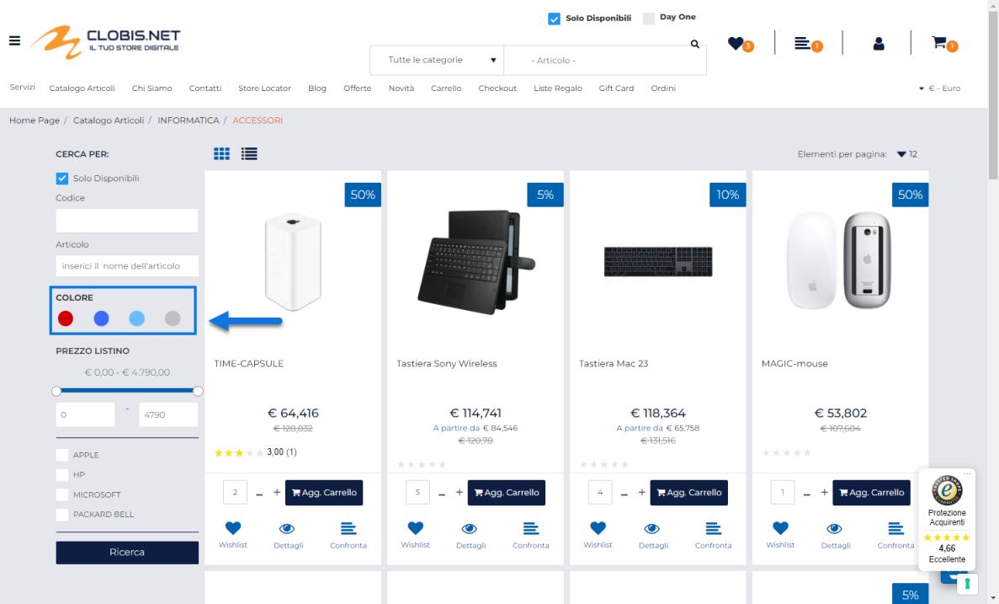

- **NO:** selezionando questa opzione in fase di inserimento ordine
  all'interno del gestionale il campo "Colli" presente nel piede del
  documento non verrà impostato in alcun modo disabilitando, di fatto,
  il calcolo automatico dei colli

<!-- -->

- **Gestione Articolo Spesa Iva Ripartita**: consente di stabilire come
  dovranno essere gestiti eventuali articoli spesa inseriti in ordine a
  seguito, ad esempio, di promozioni che coinvolgono articoli con
  aliquote iva differenti.

> E' possibile selezionare una delle seguenti opzioni:

- **Riga Singola** (opzione di default): selezionando questa opzione,
  nel momento in cui l'articolo spesa dovesse essere inserito in ordine
  a seguito, ad esempio, di una promozione che coinvolge articoli con
  aliquote iva differenti, verrà comunque gestito su di una singola riga
  con iva ripartita

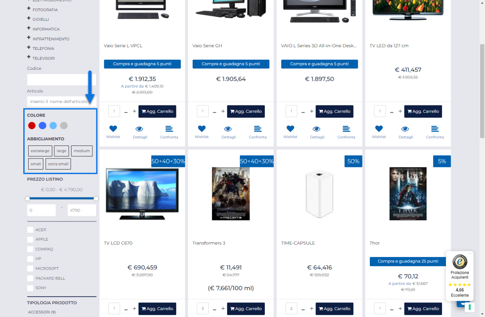

- **Righe Multiple**: selezionando questa opzione, nel momento in cui
  l'articolo spesa dovesse essere inserito in ordine a seguito, ad
  esempio di una promozione, che coinvolge articoli con aliquote iva
  differenti, verranno create, per l'articolo spesa, tante righe quante
  sono le aliquote iva degli articoli presenti in ordine

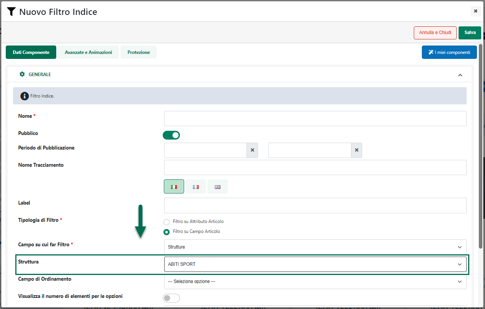

> **ATTENZIONE!** Nel momento in cui si dovessero riscontrare problemi
> relativi ad aliquote iva su articoli spesa e stampanti fiscali si
> consiglia di impostare il campo in esame sull'opzione "**Righe
> Multiple**"

- **Attributo del Number Tracking:** consente di indicare,
  selezionandolo tra quelli presenti in elenco, l' Attributo Ordine che
  dovrà essere utilizzato per la gestione del Number Tracking

> **ATTENZIONE! Nel caso in cui il parametro in esame non dovesse essere
> valorizzato, per la gestione del Number Tracking verrà utilizzato
> l'apposito campo presente nel piede del relativo documento
> gestionale**

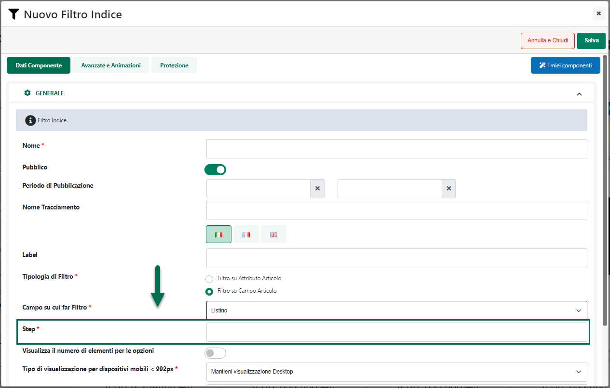

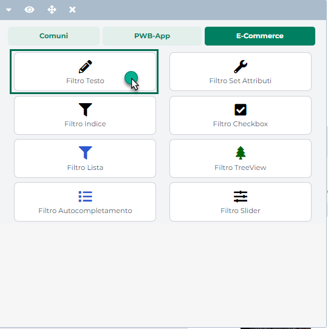

> **ATTENZIONE!** Nel caso in cui si dovesse decidere di gestire il
> Number Tracking con uno specifico Attributo, sarà possibile
> selezionare solo ed esclusivamente Attributi Ordine di tipo Mexal
> oppure Attributi Ordine di tipo Passweb corrispondenti a campi di tipo
> Testo
>
> Una volta valorizzato con il Codice di Spedizione assegnato dal
> vettore, l'Attributo Ordine indicato oppure il relativo campo presente
> nel piede del corrispondente documento gestionale, se poi in fase di
> codifica della metodologia di trasporto associata all'ordine è stato
> indicato anche uno specifico URL per la ricerca del Number Tracking,
> visualizzando sul sito il dettaglio del documento, l'utente vedrà in
> testata il relativo codice di spedizione seguito da un link che gli
> consentirà di arrivare sul sito del vettore e di sapere dove si trova,
> in quel momento, la merce ordinata.
>
> Per maggiori informazioni in merito si vedano anche le sezioni di
> questo manuale relative alla configurazione delle metodologie di
> trasporto.

- **Prefisso Opzioni Articolo:** consente di definire l'insieme di
  caratteri da anteporre alle note di riga utilizzate, sul documento
  gestionale, per gestire le opzioni di personalizzazione articolo. Per
  maggiori informazioni relativamente ai Set e alle Opzioni di
  personalizzazione articolo, si veda anche il relativo capitolo di
  questo manuale ("*Catalogo -- Opzioni Articoli*")

> **ATTENZIONE!** Nel caso in cui il parametro in esame non dovesse
> essere valorizzato, le note di riga utilizzate per gestire le opzioni
> di personalizzazione articolo verranno precedute, a default, dai
> caratteri "##"

- **Prefisso Opzioni Documento:** consente di definire l'insieme di
  caratteri da anteporre alle note utilizzate, sul documento gestionale,
  per gestire le opzioni di personalizzazione legate ai Set di Opzioni
  Ordine

> Per maggiori informazioni relativamente ai Set di Opzioni Ordine, si
> veda anche quanto indicato nel relativo capitolo di questo manuale
> ("*Ordini -- Ordini -- Set di Opzioni*")
>
> **ATTENZIONE!** Nel caso in cui il parametro in esame non dovesse
> essere valorizzato, le note di riga utilizzate per gestire le opzioni
> di personalizzazione ordine verranno precedute, a default, dai
> caratteri "#@"

- **Documenti nuovi da Verificare:** consente di impostare un filtro
  sulla base del quale determinare quali dovranno essere, tra i nuovi
  documenti generati sul sito, quelli **che dovranno nascere in sato "Da
  Verificare"** e che potranno quindi essere inseriti nel gestionale
  solo a seguito di un'apposita conferma da parte dell'amministratore.

> Per creare un nuovo filtro è sufficiente cliccare sul pulsante
> **"Aggiungi un nuovo filtro"** e selezionare poi dal relativo menu a
> tendina lo specifico campo su cui impostare la regola che definirà il
> criterio di applicazione del filtro stesso.

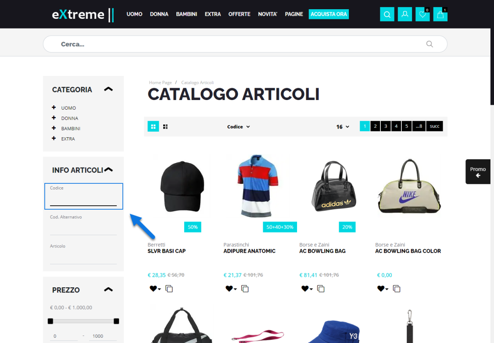

> E' possibile filtrare in base alla tipologia di documento (campo
> "**Preventivo**") e/o in base allo specifico pagamento selezionato
> dall'utente in fase di checkout (campo "**Pagamento**")
>
> Una volta selezionato il campo su cui impostare il filtro, sarà
> necessario selezionare l'operatore da utilizzare all'interno del
> filtro stesso ed il valore che il campo dovrà assumere affinché la
> condizione impostata possa poi essere soddisfatta.
>
> **ATTENZIONE! per i documenti che andranno a soddisfare il filtro
> impostato e che nasceranno dunque in stato "Da Verificare" la
> memorizzazione sul gestionale non sarà automatica ma avverrà solo
> previa conferma del documento stesso da parte dell'amministratore
> all'interno del Wizard di Passweb**
>
> In questo senso la procedura mediante cui poter validare documenti in
> stato "Da Verificare", abilitandoli di fatto a poter essere inseriti
> sul gestionale, è esattamente la stessa utilizzata per validare anche
> documenti in stato di "Pagamento non confermato"
>
> A tal proposito è bene ricordare poi che **lo stato di "Pagamento non
> confermato" è prioritario rispetto allo stato "Da Verificare"** per
> cui se un determinato ordine, pagato tramite gateway online, dovesse
> risultare in stato di "Pagamento non confermato" rimarrebbe in questo
> stesso stato anche nel momento in cui dovesse soddisfare il filtro
> settato mediante il parametro "Documenti nuovi da verificare".
>
> Qualora invece il pagamento online dovesse andare a buon fine, il
> relativo ordine verrà comunque posto nello stato "Da Verificare"
> (posto ovviamente che soddisfi sempre il filtro impostato mediante il
> parametro in oggetto) e non verrà quindi inserito sul gestionale. In
> conseguenza di ciò si consiglia, ovviamente, di non porre in stato "Da
> Verificare" ordini che l'utente potrebbe già pagare interamente
> mediante carta di credito.
>
> **ATTENZIONE!** lo stato "Da Verificare" verrà applicato solo ed
> esclusivamente in relazione a documenti "Nuovi". Sono esclusi dunque
> da questo stato tutti gli ordini "Modificati" ossia tutti gli ordini
> effettuati partendo da un ordine in stato Sospeso
>
> Per maggiori informazioni in merito ai diversi possibili stati
> dell'ordine si veda anche quanto indicato nel successivo capitolo
> "*Stati dell'Ordine*" di questo manuale.

##### DOCUVISION

La sezione "**Docuvision**" presente all'interno della maschera
"Configurazione parametri dell'Ordine" (solo per siti Ecommerce
collegati a Mexal) consente di settare i parametri di configurazione che
regolano l'integrazione tra gli ordini effettuati all'interno del sito e
il documentale Passepartout.

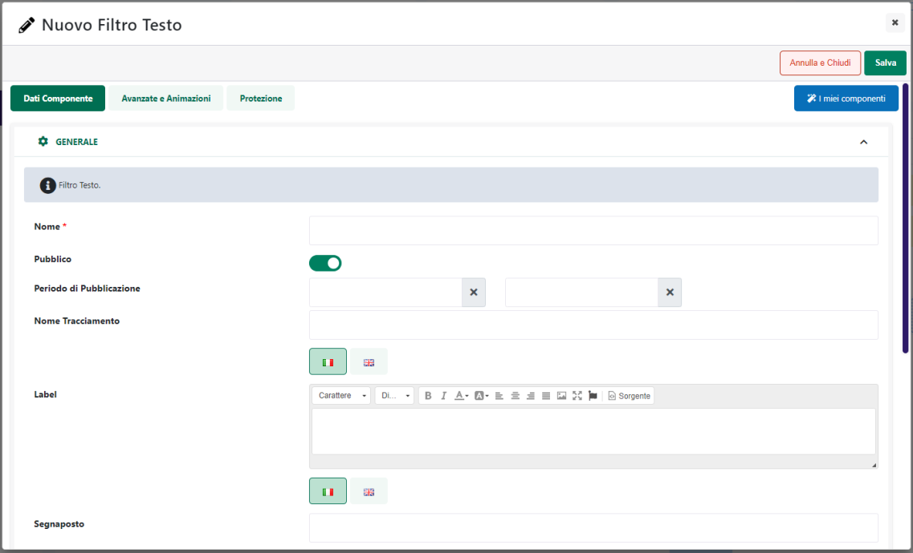

Nello specifico dunque il parametro:

- **Stampa Documento (solo Ecommerce Mexal):** selezionando questo
  parametro, in fase di sincronizzazione, oltre ad inserire l'ordine in
  magazzino verrà lanciata automaticamente anche la stampa dei relativi
  documenti utilizzando, in questo senso, il modulo di stampa indicato
  all'interno del successivo parametro.

> Nel caso in cui l'esigenza dovesse essere, ad esempio, quella di
> effettuare automaticamente la stampa in Docuvision degli ordini
> provenienti dal proprio sito E-commerce sarà quindi sufficiente
> abilitare il parametro in esame e indicare all'interno del successivo
> campo il modulo di stampa gestionale associato a Docuvision.

- **Modulo di Stampa (solo Ecommerce Mexal):** consente di indicare il
  modulo di stampa da utilizzare, lato gestionale, per la stampa
  automatica degli ordini web.

> L'elenco dei moduli di stampa utilizzabili è visibile sul gestionale
> alla voce "*Servizi -- Personalizzazioni -- Modulistica Documenti
> Grafica*"

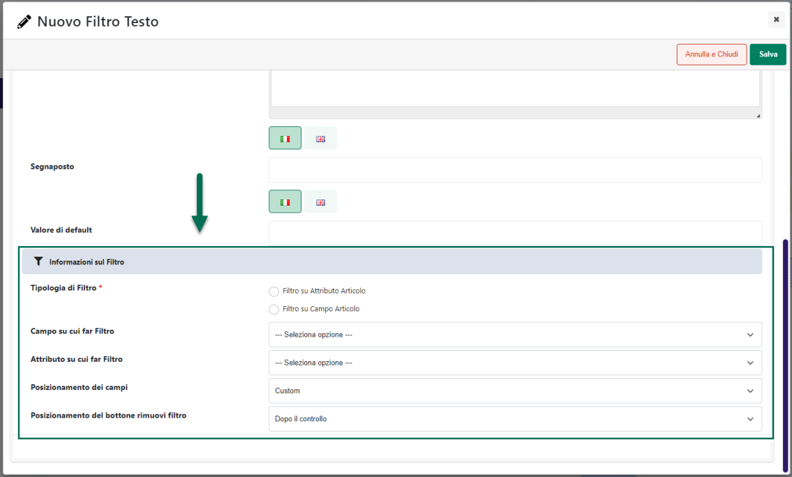

> Nel caso in cui il campo in esame venga lasciato vuoto verrà ricercato
> ed utilizzato, su Mexal, il modulo corrispondente alla sigla del
> documento inserito.
>
> In queste condizioni nel caso di un ordine cliente verrà quindi
> utilizzato il modulo di stampa associato alla sigla "OC"; nel caso
> invece di un preventivo verrà utilizzato il modulo associato alla
> sigla "PR".
>
> Nel caso in cui invece il campo in questione venga valorizzato, verrà
> ricercato ed utilizzato su Mexal, il modulo il cui codice è composto
> dalla concatenazione della sigla del documento e del valore indicato
> all'interno di questo stesso campo.
>
> Supponendo dunque, da una parte, di considerare un ordine cliente (OC)
> e dall'altra parte di aver indicato all'interno del campo "Modulo di
> stampa" il valore D, nel momento in cui l'ordine sarà inserito
> all'interno di Mexal verrà avviata automaticamente anche la stampa di
> questo stesso ordine utilizzando il modulo con codice "OCD"
>
> **ATTENZIONE!** Affinchè la stampa automatica degli ordini web possa
> avvenire con successo è necessario rispettare alcune condizioni di
> fondamentale importanza. Nello specifico è necessario:

- Definire all'interno di Mexal un modulo di stampa per ogni tipologia
  di documento gestita sul sito (OC, OX, PR, PX, RC, NC).

> Nel caso in cui tale condizione non dovesse essere verificata, in fase
> di sincronizzazione verrà restituito l'errore **"Nessun formato di
> stampa è stato definito per questo documento".** L'ordine verrà quindi
> inserito correttamente ma non verrà avviata nessuna stampa automatica

- Verificare che per i moduli di stampa utilizzati dagli ordini web non
  sia attiva la "Conferma di Inizio Stampa" (campo "**Conferma Inizio
  Stampa**" **della maschera "Parametri Modulo" impostato sul valore**
  "**Mai**")

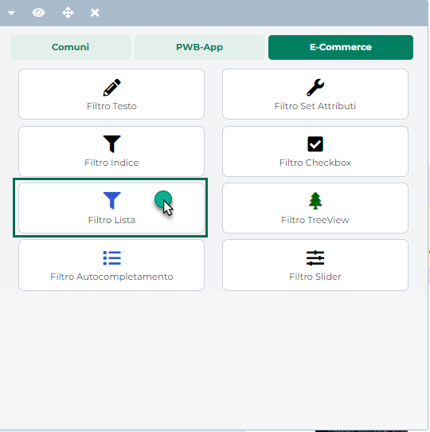

> Nel caso in cui tale condizione non dovesse essere verificata, in fase
> di sincronizzazione verrà restituito l'errore **\"Impossibile accedere
> alla tastiera - Tastiera non disponibile in modalità senza interfaccia
> utente\".**

- Controllare che il parametro "**Numero copie di ristampa/A
  richiesta**" presente all'interno della maschera "**Opzioni Modulo**"

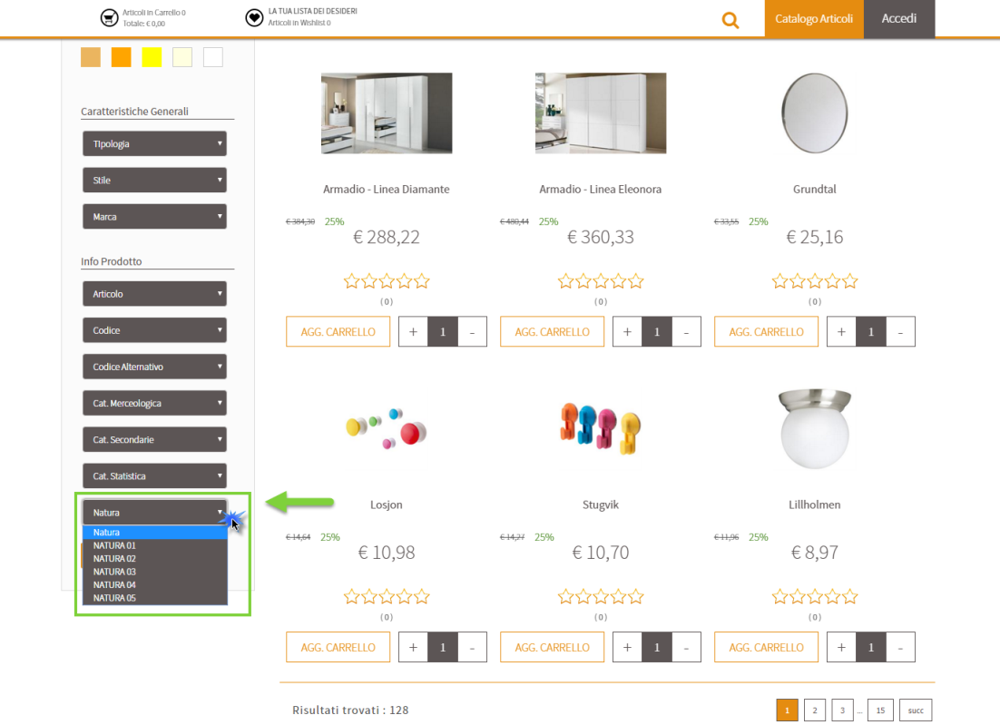

> **non sia stato impostato sul valore S**. In queste condizioni infatti
> verrebbe richiesta a video la ristampa del documento e considerando
> che la sincronizzazione sito / gestionale non ha, ovviamente,
> interfaccia utente questo genererebbe l'errore "Interfaccia utente non
> disponibile -- Ristampa documento ...."
>
> **ATTENZIONE!** Affinchè la stampa automatica degli ordini web possa
> avvenire con successo è necessario impostare il parametro "**Numero
> copie di ristampa/A richiesta**" evidenziato in figura sul valore N
> oppure impostare, in alternativa, il numero esatto di copie da
> ristampare.
>
> Infine, nel caso in cui la stampa automatica debba essere effettuata
> non in Docuvision ma su di una stampante fisica è necessario
> verificare che il campo "**Collegamento**" presente nella maschera
> Mexal di modifica dei parametri della stampante associata al modulo
> utilizzato ("*Servizi -- Configurazioni - Stampanti*") sia impostato
> sul valore "**Dispositivo collegato al server**"

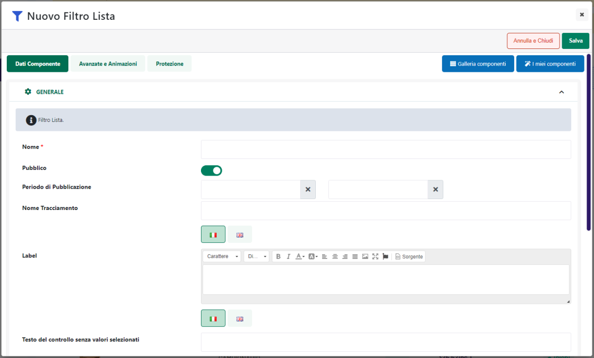

> Per ovvie ragioni la stampa automatica su di una stampante fisica può
> essere abilitata solo nel caso di installazioni Mexal in locale
>
> **ATTENZIONE! in caso di errori in fase di stampa il relativo
> documento verrà comunque inserito in Mexal ma non verrà comunicata a
> Passweb la corrispondente sigla gestionale. In queste condizioni
> dunque l'ordine rimarrebbe, lato Passweb, in stato "Nuovo" per cui ad
> ogni sincronizzazione l'applicativo tenterà di inserirlo nuovamente
> sul gestionale creando di fatto più copie dello stesso documento.**

Gli ultimi tre parametri presenti all'interno di questa sezione
permettono di gestire la possibilità da parte degli utenti del sito, di
accedere a eventuali file allegati in Docuvision a documenti di tipo BC,
CO, FT, NC e RI direttamente dal front end del sito senza dover passare
per forza di cose dall'Area Riservata.

Nello specifico dunque il parametro

- **Sigle Documenti File Docuvision:** consente di specificare le
  tipologie di documenti (**BC**, **CO, FT, NC, RI**) in relazione alle
  quali dovranno essere letti ed esportati sul sito, in fase di
  sincronizzazione (Totale o per Variati), eventuali file allegati in
  Docuvision ai documenti della tipologia indicata.

- **Tipologia File Docuvision:** consente di indicare esattamente quali
  degli eventuali file allegati in Docuvision ai documenti della
  tipologia indicata nel parametro precedente, dovranno essere
  effettivamente prelevati ed esportati sul sito in fase di
  sincronizzazione.

> E' possibile selezionare uno dei seguenti valori:

- **Tutti:** selezionando questa opzione, in fase di sincronizzazione
  (Totale o per Variati) verranno prelevati ed esportati sul sito
  **tutti** i file allegati in Docuvision ai documenti della tipologia
  indicata nel parametro precedente.

- **Stampa:** selezionando questa opzione, in fase di sincronizzazione
  (Totale o per Variati) verrà prelevato ed esportato sul sito **solo ed
  esclusivamente il file Docuvision di tipo Stampa** per i documenti
  della tipologia indicata nel parametro precedente

> **ATTENZIONE! Nel caso in cui l'esigenza dovesse essere quella di
> esportare sul sito i file xml memorizzati in Docuvision a seguito
> dell'emissione di fatture elettroniche, sarà necessario impostare il
> parametro "Tipologia file Docuvision" sul valore "Tutti"**
>
> In queste caso inoltre, nel momento in cui la risorsa da scaricare
> dovesse essere appunto un file xml generato dall'emissione di una
> fattura elettronica, in fase di download verrà creato uno zip
> contenente l'xml della fattura stessa e un file html mediante il quale
> poter visualizzare il dettaglio della fattura elettronica utilizzando
> il file xsl di Passepartout.
>
> Per visualizzare sul browser il dettaglio della fattura elettronica
> sarà quindi necessario decomprimere l'archivio .zip ed aprire il file
> con estensione .html presente al suo interno.

- **Mail Stampa Docuvision:** consente, se selezionato, di allegare alle
  mail di evasione ordine (relative sempre alle tipologie di documenti
  indicate per il parametro "Sigle Documenti File Docuvision") il file
  Docuvision di tipo Stampa del relativo documento.

> **ATTENZIONE!** Nel caso in cui l'ordine dovesse essere evaso tramite
> Bolla (documenti di tipo BC) la mail di evasione inviata
> automaticamente dal sito farà riferimento esattamente a questa
> particolare tipologia di documento. In queste condizioni dunque non
> sarà possibile allegare alla mail di evasione nessun documento di
> stampa in conseguenza del fatto che, come detto, la mail di evasione
> farà riferimento a documenti di tipo BC e non FT o CO. Allo stesso
> modo all'emissione della fattura (o del corrispettivo) il sistema non
> invierà altre mail di evasione essendo queste già state inviate al
> momento dell'emissione della Bolla.
>
> **ATTENZIONE!** Nel caso di fatture elettroniche non saranno presenti
> in Docuvision file di tipo Stampa per cui , pur avendo flaggato il
> parametro in oggetto alla mail di evasione non verrà allegato nulla.
>
> In questo caso dunque l'utente potrà, eventualmente, soltanto
> scaricare dal sito l'archivio .zip contenente il file xml della
> fattura elettronica ed il corrispondente file html necessario per
> visualizzare sul browser il dettaglio del relativo documento.

In sostanza dunque in fase di sincronizzazione (sia Totale che per
Variati) verranno letti tutti i file allegati in Docuvision ai documenti
della tipologia indicata all'interno del parametro "**Sigle Documenti
File Docuvision**" e che risultano essere stati variati rispetto
all'ultima sincronizzazione utile. Dipendentemente poi dalle
impostazioni settate per il parametro "**Tipologia File Docuvision**"
verranno copiati ed esportati sul sito tutti questi documenti o
solamente il file di Stampa.

Tali file potranno poi essere scaricati in qualsiasi momento dai
relativi utenti accedendo direttamente alla pagina "Stato Ordini" del
sito (per maggiori informazioni in merito si veda anche la sezione
"*Varianti Sito Responsive -- Lista componenti Ecommerce -- Componente
Ordini*" di questo manuale).

Oltre ai file ai file prelevati da Docuvision, volendo, sarà possibile
allegare a questi stessi documenti altri file operando direttamente dal
Wizard di Passweb all'interno della maschera di visualizzazione del
dettaglio del relativo documento.

**ATTENZIONE! Lo spazio occupato dagli allegati dei documenti gestiti in
questo modo verrà conteggiato nello spazio disco disponibile da
contratto per ogni sito.**

Nel caso in cui l'esigenza dovesse essere quella di eliminare alcuni di
questi allegati (magari proprio per liberare dello spazio disco) sarà
possibile agire direttamente dal Wizard di Passweb, operando anche in
questo caso, dalla maschera di visualizzazione del dettaglio del
relativo documento facendo però attenzione a non reimportare gli
allegati appena eliminati a seguito di future sincronizzazioni (sarà
quindi necessario fare attenzione a non variare, lato gestionale, i
documenti coinvolti in questo tipo di operazione).

**In questo senso dunque il modo migliore di procedere è quello che
prevede di eliminare eventuali allegati operando direttamente da
Docuvision.**

In fase di sincronizzazione infatti, e sempre in relazione ai documenti
variati, verranno automaticamente eliminati dal sito eventuali file che
non risultano più essere associati, in Docuvision, a questi stessi
documenti

Per maggiori informazioni in merito alla possibilità di eliminare
eventuali file allegati ai documenti, e/o di associare a questi stessi
documenti altri file operando direttamente dal Wizard di Passweb si veda
anche la sezione "*Ordini -- Gestione Ordini*" di questo manuale

##### NOTIFICA ORDINE

La sezione "**Notifica Ordine**" presente all'interno della maschera
"Configurazione parametri dell'Ordine" consente di impostare i parametri
relativi alle notifiche mail che potranno essere inviate
all'amministratore del sito nel momento in cui verranno effettuati, ad
esempio, nuovi ordini sul sito.

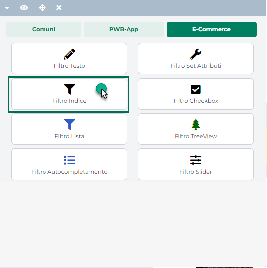

Nello specifico dunque il parametro:

- **Indirizzi Email per la Email di Informazione Invio Ordine:**
  consente di specificare uno o più indirizzi mail (separati da ;) cui
  verranno inoltrate le "**Email di Informazione**";

- **Oggetto Email di Informazione Invio Ordine:** consente di
  specificare l'oggetto della "**Email di Informazione**" che verrà
  inviata, contestualmente alla conferma di un nuovo ordine sul sito (e
  quindi assieme alla mail di Invio Ordine), agli indirizzi indicati
  all'interno del precedente campo

- **Abilita ' Rispondi a ' di Invio Ordine:** consente di abilitare
  sulla mail di "Informazione Invio Ordine" l'opzione "Reply to". In
  queste condizioni quindi chi riceverà la mail di "Informazione Invio
  Ordine" avrà la possibilità di sfruttare dal sul client di posta
  l'opzione "Rispondi" impostando automaticamente come destinatario
  della risposta l'indirizzo mail associato al cliente che ha effettuato
  l'ordine in questione.

- **Oggetto Email di Informazione di Conferma Ordine:** consente di
  specificare l'oggetto della mail di Informazione contestuale alla
  conferma dell'ordine.

> **La mail di Informazione di Conferma Ordine** verrà inviata
> all'inserimento del relativo ordine sul gestionale (e quindi assieme
> alla mail di Conferma Ordine) agli indirizzi indicati nel precedente
> campo "**Indirizzi Email per la Email di Informazione Invio Ordine".**
> Il Testo della mail sarà esattamente quello inserito nel successivo
> campo "Testo Email di Informazione" seguito ovviamente dal riepilogo
> dell'ordine.
>
> **ATTENZIONE!** A default nell'oggetto delle varie mail vengono
> automaticamente inseriti i segnaposto relativi al Cliente, al Agente e
> all'Indirizzo di spedizione della merce.

- **Abilita ' Rispondi a ' di Conferma Ordine:** consente di abilitare
  l' opzione "Reply to" sulla mail di informazione contestuale
  all'inserimento di un ordine sul gestionale. In queste condizioni
  quindi chi riceverà tale mail avrà la possibilità di sfruttare dal sul
  client di posta l'opzione "Rispondi" impostando automaticamente come
  destinatario della risposta l'indirizzo mail associato al cliente che
  ha effettuato l'ordine in questione.

- **Oggetto Email di Informazione di Notifica Allegato:** consente di
  specificare l'oggetto della mail di notifica che verrà inviata, agli
  indirizzi indicati all'interno del precedente campo "Indirizzi Email
  per la Email di Informazione", nel momento in cui dovessero essere
  aggiunti ad un determinato ordine, dal Front End del sito (e quindi da
  parte di chi ha effettuato l'ordine), nuovi Allegati.

> **ATTENZIONE!** Come per le mail di "Informazione Invio Ordine" e
> "Informazione di Conferma Ordine" anche in questo caso nel momento in
> cui il campo in esame dovesse essere lasciato vuoto, all'inserimento
> di nuovi allegati da parte degli utenti sul front end del sito non
> verrà inviata nessuna mail di notifica.
>
> Il Testo della mail di Notifica Allegato sarà esattamente quello
> inserito nel successivo campo "Testo Email di Informazione" seguito
> dal riepilogo dell'ordine e con allegati i nuovi file uplodati dal
> cliente.

- **Testo Email di Informazione:** consente di personalizzare il testo
  dell'Email di Informazione (di Invio Ordine, di Conferma Ordine e di
  Notifica Allegato).

> Il pulsante "**Sorgente**" presente nella barra degli strumenti
> dell'editor di testo consente di editare il corpo della mail lavorando
> direttamente a livello di codice HTML.

Il pulsante "**Aggiungi Segnaposto**" presente in corrispondenza di ogni
campo di tipo "**Oggetto Email**" e "**Testo Email**" consente di
personalizzare l'oggetto e il testo della relativa mail inserendo
appositi segnaposto che verranno poi valorizzati dinamicamente da
Passweb a seconda, ad esempio, di chi effettua l'ordine, di dove viene
inviata la merce o del tipo di documento generato.

Per maggior informazioni relativamente al significato e all'uso di
questi segnaposto si veda anche il successivo capitolo di questo manuale

