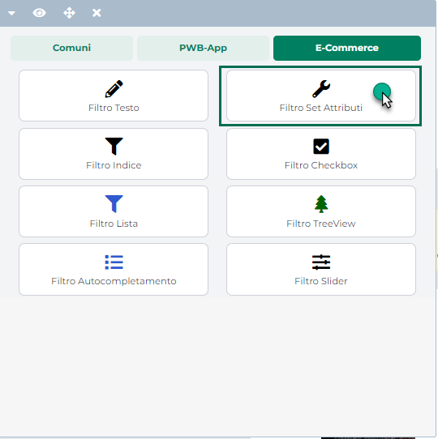
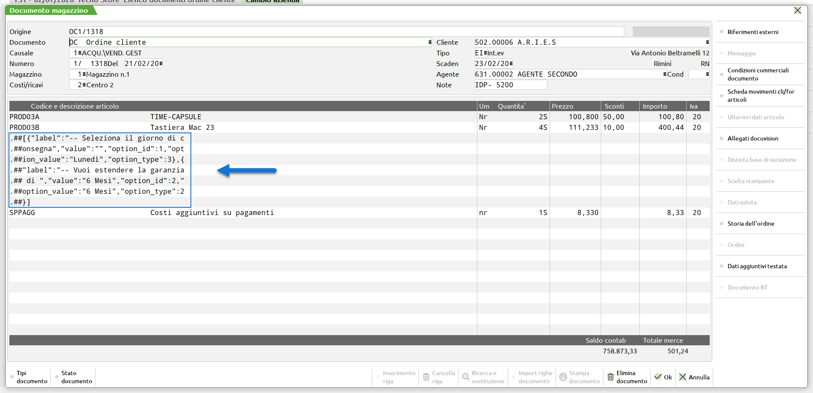
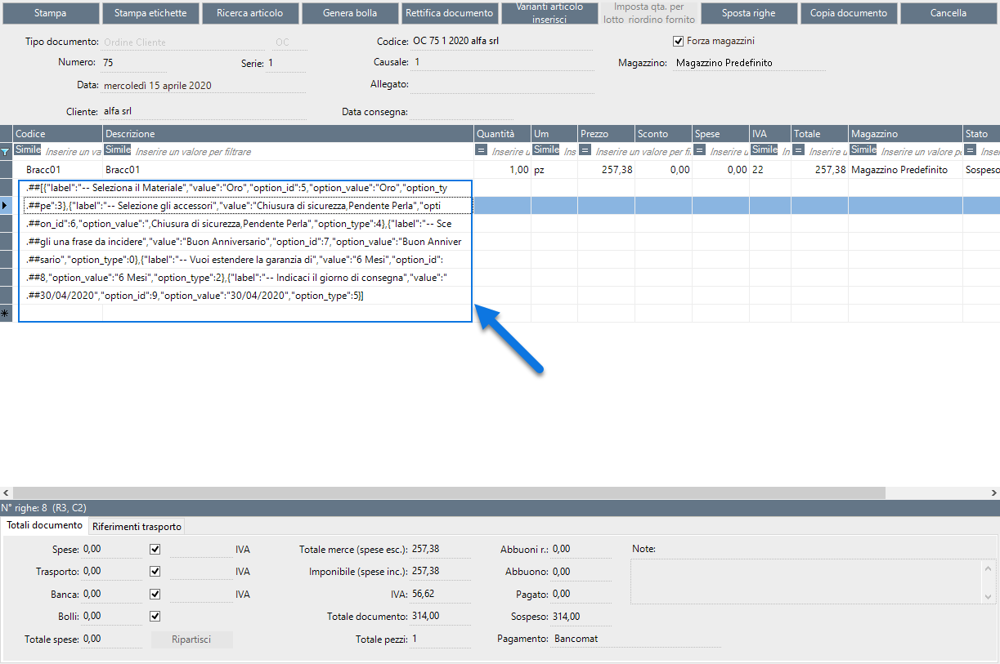
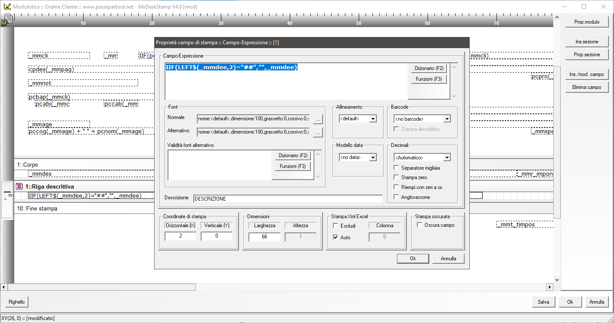
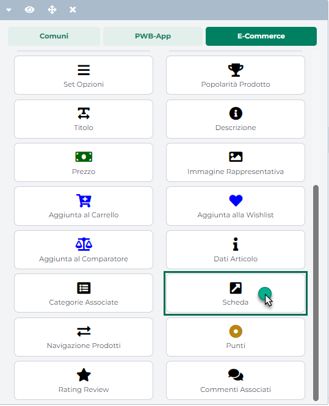
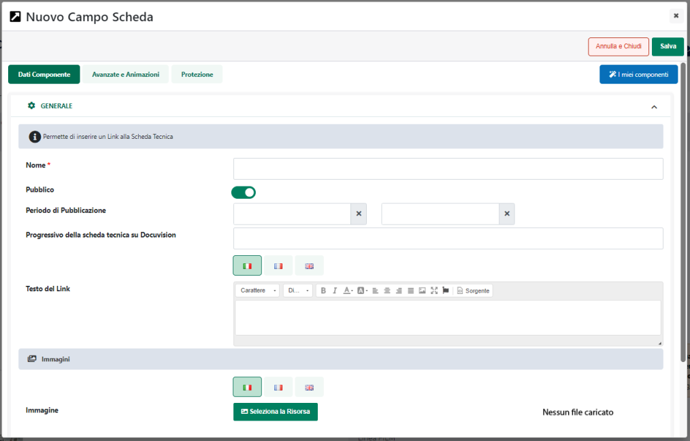
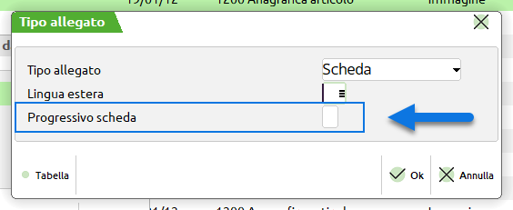
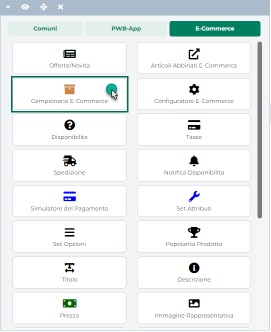
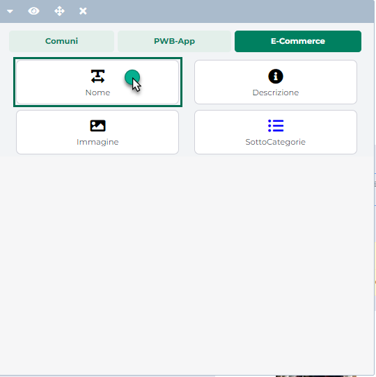

# GESTIONE ORDINI

All'interno di questa sezione è possibile disporre di un elenco
completo, con relativo dettaglio, di tutti gli ordini/bolle/fatture
effettuati o esportati sul proprio sito E-commerce.

{width="5.772916666666666in"
height="3.5194444444444444in"}

Le prime tre icone presenti nell'intestazione della griglia consentono
di attivare e gestire la selezione multipla dei documenti in elenco

Nello specifico l'icona:

- {width="0.11666666666666667in"
  height="9.097222222222222e-2in"}: consente di attivare / disattivare
  la selezione multipla dei documenti in elenco

- {width="9.722222222222222e-2in"
  height="9.722222222222222e-2in"}: consente di selezionare in blocco
  tutti i documenti attualmente presenti in elenco

- {width="9.097222222222222e-2in"
  height="9.097222222222222e-2in"}: consente di deselezionare il blocco
  tutti i documenti presenti in elenco

**ATTENZIONE!** la selezione multipla è attiva, per ovvie ragioni, solo
ed esclusivamente in relazione alla funzionalità di "**Elimina Ordine**"

L' icona raffigurante due piccole frecce posta in testata ad ogni
singola colonna (
{width="0.12361111111111112in"
height="0.14930555555555555in"} ) consente invece di ordinare in maniera
crescente e/o decrescente, sulla base dei dati presenti all'interno di
quella stessa colonna, i dati in tabella

Il campo di ricerca attivabile cliccando sulla lente di ingrandimento,
presente in testata di ogni singola colonna, consente di filtrare i dati
in griglia sulla base dei valori presenti all'interno della colonna
stessa.

Nel caso in cui l'esigenza dovesse essere, ad esempio, quella di
filtrare e visualizzare, tra tutti i documenti presenti, solo ed
esclusivamente quelli riferiti ad un certo cliente, sarà sufficiente
cliccare sulla lente di ingrandimento presente in testata alla colonna
"Cliente", inserire quindi nel corrispondente campo di ricerca il
nominativo del cliente da ricercare, e cliccare infine sull'icona
indicata in figura per avviare la ricerca.

{width="5.772916666666666in"
height="3.5194444444444444in"}

In generale è quindi possibile filtrare i documenti in griglia per:

- **Numero:** consente di filtrare i documenti in elenco sulla base del
  loro codice identificativo in Passweb;

- **Sigla:** consente di filtrare i documenti in elenco sulla base della
  sigla dell\'ordine/documento del gestionale.

> In particolare va detto che nel caso in cui venga effettuata una
> ricerca per sigla documento, i risultati ottenuti prenderanno in
> considerazione anche documenti che hanno per sigla o per origine il
> valore ricercato o parte di esso.
>
> Nel caso in cui, ad esempio sia stato evaso parzialmente l'ordine
> OC1/1320 con la bolla BC1/1 nell'elenco dei documenti comparirà, come
> mostrato nella figura di seguito riportata, la bolla BC1/1 con a
> fianco un'icona raffigurante una piccola i che, se cliccata,
> consentirà di visualizzare i documenti di origine della specifica
> bolla.

{width="4.934722222222222in"
height="3.0194444444444444in"}

> In queste condizioni effettuando una ricerca per sigla documento, e
> indicando nello specifico, come sigla documento OC1/1320, il risultato
> che otterremo sarà quello di visualizzare, oltre all'ordine OC1/1320
> anche la bolla BC1/1 che, come detto, ha avuto origine proprio
> dall'ordine ricercato.

- **Cliente:** consente di filtrare i documenti in elenco sulla base del
  cliente intestatario del documento stesso

- **Agente:** consente di filtrare i documenti in elenco sulla base
  dell'agente presente nella testata del documento stesso

- **Data:** consente di filtrare i documenti in elenco per data

- **Stato:** consente di filtrare i documenti in elenco sulla base del
  loro stato (nuovo, sospeso, bollato, fatturato ecc ...);

- **Pagamento:** consente di filtrare i documenti in elenco sulla base
  del pagamento in essi adottato

- **Vettore:** consente di filtrare i documenti in elenco sulla base del
  vettore definito per il metodo di trasporto associato allo specifico
  documento

- **Consegna**: consente di filtrare i documenti in elenco sulla base
  della eventuale data di consegna

- **Origine:** consente di filtrare i documenti in elenco sulla base del
  fatto che siano stati originati a partire dal sito web oppure
  dall'eventuale App collegata al sito stesso

- **Marketplace:** consente di filtrare i documenti in elenco sulla base
  del fatto che siano stati originati a partire dal sito web oppure da
  uno specifico Marketplace

Una volta impostato un filtro di ricerca, per poterlo poi eliminare sarà
sufficiente cliccare sull'icona raffigurante una piccola lente di
ingrandimento con un -- all'interno (
{width="7.777777777777778e-2in"
height="9.722222222222222e-2in"} ) che comparirà in testata alla colonna
in corrispondenza della quale è stato impostato il filtro stesso.

Volendo poi è anche possibile applicare filtri di ricerca più evoluti e
basati su campi non immediatamente visibili in griglia.

Il pulsante "**Filtri Avanzati**" (
{width="0.5131944444444444in"
height="0.175in"} ) presente nella barra degli strumenti, consente
infatti di aprire una sezione di ricerca contenete un query builder
utilizzabile per creare e customizzare il proprio filtro di ricerca

{width="5.6819444444444445in"
height="3.454861111111111in"}

Il pulsante "**Aggiungi un nuovo filtro**" consente di visualizzare
l'elenco dei campi su cui poter impostare la condizione di filtro.

{width="5.552083333333333in"
height="3.4090277777777778in"}

Nello specifico, grazie ai filtri avanzati sarà possibile costruire il
proprio filtro di ricerca documenti utilizzando i seguenti campi:

- **Data** **Documento**: consente di filtrare i documenti in elenco per
  data

- **Numero Documento**: **:** consente di filtrare i documenti in elenco
  sulla base del loro codice identificativo in Passweb

- **Sigla Documento**: consente di filtrare i documenti in elenco sulla
  base della sigla dell\'ordine/documento del gestionale

- **Stato Documento**: consente di filtrare i documenti in elenco sulla
  base del loro stato

- **Tipologia Documento**: consente di filtrare i documenti in elenco
  per tipologia

- **Codice Utente Fatturazione**: consente di filtrare i documenti in
  elenco sulla base del codice dell'utente intestatario

- **Nota Ordine (corpo)**: consente di filtrare i documenti in elenco
  sulla base di quanto inserito nel campo "**Note Documento**" presente
  alla pagina "Checkout" del sito

- **Articoli**: consente di filtrare i documenti in elenco sulla base
  degli articoli in essi contenuti

- **ID Ordine Marketplace**: consente di filtrare i documenti in elenco
  sulla base dell'identificativo ad essi assegnato all'interno del
  marketplace da cui sono stati acquisiti

Una volta selezionato il campo su cui impostare il filtro, sarà poi
necessario selezionare l'operatore relazionale (uguale, contiene, è in
...) da utilizzare all'interno del filtro stesso ed il valore che il
campo in esame dovrà assumere affinché la condizione impostata possa
essere effettivamente soddisfatta.

{width="5.675in"
height="3.4479166666666665in"}

In questo senso, ovviamente, gli operatori disponibili e le modalità di
inserimento del valore da soddisfare potranno cambiare in relazione alla
tipologia di campo su cui è stato impostato il filtro.

Nel caso in cui, ad esempio, il filtro dovesse essere impostato sul
campo "**Data**" gli operatori relazioni disponibili saranno solo
"**maggiore o** **uguale**" e "**minore o uguale**" e il valore da
impostare sarà, ovviamente, una specifica data.

Impostando invece il filtro sul campo "**Articoli**", gli operatori
relazioni disponibili saranno "**è in**" e "**non è in**" mentre il
valore da ricercare sarà gestito con un campo ad autocompletamento in
cui poter inserire il codice o il titolo dell'articolo da ricercare.

{width="5.675in"
height="3.4479166666666665in"}

**E' inoltre possibile concatenare tra loro due o più condizioni di
filtro, basate anche su più campi differenti, in maniera tale da
realizzare delle query più o meno complesse a seconda del tipo di
risultato che si desidera ottenere.**

Al termine di ogni condizione verrà infatti visualizzata una **"e"**,
corrispondente all'operatore logico "**AND"**, e utilizzata, a default,
per concatenare tra loro eventuali ulteriori condizioni che dovranno
essere considerate nella costruzione della query di ricerca dei
documenti.

Cliccando su questo elemento verranno visualizzati tutti gli operatori
logici da poter utilizzare nella costruzione della propria query.

{width="5.675in"
height="3.4479166666666665in"}

In questo senso, come precedentemente evidenziato, la **"e"**
corrisponderà all'operatore logico **AND** mentre la **"o"**
all'operatore logico **OR.** Le eventuali parentesi, poste prima o dopo
questi operatori, potranno essere utilizzate, esattamente come avviene
in algebra, per specificare quali condizioni dovranno essere valutate
prima e quali dopo.

{width="5.675in"
height="3.4479166666666665in"}

Il filtro rappresentato in figura consente, ad esempio, di ricercare
tutti i documenti con data successiva al 17/06/2024 e che sono nello
stato di "Nuovo" o che contengono l'articolo di codice ACBN03.

Il pulsante "**Vai**" presente nella parte bassa del pannello di ricerca
consente di applicare il filtro impostato e chiudere automaticamente il
pannello stesso.

Infine, per poter eliminare i filtri di ricerca avanzati eventualmente
impostati è possibile procedere in due modi diversi:

- Aprire il pannello di ricerca dei filtri avanzati, eliminare tutte le
  condizioni di filtro eventualmente impostate cliccando per questo sul
  pulsante raffigurante un piccolo cestino (
  {width="0.24027777777777778in"
  height="0.2076388888888889in"} ) posto in corrispondenza di ogni
  singola condizione e cliccare, infine, sul pulsante "Vai"

- Cliccare sul pulsante "**Elimina filtri avanzati**" (
  {width="0.9548611111111112in"
  height="0.18819444444444444in"} ) che verrà visualizzato, una volta
  applicato un filtro di questo tipo, nella relativa barra degli
  strumenti

{width="5.675in"
height="3.4479166666666665in"}

**ATTENZIONE! i filtri applicati mediante i campi di ricerca presenti in
testata alla griglia non sono compatibili con i filtri di ricerca
avanzati**

Ciò significa dunque che applicando un filtro di ricerca avanzato
verranno automaticamente eliminati eventuali filtri in colonna
precedentemente applicati e, allo stesso modo, applicando un filtro in
colonna verranno prima eliminati in maniera automatica eventuali filtri
avanzati

Il pulsante "**Colonne**" (
{width="0.11666666666666667in"
height="0.11666666666666667in"} ), presente in testata, in
corrispondenza dell'ultima colonna della griglia, consente di decidere
quali informazioni dovranno essere visualizzate direttamente in tabella.
Cliccando su questo pulsante verrà infatti visualizzata la maschera
"**Colonne**"

{width="4.195138888888889in"
height="2.3506944444444446in"}

mediante la quale poter decidere quale campo attivare / disattivare e
conseguentemente quale informazione mostrare / nascondere.

I dati non presenti direttamente in tabella potranno comunque essere
visualizzati tra le "**ulteriori informazioni**" del documento
disponibili cliccando sul pulsante raffigurante una piccola i (
{width="0.11666666666666667in"
height="0.11666666666666667in"} ) posto in corrispondenza di ogni
singola riga

{width="5.675in"
height="3.454861111111111in"}

In definitiva dunque, all'interno di questa maschera sarà possibile
visualizzare / nascondere per ogni singolo documento le seguenti
informazioni:

- **Numero:** identificativo Passweb del relativo documento

- **Sigla:** identificativo assegnato al documento all'interno del
  gestionale -- visualizzato a default

- **Cliente:** cliente intestatario del relativo documento --
  visualizzato a default

- **Agente:** agente in testata al relativo documento

- **Totale:** totale del relativo documento

- **Data:** data di acquisizione / modifica del relativo documento

- **Stato:** stato del relativo documento

- **Pagamento:** pagamento utilizzato per il relativo documento

- **Vettore:** metodo di spedizione utilizzato per il relativo documento

- **Consegna:** data di consegna del documento

- **Origine:** applicazione utilizzata per acquisire il relativo
  documento (sito o app)

- **Marketplace:** eventuale marketplace da cui è stato acquisito il
  documento

- **GADS:** stato dell'ordine in relazione alla sua esportazione su
  Google Ads

In particolare poi per quel che riguarda il dato presente all'interno
della colonna GADS che, come detto, rappresenta lo stato di esportazione
del relativo documento verso Ads ed è quindi legato alla procedura di
Import delle conversioni offline su questa stessa piattaforma, è bene
sottolineare alcune cose di fondamentale importanza:

- La colonna GADS sarà sempre presente, indipendentemente dal fatto di
  gestire o meno il tracciamento delle conversioni su Google Ads.

- Tutti i documenti presenti all'interno della maschera "Lista Ordini"
  al momento dell'aggiornamento alla versione 2024B di Passweb verranno
  automaticamente marcati come già esportati su Google Ads (questo per
  evitare di importare all'interno di Ads conversioni che magari sono
  già state correttamente registrate)

- A seguito dell'aggiornamento alla versione 2024B lo stato di
  esportazione verso Google Ads verrà aggiornato in maniera automatica
  secondo la seguente logica:

  - Nel momento in cui a conclusione dell'ordine l'utente dovesse
    visitare la pagina Passweb di conferma ordine il relativo documento
    verrà automaticamente marcato come "**già esportato su Google
    Ads**".

{width="5.7659722222222225in"
height="3.298611111111111in"}

> In queste condizioni infatti potrà essere correttamente eseguito lo
> snippet di codice eventualmente inserito proprio nella pagina di
> conferma ordine e che si occupa di inviare ad Ads tutti i dati
> necessari per tracciare la relativa conversione

- Nel caso in cui a conclusione dell'ordine l'utente dovesse invece
  decidere di non visitare la pagina Passweb di conferma ordine,
  tipicamente perché a seguito del pagamento sul gateway della banca
  chiude il browser senza tornare al sito ecommerce, il relativo
  documento verrà marcato come "**non ancora esportato su Google Ads**".

{width="5.7659722222222225in"
height="3.298611111111111in"}

> In queste condizioni infatti non sarà possibile eseguire lo snippet di
> codice presente nella pagina di conferma ordine (perché la pagina non
> viene visitata) e di conseguenza non sarà possibile trasmettere ad Ads
> i dati della relativa conversione.

- Lo stato di esportazione verso Google Ads potrà essere modificato
  dall'amministrazione del sito in maniera manuale in un qualsiasi
  momento agendo per questo mediante i pulsanti "**Esportato** / **Non
  Esportato su ADS**" presenti nella barra degli strumenti della
  maschera "**Lista Ordini**" oppure mediante il parametro "**Esportato
  su Google ADS**" presente nel dettaglio di ogni singolo documento
  (sezione "Tracciamento Dati")

- Nel momento in cui dovesse essere implementata la gestione dell'import
  delle conversioni offline lo stato di esportazione su Ads di un
  determinato documento verrà aggiornato in maniera automatica da
  Passweb, passando da non esportato ad esportato, nel momento in cui
  quello stesso documento dovesse essere inserito:

  - nel file prodotto in automatico da Passweb per essere dato in pasto
    a Google Ads in fase di import dei dati di conversione

  - in un file di "Esportazione Ordini" di tipo Google Ads creato
    manualmente dall'amministratore del sito

Per maggiori informazioni in merito alla procedura di import delle
conversioni offline su Google Ads si consiglia comunque di fare
riferimento a quanto indicato nel relativo capitolo di questo manuale (
"*Google Ads User Provided data e Conversioni Avanzate -- Import delle
conversioni offline*")

Tornando ora alla barra degli strumenti, oltre al pulsante "Filtri
Avanzati" precedentemente esaminato, potranno essere visualizzati anche
ulteriori pulsanti che consentono rispettivamente di:

- **Attiva Modifica Attributi**
  ({width="0.9090277777777778in"
  height="0.2076388888888889in"} ): consente di attivare la modalità
  "**Modifica Attributi**" in cui poter visualizzare il dettaglio di
  ogni singolo documento presente in elenco con la possibilità di
  modificare eventuali Attributi Passweb, siano essi di Testata
  (Attributi dell'Ordine) o di Riga (Attributi Articolo Riportabili),
  presenti all'interno del documento stesso

- **Disattiva Modifica Attributi**
  ({width="0.9090277777777778in"
  height="0.175in"} ): consente di disattivare la modalità di
  "**Modifica Attributi**". Una volta disabilitata tale modalità sarà
  sempre possibile accedere alla visualizzazione del dettaglio di uno
  qualsiasi dei documenti presenti in elenco questa volta però in sola
  visualizzazione senza cioè poter modificare in alcun modo eventuali
  Attributi Passweb presenti all'interno del documento.

<!-- -->

- **Conferma Ordine** (
  {width="0.6041666666666666in"
  height="0.175in"} ) -- visibile per ordini posti nello stato di
  "**Pagamento Non Confermato**" o "**Da Verificare**". Consente di
  validare il documento attualmente selezionato in elenco in maniera
  tale da poterlo poi inserire all'interno del gestionale.

> Lo stato di "**Pagamento Non Confermato**" è identificativo di una
> condizione anomala relativa ad un pagamento effettuato mediante carta
> di credito (si veda a tal proposito la sezione di questo manuale
> relativa ai pagamenti con carta di credito). Tali ordini sono
> evidenziati in giallo e verranno inseriti nel gestionale soltanto dopo
> essere stati appositamente verificati e validati dall'amministratore
> del sito.
>
> Dopo aver opportunamente verificato lo stato del pagamento, se questi
> ordini dovranno effettivamente essere inseriti sul gestionale, sarà
> sufficiente selezionarli e cliccare sul pulsante **"Conferma
> Ordine"**.
>
> Cliccando su questo pulsante verrà avviata una **sincronizzazione
> parziale** (**solo inserimento ordini** e quindi **non scalata dal
> numero di sincronizzazioni previste da contratto**) o **totale** (**in
> questo caso scalata dal numero di sincronizzazioni previste da
> contratto**) dipendentemente da quanto impostato per il parametro
> "**Sincronizzazione completa alla Conferma dell'Ordine**" presente
> nella maschera "*Ordini - Configurazione Ordini*" precedentemente
> esaminata.
>
> In queste condizioni dunque, dopo aver cliccato sul pulsante in
> questione, e posto ovviamente che il gestionale alla validazione del
> documento sia raggiungibile via internet, i documenti selezionati
> verranno immediatamente inseriti all'interno del gestionale.
>
> Nel caso in cui il gestionale all'atto della validazione di questi
> documenti non fosse contattabile via internet i documenti ora validati
> rimarranno memorizzati all'interno di Passweb e verranno quindi
> inseriti nel gestionale alla prima sincronizzazione utile.
>
> **ATTENZIONE!** Alla sincronizzazione tutti gli ordini che si trovano
> nello stato di "**Pagamento Non Confermato**" non verranno inseriti
> nel gestionale verrà però inviata una mail di avviso all'indirizzo del
> Amministratore di sito indicato nel campo "**E-mail**" alla pagina
> "**Posta/SMS**" del Wizard.
>
> Se dopo aver opportunamente verificato lo stato del pagamento, dovesse
> risultare invece che l'ordine in esame non deve essere inserito nel
> gestionale (ad esempio perché non pagato) allora sarà possibile
> eliminarlo definitivamente (pulsante "**Elimina Ordine**"), oppure
> portarlo nello stato di "Annullato" (pulsante "**Annulla Ordine**")

- **Conferma Ordine Incompleto** (
  {width="0.9673611111111111in"
  height="0.18194444444444444in"} ): visibile solo per ordini posti
  nello stato di "**Incompleto da Logistica Amazon**".

> Consente di validare il documento attualmente selezionato in elenco in
> maniera tale da poterlo poi inserire all'interno del gestionale.
>
> Per maggiori informazioni relativamente alla gestione di ordini in
> stato di "**Incompleto da Logistica Amazon**" si veda quanto indicato
> all'interno della sezione "*Marketplace -- Amazon -- Gestione Ordini
> -- Ordini AFN*" di questo manuale

- **Elimina Ordine** (
  {width="0.5972222222222222in"
  height="0.2013888888888889in"} ): consente di eliminare i documenti
  attualmente selezionati in elenco.

> **ATTENZIONE!** In relazione a questa specifica funzionalità è
> possibile attivare e gestire la selezione multipla dei documenti in
> elenco in maniera tale da eliminare, se necessario, più elementi
> contemporaneamente
>
> Nel caso in cui il sito sia in fase di sincronizzazione ordini,
> cliccando sul pulsante "Elimina Ordine" non verrà eliminato alcun
> documento, verrà invece visualizzato il seguente messaggio: "E\' in
> corso una sincronizzazione. Per poter cancellare gli ordini è
> necessario attendere il completamento della procedura"
>
> **ATTENZIONE!** qualora per l'ordine eliminato dovesse essere stato
> utilizzato un buono sconto oppure il saldo di una Gift Card utente,
> successivamente all'eliminazione entrambi (buono sconto e importo
> della Gift Card utilizzata) verranno riaccreditati e potranno quindi
> essere nuovamente utilizzabili dal cliente per futuri ordini.
>
> **ATTENZIONE!** Il pulsante "Elimina Ordine" consente di eliminare il
> / i relativi documenti unicamente dal database di Passweb. I documenti
> eliminati in Passweb continueranno quindi ad essere presenti
> all'interno del gestionale e, volendo, potrebbero anche essere
> nuovamente importati sul sito a seguito di una sincronizzazione
>
> Nel momento in cui l'esigenza dovesse essere dunque quella di
> eliminare definitivamente un determinato documento dal gestionale sarà
> necessario agire in tal senso direttamente all'interno del gestionale
> stesso.
>
> Inoltre occorre anche sottolineare che a seguito di determinate
> operazioni (es. Trasformazione di preventivi in ordine, Fusione di due
> o più ordini in un unico ordine ...) all'interno del gestionale,
> alcuni documenti potrebbero essere "eliminati" in maniera automatica
> senza che questo venga poi comunicato al sito in fase di
> sincronizzazione.
>
> In queste condizioni dunque i documenti in questione continueranno ad
> essere presenti all'interno del sito e dovranno, eventualmente, essere
> eliminati in maniera manuale.
>
> Nel caso di siti ecommerce collegati a Mexal, volendo è comunque
> possibile fare in modo che tali documenti vengano eliminati
> automaticamente, alla sincronizzazione, anche da Passweb.
>
> Questo richiede però l'utilizzo delle Web Api Mexal che dovranno
> quindi essere correttamente configurate all'interno della relativa
> sezione del Wizard (menu "**Configurazione -- Configurazione
> Gestionale**" sezione "**Web Api**"). Per maggiori informazioni in
> merito si veda anche quanto indicato all'intero del capitolo "*Ordini
> -- Ordini -- Eliminazione automatica di documenti non più presenti a
> gestionale*".

- **Annulla Ordine** (
  {width="0.5520833333333334in"
  height="0.18819444444444444in"} ) -- visibile solo per ordini posti
  nello stato di "**Pagamento Non Confermato**".

> Consente di annullare l'ordine attualmente selezionato in elenco. In
> questo caso dunque l'ordine in esame non verrà eliminato in maniera
> definitiva dal sito ma verrà semplicemente messo nello stato di
> "**Annullato**". L'utente intestatario del documento potrà essere
> avvisato mediante un'apposita mail relativamente al passaggio di stato
> del suo ordine e accedendo al sito avrà quindi la possibilità di
> poterlo nuovamente gestire.
>
> **ATTENZIONE!** anche in caso di annullamento, così come in caso di
> rimozione, qualora per l'ordine in questione fosse stato utilizzato un
> buono sconto oppure il saldo di una Gift Card, entrambi (buono sconto
> e importo della Gift Card utilizzata) verranno riaccreditati e
> potranno quindi essere nuovamente utilizzabili dal cliente per futuri
> ordini.

- **Esportato su Ads** / **Non esportato su Ads** (
  {width="0.675in"
  height="0.18819444444444444in"} /
  {width="0.83125in"
  height="0.1951388888888889in"} ): consente di marcare i documenti
  attualmente selezionati in elenco come già esportati su Google Ads /
  non ancora esportati su Google Ads variando, di conseguenza, anche il
  valore presente all'interno della colonna GADS (per maggiori
  informazioni in merito all'esportazione di un documento verso Google
  Ads e all'import delle conversioni offline si rimanda a quanto
  indicato all'interno del capitolo "*Google Ads User Provided data e
  Conversioni Avanzate -- Import delle conversioni offline*" di questo
  manuale)

<!-- -->

- **Esportazione Ordini** (
  {width="0.6951388888888889in"
  height="0.15555555555555556in"} ): consente di accedere alla maschera
  di esportazione dei dati relativi agli ordini presenti in griglia. Per
  maggiori informazioni relativamente alle modalità e alle tipologie di
  esportazioni possibili si rimanda a quanto indicato nel successivo
  capitolo (*Esportazione Ordini*) di questo manuale

- **Visualizza Ordine** (
  {width="0.6951388888888889in"
  height="0.2013888888888889in"} ): consente di visualizzare e gestire
  il documento attualmente selezionato in elenco.

> Cliccando su questo pulsante si verrà infatti ricondotti alla maschera
> di dettaglio del documento selezionato, maschera questa suddivisa in
> quattro distinte sezioni:

- **Dettaglio Documento** -- consente di visualizzare ed eventualmente
  modificare (a livello di attributi) il dettaglio del documento in
  esame

- **Codici Gift Card** -- consente di visualizzare e gestire eventuali
  codici Gift Card collegati al documento in esame

- **Allegati Ordine** -- consente di gestire eventuali file allegati al
  documento in esame

- **Tracciamento Dati** -- consente di visualizzare alcuni dati
  dell'ordine utili per il suo tracciamento in Google Analytics, Google
  Ads e Facebook

Per maggiori informazioni relativamente ai contenuti di queste sezioni
si vedano anche i successivi capitoli di questo manuale.

